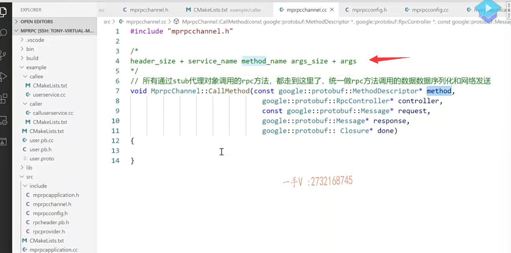
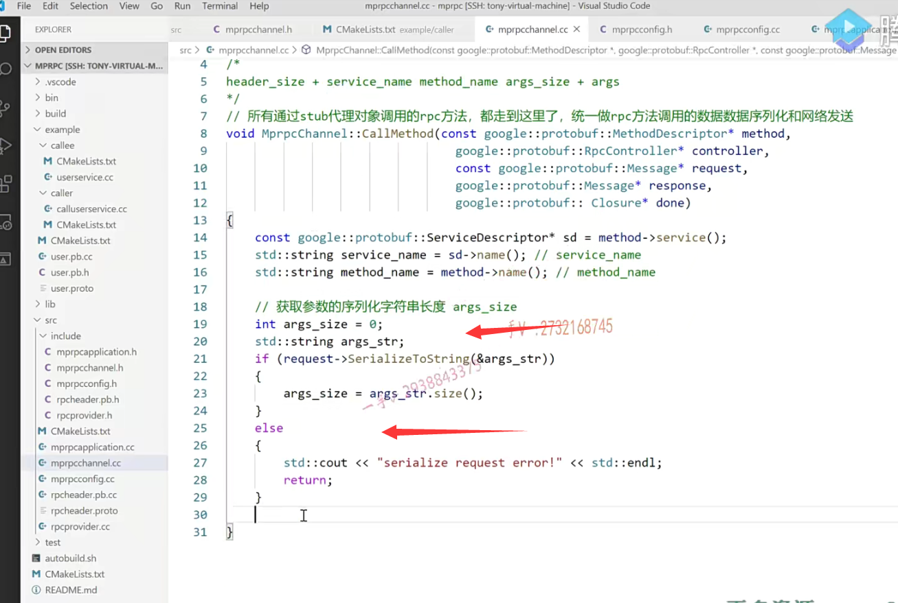

这节课呢，我想给大家把我们mPrPC框架的针对rpc方法，

调用方的这块代码逻辑写完啊。

为了系统的把这一块儿的过程呢，理解一下，我还是给大家从最终的这个调用的时候开始吧。

这实际上。大家都明白了，要生成一个代理对象，人家构造函数都已经决定了，

是不是需要接收一个实现了rpc channel这个抽象类的一个对象？对象啊

哎，然后我们就在框架中给提供了这么一个东西。

然后呢？你看调用这个login，

人家这方法都四个参数，一个是controller，一个是请求响应跟down。

==在rpc调用方这一端呢，这个回调没有什么用处。好不好啊？==

==呃，没有什么这个用处，我们可以直接给它传个空就行了==

==controller我们也没用，也可以传空==

### 我发起调用，所以参数肯定是我给

在这儿我想发起这里边儿，

我想发起一个login调用嘛，那我肯定就给人家怎么样啊？

我服务是我发起的调用那参数肯定是我给了，是不是？

request quest request啊request点。这个set name。张三。是不是啊？request点set杠pwd。一二三四五六。

这儿是不是就有了呃，

### 请求 不是我们给

然后呢？这是请求啊，响应响应，

我再定一个响应的对象。啊，response响应是我给的吗？

响应肯定不是我给了，

我发起调用，我知道我调用哪个方法，并且我把参数给你了，响应那得我把这个rpc的请求发给你，

你执行完了再通过网络给我返回回来呀。

是不是第一个是controller，我们传空？

第二个是request，我们传入把请求传进去。

第三个是什么response？

第四个是一个down啊，我们啥都不用管。

好吧，这就是一次rpc的这个调用了。

这是rpc方法的这个请求参数啊。

这个是rpc方法的响应。对不对？

然后这是。发起rpc方法的调用。这是一个同步的rpc调用过程。

那也就是说，这login底层就是我们传入的这个channel的什么方法的调用啊？call method的方法的调用。

## 一次rpc调用完成，读调用的结果

好不好？它将发起呢，这里边的数据序列化网络发送，

然后等待远程的这个rpc给我响应这个执行的方法，结果对不对？

哎。就这个过程，而这完了以后呢，能程序能跑到这儿来，就是rpc调用。完成。一次rpc调用完成。

读这个调用的结果也就是响应嘛。就是response是不是响应啊？

响应我们都知道了啊。

这个先看一下啊。f response.点。叫点什么东西来着？呃点result呃。啊，result是不是result呀？I result，然后点l code。

如果这个等于零。如果这个等于零。那就表示了有错误，

还没错误啊，这个得是我们约定好的，是不是啊？约定好在这里边儿。

这就约定好的。

因为加一些注释嘛，是不是啊？这个值为零，就表示没有错误，有零就表示有调用错误呢？对不对啊？在这儿。else这个如果是零，那就是调用。正确对不对啊？s tdc out.

这个是rpc login。这个response response。是什么呢？那就是response点。success值到底是登录成功还是没成功？用户名密码正确还是不正确？对不对？

这表示什么呀？这表示rpc login这个response.esponse error.这个error是什么呢？error就是response点，result code。是result。

result点error message。

我们打印一下好不好？success这个是rpc login方法的response成功了，这是error。啊air就打印一下air的信息。

这个逻辑过程能明白吧，这就是我们在调用一个rpc方法的这么一个过程。是吧，过程都是这个过程。

啊，至于你哪个方法，那你就看你想调用哪个方法，都是定义一个代理对象啊，传入一个我们的channel啊。

然后呢？你要调用方法，那你封装好，你想调用的这个方法的参数以及响应，

然后通过这个代理对象呢来调用这个rpc方法。

这是以同步阻塞的方式来调用的啊。

调用完了以后呢？这个等rpc请求响应的结果回来了以后啊，

在这儿呢，我们就会读到结果了，通过这个错误号，我就知道到底执行成功还是没成功，执行成功了。

这个方法的执行结果是什么？

如果发生错误了，错误的消息又是什么？

哎，我们这块儿都可以知道详细的这个结果的。这个没有什么问题了吧？

## Callmethod实现   去发送数据

啊，大家看一下这块儿啊。

好，那么开始写我们的这个什么地方啊？

就是call method。好不好啊？

大家先想一想啊。呃，在这里边儿这个过程我们应该都写哪些东西呢？

你都去做哪些事情？

### 之前约定好的消息的格式

在这儿呢，我们之前约定好的类这个消息的这个格式是什么呀？

是一个header size，加上这个service name method name还有args size，是不是再加上具体的args 数据格式，是这样子的吧啊，

那么在这里边大家来看看啊。

### headersize

==首先呢，header size那得是通过这个算出来的呀（就是通过后面的数据长度总和加起来算）。是吧啊，通过这个算出来的，==

### 先获取service name，通过method的service()方法获取服务对象

我们先来看service name，你要调用的这个方法是属于哪一个服务对象的，

那么在这儿呢，我就可以先通过这个method的什么方法呀？这个所属的这个service，大家来看啊。

通过method的这个service方法，

哎，我们就可以知道呢，这个方法是属于哪一个服务的，哪一个服务对象的，对吧？

哎，我就可以得到它相应的service name了嘛。

### 需要我们去回想下，之前map表的定义，熟悉一下

SD=my service。

okay，然后呢？在这里边。我来把这个string的这个头文件啊，包含上啊。

哦，这里边呢？都得加什么啦？都得加这个名字，空间作用域了啊

STD。string service name就等于SD点。应该是指向。name这相当于就得到了这个service name了。

对着没啊？那method内容呢？

STD.string measured name.name就等于这个method。指向的内容。对了吧啊。

这块儿呢service name有了，

然后这个method name也有了，

### 获取args_size就是这个参数的长度

还得有一个什么呀？args_size就是这个参数的长度啊，

那参数的长度我们也有获取参数的序列化字符串。啊，字符串长度art。size

获取参数的序列化字符串长度。

好的吧啊，在这里边儿呢，

你看啊，我们要进行一个序列化了好不好？

string arg s.这个STR。

然后呢？request这个就是request嘛？这个是呢，调用它的什么方法cereal lines to string.是不是series lines to string，

然后是args string 这表示，什么序列化啊？序列化

这表示序列化成功了。序列化成功了，我们就不打印了吧，

我们就做该做的事情在这里边儿，

是不是表示序列化失败了，我们打印一下啊。

嗯，cereal lines。request error.error啊，就是这个request好吧啊，出错了。这一般是不会出错的，我们在这儿加个这打印就可以了，

后边儿我们会把它改到日志上啊。日志的这个打印上。

呃，那这个就返回了，不继续向下了，既然序列化都已经失败了啊。序列化成功的话，序列化的数据就是在这个arg stl里边的。好不好？

这里边儿a LG ss刚开始等于零，那么这里边儿。就等于arg sst。l点4s。

### 定义rpc的请求header

那这service name，method name跟arg size是不是这三个参数都有了？都有的话，

那么这个rpc方法的请求头就出来了。是不是啊？

这是定义rpc的请求header，那就是mpr PC的诶。mpr PC.的这个什么呀？rpc header嘛，是不是？

rpc header.哎，我们叫个rpc。header没问题。

定义这样的一个header啊。

然后这个header的set什么诶？这有报错啊。那就是没包含相应的头文件呗。include mpr PC.叫什么呀？哎，不是叫。rpc啊，就是rpc header啊PB点h。

我们就叫了这么一个名字啊。

rpc header点set service name就是谁呀？就是这个service name。

rpc header点set谁？method name.

就是这个好吧，

还有rpc header点set arg size是谁呢？就是这个argc s。这个好了，是不是哎？

### 序列化头部，成string

把这个rpc I点填好了以后进行序列化，序列化成这个字符串啊。

args.呃，不是args，是header。是rpc header。STR啊，

这里边就是什么呢？要序列化呢啊这个点ce realize to string啊。

然后是rpc headers tr。这是成功，这是不成功，

不成功，我们同样打印一下啊。这request。ce realize.rpc header.

好吧，直接return啊。

在这儿如果序列化成功了的话呢，那在这儿我们也得到了一个变量了。

一个叫做int谁啊？在这儿我们都写把这个类型写的。清晰一点啊。

所以on on sand长度嘛，

这里边儿的字符的这个请求参数的长度不可能为负数啊，

我们就定义清楚这个叫做header size就头的长度啊。

那头的长度呢？就等于谁了？就等于这个的。4s诶就等于这个的4s。

那我们现在就都有了。

header size有没有记录的？就是这个的长度对不对哎？序列化以后的这个长度。这个有没有？这个也有了。是不是啊？

就在什么里边儿啊？这个有没有？service name.啊，

序列化嘛，对吧？都装在谁里边了呢？诶，对着没？

来大家看一看。呃，我们数据都有了没？

一上来先读取了service name跟method name。

然后获取了谁的长度啊？获取了后边儿这个数据啊，就是这个request的这个序列化以后的长度，这都有了。都有的话，

我们就可以填rpc header了。

这个填进来了，以后呢，进行了一个什么？

进行了一个序列化对吧？

哎，序列化以后数据的长度就是header size没问题，

这些数据我们现在就都已经有了。

都已经有了的话，这个数据就可以放在一个什么里边儿啊，放在一个字符串里边，然后把它给它发送过去了，对着没有啊？

### 组织待发送的rpc请求的字符串

发送过去了。这个发送过去的话呢，大家来看我们打算怎么去？发送呢，

怎么把它组织到一起呢啊？

来，这是组织待发送的rpc请求的字符串。

sdd.send rpc.STR，好吧。

首先。要像它里边儿，我们之前说了啊，这四个字节要按二进制来存储，

我们head size不要按字符来存储，按字符存储，你到时候解析的时候都不知道前几个字符是属于我们的header size好吧，

这是要调用到这个string的insert跟copy这个方法啊。

那么，在解析的时候rpc provider那里用到了copy，从string的开头读四个字节，现在我们要写四个字节啊。

#### 使用insert方法

那就是它的这个。insert方法了。insert大家注意一下啊，看看。看看这里边儿的这个。insert方法。给我们提供了哪些参数？你看它是有。重载方法的。insert这是有位置，有长度，有值是吧？嗯，是不是insert方法啊？好，我们看看啊insert。我们看一看啊，这是string的啊。嗯诶，我怎么找不到？到底是它的哪一个重载方法了？这个找的这个头文件，它也不对呀，是不是？嗯，我来想一想啊。它的这个insert就是从零开始插嘛？对不对哦？应该就是这个方法。

就是这个insert的方法。然后从零位置开始插插一个什么东西呢？

它的构造函数可以有。它构造函数就是插一个这个header size写四个字节。

它是应该要转成叉儿星的，因为这是字符串，四个字节应该是这个方法。

那大家看这是什么意思呢？这个就是从四呢rpc STR的零个位置从最开始写。

写几个字节写四个字节。写一个二进制的，一个header size，

把这个整数写进去，也就是说我们固定了这个字符串的前四个字节放的就是一个整数。

后面没有超过整数的范围嘛，对不对啊？

#### 再加上其他字符串数据

那然后呢？这个就是加了这个就是header size了对吧？

那接着呢？再放谁啊？接着就是放我们 rpc的这个请求头。

请求头呢，我们在rpc header str里边呢。是不是就rpc head？

这也有了，然后再加上谁呀？再加上最后的这个参数，是不是参数

我们在谁里边放我们序列化到了args_str。对了吧啊，放到这里边来了。就是args。

#### 打印一下数据

那现在我们把我们想发送的这个请求的这个参数，我们就都做好了，放在了一个字符串。

那我们打印一下呗。好不好？

打印一下就跟当时在这儿呢，我们加的这个打印一样。

发rpc的这个发送方，我们也打印一下。

以免到时候调试，万一出错了，我们不知道啊header size rpc header杠STR service=method name alg s STR。

没问题吧？打印的是一样的OK。

### 上面在做rpc调用方这个黄色

然后呢？接下来这个是相当于做了这么一些事情，在做什么呢？

在做rpc调用方这个黄色这一块儿事情，

在做数据的请求，参数的序列化。

那么我们终于把它打包到了这个send rpc str d

### 之后要做绿色的

现在应该就做绿色这一块儿事情了。

就是通过网络，

因为这也是相当于是rpc的这个调用端，发起端又不是给别人提供rpc服务的，

所以这里边儿。对任何的这个高并发都没有什么要求，这属于客户端嘛，

是不是我们进行简单的这个TCP编程就可以了？

好不好啊？

在这里边儿，我们使用tcp编程啊，使用这个TCP编程啊。这个完成rpc方法的远程调用啊。

### 使用tcp编程完成rpc方法的远程调用

那在这里边儿，我们首先呢，需要创建什么呀？

创建这个socket是不是哎？我们得包含了这两个头文件复制。

嗯嗯。这里边儿是首先是创建这个socket啊client fd等于这个是socket。

第一个参数是地址，家族的地址，家族的意思是不是啊af杠met，

第二个参数呢？这里边儿我们是TCP sock stream就可以了，是不是？sock stream就可以

第三个参数直接给零就行了。

okay吧啊，然后这里边儿。

就是大家可以经常man一下人家的这个说明啊，

返回值on success a few descriptor。创建成功的话，一个文件描述符就是一个socket啊。否则的话呢，负一。and air number is set appropriately.

这就是一个全局的一个错误号好不好？一般用于我们来定义问题的啊。

OK，那在这里边我们包含一下err。

负二点h if负一=coi。TF d

那么在这里边，我们就得打印一下了。arr no.error number一二二。no，

这是一个全局的变量，对不对？

==我们到时候出错了，就可以根据这个错误号儿来查询到底是个什么样的错误啊？==

这个是create socket.ke tl.air number是什么？

这个exit我们就退出了啊。exit failure.

好编译一下，别让它。它代码出现什么错误啊？

然后编译成功。

像有些同学呢，说是有红色波浪线，先编吧，没关系啊。有的时候呢，是工具反应不过来而已。

接着呢，该创建是不是sock addr了？来表示呢，远程的主机的IP地址跟端口号，

它用来进行connect。

好吧呃，这样吧啊，这节课的时间已经差不多了，那么同学们可以试着呢。

从这儿写一下啊，继续往下写一下，剩下的代码呢？

我们下节课来给大家呢。来继续带着大家来写一下，现在就剩这个绿色这一块儿了。是不是啊？绿色这一块儿了那么？

连接服务器，连接服务器以后呢？

然后呢？进行一个数据的发送就可以了。

好的吧啊，那这节课的内容就先给大家说到这里。