这节课呢，我们把之前写的代码呢，来验证一下啊，我们mprPC这个分布式网络通信框架

基本上是完成了啊，基本上是完成了。

呃，我们在example的callee跟caller下面呢，

也分别实现了rpc方法的发布以及caller下边儿的rpc方法的调用啊？

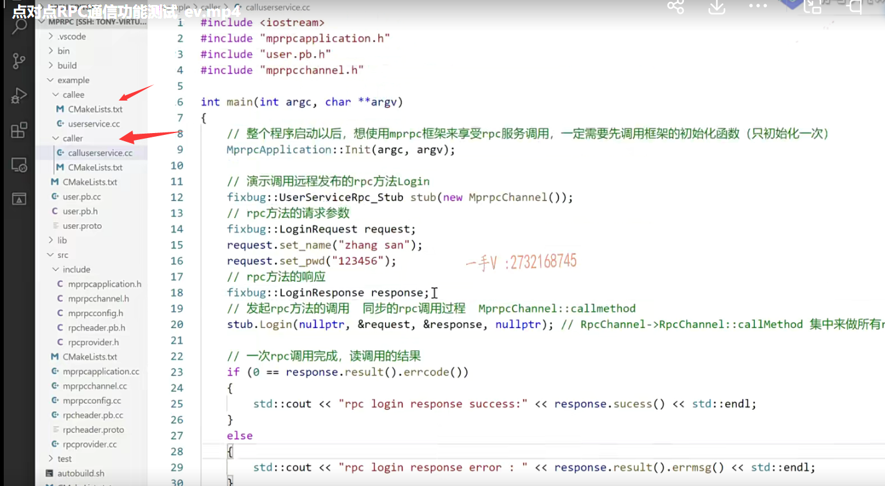

好来编译一下。哟，从编译这儿看到生成了这个框架，框架生成的是静态库啊，只生成了provider。

bin目录下确实只有provider啊，

没有我们的这个服务的rpc服务的调用。

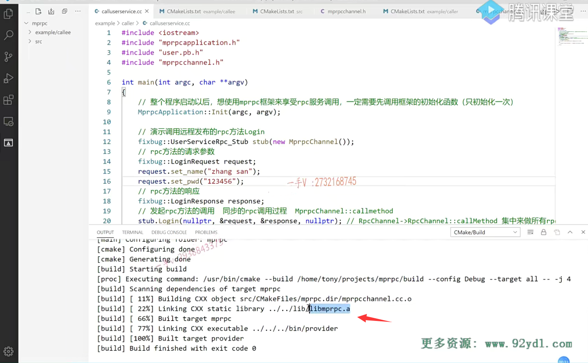

这个我们写了。

啊，应该是这个example根目录下的，这个cmakelists没有加子目录，是不是它就没有搜我们的caller啊？caller caller.

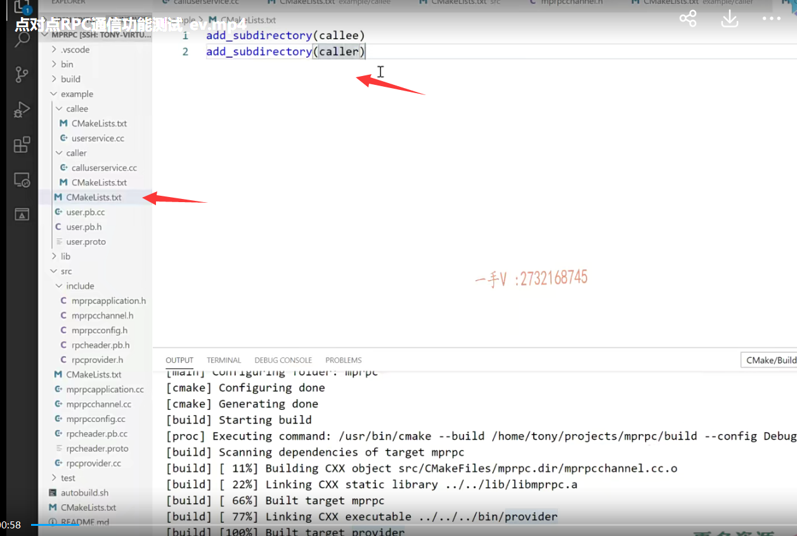

好重新编译一下。现在consumer也生成了啊，consumer生成了OK？

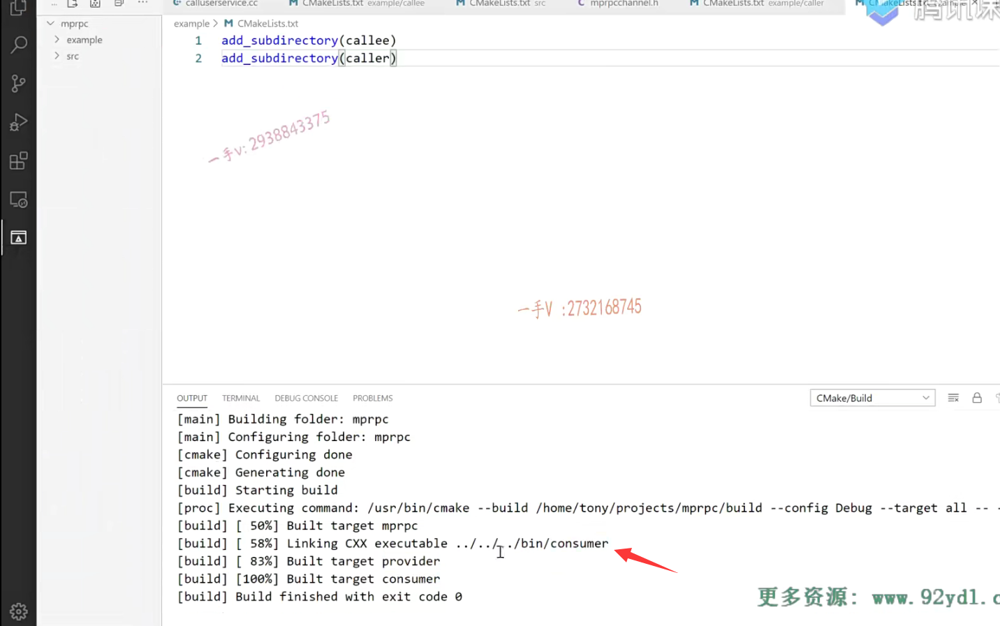

那么，现在我们来通信一下啊。我新开一个会话。嗯。那么，

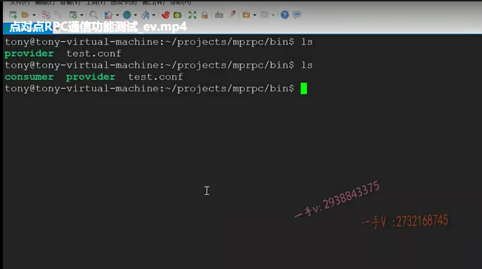

## 开这个服务器

在这里边儿，大家来看我上边儿开这个服务器啊。相当于发布这个服务的啊test点conf。

这相当于就是发布了一个user service rpc，这个服务对象里边的一个login方法啊。

## 启动一个服务消费

那在这儿呢，我们启动一个服务消费。

这实际上现在是一个网络程序，你把它们呃，这相当于运行在一台电脑的不同进程中，

或者你运行在不同的电脑中都可以。

啊，相当于发起一次远程的rpc方法调用啊。

那么，在这里边儿就是点consumer，

因为你光写这个也不行啊，

我们有get opt提示了这也需要一个配置文件啊，

配置文件我需要知道你这个rpc方法在哪里发布的啊？

后边儿我们会添加这个服务这个配置中心啊，

我们从服务配置中心可以拉取到我们rpc方法。在哪一台服务器上？

这块儿呢，我们现在也是先指定那个配置文件啊。

诶，看着好像是问题不大是吧？

能够调用成功客户端跟服务器这边儿都有打印啊。

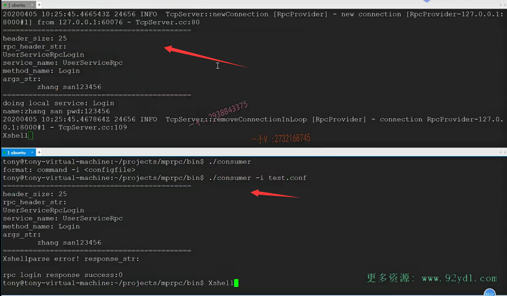

这个过程就是。

你看header size是25 rpc headers string，就是我们想调用的这个像调用的这个服务名跟方法名是吧？服务名，方法名，

这是参数啊，这是参数张三一二三四五六。对不对？

这是服务器接收到一个连接，这是muduo库打印出来的啊。

拍的这些东西。

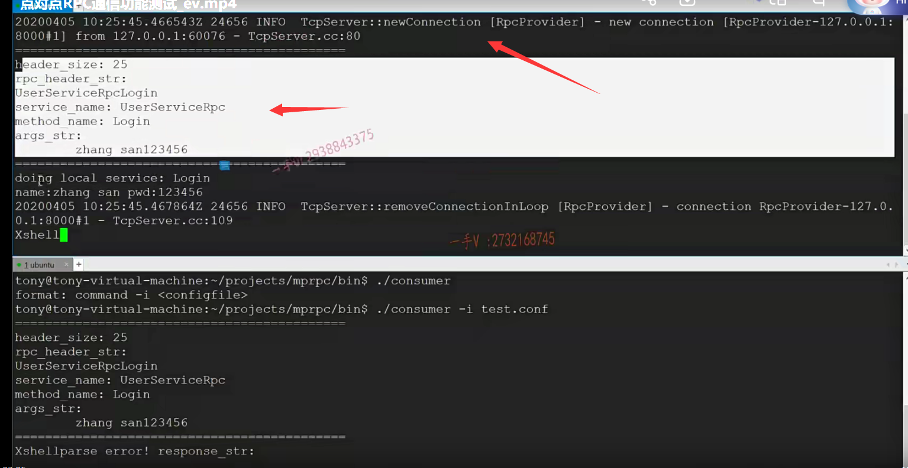

那你看doing local service login，

也就是说，当caller发起一个rpc调用哦，

在这里边框架能够成功的帮我们调用user service的logan方法啊。

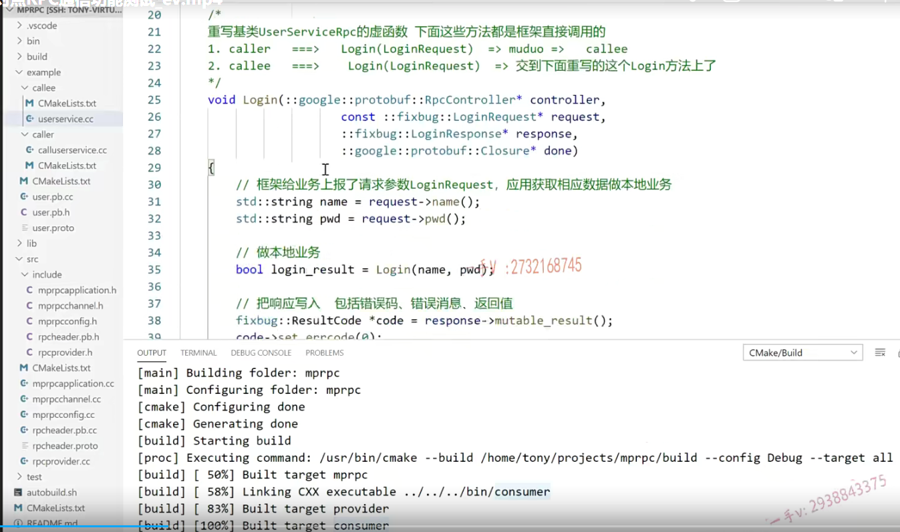

然后做本地业务，你看本地业务在这里边儿，我们的打印是不是都？调用到了，

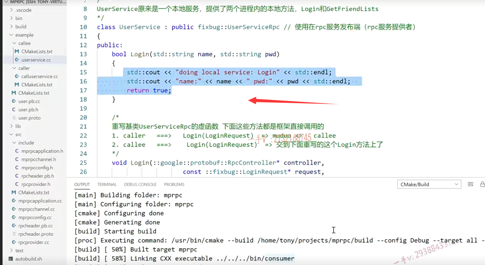

然后name是张3 password是一二三四五六。

呃，返回这个请求与返回这个响应以后呢？

我们的rpc provider就会主动的把这个rpc请求的这个连接关闭掉啊。

它是一个短连接的业务。

那这里边我们看到muduo库也打印了remove connection in loop啊。

那这个没有问题

### 再运行一次

rpc provider在这里边儿依然是在持续的运行，对吧啊？

依然是在持续的运行。

你看它又接受了一次rpc的这个请求的远程调用是不是

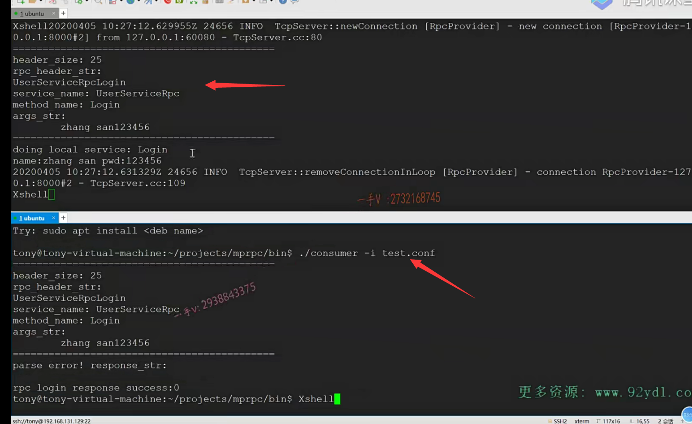

### 再来看客户端

再来看客户端啊？

有客户端，这里边怎么有一个pass error？

然后rpc login response success是个是个啥？是个零是吧？

这个好像不太正确啊，

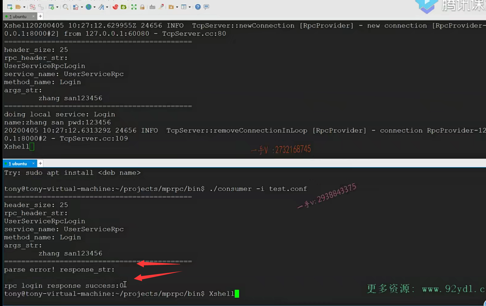

同学们，因为我们这个返回的是个什么啊？是个true true，应该是个一嘛，

对吧？

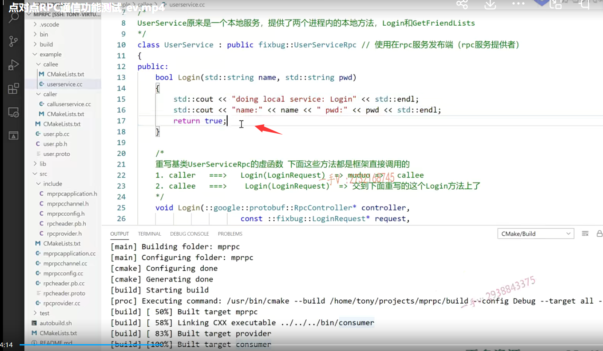

==我们把这个本地这个执行login本地业务的返回值已经写到这个response里边儿，发回给rpc的调用方了。==

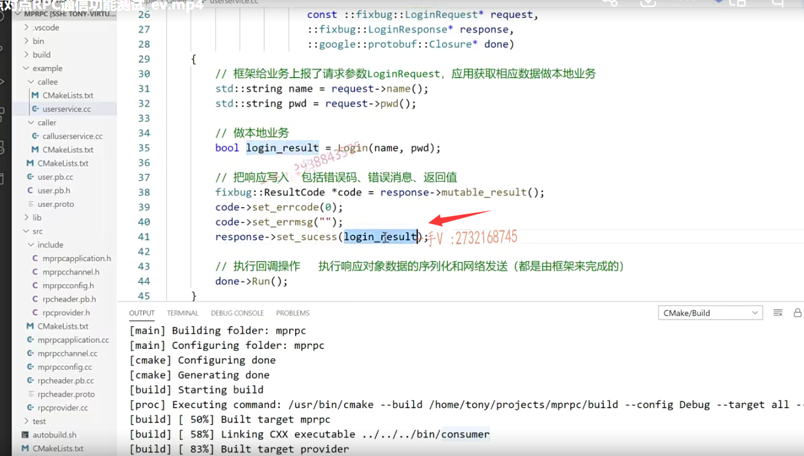

rpc调用方就是靠右的surface点CC里边儿这儿。读这个response。读出来是个零。

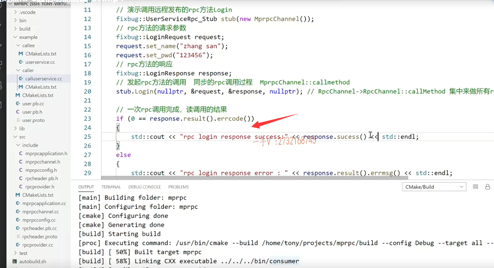

## client客户端数据处理有些问题

是不是那这儿我们就要考虑考虑了啊？看这里是什么问题是吧？

是接收的数据有问题吗？

我们来看一下接受的数据啊，接受的数据我们来看一下。

在116行这儿打个断点，我们调试一下吧啊。

哎，各位，我们现在就是调用是能够成功的，看起来rpc provider，这里边儿是非常完美，对吧？

### gdb调试看是否是接收数据有问题

但是呢rpc支持调用方就是rpc client的这一端呢，好像数据的处理有点儿问题啊。啊，不知道是接收的数据有问题还是怎么回事儿？

那我们先调试一下吧，你看这块儿就是接收的数据。是不是接收的数据呀？

我们在一一六行打一个断点，在mpr PC channel点CC里边。

这是服务器，是正常运行在这儿呢，我想调试一下啊。

gdb多用调试啊consumer。

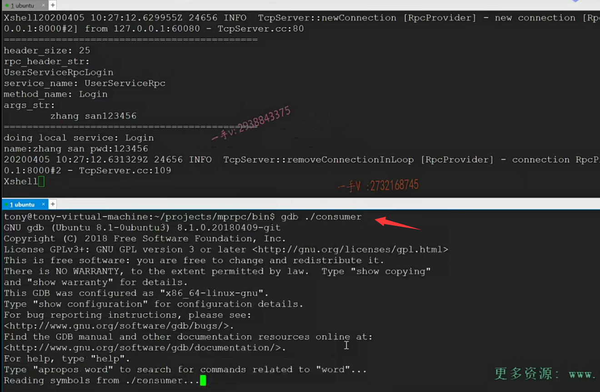

启动调试，然后break。这个是在mpr PC channel点CC。mpr PC channel点CC。多少行呢？幺幺六行啊，幺幺六行。

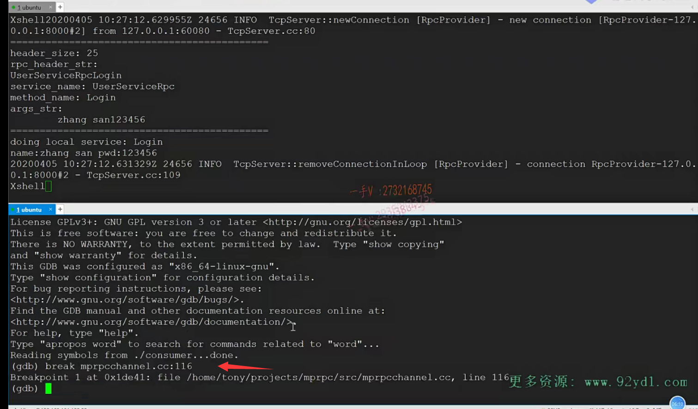

走，然后是run。test点conf。

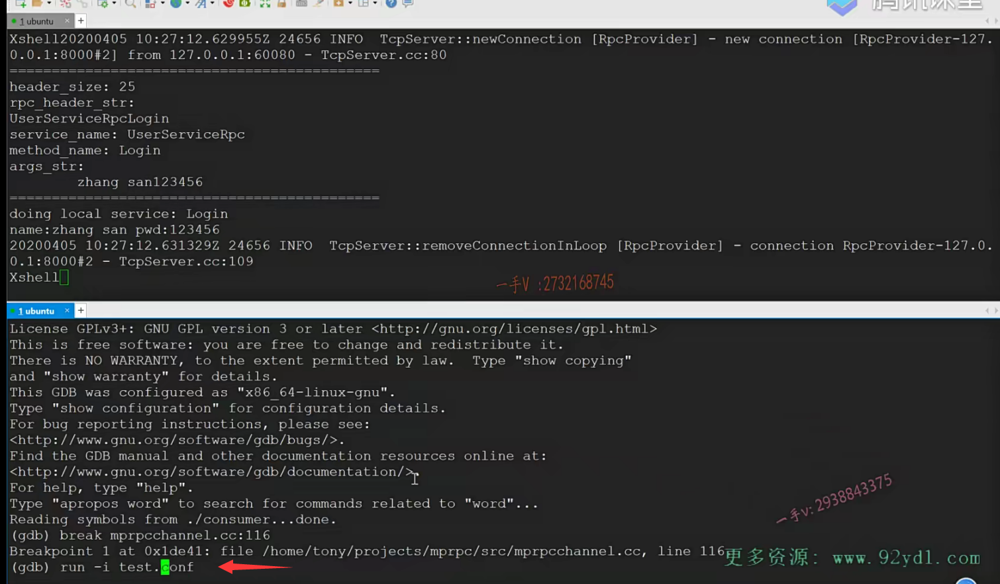

启动了，是不是启动了？

你看在response这一行了。

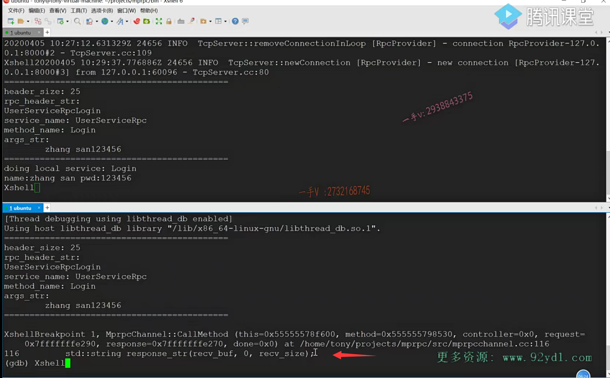

我先打印一下这个pre CV杠buf。

这是我们通过receive这个网络IO接口啊，接收的数据对不对？

看看啊，应该是没问题的，你看这儿最后有一个一就是那个success嘛，也就是说。实际上，我们在接收数据的时候啊，已经接收到了rpc方法执行返回的那个true了。

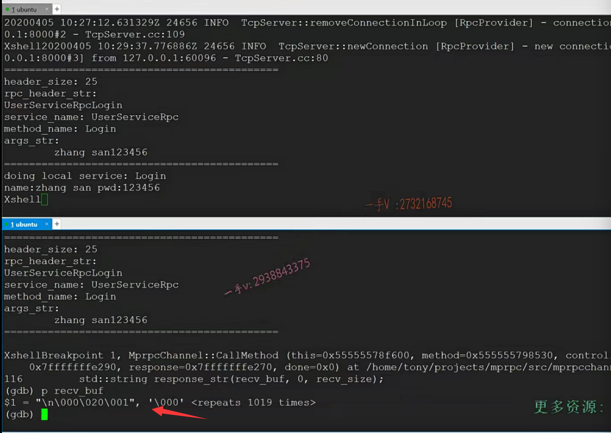

### 上节课这个mprpcchannel.cc这里少了一个取反

但是最后pass的时候呢？却出现问题了啊，却出现问题了。

这儿给大家纠正一下啊。这儿我们上节课写完以后呢，

我们这儿好像这个判断没判断正确啊pass from string。

我们上节课这少了一个取反问号啊，

我结束上节课视频的时候突然看见了。这个是呃，true true的话是这个反序列化成功了啊，我们这是反序列化失败，对吧啊？失败把这个取反加上啊，这个不要忘了，这里边儿给大家纠正一下啊，纠正一下，这是我们上节课呢。呃，没有这个取反的符号，判断错误啊，

没有判断正确逻辑不正确啊。

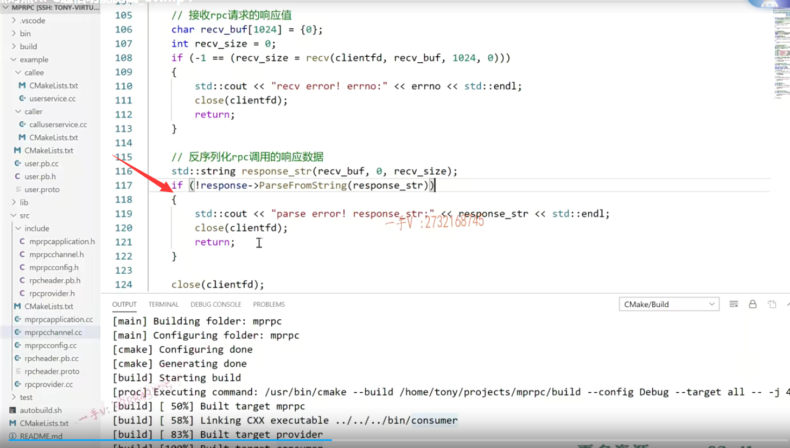

看来也就是说，这个receive这里啊，接收的这个叉buffer接收的数据应该是没有问题的。

是不是最后有个一？

什么意思呢？就是你看它这个。响应的数据最后一个嘛，最后一个就是这个success嘛，对不对

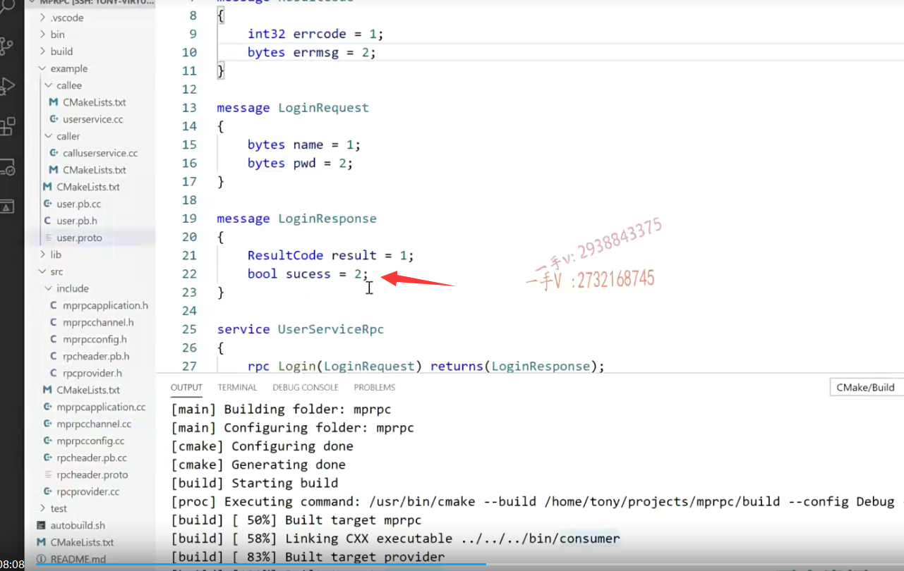

### 打印response_str看一下

然后接下来就是用receive buffer 0 receive size来构建一个string类型responses tr response。

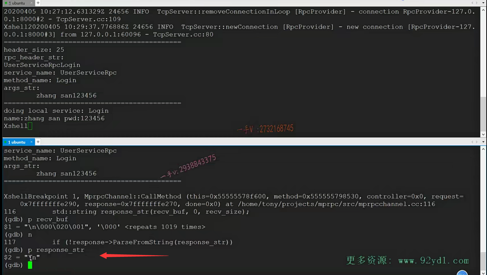

哦，同学们，有没有发现问题？看看这里边好像不正确啊。

这个receive buffer里边啊。人家有这么一床数串儿数据呢，后边儿是零杠零都是杠零。啊幺零幺九，我们总共是幺零二四个。对不对？

那就是四个字节。四个字节pre CV size。是四个字节吧，哎，是四个字节，

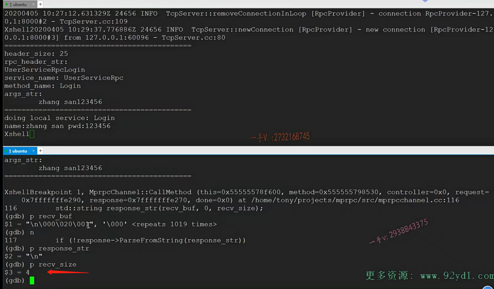

### 错误：叉buffer里间遇见杠零  最终在string这里边儿只是存了一个杠n

你看。但是用它用这个叉儿buffer构建的这个string，

为什么只剩一个杠n了？这个不正确。

这个可能跟string的这个构造函数有关的，

各位同学啊。它的意思就是说呢。

从这你给的x buffer里边。这么长的长度来构建这个response STR这个string对象的时候啊，

如果在这个叉buffer里间遇见杠零，它就怎么样啊？

它就认为字符串结束了，

所以最终在string这里边儿只是存了一个什么杠n，那这肯定不正确啊，

你要从这个字符串里边儿反序列化，生成这个response对象。

### string的构造函数搞的鬼

你肯定要拿这个，是不是进行反序列化啊？

那你现在response ST 2只有一个杠n。

那我们从它的这个现象调试，我们就能推断出来，

这肯定是string的构造函数搞的鬼啊，它遇见/0，它就结束了，

所以它只存了一个杠n。

那这肯定不正确，这肯定出错，这能对才怪啊。

### 

所以呢，在这块儿呢，我们通过运行啊，调试我们发现呢，

在我们框架支持rpc调用客户端这一块儿呢，还是有一些问题啊？

那在这里边儿这是出现问题。

rpc这是有一个bug。对不对？一个bug啊？

出现问题，而且有buffer中遇到杠零，后面的数据。就存不下来了。导致反序列化失败。

对吧啊，导致这个反序列化失败了。

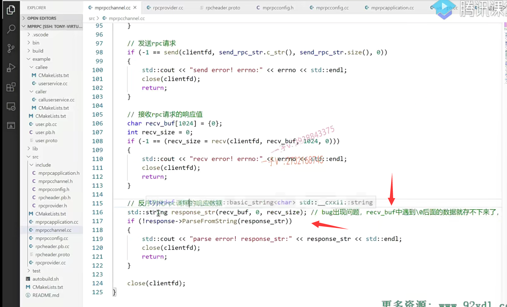

### 不去从字符流解析，而使用字节流，从string改为array

所以呢，这里边儿这个问题的话，那我们就不要中间这个东西了。

人家pro to buffer可以支持字节流，或者是这个字符流的这个序列化跟反序列化都行啊。

嗯，它还有一个方法，那我们既然前边儿是用数组接收的，那我们直接用它吧，你看pass就是pass from别from string了，

我们直接from array。

从数组来，一个是数组的起始地址，另外一个长度对吧？

数组的起始地址就是receive buffer嘛？长度是不是就是这个receive size呀？

哎，我们不用这个receive char buffer来构建一个string，它这个构造函数啊。

嗯，存在存在问题啊，存在问题receive buffer。来这样修改一下，我们看看怎么样？

这样的话，它就不会说是只去处理杠铃了，因为我们指定了是不是长度啊，

它肯定是要从这个数组的，这么长的数据里边儿进行一个pro to buffer的这么一个response对象的一个反序列化啊。

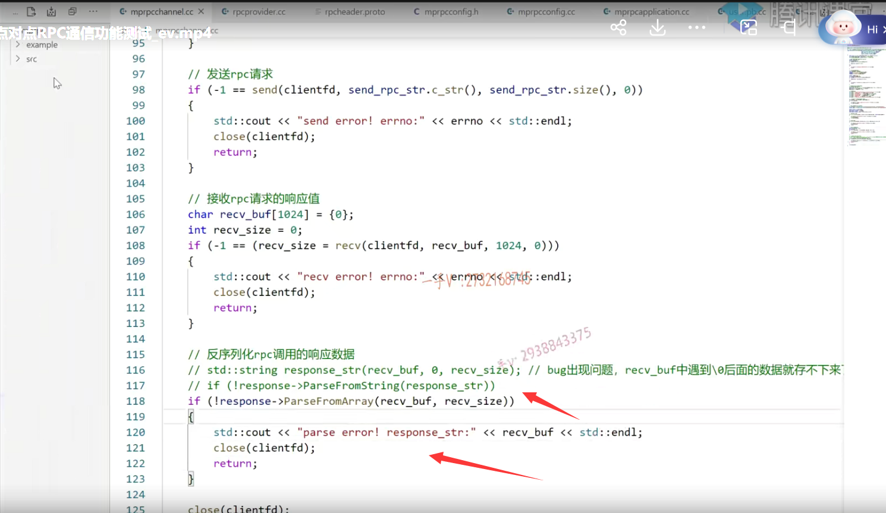

试试试啊。嗯，重来启动。

### 删一个进程

是already in use PS杠u。q杠九。把这个先关掉啊，二四六五六。二四六五六。

还有我们这个服务端这块儿得处理一个信号啊。

然后呢，当我们ctrl c的时候呢？相应的把这个服务器关闭掉啊。PS杠u没了啊，没了

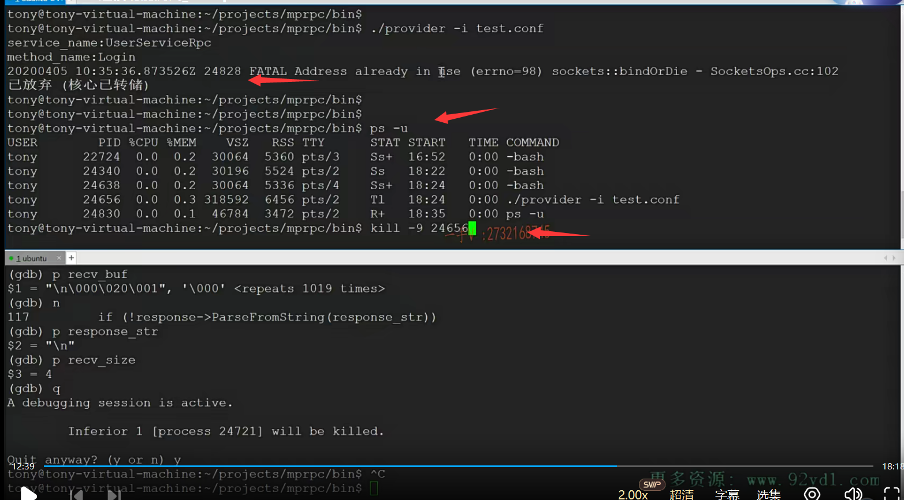

我重新启动。来启动了。

然后这块儿是consumer杠I test test conf。

走诶，看到了吧？

rpc login response success。请求成功了吧？请求成功了，

这是一啊。

### 改一下服务端的返回值再来验证一下

那你看看我们在改一下，我们把这个服务端的这个。

假如说我们服务端现在不是返回true，而是返回什么FALSE？对不对啊？返回FALSE。

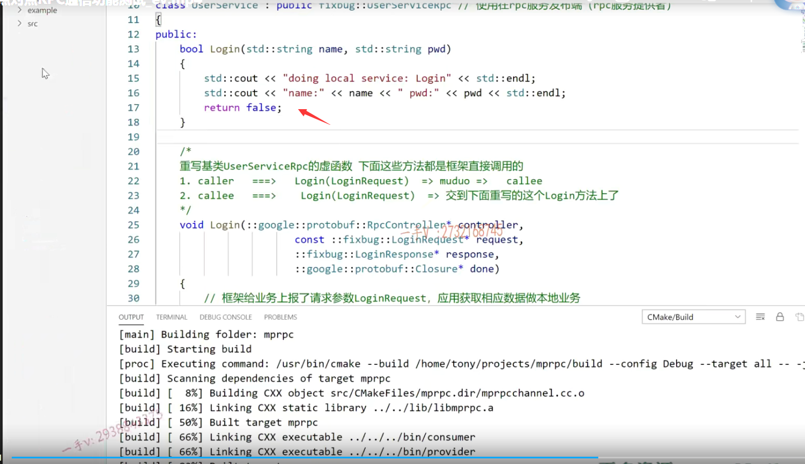

我们来看一下。

那这时候rpc请求的这一端接收的响应，应该就是个零了，是不是？

走走着。哎，这儿就是零了。那这没有问题，

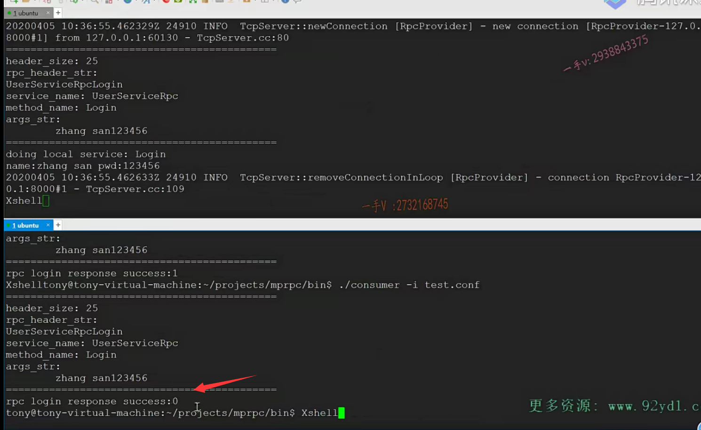

那到现在呢？我们就验证成功了，

我们通过验证呢，我们发现我们代码框架代码上呢，

在处理啊rpc调用就是位于rpc client客户端角色的这一块儿呢。

还是存在一些问题的啊，就是数据反序列化的问题，对吧？

这主要的问题是在于string的这个构造函数我们本来是想用它的这个pass from string这个方法进行反序列化。

嗯，但是呢，我发现它的这个构造函数呢。不对啊，

遇见receive buffer这个处理的过程中还没有处理的这么长这个字符数据的时候，

遇见杠铃，它就已经结束了，对吧啊？

我们用它的pass from array呃，

## 在模拟一下，假如响应  是错误的

再模拟一下，假如说这个出错了啊，出错了。

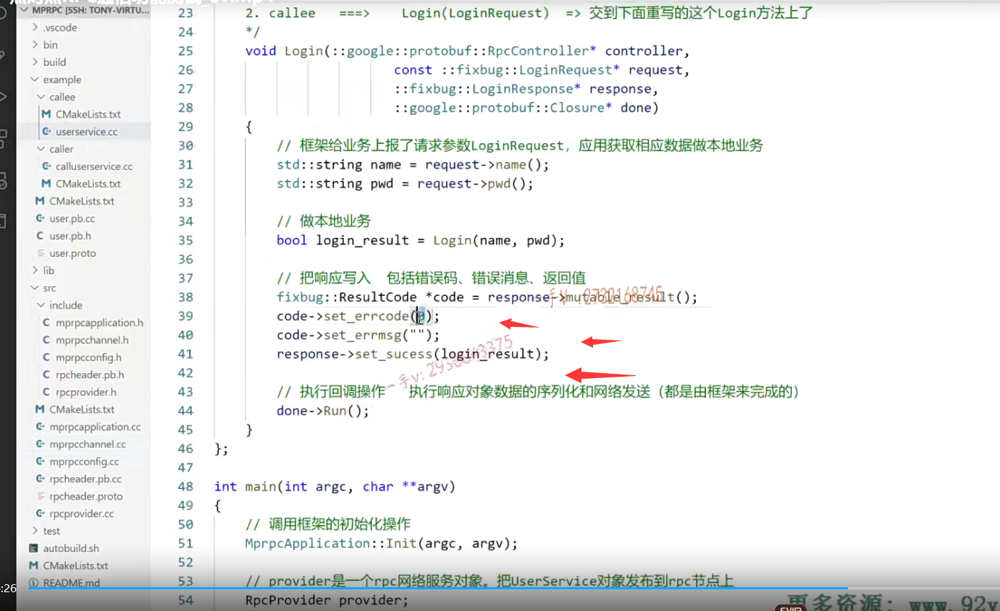

这个是login。这个login do error。就是login方法出错了，对吧啊？

login方法出错了。

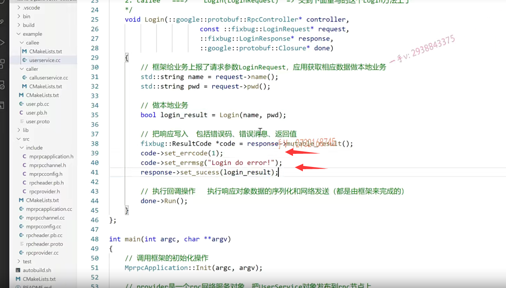

哦，我们看看这个消息能不能打印出来？那就应该进进哪个分支了？

进这个else分支了rpc调用方法的这个这个分支了啊？

就没有什么response success了。对不对？

应该是response error，

然后我们打印这个错误信息。啊，重新编译一下。

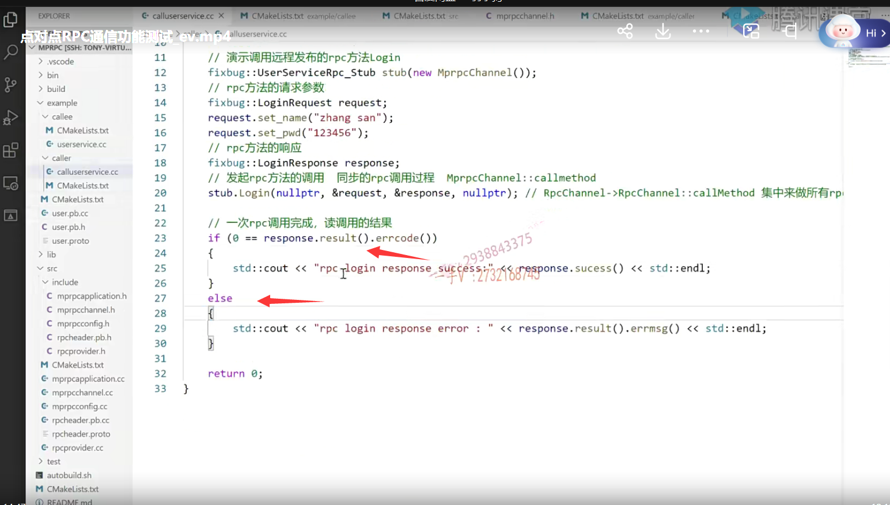

OK，启动这个rpc，发布一个启动一个rpc节点啊，发布服务对吧？

这是应该是最正确的描述。

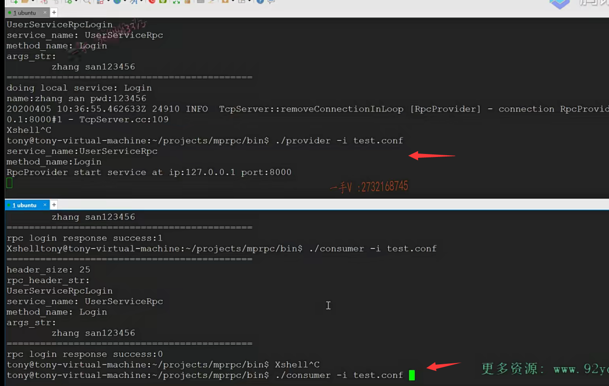

### 果然返回错误

然后再发起一个rpc方法的调用。

你看rbc login response error log into error，

这是不是就拿到我们的这个？

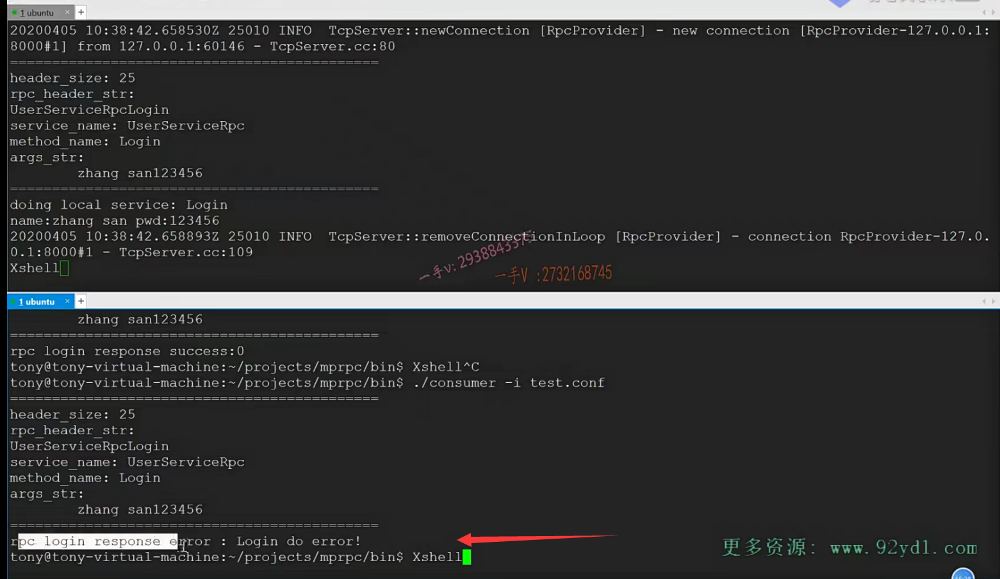

那就说明我们一看这儿就知道远程方法，

在执行的时候它出现错误了，这是错误消息。对的吧

嗯okay，那我们说到这里的话呢？那也就把我们的框架的功能验证了啊，

到现在呢，就没有什么大的问题了。

==好吧啊，我们到这儿终于呢，把我们的。这是成功的，我先把这个恢复一下啊。==

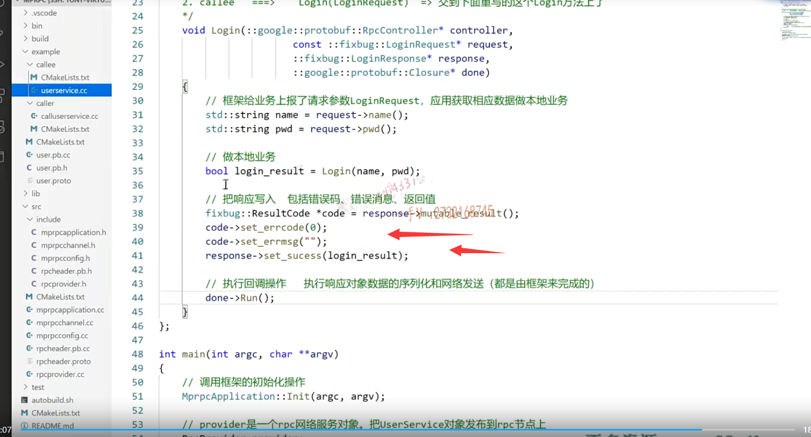

同学们，可以自己加任何的数据进行验证。

按照现在呢，我们基本上来说，把我们mpr PC的这个框架啊，

除了这个服务配置中心zookeeper

其他的功能呢，就都完成了，

我们现在这个框架支持直连的rpc点对点的通信。对吧啊，

而且rpc服务这一端呢，是基于muduo库的一个高性能的网络服务器，

one loop in thread 一个典型的reactor模型，对吧？

可以支持高并发的rpc请求。

使用起来也特别简单。

这个我们是提供提供的是以静态库的方式呢，对外提供服务的，

为什么静态库不是动态库，因为我们的muduo库是一个静态库。

对吧，我们编译动态库so库的时候呢？

这个muduo库是连接不成功的啊。

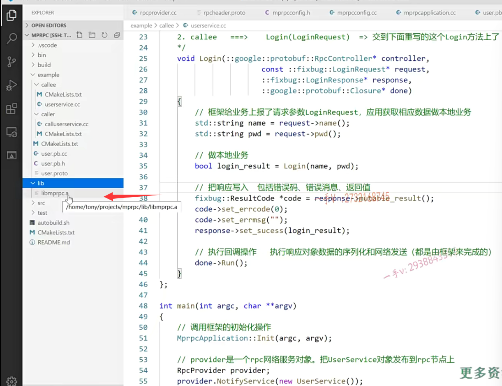

那你要想把它，我想把我们这个框架变成so库的话，

那你得先重新编译muduo库，生成相应的这个so库，我们再去连接它啊。

呃，生成这个静态库也有好处，

静态库嘛，相当于这叫mpr PC把muduo库的这个东西呢，也就拉进来了。

啊，你如果在一个linux服务器上来部署一个rpc服务，

你在那个linux服务器上不用装muduo环境也行muduo库的环境也行。

OK吧，那因为呢？这个是直接怎么样啊？

因为我们直接把muduo库都已经拉到我们框架里边儿了，静态库嘛。

## 总结

OK吧好。那么希望大家呢也做一下这个框架的功能性测试。

好吧啊呃，下节课呢，我再给大家来基于我们这个框架，

再去举一些调用的例子。

啊，举完例子以后呢，我再给大家来画一张图，

再帮大家来梳理一下整个儿框架的这个调用过程。

然后我们给大家就开始讲这个日志模块。

还有这个服务配置中心，我们现在这个项目还缺两个非常重要的模块儿啊。好，那这节课的内容我们就先给大家说到这里。