各位同学，接下来的时间呢，我给大家讲一下啊，

这个把这个日志模块儿加到我们当前的这个mpr PC框架项目当中。

那么，大家来看这个圆圈儿，我们表示的是mprPC框架。

这个框架呢，是给别人用的，让我们把本地的服务发布成远程的这个rpc服务对吧啊，

这个大家已经应该不陌生了啊，

框架里边儿两个非常重要的类就是rpc provider跟rpc channel啊。

这里边儿在运行的过程中呢，我们会有很多的一些正常的输出信息跟一些错误信息，对吧？

我们不可能都cout 打印到这个屏幕上啊，我们运行时间长了，那屏幕上输出的信息特别多，对不对？

啊，如果万一有什么问题呢？我们也不好定位呀。是吧啊，

这真真正正用起来的话，可不是说出问题了好哎，你这个错误别过去，等我打个断点给你调试一下。没有那条件是不是啊？

没有那条件，当我们这个软件版本发出去以后呢？别人用的时候呢我们一般出问题最直接的方式就是看日志啊，看日志，

所以对于一个比较正规的项目来说，日志模块儿，日志系统是不可或缺的。

好吧啊，这里边儿就说一下日志的重要性，对不对啊？

## 日志的重要性

日志呢可以记录一些正常的软件运行过程中出现的一些信息和一些错误的信息，

当我们定问题的时候，我们就打开相应的日志，我们去搜索一下错误日志就可以了啊，

就大概知道呢，问题是出现在什么地方了？是在什么情况下出现的问题啊？好，大家来看一下啊，

那假如说呢，我们后边儿呢，我们输出一个日志模块儿的话呢，我们想把这个框架运行过程中所有的一些正常的信息以及错误信息都记录在日志文件当中的话，

我们应该怎么做？

首先呢，这是我画了一个非常简单的图，

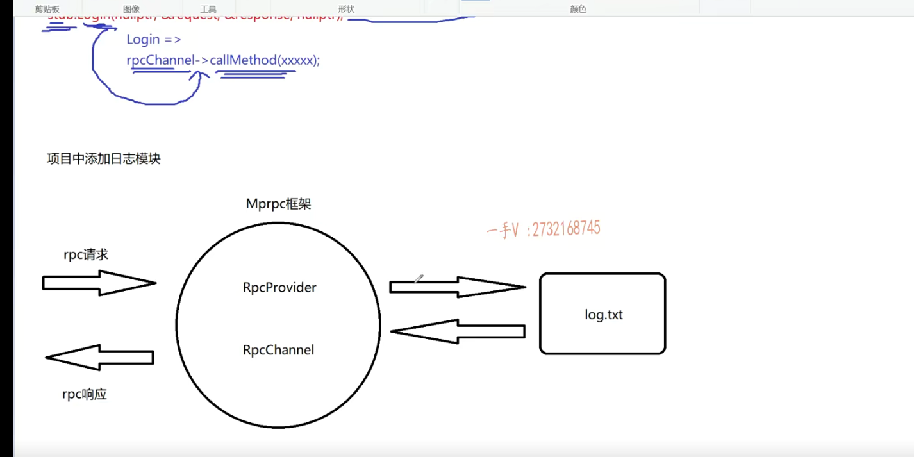

这两个箭头表示一个rpc请求跟一个rpc响应啊。

rpc的这个请求跟一个rpc的响应。好吧，

### 写日志的过程是一个磁盘lO 速度不快

那么大家注意一下啊。这个请求过来了，以后呢，我们在执行这个处理请求的过程中，我们可能会生成很多的日志文件，

我们要写日志，但是大家注意啊。

这个写日志啊。写日志信息，写日志的过程是一个磁盘lO。对不对？

磁盘lO快不快呀？不快，

你不能够说是把磁盘IO的这个花销算在我rpc请求的这个业务执行过程中。

那这样的话呢，我这个rpc的请求的处理过程呢，效率实在是太慢了，因为你这里边儿加了很多的磁盘IO操作，因为你写日志了嘛。对吧，

### 不能够说是把磁盘IO的这个花销算在我rpc请求的这个业务执行过程

所以我们一般上是不可能直接把这个框架上产生的一些日志，或者说是我们这个框架提供的日志模块儿，我们应用也可以用我们框架提供的日志啊。

日志模块儿来写日志对吧？

我不可能把日志花费的时间算在我们业务的执行过程中，对无无形中就是在业务中增加了磁盘lO操作这是很慢的。

### 一般在我们服务器的环境中都会增加一个比如说像我们这个卡夫卡

好了吧，所以一般在我们服务器的环境中都会增加一个比如说像我们这个卡夫卡啊，卡夫卡一般嗯，就可以用在这个日志系统中做一个中间件的一个消息队列。

所以也就是说，一般呢，我们都是会这样子做。哎，一般我们都是会这样子做。

就没有这个箭头儿了，我不会说是业务直接是花费磁盘lO去写日志信息啊，

我一般都会这样做就是我的进程呢？一般都会把这个日志呢？

我画一个竖的吧，好不好？画一个竖的啊？

==把日志呢都写到这个所谓的队列里边。==

==哎，这个队列相当于就是一个异步的日志写入机制啊，==

==这是一个队列。这是一个异步的写入机制，==

### 这是一个队列。这是一个异步的写入机制

那也就是说呢，在这儿啊。

在这儿，我们的应用程序呢？

在这里边儿啊。主要做的就是写日志，它不做磁盘IO操作，它在这里边儿不做磁盘IO操作了啊，

这个磁盘IO操作呢，是在这儿做的，

我一会儿来。这个写日志信息，

==只是说把这个日志信息呢，从这儿添加到哪里呀？添加到这个对尾。==

==就是像内存的这个一个缓冲区队列里边去写日志信息就行了。==

啊，这个是非常快的，这是一个内存操作啊，对不对啊？

==然后呢？我们这里边儿专门有一个写日志线程，哎专写日志线程。==

==专门在这里边儿啊。它做的就是这个磁盘IO操作啊，磁盘IO操作呢，==

==它从对头里边儿啊，去它从对头里边a拿这个日志信息，==

==然后把这个日志信息呢？写到我们日志文件当中。==

==这样一来呢，这里边儿写日志的这个磁盘IO就不会把它的这个消耗花费在我们rpc请求的业务处理过程中。==

没问题吧呃，这就是一个最基本的一个我们这么一个日志模块儿，

这么一个设计。大家能够理解意思吧啊。

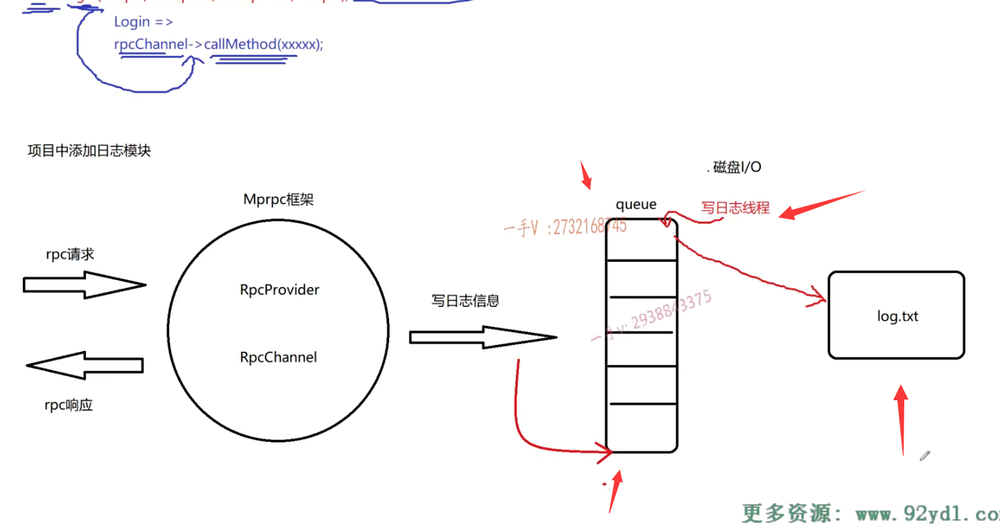

### 多个线程会写日志信息

### 多个线程都会在这个缓冲区队列里边儿去添加数据

而且呢，大家注意啊。

在这里边儿，从刚才的这个使用环境过程中，我给大家引出了在写日志过程中为了提高呢磁盘lO服务的这么一个消耗对吧啊？

那么在这儿呢？我们引入了一个缓冲区队列，

那么注意mpr PC框架的rpc provider端，它是用muduo库设计的啊。

它采用的是epoll加多线程的，那也就是说呢，

我们很有可能rpc请求的处理过程是在多个线程中都会去做一个rpc请求的处理过程，

也就是说多个线程都会去写日志。多个线程会写日志信息，

那么也就是说多个线程都会在这个缓冲区队列里边儿去添加数据。是不是添加数据啊？

所以这个队列queue必须保证线程安全。

那么当然，我们C++里边儿有直接有queue这么一个队列，就是属于这个C++的这个容器对不对？

很遗憾的是C++里边儿的容器并没有考虑过线程安全

但是呢很遗憾的是C++里边儿的容器呢，只是从功能上提供了一些容器，并没有考虑过线程安全。

C++里边儿容器呢？这就这queue，不是线程安全。

### 得用线程的这个互斥机制来维护这个queue入队的一个线程安全

所以我们首先呢，得用线程的这个互斥机制来维护这个queue入队的一个线程安全，

入队包括这个出队这多个线程在做，我们写日志的线程也是一个独立的线程，对不对？哎。

所以呢，这个你必须得保证。是不是啊？

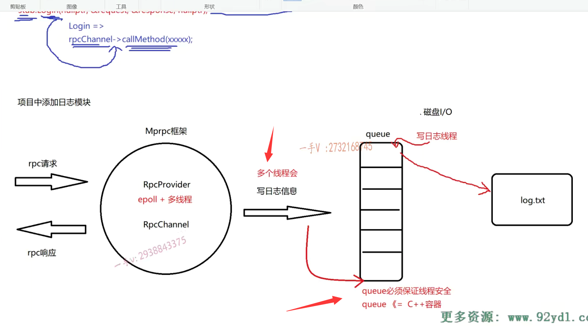

另外的啊，另外的第二个就是那保证这个队列的线程安全，

这个简单就是引入一把互斥锁就行了，

大家去争这把锁。是不是啊？

这个多个线程写日志往队列里边儿写日志的话，

你争到所你就写。呃，这个写线程日志呢？这个就是争到写，

你从队列里边儿拿信息，拿日志信息是不是往文件里边儿写啊？

大家注意啊，注意这队列，如果是个空着的话。

队列如果是个空的话，也就是说之前放的日志呢，都已经怎么样了？

都已经写文件写完了，是不是啊？

那么，这个写日志线程用不用老是在抢这把锁呀？用不用老在抢这把锁啊？

抢这个队列的互斥锁，不用了，对不对？

你队列如果已经为空了。对吧，你还老抢这把锁。那你就没什么意思了。是不是。

你抢了这把锁，抢了以后呢？队列也是空的，你也没有东西可写。

你还因为你占用了这把锁，导致我们这个rpc处理过程中呃所涉及的这个工作线程在写往队列里边儿写日志信息的时候，

由于无法及时的获取锁而导致这个信息无法及时的写到队列里边儿，

拖慢了我们rPC请求处理的这个业务的这么一个效率，能理解吧啊，

### 队列为空的时候，优先获取锁的时候应该是我rpc请求的这个epoll的这个工作线程

### 写往队列里边儿写日志信息的这个线程

就说队列为空的时候，优先获取锁的时候应该是我rpc请求的这个epoll的这个工作线程，写往队列里边儿写日志信息的这个线程，优先抢到锁队列，

### 单单引入一把互斥锁的话，是可以解决问题

如果是空的话，你这儿就别抢锁了，你就一直等待着吧。

好吧，能够理解我意思吧，

==也就是说这个队列单单引入一把互斥锁的话，是可以解决问题，==

### 但是我觉得效率不是很高

==但是我觉得效率不是很高，==

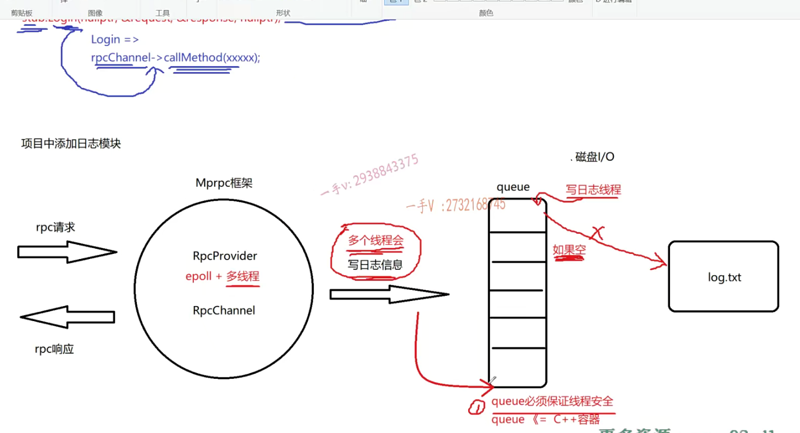

### 效率不高的原因

==因为队列为空的时候呢，你这个写日志线程，它不应该去抢锁，==

==它抢锁就会拖慢我们这儿的工作线程往队列里边写日志的这么一个时间，==

==这儿拖慢了，也就意味着rpc请求的处理过程时间变长了。==

### 这里边儿还会涉及我们线程之间的这个线程间的这个通信

这是对于一个高并发的一个rpc服务节点所不能接受的事情，

==所以这里边儿还会涉及我们线程之间的这个线程间的这个通信。==

这是我们要处理的第二个问题。

### 用到了线程的互斥，线程的通信

队列如果为空写日志，线程应该是一直等待啊。

队列不空的时候呢，是不是你才有必要是不是去抢锁，

然后从队列里边儿拿东西，是不是去写呀？

==所以这里边儿用到了线程的互斥，线程的通信啊，都用到了，==

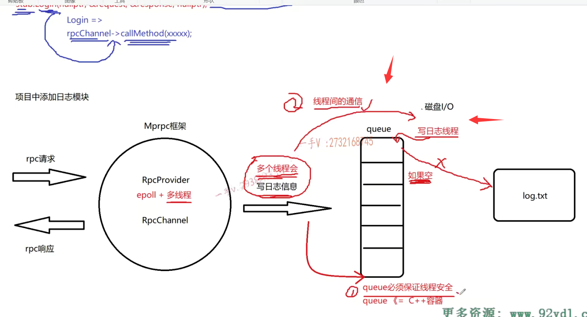

### C++11提供相应的mutex跟condition variable

在这儿我们就不用linux的这个本地的API了，

实际上我们最终用的还是linux的本地API，

==只不过C++11呢，这个提供相应的mutex跟condition variable就是条件变量啊。已经这个在语言级别已经封装好了。===

好吧，这个呢，在我的C++高级课程里边儿已经给大家讲过了啊，

所以我们在项目中直接使用就可以了。好不好啊？

==这是日志在这里边存在的问题啊。==

## 日志文件编写

### 日志文件直接写在当前目录下

另外呢，就是我们写日志的话呢，我们就直接写在，日志文件直接写在当前目录下，当前目录下啊，

日志直接写在当前目录下就可以了啊。

或者是你当前目录的下的这个log文件夹里边儿。

OK吧啊log文件夹里边儿。

### log.点TXT以这样的这个命名组织这个日志文件

另外的话就是。嗯，我们写文件的时候，

我们以什么？二零二零年。啊，或者说是二零二一年啊，二零二二年。

啊，这么一个几月几日，是不是10月1日？

这个log.点TXT以这样的这个命名。

啊，来这个组织这个日志文件好吧，

那每一天我们都会生成新的日志文件的啊。

有助于我们在发生问题的时候，是去快速的去找到问题。

好不好啊？

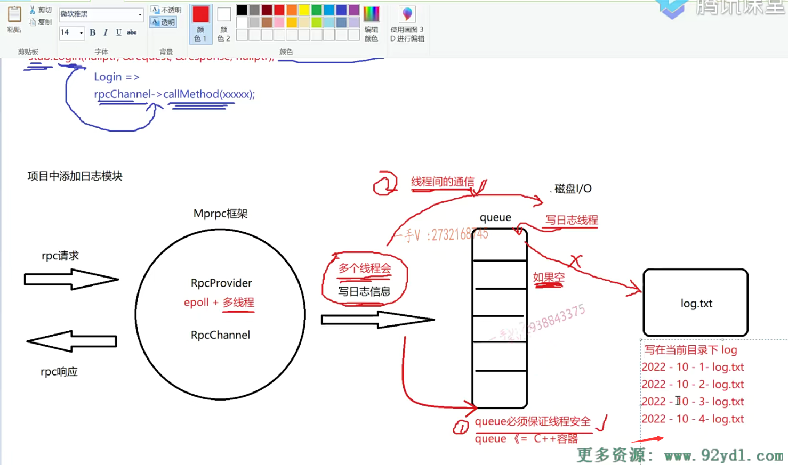

### 如果我们的系统产生的日志信息过多

你不能把日志文件写到一个是，日志信息全部写到一个文件当中。

而有的时候，我们在设计文件系统的时候呢，

如果我们的系统产生的日志信息过多的话啊。

那比如说我们每一个日志文件呢，不能超过20M，如果超过20M的话呢？

呃，我们会产生新的当天的日志文件信息，比如说是四杠，一杠log。

还有这个又超过写的时候又超过20M了，那么就会是一个四杠二杠log。

那基本上都是这样的这个机制。

好的吧啊，基本上都是这样的一个机制。

没问题吧啊，我们就不用处理的这么复杂了，我们是按天给它存日志就行了好不好？

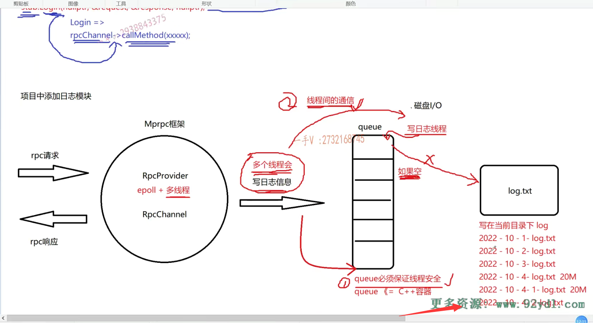

### kafka介绍

在我们这个项目当中。

像这个在我们分布式环境中啊，

像这个开源的这个卡夫卡是非常著名的，对吧啊？

非常非常著名的，它本身就是一个分布式的消息队列，

它其中的功能之一就可以在我们分布式环境中这提供一个异步的这个日志写入的这么一个服务器中间件，日志写入的这么一个。好不好啊？

其实呢，就是跟我们这儿queue的这个本质是相同的，

只不过人家的设计比我们要复杂的多，高效的多以及有高可用性就是容灾好吧啊，就稳定的多。

那这个卡夫卡在这里边，我们就不再给大家深入了啊，这只是一个介绍性的东西，为了大家扩展大家的知识面，

大家可以去在网上去查一查啊呃，行，那我们这个日志的这个系统的设计就是这个样子。

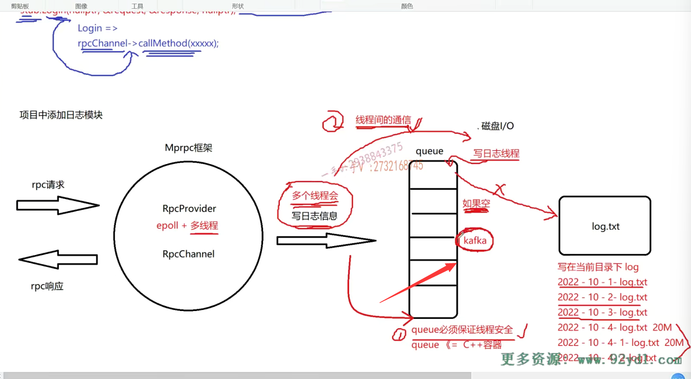

啊，接下来呢，我就在这个代码上啊，带着大家把这个日志系统呢给大家输出一下好吧？

嗯，首先日志呢，我们也是输出成一个单例的这个模块儿了啊。

那现在呢？把example这儿就全部盖上，我们又要给这个server呃src就是我们框架的代码输出日志系统吧。

呃，这是log点h啊。preg MA.once mpr PC框架提供的日志系统。好不好哎？提供的这个日志系统啊？日志系统。呃，

在这里边儿，大家是大家呃，这是我的这个好像是我的这个。连接的linux主机有问题啊。稍等一下哦，我重启一下吧。feel to save lower unable to read feel.no space left on device.说我这个路径下的这个空间不足了啊。那我把视频。暂停一下，我删一些东西啊，再回来继续输出我们的这个日志。

### 记录日志级别

好，我们继续输出这个logger这个日志啊。

啊，在这里边儿来说的话一般日志呢？我们有两个级别啊。

日志有两个级别。一般是普通的信息跟这个错误的这个信息啊，

那我们也定一个这个吧。那我们把这个是log level好吧啊。

这个定一个普通的infer。还有一个error吧。好不好？

这是一个普通的日志信息，这是错误信息。

你还可以把它分的更细，对吧啊？视情况而定。

那在这儿呢，我们肯定就需要去定一个log level啊，这是记录日志级别。啊，记录日志级别。

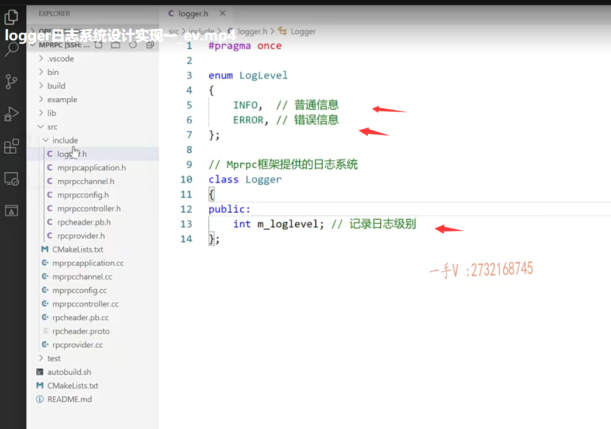

好吧，另外我们说呢？

这个日志需要一个线程安全的，这个队列对不对啊？

需要一个线程安全的队列，那我们在这儿呢？也需要去定一个出来啊，需要定一个出来。

就是这应该是一个不能是普通的队列了啊？

我们叫个锁队列吧，好不好？lockqueue。行不行？反正就起这么一个名字吧，好吧？或者叫我们的这个就叫lockqueue吧。这个起名字有时候是一个非常让人头疼的问题啊。

日志队列啊。异步写日志的。日志队列啊classlockqueue。

啊，实际上我们这个可以用模板来写呀。对不对啊？

实际上以后你任何项目的话，需要用到一个异步的写日志的这么一个日志队列的话，都可以用它啊。

呃，这个的话，我们是基于谁改造一下啊？

基于我们C++的这个queue改造一下吧啊。

当然，它里边儿还用到了这个线程，需要开辟额外的线程，是不是写？

啊，日志信息还用到了线程安全的mutex互斥锁，还用到了线程间的通信啊。condition variable条件变量好不好？

这实际上对应的就是linux里边的pthread_mutex。

这个实际上对应的就是condition.条件变量。好吧啊

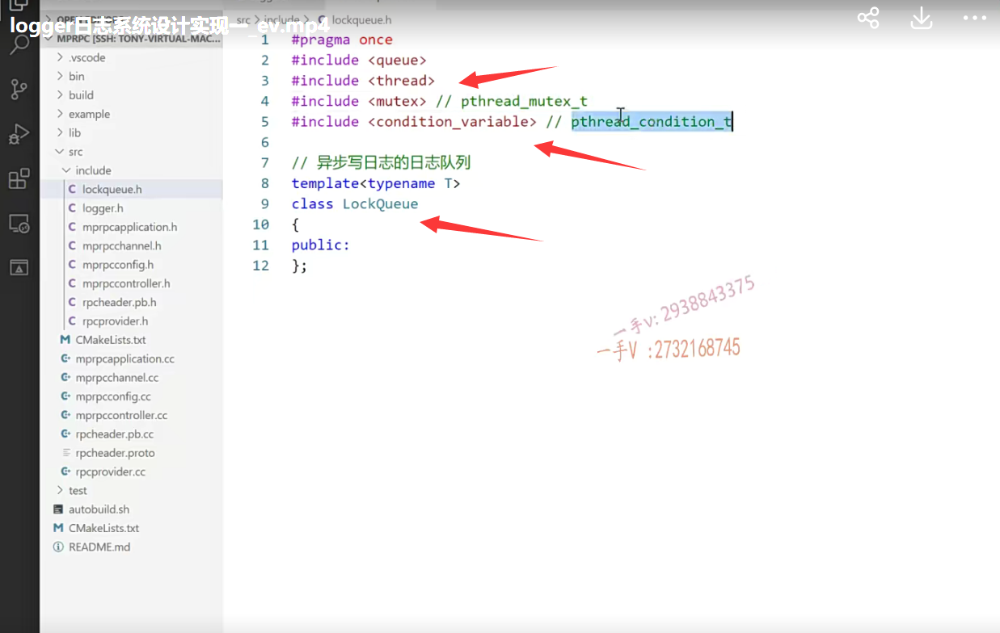

### linux的线程之间这个互斥还有通信啊，一般也叫做同步通信，有三种

linux的线程之间这个互斥还有通信啊，一般也叫做同步通信，有三种，

一个是做线程互斥的就是互斥锁。

还有二元信号量，对吧啊？s IMF还有二元信号量。

做线程间的这个通信的呃条件变量啊，用的比较多，对吧？

这个在C++高级课程里边儿也已经给大家讲过了啊。

那还有它的多元信号量，也可以做在这里边儿，

==我们选择用这个互斥锁跟这个条件变量就达到我们的目的。==

### 成员变量

这里边儿是我们带封装的一个queue。m杠queue。好吧啊m杠queue

这里边还有一个STD mutex m杠mutex啊，

还有一个叫什么？叫这个m杠cond variable.这就是那个什么东西啊，条件变量好吧啊。

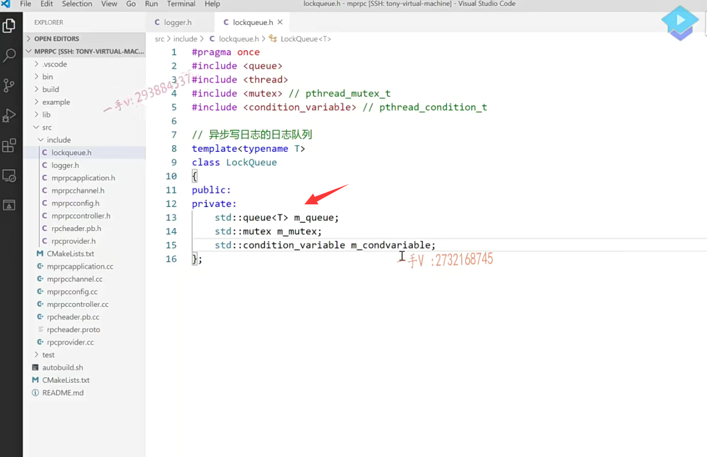

### 成员方法

这我们先把方法先给出来吧。

方法的话，在这里边儿。应该就是往队列写东西吧，

以及从队列是不是拿东西啊？

往队列写东西的话，我们写个push。push cast t。数据data啊，

然后拿东西的话就是pop出对列，并把出队的这个元素呢。

返回回去好不好？

哎，主要就这两个就可以了。

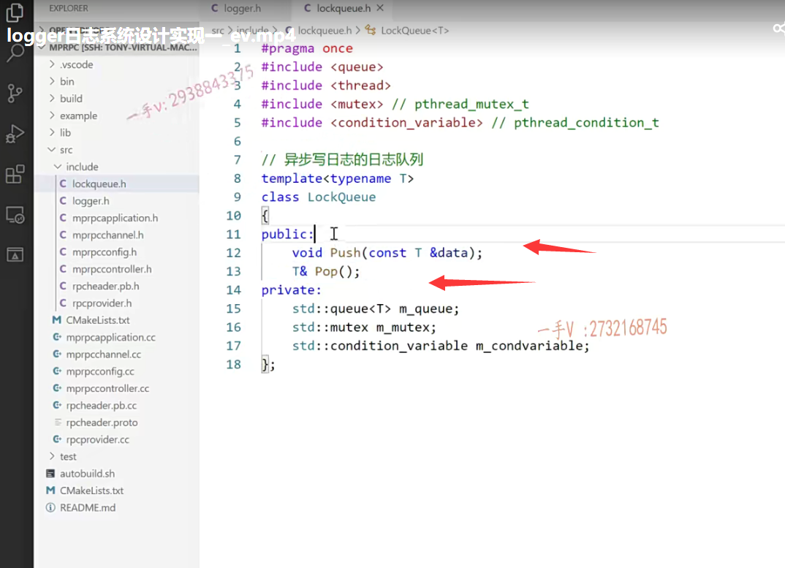

呃，然后呢？我们在log这里边儿就可以怎么样啊？

include 是lockqueue.h 对吧？

我们用到这个队列啊。lockqueue点h。

这里边就可以用到了我们这个lockqueue这个怎么都没有？提醒了啊。

所以我们现在写的都是字符串嘛，是吧？得需要包含这个string的头文件。

m杠lck lockqueue。

这个这是日志缓冲队列。好的吧啊，这是两个成员变量。

这是两个成员变量OK，那么在这里边儿呢？

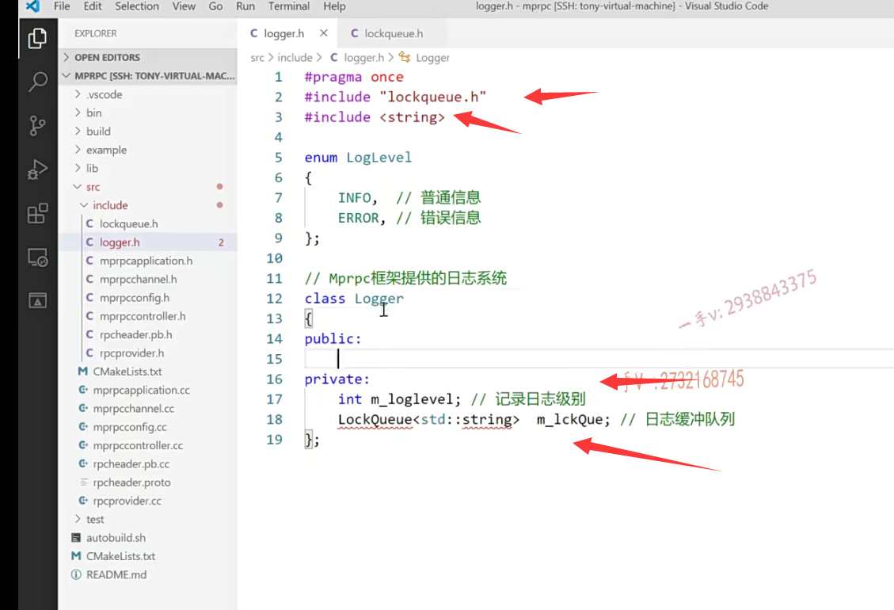

### logger成员方法

我们现在提供两个方法吧。

第一个是set log level set log level啊。这是可以设置什么东西的呢？

这是可以设置这个level的啊呃，

另外一个呢？就是我们log log信息了。对不对啊？STR或者msg。

这个是干嘛呢？这个是设置日志的级别。

这个是设置呃，这个是写日志。是不是写日志啊？

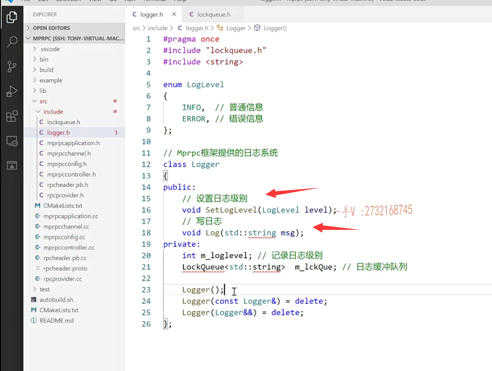

## 它设置成一个单例

我们再把它设置成一个单例吧啊，

既然要设置成单例，那也就是说这里边儿呢？

构造函数是需要的啊，

然后呢，把它的这个拷贝构造全部给它delete掉。

logger it防止通过呢拷贝构造来偷偷摸摸的生成新对象啊。

反正只要跟拷贝构造有关的，我就都给它去掉好吧啊。

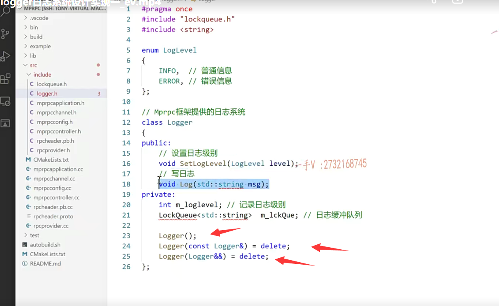

## 总结

行，那这就是基本的一个框架啊。大概就出来了啊，大概就出来了。

好吧啊，那么这节课我就先说到这儿，

大家可以先想一想啊，这里边儿我们要写两个东西，一个是日志，这个应该是非常简单的写日志，写往文件，

写就是我们刚才说的这种方式好吧啊，

以当前的日期为命名。同一天的日志信息都写在同一个文件当中啊。

这里边lockqueue线程安全的入队跟出队啊，大家可以想一想。

好吧，以及这里边儿说的，我们线程之间呢，要有这么一个什么东西啊，

要这么一个通信的机制啊好，那这节课的内容我就先说到这儿了。

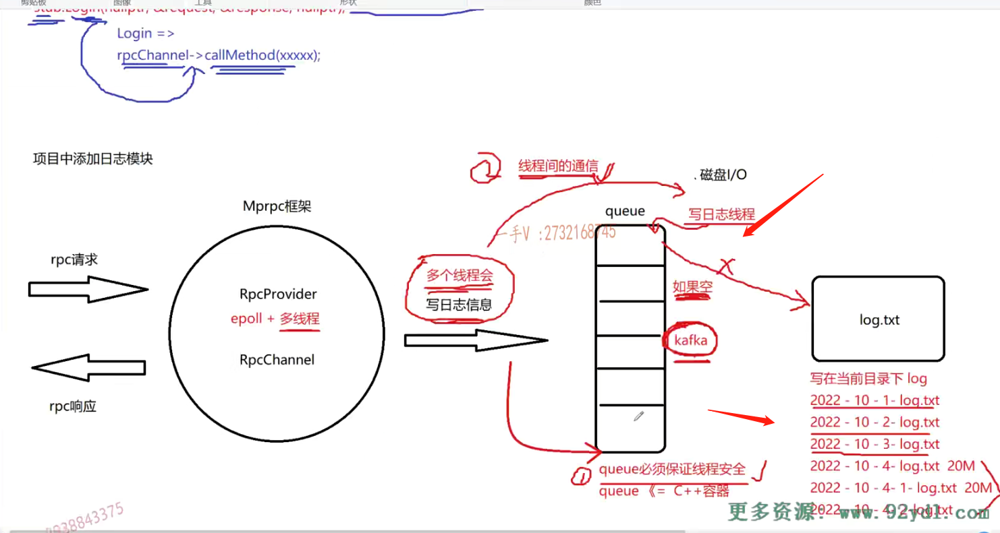