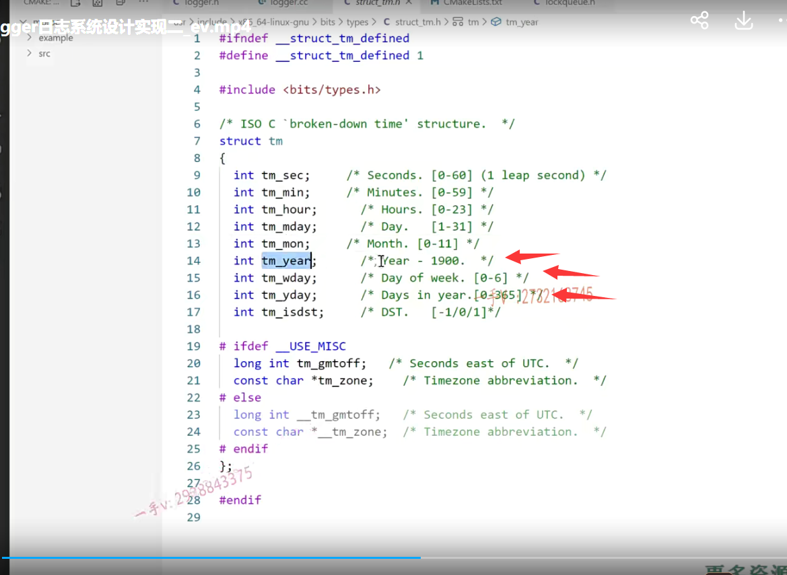

好，那我们这节课把这个logger。这两个方法呢，给它先写了啊，然后呢？

在src里边儿，我们得创建什么了源文件了啊？logger log点CC。

好吧，我们一步一步来。

首先呢，在我们的这个makefile里边把这个lo ger ger点CC。我们填上吧。

好不好啊？log点CC我没有。

### 完善日志的单例

那么，在这个log点h里边。注意这个方法还没写完。

获取日志的单例对不对啊？获取日志的这个单例啊啊，

实际上这个日志写不写？单例影响实际上不是很大啊。影响实际上不是很大，

写上吧，最起码我用到一个设计模式static logger.用引用啊，这个get instance.

好的吧嗯，来把这个方法呢？我们就都怎么样啊？

都写在对应的CC文件当中include log点h诶，这er点h。这个VS有的时候呢，识别文件反应的还是稍微有一些慢啊。

==在类外实现静态的成员，不需要再加static了。==

这是我定义一个static唯一的一个logger实例啊。

然后返回它的什么logger.好不好啊？

然后这个logger是不是还有一个构造函数要写呀？

哎，有一个构造函数要写。

构造函数就专门做这个日志的模块儿的初始化了嘛，

因为它现在是一个单例的嘛，只有一个对象，对不对？在这里边儿呢，

我们可以启动专门的日志，写日志线程。

大家来看，就是我们图上画的，这里写日志线程。啊，就是后台的这么一个线程，专门从队列里边拿东西去写的。okay吧啊，去写的。

## 构造函数 从缓冲区里边儿去取日志信息

那么，这里边我们应该是。启动一个线程就okay。对不对呃？

thread.启动一个线程啊。right?log啊。task好不好？

在这里边呢，我们直接怎么样啊？用一个兰布达表达式。就可以了。

然后把这个right。log task.设置成什么呀嗯？都没办法提示代码，

那我们就直接写啊，设置分离线程。设置分离线程。就相当于一个守护线程一样，好不好啊？

就是你在后台专门去写日志吧啊，写日志吧。

那在这儿，它应该是一个for循环了。对不对啊？for循环了。然后st d string。呃诶。对吗？

这个。这个好像。呃，写的不正确啊，怎么写到这个构造函数里边来了？

啊，那等一会儿，等会儿我们理理思路啊，理理思路。大家先不要着急，先不要着急啊。

这个成员变量m杠log level等于level啊，等于level。

然后这个是什么？这个就是专门的这个写日志了，对吧？

这个写日志应该是什么呀？啊，这个显示是应该是把日志信息啊写入这个lockqueue缓冲区当中。

这是给外部用的，你只管把日志信息写到哪里呀？

写到这个缓冲区当中。是不是啊？

而谁从缓冲区里边儿去取日志信息，往日志文件里边儿写呢？

这就是我们刚才在这里边儿所做的事情好吧啊，

那就这个事情没做错，没做错OK吧啊。

好，那在这里边儿呢，我们就先给它放到这儿吧啊，先放到这儿吧。

这个是往队列里边。message往队列里边儿放呢，是不是？

往队列里边儿放的话呢，那怎么做呢？m杠lock queen点push msg好吧。

### 先编译看一下问题

先来怎么样？先来编译一下吧。我感觉错误挺多的，

因为它现在代码的提示已经出问题了。看看有什么编译错误。

果然有啊。

在这儿invalid。of non const reference of tap from value.在这个log点CC的多少行第七行啊？

### 不应该取地址

呃，第七行这里边定了。这么一个以我的这个方法写的。

哦，这取什么地址啊？就不取地址返回的是引用是吧？

啊，我的错，我的错啊。

好，这个编译成功了啊。

有这么一点儿错，它就不提示代码了啊，这个这一点确实不如人家的这个。呃jet brings人家。出的这些像C++的这个clan啊clan，不知道大家用过没啊？

这个jet brin s公司出的这个像搞python的po hrm啊。还有goland呀go语言开发，还有这个idea啊。是JAVA的开发啊，这个工具呢，非常强大。

get brings公司的这个工具的这个，尤其是代码提示非常强大。

啊，这个微软呢？包括VS这个VS以及这个VS code啊？

这个这个稍微出点儿错，它代码就没法提示了。

## 梳理一下

行，咱不说了，这就是编译，现在是通过了啊。

那么咱现在把这个代码就一点一点完成了，

先看这个logger吧啊。

然后再梳理一下，这是一个对外部提供的一个单例是吧？

这个是专门启动写日志线程的。

这个是设置日志级别的，

这个是专门呢供外部调用这个log。它只需要去往把日志信息生成好

把日志信息，这个生成好，放入这个队列里边就可以了。是不是啊？

那这块儿都完了，

### 获取当天的这个日期    取这个日志信息写入相应的日志文件  以追加的方式写入相应的日志文件

那就是这一块儿啊？这块儿做什么事情啊？

获取当天的这个日期。

然后取这个日志信息写入相应的日志文件当中。好吧，写入相应的日志文件当中啊。

那么，在这里边儿怎么获取当前的这个日志呢？

而且我们是要以追加的方式，

如果这个文件不存在的话呢，创建。

如果存在的话，就是追加，

那应该就是个追加吧，是不是追加嗯？

## 时间处理

应该是要包含time点h。对的吧啊，应该要包含time点h。

然后在这里边儿应该是先是一个time杠t  now=time。

==这是个指针，获取当前的这是获取一个按秒算的应该是一九七零年到现在的秒数的是吧？==

然后我们还得用这个什么东西啊？local time.传的是一个time杠t的这个指针啊，然后它返回一个TM星。它返回是个指针是吧？

那我们用指针来接收。

### TM的这个结构

然后呢，就获取年月日对吧？

年月日怎么获取呢？那就看一下TM的这个结构。

TM有它的这个年year month day，但这个年是一九零零，要加上个一九零零，对吧？

month它是零到11，要加一个一的。

呃day就是这个啊。

### 创建文件

好了，那么在这里边呢，我们文件名啊，先来看文件名。

是个file  name来个128 足够了吧？啊，足够了啊，

然后是sprintf构建文件名 sprintf name，

然后是文件名，我们是怎么写呢？年月日再加一个log点TXT。对不对

TM 是now tm指向的year。呃，加上个一九零零呢？

然后再是nowtm指向的这个month。要加个一呢啊，

然后再是nowtm再指向的这个day。

诶，这个文件名是不是就出来了？

哎，文件名就出来了。呃，这个当然，我们不用这儿获取一下吧啊，获取一下。

这个写在for循环，应该要写在for循环的这个里边。啊，应该要写在for循环里边呃，

因为呢，这个系统上线以后呢？呃，它可能是一直长年累月的在运行，

如果你把它放在服务区行外边的话，那就文件名就变不了了。是不是啊？

就变不了了。

### 取数据  写入文件

那么，文件已经有了。

那我就打开这个文件呗

file 星pf=f open。这是文件名。文件名，然后是一个a加对吧？

那当然，这里边pf如果等于空的话啊，那么在这里边呢？这个怎么样呢？

呃，此时呢，文件都打开不了，也没法写日志，是不是？

我们在这儿打印一下吧啊在控制台上打印一下就是logger。file  name吧。

logger  file日志文件哪个文件呢？就是这个文件啊 open error.

啊，这个就直接退出系统了。exit failure.

OK吧，这个还得包含一个lO stream得向控制台上输出信息了啊。

然后呢？打开以后，

然后我们的这个取出来，取出来信息就直接往里写就行了，对不对？

那就是std string。STR message等于m杠 m lock，queue点pop嘛。是不是啊？pop以后呢？把它写入文件当中。写入文件当中。

就是f puts啦。第一个是什么？

第一个就是你要写的这个数据啊。数据就是message嘛。点c杠STR。

第二个就是pf了。好不好啊？第二个就是pf。

### 这里边儿，如果是一直写

我们在这里边儿考虑的一个问题是什么呢？

==就这里边儿，如果是一直写的话啊。==

==一直写的话，我们每一次写的话都要把文件打开，关闭一下，==

### 把文件关闭掉及时的把信息刷到日志文件

我们来看看这个逻辑，我们该怎么组织一下会更好？

==我们写完，我们还是把文件怎么样？把文件关闭掉吧。==

==因为文件不关闭掉，在这儿我们没有办法及时的把信息刷到日志文件当中啊。==

### 在这里边儿，我们更好的一种方式  但是我们这里保守处理

实际上，在这里边儿，我们更好的一种方式是看。

==如果在这儿呢，队列为空了啊。==

==我们就可以把文件先关了，==

==如果队列里边儿不为空，一直有信息，一直能取出来的话，==

==我们就先别着急关文件，一次性把信息写完，是不是再关文件啊？==

在这里边儿，我们用的方式呢，比较简单一些。

就是每一次。写完一个信息啊，附带着一个文件的打开关闭。

啊，处理的比较保守一点啊。

### 梳理下逻辑  写完代码

整个的这个逻辑大家能搞明白吧？

看这儿专门起了一个线程来从队列里边拿东西去写日志文件获取这个信息。是吧啊，

获取这个队列获取信息，这是文件的名字，

我们写到for循环里面了。

好，那这个日志这一块儿的这个代码呢，我们就算是写完了啊，

接着呢，就剩下我们的什么呀？

接着就剩下我们的这个队列了，日志队列了，是不是。

我们把这个放在下节课来给大家输出一下啊？

好，我们现在这个代码写完了，大家也看啊，大家也看一看。

呃，这个代码呢？还有没有需要补充的？或者说是哪里有问题的啊？

也可以自己先改一改。

对，我们先写哦，一会儿写完这个底层的这个日志队列，

我们可以统一的去验证一下。

## 定义这个宏给用户提供更方便，更便捷的一个日志写入方法

实际上到时候去用这个日志的话呢，我们不需要让用户自己去怎么样啊？自己去获取logger的实例，然后自己去用log去写日志，

我们可以定义一个日志宏。

定义这个宏来以可变参的方式呢？

给用户提供更方便，更便捷的一个日志写入方法啊，

### LOG_INGO

在这里边儿我们可以定义这么一些宏啊，

这个是log info，这是专门干嘛的？

这就是log message.这个应该是先 log my呃。log message.for.format.

日志信息的一个格式，

然后后边儿呢，就跟那个printf函数一样支持可变参对不对？

用户写日志的时候呢，可以组织自己的这个日志的这个风格啊。

这个为了防止出问题，宏我们一般都会组织一个do while。是吧啊

okay。不用对那么齐了。这相当于就是写普通的信息。

啊，我们在这里边儿，首先呢，得到一个logger等于loger的这个get instance方法。

再设置一下什么呀？set log level. info嘛？对不对？

然后再去做谁啊？再去调用这个log方法。

再去调用这个log方法啊。调用这个log方法把这个消息呢，给它写进去是不是？

### 组织一下它的这个格式化字符串

但是我们要组织一下它的这个格式化字符串啊。啊，组织一下这个格式化字符串怎么组织呢？

我们c定一个幺零二四。啊，

==用我们CC++提供相应的一个宏，我们来组织一下这个可变餐。==

用SN printf这里边第一个就是缓冲区，

第二个就是缓冲区的长度啊，

第三个就是写的这个格式化字符串对不对？

哎，最后一个参数就是这个什么来着va  然后是一个args吧，我记着。

okay，就是这样子，这样子的啊。这个就代表了这个可变参的这个参数列表好不好？

直接都填到这个缓冲区当中了啊？填到缓冲区当中以后，

我们在这儿呢就是把这个c扔到这个参数里边来。

好了吧哎，这就提供了一个loginfo啊，loginfo和同一样的，

### LOG_ERR

我再提供一个宏方便用户使用。

log error.呃，这里边就是error其它都一样的。

好吧啊，其他的都一样。

就用户到时候直接用这个log info跟log error就可以了。

==不用去实现这些呃，不用去自己去调用这些方法，更简单方便一点。好不好？==

### 我想在这里边儿写的时候呢，给这个信息再加上一个具体的时分秒

嗯，这个思路大家可以借鉴一下啊。

然后在这里边儿，我们看还有什么问题没哎，还有一个问题啊，

还有一个问题，因为我想在记录的时候呢，

你看这儿。相当于我在输出的时候呢，比如说log info在这里边儿，还有我什么什么什么百分之d呀百。分之s呀。在这儿呢，我传入相应的整数字符串以后啊。

他就给我把这些信息最终调用这个log给我写到什么里边儿去了。写到这个日志，日志队列里边儿，

==你从日志队列里边儿去取出这些信息的时候啊。我还想给它加一个什么？==

==我不想光写信息，我写这信息我也不知道，我光知道它是哪一天的，==

==我也不知道它是哪个时刻产生的。是不是啊？==

==我想在这里边儿写的时候呢，给这个信息，再加上什么东西啊？==

==再加上一个具体的时分秒的这么一个信息。==

那也就是说，在这儿我定一个当前的这个string啊。就是time。time STR.

哎，不对啊，我得先定一个buffer啊，对不对time？

这个time buffer啊。time buffer128 就足够了吧？

再用一个sprintf啊。嗯buffer这实际上都不用这么长啊。然后是时分秒

OK吧，再加个箭头号，你后边你再写这个消息，是不是啊？

然后就是这里边的no wt m。时是什么？hour对吧？

分是minute。

秒是什么？表示second。

OK吧诶，这个填完以后呢？

那我现在就可以了。

#### string 插 char *buf没问题

我的这个message。我看能不能有什么方法把这个buffer呢？直接给它插到前边来啊。

嗯，这就用我们之前的这个insert就完了呗，往首位置插个谁呀？

插个time buffer好吧诶，

这个就好了，给我们日志信息加了一个什么时分秒是吧啊？

这个到时候看的话呢，就会更详细一点了啊。更容易去定位问题嘛。

而现在比刚才就更完美了。比刚才更完美了，

我们也给用户很贴心的啊，提供了两个宏对吧啊？

okay，那么这个日志模块儿的这个代码呢，我们就目前看是写完了啊，

功能是否正确，我们后边儿再验证。

接下来我们就得实现这个队列了对吧啊？

==这个队列我们放到下节课来给大家写这个异步的日志队列。==