# 两个核心点

呃，这节课呢，我们给大家讲一下zk实际的一些东西啊，

实际上呢zk在这里边儿往简单的说，

它提供了那么多的一些对外生成的一些分布式协调服务。

啊，最重要的两个核心点就是就是zk的数据是是怎么组织的？好吧啊，

第二个是什么呢？第二个就是zk的watcher机制是怎么组织的znode节点？

实际上，它就是通过这两个东西呢给分布式环境啊。

就是对外提供了那么多的一些协调服务。好吧啊，那这两个是什么意思呢？

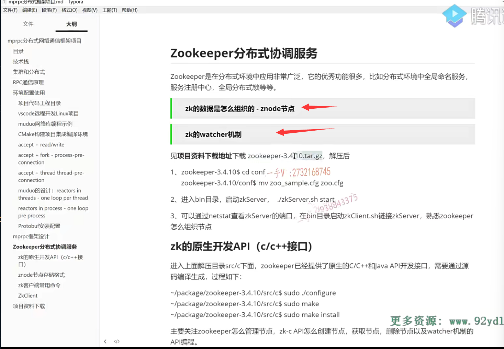

这个我我来给大家呢，慢慢来讲一下啊。

好，首先呢，我们一步一步来，大家在这里边儿，这个最后的项目资料下载地址里边儿下载一下，我给大家提供的这个zk的版本。

当然，你要是觉得不喜欢下载我的，你也可以自己去zk的这个官网啊，去下载一下它的最新版本。

呃，这个解压以后是什么样子的呢？

大家来看一下。这是我在我家目录下的这个package。啊，那边儿放的。你看这个解压啊，用tar -zxvf我解压一下这个gz包的话呢？生成了这个zookeeper。

你看它的目录就是这个样子好吧，这里边儿呢，

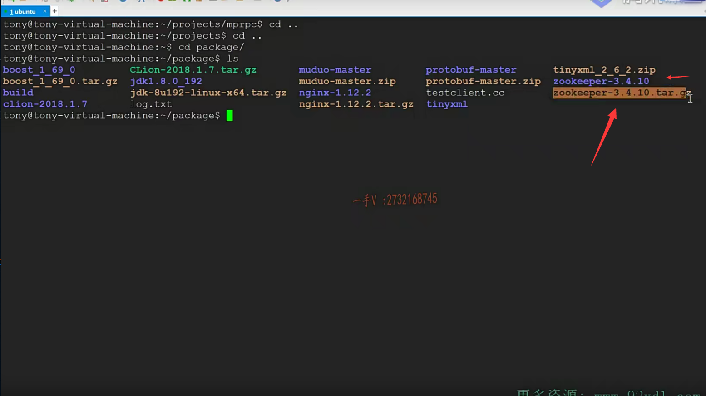

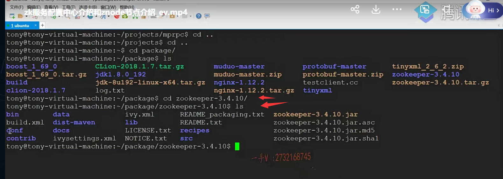

大家需要。首先需要接触的两个目录就是它的conf 有zk的配置文件以及它的bin目录，有zk的这个客户端跟服务器的一个两个程序啊

zk实际上也它也是一个CS的这么一个服务跟大家之前接触的这个redis呀，mysql啊，它的模式都是一样的，都是一个CS的，对吧？

进入大家首先这个免安装呢，解压以后就可以直接使用了啊。

第一次解压以后进来先别做其他事情，先进入这个配置文件啊。

啊，配置这个文件的文件目录conf，这是zoo点cfg就是zk的一个配置文件。

### vim zoo.cfg

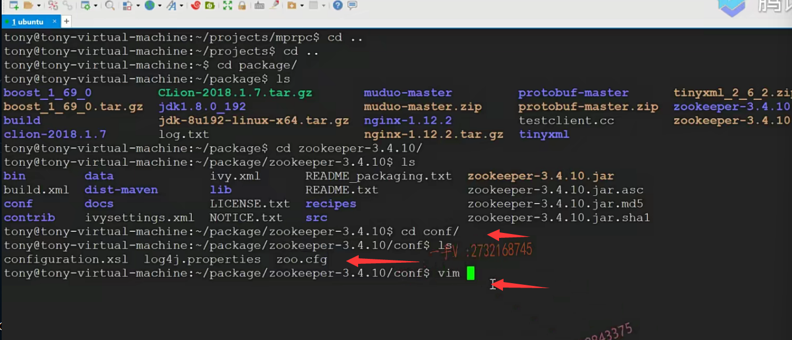

打开这个zk的配置文件，大家可以看到啊，尤其这里边你需要改的一个东西就是data DIR。

我给大家说了zk比较重要的一个东西，就是zk上存的数据是怎么组织的？

znode的节点好吧，这些znode的节点上的数据呢？最终都是存在我们磁盘上的，

你也可以理解啊，zk存储数据就是一个特殊的文件系统啊，就是一个特殊的文件系统。啊，跟linux非常像呃，

### 修改数据目录

它就是zk节点上存的数据，最终就是存到它的这个数据目录里边儿了。

呃，那么你不要用这个tmp，你可以呢，在这里边儿打开它，自己定义一个这个。数据目录来存放你zk的这个节点数据啊，

你看我就在的zk的这个解压的目录里边儿创建了一个data文件夹，

然后我就写了这个目录呢。作为zk节点的一个存储目录。

你要用tmp的话，这是一个临时文件重启就没了，也就是说你如果用默认的tmp，也不是说不能用啊，这回用了。

我启动以后呢？那么也就是说，我在zk上存的所有的节点的数据都在。对吧啊，

但是当我把这个系统重启以后呢linux重启以后tmp下边儿的数据全全部清空了。

我再把zk打开以后，我发现zk上的节点没有任何数据了，

好吧啊，修改一下

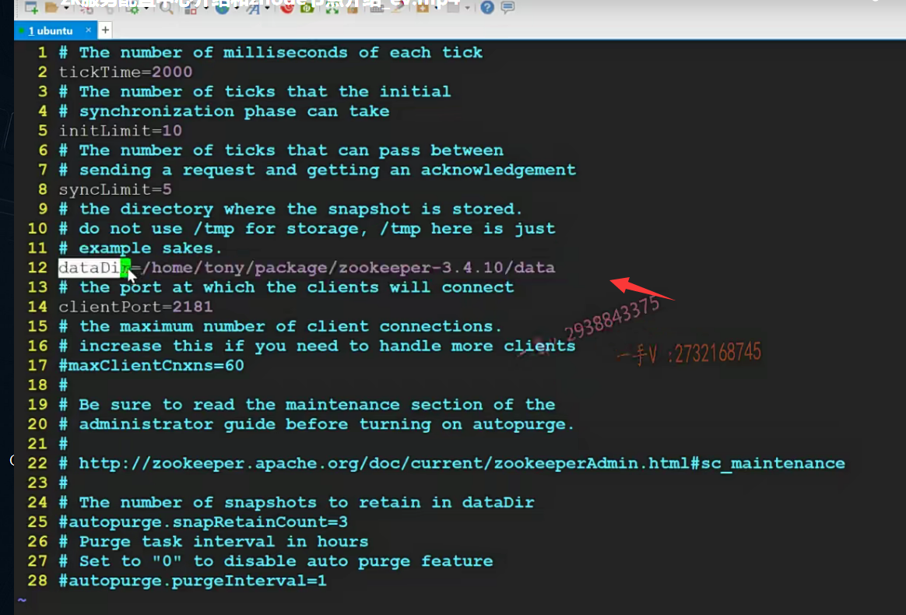

这个那么刚说了zk它也是一个CS的这么一个模型了啊。

zk的这么一个默认的工作的端口号就是2181，这是第一个改这个。

改这个改好了，以后呢，你就可以退出来了。改好以后就可以退出来了。好吧啊，改好以后就可以退出来了，

### 进入这个bin目录

退出来以后呢，你就可以进入哪个目录了，进入它这里边儿，

这个bin目录了啊。

bin目录你看这zk server点sh。这是一个启动脚本啊，启动zk的这个服务器。

这人家还给你提供了一客户端呢zk clish，

这是不跟我们大家之前在学习这个集群聊天儿服务器的时候给大家演示了用这个mysql数据库啊，mysql数据库是不是也得需要你先启动mysql这么一个数据库的服务器啊？哎，然后呢mysql呢是自带一个客户端啊，通过my这个。杠u root杠p是不是可以用我们指定的这个用户？啊，登录是不是mysql服务器啊？

这一模一样的啊，一模一样的。

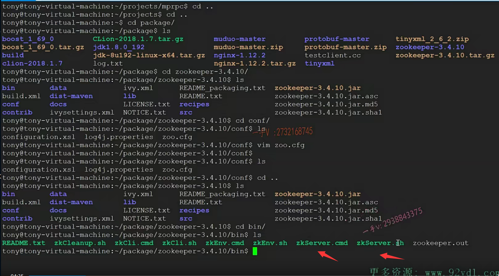

好吧啊，我们在这里边，你看zk server点这个sh。

哎，你启动它的时候呢，光写这个不行，它里边儿又有什么呀？

啊，它里边儿又有这个带命令的start，那默认启动是一个后台的，这么一个进程啊start for grand启动成一个前台进程。

好吧，这里边你还可以通过stop restart来控制服务的这个状态啊。

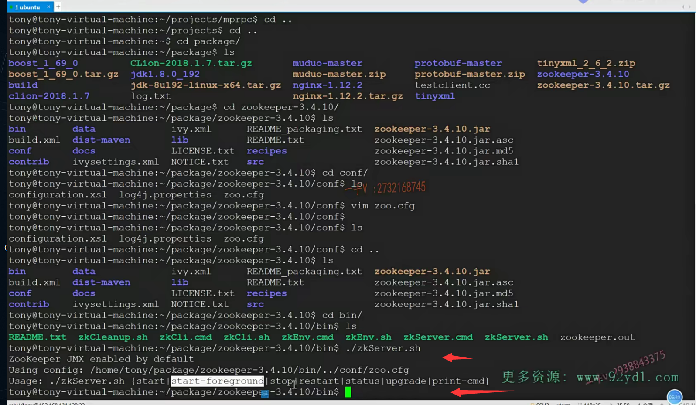

那就是zksh start。这个starting zoo它。它是形成了一个后台的一个进程了啊。

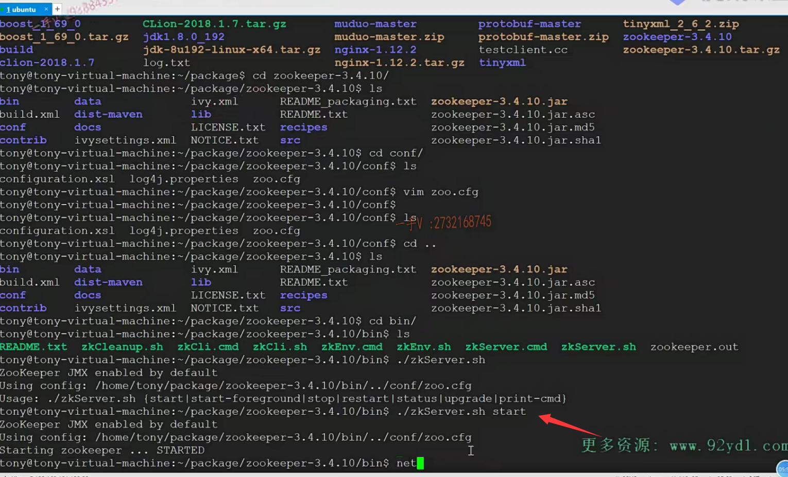

呃PS杠ef grip z ke PR。有呢吧哎，有呢。

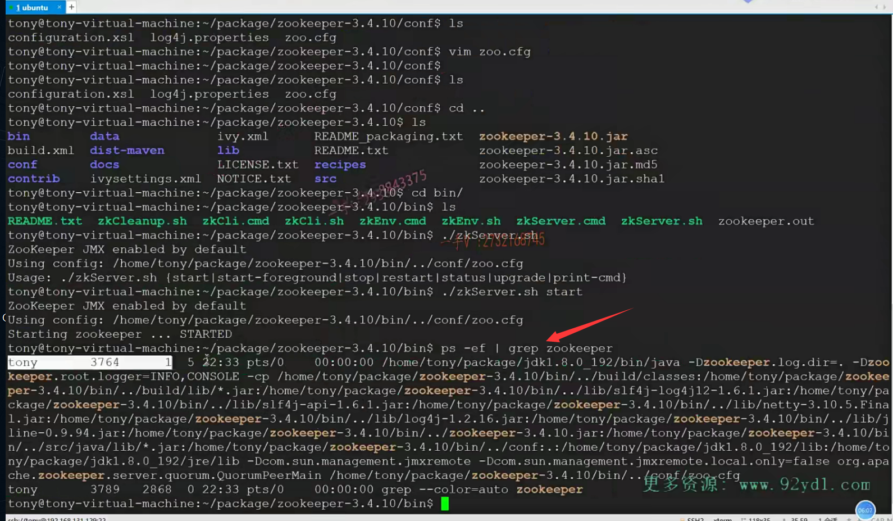

好吧啊，有呢？

### zk呢，本身是通过JAVA来开发的，你要这个装这个zookeeper你必须有这个gdk的环境，在你linux上装一下

zk呢，本身是通过JAVA来开发的，你要这个装这个zookeeper的话，

你必须有这个gdk的环境，在你linux上装一下啊，如果你也用的是右班图，

你直接通过这个apt-get install 装一下这个open gd k就可以了啊。

你在网上可以查一下，非常简单。

netstat，这个要用超户来查看啊。

大家来看看。这里边儿启动的话呢？啊，是哪一个呀？

这里边儿有没有找到我们启动的这个zk呢，

应该是这个。应该是这个。它本身也是一个JAVA啊，应该是这个这个。这个它本身就是一个用JAVA开发的嘛啊，你看默认工作在2181这个端口上，这就是我们zk的这个服务。

好吧啊，这就是我们zk的服务。

okay，那启动zk服务了啊？

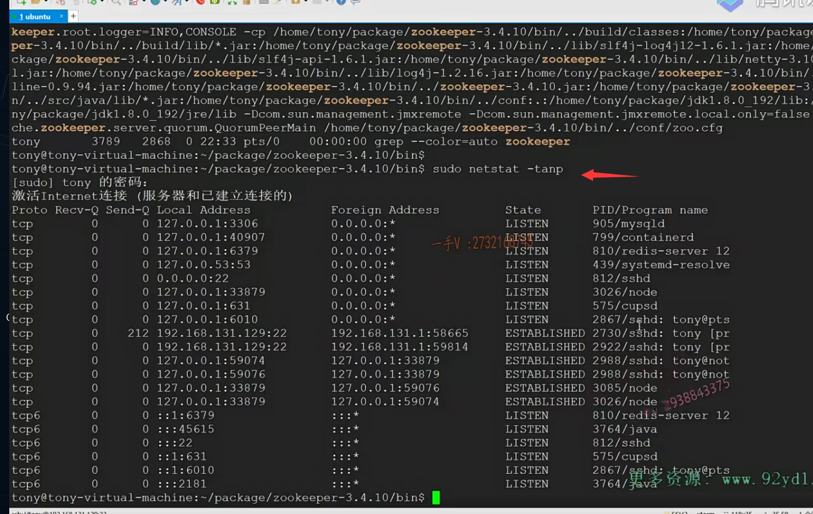

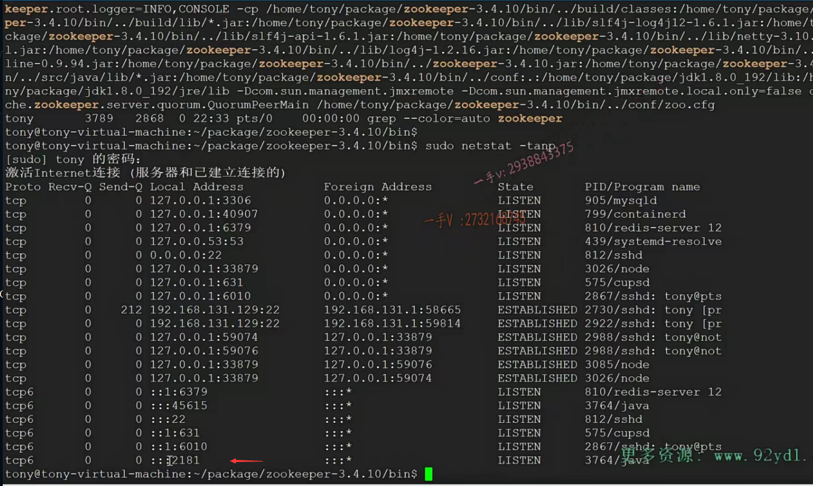

啊，接下来我要给大家说一下。啊，

我说一下，先不用看这个有关zk开发的，

先看一下，我们给大家前边儿说了啊zk数据怎么组织的，一个是znode的，一个是watcher机组，

我们先先来说一下什么叫znode啊？

znode呢，就是这个zk的一个存储数据的方式，

它的存储数据呢？实际上也是以一种特殊的文件系统来存的，

你看斜杠斜杠就是它所谓的根目录，是不是跟linux一样啊？

啊根目录底下有node 1，node 2，node 3，node 4，

你看node 1的path是什么？斜杠底下的node 1。

不要把这个斜杠跟linux里边儿的斜杠那个等同啊，

这是zk底下存储数据的一种方式，但它的意义是跟这个linux下的斜杠一样都表示。

当前，用户根目录。node 1杠一的path是什么？是斜杠node 1，再斜杠node杠一杠一，

每一个结点都可以创建子结点。

好吧，这是兄弟结点啊，一杠一一杠二一杠三都是node 1的孩子结点。

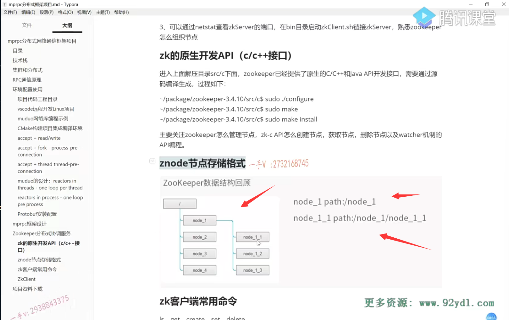

每一个节点上都可以存数据的。啊，默认的大小就是1M。

当然，这个也可以设置的，就是说你在这个节点上存储，可以存储1M以内的一些数据。

有些同学，为什么你这个存取的数据量这么小呢啊？

我能不能把原来存储在数据库上的数据存储到这个znode的节点上啊？

那么你这就是纯粹设计上的问题了。

啊znodede，你不能把它当做一个我们数据库来用啊，是不是

它是在分布式环境中啊？用作分布式的协调服务的。对不对啊？

比如说分布式锁，分布式的这个服务名字，服务名字服务所在rpc节点的一些配置信息我们可以记录在这个节点上。啊，分布式的呃，这个协调服务一般数据量也不是非常大，1M已经足够用了。

好吧啊，这就是它所谓的结点。就是这样存的，每一个节点上有一个名字，还有它所存储的数据。好吧啊，它所存储的数据。

### 启动client

好在这里边儿呢，我给大家看一看，现在我把这个zk的这个server是不是启动了？那么现在我可以启动一个zk client来。瞧一瞧，它都提供了哪些功能啊？

zk client点sh。这就表示连上了啊，这个就表示连上了，你可以看一看。

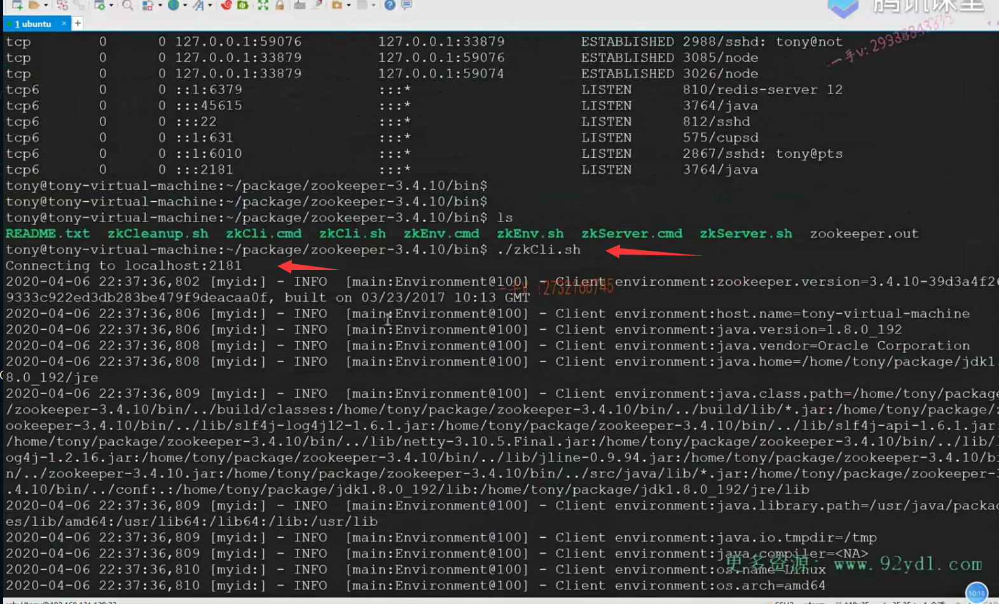

呃诶，那是最近client connection初始化客户端的这么一个connection，

这相当于就是人家给我们提供的zk，给我们提供的一个zk客户端。socket connection established to localhost 2181，就是呢，跟本地的服务2181，也就是zk的server已经创建了一个是不是socket连接了。

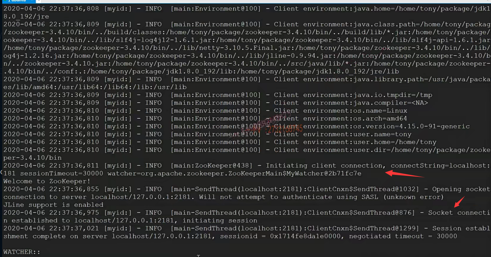

### ls

呃，那你就可以用这个l你看这里边呢，我给大家列了一些常用的命令ls。

这跟我们linux的命令都一样。斜杠，

这是什么意思呀？这个可不是说是linux的，这个当前用户的根目录啊，这是zk的存储数据的根目录。

你看根目录，现在相当于有几个节点。

有npr PC nokia跟rpc service几个节点啊？三个节点。

好吧，它现在有三个结点。

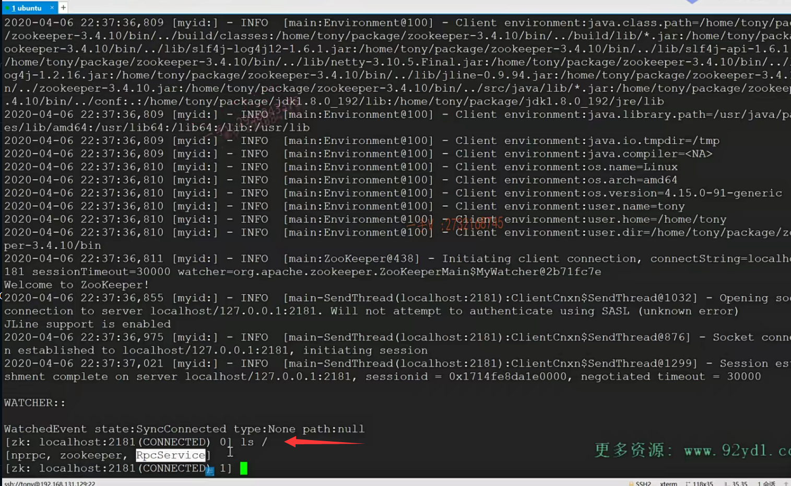

也就是说跟这里边儿的这个是一样的，这现在根目录下有几个结点，有四个结点。好吧，

### get

那get它们干什么呀？

get呢？查询这个节点的数据嘛，

我们在每一个节点上是不是都可以存储数据啊？你get根目录的这个/zookeeper，

你看它就可以给出一些信息啊。

那我们我在这里边儿有没有必要给大家把这个每一个字段的这个意思都给大家解释一遍啊？根本没有必要啊，

因为我们目前来说，所有的字段并不是所有的字段都能用到的。对吧，

我们只有在这里边儿，

我们这个项目中只有两个部分能用到啊。

一个是就是节点的数据，这个节点上没有存数据，你看第一行是个空的。好了吧啊，

还有这么一个节点，是一个永久性节点，还是一个临时性节点啊，

永久性节点跟临时性节点的概念，我一会儿来给大家说。

就这两个对吧？

那你说不知道其他的是不是就影响我们对于zk的理解了，并不影响嘛？

get我可以获取一个 zk上一个znode的这个节点的这个详细信息对不对啊？

对于我来说，我了解它存储数据的这么一个字段，跟这个永久性，临时性节点的这么一个字段。

对于其他字段呢，我没有做过多的了解，或者说是我有时间我去了解一下，因为我发现面试的时候不断的被人问到。

你这里边你还可以看一下这个data lens，就是这个节点所存储的数据的长度，这个字段呢，你也能掌握吗？这非常简单啊，

每一个zk节点都可以创建它的孩子节点的，对吧？那在这个节点上呢？

还记录了它的这个children number啊，number children就是它的这个孩子的个数。是不是

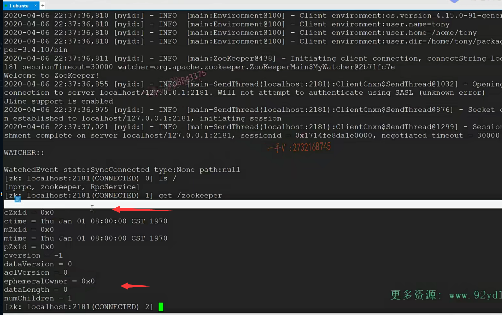

那我们我们ls一下这个zookeeper。查看一下这个节点。

来查看一下这个节点，我果真啊它的这个根目录下的这个zookeeper这个节点下还有一个子节点就是quota。

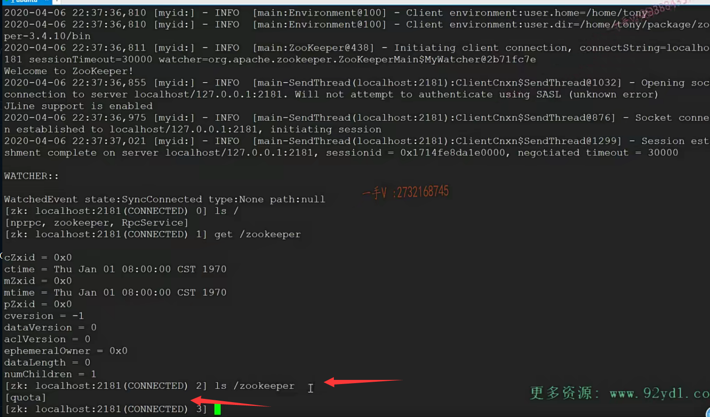

### 你访问znode的每一个节点zk的每一个节点呢？你都得从根路径开始写起，就像在这里边儿。

那我get注意，你在操作这个zk的时候啊，访问每一个节点，你比如说这里边有一个。quota，我能不能直接访问这个名字的节点呢？不能

你访问znode的每一个节点zk的每一个节点呢？

你都得从根路径开始写起，就像在这里边儿。

node 1是斜杠，node 1 node杠，一杠一是斜杠，node杠，1 node杠，一杠一好吧啊。

在这里边儿，你试一下啊。你路径写不对，它会报错的。OK吧哎，

这个结点有数据没有数据，因为data lens是个零啊，它有没有孩子呢？没有孩子它也是个零。

就它可以存储数据。

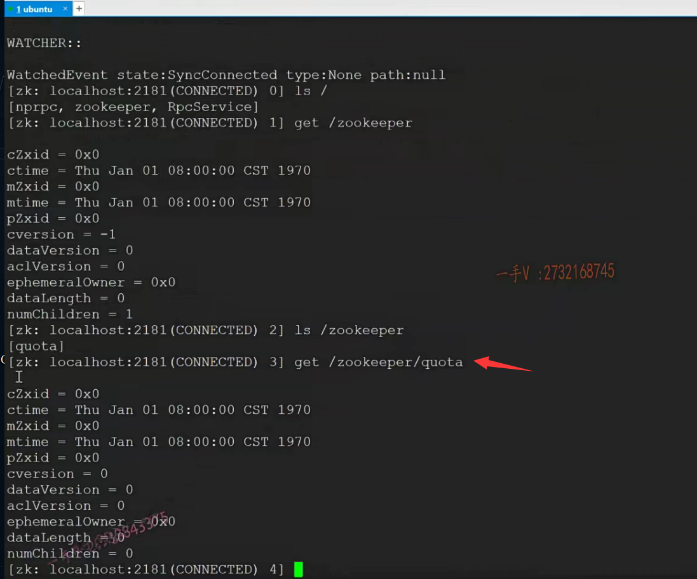

那我们就可以把我们现在这个框架上啊，所注册的这个rpc服务的服务名字以及IP地址端口号是不是写到我们zk的某一个节点？上啊

哎，这就可以提供服务配置中心的这么一个功能了。好吧，

这是get查看节点的这个内容的啊

ls是罗列当前指定路径的节点的，get才是查看节点的具体内容的。

### create

create是可以创建节点。可以创建一个节点。

OK吧啊你，比如说在这里边儿，我create。啊，create在这里边儿。这个sl这么一个结点，给了一个结点，一个数据。lx斜杠，

大家看是不是就有这么一个结点了？啊get li get get sl。

有没有发现这个节点有没有数据啊？有吗？我们刚创建节点的时候给这个节点放数据了，就是create后边是节点的路径。

然后是呢，节点所存储的数据。好不好哎？

数据的长度有没有子结点呢？没有。

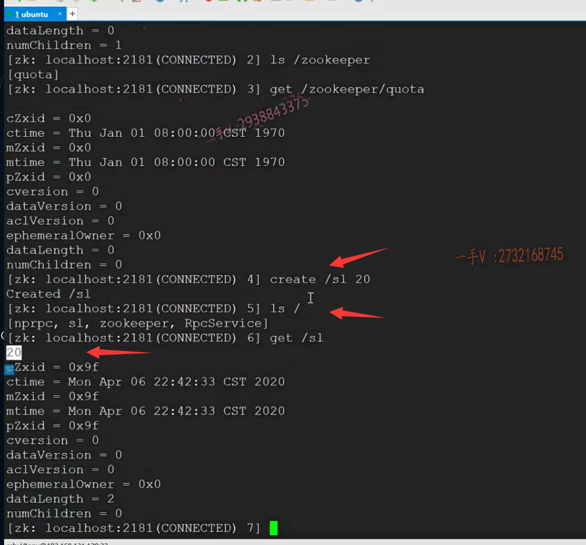

是不是那在这里边儿能不能去创建一个节点create杠sl下了sl 2？sl 3。30呢。

可不可以node does not exist。

也就是说呢，在这里边儿，你想创建一个sl 3这么一个节点，

你得保证sl 3前边儿的所有的父节点以及祖先节点都是存在的。

这里边儿之所以出错，是因为呢？

==sl这个节点下，根本就没有sl 2这么一个节点，==

所以sl 3这个节点根本无法创建，你要创建sl 3，你必须得先把sl2节点创建出来。好的吧啊，

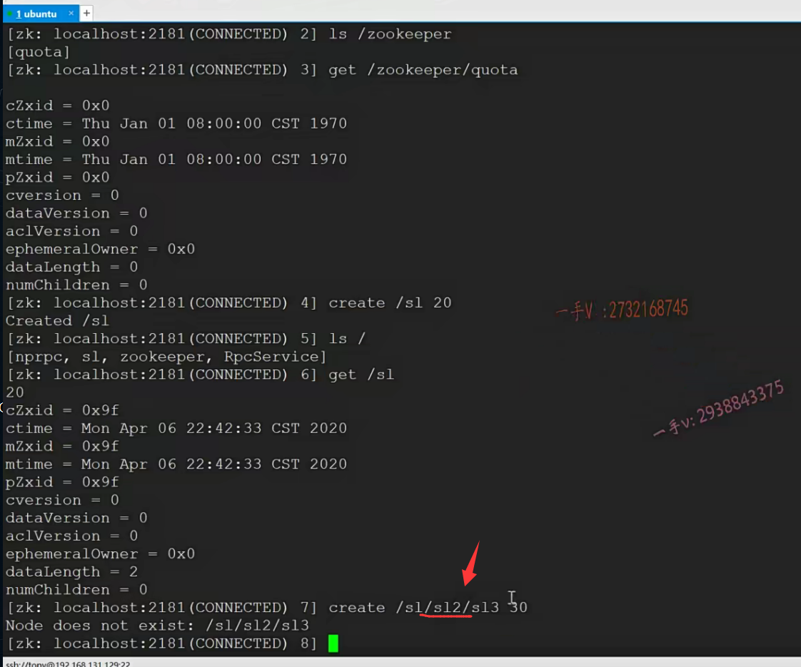

或者说你你要创建个结点，得保证它的父结点都是存在的。这就是create。好吧啊create。

### set

在这里边就是set，你可以干什么修改节点的值？是不是啊？set sl30啊。

那get什么呀？sl你看，从刚才的这个20变成是不是30值变了？

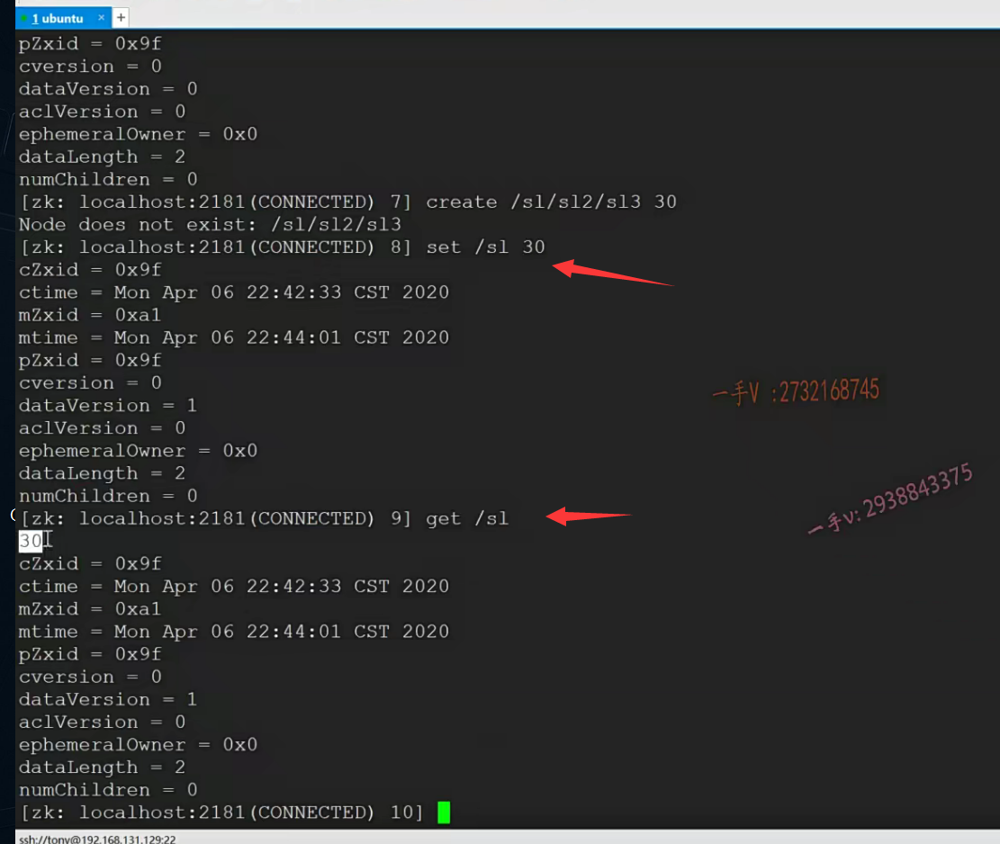

### delete

### 你要删它，你得把它的这个什么节点全部删完

大家可以自己去操作一下啊delete，那就是删除节点了。

啊delete杠sl。sl没了，

是不是delete杠npr PC？你看删除这个节点的时候，人家发现这个节点呢，空不空啊？不空那就说明这个节点有子节点，你不能直接删它。

你要删它，你得把它的这个什么节点全部删完啊。子结点是不是全部删完？

在这里边。呃，大家来看看。

继续来测试npr PC底下的这个user service。rpc这删了，这删的话呢，

再接着上边来这个诶，现在是不是就删掉了？

好，同样的，我们先看一下旁边这个rpc service。有没有有呢？是不是？

所以我要删它的时候呢？就是rpc service。先把它的这个非空的子节点要删掉啊。user service.rpc，

然后再删谁呀？然后再删这个rpc。service删完了，

现在就剩c zookeeper这么一个节点了。

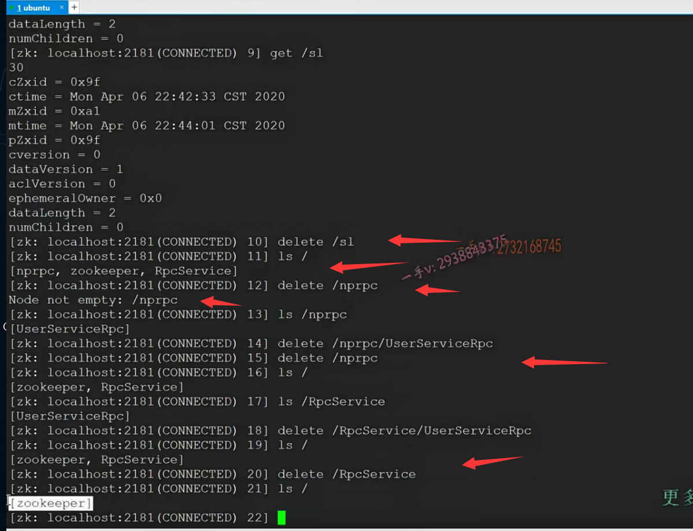

### 小总结

好吧啊，我刚才在这里边儿给大家演示了一下常用的这些命令，

实际上我们到时候做zk的这个客户端编程的时候，实际上就是在通过发送这些命令来操作这个zk的这个服务器。

好吧呃，查看节点的所有的这个当前路径的节点，

get获取指定节点的详细信息，

创建节点并设置数据修改节点的信息以及删除节点啊，

一个节点，如果有孩子节点直接删除当前这个节点是删不了的。

把孩子一删才能删除当前节点。

好吧啊，首先大家对于这个呢。了解一下啊。

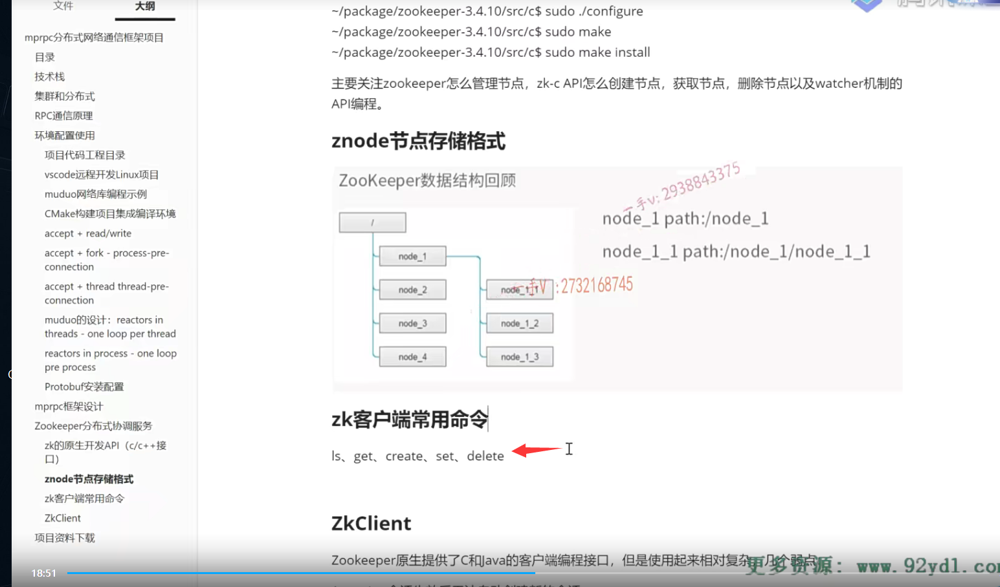

通过刚才的讲解呢，告诉了大家。

这个zk里边它是。这个维护了一个文件系统，

这个文件系统的每一个节点呢，都称作znodede啊。

它的文件系统跟linux非常像呃以斜杠开始的表示zk的这个根文件系统。

根文件系统可里边儿下边儿呢，可以创建很多的这个znode的节点。

每一个znode的节点呢，可以携带数据znode的节点，还可以创建孩子znode的节点，

对吧？一个znode的节点呢，是可以携带1M的，这个数据的。

1M的数据的提供这样的这个命令呢，可以来。

呃，对这个节点呢，进行数据的增删改查。

好吧啊，好了，这是对于这个zk的一个数据的基本的存储结构，

也就是它所谓的一个特殊的文件系统的一个了解，以及对于znode的这么一个东西的认识啊，

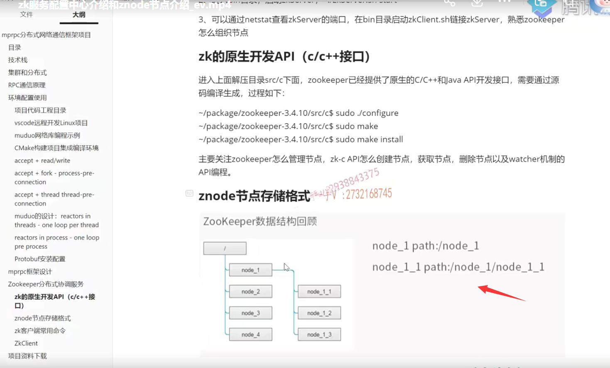

然后我们刚才在给大家去说的时候呢，

还给大家说了znodede所谓的一个永久性节点跟临时性节点。

好吧啊，说这个的话呢呃。

我需要给大家画一张图，但是我觉得画图还不如让大家直接看这个。

就是我让大家参考的链接啊，我这个链接我也已经附在这个课件上了啊，大家有兴趣的话可以看一看。

这个链接相当于是一个扫盲帖啊。在这里边儿呢，我从这儿开始看啊，从这儿开始看。嗯，

大家来看看分布式系统所存在的问题，服务的动态注册和发现。

这是没有这个服务注册中心，没有zk在分布式环境中呢，我们为了发现这个rpc服务它是。怎么做的呢？

为了支持高并发。啊order service被部署了四份订单的这个服务是吧？

每个客户端都保存了一份服务提供者的列表，但是这个列表是静态的，

在配置文件中写死。

如果服务的提供者发生了变化，例如一些机器给down掉了，或者又新增了新的部署了order service，

这个服务的这个rpc节点。客户端根本是不知道的，想要得到最新的服务。提供者的这个URL的列表必须手工配置呢呃，更新配置文件很不方便。

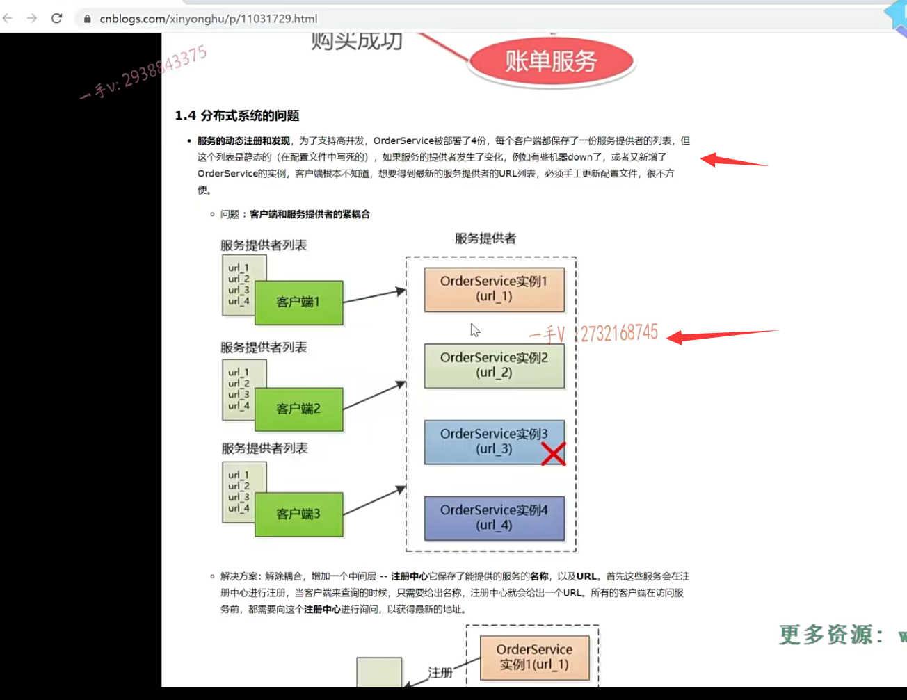

这意思是说呢，你看我给大家把图解释一下啊，

这个右边的这个服务提供者就表示呢，这是一些rpc节点。上面运行了一些order service订单服务的一些实例，

这是我们rpc的调用方。啊，他怎么知道呢？这些rpc服务在哪里呢？你看他本地有这么一个配置文件，这个配置文件太死板了吧？

而且每一个发起方都维护一个配置文件，这配置文件该怎么统一呢？是不是这很明显不是一个非常良好的解决问题的办法呀？

那就像人家题目说的，比如说你第三个结点挂掉了，但是你在这里边没有来得及更新，是不是rpc服务的这个提供者的这么一个列表啊啊？

当他去请求URL杠三。这个结点的时候呢，就是发现呢，它根本没有任何的响应，出错了。

是不是所以呢，以这种方式呢来解决我们服务的这个注册跟服务的发现呢？

是非常死板的啊，不够灵活，肯定也不会被别人采用。

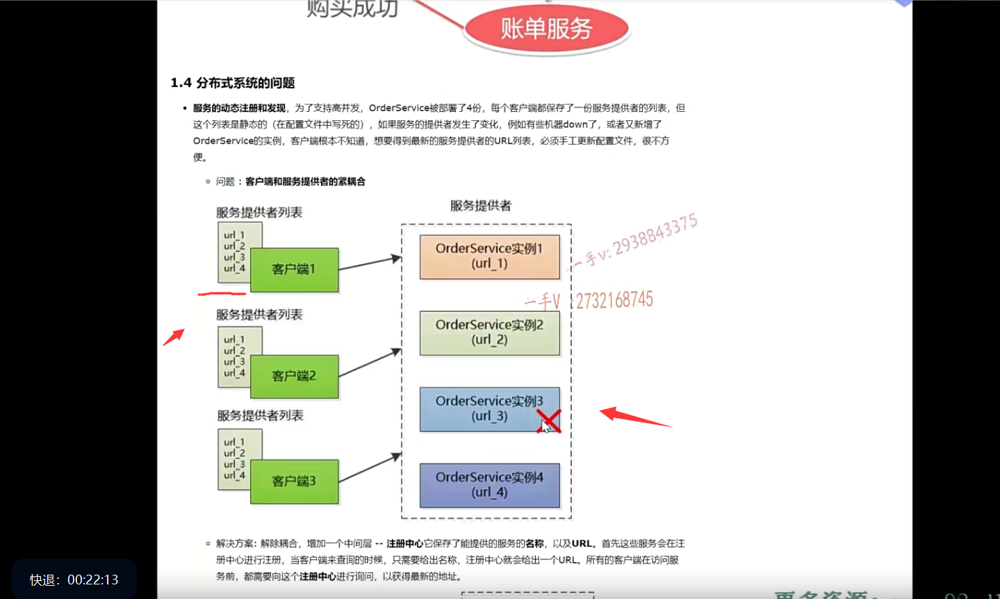

那我解决方案是什么呢？

就是解除偶合，增加一个中间件注册中心啊，服务注册中心，它保存了能提供所有能提供的服务的名称以及URL。

这里边儿说的URL，大家就理解成了rpc服务所在的这个节点的IP地址跟端口号儿，好吧？

首先，这些服务呢？会注册会在服务注册中心进行一个注册，

当客户端来查询的时候呢，只要给出名称，注册中心就会给出一个URL。

所有的客户端在访问服务前都需要向这个注册中心进行询问以获得呢最新的这么一个地址好吧啊，

## 画图解析

那我把这个图呢复制一下，我给大家呢在这个我们项目的这个画图板上呢。

给大家再简单的画上两笔。

大家看啊，那简单来说就是拿我们的这个来说啊。

我现在这儿呢这个user service rpc底下提供的这个login方法登录对不对啊？登录。

这是什么呀？regist这是什么？这是比如说是get比如说是这个friend。service rpc底下的一个get friend。end friends list.

这个服务还有一个。服务是什么呀？是这个模块儿下的一个add friend好吧，

我们举个例子。就是这几个节点上呢，分别都运行独立运行了一个就是很小的我们所说的微服务是吧啊，

然后呢？那别人怎么知道它上面运行了哪些服务呢那？

它首先会把这些服务的名字呀。我就写一个啊，我就写一个注册在这个服务注册服务配置中心上。

啊，写了这个服务rpc对象的这个服务方法login啊，在这个幺九二点幺六八点幺零零点幺二。二零这台机器上的。8000端口上。好吧，

这个幺九二点幺六八点。幺零零点幺二零跟8000端口就是这个服务，在这个rpc节点，这台机器上。啊，这个IP地址跟它所运这个进程所占用的这个监听的这个端口号8000。

==当这个rpc调用方想去调用这个服务的时候呢，他当然不知道这个服务是在哪一台RPC节点上。节点的这个主机上是不是运行的，==

==所以他首先呢，拿着这个名字在这个服务配置中心上去查找一下诶==，

查找出来。这个服务我想调用的服务是在幺九二幺六八幺零零点幺二零八千端口上。

但人家返回了这个IP。

然后接着他就去这个节这个rpc节点上去请求这个方法呀，

### 缺少当我们这个rpc节点启动以后，这儿有一个注册

那实际上呢，就是这个这条线，我们的mpr PC框架是不是都已经实现完了？

包括rpc请求完了以后的是不是这个响应啊？

那我们现在就缺少哪一条线了？

==我们现在缺少当我们这个rpc节点启动以后，这儿有一个注册，你要把你相应的，你这个节点上所支持的服务。注册到这个服务配置中心上。==

啊，然后呢？当我们rpc想访问的时候呢？你首先要拿着你想调用的rpc的，这个服务的名字去注册中心呢，去查一下你这个想访问的rpc服务到底在哪一个服务器节点上的rpc节点上的，拿到IP地址跟端口号，

你就可以发起一个正常的rpc通信了。

好吧啊，这个服务注册中心或者叫服务配置中心，我们就是用zk来注。

好吧啊，这是解决了这么一个第一个问题啊。第一个问题，大家注意一下，

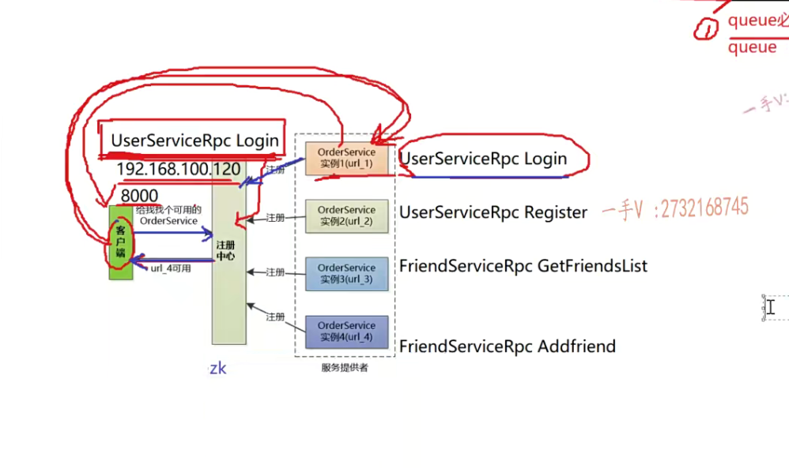

接着啊，那个服务服务中心呃，注册中心可以是树形结构，每个服务前面有若干个节点，每个节点表示服务的一个实例啊order service。啊node 1，node 2，node 3，node 4。

对吧啊，你把这个这个刚刚zero的节点，我们给大家说了，

你把这个想象成一个user service user service这个节点下挂了斜杠login挂了什么啊啊？register登录服务，注册服务是不是在登录这个服务的节点上呢？

你就可以存储什么，就可以存储服务器所在的IP地址端口号嘛。

注册这个节点。它这个节点上存储什么数据？它所存在的rpc节点的IP地址跟端口号。

我给大家说了znodede节点是可以存储数据的嘛。对不对啊？那么给大家画出来吧啊。

你比如说这个这个结点所存储的数据就是什么呀？就是IP加上这个端口号好吧啊，

到时候这个客户端查的时候呢，

在这里边。直接根据你所调用的rpc请求，组织一个路径呗。

啊，就是斜杠user service rpc斜杠loge n对应的就是znode的一个节点呢，是不是路径啊？

哎，路径查一下，查这个路径节点存储的数据，我就知道呢它这个这个想请求的rpc服务呢？到底在哪个IP跟端口号上？

这个能够明白吧OK，相信大家能听明白啊。

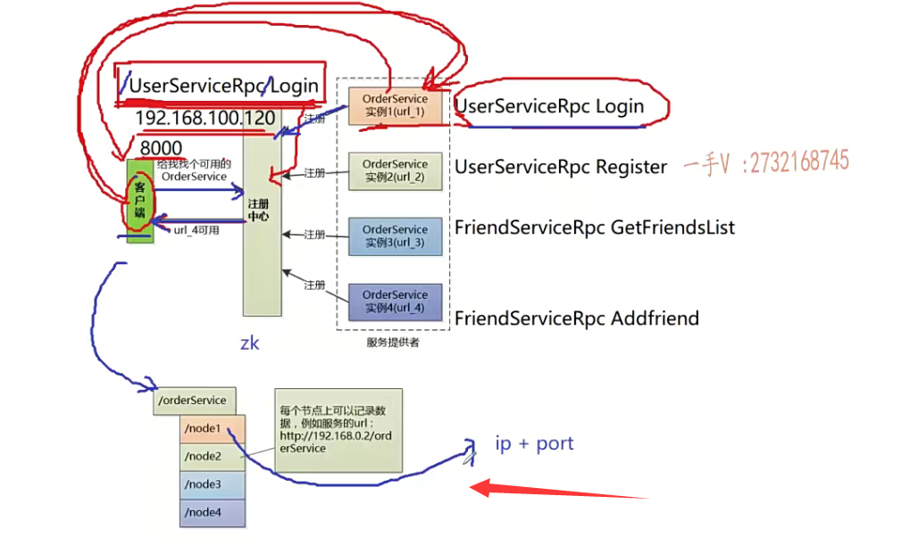

那么，注册中心和各个服务器之间直接建立了session啊，就是会话要求。实例们定期发送心跳，一旦特定时间收不到心跳，则认为实例挂掉了，删除该实例。

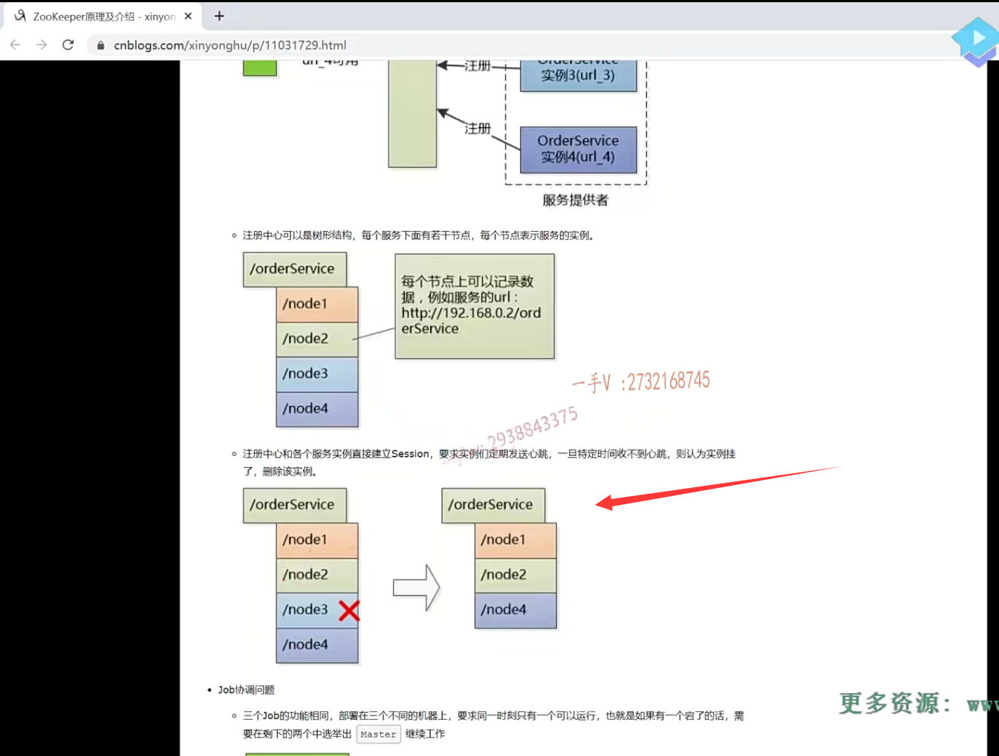

那也就是说，同学们在这里边这个模型现在清楚了啊？

啊，服务配置中心的功能现在清楚了，我们用zk那么这里边儿就涉及到了一个问题，

就是你虽然注册上了。在这个服务配置中心注册上了你的user service rpc，这个login方法呢？你在这一台机器上，那这台机器如果挂掉了呢？

那我们理所当然是你在你服务配置中心上相应的这个节点上运行了这个rpc服务，你应该把这个信息是不是去掉？

但是呢，这是直接挂掉了。啊，有可能是直接停电了，我根本没有来得及跟服务配置中心正常的，是不是？打个招呼啊啊，我要闪人了。

啊，你帮我把信息删掉吧，根本没有这个机会嘛。

rpc节点有可能在上线的时候有可能遇到任何突发的情况，导致直接没没影了，对不对？

那zk不会说是人家很傻的啊，就是你没有了，我相信你还会来的，

所以我在这儿傻傻的等着你，对吧啊？不可能的，

它要求呢啊这个zk呢，要求所有在它上面儿注册rpc服务的这些rpc节点要定期的给它发一个心跳消息。

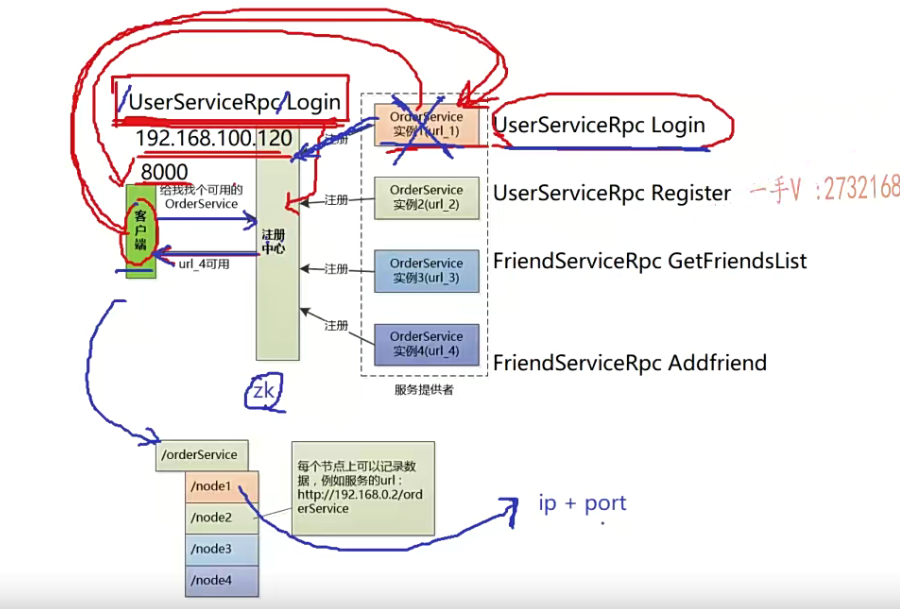

## 心跳消息

啊，什么叫心跳消息呢？

实际上我们有的同学还是不还是不知道什么叫心跳消息。

我觉得这个是让人很头疼的啊，我们同学们在学习的时候，对于一些服务器端常见的一些术语。呀，欠缺的太多了啊，

心跳消息就是。

这是我啊，这是你。咱们俩是网络上的两个节点对不对啊？

你跟我建立了一个什么呀？啊，你跟我建立了一个TCP连接是不是？

啊TCP连接我们大家都知道它是一个可靠的连接是不是啊？

可靠的连接咱俩连接上了。就就可以进行互相通信了啊，如果有一方断开，另外一方是不是会收到一个TCP四次挥手啊？对吧，

现在这个代码上就是啊，socket直接出错了。啊，receive啊，直接返回负一了，对吧啊？

那么，在这里边儿不一定，因为在复杂的网络环境中啊，有可能呢，我们在网络节点啊，我们的这个网络节点发生拥塞。实际上我们我们俩已经无法通信了，但是由于网络发生这个异常导致呢，我根本是不是收不到你给我发他的一些挥手的消息呀。

对不对啊？就是说呢，我这儿根本没有得到任何的一些socket的异常。

那我觉得咱俩之前连接的TCP，这个连接还正常连接着呢。啊，我觉得我跟你还连着呢，能通信，

但实际上我这我跟你还能通信吗？实际上根本通信不了，我给你发消息你也收不着了。对不对网络发生问题了？

### 心跳计数

此时呢，我们就可以维护一个心跳。

维护一个心跳就是你在这里边儿一个心跳计数。心跳计数我初始为零。

我要求你每一秒给我发一个心跳。

啊，每一秒呢，我会把你的，我会把你的心跳计数加个一。

我在这儿启动一个定时器。过了一秒了，加了个一又过了一秒了，加了个二又过了一秒了，加了个三。

偶尔发现呢。啊，这今天要计数都超了三了。啊，再过个一秒加个四。

我说发现呢。心跳都超过这个三了，你还没有给我发心跳消息。

啊，那我就判断你掉线了，不管我跟你连接的时候这个有没有收到TCP四次挥手的这么一个挥手的？这个报文对吧啊？

我都认为你掉线了。你无法通信了。

那么你每隔一秒给我发一个这个心跳，我就把我这个计数减个一。

我过了一秒，加了个一诶，我收着你的心跳了，我减个一就成零了，

我加个一，你减个一，或者你慢了一点，我加到二了，你减个一。

无所谓，只要不超过三，我都认为你在线的啊。

是不是那如果真的是受到你一个TCP四次挥手的报文呢？那我就跟你断开了，

但是网络环境比较复杂的时候呢？

==这个收不着，这个四次挥手报文的时候，那在这儿呢，我就一直也收不到你的心跳消息了，我一直加二。加三+4发现超过三了。你掉线了好吧，那同样的。==

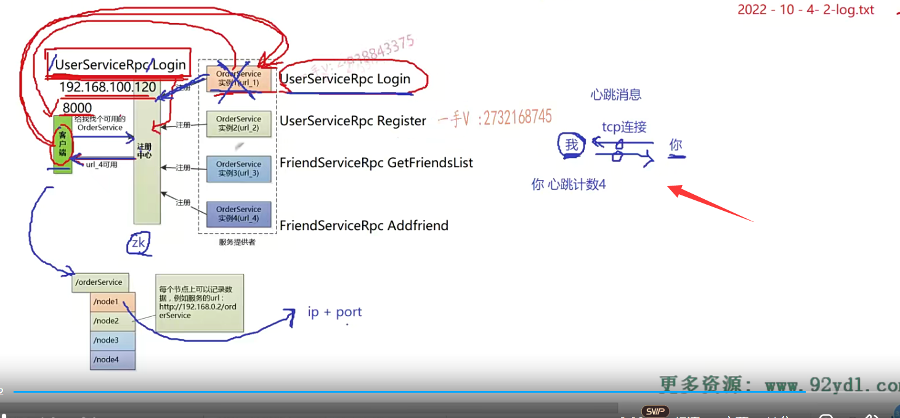

### session会话

同样在这里边。啊，环境极端的情况下，可能我的这个服务配置中心呢啊。

根本不知道这个rpc节点已经挂掉了。

由于网络拥塞呢，我们也根本没有收到的啊，这个服务这个zk这个服务配置中心根本也没有收到任何跟这个rpc节点挂掉的任何的相关信息。对不对？

比如说socket产生异常了。不会的，

那么在这儿呢？同样的道理啊，我们这个zk的这个注册中心呢，跟每一个rpc节点都维持了一个什么 session会话。好不好啊？session会话。

哎呀，你不会又让我解释session会话吧？你了解HTTP协议的话，对于这个session跟cookie你应该。不会那么的陌生吧。

好吧啊，所以有时候感觉给大家讲项目呢，阻力非常大。

因为我啥概念都不能说一说呢，就卡住了，一说就卡住了。

但是我相信同学们能学到这个分布式rpc项目的话，应该对于知识的广度应该是有一些了啊，不会是像我们有些小白同学。说什么都不明白。

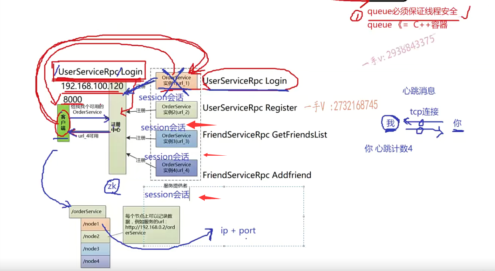

这个会话，你就可以理解为存储了我们这个客户端跟服务器之间所有发生过的一些状态消息啊。

这个session会话人家就维持了一维持了这么一个心跳计数啊。

服务配置中心要求向在它上面注册rpc服务的这些rpc节点都得过一段时间，给他发一个心跳。

如果超时还没有收到心跳的话，它就认为rpc节点已经挂掉了。对不对？

挂掉了的话，服务zk这时候就体现到zk上的节点的一些状态了啊。

### 如果你创建的这个节点是永久性节点

如果你创建的这个节点是永久性节点。那么，当rpc节点这个超时未发送心跳那么zk不会删除这个。

因为这才是永久性节点嘛。对不对？

假如node 3是这个临时性节点。

那么也就是说，当rpc结点呢超时未发送心跳消息。

zk会自动删除临时性节点。

### 临时性节点跟永久性节点

能明白了吧，那也就是说呢，你某一个rpc服务节点呢，向zk注册这个服务的。

注册节点服务的时候啊，如果这个节点呢，是一个临时性节点，

当服务注册中心判断你掉线的时候呢，它服务注册中心会把你创建的临时节点会自动删掉的。

如果你创建的是永久性节点的话。zk不会删。

那我们现在这个项目是想创建哪种结点呢？我们当然是想创建临时性结点了，对不对？当一个rpc服务节点，

这个挂掉的话呢，我们希望zk呢就不要再记录这个信息了。

以免把人家客户端是不是给骗了啊？

客户端一查，那时候发现呢，你注册中心写的是这个rpc服务，在这个节点上是实际上，这个节点已经挂了，我一请求肯定是不是出错啊？

能够理解临时性节点跟永久性节点的区别了吧。

好，那么这节课的主要任务我们就先给大家讲到这儿啊。

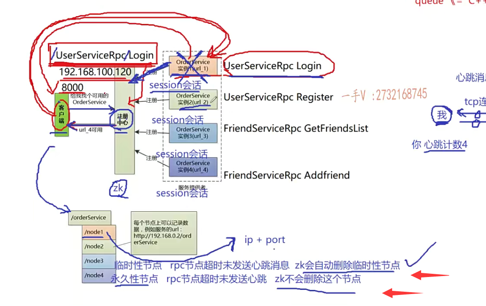