# 回顾上节课内容

### zk的数据组织  相关操作命令ls get create delele等

上节课呢，我们给大家把zk的这个数据是怎么组织的？

znode节点相关的一些内容给大家。

包括它的这个组织结构。对吧啊，节点是怎么访问的，相关的一些常用的操作命令。

它存储的数据的大小是1M，是不是？基于它的这个znode的我们是怎么去把它充当做一个服务注册或者是服务配置中心？

==来让我们rpc服务节点向他去注册rpc服务，==

==而我们的rpc调用端就是客户端这么一个角色rpc，客户端这么一个角色是怎么向服务配置中心zk上去查询我们想调用的rpc服务到底在哪一个节点上对吧。==

==rpc节点，我们所标识的rpc节点是用IP地址跟端口号来标识的。是不是啊？==

### 心跳信息

OK，在这里边儿，我还给大家借助了这个会话这个心跳消息，对吧？心跳技术怎么去描述呢？以可靠的方式来描述这个TCP的连接是否成功？还是断开了啊？

### 节点的两种类型

那在这儿，我们给大家又说了这个节点的两种类型，一种是永久性节点，一种是临时性节点啊。

### 其他自己去拓展

好吧，那么掌握这些知识呢，以及结合着这个zk的服务配置中心以及这个节点存储的内容，

实际上结合我们这个mprPC这个分布式通信的这个框架啊。呃，你已经可以讲出很多东西了，对吧啊？你已经可以讲出很多东西了。

至于zk的分布式锁啊。这个主从储存节点这个切换啊，还有它的这个高可用啊。

呃，这些其他的一些分布式协调这个功能啊。

你可以再去自己扩展，或者说是不去了解也可以，因为你确实是没用到它，对吧？你没用到到它，你把它用到的这个功能跟人家讲清楚就可以了啊。讲的有鼻子有眼，讲的比较生动，不要干巴巴讲什么内容，就一两句话，完了啊，惜字如金，在面试官跟前千万。比较惜字如金啊好，

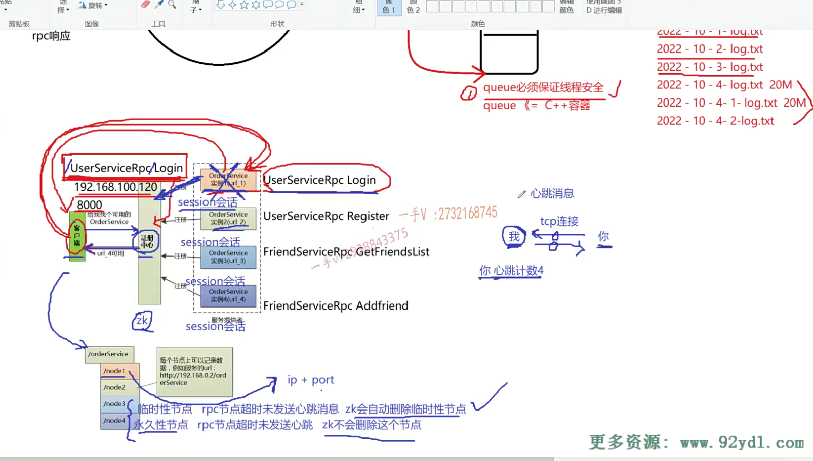

# 本节课 watcher监听机制

那我们这节课再给大家来讲zk的第二个这个机制就是zk的一个watcher机制啊，监听机制啊，

如果你在我的C++高级课程里边儿就是。嗯，听了那个设计模式就是观察者，监听者模式的话，

我相信你对这个watcher机制呢，应该是很好理解的啊。

你看我用一个实际的这个功能来给大家讲解一下这个watcher机制啊，watcher机制是什么呢？

## 解释watcher机制   类似观察者设计模式

当我们客户端想要去调用一个rpc服务的时候，

我会拿这个rpc的这个服务的名字以及它的方法名字组成一个znode的一个节点路径在服务配置中心上去查找一下，这个节点是否存在，

如果存在的话呢？

这个服务存在的rpc节点的IP地址端口号是多少？

我好发起一个rpc请求对吧？

如果这个节点不存在，这个路径的节点不存在，

那就说明我想调用的这个rpc服务整个现在分布式环境当中，根本就没有rpc节点，是不是去提供这个服务啊？

那我也就不要发现rpc请求了，对不对？

没有问题吧？

### watcher机制相当于就是一个通知机制

另外一个就是watcher机制啊，watcher机制相当于就是一个通知机制，一个通知。一个回调机制啊，

通知回调机制。什么意思呢？

你比如说啊，我这客户端你可以通过它相应的一些就是zk客户端编程的API。

啊，你可以添加一个watcher，添加一个观察器啊，或者是监听器，对吧？

监听什么呢？

监听的事件类型还是挺多的。

### 比如说我监听这个节点的变化

比如说我监听这个节点的变化。我监听这个节点的变化。对吧哎，

我在客户端这儿维护了一个什么东西呢？维护了一个map表。

这个map表的键呢？就是这个结点的名字啊zk的节点的名字值呢？就是这个节点所携带的内容。是不是啊？这什么意思呢？

你看啊，我客户端这个首先呢，

向你这个zk啊，对于这个它的这个父结点，添加了一个watch。

那么，如果这个父结点的这个子结点啊？有任何的变化。

我们添加这个watcher就是监听它父节点子节点的变化的，对不对？

如果子节点有任何变化，就是我添加新增加了一个斜杠z node 5。或者说是我们z note 3挂掉了，就节点有增加节点数据，有改变节点有down掉的，

对吧？有这样的事件发生。

你会由zk主动的告知客户端。哎，这个结点相应的这个结点数据发生变化。

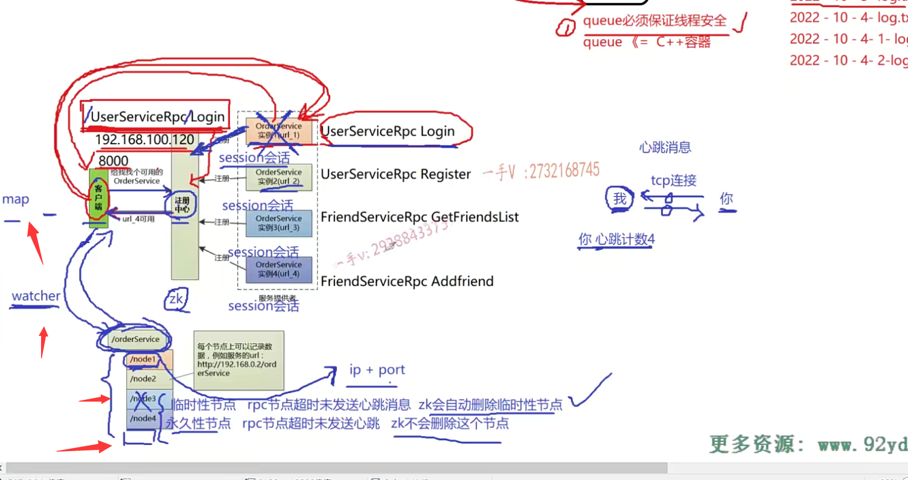

这就是一种watcher机制。watcher机制就是一种事件回调机制了。

就是我告诉你呢。一会儿八点钟有一个非常好看的电视会演，我想看你到八点告诉我一声。

首先我忘了，我现在就可以做其他事情。比如说我健身，我看书，我打篮球，我踢足球都行，对不对？

你做其他事情啊，等到八点的时候呢。这相当于你就是给他注册了一个watcher对不对？那到八点的时候，他会因为你给他注册过了，他就会给你进行一个notify通知啊，就通知你，你感兴趣的事情发生了，你去做吧。

没问题吧啊。

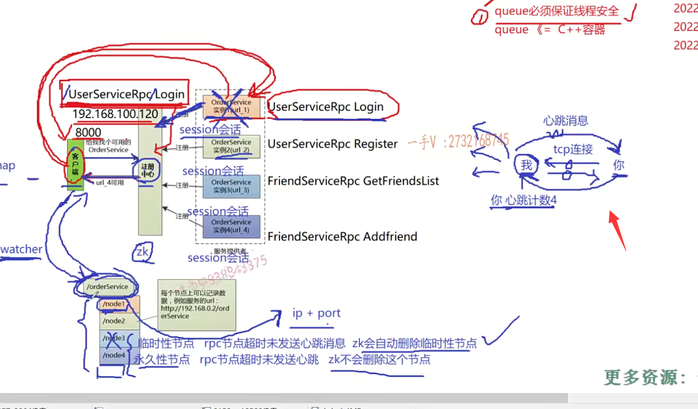

这一项的啊，客户端呢，首先呢，定制了一个watcher，

在这个节点上监听它节点  子节点的任何的变化。对不对哎？

当这个子节点有任何变化的时候呢？由zk会主动的去通知notify这个客户端。

你该处理一些事情了。

这就是很简单的watcher，这个通知机制也没有什么复杂的。好不好啊？

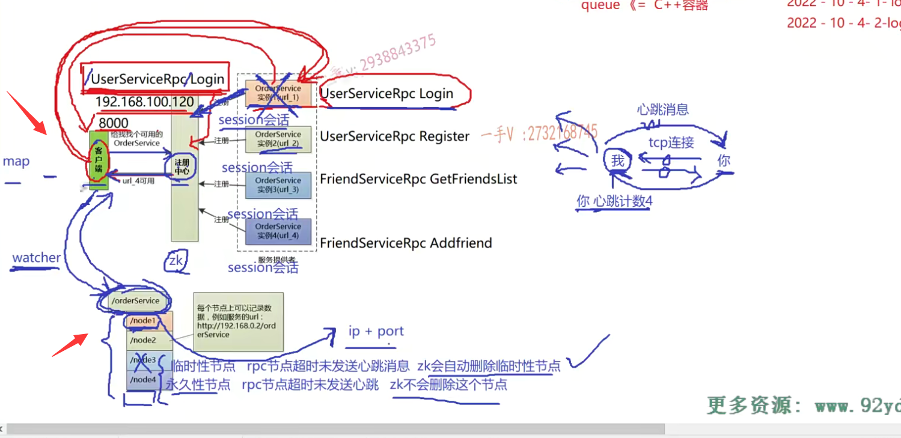

那具体的watch怎么用这个我们在编码的时候呢，再具体来告诉大家，大家只需要在这里边理解watcher是一种什么样的机制就可以了？okay吧啊好。

那么是这个这节课的第一个任务就是理解那个watch的机制啊。

第二个任务是什么任务呢？第二个任务就是在这里边儿啊。

我告诉大家一下。我们毕竟啊，我们mprPC呢，在这里边儿啊，要使用zk作为服务配置中心。

所以我们需要呢，在代码上呢，对zk的这个server进行一些编程好吧啊，进行一些编程。

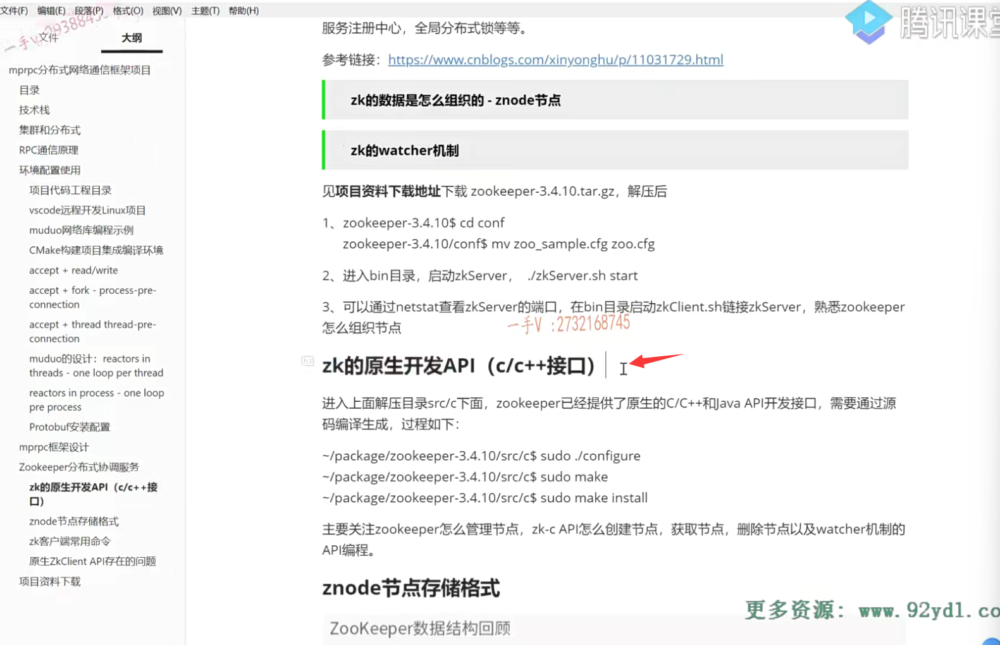

那么，我们要进行zk的编程，就得需要一些zk的原生的这个API啊。

啊，那么zk的这个zookeeper的这个解压包里边儿就已经包含了啊c跟java之间的接口。

大家来看一下啊，大家来看一下，在这里边儿。

就是我进入package.啊，

package里边儿有一个。zookeeper里边儿呢？有一个什么目录啊？src目录就是源码目录啊，这个源码目录不是zk的源码。是它提供的这个客户端开发包的，

你看它主要提供了两类，一个是C语言的，一个是JAVA语言的。

那么在这儿呢？你可以进入这个c。

这就是什么呀？啊，这个就是zookeeper提供给C语言的这个client API的一个源码。啊，

你在这里边可以进行自己进行一个编译啊，自己进行一个编译。

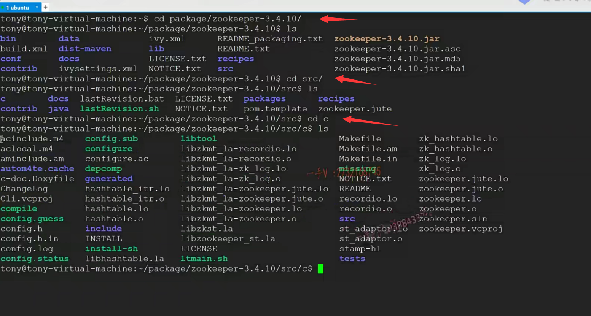

那么在这儿啊，在这儿大家看，我给大家已经把编译的这个过程写好了，

进入上面解压的就是zookeeper的这个源码目录c目录下啊，就zookeeper已经提供了原生的cC++和JAVA API开发接口啊需要通过源码编译生成。

那么，你进入这个c目录以后先用sudo啊，进入超户点儿杠configure。

哎，生成一下它的这个make文件对吧啊？点儿杠configure生成一下它make文件，

然后呢？你就可以make了，make完了以后就make install。

好吧啊，你做一下这个，做一下这个。

这个相当于就是我们从它提供的这个zk的客户端的这个源码编译生成了zk的这个开发包，包括它的头文件跟这个so库。

好吧啊，包括头文件跟so库。

这是它的一个zookeeper  st单线程版本。

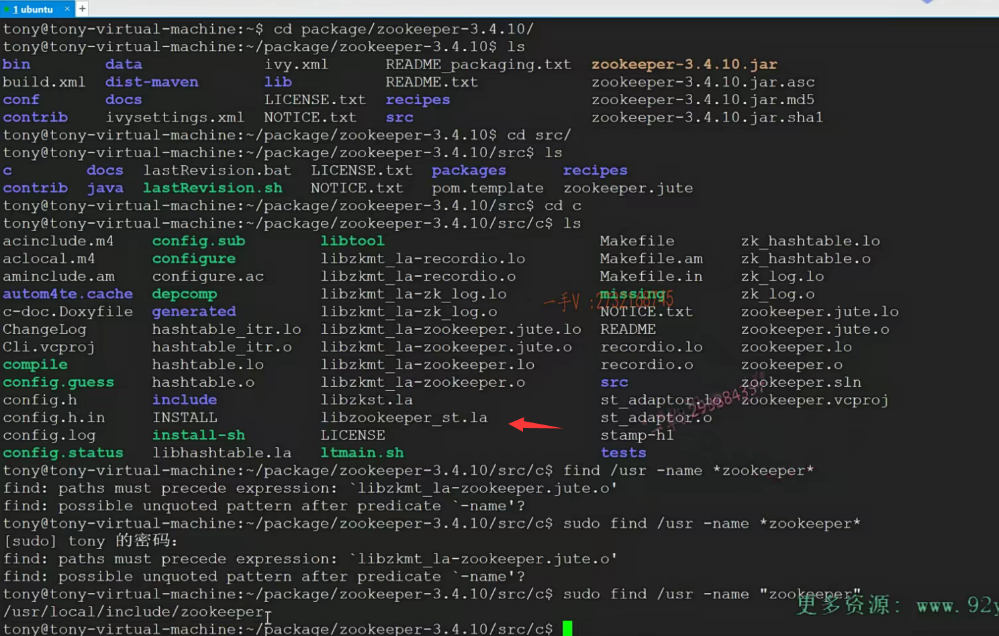

### 找到头文件目录

还有一个，我们搜一下啊。就是叫user。嗯，然后是刚name嗯，叫一个zoo ke。搜一搜。嗯哦，这个不是这个是引号儿啊。

大家看在这里边有一个user local include zookeeper是吧？

这个应该是zookeeper的什么呀？头文件所在的地方。local include.zookeeper，

因为我们在这儿源码编译的时候呢，已经编译完以后，因此到了安装到系统的这个路径了，不是在user include就是在user local include这是它的这个头文件我们编程时候呢，主要包含它的这个zookeeper点h就可以了好吧啊。

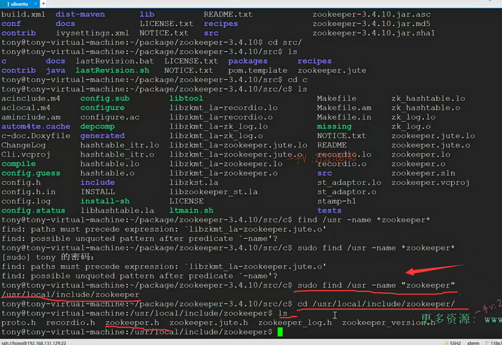

嗯，那这块儿应该呃，应该还有。我看一下啊lib。

你看在这里边有呢？lab zoo杠MT MT就是multi就是zoo客户端的这个多线程版本。

ST就是它的这个单线程版本。

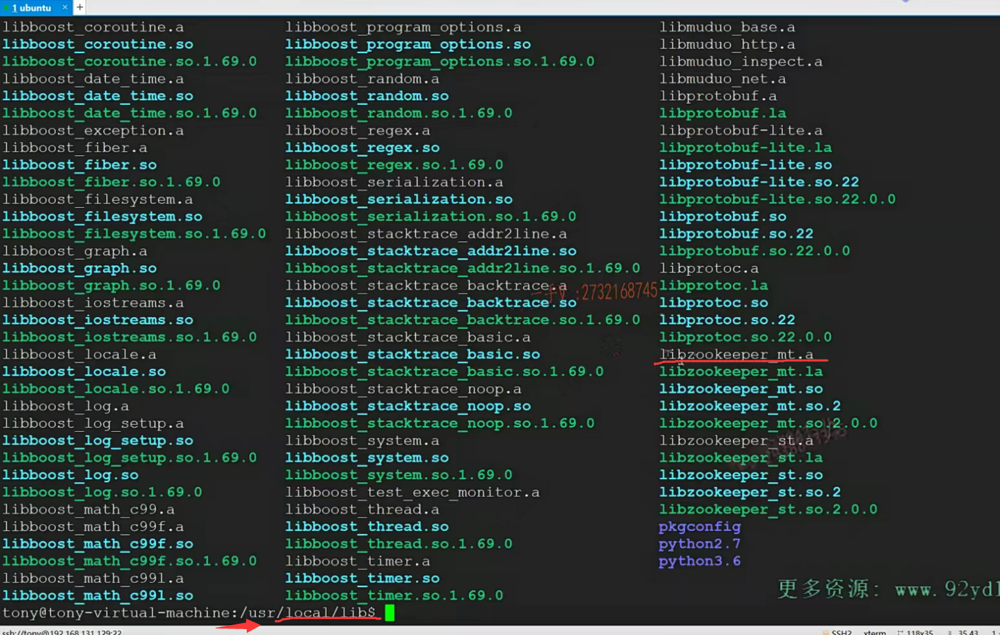

在单线程版本跟多线程版本有什么区别呢？

这个我们到后面zk的这个客户端编程的时候。

再给大家去说一下。好不好？

我们一般用的都是它的，这个多线程版本。libzookeeper杠MT点so。好不好？

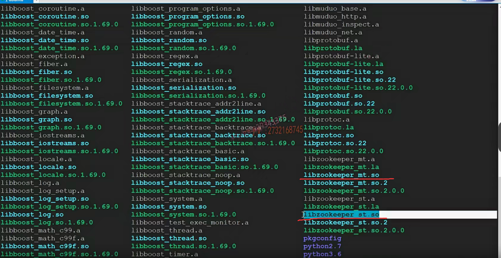

大家编译一下啊。先是点儿杠configure，然后是make make install，

看在user local lib跟include下是否把这个zookeeper编程用的头文件跟so库呢，都给它安装好了好吧，

哎，这是第二件事情啊，第二件事情。

第二件事情做完了以后呢？我们这节课已经说了两件事情了，

第一个就是给大家简单的描述了一下zk的watcher机制，这个还有待我们在代码上具体的看它怎么做啊？

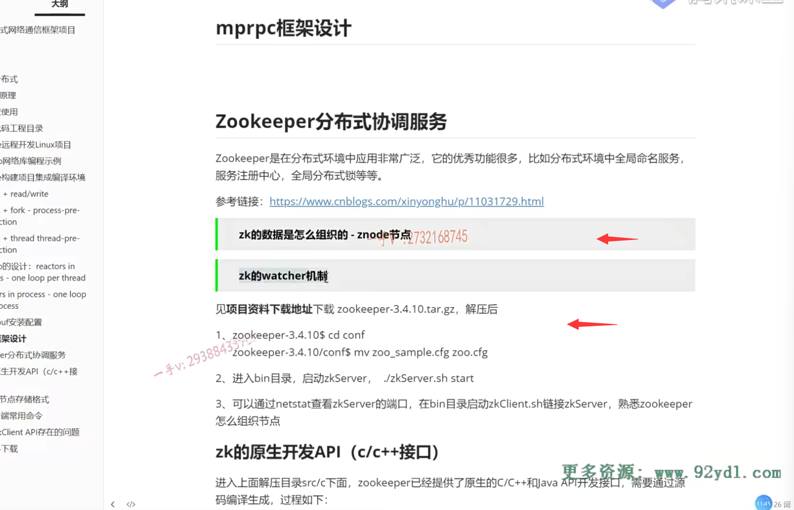

第二个就是zk的这个源码已经提供了c跟JAVA的这个API编程接口啊。

我们进入这个c目录，进行这么一个API接口的编码编译啊。

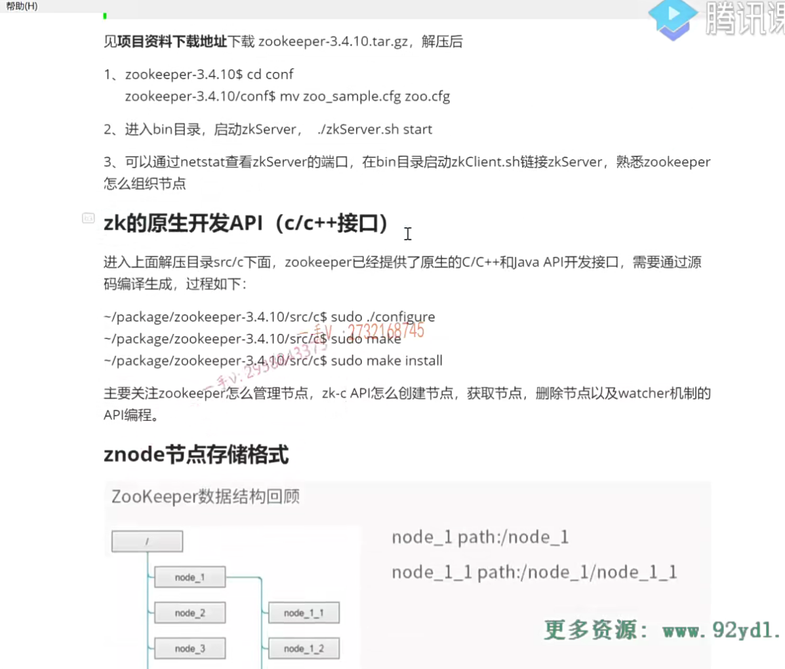

然后进行一个安装。

### zk这个原生API存在的一些缺点

第三个事情呢，就是我们在这儿来吐槽一下啊，就是zk这个原生API啊，原生API。啊，

它存在的一些缺点好吧啊，它存在的一些缺点，

因为我们这个市面上也有一些第三方提供的这个zk的开发包啊。

为什么zk已经提供了c跟JAVA的开发包啊？市面上还要再提供相应的开发包呢？因为zk提供的原生的开发API确实有一些不好用的地方。

在这里边儿，主要三点，我也给大家呢去总结了一下。

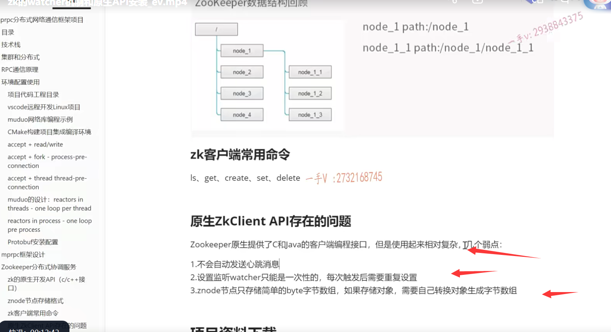

### 三个弱点

zk的原生提供了c跟JAVA的客户端编程接口啊，但是使用起来相对复杂。

三个弱点啊，三个弱点

不会自动发送这个心跳消息。

我们给大家说了，之前的这个心跳啊。

当你rpc服务节点向这个zk的这个服务配置中心呢，去注册一个rpc服务的话，是不是啊？我们注册的都是一个临时性节点。

那么zk的服务注册中心需要你这个rpc这个服务节点定时向zk的服务配置中心呢，

去发送一个心跳，

服务配置中心，才认为你活着呢，

你活着呢，他才会给你继续维护你所创建的临时性节点，要不然他认为你死了，

你死了的话，他把你创建的临时性节点就全部给你删掉了。对吧，

相交的后果就是你还活着呢，但是绝别人却发现不了你这个rpc节点了，对吧？

它无法调用你这个节点上提供的服务了。

### 客户端是不会自己主动发送心跳

==没问题吧，也就是说呢，原生的这个客户端API，你只要连接上zk。写一个你的rpc服务。那么，这个客户端是不会自己主动发送心跳的，==

但是这个心跳要不要发呢？肯定是要发的嘛。对不对？

你不发zk就认为你死掉了。它是维护了一个心跳。啊来判断你是否在线还是不在线的，比如说这心跳是30秒。

啊，30秒的话，它还没有收到你的这个心跳消息，它就认为你掉线了。

啊，所以我们的一种设计就是我们每经过十秒或者每每经过20秒，哎，我给它发一个心跳。啊，让他更新一下，知道我在线。

这就是原生的客户端API 没有提供的这个操作，一般开发的第三方的这个zk的这个开发包，一般人家都会实现这么一个东西，因为这个心跳消息是非常必要的。

好吧啊，心跳消息是非常必要的，必须得发心跳，不发心跳的话呢zk就认为你这个rpc节点死掉了，

就会删除你所创建的所有的临时性节点。好不好啊？

所以这是我们吐它的第一个槽啊。

### 设置监听watcher，只是一次性的，每次触发后需要重复设置

第二个就是设置监听watcher，只是一次性的，每次触发后需要重复设置啊。

也就是说，在这里边儿，

你看我这个rpc客户端框架的这个维护客户端这这一边啊。

当我去向你的zk上注册一个watcher的时候，就是我对你的这个节点下的所有子节点的改动感兴趣。

当你这个节点的子节点有任何的改动的话，包括新增加节点，删除节点，包括节点数据的改动。有所变化的话呢，你都通知我一下。

那么也就是说，它原生的这个zk的客户端编程API。啊，当你注册一次watch，添加一个watch的话呢？

==如果zk给你通知一次的话，你就不要想得到第二次通知了，==

==因为它只要给你通知一次，这个watch就失效了。==

你如果后续还对继续对这个斜杠order service这个节点的子节点的任何的改动感兴趣的话，

你必须在上一次接收它的这个推送消息以后通知消息，以后呢，

你必须重新再去注册一个相同的watcher。

这个是不是就是做了很多的这个重复的操作呀？

啊，这也是我们需要吐槽的一点。一般人家第三方新开发的zk客户端。

把这个watch呢，也都不需要重复去设置了好吧啊，人家又做了一些操作啊，

那现在我们如果直接用zk的这个原生API的话呢？那我们得自己去处理。是吧，

当我添加一个watcher，watcher响应一次，哎，我又必须得添加同样的一个watcher，继续添加一下，否则呢，我不要想再得到第二次通过。

好吧啊，这是吐它的第二个槽啊。

第三座槽呢，实际上对于我们现在来说，必要性不是很大，

因为我们现在在zk上作为服务配置中心，我们只是存rPC节点的IP地址跟端口号啊，

那有的时候呢，你看znode的节点呢，只存在简单的这个byte字节数组，

如果我想把一个对象信息存到这个znode的节点上的话。

我需要把这个对象自己进行一个数据的序列化，需要自己转换对象，生成字节数组，

比如说我们用protobuf把一个对象转成一个字节流。可以存到这个znode的节点上。这个可能对于大家来说比较抽象啊，

如果你想测试的话，你也可以试一下，你试试你定一个user对象，

你想把这个对象存到z node上怎么办啊？你会发现根本搞不了，为什么？

因为z node节点的这个提供的这个API。啊，就是呢，在zk上的某一个节点上。存储数据的这个API。它接收的都是一个字节数组，它根本无法直接接受一个对象，对吧？

你需要自己把对象转成字节数组，那你就需要一个对象的序列化的操作了，

序列化的技术手段了，你用json也行，用put buffer也行，

但是不管用哪个，这不得你自己做吗？是不是啊？得你自己做。好吧啊呃，

这是原生的这个zk的API存在的一些问题，

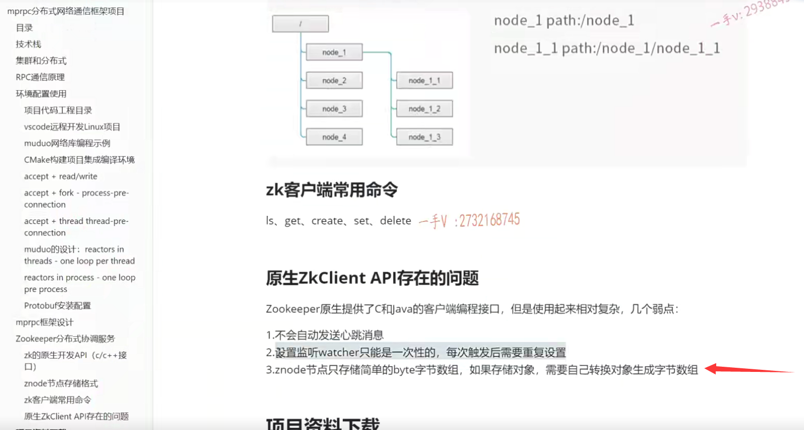

就是我当我们去做相应操作的时候呢。我们一定要补这个坑，

尤其是前两个坑，在我们项目中呢，是一定要补的。好吧啊，

那具体在代码上怎么补？我们就在实践编程的时候呢，来给大家说。

## 总结

好吧啊，那么这节课我们主要告诉了大家三个内容，

第一个内容就是怎么理解zk的watcher监听器机制？好不好？

第二个就是通过zk的源码生成它的客户端开发API这么一个操作步骤，给大家都已经说了啊，

如何检测在user local这个include跟lab下看看。

zookeeper相应的头文件跟它的这个so库到底有没有安装？

第三个就是给带着大家一起吐槽了一下啊zk原生API，

就是它原生提供的API所存在的几个问题。

啊，我们项目上是要补这个坑的。

啊，那具体到我先说这些东西的，具体的一个代码上的应用啊，我们到后边给大家在代码上进行一个详细的讲解啊。

至此，我们给大家把这个zookeeper啊，zookeeper这个分布式协调服务。

它主要在我们这个项目上的一个功能，就是服务配置中心以及它的必要性，对吧啊？

没它我们玩儿不转。

以及它完成这些功能的核心的两个点，一个是它的一个特殊的文件系统。

用路径来管理这个zeno的的节点以及zeno的的节点怎么存数据的啊？

永久性节点和临时性节点，另外一个就是它的一个watcher机制。好不好啊？

把这些内容理解了，你对zk的这个理解啊，已经掌握了20%。

去阐述它的一些基本的内容，没有任何的问题啊，

希望大家呢，听完这两节课呢。

把zk相关的这个知识也总结总结总结一下啊，哪些东西你了解了，哪些东西你还想继续深入了解，那你问老师也可以。自己去网上去搜索一些资料，阅读一些资料也都没有问题的，去扩展一下知识的宽度啊

好，那这节课的内容呢？我们就给大家说到这里