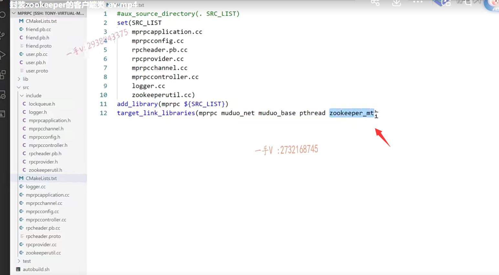

大家好啊，这节课呢？

我们老传统啊，已经到项目后期了，我就不带着大家把zk的代码呢，

客户端代码一点儿一点儿写了啊。呃zk客户端的这个安装，我们已经给大家说了啊，

其API呢，网上描述的也都很多，大家可以在网上任意搜索。

在这里边儿呢，我用它提供的是c api啊，我给大家呢写了一个类来，

把它的主要我们能用到的啊API封装了一下，

其实我们用到的API特别特别的少。

呃，首先呢，我们在写zk代码，之前代码都好写，最主要你要理解它，我们为什么要它，我们之前给大家说了啊。

我们就是rpc服务的提供端，要在这个rpc节点服务启动之前。要把它上面所发布的服务往zk上注册啊，

我们zk在我们这个项目中作为一个服务配置中心，对吧啊？

这个service name作为一个永久性节点，

然后底下挂的是它所提供的method name就是方法名啊，临时性节点对吧？

然后在这个节点，临时性节点上呢？它存储的是什么东西呢？

它存储的就是这个服务啊啊，所在的这个IP地址跟端口号好吧啊。IP地址和端口号。

那么，当我们这个rpc调用方呢？再去调用服务的时候呢，那我们得知道这个服务在哪台主机上运行着呢，是吧？

就可以在zk上来去查找一下就可以了啊。

zk我们之前给大家说了，它是基于一个跟linux一样的，一个特殊的，这么一个文件系统啊。

跟linux文件系统一样，有根目录对吧？

它都是一个一个的这个节点啊，进行存储的每一个节点上都可以存储一些数据好。

### 包含头文件

那么，在这里边，大家看我首先在我们框架src的include里边呢，

添加了一个头文件，叫做zookepperutil.h。  

util 一般就是工具类的意思啊。zookeeper utl点h啊。

那么，在这里边儿呢？我定义了呃，你需要包含一个zookeeperutil这么一个头文件，

这里边儿大家看到还包含了一个信号量，为什么要信号量我一会儿来给大家解释啊？

## 封装的zk客户端类

这是封装的zk客户端类啊。

那么，这是一个构造析构函数，

这是一个start，这是start是干什么的呢？就是启动连接相当于就是zk client嘛啊，启动啊，连接zk server。好吧啊zk server，

### create根据指定的path创建这个znode的结点

这是create这是干嘛呢这是？这是在zk server上。根据指定的path创建这个znode的结点啊。

大家看到这个接口呢，不仅有path，就是znode的节点的这个路径嘛，对吧？

还有这个节点的数据啊，这个数据的长度以及呢？

这个节点呢是永久性节点，还是一个临时性节点啊？那在这里边儿，我们都给大家封装了一下，默认是零就是永久性节点啊。然后呢？我们可以通过传入相应的参数呢，来让它成为一个创建的一个临时性节点啊。

get data

那么，这里边儿这个get data是干什么的呢？

就是传入参数，根据参数指定的znode节点路径，获取znode节点的值

好，我们说znode节点不就是存值的嘛。是不是哎，

这个zk上默认一个节点的这个数据上限是1M啊？

### m_zhandle 一个客户端的这个一个句柄

这个m_zhandle呢，实际上它。啊，你也不用把它。你想看你可以看一下好吧，

它就是这么一个类型啊呃。

你可以把它理解成这样的一个句柄啊。

这个句柄就标识了，就跟我们大家用数据库的时候呢，会用到mysql的这么一个类，是不是啊？

就表示呢，就它相当于就是我们一个客户端的这个一个句柄，通过这个句柄呢，我就可以去操作这个zk server了好吧啊？

OK，那么大家来看看，这是它的这个类这么一个封装，

然后相应的我在src下边呢，原文件下边呢，又创建了一个zookepperutil点CC。

注意创建文件以后呢，先别着急往里边儿写东西，先在我们的这个slc的cmakelist里边儿。

把这个我们要即将添加的这个zookepperutil.CC。这个原文件的名字写到这里，

到时候我们用cmake来构建我们项目的这个编译的时候呢？

这个文件呢就能够编进去啊？好，那么大家来看，

## 封装的zk客户端类实现

首先在这里边儿包含我们相应的一些头文件啊。

那么要连接zk的服务器，我们需要知道zk的这个IP地址跟端口号是不是

在所有的东西都在配置文件里边，所以我们包含了我们整个文件的一个整个框架的一个基本的应用类啊，就是mp rpc application点h。

### 构造函数

好，那么大家来一个一个看啊，在构造函数的时候呢，只不过给这个句柄呢，初始化一个空这个句柄是一个指针好吧。

### 析构函数

那么，在析构函数的时候呢？

这个指针如果不为空的话呢？那相当于就已经跟这个zk server连接了，是不是啊？

把这个句柄关闭掉。把这个句柄关闭掉好不好啊？

这个相当于就是关闭这个句柄，释放资源的嘛，

你还记得mysql的时候呢？聊天儿的时候是不是应该有这么一个mysql connection？是不是这样的一个句柄类型啊啊，

当你创建成功以后，当你和这个mysql连接成功以后呢，

你在本地就有这么一个句柄啊，肯定记录了连接的一些信息嘛，是不是？

这个z handle呢，表示一样的啊。

### start()这是连接zk server

start这是连接zk server对不对哎？连接zk server。

那么，大家注意连接要连接zk server的话呢？

那首先呢，通过我们全局的这么一个配置，加载一下zk的IP跟端口号。

而我们现在的这个zk呢，也是运行在当前的这个linux主机上的啊，它默认是2181端口，

#### 修改下配置文件，配置成zkserver的ip port

所以呢。你在运行的时候呢，注意把你bin目录你测试用的这个test点conf。

这个zk的配置信息IP地址端口号端口号改一下，我们之前写的是5000对吧？现在你改成zk真实的一个端口号2181，不要忘了啊。

那么注意。我们连接的时候用的是人家zk客户端提供的一个API 。

zookeeper init，这个不是我写的，这是人家库里边的这个API。

### 将zk 多线程库也需要包含

好吧，刚说了啊，在src的cmakelist里边儿，不仅仅要添加这个源文件，因为我们用人家的这个c  api的这个so库了。

所以你要把这个zoo杠MT也要添加在我们框架的一类的so库里边儿。好不好？

这是一个ST跟MT ST是单线程版本。MT是多线程版本，一般我们用的都是多线程版本。好不好啊？

那么为什么叫多线程版本？多线程在哪里了？我一会儿来给大家去讲一下啊。

### host人家的格式是给定

首先呢，人家的这个zookeeper init啊，里边儿的第一个参数，

你看第一个参数host

人家的格式是给定的啊。

就是你需要以这样的方式IP地址冒号儿端口号儿好吧，

你看host commerce separated host冒号儿。port pairs以这样的格式啊。

那也就是说，我们从配置里边读出来zk的IP跟端口号以后呢，我们得组织一个连接字符串就是IP冒号端口号，然后作为一组zookeeper init的第一个参数。

### 第二个参数需要一个回调函数

第二个参数呢？它是需要一个什么东西呢？需要一个回调函数，这个回调函数呢？长的就是这么一个样子。好不好啊？

实际上呢，大家对于这个不理解的话，慢慢去理解一下好吧啊，zookeeper呢，

对于大家来说。这肯定是一个比较新的东西啊，需要花费一些时间去理解，大家可以去多多利用一些网上的资源啊。去了解了解啊。

好，第三个呢？就是它的一个会话的一个超时时间啊，会话的超时时间，当时给大家已经讲了啊。

啊，这两个参数没有用，最后呢一个零就OK了。

那么大家来看啊。返回以后它返回的这个值呢，就是我们需要用的句柄the handle

都已经传IP地址端口号了，肯定要进行连接。是不是啊呃，

这个返回值指针为空的话，就是连接失败，

### 会话的创建是一个异步   它真真正正接收到zk server的响应的时候呢，它会给你帮你去调用这个回调

你注意一下啊，在这里边儿人家都已经说了这个API说明。this method creates a new handle and a zoo procession that corresponds to the handle啊，

这个函数呢是和zookeeper创建一个会话的啊。

==session estypelished is a sickness.会话的创建是一个同步还是异步的啊？==

==asynchronous是不是synchronous是同步asynchronous是异步的？==

也就是说呢，这个会话的创建是异步的啊，meaning that the session should not be considered estypelished until。啊until直到 an event of that zoo connected state is received，

那也就是说呢，并不是说你调用这个函数，这个函数返回以后就表示连接成功或者连接失败了，并不是这个样子的。

啊，就是你发起这个zk的连接跟zk的这个连接成功的响应，它是一个异步的。

那怎么个异步呢？就是说我负责发送这个连接请求嘛，对不对？

==哎，这不是有一个回调函数嘛？当它真真正正接收到啊。==

==啊，接收到就是zk的这个客户端啊，接收到zk server的响应的时候呢，它会给你帮你去调用这个回调。==

## zookeeper的这个API客户端程序啊，提供了三个线程

啊，所以这里边儿就要给大家介绍呢，为什么说是zoo杠MT这个多线程版本啊？

也就是说zookeeper的这个API客户端啊。这个程序啊，提供了三个线程。

### API调用线程

一个是API调用线程也就是我们当前线程，

如果我调用start的话呢，这里边会执行这个zookeeper init。会执行zookeeper init啊，它执行zookeeper init的话呢，那也就是说这是当前的这个线程，就是我调用线程。

好吧，在zookeeper init这个zookeeper的API，大家都是从zookeeper的源码。

这个c目录里边儿编译而来的是不是，

有兴趣的话？哎，我专门为了给大家去把这块儿呢讲清楚，

我专门看了一下zookeeper的这个客户端的这个源代码啊，

今天要给大家澄清这么几件事情啊，之前呢，我们有一些小的错误呢，也要给大家在这节课里边儿强调到。

### 网络lO线程

这是一个线程。啊，这是一个线程，然后还有一个线程是什么呀？网络lO线程。zookeeper init这个函数底下呢，直接就调用了pthread create了。

啊，创建了一个线程，专门发起一个网络的IO操作，这不是要连接这个zk的这个什么啊？zk的这个server嘛？是不是

它并不是说在这个zookeeper init这个函数里边直接发起的IO连接，

如果直接发起的话，那API调用线程去调用这个API的线程跟网络lO的线程就是一个线程，是不是

人家直接起了一个pthread create，就是专门在一个线程里边儿做网络l操作，

==它底层用的是poll并不是用select或者epoll==

它用了一个poll，毕竟它是一个客户端程序嘛，不需要做到高并发，对不对啊？

这是个独立的线程。

### watcher回调线程

然后呢？当这个客户端接收到zk server的这个响应的时候呢，像这个watcher。

watcher这个watcher回调线程，这也是一个独立的线程。

在这里边儿也就是说呢，我们在这儿返回值为空就表示呢，

这个发起的动作都没有产生过，也就是说你传的参数呢，可能都有问题。对吧啊，

这就是直接是init error，

### 创建了一个信号量   句柄资源上给它set 指定的这个句柄呢，添加一些额外的信息

然后呢？我这里边创建了一个信号量。这个信号儿量呢，在这里边儿初始化了一下，初始化的资源为零。

这里边把它设置成 ，这什么意思呢？

就是给这个上下文啊，

上下文，实际上在这里边儿就是给这个监听器传参数呢啊。

因为zookeeper如果成功的话，这个成功表示创建这个句柄创建，句柄资源成功了，

并不是说连接zk server成功了好吧啊。

在这里边儿像这个句柄资源上给它set，就设置上下文。你可以理解成给指定的这个句柄呢，添加一些额外的信息。好吧啊，

添加一些额外的信息，把这个信号量带过来了。

然后这里边主线程就是主线程，这里边semi wait等待，

因为我初始化的信号量是零，所以这儿呢，肯定是阻塞的下不来，下不来，

也就是说zookeeper init success

什么时候success呢？你得等zk server给你响应的时候。

这个函数调用完就表示zk server给你响应了吗？并不是这个函数调用完，只是说创建本地资源的这个句柄呢？

啊，比如说内存开辟初始化。成功了，

那网络连接发送到zk server上，还没有收到响应呢。是不是响应是怎么来的呢？

就我注册一回调。啊，我注册一回调，你看在这里边儿，

我也给这个句柄呢，是不是绑定了一个信号量啊，

### 这个全局的回调函数

然后呢来看？这个全局的回调，这个回调的参数呢，

你可以通过这里边儿。哎，你可以通过这里边。这不都写好了嘛，是吧啊？这都写好了。

这第一个是什么呀？

第一个是哎，就是当前客户端的这么一个句柄，我们刚才给句本绑定什么了，绑定了一个信号量是不是哎，设置了一个信号量。

你可以给它设置很多的这个数据啊。

那么，这是type state，这里边儿就是固定的了啊。

type就是session event，那就是这表示什么类型啊，这个回调的消息类型。

### 通过zkclient事先注册的这些回调来发通知

这个表示zk server。给zk client的通知。zkclient之前发送过消息给zksever zksever收到处理了以后呢啊，

==怎么给zkclient发通知呢？==

==就是通过zkclient事先注册的这些回调来发通知的啊。==

这个回调消息类型是和会话相关的消息类型，这不都是session event了吗？会话相关的，

==那不就是连接或者是断开连接吗？会话超时是吧啊？==

如果type是这个的话，

然后state是如connected state，这表示zkclient和zk server连接成功啊，连接成功，

连接成功以后呢？

### 信号量资源加一

而我们之前在这个句柄上是不是设置过一个信号量啊？

哎，他通过zoo get context。刚才设置的时候是zoo set context，

现在是从这个指定的句柄上，我们看刚才给指定的句柄去设置了一个信号量，现在呢？

我们从指定的句柄上获取这个信号量，

然后呢，给这个信号量的资源加一  sem post。

哎，这个给信号量的资源加一了，以后呢，

==同学们注意zk server给zk client通知的时候，这又是一个单独的线程。==

啊，我们说zk的这个client是一个三线程的好吧啊？

然后这里边儿呢，就会给信号量资源加一，

这里边儿信号量资源加一的话，

我们主线程调用API的地方，在这里有 sem wait。这儿是不是就看到信号量有资源了就下来了，

这儿就zookeeper in it success。

这就是通过它的zk的这个API连接zk server的这么一个具体的过程。

大家来思考一下啊，思考一下这个过程。

## 再梳理一遍过程

首先呢，我再来给大家说一下啊，

首先你在这个添加完这个源文件以后呢？

在这个src的cmakelist里边儿，添加一下zookeeperutil点CC以及它所依赖的so库好吧。

### zkserver不是同步的，不会阻塞 直到返回   是异步的

那么其次呢啊？其次呢？

就是在这里边儿，我们要理解start都做哪些事情？

呃，核心的连接zk server的API就是zookeeper init，这不是我们写的，

这是zk客户端给我们提供的，对吧？

那这里边儿我们通过读人家的这个API接口说明啊，

大家以后在开发项目的时候呢？啊，都会去读API说明文档的好吧啊，不要怕英语，那就是你硬着头皮都得读的好不好，要多积累啊。

我们一看人家的这个方法的描述，我们就知道了哦，这连接这个zk server并不说同步的，就是我zk init连接以后，我就阻塞到这儿了，我就直接等到你 zk server给我返回了嗯，并不是这方法，

### 会话就不要考虑建立啊。直到什么时候才考虑啊，直到event of state zoo connected state is received就是这么一个状态的消息被收到

接口已经说了啊session estypelish is asynchronous，是一个异步的啊。

meaning that the session should not become就是意思是什么？

你这个会话就不要考虑建立啊。直到什么时候才考虑啊，直到啊event of state zoo connected state is received就是这么一个状态的消息被收到，是不是就是我们全局的这个注册的回调里边的state这个消息啊。

### 连接zk server的字符串就是这种格式

那我们给大家说啊，首先我们从配置文件里边加载zk的这个IP地址端口号，必须组织成这种格式，

因为呢，人家zk net要求。连接zk server的字符串就是这种格式。好不好啊？

然后呢？我给大家说了啊。

zookeeper的这个MT多线程版本呢，就是我们客户端所依赖的so库啊。

依赖的zk的开发包的so库，它是个三线程，

三线程，一个是调用的线程。这个起来的话，直接调用了两次p thread create，

一个是专门干什么呀？哎，一个是专门负责网络IO。网络收发的

一个是专门负责干什么？负责给客户端进行一个通知消息。

通知是谁给谁通知呢？是zk server给zk client啊？

当调用zookeeper init传入连接字符串，传入全局的这么一个回调啊，

传入这个会话的超时时间。其实你不传入，默认的会话超时时间就是30秒啊。这是一个比较好的时间，我们也不要乱改了，其他参数我们都传入默认值，不用管

这个返回值。空或者不空，并不是说代表连接zk server成功或者不成功，

只是表示呢，我这个句柄的内存开辟。初始化到底有没有成功？

如果为空的话，有可能内存都不够用了，对不对？

这里边儿。zk init error的错的话，我们直接退出进程吧。就不要了啊，

因为你起来的话，你服务也没法发布，服务没法发布，别人也不知道你这儿运行了什么服务，你这儿永远接接收不到rpc请求，

运行起来没有意义，是不是啊？

### 初始化信号量为零值   主线程就阻塞  

那么，在这里边儿呢？直接执行到下边儿来了，实际呢？

到这儿呢？就其中的这个网络lO线程已经把这个消息的发出去了，好吧啊？

在这儿的话呢，在这里边儿创建了一个信号量啊，创建了一个信号量给我当前的这个句柄呢，上下文绑定了一个信号量，

然后呢，等待这个信号量，因为初始化信号量为零值，所以这信号量呢，获取不到资源。

主线程就阻塞到这里，我当然要阻塞到这里，

#### 连接zk server到底成功没成功，我成功我才向下走

因为我需要知道我连接zk server到底成功没成功，我成功我才向下走，

不成功啊，那我就想其他办法了，对不对啊？

### zk server真的连接成功   zk server会给我们下发一个通知

那么在这儿大家来看看。

这个当zk server真的连接成功以后呢？

zk server会给我们下发一个通知啊，

在这个全局的这么一个回调函数里边儿，

我们只需要过滤相应的type跟state，

我们就可以知道诶，这也表示呢，连接成功了。

连接成功以后，我们给这个句柄绑定的上下文中啊，绑定的这个信号量给它semi post，这就是我们刚才在这里边儿设置的post。

信号量资源加一的话。获取信号量。诶，这个就连接成功了。好的吧，哎，这个就连接成功了。

大家再仔细的。想一想啊，再仔细的想一想，结合着这个图。想一想，这个应该不复杂的，就是一个异步的连接过程嘛，对吧啊？

## create（）函数

嗯，好，那么这里边create ，

create这个参数，我给大家介绍一下啊，

第一个就是path，那我每一个节点是不是都有一个path？

啊，每一个节点都有一个path znode的节点，都有一个path。

那么，这是节点上存储的数据，数据的长度，

这个state呢，就是一个状态是临时性节点还是永久性节点啊？

### zoo_exist()

那么，我们比较重复的去创建节点嘛，

首先呢，我们看一下调用一下zoo exists。啊，这是它的这个句柄，这是你要创建的节点的zero的节点的path对吧？

先调用一下这个函数，这个函数呢？

### 返回值

如果返回值。

你看在这里边。check the existence of node in the sequence ly诶，这是个同步的对吧？这是同步的判断，

你指定的path  zookeeper表上是否已经存在？

啊，返回值有OK operation completed successful就是你这个操作是成功的啊。这个no node，the node does not exist，那就是说你要你判断的这个结点并不存在。是不是并不存在啊？

所以在这里边大家看啊。这里边儿我判断了，判断了啊，

判断就是flag如果等于z no node就表示呢，你要创建的这个zno node的节点并不存在，

不存在我是不是才创建啊？如果要存在了，我就不创建了好吧啊，

如果存在的话，这个是先判断path表示的znodede节点。是否存在啊？

如果存在。就不再重复创建。啊，就不再重复创建。好的吧，

那么这个表是什么呀？表示path的znodede节点不存在。

然后在这里边就是创建。

创建指定path的znodede节点了。

### zoo_create()

这个第一个是什么啊？第一个就是句柄path 

data datalens好不好啊？

然后这个这里边儿是跟权限有关的，大家不管了，就用这个默认值就行了啊。

state 

path buffer跟这个bufferlen在这里边儿，大家也不用管了，这是人家这个接口需要的结果。

需要的你就往上填就可以了。好不好？

### 最主要注意的就是flags   永久性节点

在这里边儿，大家最主要注意的就是flags，

也就是我们在这里边儿给大家传播的相应的state这个地方啊。

这个flags呢，大家注意就是这个。

==啊，就是这个这两这就是这个值默认的话，它创建的是永久性节点啊。==

然后呢？如果有这个标志的话呢？它创建的就是一个什么节点啊？创建的就是一个临时性节点。

永久性节点跟临时性节点怎么去区分呢？

其实很好区分啊，之前给大家讲过呢。

你看看一下这个啊。用get命令我查看一下呢，这个节点而发现呢，这里边儿呢，这个m for honor是个零。

这如果是个零，就表示它是个永久性节点，否则的话就是个临时性节点，

### 永久性节点跟临时性节点的区别

永久性节点跟临时性节点的区别。我给大家说了吧。

对，就是连接zk的这个zk客户端，如果跟zk server呢？

呃，超时了就没有发送心跳或者是异常断开超时了，

那么zk在zk server上创建了临时性节点就会自动的被zk server所删除掉。好不好？

那这里边儿就是返回值，就是依然是z OK，

大家可以多读一读人家API的说明啊。

zk client呢？人家这个API呢的说明还是写的是非常详细的啊，非常详细的。

好吧，这就表这个里边儿的这个逻辑，主要就是两个逻辑，

首先呢哎。我先判断一下，你要创建的这个znode的在不在？

不在，我再创建，在了，我就不创建了啊。

如果不在的话呢，我就创建根据你的这个state来表示呢，创建临时性节点还是永久性节点？

啊，怎么判断呢？我们启动这个zk client在这里边儿，通过get我们看到这个zero的节点信息。

很容易通过这个字段来判断出它是永久的还是临时的，这就是永久的。好吧啊，

那这个就再没什么了啊，这就是都是一些异常的判断。

## get data（）

还有get data，那我们到时候呢？

想访问一个服务，那我得拿到这个服务所在的IP地址端口号是不是啊？

在这里边儿呢，就是根据指定的获取znode节点的值。

啊，获取znodede节点的值。

### zoo_get()

那么，在这里边儿就是zoo get啊！zoo get。

==好吧啊，你看gets the data associated with the node synchronously也是以同步的方式来获取一个znodede节点的值的啊。==

第一个是句柄，第二个是path。

这后边儿就不用管了，人家需要啥你就给啥就行了好吧啊。

在这里边儿，人家把节点的这个内容呢，就放在这个buffer里边儿了。

所以你看这个flag，如果不等于zOK。

就get返回值这里边儿说了嘛啊zOK是operation completed successfully就是操作是成功的啊，

==如果不等于z OK，表示这个操作失败，那我们在这儿打印了一下，实际上大家都可以把这里边儿的cout放在我们之前写好的日志模块里边。是不是==

在这里边儿是方便看我给大家直接用cout 打印了啊？

这儿表示出错呃，获取节点的这个数据失败了，

这里边儿返回一个空字符串，否则我就返回这个buffer。OK吧啊，

## 总结

这就这么几个函数就足够我们用了啊，足够我们用了，

主要就是主要就是四个，

第一个是start。

start主要是连接这个zk server，==它是一个异步连接过程，所以我们要绑定一个一个函数全局的一个回调函数。==

啊，这个zk server给我们zk client下发的通知都是在这里边儿，这是一个独立的线程里边儿运行的啊。

然后第二个就是create就是创建一个znode的节点，

这个是什么获取指定znode的节点的值的？

这创建zenode的节点的时候呢，你可以给zenode的节点呢。

哎，绑定相应的这个值对吧？还有state是永久性节点还是临时性节点？

OK吧，这节课我主要给大家说了这么几点啊，

第一个就是。

首先添加了一个在我们框架代码上添加了一个zoo util点h跟zoo util点CC。

把我们zk操作的这个客户端啊，相应的功能方法呢，我们给大家封装了一下。

这里边呢，我就不一一给大家去讲了。好吧啊，就不一一给大家去讲了，之前呢，有些东西呢，给大家说了啊。

不是说这些代码呢，你必须一行一行的得搞明白，最主要你要搞清楚业务上为什么需要它。啊，他们处于一个什么样的角色，把它说清楚就OK了啊。

能不能写？能不能写的好，写的这个快，这要看你的熟练程度了，好不好啊？

那么再者呢，就是把它呢添加到在我们框架的c make list里边儿，添加源文件以及依赖的库。呃，在你的这个可执行文件里边儿，

把你的test cofer里边儿的这个。这的这个端口号改一改。好不好改成这个zookeeper server的？这个正确的端口号二幺八幺。

## 总结

好，那这节课呢？学完以后，大家把这个。就zookeeper封装的这个zk client，这个类以及它的这个方法的实现。

大概把它看明白啊，知道它是做什么的？就可以了。好吧啊，就可以了。

啊，大家也可以去调用一个自己写一个main函数嘛啊，就编译一下这两个类，

### 可以去调用一个自己写一个main函数 去连接服务器，去创建节点，并查看是否正确  去测试

连接一下zoo杠MT这么一个库。啊，试着在代码上去连接一下zk server，

创建一下节点，然后呢？你用这个点zk啊。

进到这个zk呃的这个bin目录下，用这个点儿杠zk clamp来连接一下。zk s server，

然后呢？你就可以在这里边儿用zk提供的命令来看一下你代码上创建的这些zznode的节点呢？到底有没有出现正不正确，对吧啊？

可以测试一下。

这个测试大家可以自己来做，

我们就直接给大家在代码上去实现我们想要的相应的功能了，好吧啊。好，那这节课的主要内容就给大家先说到这里。