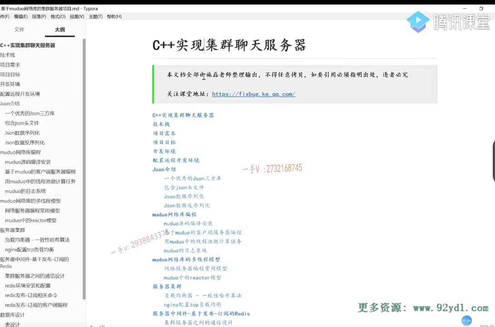
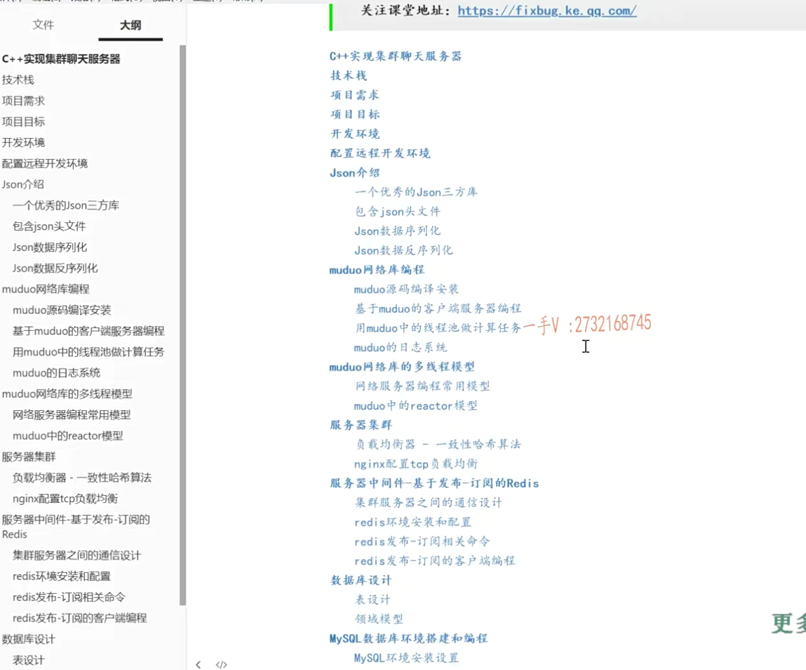
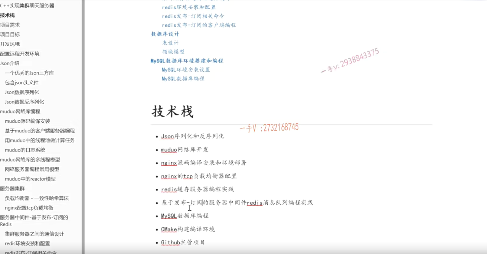
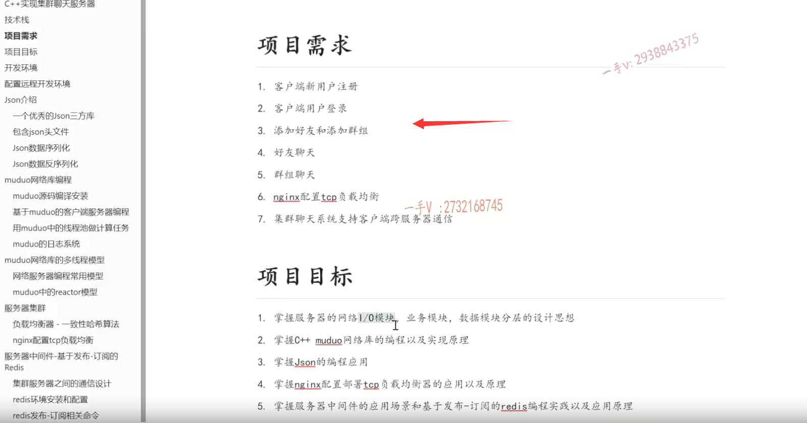
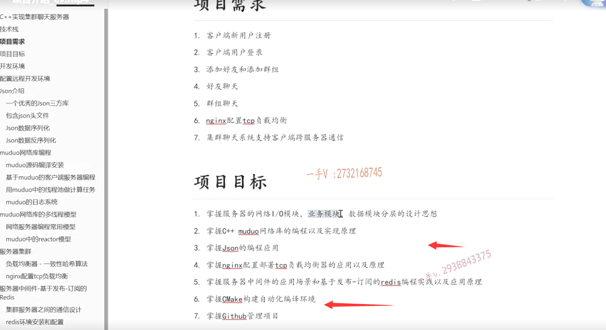

大家好，这一节课开始呢啊，我带着大家，我们一起写一个啊，用C++写一个集群的这个聊天服务器。

那么，大家所学习的方向呢？都是基于linux的这个CC++呃一个高性能的一个服务器的开发，对吧？

所以呢，在写项目中啊，比较热点的就是高并发啊，网络服务这个聊天服务器呢。应用场景呢？

也比较简单，就是局域网的聊天对吧啊，局域网的聊天。

那么在这里边呢？我们先做一个单机版本的啊，单机版就是一个聊天服务器，

那我们为了扩充聊天服务器的整个的这个能力呢，就是可以提供给更多用户啊，

这个享受这个聊天服务，

那我们很简单的，就是横向可以扩展聊天服务器的这个机器啊，可以扩展十台甚至20台聊天服务器，这就涉及到服务器的集群了，

### nginx

那服务器集群里边儿啊。这个设计的一个必备的一个模块儿就是负载均衡器，也叫做反向代理啊，

那在这里边儿我就着重给大家介绍一下nginx的TCP负载均衡的一些配置部署啊，以及一些它的一些原理性的东西都是。

在面试中啊，面试官也比较嗯，喜欢听的对吧？像这些nginx呀。啊red is呀，相关的这些开源的一些模块儿啊，是非常有价值的啊。

那么，整个的这个项目这个流程呢？就是我给大家我们这节课先给大家介绍一下项目的一个大致要做的东西啊，以及我们的项目目标啊。

### json

那从后边的课程，我们再一步一步的再给大家去，从环境的这个安装啊配置。

然后从各个模块，比如说我们这个项目中啊，有用到这个json啊，之前呢，在线下的项目中给大家讲过protobuffer的这个应用啊，

我们知道啊在客户端跟服务器之间在网络通信间，我们数据通信比较复杂的情况下，我们需要借助一个数据的啊序列化跟反序列化的一些协议的对吧啊，

我们用xml json或者pro to buffer这个项目中，我们采用了这个json。

有些同学呢反馈啊，我已经掌握了protobuffer的应用，能不能在这个项目中？使用json再学习一下呢，

那我们这个项目就用json呢，来给大家介绍啊。这个数据的序列化跟反序列化，那么当然是服务器，我们会用到muduo网络库啊，

那服务器集群的话，后边我会给大家专门讲我们先开发一个单机版本的，然后再给它集群啊，

我们集群要考虑什么，我都会给大家说到啊，

### 数据库

这块儿呢，我们最后还会用到这个数据库啊，数据库因为我们这个项目的需求包括用户的信息啊啊，这个好友的这个列表信息啊，群组的列表信息啊都会存储在这个数据库当中，

### muduo

那么数据库我该怎么去创建表？该怎么设计？

立足于我业务，我该怎么去具体的设计我的表以及表与表之间的关系啊，

我们到时候呢，后边儿讲到相应的模块儿，我们再给大家详细的列举。

这个项目整概来说，你所能学习到的技术栈有哪些呢？

就是json的一个应用场景及编程的这个实战应用啊。

muduo库。muduo库那么在同学们这个做项目的时候呢，可能更多的就是依赖一个非常稳健的啊，第三方的一个网络库。像libevent muduo库啊，

当然呢，我们muduo库呢是一个陈硕大神呢，用这个C++来写的，我们既然也是用C++在做这个项目啊，所以我们选择muduo库。

### redis

那么还有集群的服务器集群以后呢，我们所用到的这个负载均衡啊nginx啊，

我们要给大家去介绍一下，

为什么我们要进行nginx源码编译安装，而不用它直接编译好的呢？

对吧，因为我们需要依赖它的一个TCP负载均衡的这个模块儿啊，

还有跨服务器通信啊，需要用到一个服务器中间件。

那么在这里边，我们选用redis的发布订阅的这个模式呢啊，来做我们集群服务器嗯，

跨服务器通信的一个中间件的一个消息队列来解偶各个服务器之间这个硬连接啊，这是一个非常不好的设计，对吧？

这个服务器跨服务器之间通信呢？我们必须引入一个服务器的中间件，这样来说的话会非常的好一点啊，非常的好，那么为什么好呢？

### cmake编程

对吧啊，我们也是到单机服务开发完了以后再做集群的时候，

我们再给大家去列举相应的应用场景啊。

包括呢mysql的数据库编程，我们整个的这个项目编完了以后呢，

我们不需要自己写makefile，我相信呢，让同学们自己写makefile啊，

当工程大了以后呢，绝对是一场噩梦。

那么，现在呢？所有的开源软件基本上来说都是用c make来构建的啊，包括muduo库啊，本身呢，也是用这个cmake来构建的啊，可以非常简单的去写一个集成编译环境啊，

所以在这个项目中呢，我们也是用cmake来构建这个编译环境的，

最后呢，我们会把这个项目呢放到这个github上进行一个托管啊。

### 项目必须有价值

那么，做项目我们说呢？一是你这个项目必须有价值啊，涉及你的linux c跟C++。在高并发服务器方面的。

对吧啊，设计一些集群或者是分布式啊，那就更好了，

在这里边儿再设计一些服务器的中间件。那就更不错，

把你项目所涉及的东西呢，好好的去理解一下啊，我相信这就是一个非常有价值的项目。

然后呢，把它放到git HUB上，把git HUB的这个链接地址呢，拽到你这个项目描述啊，项目名称的后边儿。是不是啊？这个就非常有价值了，这是你自己写的，不是我凭空说的啊，我建议大家这样去做一下。

那这个项目整个的这个需求也不复杂啊，就实现了这个新用户的注册啊，用户登录啊，好友添加跟群组添加好友聊天，群组聊天。然后就是配置nginx的

基于TCP的负载均衡能够实现呢，跨客户端呢，跨服务器通信对吧啊，

==就是多个客户端注册到了不同的服务器，它们能够跨服务器进行通信。==

==而不会经过服务器跟服务器之间进行硬连接的通信啊，这样的方式呢，非常的不好。==

==这是项目的整个的一个功能需求点好吧啊。==

### 项目的目标

那么，在这里边儿项目的目标呢？

就是让大家能够掌握服务器的网络lO模块儿，业务模块儿跟数据模块儿分层的一个开发设计思想。

我们写一个带有业务类的一个服务器啊，带有业务类的一个服务器，

那么这里边儿涉及的网络模块儿的代码业务模块儿的代码就是服务模块儿的代码以及数据库底层的这个模块的代码啊，把它们砸到一块写，

还是做一个相对来说比较好的分层？对吧，我lO模块儿啊，我将来我不想用muduo库了，我想用个lib event，

我在不影响我硬模块儿跟数据模块儿的情况下，能不能随意的更换网络lO模块儿？而对我其他业务模块代码影响最少呢，唉，这就是分层的好处，

对吧啊？我将来呢？我不想用mysql数据库了啊，我想换一下对吧啊，

我也可以在这里边随便换。那么将来呢？我不想用这个json作为这个数据的序列化跟反序列化使用protobuffer可不可以？

可以，那你直接修改业务模块相关的代码就行了，我不需要改其他的。

那么掌握C++网络库的编程，以及实现原理，掌握json的这个编程啊，

掌握这个nginx部署TCP负载均衡的应用，以及负载均衡的这个原理。跨服务器通信为什么需要一个服务器中间件的这么一个消息队列啊？

redis又是怎么做到这一点的？怎么用cmake来构建自动化编译环境那么。

在git HUB上去维护我这个项目，这应该是比较简单，我的课程里边儿也有给大家教这个如何使用git啊，如何使用git以及git HUB来维护自己的一些代码项目对吧啊？

好，那这节课呢？就主要是给大家这样去介绍一下啊，从全局的方面去介绍一下这个项目需要用到的一些东西啊，技术栈技术点需要实现的一些功能。

希望大家呢，对这个项目上啊，有一个全局的了解，那么后面我会带带着大家呢。一步一步去实现一下啊，希望大家呢，去多动动手啊，多动动