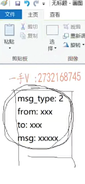
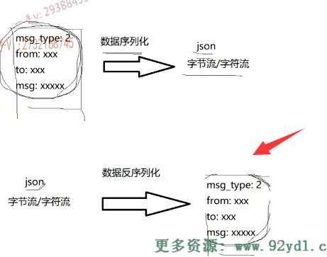
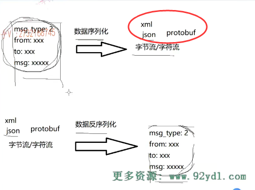
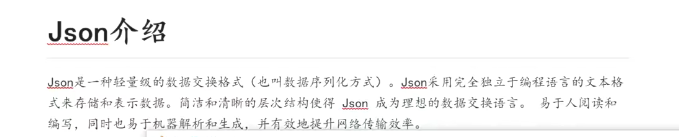
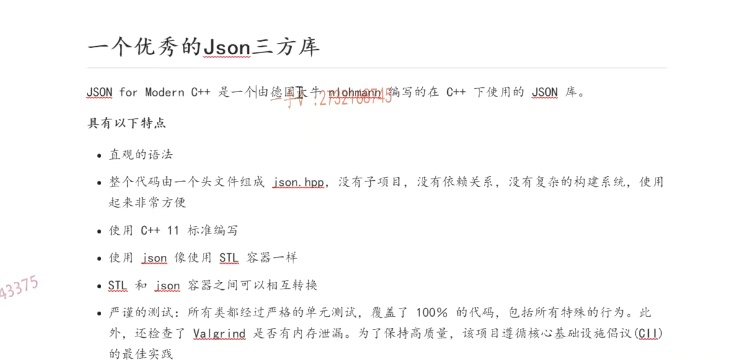

这节课呢，给大家主要把这个json呢，先介绍一下。

呃，我们的这个项目啊，在通信的时候啊，

你比如说。各位我们啊，发一个聊天的消息啊，

那么消息的种类很多，那这个聊天的消息呢，可能会分。啊，这样的，

## 聊天消息的结构

这个消息里边啊，细分这样的字段message type，这是一个什么类型的消息？

是登录消息，注册消息，还是说它是一个聊天的消息，还是加好友，还是创建群组的消息，对吧？

这个消息的类型，比如说二就是聊天儿消息啊，

那聊天儿消息呢，三是聊天儿消息那里边儿肯定就。

这个消息来自谁from  to谁给谁说的？对吧啊，

还有具体的这个message是什么？

那如果说是一个聊天消息的话，它是不是这样的一个结构啊？

### 进行数据的序列化 转成了相应的一个字节流

那大家知道呢，我们通过这个网络发送的时候呢，通过TCP发送的话，发送的都是字节流啊。

啊，所以呢，对于这样的一个消息结构呢，我们应该把它想办法进行数据的序列化啊，数据序列化。

序列化以后呢，把它转成了相应的一个字节流啊，字节流也行，或者是字符流也行。

好吧啊。进行一个发送。对吧啊，进行一个发送，

### 远端主机接收字节流  反序列化成消息

发送到远端以后呢，也就是说呢，远端主机接收到我这字节流啊，字符流对不对？那么它要上报给这个应用啊，

它上报给应用以后呢哎，应用再从这个字节流或者字符流里边儿呢，把这个数据反序列化。

反序列化成这样的一个结构。啊，这个字节流或者字符流就是json的字符串。没问题吧啊。

这是我们要把我们规定好的这个消息啊，消息体先给它进行序列化，

序列化的意思就是转成json啊。

然后呢，再从这个对端呢，再从接收到的这个json啊，json流在数据反序列化得到具体的消息。

那这一块呢？数据序列化，你可以用这个最早的有xml对吧啊？

实际呢，它里边的这个就是节点元素呢，特别多，标签儿也特别多，比较浪费空间啊，json就好很多，

当然现在呢，用的比较多的都是protobuffer啊，

因为pro to buffer呢是存储数据呢，会更高效啊，会更高效那么。

这就是我们现在在项目里边，大家在项目里边做数据的序列化跟反序列化所能用到的东西啊。

呃rpc项目中呢？我们给大家说过pro to buffer这个rpc框架的这个分布式框架的这个项目呢后期我也会给大家去更新一下啊。

在这个聊天项目中，我们这里边采用的这个数据的序列化跟反序列化方式呢，就用的就是这个json了。好吧啊，使用起来呢，也非常的简单啊

==proto buf使用呢，还是有一定的学习成本的啊，你是需要去学习很多东西的，但是json使用起来就特别简单了。==

## json介绍

那么在这儿呢，有一段描述啊，

json是一种轻量级的数据交换格式，也叫数据序列化方式。这个完全独立于编程语言的文本格式来存储和表示数据，

也就是说呢，它不仅仅可以把我们打包的这个数据进行一个序列化跟反序列化，

更重要的就是它是脱离于，独立于编程语言的。

### 不同部件用不同语言开发，但是都可以中间转成json来交流

大家是学这个c跟C++的，对吧？

你的客户端跟服务器一般都是用c跟C++啊，去写那么假设呢？

我们客户端是用cC++写的，服务器是用JAVA写的，

或者反过来客户端是用JAVA写的，服务器是用c跟C++写的，对吧？

这就像一个人讲英语，一个人讲中文一样，两个人如果自己讲自己的。

他俩沟通呢，根本是不是没有任何的效率啊？

那么没关系啊，没关系，大家都认识json是不是？

虽然呢，我们在整个网络服务中不同的部件呢，是用不同的语言开发的，

但是大家都认识json啊。

所以我们大家之间交流就用json进行交流就可以了，好吧啊，

==你不管是什么开发的，你想要把数据发给我，你就先把数据序列化成一个json字符串好不好啊？==

==哎，我收到json字符串的时候呢哎，我就可以把json的字符串反序列化成我这个主机，我这个主机所在的这个所用的这个语言啊，能认识的消息体。好了吧啊，==

这也是呢，它的一个好处啊。

简洁和清晰的层次结构，使得json成为理想的数据交换语言易于这个阅读和编写。同时，也易于机器解析和生成啊，有效的提升了网络传输的这个效率。

它确实是比xml的效率要高，但是呢，它没有pro to buffer的效率高，

但是呢，它相对于pro to buffer来说，pro to buffer有学习成本儿。

而它的使用是我觉得任何人都是可以去理解接触的啊。

## json的这个解析模块

### 使用第三方json库

那么在这儿呢，我们是当然不会自己去写一个json的这个解析模块儿啊，那么我们用的是json的一个三方库。啊，就是一个json for modern C++是有一个德国的这个大牛啊，

人家写的非常的好用，我们直接用人家的就可以了。

这里边儿有一些课件上啊，给大家罗列了一些这个json for model c++的这个三方库的一个特点啊，一个特点。

整个代码文件呢，就由一个json点hpp组成的啊，

这个之前也给大家说过，我们想用json的话呢，我们直接把json点hpp直接拉到我们的项目当中就可以了。

没有任何的依赖关系啊，没有复杂的构建系统，使用起来非常非常方便。

那么，使用这个json就像是大家使用C++的stl容器一样啊，

尤其是一个特点就是stl容器和json容器之间呢，可以相互做转换。非常的简单啊，非常简单。

## 总结

好吧，那这是一个对我们项目中啊，为什么要使用json 以及json是什么。

json呢？在我们整个的这个服务器啊，网络环境中是承担什么样的角色？

我们要进行json的序列化跟反序列化，是我们自己写一个序列化跟反序列化模块呢，还是直接用一个优秀的三方库呢？

在这里边儿呢，我们就给大家都介绍了一下啊。

那么下面几节课，我们就给大家演示一下啊，json的使用，

我们把整个项目。这个嗯，书写过程中所依赖的一些其他的模块啊，所涉及的这个独立的这个代码编写呢，先教给大家。

然后我们把各个模块儿都掌握了啊，然后呢，我们再去着手去写这个项目代码。好，

这节课的这个json的这个介绍就给大家说到这。