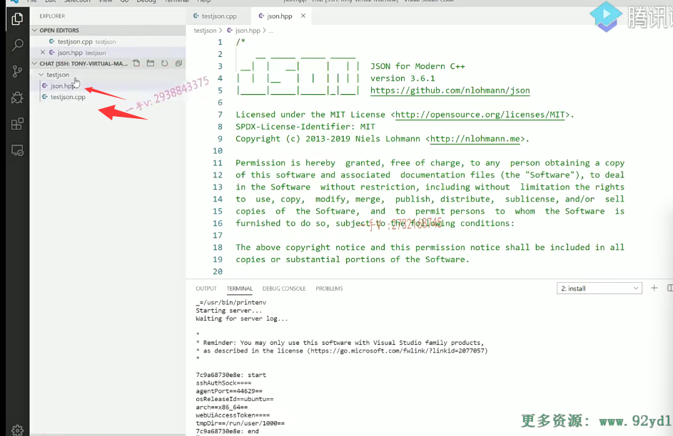
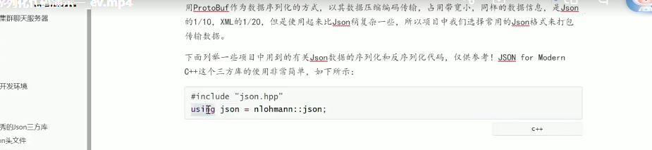
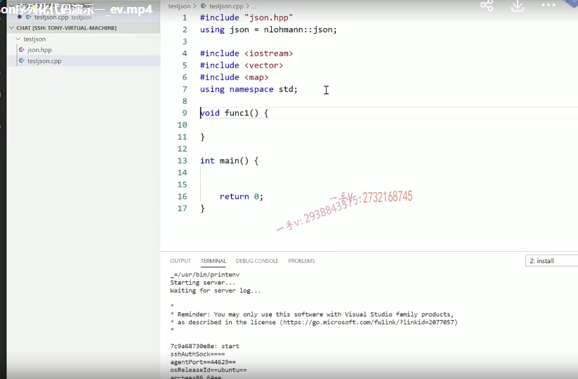
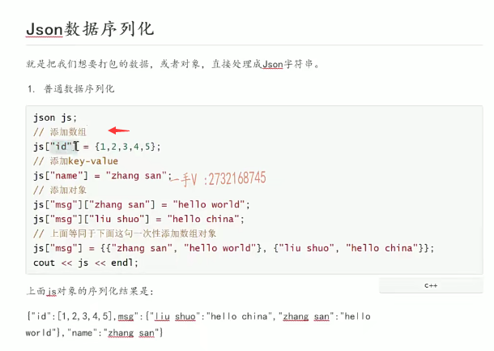
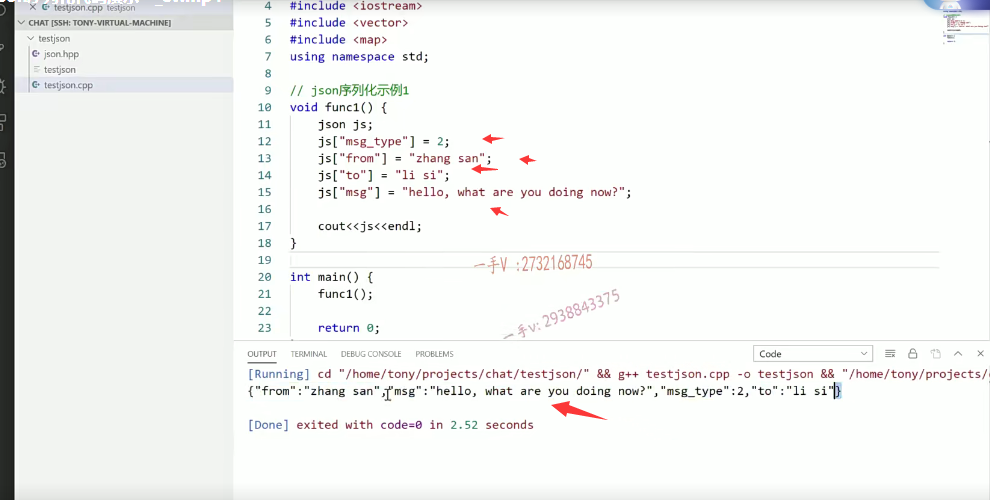
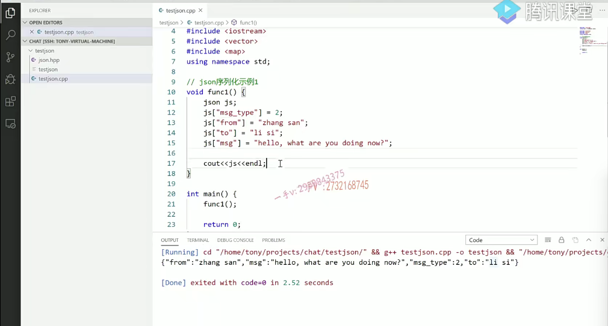
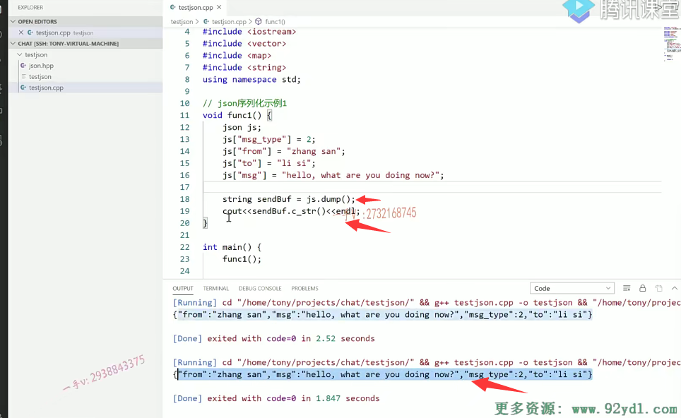
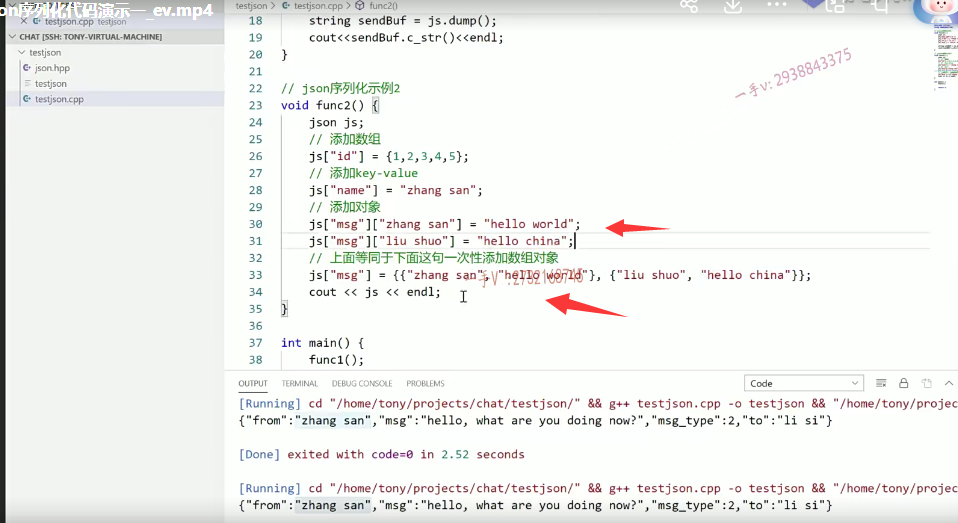
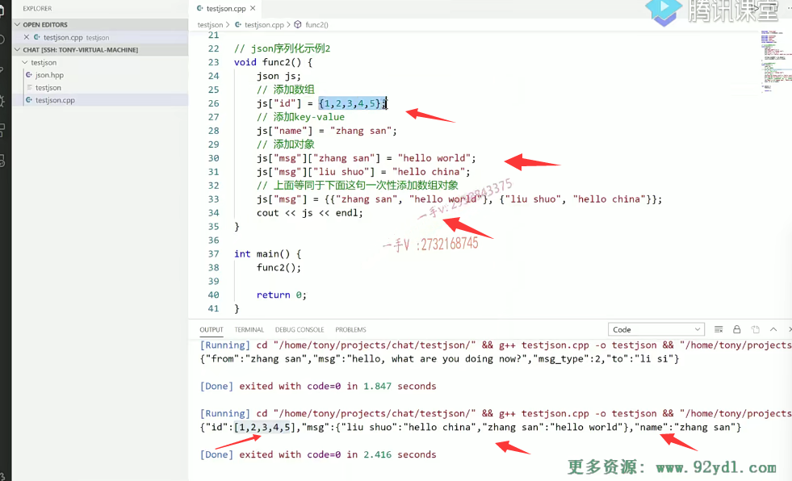

这是呢，我用VS code啊，已经连接了远程的这个linux虚拟机。

在这儿呢，我是连接了其中的一个目录啊，这个目录是一个空目录啊，

我现在在里边儿创建一个文件夹。

比如说我现在呢，这个是一个test什么东西啊？test json吧啊，这是个文件夹。

呃，里边呢？

创建一个文件叫做test json。cpp.好的吧，

那我们先来说一下json的这个序列化啊，

这节课那么我们使用json，我们都说了使用的是一个非常优秀的json的这个三方库啊，json for modem C++。

那么使用的时候呢？你可以在这儿啊，你把这个下载下来，直接拉到我们的这个里边儿。

好吧，这个相当于就直接传送到啊，远程的这个linux主机相应的这个目录里边儿了啊。

那么这儿也给大家说了，课件上给大家说了啊，使用这个啊，这个json呢，json库非常非常的简单，

你主要先包含json点hpp啊。

在呢这个using这里边儿相当于一个typedef 啊，在C++11里边儿呢，扩充了一下，using这个关键字的功能，

相当于呢，给后边儿的这个名字的作用域底下的这个json啊，命名了一个更简单的这个名称好吧呃，

这个人家的这个json 3方库是在这个namespace底下写的啊，这个namespace就是作者的名字。

好吧，那也就是说我们用的时候呢，各位先包含一下json hpp是不是

在using啊。因为缩进一下什么呢？又一下这个n lo啊。n lo.就我们直接拷贝到这儿吧，或者说是你也可以直接在这儿打开这个文件夹，你看这namespace，这就是作者的名称拷贝过来。对不对啊？

然后呢给它起一个简单的名字啊，json好吧，

然后呢，我们再包含iostream.using namespace STD在这里边呢，

再包含一下这个vector和这个map吧，

因为这节课介绍它的这个序列化。

## 独立字段的一些序列化跟直接把容器的内容啊序列化成json字符串

我们把这个独立字段的一些序列化跟直接把容器的内容啊序列化成json字符串都给大家来介绍一下。

咳。这里边大家来看看啊。

json序列化示例一。课件上呢给大家举了一些例子了啊，那大家要使用序列化。

那在这里边可以用json这个类型呢，先定一个对象。

你把这个也可以看作呢，你看看作人都说了，跟我们C++里边儿的这个stl容器一样啊，像一种容器。

那么，还记得这种方式吗？这种方式是不是特别像谁呀？特别像是不是map表啊？唉，这是一键。这就是一值。

实际上，json呢？什么叫序列化以后得到的json字符串呢？

你看json字符串就是这个样子的一大括号，括起来的键值对儿，键值对儿。好了吧，

简单先给大家列一下啊，json。啊ts

你比如说这个message type，这message type是二啊，

然后呢？from叫from张三好吧，

然后再to啊？这是给谁说话？给李四说话啊，

说话的这个内容是什么呀？message啊。这是hello what are you doing now对不对

啊，这也相当于就是把js呢看作了一个容器  键值。好的吧啊。

那完了以后呢，你直接可以输出这个js啊，完了你可以直接的去输出这个js，

你就可以看到这个效果了。啊，就是这个效果。

好吧，那么我们输出一下啊cout。调用一下这个func。

大家可以看到啊，这就是json字符串，你看这大括号括起来的有键有值。

呃，from这个键是张三呃message，这个键对应的值是hello，还有doing啊message tab，这个键对应的值是这个。

### json底层就是用这个链式哈希表  无序

好的吧啊，那确实也是跟我们这个在C++里边儿学的，这个无序的这个关联容器就那映射表挺像的啊呃，

在这里边儿呢，不是说你插message type message type就在第一个。啊from就在第二个对不对？

==实际上呢，大家完全可以理解成它底层呢，就是用这个链式哈希表进行了一些存储无序的，==

并没有说你插第一个，它就在第一个排这个，第二个就在第二个排。

好吧啊，大家注意一下啊，你自己可以动手也练一练，这就是序列化以后的json字符串，这就是我们想组装的数据格式。好吧啊。

## 怎么把这个json对象里边包含的这个json字符串序列化以后的数据转成字符串进行发送

大家注意一下。那有的人说呢，

==我把这个转成json字符串了啊，这样之所以能输出呢，是因为json这个对象肯定提供了输出运算符的重载函数。==

我现在要把这个json字符串通过网络发送出去的话，我肯定要把它转成这个字符串类型，是不是？

那怎么把这个json对象里边包含的这个json字符串序列化以后的数据转成字符串进行发送的啊，这也非常简单，

### dump()方法

那么你可以包含呢C++的string这个头文件用到字符串嘛，是不是啊？

哎，这个比如说send buffer啊，你等于js点dump。

dump这个单词呢，本身是不是就是一个输出的意思呀？哎，输出的意思啊。

这个js json这个对象的这个方法dump就可以把它里边啊，

数据序列化以后的这个json字符串赋给它是不是啊？

那你打印的时候呢？

### 网络传送的话，传的是char * 

你相当于就是通过网络传送的话，传的是char * 是吧？你怎么转char *嘛？

这个非常简单的啊，利用string对象的c杠STR方法呢，就可以做到了啊，

这个是跟我们这是一样的。好吧啊，

这就是转成了这个字符串，我就可以通过网络呢进行发送了。没有问题吧啊，

## 示例2

那这是第一种情况啊，那我们再来看它还可以去序列化更复杂的啊，

序列化这个示例二。它可以序列化更复杂的就像在这里边儿呢。

给大家罗列的这个我们把代码呢，直接拷贝过来好吧？

### json的值可以是数组等复杂结构

你看啊。也就是说呢，json字符串里边儿这个键对应的这个值啊，

它本身呢可以是一个普通的整数类型也可以是字符串类型，对吧？

甚至呢？它还可以是一个数组的类型。唉，它还可以是个数组的类型，

你看在这里边呢，我放了一个给这个ID这个键呢，添加了一个复杂的类型name是。张三这个没有问题啊，

message你看还可以以这样这个跟二维数组访问访问的这个方式一样，对吧？

==这就相当于是什么呀？这就相当于呢message。这个键对应的这个值呢，你可以依然把它看作一个json字符串，==

唉，在那个json字符串里边儿访问张三，这个键是hello world。

啊，这里边就是message这个键对应的这个值，它还是一个json字符串啊，

访问里边那个刘硕那个键啊内容是个hello China.好吧，

### 可以一次性写了，你可以分开写

这个呢，跟上边这个呢是一样的啊，你可以一次性写了，你可以分开写好不好？

在这儿呢，我们调用一下它啊function 2。

大家来看看。这个ID对应的是个数组类型啊，数组类型是什么？

就是这中括号演示。一二三四五数组类型。

啊，这个呢，我们项目上可能是用不着的，

大家知道这一点，也就是说json字符串里边儿的这个键对应的值呢，是有很多类型的啊，不仅仅只是字符串。放整形也可以，

放字符也可以，对不对？

放浮点数也可以啊，

放数组也是行的。

这个键后边儿对应的这个值本身能不能是一个json字符串呢？也可以，

你看这message这个键后边儿对应的这个值呢？也是大括号括起来的键值对儿，减值对儿是不是，本身也是一个json字符串啊？

对，所以呢，大家匹配到这儿的时候，

你就看一看，这样呢，能访问到这个json字符串里边儿的这个什么message这个键啊，

然后再给它里边儿。能这样访问，就证明了这个键对应的这个值这个类型呢，

又是一个json对象，对吧？

给它里边儿再写个键是张三。

哎，然后给这个张三这个键对应的值是hello world啊，

刘硕这个键对应的值是hello China。

这个能够理解吧。啊，name是张三，

### 键是不允许重复

写了两遍呢，相当于把原来的旧址给覆盖了，

==这跟我们前边儿接触的这个map是不是也是一样的啊？==

==键是不允许重复的。==

这是可以放复杂类型的啊，那么像这种复杂类型，我们是能用到的啊，我们是能用到的。

啊，像数组的话呢，我们在项目上呢，可能暂时呢，还用不到啊，暂时还用不到，

而大家呢，把这两种。啊，就这两个函数呢，给大家举的这个例子啊。

自己动手去敲一下啊，理解一下，你可以把js呢，就看作一个map表。放键值儿的对吧？

只不过它的值的这个类型啊，可以有很多单独的这个数据类型。

数组类型。并且本身可以是一个json的对象类型。是不是啊啊？

使用方式，大家在这儿看一下。