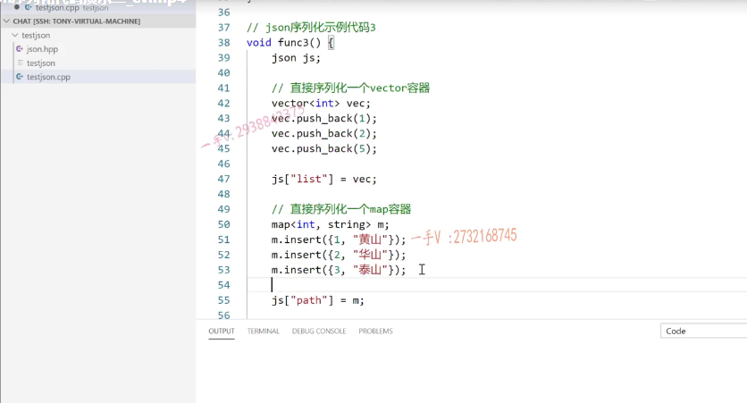
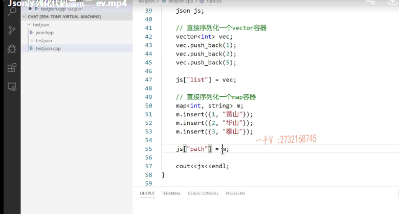
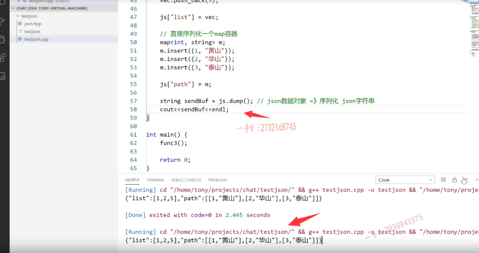

### 序列化示例代码三

这节课我们再给大家来介绍一下这个json的这个序列化，它可以直接序列化容器，

这是它非常强大的一个功能。我们必须得介绍一下啊，json的示例代码。

序列化示例代码三。那么，我们func 3。

在这个课件上呢。我们把这个容器序列化的这个代码给大家拷贝一下。

大家看在这里边儿呢，定义了一个json对象，定了一个vector里边儿，

添加了一个一二五。

vec相当于是不是直接给这个list这个键，添加了一个数组类型啊，一二五啊，

这map添加了三个键值对儿对吧？

然后呢？直接给这个json对象里边儿添加了一个键path，对应了一个值啊，

那这个值相当于就是还是一个，这是一堆数据嘛？一堆数据，

它肯定是放在数组里边儿的，是不是啊？放在数组里边儿的，就这数，

相当于是数组里边儿啊，放了三个元素。

好，我们调用一下func 3。

大家看一看结果。大家看到啊，这里边的这个json呢，里边是list，

这个键对应的是一个数组一二五好吧？

然后呢path这个键对应的，你看诶还是一个大的数组。

数组里边怎么样套数组啊？它把这里边儿呢就转成数组的两个元素了，就是map表里边儿的键值对儿好吧啊，就转成这个样子了。

数组套数组。json字符串里边还可以套json字符串呢，是不是啊？

数组里边套数组很正常的啊，这个相当于数组里边放的整数嘛？

这数组里边儿放的依然是数组类型好的吧啊，同样的，

### 想把这个数据发送出去  dump方法

你想把这个数据发送出去呢，你可以怎么样啊？

还是那句话PS什么方法对dump方法好吧啊，

测试相当于就是把这个json的这个数据对象转成什么呀？

json字符串啊，叫数据的序列化。

从序列化成json字符串。我们就可以把它进行一个什么啦，把它进行一个发送了。

好的吧呃，通过网络。OK，

### 通过序列化可以把容器直接进行序列化

这是呢，就是json呢，通过序列化可以把容器直接进行序列化啊，非常的方便，非常的方便，

那么在写项目代码的过程中，你看如果哪里可以用到它的这个特性的话呢啊，

它就是这么用的，

你可以给这个json对象的这个中括号运算符重复在函数里边的键直接给它赋一个容器对象C++ stl里边的这个容器对象啊，可以直接赋的。