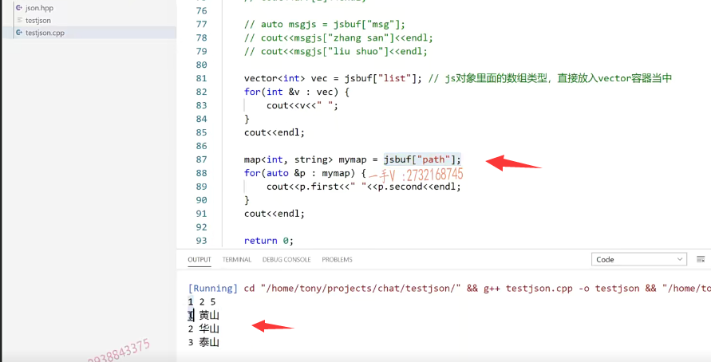

这一节课我们来说一下json的反序列化啊，

我们既然呢，能够把数据结构序列化成json字符串，就这个样子的，对吧？

那然后呢？

通过网络啊，发送到我们服务器以后从客户端发送到服务器以后，或者说是服务器呢，

把这东西呢发给客户端对吧？那在我接收端呢，我就要把这个json字符串反序列化成数据相应的这个数据结构啊？

我要拿出这个键对应的这个值啊来做这个业务对吧？

# 演示一下数据的反序列化

## 示例一

那么我们把前边所给它介绍的这个三个方法呢？

我们都给大家呢，来改变改变，我们演示一下数据的反序列化啊。

假如说呢，这个方法呢，现在都返回这字符串了。

呃，相当于是返回谁了呢？相当于把这个返回了send buffer返回了好吧啊，

那我们来看一下这个啊，这个有message type from to跟message是不是我们改一下啊？

这个是receive buffer啊，接收到咱假如说呢？

这个是做序列化的嘛，咱假如说这就是通过网络发送过来的，

那咱在这里边儿呢，要先进行数据的反序列化啊，

### json下静态方法 parse

反序列化简单，那么在这里边儿buffer就等于什么呀？json的这个作用域下有个parse这个解析。

前给大家介绍dump数据的这个序列化的啊，把数据消息体呢，给它序列化成json字符串对吧，

现在是反序列化，就是从json字符串，把它反序列化成这个数据对象。好吧啊，

就是json的这个数据对象键值对，我们可以把它看作是容器，是不是直接访问啊啊看作容器？啊，方便访问。

### json对象看成map容器

那么在这里边呢，就是直接接收这个字符串网络接收的这个字符串就可以了啊，它返回一个string啊，返回一个什么东西呢？不是返回string啊，

是返回一个json的对象。js buff我们定义成这样的一个名字，

把它看作一个容器。好的吧，

### 打印一下

现在呢？你看啊，我就打印了。js对象就看做容器map表是不是你里边有什么样的键呢？我里边有message tap from to跟message。

啊，给我message type。那我打印一下。三四。有from字段，还有什么字段啊？to字段对吧？还有什么字段呢？还有这个message字段啊？

我们看一下能不能反序列化出来数据呢？可以的吧啊，

## 示例二

### 保留了相应的数据类型

在这里边你看2 message type是二张三李四。

而且呢，还给我们保留了相应的数据的，是不是类型啊啊？

第一个message tab是个整数，后边儿呢三个全部都是这个字符串类型。很好用吧呃好。

那么接着呢，我们来修改一下第二个啊，修改一下第二个fuc 2。

把第二个呢，就不打印了，我们直接给它返回点s点dump。返回值呢？改成什么类型啊？string类型好吧，在这儿。

### 可以直接接收 反序列化出来的数组

这个的话呢，里边放了id 是数组  是不是？

你可以在这儿呢，直接去打印它js  ID。

你也可以呢，比如说呢，你知道它是个数组类型对吧啊，减s8份。

ID然后呢数组吧，你直接用下标就可以了，打印第二号位元素。

啊，我可以直接这样去使用啊。

大家来看，这是个数组类型打印出来的话，是个数组类型一二三四五。

我要访问它第二号元素呢，我接受一下啊，用auto就可以了，

访问第二号零一二是不是就是三啊？

### 反序列化出来  还可以是一个json对象

它还有呢什么？类型呢name那就跟我们第一个一样，

你直接取name对应的字段就是一个字符串是不是message相应的这个字段的对应的值，还是一个是不是json字符串类型啊？

也就是说是反序列化出来以后呢？是个json对象类型啊？

所以在这儿呢，你就可以。你比如说auto-s two。是不是啊？

或者说是message的这个js就等于js buffer。

这个message那然后呢？你知道message js里边呢？

有一键叫做张三。还有一叫什么呀？叫刘硕对吧？

能拿到它message这个键对应的json的这个字符串啊，

里边儿的张三这个键对应的值hello world。

刘硕，这个键对应的指hello China都可以取到。

啊，那这种反序列化获取数据的方式应该也没有问题吧啊。

## 示例三

那像fuc 3呢，就更简单了啊，更简单了。那么，我们要把这个send buffer直接返回回来。

func3。我们再测试一下啊。

那在这里边相当于就是它有一个list，有一个path，对吧？

我们可以直接呢，把它去放在这个vector中啊vec。

然后呢？是js buff啊，然后呢list。

因为我们当时呢，就是把这个vector的元素充到js里边的？

也就是说呢啊，在这呢。你可以把数组就是jS对象里面的数组类型啊，直接放入谁呢？vector容器当中。啊，直接放入这个vector容器当中。

到这个键对应的这个值类型是一个vector容器类型好吧啊啊，是个数组类型，

你就可以把它放到这个vector容器当中。

那么in TV vec在这呢，我输出一下v的值啊。再输出一个回车。

我看看。很简单吧，一二五没问题啊，

这里边儿呢，是不是还有一个map啊？

实际上map也是数组类型，但是这个数组里边儿是不是套了数组类型啊？

那么在这里边呢，我们就可以直接定义一个map啊。

map的键是个整型，值是这个字符串类型啊呃。

my map=js buff，然后呢？是个什么呢？键的这个名字是个path.

那么在这里边我就可以用迭代器把它呢里边的元素呢，我给它输出出来好吧啊cout p的这个first。p的second。再来个回车吧，好吧？

来看一看能不能直接把这个数据反序列化得到放到map里边了，

可不可以的可以？很方便啊。

## 总结

那么我用过呢，很多的这个json的三方库啊，用来做json的数据的序列化和反序列化。

没有见过一个有这么方便，完全可以把json对象呢跟容器画等号啊。

希望呢，通过这几节课的讲解，大家能够呢包含这个阶层点hpp非常的轻量啊，

人家写的这个不需要依赖任何的什么so库啊啊之类的啊，直接包含这个头文件就可以了。

json点hpp非常的轻量，

==你使用的时候做这个数据的序列化和反序列化，==

==不仅仅是对这个内置的简单类型啊，还是呢对容器类型数组类型适配的都特别好。==

代码非常的简洁，希望呢大家呃，看着视频自己也动手去写一写，

那么到时候在项目上去写相关的。呃，json的代码的时候呢，不至于那么陌生了啊。