这节课我们给大家演示一下muduo库呃，在编写服务器程序的时候啊的一个代码示例。

## 讲解vscode上配置文件搜索路径，库文件的搜索路径等

另外呢，就是呃，可能有一些同学呢，第一次是用VS code来进行这个项目开发。

这里边儿因为使用的是第三方库啊，这个muduo库呢，当然不像我们之前给大家讲的这个json那么简单方便了啊，直接包含一个json点hpp头文件就可以了，它呢，有头文件还有相应的，我们需要链接的so库。

所以呢，在VS code上啊，如何去配置啊？我们想链接的这个so库呢，对吧啊？

这个我们不仅会给大家讲解一下代码的编写。

还会给大家说一下，在VS code上啊，如何去配置我们相应的一些，比如说头文件的搜索路径啊，库文件的搜索路径啊。

还有这个需要链接的这个so库。

## muduo库的使用需要链接的库

那么首先呢，你注意啊，这个muduo库的这个使用啊，它需要链接呢这个。就是libmuduo_base，还有libmuduo_net，

当然了，还有这个pthread 点这个so库，这都是点so。

### 一般so库的默认路径

是不是一般so库呢？在默认的这个路径里边儿有两个，

一个是这个usr/lib啊，一个是usr/local/lib

基本上就在这两个系统的这个路径里边放着的啊，放在这个so库放在这两个这个路径里边啊，我们也不需要怎么样，

也不需要是不是去添加相应的这个头文件呢，是个搜索路径啊，

==因为这两个路径呢，是会自动搜索的，因为它们是处在环境变量中的。==

### 在链接的时候需要加库

所以呢，我们在这个代码上，如果用muduo库写了一个服务器程序，

我们链接的时候呢，就得这样写了，-lmuduo_net -lmuduo_base还有- lpthread。这都没有问题吧啊linux上都学过，是不是

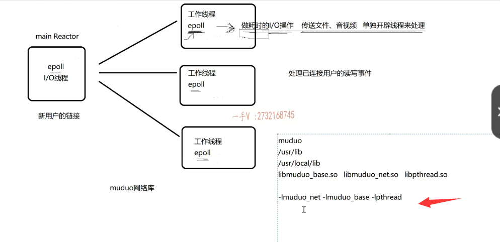

## 如何去配置？

那么我们所说的就是如何去配置这些东西呢？

好，那么我们先来打开这个VS code。

这里边儿是我们之前的项目啊，在这儿呢。

我输入远程登录的密码。OK，这是我们之前呢，我在我的远程linux主机上啊，选择的一个路径啊，这是我们之前test json。给大家写的。那么在这儿。

我们再创建一个test muduo吧。这我们想去测试一下muduo网络库的这个代码好吧？

那么在这我定一个文件啊，就是muduo server.cpp。

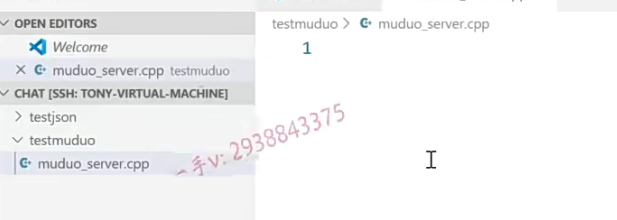

好嗯，大家来看一下啊，

首先呢，我们先来说编程吧啊，先说编程在这儿呢。

muduo网络库给这个用户啊，提供了两个主要的类。

一个是呢TCP server。这个专门用于编写服务器程序的，

一个是TCP client，这个是呢用于编写客户端程序的。

这个呢，在这个线下讲课的过程中呢，我们给大家写的其他项目用到muduo网络库都会使用到这两个类，大家呢，应该都有印象。

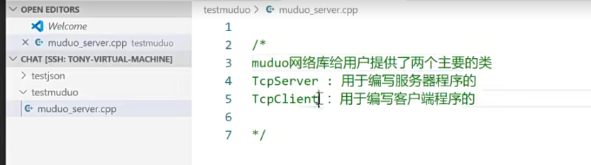

## 网络库无非就是封装 epoll+线程池这一套

好吧啊，实际上不管你用哪个网络库，你就想想，如果让你自己用epoll加这个线程池。你怎么去设计这个网络服务器模型对不对？

实际上，这些网络库呢，无非就是把这个模型呢，给它封装起来了啊，

## 封装成网络库的好处？专心去做业务

它的好处是什么呢？就是能够把这个网络IO的这个代码呀，

和业务代码区分开，也就是让我们用户呢，直接使用你这个网络库啊，

他把这个最主要的这个精力就放在业务代码的开发上了，

至于网络IO这块儿的代码呢，有网络库。直接就帮你封装完了。

好吧，直接帮你封装完了，

对于业务这块儿我们感兴趣的是什么呀啊？

用过这个libevent。或者说是其他的像libevent这些网络库的时候呢？

你会发现，今天我们在讲muduo库，

以后你会发现它们有一个特别相似的，这个点就是业务代码这块儿的暴露，

## 业务代码的暴露2点

暴露的主要就是两个。

==用户的连接和断开。==

==用户的可读写事件给你暴露，这暴露这两个==，

那也就是说呢，==你只需要关注这两件事情怎么做就行了。==

==至于什么时候发生这件事情，由网络库给你上报。==

==如何监听这些事情的发生，也是由网络库内部都给你实现好的啊，==我们不需要关心，这样一来呢，

我们就可以快速的去开发项目，用这个网络库。好的吧啊，

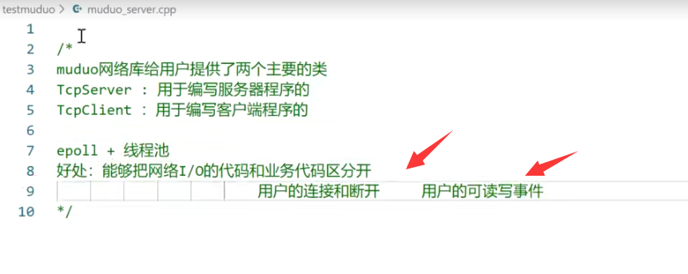

行，那在这里边呢，我们来一一给大家说一下，

首先呢，比较重要的，你把muduo库的环境安装好了以后呢？

你需要包含的TCP server点h，

我们要进行服务器的这个开发嘛，对吧？

还有一个muduo net，有一个event loop点h。

好，那么在这里边呢，我们再包含一下我们的iostream。

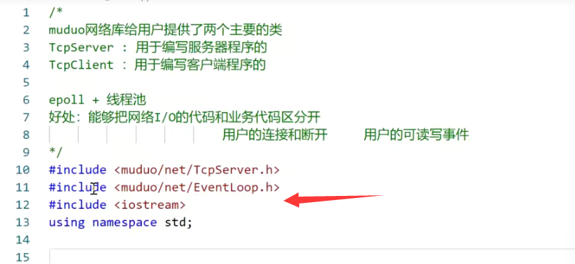

这就是在我们系统库 目录下的muduo，系统会自动搜索的库

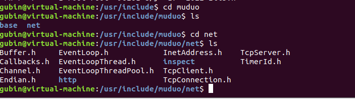

大家来看啊，这是基于muduo网络库。啊，开发服务器程序。

首先呢，这里边我写一个我的chat server吧。

## 步骤

### 定义一个TCPserver对象

chat server在这里边啊。首先第一步啊，你要做什么事情？

首先第一步要做的事情呢，就是组合TCP server对象啊。

第一步，组合TCP server对象。

那怎么说呢？就说在这里边，你看我要定一个TCP server这没有没有，

因为呢，是因为muduo库里边有很多的什么东西呀？

### muduo里的名字空间作用域

有很多的名字空间作用域，你看muduo底下有net才有什么哦，我才看到了TCP server，

是不是你要是嫌麻烦的话呀？你在这里边可以怎么样啊？

using namespace muduo net。

啊，好吧，我把这个muduo呢也拿出来。

它有很多都是在muduo作用下，还有muduo net，

还有muduo base下啊，你如果不想写这么长的话呢？

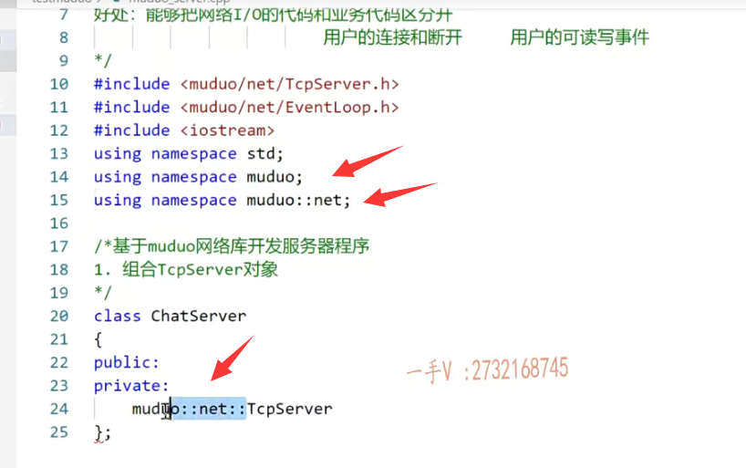

好，我们在这里边直接写这个TCP server就可以了啊，

好这呢，我们要去定义一个server出来。

这是这是第一步，你要做的事情。

### 第二步 创建eventloop事件循环对象的指针

好吧呃，然后呢？在这儿啊，我们一般上呢，都会在这里边儿呢，

再组合一下event look对象。event loop.一般都会做这件事情，

那你也可以不用它，你到时候想关闭整个的服务器程序，就不知道怎么关闭了啊？

在这个创建event look事件循环对象的指针。

#### 看成是epoll

啊，这是第二步，你不可以把它看作你的epoll嘛？好吧啊，把它看作你的epoll事件循环嘛。

是不是我们可以向epoll上注册，我们想感兴趣的事件是不是啊，

如果呢？有相应的事件发生了，epoll也会给我们去上报的啊。

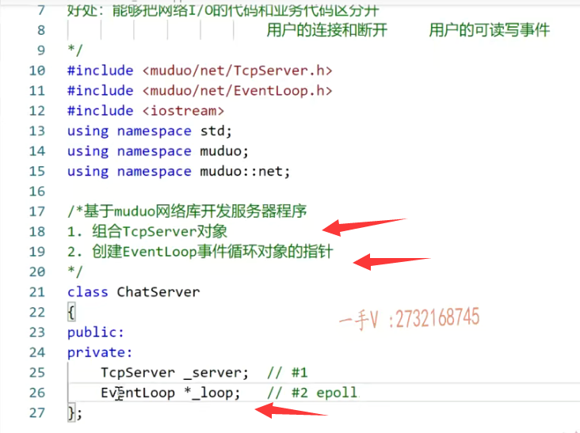

### 第三步 明确TCPServer构造函数需要什么参数，输出chatServer的构造函数

好在这呢，第三步那就是明确TCP server这个构造函数需要什么参数啊？

输出chat server的构造函数。

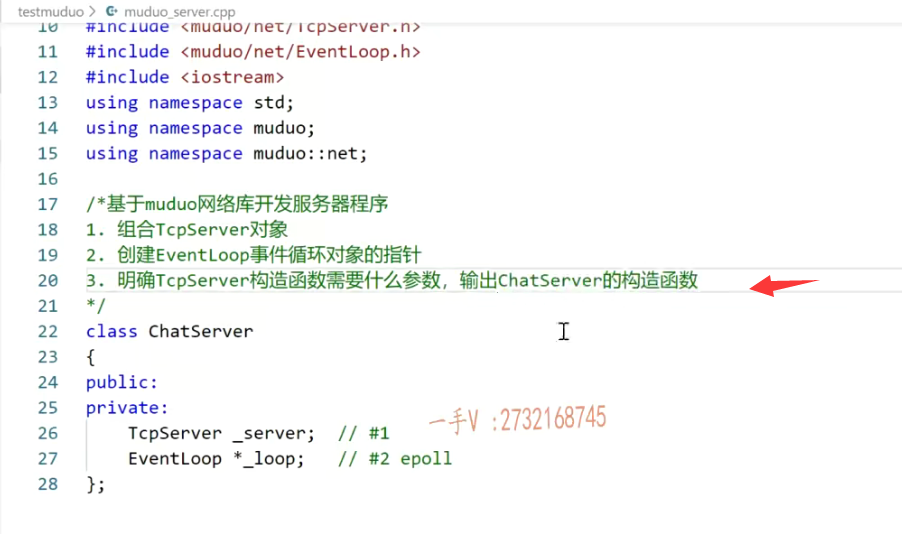

来大家看一下我鼠标点进来tcp server，

大家看到啊，它的构造函数呢？没有默认构造，只有一个构造

几个参数呢？四个参数，最后一个参数呢？

是一个TCP这个协议的一个选项，我们就不关注了啊，

#### 主要是3个参数

它主要有三个参数，

第一个就是event loop，就是事件循环。

第二个呢，就是一个它muduo库封装好的inet address，

也就是说呢，可以去绑定的IP地址跟端口号。

第三个呢，就是你可以给这个TCP server啊，一个名字。

那就需要三个参数。

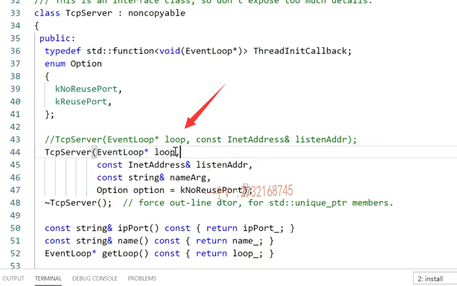

#### 没有默认构造，必须指定

所以呢，第三步呢，我们就是明确，因为你这是对象，人家需要构造的嘛，你如果不指定人家的构造，人家就需要默认构造。

但是我转眼一看，有没有默认构造呢？没有，

==所以呢，你不去指定人家的相应的构造，你这个类根本就无法创建对象嘛，==是不是？

#### 创建server，并且保留eventloop

chatserver.那么在这里边呢，就是这三个参数啊，

我们所做的事情呢就是给谁呀？

loop listenaddr还有name arg。是不是还有谁？

还有呢，把这个参数啊形参成员这个loop就是事件循环呢，让我保存起来，

刚不说第二步就是创建event loop事件循环对象的指针嘛。

是不是要把这个事件循环保存起来呀？

这样我就可以操作epoll了嘛，在我内部。

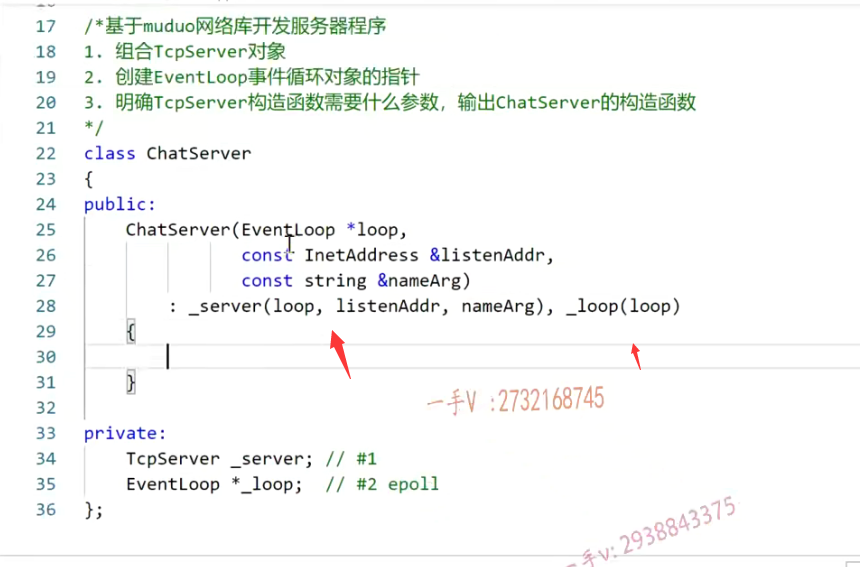

好的吧啊okay，那么在这里边大家来继续看啊。

第一个参数是什么意思啊？事件循环。

也就是可以理解成我们所说的这个reactor反应堆，对吧？

这个是IP地址加它这个端口。好不好？

这是呢，相当于服务器的名字啊，你可以绑定个名称，实际上就是给这线程绑定一个名字啊。

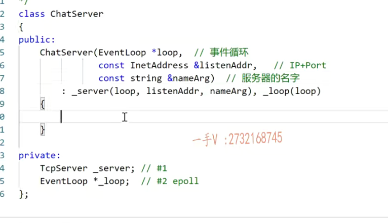

### 不关注网络代码，只关注业务代码

好，那在这里边大家来看我们说了，这是个网络库啊，

网络库网络库最重要的是什么东西啊？

最重要的就是我们使用它，可以把它网络代码跟业务代码是不是区分开呀？我们不关注网络呃，我要关注网络的话，那我就自己是不是写网络代码了，我现在用你，我意思就是说我不想关注网络代码了，你直接可以给我提供一个高性能的网络模块啊，

代码我现在主要关注的是业务代码，那业务这一块我作为一个网络库，

它主要能做哪些业务呢它？它能够给我上报有些用户连接或者已连接用户，有断开事件了，对吧？

还有已建立连接用户的可读事件，或者可写事件，

他是不是可都可以给我上报啊？

#### 构造函数的作用：给服务器注册啊，用户连接的这个创建和断开。

所以在这里边构造函数呢就是给服务器注册用户连接的这个创建和断开回调。

那么，给服务器注册用户读写事件回调。这什么意思呢？

#### 回调操作概念

什么叫回调呢？回调这个呢？

我们在给大家讲课的时候呢，讲了特别多啊，

在我的这个C++加高级课程里边儿呢，也有给大家讲这个回调操作，

它是非常常用的在这个。不管是面向过程的这个c啊，

还是呢，面向对象的C++，

回调永远是我们在进行模块设计，模块解偶的时候一个非常重要的东西啊。

那么，普通函数呢？

那是因为调用的时候就是在这块诶，在某一个地方调用这个函数。

是不是那是因为啊，在这块儿我知道要在这块儿发生这件事了，

我还知道这件事该怎么做，所以呢，这两件事情如果都知道就是在什么地方发生以及发生以后我该怎么做？

那这两件事情是在同一个全部都知道，那我就是直接指名道姓的去调用这个函数就行了，对吧？

### 知道怎么做，但是不知道事情什么时候发生

### 回调告诉我时间

但是呢，有一些东西呢，那这个函数什么时候发生跟发生以后该怎么做？

它没有在一起，为什么这么说呢？

也就是说我现在知道新用户连接或者是已连接用户断开，我该怎么做。

但是这两件事情什么时候发生呢？这我不知道啊，

这得通过网络对端发送相应的一些数据。

是不是给我上报上来，我才知道哦，有用户的这个连接创建或者有用户的连接断开了，对不对？

那谁来帮我监听这件事情呢？是网络库帮我监听的。

那这件事情什么时候发生呢？我也不知道。

那它发生的时候网络库接收到远端啊，对端发送过来，相应的这个业务请求的话呢？

那在这里边，他就会给我上报，我现在只知道发生这件事情的时候该做什么事情，这也就是说发生这个事情发生的时间点。

跟发生以后该做什么事情这两件事啊，没在同一时刻发生对吧啊？

那么，用户有读写事件，这也是得通过网络库给我上报啊，

我现在只能是知道啊，当这个用户发生这个可读写事件的时候，我知道该怎么做，比如说我去解析它的这个json字符串啊，从里边拿这个消息类型啊，再拿其他的字段对不对？

==但是这个读写事件什么时候发生呢？我不知道，==

所以呢，我得给他注册回调啊，当相应的事件发生以后呢，他就会帮我去调用这个回调函数，

我只关注去怎么在这个回调函数里边去开发我的业务就可以了？

### muduo中的回调函数

那么在这里边啊，大家跟我看看TCP server里边有两个比较重要的。

一个是set connection call back，这就是连接的创建跟断开。

一个是set这个message call back，这个就是消息的读写的事件啊，

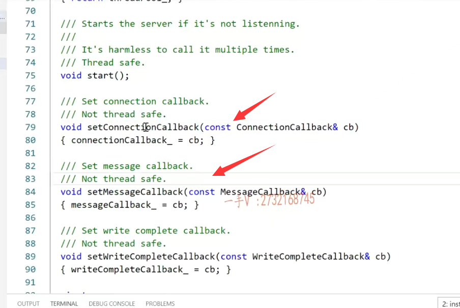

这就读写事件，你看这个connection call back这个回调的类型是什么？就回调类型是？

没有返回值，有一个TCP connection ptr。

TCP connection ptr是个什么东西呢？

从名字上来看，你就能看出来啊，它应该是一个智能指针，里边包含了TCP connection，就是一个一个的连接，对吧？

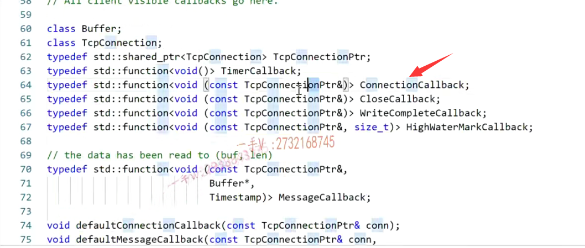

所以我把这个拿出来，各位。

我把这个拿出来以后呢，在这里边啊写一下。这个是on connection.

这就是专门处理什么的啊，

专门处理啊用户的连接，创建和断开。

大家自己在编写epoll的时候呢，从epoll拿过来一个事件以后呢，

而发现呢，它是这个什么东西呀？

如果是这个listen fd的话呢，你是不是会从listen fd上去accept？

啊，相当于拿出来。

相当于这里，这就表示呢，有新用户连接了啊，拿出来一个跟该用户专门通信的，是不是socket呀？啊，那相当于这个。

这一切底层的muduo库全部都封装了啊，现在我们只暴露了一个回调的接口on connection，你只管写就行了，你不要问什么时候会调用，

你都把这个注册到muduo库上了,当有新用户的这个连接的创建，以及原来连接用户的连接的断开，这个方法呢？就会响应的。

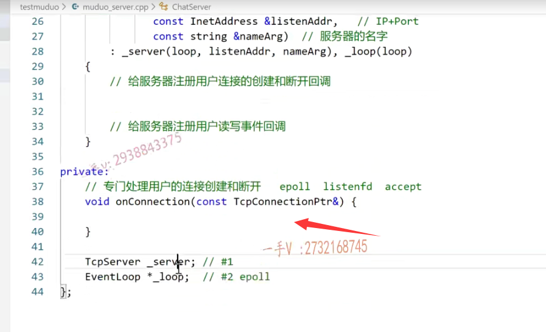

好的吧，在这里边我们做的事情呢，只需要做什么就可以了，

给sever点在的什么connection call back。

好吧，人家这个call back呢，都是一个什么方法呀？

都是一个没有返回值，一个形参变量，你现在写的是一个成员方法，是不是啊？

#### setconnectioncallback都是类似onConnection这样的

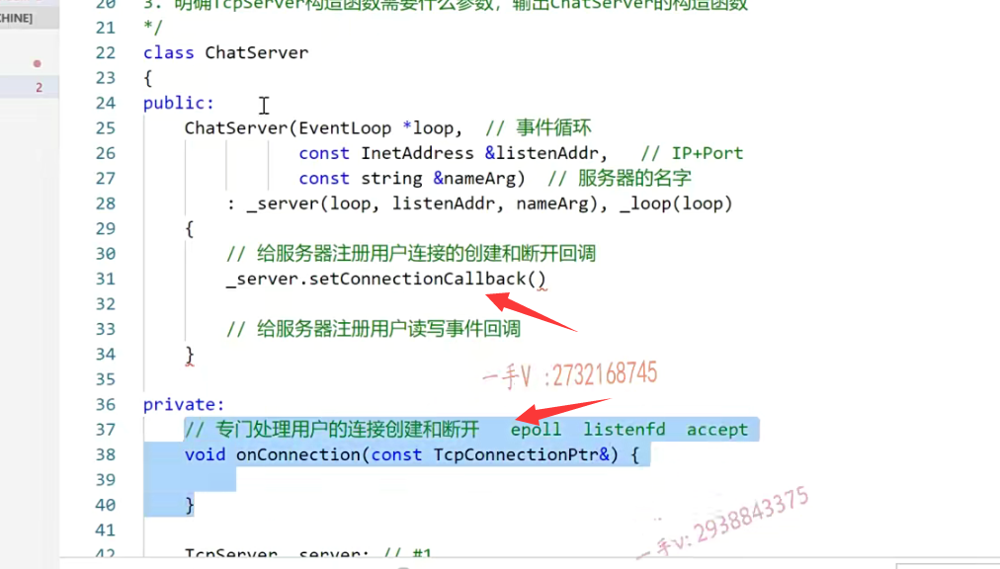

#### 但是成员方法想写成这种回调函数的方法，需要用到绑定器

写成成员方法是因为我想访问对象的成员变量呢？

你写成员方法的话，这会有一个this指针，这岂不是跟人家的call back的这个类型是不是就不同了，

==所以在这里边我们用绑定器给它绑定一下就可以了啊。==

所学中，我们给大家都说了啊，在C++高级课程中呢，也给大家说了绑定器呢，都是在functional这个头文件当中啊。

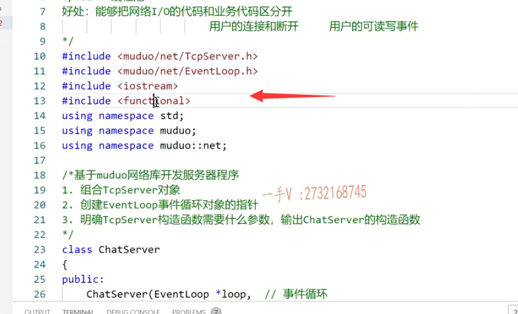

那么在这儿就是用一下这个绑定器啊bind。

绑定谁呢？

地址就是绑定的。这个方法的什么函数on connection绑定谁呢？

绑定this嘛，因为人家的这个call back只需要一个参数，

#### 我们自己写的onConnection函数它是一个成员函数，会有this指针

而你写的这个方法有俩参数呢，还有一个this呢，是不是？

啊，所以这里边叫绑定this对象到这个方法当中，

#### onConnection函数还有一个参数

哎呀，这个成员函数呢，还有一个参数呢，是不是啊？还有一个参数。那在这里边呢？你placeholder。using namespace.placeholders啊。

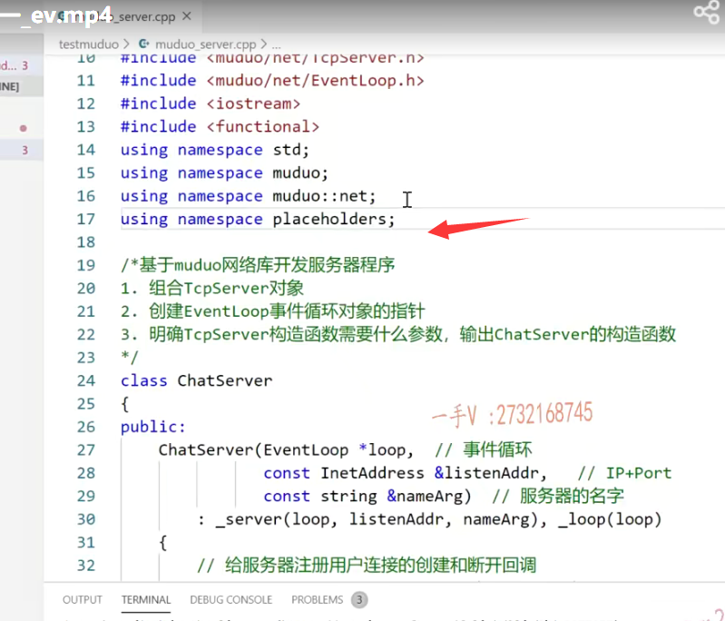

#### bind绑定器最后一个参数，需要指定多少个参数

这里边是参数占位符，因为这个方法有几个参数啊，这个方法呢？有一个参数。

好吧啊，这个方法有一个参数。

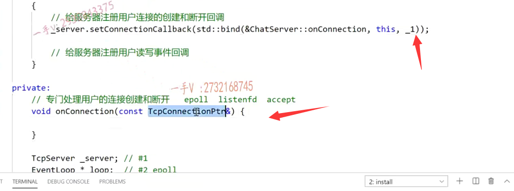

## 总结

这就是我们给底层注册了一个on connection方法。

啊，当底层监听到有用户的连接创建跟断开的时候呢，

它就会帮我们调用这个函数，我们只在这里边儿关注啊。

连接的创建跟断开就可以了，好的吧，那我们这节课先说到这儿，下节课我们再继续来写这个代码。

