那我们接着来说上节课呢，我们给大家呢讲了。

使用muduo库进行服务器编程的时候呢的一个基本的步骤啊，

包含相应的头文件。

### 总结下上节课muduo库使用步骤

这个具体的步骤是什么？

我们需要给这个成员变量啊，定一个TCP server对象。

再定一个事件循环的指针要保存呢？

通过构造函数传进来的这个事件，循环对象是不是？

好在这儿呢，我们绑定了一个处理用户连接创建跟断开的

### 本节课

然后还要绑定一个已连接用户的读写事件的啊。

TCP server，我们再看一看它的这个另外一个call back，就事件回调message call back，而message call back的参数比较多了啊。

#### 其实这个就是定义了一个函数指针MessageCallback

#### 因为我们的setMessageCallback需要这样一个函数定义指针，所以我们就要去定义一个这样的函数

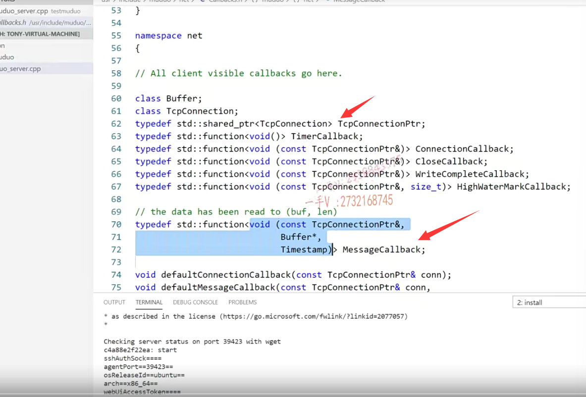

那我们在这呢，再写一个方法。这个呢？

这个名字叫做onmessage。

那这个方法呢是做什么事情的呢？

这是专门处理这个用户的读写事件呢，是不是诶？

同学们看看这个第一个参数connection啊，就是我们的连接嘛，通过这个连接可以读数据，可以写数据是不是？

这个buffer呢？那就是读这个表示啊，我们给大家注释到这儿，表示连接啊，通过这个连接呢，可以发送数据对吧？这个是缓冲区。

==一般写一个网络库啊，都会去写一个缓冲区来提高呢，这个数据收发的性能啊，==缓冲区buffer。

我们接收到用户事件的话呢，可以从这个buffer里边儿去读出来数据。这个呢，还有一个啥东西啊？

time就是接收好数据的时间信息。

人家给的这参数呢，还都挺全的，是不是啊？都挺全的。

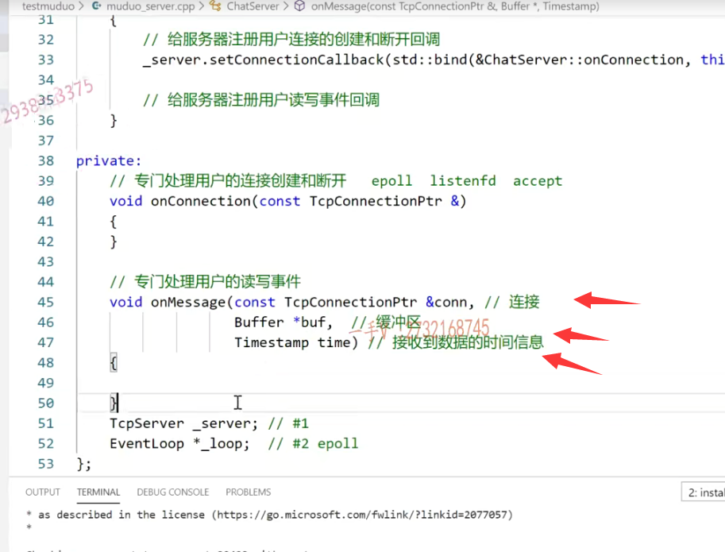

那在这儿呢，就是杠server inside message call back。

你看这里边不仅有message call back，

还有什么callback write complete callback，就是当你这个数据真的是写完的时候呢，还可以设置回调对吧，反正那回调还是比较多的，

就是你告诉我是muduo库，你告诉我你对哪些事件感兴趣，并且你给我注册一个，提前注册一个回调函数，当这些事情发生的时候呢，我会通知你，你去做事情吧，

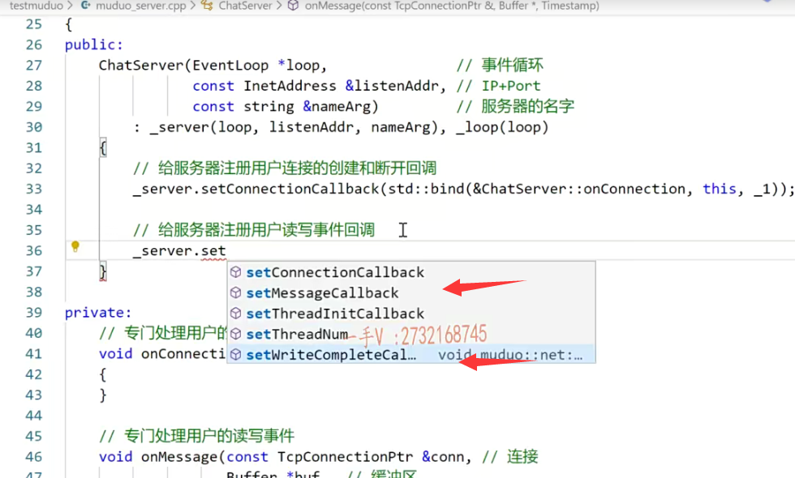

那事情怎么做？是你预先是不是填好的呀？呃，bind谁啊，同样的是chat server，

然后里边的谁on message方法对吧？this

它有几个参数？它有三个参数呢，所以杠一杠二杠三。这叫参数占位符，

好的吧，这个placeholder里边呢，有很多的这个占位符啊，杠一杠二杠三杠四这么多的。

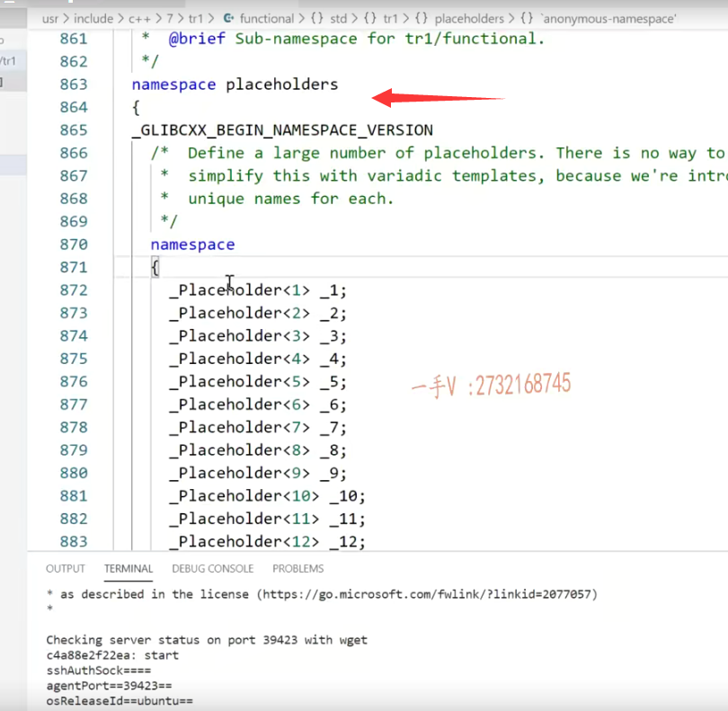

专门给回调函数的参数占位符嗯，

告诉呢，就是我有几个参数，我有我有三个参数，你到时候给我传三个参数。我有一个参数，你到时候调用的时候呢，给我传一个参数好吧？

okay，这完了以后呢？就是这两个对吧？我们补到这里啊，

## 第四步

第四个。在当前服务器类的构造函数当中啊，注册处理连接的回调函数和处理读写处理读写事件的事件的回调函数。

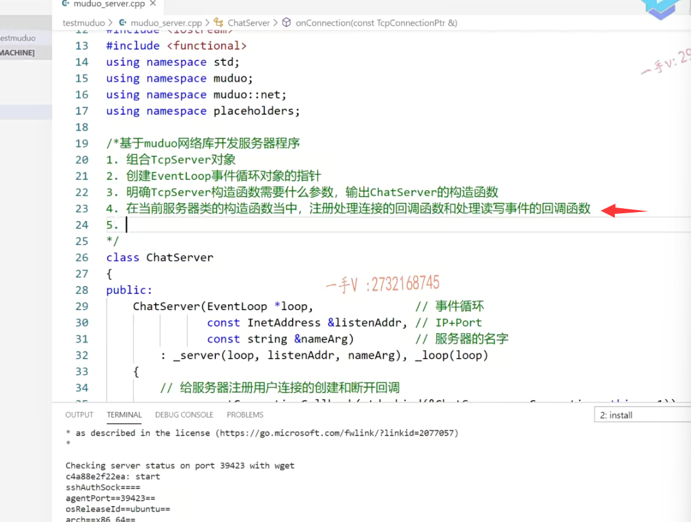

## 第五步

第五步，我们说了嘛。

muduo库呢，本身就是一个epoll加多线程，

那这个线程的这个个数是多少啊？

muduo库呢，人家会自适应，如果你像现在这么写的话，

那也就是说整个就一个线程啊，整个一个线程，那么在这一个线程里边呢？相当于在这一个线程里边儿，有一个epoll，它不仅仅要监听新用户的连接，

还要处理已连接用户的读写事件，这效率是不是就比较低了？

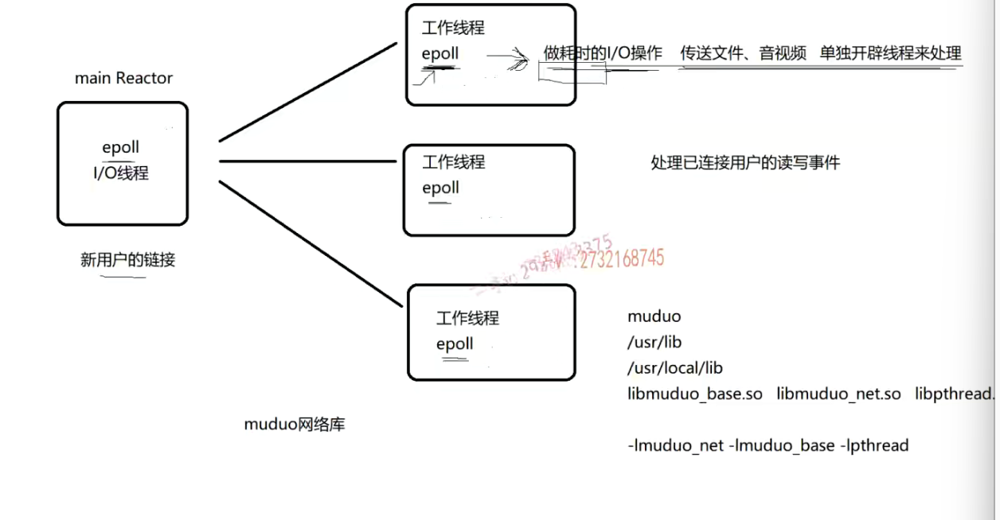

所以呢，在这儿呢，各位呀，我们还要做一件事情就是设置服务器端的线程数量。

杠server点set thread number。

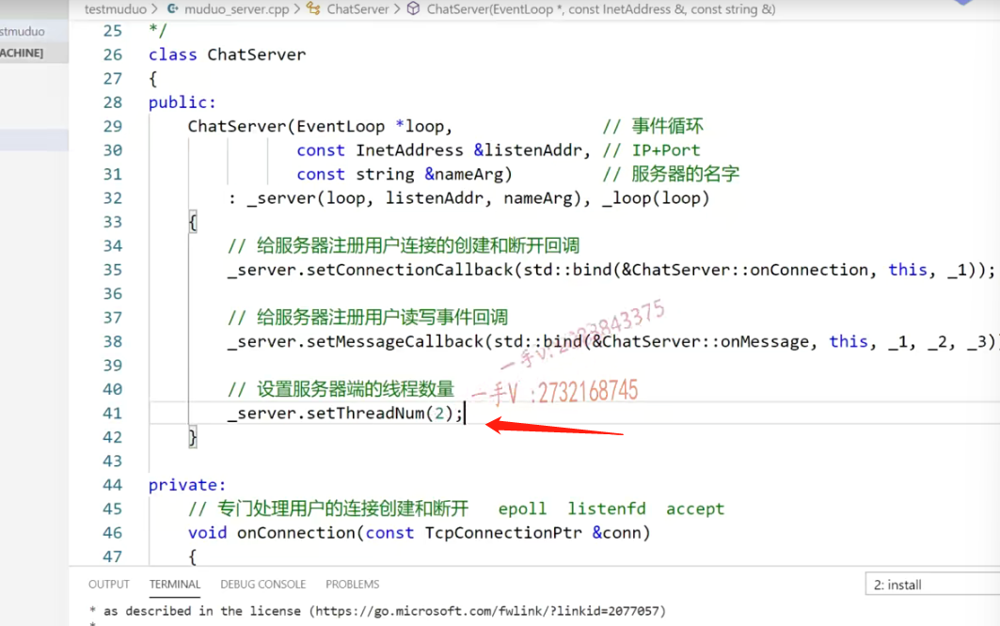

如果你设置二，那也就自动会怎么样啊？

自动会把一个线程专门来做lO线程，监听新用户的连接事件。

以及连接断开新用户的连接事件好吧，新用户的连接事件，

那么在这里边啊，在这里边呢，工作线程呢，就只在只有几个线程了。工作线程就只有一个线程了。

### 连接在一个epoll线程关注，断开是有工作线程来管理

好吧啊，这里边监听新用户的连接没问题吧啊，这里边是这个用户断开的话，就是这用户已经连接上了，==那用户的断开是应该在工作线程，==

这里边是不是去响应的呀？

但是处理连接的这个创建跟断开，人家都会回调我们的on connection

==就是on connection，只是关注连接的这个状态，on message是关注事件读写的这么一个状态啊。==

所以呢，一般上我像我这四核的话呢。

那我就设置四个线程。那这里边相当于就是。一个lO线程三个worker线程。

好吧，我跟我们在画图板上画的这个模型是一样的。

okay的吧嗯。

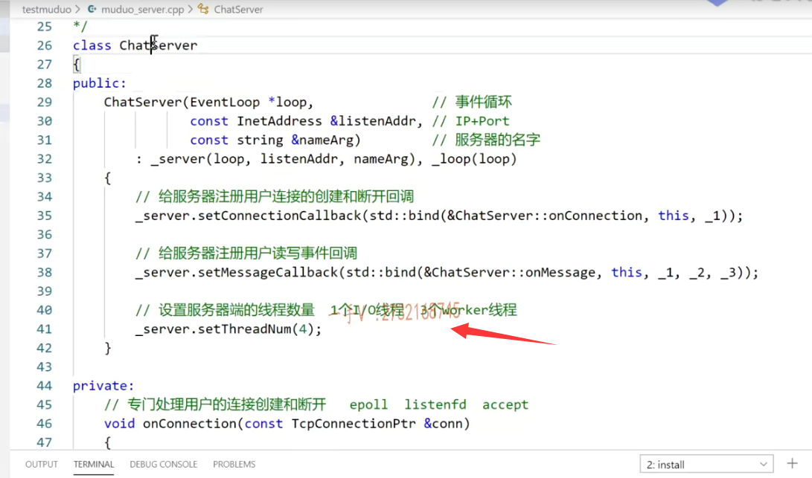

行，那这个服务器的这个编写呢，就完了

这代码是非常的固定的啊，

在这里边你可能需要改的就是什么呀，就是你这个类名称的。

除了你想叫一个其他的这个服务器的类名称，其他的代码根本不用改，

一模一样。这就是使用muduo库的方式的第五步。设置合适的服务端线程数量。

好吧，这个muduo库啊，会自己这个划分IO线程和worker，自己分配

IO线程和worker线程的。

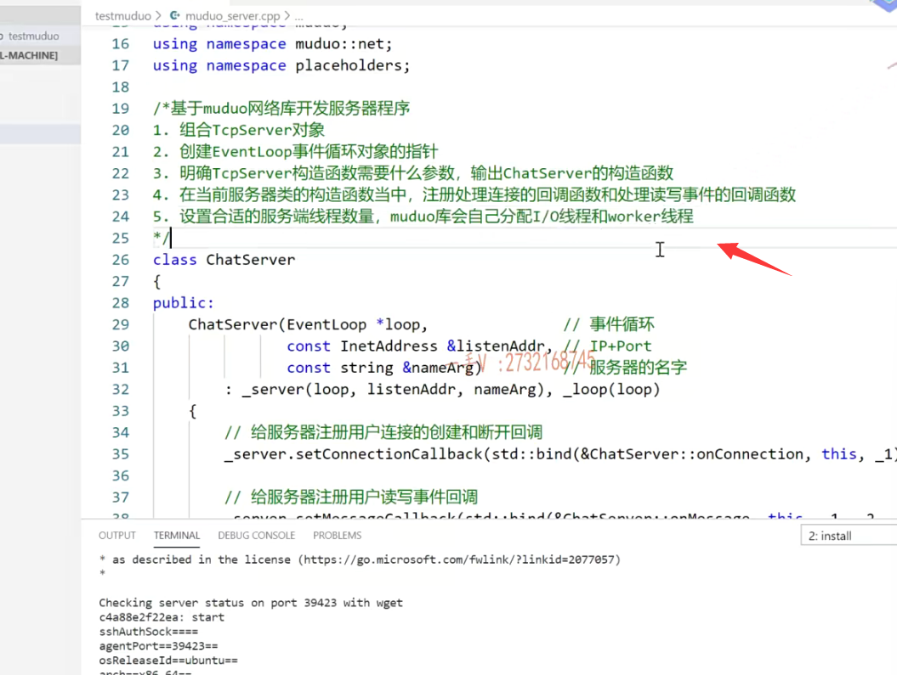

好吧，在这里边大家注意一下啊。这个完了以后呢？

那就是void start。这个就是开启事件循环啊，

这个所谓的开启事件循环呢，就是server点start就可以了。

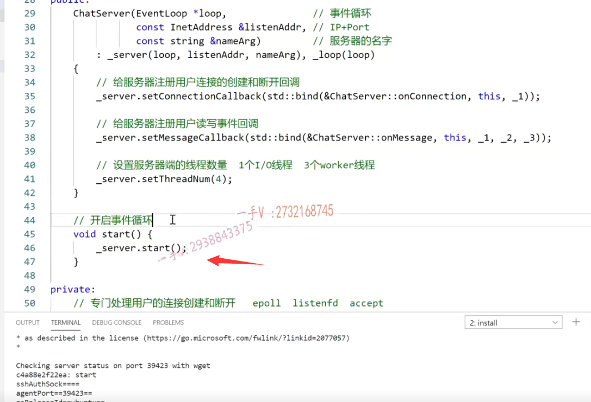

好的吧诶，你看就是这个方法。

那么，在这里边大家可以填一些信息啊。cout 这里边是conn是不是指向？嗯，是peer address。peer就是对端的。是不是对端的呀啊？

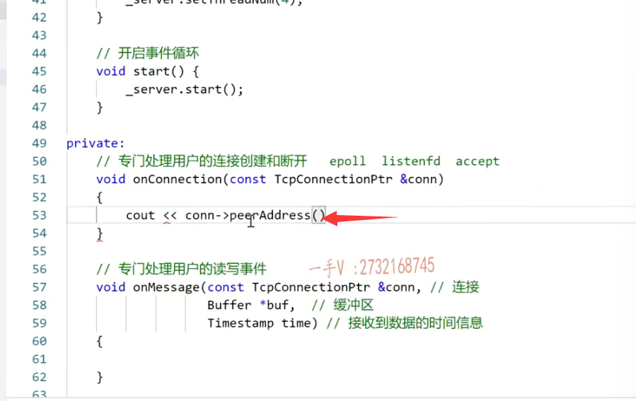

对端的你看它返回一个什么东西，返回inet address。

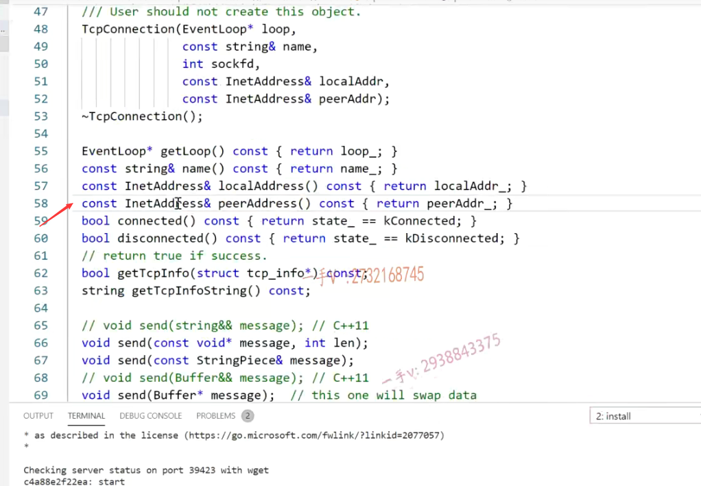

就是调用一下点to IP port打印一下它的信息。

诶，这个是conn.local address.to IP port.

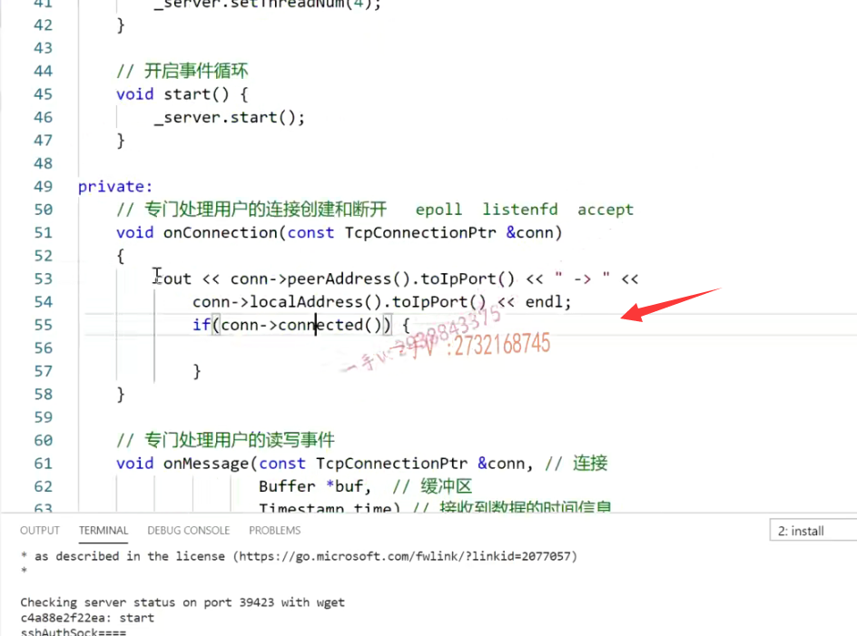

啊，这个呢，还有一个他的方法，有时候这个connected。

connected这个方法呢，返回是一个true啊呃，不是true true和FALSE布尔值true的话就是有连接成功了。

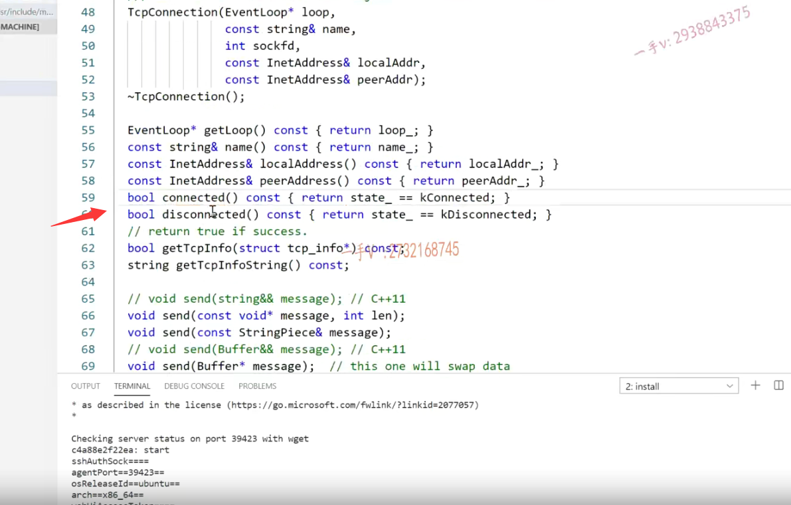

好，大家来看看。

这个我们再写一个状态吧啊。state.是二。上限了，是不是online？

那else就是什么呀？else的话就是offline了。

没问题吧啊else呢，就是offline了。

那它格式化到一行，那就写到一行了，

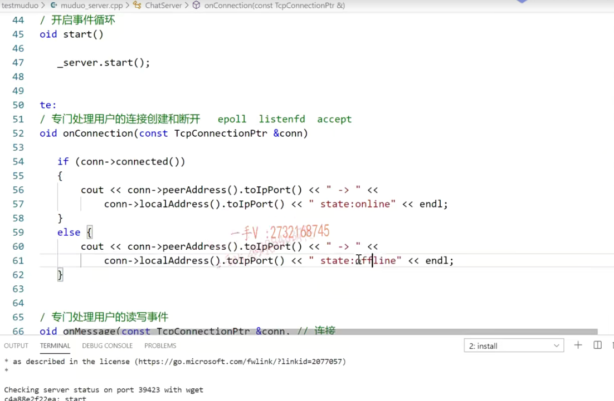

这也都是封装起来的。啊，它的返回值呢？inet address呢？我们之前也见过在构造函数，这里边也见过了，是不是啊？

它封装了IP地址跟端口号，你看它的这些方法呀，

它的toIP就只是打印IP 

to port，只打印pod 

to IP pod就是。

把IP地址跟端口号呢，都返回出来了。

那这是处理读写事件啊，

那我们在这里边写一个echo server吧。

好吧啊，就是客户端发过来什么消息，原封不动的，再给它搬回去啊。

这里边用到了这个字符串，那么注意一下，我包含一下string这个头文件啊。

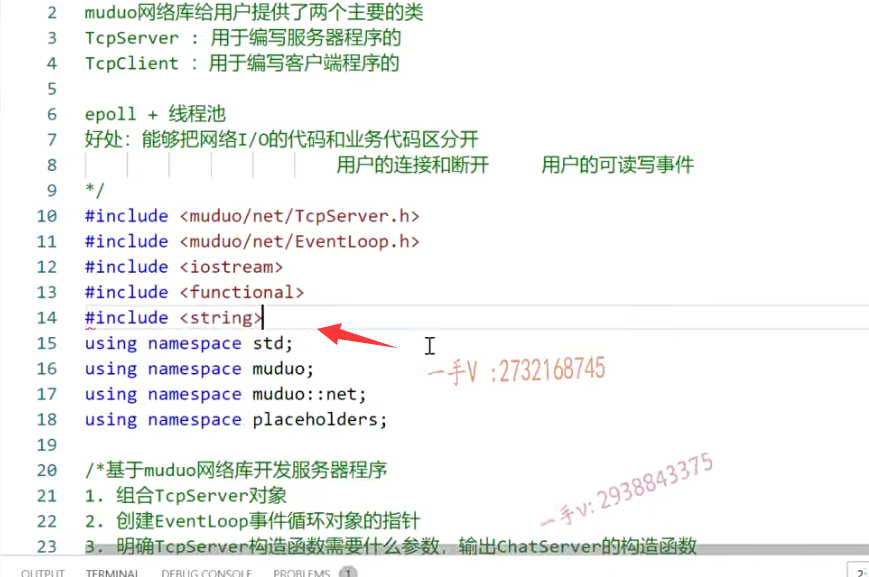

大家看一下。这里边我先。

通过这个buffer指向的什么方法呀？那么，大家注意buffer呢？显然人家是muduo库里边儿封装的一个缓冲区的类，对吧？

它里边儿有一个retrieve alls string，

==可以把它里边儿的这个接收的数据呢，全部放到我的这个字符串当中。==

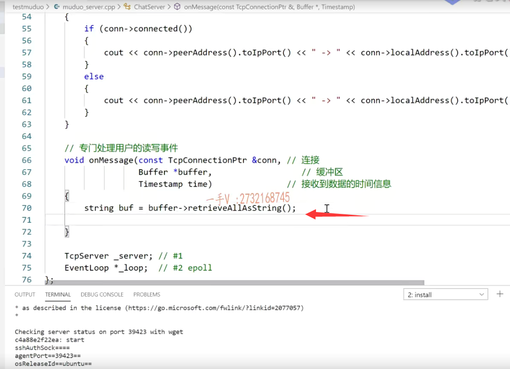

好吧，那么打印。receive  data我打印一下，

是这个buffer吗？是不是啊？

然后呢，再写一个time。

然后这个time。有一个to string。也是它封装的timestamp这个类啊，

时间戳这个类里边有方法可以把time对象所表示的时间信息转成字符串。

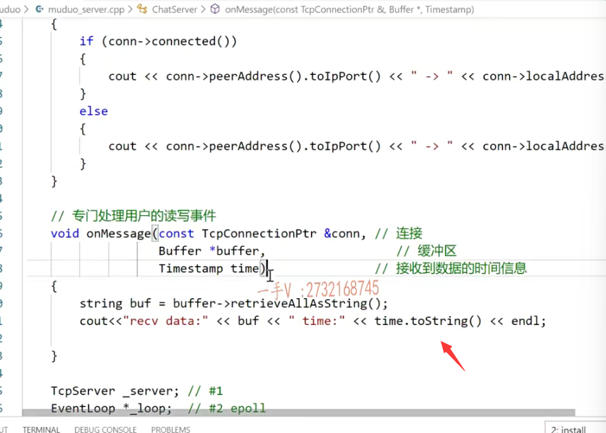

然后呢，我们再通过这个一般接收到用户的信息，然后解析就是解码，

然后处理处理完成以后呢，我们是不是给他返回啊？

返回的话就是connection send呗。送的什么呀？

你给我，我收着啥？我给你发啥

echo嘛，是不是啊？一个回声服务器。

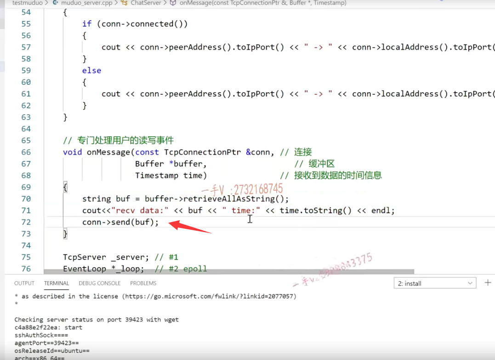

好，基本上来说，编程就是这个样子的。

也就是说呢，我们大家呢，可以完全的把主要的精力放在on connection跟on message这两个方法上。

至于其它的这个网络代码呢，我们就不关注了。好吧，

记住呢，这里边给大家列举的使用muduo库 TCP server开发服务器的这五个步骤啊，

实际上这些代码呢，完全是死的。

你可以完全把它呢保存下来，当用的时候直接考虑粘贴过来就行了，

我们主要的精力在哪两个函数上啊？各位 on connection跟on message.

然后再写一个主函数啊。

## 主函数编写

首先呢，我要创建tcp chat server，这个对象需要三个参数（构造函数）是吧？

## 第一步 eventloop 类似于epoll

先创建event loop。

==创建event loop就特别向大家创建了一个epoll==。

## 第二步 ip port

啊，然后呢？定义一个inet address.

那这就是幺二七点零点零点。

这里边呢，我看看我这啊。WINDOWS上的这个IP是多少？哎，不能看WINDOWS是不是这里边是linux，我们远程在这个Linux系统上开发的。

那就是幺二七点零点零点。点零点一，然后是6000端口啊啊。

## 第三步 chatserver对象构造

然后再是chats ever定义这个sever对象，

各位第一个先传事件循环的地址好吧，

第二个再传addr对象。addr是通过参数，通过参数这个引用来接收的，所以你直接传这个对象就可以了，

第三个还有一个服务器的名称，服务器的名称我就给它一个chat server吧。

好吧okay。这相当于创建起了这个server对象是不是完了以后呢？

## 运行

server点start。没问题吧啊，然后呢？最后呢？

再是这个loop点loop。

这个相当于就是最后做什么事情啊，这个相当于就是最后调用了这个epoll_wait 。

这是以阻塞的方式啊，等待新用户连接。

或者是已连接用户的读写事件等操作呃，

==有这两种事件发生的话，会帮我们回调on connection和on message方法的。==

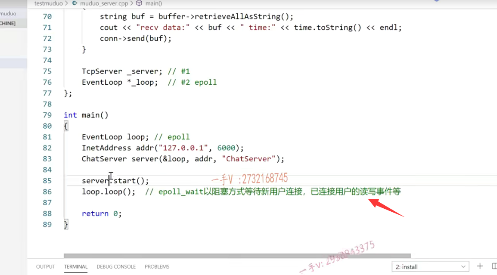

没问题吧啊，这个呢，你可以理解为啊，

什么叫这个start呢？好吧，就是启动了啊，就是启动了我的这个服务。

## 简单理解

启动服务都做哪些事情了吗？

那肯定要把我们的这个listen fd啊。通过这个epoll ctl添加到是不是这个epo上啊？对不对诶？添加到这个epoll上。

好吧，这样epoll以后呢，我们就可以启动epoll_wait来等待新用户的这个连接了，

第一次肯定还没有任何用户连接，

那么第一次启动肯定是先得等新用户的连接。

那整个的过程就是这个样子的。

这是使用的时候的代码。你可能需要改的就是这个类的名称，以及这个IP地址端口号了，其他也都不需要再改动。

没问题吧啊，在这里边呢，你看啊，这是连接断开了，是不是连接断开了以后呢？诶，你还可以在这里边。

这个叫一个什么东西呢？这个叫shut down。意思就跟大家在linux上去写呢，我把这个socket啊，直接给资源释放掉了是吧啊？

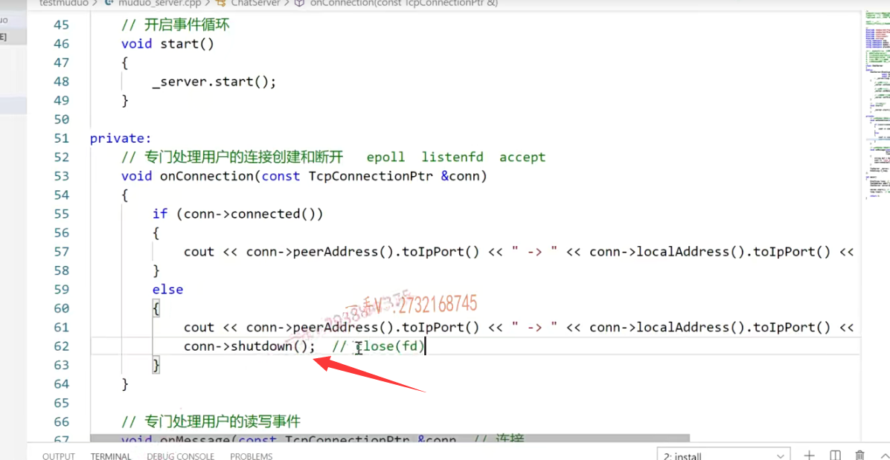

那在这儿我们就写connection shutdown，

当然了呃，你如果不想再给用户提供服务了，

你可以用你保存的这个epoll（eventloop）啊就这个事件循环调用它的什么方法呢？

调用它的这个quit相当于就是退出epoll了啊，整个服务器就结束了好了吧，当然在这里边我们不写这一句了，但是这句我给大家留上，

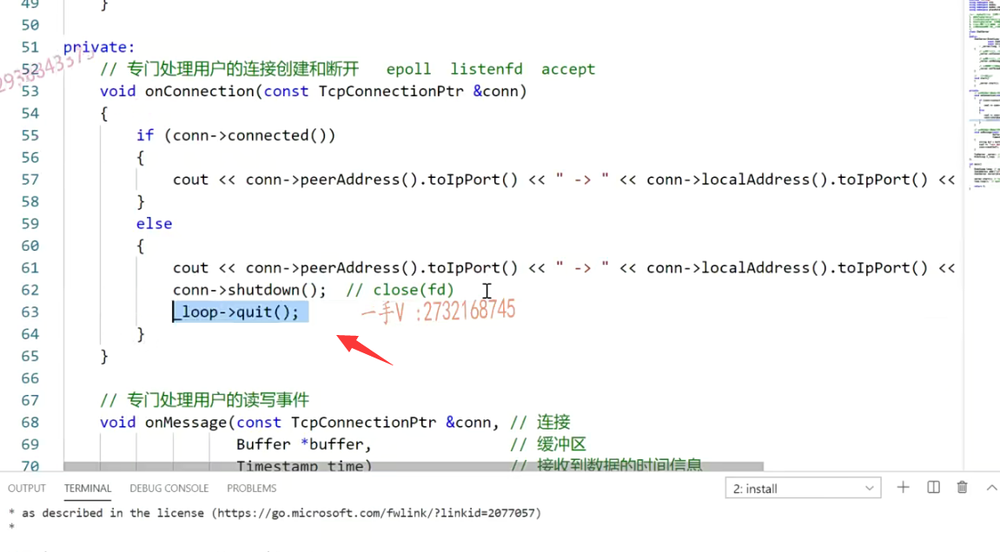

## 结尾

大家知道这句话。这表示呢，连接断开了，连接断开，

我把服务端的这块的fd的资源，我是不是就回收掉了？

好，那这个代码呢？就写完了。希望大家仔细看一看啊，那代码的这个使用讲解，我们就先说到这里。

