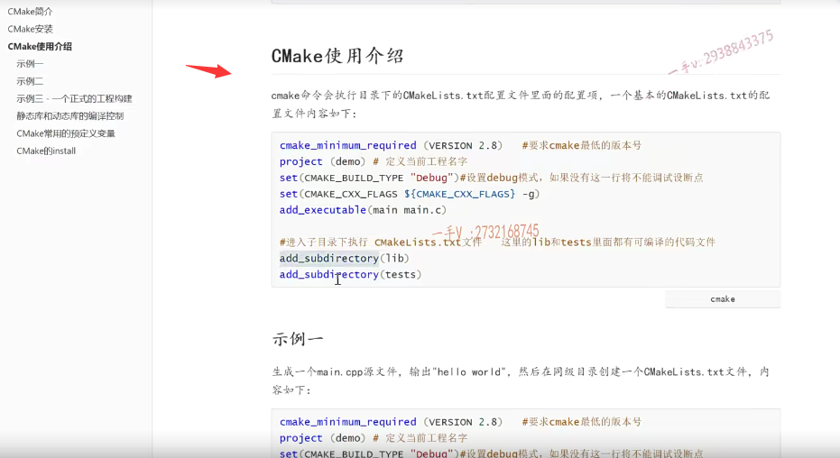
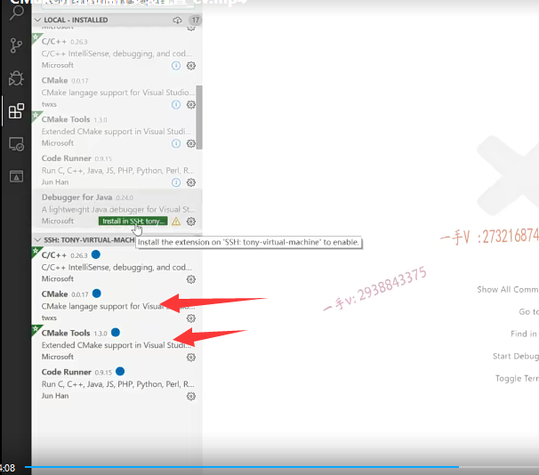
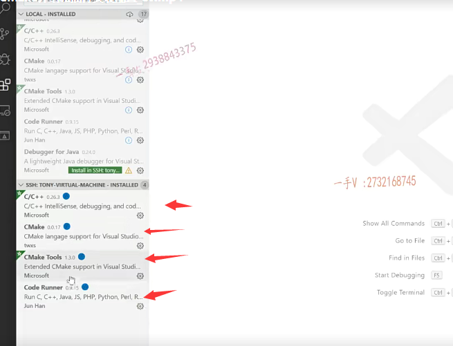
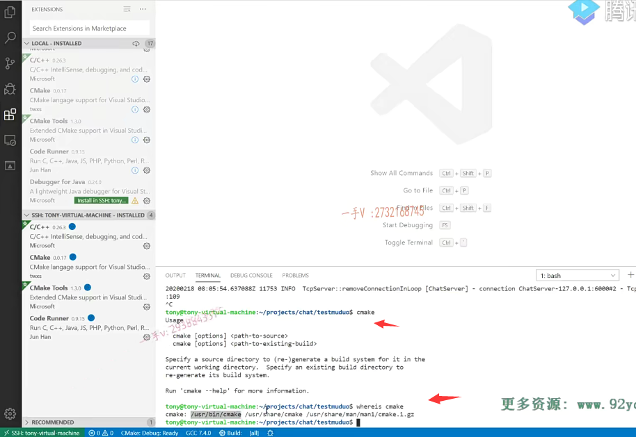
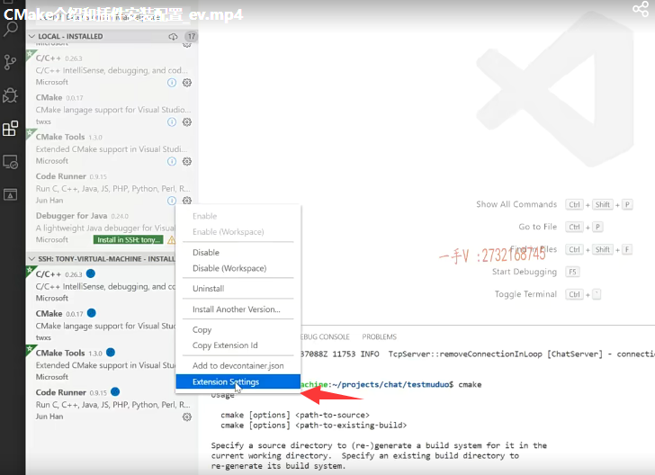
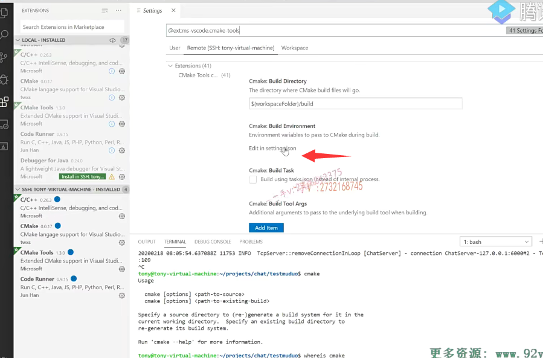
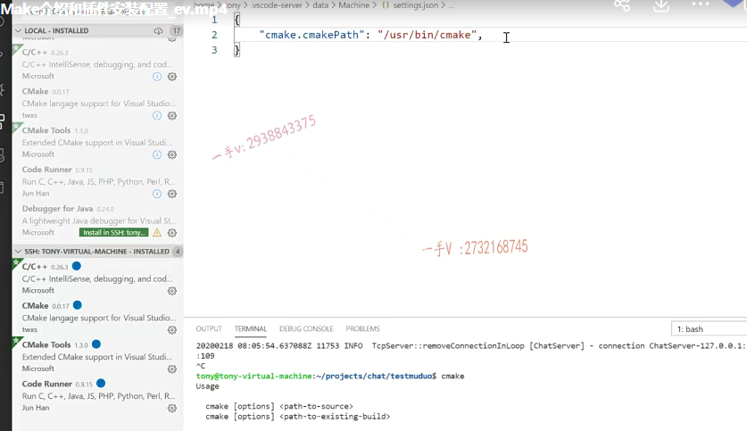
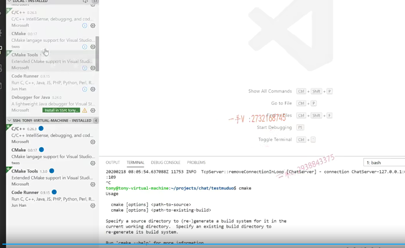

# cmake

我们的整个项目啊，最后呢，是用cmake来构建一个集成编译环境的啊，

因为我们的项目呢，是多文件的一个工程呃。

如果让大家去写一个makefile的话呢，可能呢，很少有人能够把完整的makefile写出来，对吧？

那么cmake就能够使我们通过简单的一些配置啊，生成强大的这个makefile，

然后构建呢一个比较复杂的系统的这个集成编译环境。

那么，如果你安装了这个muduo库啊，那muduo库本身呢，也是用这个cmake来构建编译的啊。

所以呢，你肯定把cmake在linux上呢，都已经安装过了。

呃，如果你不确定的话呢，你在linux的shell命令行上，你直接就输个cmake啊，输个cmake -version，你看看cmake，到底有没有安装muduo库。

如果安装成功cmake是一定安装了。

我们用cmake的这个好处就是可以一个命令，就可以把整个系统的这个我们想编译的可执行文件啊，或者说是我们想把它编译成静态库啊，或者是动态库，

我们就直接编译出来了啊，它里边儿相应的一些依赖文件啊，

我们只要进行相应的一个cmake的一些配置。非常的简单啊，

大家静下心来去看一下，非常的简单，

当然我们现在给大家讲的是一个项目对吧？

嗯，所以这些东西呢？呃，我给大家呢，也这个组织了一些资料，

我觉得通过看这些资料，大家完全是可以接受它的啊。

这些资料呢，到时候大家都可以在视频你所看的这个课堂视频页面的这个下方呢，找到这个下载的地方啊，大家可以下载一下。

包括项目的源码什么的，这个资料呢都有。

## make环境的一个安装

呃，在这儿呢，我们先说一下啊，本节呢，先说一下这个整个make环境的一个安装啊。

那Linux系统上安装了cmake，那就不说了，

你可以通过这样的命令去检查一下好吧？

那么来说一下VS啊，在这个VS code上啊，你如果要使用cmake构建。

当然了，还是我说那句话，你在VS上也可以不用做任何的配置，你只要去写相应的这个呃cmake的这个配置文件啊。

然后写完了以后呢，你自己在命令行上。你自己在命令行上去执行cmake命令就可以了，对吧啊。

==但是呢，在我们的VS code上安装以后，安装相应的这个cmake插件以后啊，我们在写cmake的这个配置文件的时候。就会有代码提示嘛，对吧？==

像这些蓝色的就都有提示，要不然大家记这么多东西啊，它记不住啊，人的这个脑容量也都是有限的，是不是记这么多东西？

我们有一个代码帮助啊，它就是常用的，就是这么几个配置啊，代码帮助，

到时候我会给大家去详细去解释这些配置对应于我们平常写的这个gcc C++命令。都对应于我们命令上的哪一部分，

它实际上就是把我们复杂的那么长的这个命令啊，

去解析成相应的一些配置了好吧啊。

## 安装了cmake跟cmake tools

那么，在VS code上啊，

你首先需要呢，在这个插件这里边儿啊，你搜这cmake。cmake，一个是cmake，一个是cmake tools就搜这两个啊，搜完了以后呢？

这local首先你是装在你的本地的，

如果你本地是。你直接在linux上用的VS code，那你在本地装这个就行了，

如果你是在WINDOWS上的话，你这只是本地本地安装了以后呢？

如果你连呃，这如果你连接的是远程的Linux系统的话呢？

这块会哎，在这块的这个会有显示一个绿色的，那就像这个这个我没装install in ssh就是呢

debug for JAVA我VS code上还可以写JAVA代码，

如果你想在远程的主机上安装这个插件好吧，那就像有这样的一个绿色的in stall in ssh就是在你的远程主机安装相应的这个插件。

你点击以后呢啊，就是cmake跟c make tools，点击以后安装成功了，

这块儿有一个会有一个蓝色的required reload，就是需要你重新加载，

你把VS关了，重新开一下好吧？

那么，在这里边儿ssh就是这是你远程主机上所安装的插件，

你看我这里边儿主要就安装了四个CC+code runner啊。

那实际上我在这里边儿，我们项目用不到code runner，

我们项目最终用cmake来构建的话，用cmake就可以了，

你看在远程主机上还安装了cmake跟cmake tools这样的这个插件。

安装这两个，大家可以看一下啊，安装完了以后呢，

### cmake这个命令的整个路径

大家来看啊，大家在这里边看一下。

打开这个命令行，或者你用叉shell打开也行啊，或者说是你在这view吗？terminal嘛，

是不是选择这个bash啊？

你看一下这个cmake哎，我有呢。

where is cmake？噢，原来在user杠bin杠cmake，

这是不是这个命令的整个路径啊？你可以把这个拷贝一下，不拷贝也行，

这路径这么简单user bin，

### cmake tools extension settings

然后呢？来各位啊，你在这里边儿你看。

这个安装的这个远程的这个cmake tools这个插件底下呢，右下角是不是有一个齿轮儿啊？

齿轮儿最后一项extension settings。

settings打开这么一个东西，你看在remote ssh就是在远程的这个主机配置啊，

远程主机就是Linux系统的这个cmake tools的这个插件的配置。

你选择这个，因为这个本身就是远程主机的插件，

你选择这个，这个页tab项啊，就自动的切到这个页面上来了。

好的吧，

这第二个你这edit in settings点json build environment就是它的编译环境啊，

你点一下点一下。这里边呢，你写一下啊，

你写在这里边呢，它都有联联想的啊，

你看cmake你可以选就行了，这里边呢就是cmake path.

就是我们cmake这个命令的路径，

那你把这个杠user杠bin杠cmake这个路径写到这儿。就okay了就可以了。

## 总结

好的吧，然后我们在这个创建的远程的linux项目上啊，

去创建一个cmake构建的这个项目。

然后在写cmake配置文件的时候，它有完整的这个代码提示写起来非常的简单方便好吧？

好再梳理一下我们这节课主要给大家说一下啊，用这个cmake来构建工程，

首先呢，你linux远程主机上装cmake了吗？

你如果。muduo库装成功了！cmake肯定也装了，对吧？

其次呢，安装一下插件，在这个插件市场上呢？在这里边搜一下这个cmake啊？cmake tooth。好的吧啊

cmake cmake tools那么这有一个绿色的，就像这样啊install 这都已经给你提示了，

在远程主机上是不是再安装一下这个插件啊？

安装完以后呢？重启VS code，

重启好了以后呢？在这个插件市场上，我就就可以看到我在远程主机上已经安装了cmake跟cmake  tools成功了。

然后在这呢。我打开它的extension settings，打开它的这个build啊，编译的这个环境就是这个配置文件，

这里边配置好cmake点cmake path。

直接写上cmake的这个命令路径就可以了。

好吧，那接下来呢，我们就可以呢，直接构建cmake编译环境了，

这个呢，我就放在下节课给大家说，我们把之前写的这个test muduo啊

muduo server这个代码呢，给大家用这个cmake来构建一个编译环境。