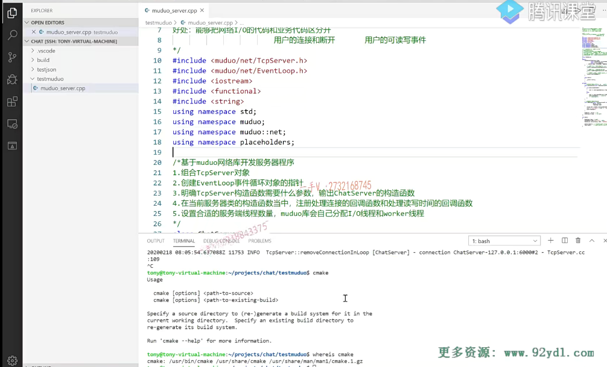
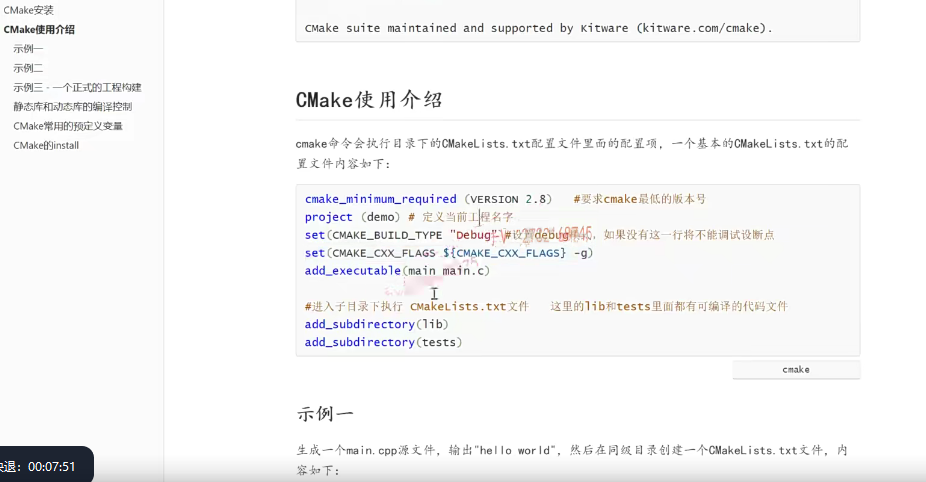

这节课呢，我们给大家讲一下，用cmake来构建一下我们之前写的这个muduo杠server这个小的啊，单文件项目的一个cmake编译环境。

## 回想一下 编译命令

大家先来看一看啊，回想一下，我们再用一个命令进行书写的时候呢？都会做哪些事情啊？

### 指定了可执行文件的文件名称

杠o。杠o server这个是什么意思呀？

指定了可执行文件的，是不是文件名称啊？

### 编译的源文件

然后muduo server点cpp可能还有其他的，是不是点cpp啊？

这些就是我要编译的源文件。

### user include当然这个路径我是不需要写  默认的

对吧，还可能由于杠I这里边写什么呀，

你就比如说呢，我写user include当然这个路径我是不需要写的，因为这是在默认就在系统的环境变量里边，

它会自动去搜索

### l user lib 要链接的外部的库静态库或者动态库  当然这个也不需要写

是不是那还会写杠l user lib，当然这个也不需要写，我在这里边写出来是为给大家表示一下这是要链接的外部的库静态库或者动态库，

### 不在默认路径

那你要搜索库呢库，如果不在默认路径里边，

你是不是要列举一下库的搜索路径啊？

那完了以后呢？就是什么东西呀？你要链接的，是不是静态库或者是动态库啊？

### 编译链接完成以后呢，还可以进行调试

没问题吧啊，你这样编辑出来相当于是个release版本的，你没法调试，你要调试的话是不还得加个杠g啊？这就是说呢，我可执行文件，最后呢，编译出来了，以后呢，编译链接完成以后呢，还可以进行调试。

没问题吧，这编译出来的是可执行文件啊。是可执行文件，

### 实际上还可以编译成为星点儿a静态库或者是星点儿so是不是动态库

那我们实际上还可以编译呢？星点儿a静态库或者是星点儿so是不是动态库啊？

都有相应的这个命令。

==也就是说呢，最终在这个可执行文件啊，它有三种方式。==

是不是还有一些编译参数？这杠g还有大写的杠o，优化级别是吧？

### 写一个编译命令的话呢，主要涉及的就是这几点

比如我们所需要的原文件，你看这是

第一个。

这是第二个编译的这个选项，

这是第三个就是所需要依赖的原文件，对吧？

这是第四个。就是头文件的搜索路径，

这是第五个库文件的搜索路径，

这是第六个，你所要链接的库，

也就是说呢，我们去写一个编译命令的话呢，主要涉及的是不是就是这几点啊？

好，那么在这儿呢，同学们来看我在这个test muduo里边，

我右键我创建了一个file，大家注意啊cmake命令就是从项目的根目录里边开始找找谁呀？

找这个c make lists点TXT文件。

找这个文件了好吧啊

cmake现在呢？我们很多的，基本上大部分的这个开源的这个cc++项目都是用这个cmake来构建的啊。

那么注意一下。这个cmake系统的根目录就要有一个cmake lists。

### cmake的最小的这个版本 可执行文件的名字

这个表示什么？这个就表示我要求的系统的cmake的最小的这个版本，

比如说是你必须得大于等于三点儿零版本。啊project你比如说我们这就是me好吧，

给这个工程一个名字啊，这个呢不是可执行文件的名字，相当于这工程的名字，我们就叫做这个main吧啊，这是我的main程序。

最终还是运行的程序啊。

### 配置编译选项

那么在这呢，大家来看啊。

这个都有哪些东西呢？就是配置编译选项。

就我这里边说的第二个。

我换成蓝色的，==我把这圈起来编译选项有杠o啊。这个杠g呀，是不是这些东西啊？这些东西怎么设置呢？==

#### 在这个变量的这个基础之上，再加一个杠g的选项

来大家来看，在这里边。就是这个cmake。c叉叉flex像这些东西呢，

都是属于cmake，可以默认就是识别的好吧啊。这是什么意思呢？

就是呢，给这个变量设置一下，就在这个变量原来的值的基础之上呢啊。这个linux的这个shell脚本访问变量是不是也是这么访问的啊？

在这个变量的这个基础之上，再加一个杠g的选项。

好吧，再加一个杠o2的选项。没问题吧啊，就是这个意思，

加上这个呢，我们最终编译出来的这个可执行文件就可以调试了，

如果没有这个也可以，那就是可执行文件是不能够进行调试的。

能够理解吧嗯。好，那在这呢，我们先给大家简单介绍一下啊，

### 配置头文件搜索路径

那在这里边就是配置头文件搜索路径。就是它的include。directories，

你这里边可以填头文件的搜索路径。

这个对应的就是谁呀？对应的就是这个四

没问题吧啊，

### 配置库文件搜索路径

还有可以配置库文件搜索路径。啊，应该是这个link directories。

这就是配置库文件的搜索路径，我们现在用不着，用不着的东西呢，

我们先给大家在这儿说一下，有这么一印象，我们后边儿再用到的话呢。

哎，我们再去配置它好吧，无非就是配置呢，自动搜索的路径嘛啊。

你看呢，在这里边，我们是不是相当于这几个就把二 四 跟谁处理了二四五是不是处理了？

现在就剩谁了？现在就剩一三六了，对吧？

### 生成可执行文件  server

我们最终想生成一个什么文件呢？

executable啥意思嘛？执行嘛，这就是生成可执行文件了。好的吧。

add这个library是啥意思？这个就是生成library嘛，库文件嘛，好吧，

这个生成什么东西呢？这个我就生成一个server吧。

### 通过哪些文件生成这个server     定义src list源文件链表

好吧啊，你通过谁来生成这个server呢？通过哪些文件呢？

就是通过这个muduo杠server点cpp嘛，

我就是通过我这个工程目录里边的这个muduo杠server点cbp。

没问题吧啊，在这里边你还可以设置啊。

设置需要编译的原文件列表，你可以用set。said就是src list，

然后这是muduo。杠server点cpp。

然后呢？你可以在这呢？使用这个变量嘛。

这个变量呢，里边放的就是。在这里边定义的就是这些东西。没问题吧啊，在这呢，

我在这个文档上呢，也有给大家去介绍这些内容啊。

介绍这些内容。

你看就像啊，那如果呢？有的人说啊，哎呀，这个工程里边有100个cpp文件呢，我难道要把这100个cpp文件都在这儿，名字都一一列出来吗？不用不用啊，

你可以用aux，你直接在这儿写，

因为你用插件了，这直接可以联想出来啊，

这表示什么意思呢？这表示呢把 点 指定路径。

你这个路径就是当前工程里边的啊，把点 指定路径下的所有原文件名字放入变量名谁里边啊？src list里面。

那这样的话，你也可以这样使用了。

### 需要链接哪些库

这个能否了解呢？你

光通过这个cpp文件，各位，你可是生成不了这个server程序的，

因为这个server程序呢，现在你看我们解决了几了？

我们现在解决了可执行文件的，这个文件名这个一解决了吧啊，都有哪些原文件来编译参与编译呢？三是不是也解决了？

现在在解决谁六我需要链接是不是哪些库啊？

对，就是target link libraries。target就是我可执行文件需要链接的，是不是库啊？

哪个target需要链接库？

我server这个target需要链接库需要链接什么库muduo net？muduo base p thread，大家不用在这加杠l啊，人家会自动加杠l的，

这里边就表示呢，这个表示什么呢？这表示server这个目标程序啊，需要链接这三个库文件。能了解吧，

这个表示什么呢？表示生成可执行文件。server 由src list 变量所定义的原文件。编译而来。

当然，光编译原文件不行，链接的时候是不是还要链接这些库啊？

所以这个合到一块儿。那我们说到这儿呢，这就是常见的啊，常见的。

你看说到这呢，大家是否能够明白呢？

呃，用我们大型的这个工程里边分了好多的文件夹，

是不是好多的文件夹啊？文件夹里边又有好多的这个文件。

可能呢，一个工程里边儿会生成很多很多的模块儿，

有的是生成可执行文件，有的生成so库静态库乱七八糟的，对吧？

如果你用命令来写这个，实在是太复杂了。

我们都是用cmake会构成一个集成编译环境的啊，非常的简单方便，

大家一定要知道这个对于cmake的掌握跟你的掌握get一样，这都是你一些必备的一些技能。

好吧，这些技能如果你拿去实习，去公司实习的时候呢，再去接触这些东西的话。那可能就要拖你的后腿了啊。

好了，那这个写到这里啊？呃，这个示例上呢？这个示例文档上还给大家介绍了很多其他的内容，大家可以再去看一看吧，好吧啊，

你看这个set变量名，你可以把这个所有的文件都列举一下，然后还把这个路径是不是你可以给出来呀？

点儿杠就比如当前路径下诶，你也可以加上当前路径下的这个muduo server点。cpp.好的吧啊。

大家看看这个。如果想进一步研究的话，可以把我这个文档上给大家列举的这些事例呢，你都可以走一遍啊，

如果想获取更多的话呢？那大家可以自行去网上进行一些搜索OK？

然后呢？在这儿我们现在呢？先来一点简单的啊，

我们在这个上边。

所以我们先在这个命令行上进行一个构建，

你看这里边是不是有c make lists点TXT啊？

这个makefile文件需要找，就是跟makefile文件需要找makefile文件一样，makefile的这个名字呢，也是有固定的大小写的好吧？

这个就直接执行cmake点儿就行了，

然后呢cmake会自己在你指定的这个路径上点儿呢？

就是当前工程目录下去找cmake lists点txt。

它就会根据你配置的这些东西呢，进行什么了，进行编译了。

好吧，根据你配置的这些东西呢？进行一个编译了啊，进行一个编译了。

那么，大家来看一下啊，这个现在工程目录下呢，只有一个muduo杠server点cpp，还有一个cmake list点TXT，

我运行一下这个cmake那个点你看它会有。给你抠出来的c compiler啊CC叉叉就是C加加是不是？然后呢？build fields have been written to啊？

哇，这一下生成出来这么多，是不是文件啊？

那其中就有一个makefile，你可以把makefile打开看一看。

### 执行make

如果呢？让你写这样的一个makefile会花费你多少时间？

你说是写这么几行cmake配置方便呢？还是直接写一个makefile文件方便呢？

我相信当你看完这个makefile啊，你会这个非常快速的爱上这个cmake。

那么，这相当于就是根据我们的配置生成这个makefile文件好吧啊，你看这块儿。如果你的cmake配置呢？

有错误的话，这里边儿会给你显示的，然后我就直接执行make了，make的话就会去找这个makefile。是不是scanning dependences of target server，它就会自动的去扫描你这个target，就是这个server所依赖的这个库啊。这依赖的这个库，你看依赖这么多库，在这儿就都有了啊，

它这个编译还有进度的啊building c叉叉object。link linking

这building跟linking那就都成功了，最终呢，就build target server。

到这。

### 测试

算了。好吧，来弄一个。这是跟幺二七点零点零点一六千。

这没有问题吧，你看上线了。可以回显，是不是啊？

然后退出诶，这块连接。一个连接被移除了是吧啊？我们的服务器呢？运行正常好不好？

## 总结

那就都ok了啊，这就是它使用cmake的好处啊。

那么，在这里边可以操作啊，我一般都习惯在VS上可以直接操作，

就不用打开xshell。你可以在xshell上直接操作，你也可以直接在你的这个虚拟机里边shell上面直接去操作都行，

你爱怎么操作？这个是无所谓的啊。步骤就是这个步骤。

好的吧啊。好，那这节课呢

先给大家说这样的一个编译方式啊，大家自己操作一下。