### 编译的中间产生的文件 太多，不舒服

说到这儿呢，我们有的同学可能认为啊，

你这个cmake好用是好用，但是呢，我工程里边原来就一两个文件。

那我要用你cmake构建的话，还生成了中间这么多的一个编译的，

这个中间文件是不是唉？

这编译的中间文件里边。还有我们编译的中间产生的这个相应原文件的这个点o文件啊，就是二进制可重定位文件都在里边呢，对吧？

啊，这跟我们项目的这个工程的文件砸到一块儿了，这个看起来不舒服啊，

确实是啊，我们用这个cmake直接在当前工程目录下cmake点儿执行的时候呢，

它产生的中间的这个编译文件啊，就都跟我们工程目录的所有的代码跑到一块儿了啊。

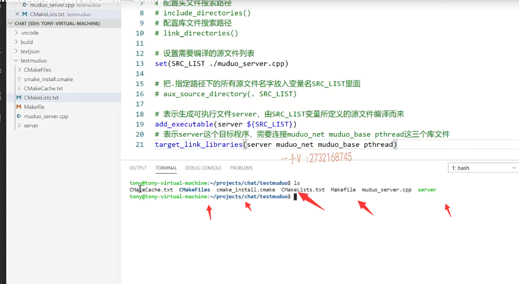

### 标准的源码框架

所以一般上呢，我们是不会直接这样去做的，

我们有这里边有一个小的方法啊，小的方法，

大家注意一下，一般呢，大家再去看这源码的时候呢，你都会看到很清楚的啊。

就是人家源码上啊。

嗯，就不像大家见的用VS建的啊，或者说是自己写几个原文件头文件啊，

人家都很详细的bin目录。这就是生成的可执行文件

lib目录，这是生成的中间的这个库文件，

include这是头文件

src，这是源文件

build 就是这个编译过程中，项目编译过程中产生了临时的中间文件。好的吧

test 这是测试文件，

或者说是example啊，就是示例。代码测试文件。好了吧啊，

还有third party就是你依赖的第三方库的这个文件啊，

人家第三方库呢，你把第三方库的源码直接拿过来了，集成到了你当前的这个项目当中。好的吧诶，

然后呢？外边再放一个什么cmake lists点TXT，

然后呢？你可以再写一个auto build点sh 这个linux的shell脚本啊，

一键编译对吧啊？这个一键编译实际上里边执行的呢，就是我们的cmake啊，

一般来说呢，标准的这个开源代码呢，就是你想开源给别人看，

你就别搞个VS工程上去了，是不是？啊，就是笑话啊。

这就是一般我们构建的这个项目里边儿啊，一般都是这么组织的，

当然在根目录下还可以放一些权限信息的啊。请勿任意拷贝啊，这个拷贝的话呢，一定要指明出处啊，

你的license文件之类的啊，你都可以写。

再写一些readme啊，介绍一下你这个项目的整个的这个项目是干啥的？

嗯，这个项目有什么用处？啊，你要用我这个项目该怎么用？

怎么编译？对不对？来给人家介绍一下。

这就是一个标准的。

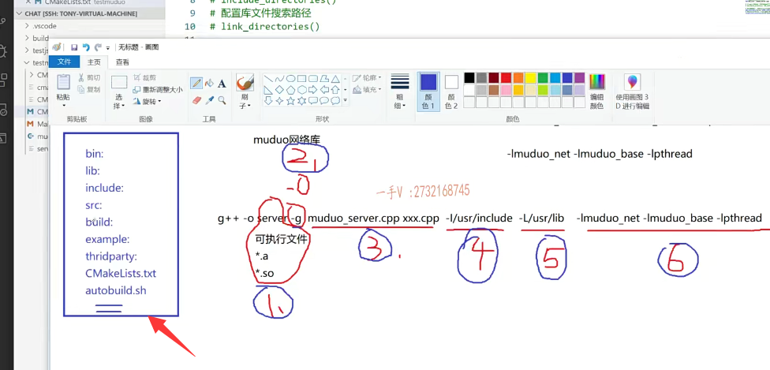

#### 先把这个原来的这些文件我删一下

我们一般呢。怎么做呢？会这样去做。

大家来看啊，我先把这个原来的这些文件我删一下啊。

还有包括这个cmakecache。cmakelist，别删啊，makefile啊，我也删了。

然后这个server我也就删了啊，

就剩我原来的这两个好不好？

就在这，你也可以用命令去删一下。

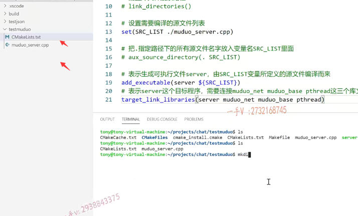

### 建立一个build   所有的编译的这个中间文件都放到这个build目录

一般呢我们会在这去建立一个build build文件夹好不好？

我们进入这个build，大家来看啊。

我现在整个项目的目录是这样的，

项目的根目录test muduo下边呢，有一个这个文件好吧，按这个文件就是呢cmake所要寻找的这个编译文件啊，这是源码文件，这是一个build，

我希望呢，把所有的编译的这个中间文件都放到这个build目录里边儿啊，

build进入这个build cmake点儿点儿。点儿的话是在当前目录下找这个c make list点TXT，按照这个配置的进行编译，

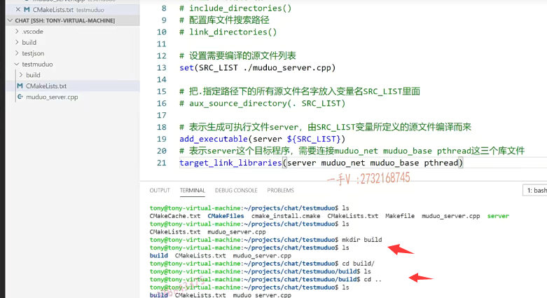

### cmake ..     上一级目录

但是现在我在build里边呢，点儿点儿就是上一级目录好吧？点怎么样？

这都build fields。生成成功了，你看这中间文件是不是都在build这个目录里边呢？

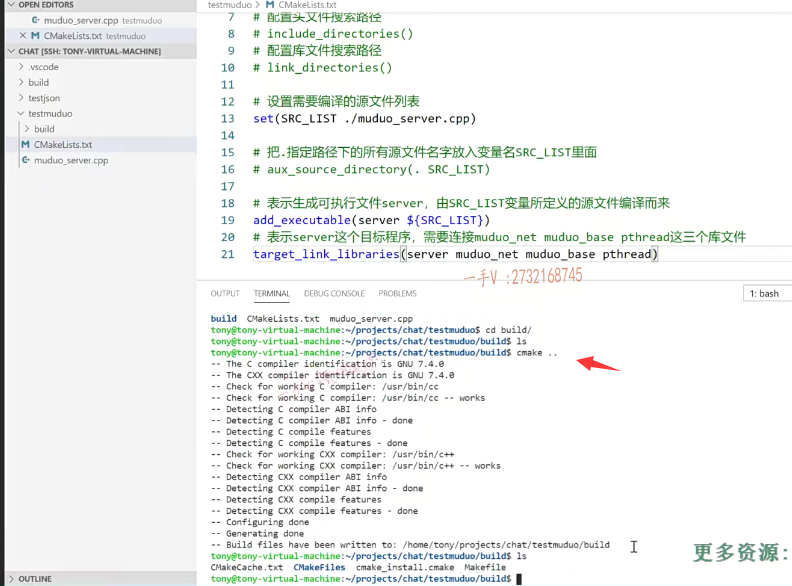

### 执行make

#### 可执行文件你别放在build的目录

然后呢？我再执行make。哎，执行这个make。对不对？

执行make了以后呢诶，你把这个什么东西啊？可执行文件是不是给我生成到这个build里边来了？

啊，在我工程目录下，它没有找见什么东西啊，没有找见可执行文件是不是

可执行文件你别放在build的目录里边啊，

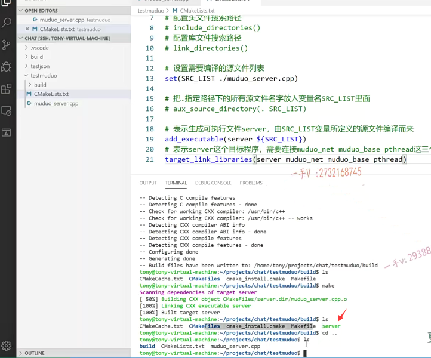

### 把生成的可执行文件呢，放在这个bin目录里

它首先呢，解决了一个问题，就是把编译产生的中间的临时文件是不是都全放到这个build目录下了，包括产生的这个二进制文件啊，

那么现在我还有一个需求。

就是像人家源码里边，我有一个bin。

我想把生成的可执行文件呢，放在这个bin目录里边儿。okay吧，

#### mkdir bin

所以呢，在这里边我还需要添加一个。

大家注意啊，就是这里边的这个make dir bin，那现在我目录里边。

啊，工程目录里越来越多了啊，这现在是拿这个呢，做示例后边我们的项目就是需要以这种标准的方式进行构建，构建完了以后呢，最终会给大家放到这个git HUB上。好吧。

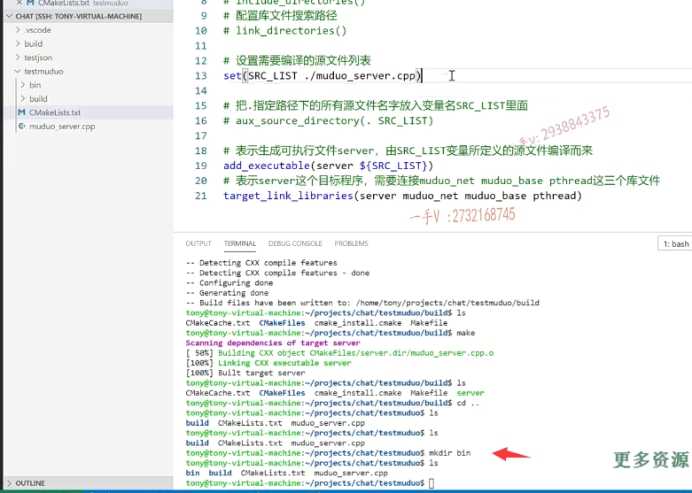

### 修改这个配置文件 OUTPUT_PATH

那么，这里边儿需要修改这个配置文件了啊，需要修改这个配置文件了，

我们需要呢定义，最终我的可执行文件是想放在这个哪里的？好吧，

设置可执行文件最终存储的这个路径。

那么大家来跟我看这里边啊。就是它有很多定义好的这个命令。呃，不是定义好的命令啊，定义好的这个全局的一些cmake能够识别的这些变量。

好的吧，唉，常用的预定义变量在这里边儿给大家列了，大家可以看看我上边儿刚才在这儿呢。

看到的这个。嗯，应该是在下边啊，

就是这个set就是预定义的变量啊executable，这是可执行文件的output path。

就是这一句常用的就是这这几个。

你当然有executable output path，你看啊，还有什么啊？library output path就是你要生成so库或者静态库，

你要把这个库放在哪个目录里边对吧啊？一般放在哪个目录里边啊？lib 目录下。

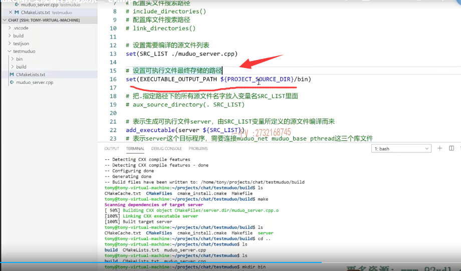

好的吧，现在我们是可执行文件。

==这个project source DIR，大家注意，这是工程的根目录，工程的根目录好吧，就是我们现在这个test muduo。==

这也是cmake里边儿预定义的这些变量，你可以直接使用，

==这意思就是说呢，最终你生成的可执行文件啊，可执行文件的输出路径是什么？==

==就是在当前工程路径下的这个bin目录里边儿。好的吧啊okay，==

那我们在这里边重新来一下吧。

嗯。现在先进入这个build，对不对？

把这个里边的内容呢，就全部先删掉。build没了cmake什么点还是点点啊。

点点在上一级目录就是test muduo。根目录里边有cmake list点TXT。

重新生成makefile再make。make成功以后呢，

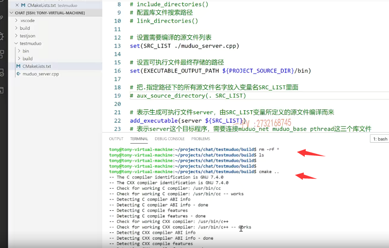

大家看这回server没在这个里边吧，出来进入什么bin目录？

OK，大家看我们的可执行文件，最终就放在这个bin目录了，

哎，你启动这个干干净净这块儿呢，专门就是放我们的可执行文件。

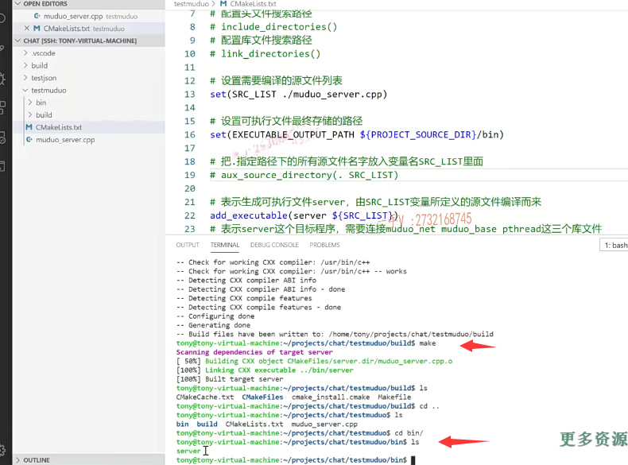

大家需要把这个东西呢，一定要记在脑子里边，

当我们想发布一个开源的，一个项目的时候呢，我该怎么去组织？

啊，我的项目文件怎么去构建集成的编译环境？

对吧啊，怎么更高级一点？

就是直接写一个编译的脚本。啊，把你这儿敲的这些命令呢，

全部呢在脚本上实现一下，我直接运行这个脚本。

一下子我这个项目所要生成的可执行文件库文件什么的就全部就都出来了啊

bin lib include src这些东西。

## 总结

好的吧。那说到这里边呢，

那就给大家告诉了我们项目上该怎么做，我们项目上就是这样做的。

我们会把我们项目上的这个所有的头文件全部扔到include

原文件全部扔到src，对不对啊？

编译的cmake编译的中间文件扔到build里边，

可执行文件扔到bin里边。

啊，我们项目应该不会产生库文件是吧啊，不会产生库文件，

所以lib呢就没有了啊。这个example也没有了是吧啊？

third party呢？我们可以把谁放进去啊？

对，我们把json点hpp放进来。好不好啊？json点hpp放进来，

这是我们依赖的人家三方的嘛

include跟src放的就是我们自己写的。

好吧，这就是呢，外层的cmakelists啊。

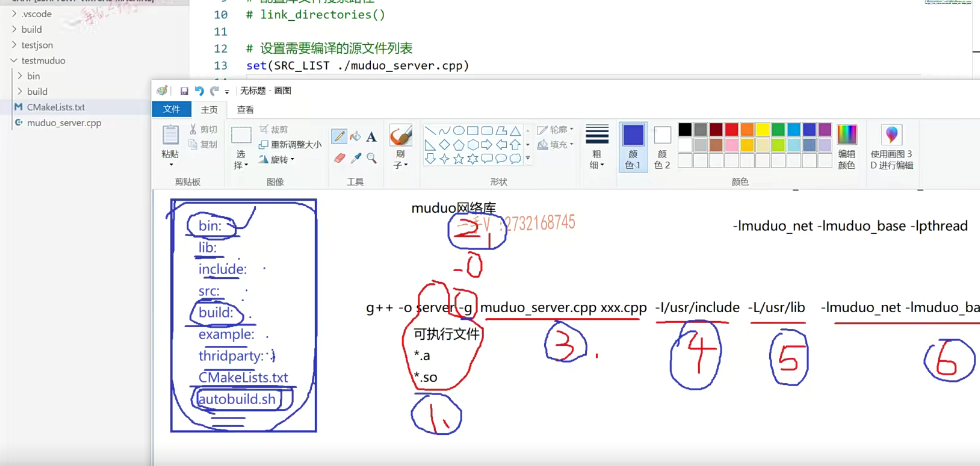

最后如果，我们想写的话，到时候看情况啊，想写的话，

我们到时候再给大家写一个auto build sh，我们尽量的写的比较准一点。

那这个就完了。

那么同学们啊，同学们在这里边啊。

注意一下这个啊，注意一下这个的整个的这个使用情况好吧？

行，那希望同学们跟着我的这个上课的视频啊，自己也去操作一下啊，操作一下用cmake来构建我们的编译。

它会自动的去解决这个依赖关系呃，这些东西呢？相应的设置就是为了解决这个命令上的这个一二三四五六做的这六件事情嘛，好吧啊。

这个对大家来说不陌生，应该是更简单了啊，跟makefile比起来，这简直是已经非常简单，简单到极致，简单到完美了。