这节课呢，再给大家补充说明一下，这个在VS code上啊呃，去做这个cmake的这个环境的这个编译。

那么如果呃，你没有使用VS code啊，也不想做配置，

那你在这里边儿呢，可以直接在命令行上，就像我们在build目录里边儿，通过cm ake点儿点儿呢来构建好吧。

而因为呢，你在VS code上安装好这个插件以后，就是cmake tools，这个插件以后呢，

其实你重启以后。这个左边这个栏儿里边儿啊，就会出现这个cmake这么一个图标啊，

它会在这儿呢，直接来构建的。view的啊，去构建所有的这个cmake工程好吧啊，

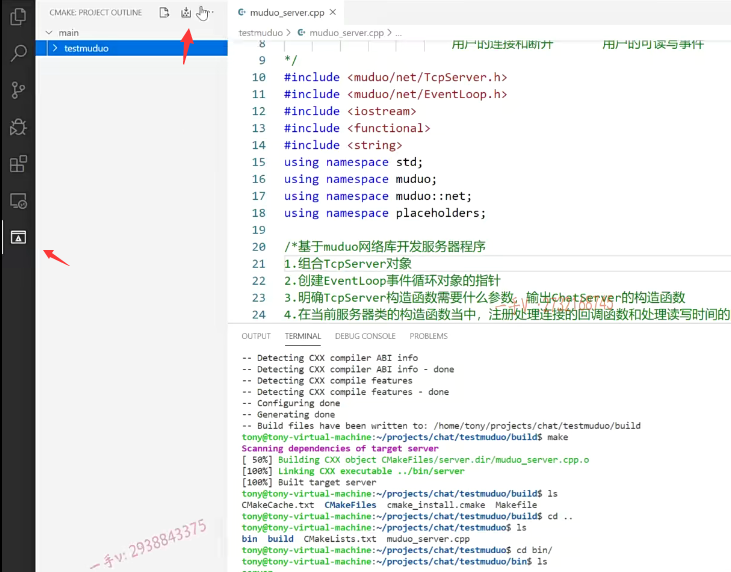

## 通过工具来构建 需要根目录下有cmakeList

但是你现在不行，因为你构建这个工程的时候。

构建这个工程的时候啊，这个test muduo它需要呢，你这个工程的根路径下就有一个cmakelist。好的吧，

但是我们现在的这个c make list是在工程根目录下test muduo下有一个。

呃，是在这个chat啊，我现在工程目录是个chat chat下呢，

有一个test muduo下，它有一个cmake list。好的吧，

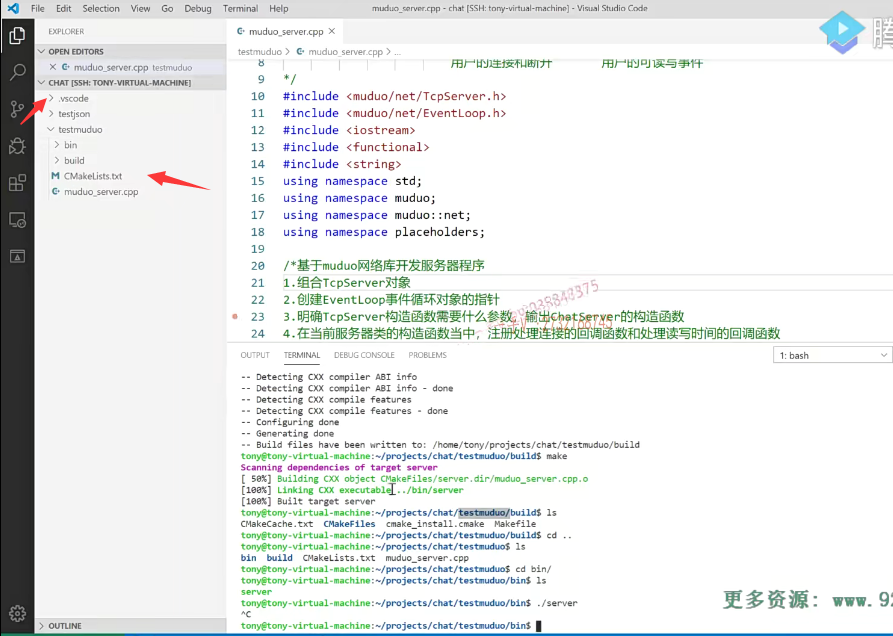

如果你想用VS code这里边的这个集成环境上的这个cm ake一点就直接编译好吧，

你可以这样做，那么在最外边cmakelist注意它的名字就是这样的，

这个是不能打折扣的啊，

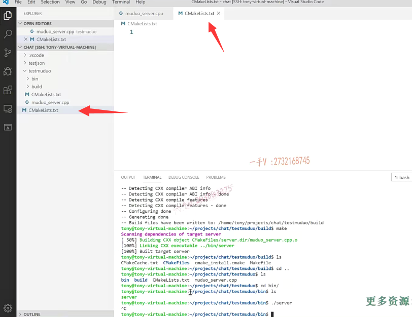

就是在这个工程根目录下就是projects check项，就是在我这儿啊。就是你远程连接的时候啊，

输入的这个工程的根路径嘛，对吧？

## 注意将版本 等放到外面cmakelist

有一个注意啊。在这里边儿，我们应该是把刚才里边儿的这个东西呢，放到外边儿，因为这个是入口的cmakelist。

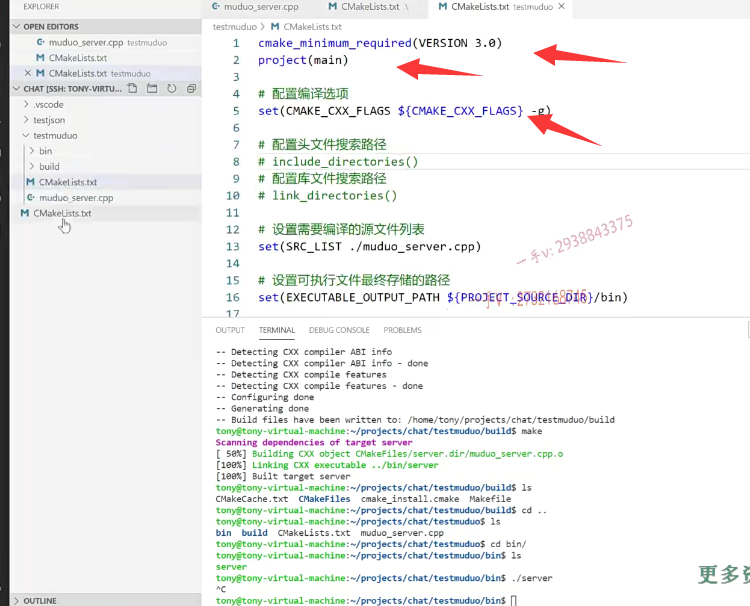

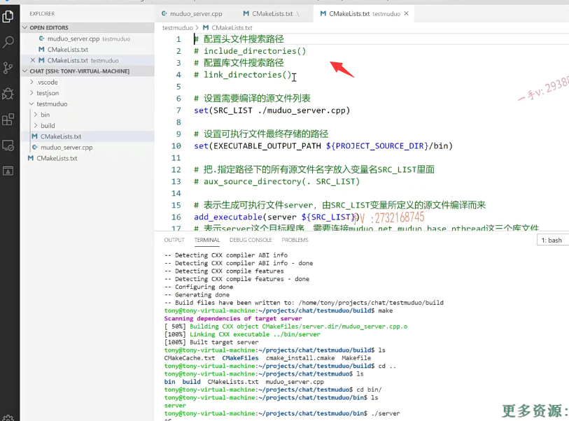

那有些同学说呢？啊，这里边这些东西啊，动不动啊？

这些东西就不动了，因为这个cmakelists主要是指导我们啊，

编译test muduo这个子文件夹下的这些代码的。你就写到这，你就放到这就可以了，

是不是按这也输出了这个可执行文件的这个最终的路径，

==其实这些路径呢，你放到外边了，放到里边了，真的是无所谓，你可以随便的放啊。==

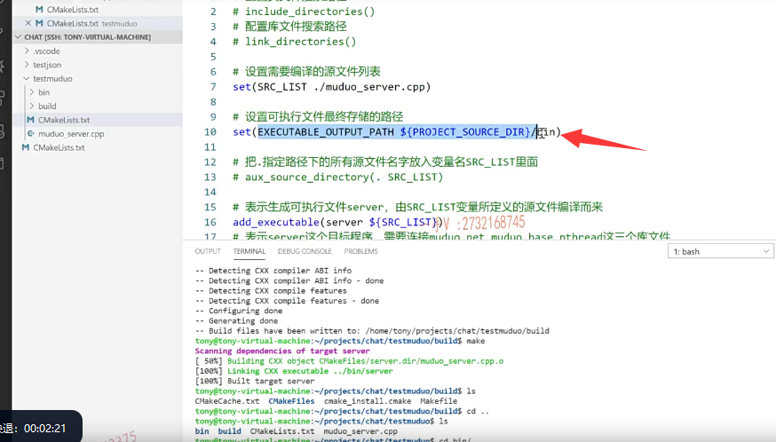

## 指定你要搜索的哪个子目录

外边的话呢，这里边就是要写一个什么？

指定搜索的子目录。

因为我们的这个cm ake在构建工程的时候呢，

工程有可能有很多级目录的，对吧啊？很多级目录的，

那么在这个目录里边呢，你可以去指定啊，你可以去指定你要搜索的哪个子目录？你比如说在这呢。

add subdirectory我搜索的子目录就是test muduo。

我现在有test json，还有个子目录，但是这个目录底下是没有c make list。

就是不需要参与cmake这个环境构建啊，这个里边有。

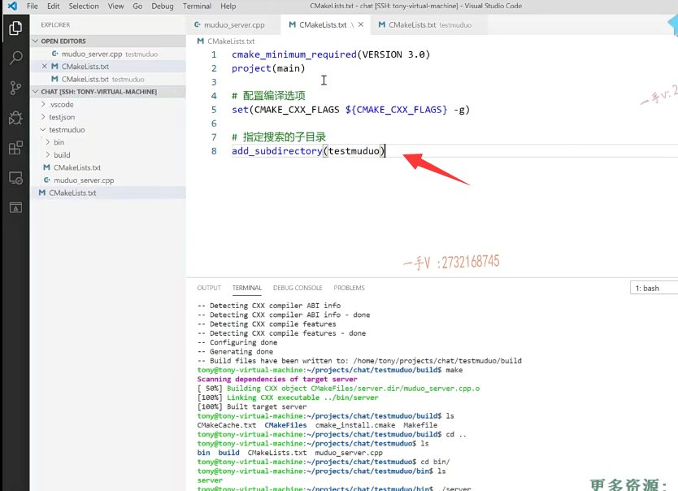

那么，相当于我们在工具上启动这个工程的这个根目录的时候呢？

它是怎么样啊？先找的是工程根目录下的这个cmakelist。

然后呢，这是一些编译选项，

然后它一看哦，要进入这个子目录，然后它就去test muduo下去找cmakelists了。对吧，

找见这个的话呢，它就会根据这个呢进行一个编译了好吧，

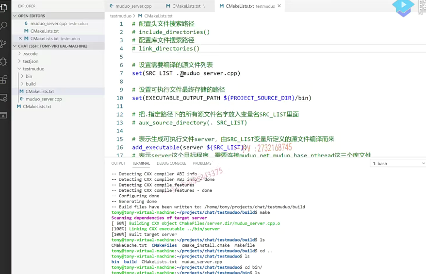

### 可以点工具 执行编译

那么这个写完了以后呢？你看在这儿，我直接编译这个是不是也是OK的啊？是不是也是OK的，

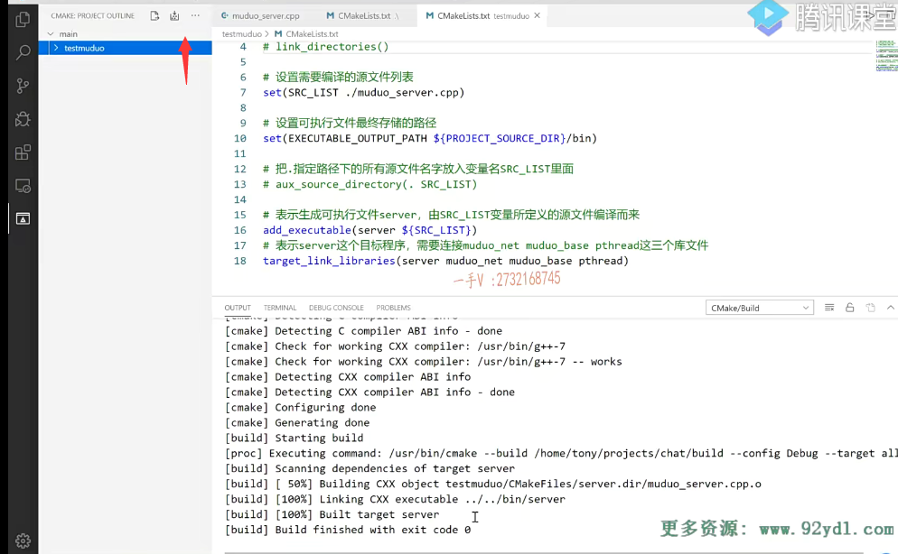

你看直接呢，他给你玩的事情都做完了啊，

这是build all projects。

不仅仅给你执行了cmake了，

还执行了什么？还执行了是不是make命令啊？

唉，就是生成了makefile文件还给你，直接执行了，生成了最终的target server，最终在这个工程根目录下，你看是不是有bin啊？并里边就是这个server可执行文件，

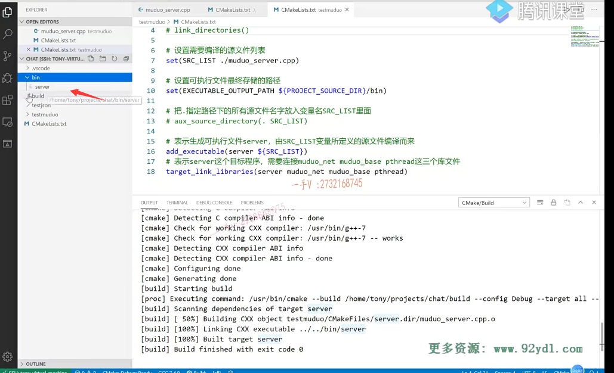

### 自动创建build bin文件夹在根目录

对吧？build是什么？build就是生成的编译的这个中间文件。好不好？

唉，我们的这个子目录里边儿实际上没有任何其他新东西生成的，

这个bin跟build是我们之前生成的，你可以把这个删了，不影响。

==也就是说，编译好以后呢，所有的编译的最终的输出以及过程中间产生的临时文件啊，就都在bin目录和build的目录里边的。==

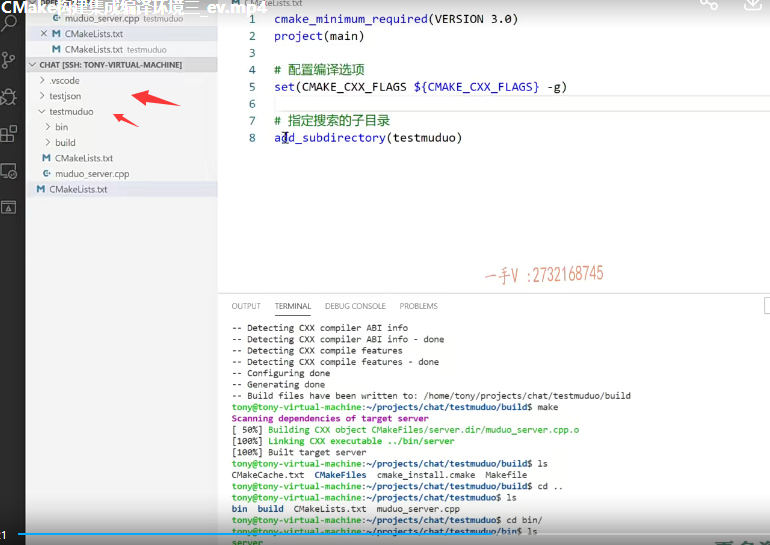

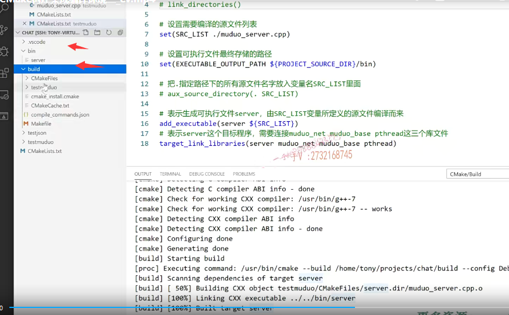

我们原工程目录里边的代码及simic配置文件干干净净。没有任何的混淆。

也就是说cm ake的构建工程呢？

也就是从最开始项目根目录里边啊，一般都会添加子目录，

因为根目录里边又没有什么这个源文件啊之类的是不是啊？

你可以呢，把这个全局的一些编译选项的一些配置啊。

呃库文件以及可执行文件的输出路径啊，都写在工程根目录下，就是最顶级的，这个c make list里边。

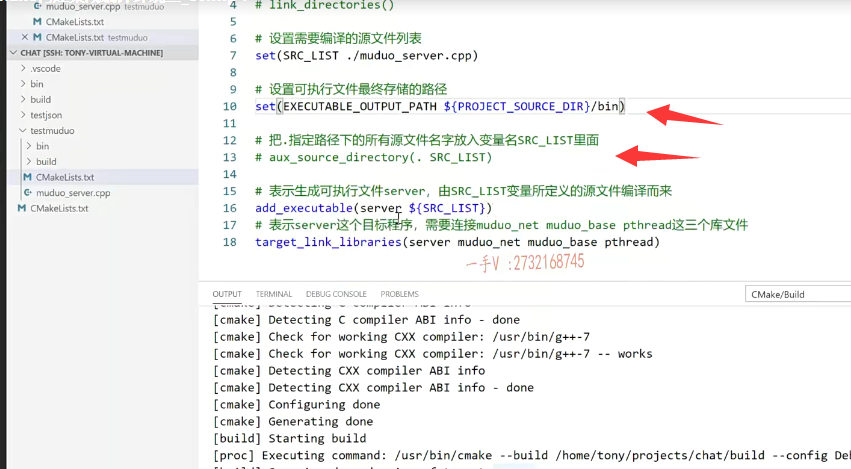

就像这个不能移啊，

这个就是在我子目录test muduo里边的这个文件。

呃。这个呢，可以放在最开始的这个里边的。

好吧，这个也不要移了啊，这个也不要移了，

==现在project source DIR呢，就是我整个工程就是chat这个目录的。就是我们项目的这个源码的根目录，==

所以你看它产生的bin目录跟build就都在这儿了。

好的吧啊，那么如果你想用VS code，这里边的编译你就得在工程的根目录下建这个，然后在子目录底下再建这个cmakelist啊。

### 演示一下啊，这个开源代码在muduo库

大家可以在这儿呢，我给大家去演示一下啊，这个开源代码在muduo库，

你看这个muduo库的这个源码。

啊，最开始cmake lists这个muduo库的代码啊。

c make lists.是不是啊？这里边c make lists。

每一层级是不是都有一个cmakelist啊？

注意，这就是它的一个使用方式好吧，

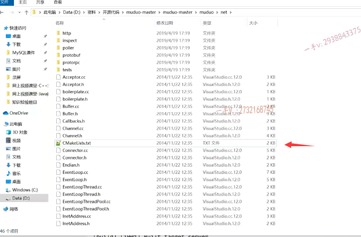

如果你想在VS code上直接通过这个，它的这个集成编译环境c make直接构建的话，这就更方便了，这一点工程根目录下bin里边儿直接出来了。

对吧，更好的是中间的编译文件都在build啊，源码文件干干净净，不做任何的干扰。

啊，我如果你也跟我一样切换到了VS code的开发环境下，我希望呢，你采用最后的我讲的这种方式。okay.