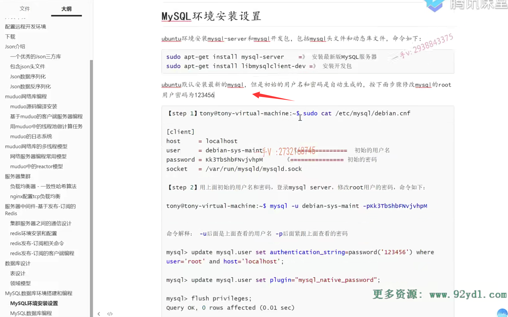
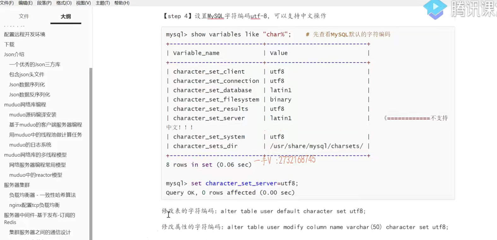
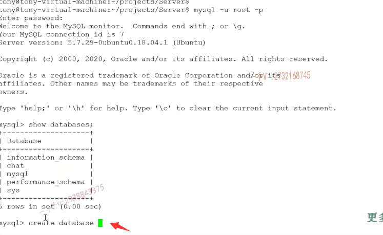

## 安装mysql的环境

项目要启动，

我们首先呢，就得把数据库先设计好啊，

那么这节课呢，我们就主要来给大家说一下数据库的这个环境搭建，以及呢我们这个项目的相关的一个表的设计啊。

呃，大家有的同学呢，可能用的是ubuntu，跟我的一样啊，有的可能是用的centos或者是其他的Linux系统啊。

那在这儿呢，你无非安装mysql的环境，需要安装两个东西，

一个就是misql server，一个就是mysql的开发包。

如果你在ubuntu环境下呢，你可以用这两个命令直接进行一个下载就可以了啊，直接进行一个下载这个my server呢，相当于就是mysql的服务器啊，mysql本身就是一个CS模型的，我们的这个就聊天儿服务器相当于针对于MySQL server来说，==相当于就是一个mysql client客户端啊，我们在mysql client客户端的这个角色来向mysql server呢发送相关的数据的增删改查操作。==

### 修改用户密码

#### mysql也是有用户管理的，它的一个默认安装呢，也是有一个root用户

好吧，那么你在ubuntu下啊，更新了最新版本的这个mysql server，这里边儿会涉及呢，它会自己生成用户名和密码的啊。

那我们如果想改，把mysql的root用户。

这个root用户区分一下，不是linux的那个超户啊，不是linux的root。

mysql也是有用户管理的，它的一个默认安装呢，也是有一个root用户好吧，

那么你像我的这个mysql root用户呢，密码相对来说就是123456在这里边儿呢，

如果你跟我的环境一样。你可以跟着这样去操作，把相应的这个mysql root用户的这个密码改成123456，

或者你想改的比较简单的好吧，

然后呢，你就可以呢去测试一下啊，登录测试一下，看是不是？密码修改成功了。

好的吧，然后在这儿呢，我还给大家呢，去列举了一些其他的东西，

比如说呢呃，你想存储中文，那么在这里边儿设置一下mysql的字符编码为utf-8啊。

那么，相应的，这个sql语句就在这里边儿，给大家都写到了啊，

### 具体的数据库编程

具体的数据库编程。

那在这里边儿，我就先不单独讲解了，也非常简单，

无非就是连接数据库和数据库断开进行增删改查操作嘛，对吧啊

insert  delete update这个是更新操作以及select这个查询操作。

### net state来看一下系统的这个服务

呃，你如果是其他的linux这个版本的话呢？

那在这儿呢？你注意一下啊。我们的最终的目的就是你能够把这个mysql server安装成功，

也就是说呢，在这各位来看一下啊，你可以看一下用net state来看一下系统的这个服务，看你的这个mysql d是否启动。my服务器呢，是默认工作在3306这个端口的啊。好吧，

默认是工作在3306这个端口的，大家注意一下啊。

### 安装一个mysql的开发包

好，这个my server安装成功以后呢？

呃，那在这里边，我们如果要涉及到数据库的编程，

这里边还要涉及呢？安装一个mysql的开发包好吧，客户端的开发包。

你如果是在ubuntu系的这个系统下更新的话呢，是这个名字，

如果你要是在红帽系的这个系统下更新的话呢，

那它名字大概就是一个mysql相关的一个develop啊dev开发嘛，对吧啊

开发就是跟这个字眼儿相关的，你在你的yum仓库里边儿去找一找啊。

那么，最终呢，把这个密码修改一下，或者大家都统一把mysql root的密码修改成123456。

因为到时候有的同学呢，拿到我的这个代码直接运行的话呢，你要注意更改一下数据库的用户名密码，看是否正确啊，如果咱的密码不正确，你拿我的代码运行，你肯定连不上你的数据库啊。

是不是好这个就是数据库的一个安装，以及环境的这么一个搭建啊？

当然了，在项目这个做的过程中有任何的问题啊，大家可以在QQ上呢，来和我进行一个沟通。

这个设置好了以后，大家可以在这儿呢，用你的mysql杠u root杠p，

然后是输入你刚刚设置的密码，如果能够进入这里边mysql   尖括号好吧？

那么，这就是进入了mysql shell啊，

那就证明呢？嗯，这个成功了，可以连接的啊，可以连用户名密码也都正确。好吧，

那么在这呢，大家可以看看啊show databases对不对？

你创建一下数据库，我们数据库的名字，我们统一叫做chat吧，好吧，

大家如果想用我的代码的话呢，你就跟我保持一致啊，后边呢，

你要是修改了你数据库的这个数据库的名称啊。呃，用户的相应的密码，

那你拿到我的项目代码的话呢？你在代码上也要相应的去改一改这个。

### create database

没有数据库的话呢，创建一下嘛，create database嘛，对不对？

这就是你学数据库最基本的一些sql操作了啊。

### 创建一下这几张表

创建好数据库以后呢，你在这里边啊，把这几个表呢，都创建一下啊，这几张表怎么创建呢？

### 表的设计范式以及表的这个设计原则

好不好？这几张表怎么创建？

大家来看我在课件上给大家都已经写好了啊，数据库的设计这个在线下给大家讲解数据库的时候呢，

至于啊，关系型数据库啊表的设计范式以及表的这个设计原则啊，这已经给大家讲的很清楚了，对吧？

我们拿到一个实际的问题，在去设计表的时候呢，都会去找一下这个实体跟实体的这个关系，也就表与表之间的关系，一对一还是一对多还是多对多？

啊，一对一跟一对多都是要设置一个主键关联，对吧？

啊，多对多要产生中间表来建立两张表的一个关联关系。

那么，这是user表，user表的有四个字段，一个是ID啊，用户名，用户密码跟一个什么状态？

==state就是它在线还是不在线，因为到时候在集群环境当中呢，==

我们在不同服务器上的这个用户是不知道对方的这个在线状态的是不是啊？

那这个呢，就得通过数据库啊查询而获获知了，

==那假如说你把这个状态缓存到red is上的话，那你也可以通过查询这个red is来获知用户呢的一个是否在线的一个状态啊？==

这个friend就是一个好友关系啊，好友关系的话在这呢，很简单。

就是一个user ID跟一个对应的friend ID。

好吧，这里边字段的类型字段的说明啊，以及它的这个完整性约束条件呢，就都在这里边了。

还有一个group啊，group就是群组群组的这个表呢ID group name group dic，这是整型，这是ID。

这是它的约束条件。

好吧，这是群组名，这是群组的一个描述啊，

我这是个学习群，我这是一个兴趣爱好群，对不对啊？简单的描述一下。

这是群里边的组员。一个人可以属于多个群啊，一个群可以被多个人，

==所以呢user跟group之间的这个对应关系呢，就是一个典型的多对多的关系，==

==所以产生了一个group user中间表啊表示这个群啊，表示这个群的ID。==

这个用户的ID啊，这个用户呢？是属于哪一个群的？是不是啊？

然后呢？这个用户在这个群里边的角色是什么？creator就是群的管理员。

normal呢，就是这个群的普通成员好吧，

还有一个offline message，就是当我跟你说话的时候呢，你不在线啊，你不在线的话呢？

就是我给你说的话，这个就在数据库里边啊，它保存起来了，一个离线信息，

等你下一次登录上线的时候呢。这个离线消息呢，会发送给你的好吧？

根据我们项目所要完成的功能呢，这里边设计了123455张表。

呃，我希望大家呢，能够自己呢，在这个mySQL的登录my server啊，

在上面创建这个chat数据库，然后在数据库里边再创建这几张表。

好不好啊？这几张表的创建的这个表的字段呢？字段类型啊？字段说明和约束条件就都写到这里边儿都已经写好了啊。

那如果说你对数据库是一知半解，完全不明白。

啊，那我觉得你要花一点时间，因为你做后台开发的话，你说你对数据库一点都不了解，这个实在是有点说不过去呀。对吧啊，

连表基本的创建你都搞不明白，那更别说是问你什么单表多表的查询了。

那这还是你要花一些时间的，

如果你实在是懒得去创建表，那么我在这个视频的下方啊，下载这个文件的那个地方呢？

我会给大家把我的这个数据库   chat数据库里边所有的表呢，都会输出一个sql的脚本啊。chat点sql，这是一个脚本，

你登录你的这个mysql以后呢，直接用source命令啊，来把我来把在我这个页面上下载的这个sql脚本啊。直接执行一下，

那这些数据库呢表就都创建好了啊。

你可以再查一下嘛用呃，在my上呢，怎么执行sql脚本好吧啊？

用source。source source code源代码的这个源啊

用source命令呢，就可以把这个sql脚本呢全部导进来了。

就表就都创建好了啊，跟我本地上的这个数据库呢，就是一模一样的好吧，这就是呢，我们项目表的一个创建在这儿呢，已经给大家写清楚了。

好，那么这节课呢？我们主要给大家啊，把这个linux环境上啊的这个后台的这个数据库啊的环境搭建。

说了一下，然后呢？我们说在这里边儿给出了我们项目啊，相关的这个表的设计，

大家注意一下，你也可以先考虑考虑啊，这些表到底是怎么设计的啊？

我这个项目都要完成哪些功能好吧，都是依据我们的功能来进行设计的。

那这节课的内容呢，就先说到这里。