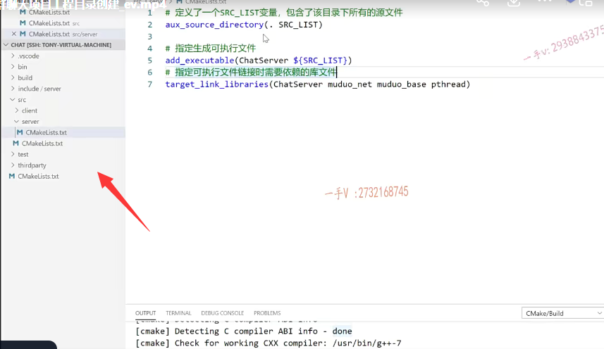

这节课呢，我们给大家介绍一下这个聊天项目啊，这个工程的这么一个创建，

它的一个源代码的一个组织。

### test

那么在这，我把之前上课给大家讲的那个json的test啊，还有这个muduo code test放在了这个test文件夹下边儿，

这个我们将来呢，就不隶属于整个的这个项目代码了啊。

就是到时候最后传到git HUB上，这块儿我们是不传的，

这块儿呢是给大家做的一个json muduo库的一个使用测试，

还有包括cmake啊，原理的一个使用测试。

### bin

这里边儿的bin目录，大家说了啊，这块儿是生成我们可执行文件的，对吧？

这是之前生成的啊，这个呢，我们可以删掉。

### build

build的目录里边儿呢，就是我们用cmake生成的临时文件，这也是以前生成的啊，先放那儿，我们到时候重新生成的话呢，都会覆盖掉的。

### include

那么，这个include这就是头文件放的地方呃，我们的这个include里边放了一个server，

也就是说我们到时候开发的这个聊天服务器程序呢？跟这个客户端程序，我们就都在一个工程里边儿啊，

最后呢，在bin目录里边儿呢，我们可以生成两个可执行文件。

一个就是用于服务器的啊，一个就是用于这个客户端的，对吧？

客户端跟服务器的这个代码所用的头文件呢？

就在include里边的server跟client里边啊。那么，我们先写server client，到时候有用到的话呢，

我们再写一个client文件夹，里边专门放客户端开发的时候可能会依赖到的一些头文件啊。

啊，客户端跟服务器之间共有的一些就是代码开发，共有的一些这个信息呢，

我们就都放在include里边儿啊，就是跟server跟client是同级目录的啊，

他们是客户端服务器共用的，

比如说这个消息的定义对吧啊，客户端跟服务器对于消息的ID呢，这都是必须保持统一的。

### src

src呢，就是放源码的啊，在src这个目录下呢，我建了一个server目录，

现在都是空的啊，跟client的目录，这个就是放这个聊天儿服务器代码的，这是放聊天儿客户端代码的好吧？

### third party

这个third party呢，是依赖的第三方的一一些库啊，因为我们使用了这个json的一个解析的一个开源的库，所以我们把json点hpp呢，就放到这个third part里边来了。

### lib

==因为我们这个项目没有去生成这个lib库啊，就是点儿a静态库或者是点儿so动态库，==

所以我们这个工程里边儿没有lib。就是lib这个文件夹好吧，

# cmakelist编写

## 最外层

这就是最外层的这个c make lists了

那么在这里边呢，我们给大家把这个工程的呃目录的创建啊，

我们代码的组织结构简单，给大家介绍一下，

然后咱们呢？把这个整个工程里边的cmakelist呢，我们大致写一下好吧，

工程根目录下底下的这个cmake lists里边呢，主要设置的这是我们之前讲过的啊，就是要求的一个cmake的一个版本号，

对吧？这是呢，我们命名的一个工程的一个名字啊chat 

在这里边配置了一些编译选项啊，如果你还想加其他选项的话，

你可以在 -g 后边继续呢进行附加。

### 配置这个最终的可执行文件啊，输出的这个路径

那么在这儿，大家继续来跟我看，很明显在这儿我们编写代码的时候呢，是不是把代码进行一个规范化的组织了？

所以呢，我们cm ake在编译代码的时候呢，你就得知道啊，去我工程目录里的哪些地方能找见头文件？是不是啊？

所以在这里边呢，我们继续需要配置啊，配置这个最终的可执行文件啊，输出的这个路径，这个我们之前配置过吧，这个我们之前配置过是不是？

啊，就是set，然后是executable output path。是的吧啊，这个呢，就是在什么呀？project.source dnr.目录的bin目录里边。

就是在我这个project sourced l就是当前工程的根目录的，这个bin目录里边就在这

好吧，最终就输出到这里边了啊。

### 配置一下头文件的搜索路径

那么在这呢，还得配置一下头文件的搜索路径啊，

那也就是说呢，在这add 这个呃，不是add 啊，这个是头文件的这个搜索路径呢，我们是include directories。好吧，

include directories是不是啊？

就是还是呢我们工程就project。这个路径底下的是不是include里边有啊？

没问题吧，

我们还可以把这个东西写开啊 include里边有include里边的这个server里边。也有可能是不是存在的啊？也有可能存在。

好吧啊。这是配置了一下头文件的搜索路径OK，

然后呢，在这里边儿就是因为我们工程根目录下又没有什么代码需要编译的，

所以呢，代码源码可编译的代码是不是都是在src这个目录里边啊，

所以呢，在这啊，这个加载这个子目录。继续加载子目录就是add这个subdirectory就是src，

这就是项目根目录下边的这个cmakelists。就是这样输出的。

## src目录底下创建cmakelist，一层一层创建

好吧啊，我们先大致呢，把大致的这个过程写出来，写完以后呢，

我们后边需要修改哪些东西，我们再更改也不迟啊。好，那么当我们去进行项目构建的时候呢？

他啊，看到这里边儿相应的配置项以后在这儿呢，又去这个目录底下。

src目录底下是不是去找这个cmake list文件去了呃，

所以你在这个目录底下呢，也得建一个什么文件啊c make lists点TXT。

好吧啊，这个目录底下也没有源码，因为源码是在这个src底下的server里边或者client里边的，

所以这个文件呢，特别简单add subdirectory。谁呀server？

好吧，我们先是开发，先开发server，这里边就先写server了OK吧？

## server目录下创建cmakelist

然后呢？server底下呢？是不是还得再去创建一个什么？cma kelis tc make lists点TXT啊，

==就是一层一层的，之前给大家说过啊。==

那这块儿呢，相当于就是由所有的源码来怎么样了？

==由所有的源码是不是来生成这个一个可执行文件了。==

对吧啊，那在这里边就是我要add executable生成可执行文件，

就是chat server。啊，就是chat server对吧？

### 生成可执行文件

有哪些文件来生成呢src list，那在这里边呢？

### 由这个项目目录里边的所有的这个源码文件来产生

就是指定啊生成生成可执行文件，那当然是由这个项目目录里边的所有的这个源码文件来产生了对不对？

所以这里边就嗯，大家用的这个aux aux source directory，这个在课件上呢，也也有给大家去列啊。

大家来看一下啊就是在。这个就用这个定义变量存储当前目录下所有的是不是原文件啊？就是 . src list，

==这个相当于是定义了一个什么src list变量这个包含了啊，该目录下所有的源文件。啊，代码源文件好吧，==

然后呢？进行编译是不是啊？

编译的时候这个东西是需要链接target link libraries啊，就是这个可执行文件啊，是需要链接谁的？

muduo net，muduo base，还有p thread。

没问题了吧？各位看一看啊。

这个是指定可执行文件需要依赖的这个库文件啊。

指定可执行文件链接时，需要依赖的库文件。

这个呢，最终呢，就会放到啊，我因为这个是在最顶级的cmakelists里边儿设置的可执行文件，最终输出的路径。就在bin目录里边。可执行文件。到次级文件啊。到这个s ever文件夹里边这样写。

这个依赖过程呢，大家应该能够明白的吧啊。

好，这节课呢，我们主要给大家把我们这个集群聊天项目的这个项目工程目录给大家说了一下啊。

大家呢，也在自己的啊，这个开发环境上去找一个啊，在远程主机上。找一个合适的目录作为你项目的开发目录啊，把这个定义规范，到时候我们可以直接呢，到时候最后我们加一个这个shell编译脚本直接把这个就可以推到git HUB上去了。

