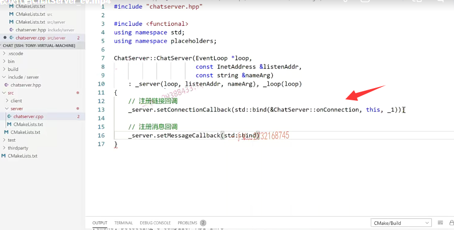

这节课开始呢，我们就开始书写项目的代码。

我们前面最开始都说了啊，这个项目呢，就是包含了我们通常开发的服务器项目的这个网络模块儿，业务模块儿跟数据模块儿。

数据模块儿指的就是数据库好吧，数据的操作，我们在这个项目中呢，要把这个三个模块儿给它区分开啊。

那也就是说呢，我们刚开始比如说以做一个登录操作呢啊为主线来给大家呢，

把这三块儿代码呢分别输出一下啊。之前呢，我们也给大家讲了这个muduo库的一个基本使用好吧，

## 先把我们项目的这个网络lO模块儿相关的这个代码

所以呢啊，我们这节课呢，先把我们项目的这个网络lO模块儿相关的这个代码呢，给它输出一下啊，

我们在编那这个检测一下呢，我们之前啊搭建的这个编译环境啊，

集成编译环境是否正常啊？

大家来跟我看看。在这个文件里边我们应该要创建一个什么东西呢？

就是chat server.点h。

好，我们C++的一个头文件好吧啊c++的一个头文件if no de fine chat。server h.

define一下。end if

那么现在写项目代码，我们相应的头文件类型定义就写在头文件当中。

方法的实现呢，是不是就写在原文件当中啊？

这个呢，我们muduo库嘛，还记得包含什么muduo，然后呢net，

然后呢TCP server是吧？

我们之前讲了，大家来跟我一起回忆一下，还有muduo net.  event loop是不是点h啊？

在这呢。还有我们再写谁using namespace，首先呢，肯定有muduo我们不想写那么长的这个名字，空间作用域啊，还有它的net。

好了，那么写一个class chat server。

## chat server

chat server.它的成员变量是什么呢？

它的成员变量是首先呢，我们得把这个TCP server这个类产生的对象作为它的一个是不是组合对象啊？server啊，

然后呢？再创建一个什么event loop？指向一个事件循环的指针保存事件循环啊，

因为我们拿到这个事件循环的指针，我们就可以基本上我们目的就只有一个，我们就可以在合适的时候调用它的quit来退出，

是不是这个事件循环啊？

那chat server需要准备这个构造函数，

它准备构造函数是为了构造它的成员变量，

==就是这个TCP server对象的，因为它没有默认构造啊。==

它需要这三个参数对的吧？好把这个呢填到这里边啊。

okay，它还有一个什么函数需要写呀？start函数。是不是需要钱？对，

然后呢？我们再加一些注释吧啊，这个是初始化聊天服务器对象。

这个是启动服务好吧啊，一种启动服务这个呢，

还有什么呀？因为给要给人家注册，是不是两个方法啊？这个方法是哪儿呢？

因为要给TCP server注册一个新用户的这个连接以及连接断开的，

还有已连接用户的，是不是可读写事件啊？

主要就是响应这个连接相关，跟这个消息相关的就是一个是connection call back一个是message call back，看这个connection call back长的这个样子呢，

就是这个样子啊。

所以在这呢，给connection。写个这个啊，这个是回调。你上报连接相关信息的回调函数连接创建，连接断开好吧，

还有一个是什么on message这方法？当然名字你可以随便起了啊。

然后是message call back。呃，它是包含有这几个参数？

那我就写到这里了。我就写成这个样子吧啊。

这个是上报这个读写事件相关信息的回调函数，当然所有函数的这个实现呢，

我都是会写在这个什么里边原文件当中的啊。

好，那这个就可以了，

这个是聊天服务器的主类。

啊，这个是什么呢？这个是组合的muduo库啊，实现服务器这个功能的类对象啊，

这个是指向事件循环对象的指针。

我们都给大家标识出来啊，那相应的这个原文件我在哪里实现呢？

就在这个server里边是不是啊？new file就是chat server点啊CC也行，cpp也可以啊，

这都是C++的。那么在这儿呢，include谁呀？

include就是这个chats ever hpp。

那我们就要把相应的方法呢，都去实现一下了啊在这个chats ever hpp里边先实现一下这个。

## 构造函数实现

这个是给他的成员变量，叫那个server是吧啊？是loop，然后是listen addr，然后是name arg，然后还有一个是啥杠loop？啊loop对吧？

然后再是loop。

### 注册连接回调

在这呢，大家来看都要去做哪些事情来着，还记着吧，注册连接回调是吧啊，那就是说。

在这呢，我们需要用到函数对象绑定器。

是不是using啊？using namespace STD还得using namespace。space please holders啊，还有参数占位符，对吧？

杠server点set什么connection call back，

然后呢，第一个就是用它的这个bind啊，bind绑定器。

### 使用bind的原因  参数限制  能不能改成lambda表达式

==把它的这个chats ever的这个onconnection方法绑定人家的回调，有一个参数，你这写了一个成员方法有俩参数，对吧==

this当前对象是绑定上啊，你还有一个参数呢需要传入，

所以你事先就告诉人家，我需要预留一个参数的位置啊。

### 注册这个消息回调 

好接着呢，是注册这个消息是不是回调啊？

就是杠s ever点set谁message call back啊？

用这个绑定器。来写谁呢？

把这个chat server里边的这个on message方法给它绑定this，它有三个参数，

==所以要预留三个参数占位符，==

### 设置线程数量

==然后呢设置啊？呃，线程数量好吧，==

==就是sever点set thread number在这里边儿写个四。==

好了吧。然后呢？再实现这个方法啊，启动服务。

okay，这个相应的。再把注释我们也都贴过去啊。

这个我都拿过来。方法名字前边加类的作用域。

那这个start调用的就是s ever的start很简单，没得说啊。

### 两个业务方法

这两个方法做什么事情呢？

这两个方法呢，就是做连接监听跟读写事件监听的啊。

这个方法呢，我们先不写。好吧，这是网络模块儿的代码嘛，

这块儿代码相当于就是给谁进行通知了，要给这个服务层通知了，是不是啊？

要给这个服务层通知了。

大家来看一下。这块就是我们写的这么一个东西啊嗯。

## main函数

那在。这里边我们是不是还得有一个什么函数啊？

有一个是不是启动函数啊？那么，在这个server里边啊，我再写一个main点cpp好吧。就是include谁呀？cat server点hpp。return 零呃，

这个再包含一下谁？包含一下。lO stream吧，

using namespace sTD，好的吧。

OK，然后在这里边儿呢，我们先定一个事件循环对着吧。

==然后呢，还要定一个address在这里边，我们就先写死吧啊，==

==后边呢，因为还有数据库的，是不是相应的一些配置信息呀？所以到时候最后呢，我们还得去给写一个这个配置文件，从配置文件里边去加载相关信息啊，我们就先写写死了。==

chat sever sever给它传loop，然后再传AD PR，然后给它再起个名字就叫做。chats ever吧啊，

然后就是sever点什么start。

然后就是什么呀loop点loop。开启事件循环。

就整个服务器就启动了，是不是啊？

好相当于我们现在只是把很简单的网络模块代码写完了。

之所以简单，是因为我们直接使用了muduo库啊，得到了一个非常强大的基于事件驱动的lO复用epoll加线程池的这么一个网络。

啊，代码是完全基于reactor模型的，是不是啊？

有一个主reactor，我线程设置了四个。

有一个主reactor是lO线程，有三个呢sub reactor是工作线程，对吧。

主reactor主要负责新用户的连接啊，

子reactor呢，主要负责已连接用户的读写事件的处理。

okay吧。

## 编译

好了，那在这里边我们试一试啊，我们试一试，

看能不能？正确的进行环境的一个编译工作。

大家在这里 看编译，完全没有问题的吧啊，编译完全没有问题的，

这是编译进度，整个编译都成功了，

如果编译有问题的话呢？人家是会给你报错的啊，

最后呢，在这个bin目录就是在我项目的这个根目录里边儿呢。

哎，它编译出来的一个chats ever。好吧啊，它编译出来了一个check server，

那就说明呢，编译一切OK，我们的cmake呢，这个环境呢也都是没有任何问题的好吧啊。

那么大家呢？可以跟着我把这个写一下啊，因为是写项目，就不要太随意了啊，什么东西都写在一个文件当中。

把头文件我们项目既然已经划分了，因为到时候提交到get HUB上呢，

人家有全世界的人都有可能看到的，对不对？哎，

你不要觉得我没有告诉别人github啊地址呢，别人看不到啊。

那很多人都在github上翻翻到你这儿写的不没有任何的规矩，是不是啊那？

被别人背后骂，谁都不愿意，对吧啊？所以呢，大家尽量写的规则一点好吧。

好，那我们这节课呢，就先把这个网络模块的代码呢，就先给大家输出一下。