# 网络模块儿收到的消息给它派发到这个业务模块儿

上节课呢，我们把chatsever这块儿的网络代码写了啊，

那这节课我们就来考虑一个问题啊，也是一个非常重要的设计了，一个非常重要的设计就是我们在这儿呢，

怎么把网络模块儿收到的消息给它派发到这个业务模块儿啊？服务模块儿。对吧，

让这个网络模块的代码跟服务模块代码完全解偶。

那么大家来顺着我的思路来想，

现在假设有一个用户在登录啊，在做登录业务，是不是在做登录业务？

登录业务的话呢，它里边包含了这个message ID，

现在是在做登录操作对吧啊？json里边。

然后呢？是有这个什么东西呢？除了message ID是一个登录业务，还有这个name啊，密码用户名密码，我们要验证它的用户名，密码正不正确，是不是。

这还没到数据层呢啊？那么，on connection，这我们先填上一对吧？

同学们在这打断一下啊。

这个是connection对吧啊？这个连接成功，连接成功，就连接成功了呗，这我们没什么高兴的啊，

我们主要关注的是连接失败的情况。

你连接失败的话，我需要给你释放什么东西呢？释放socket fd资源呢，对不对啊？

shut down好吧？shut down啊。

在这里边呢，相当于就是有用户怎么样，有用户下线了啊，

有用户下线的话，本身的muduo库。人家的日志也是会给我们进行一个打印输出的，

在这儿呢，我是省得我们再去啰嗦的打印一下了啊。

这表示用户断开连接就是表示客户端断开连接。

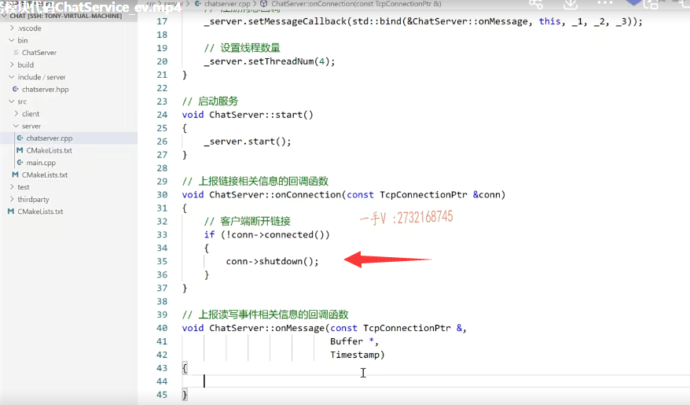

### 这个buffer缓冲区里边儿把这个数据拿到放到一个字符串

重要的是，在这儿，重要的是在这里啊，

在这里边儿呢，我们就收到一个消息啦，收到这个消息啦，各位。

这个收到消息后呢，我们首先可以啊，这个需要包含string这个头文件，因为我们要用到字符串了，

首先呢，我们之前给大家说了啊，这个用它的这个数据缓冲区。

它的这个retrieve alls string可以把这个muduo库或这个从网络上读取的数据，它是在一个缓冲区放着呢，

我们可以从这个buffer缓冲区里边儿把这个数据拿到放到一个字符串里边儿。

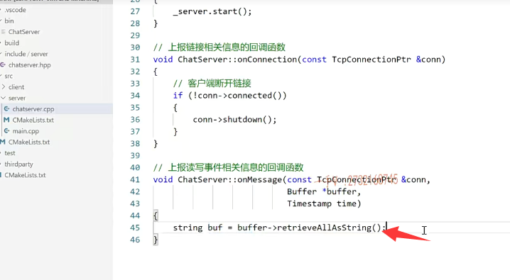

对吧啊，然后再干什么呢？OK，然后在这里边呢，我们包含啊谁呢？

json hpp这个头文件啊，我们包含这个文件，因为我们这里边要涉及呢。解析这个json了。

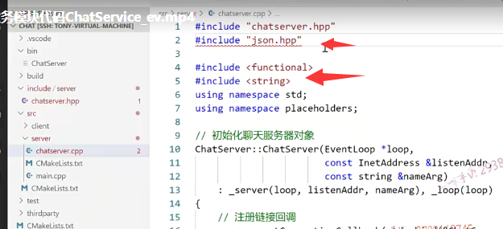

那也就是说呢，在这各位我们用的。这里边还缺少一句啊。缺少一句什么呢using进到这个文件里边啊，这个文件里边有个全局的名字空间呢。

就是这个，就是你要作者的名字啊。

这个json等于 相当于用了一个using等给给这个呢，起了一个更短的一个名称json啊，

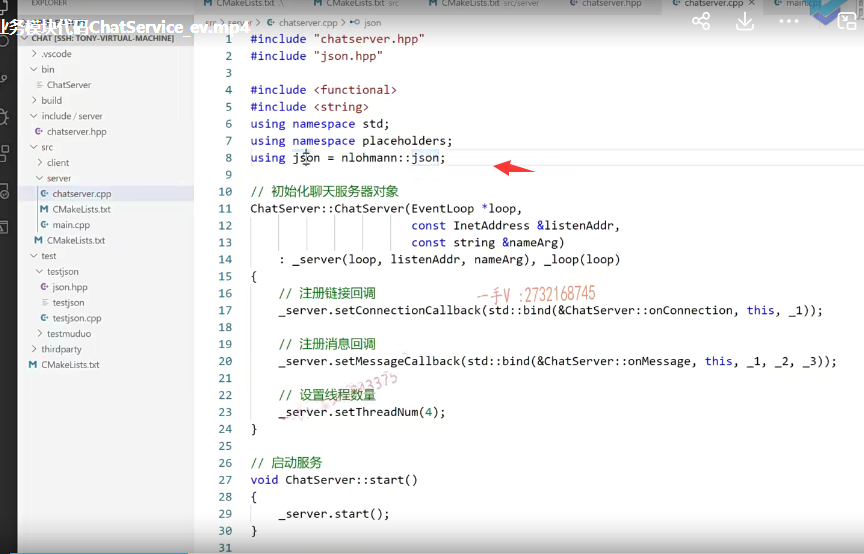

### 数据的反序列化 相当于是在说一个数据的解码

那么在这儿呢，相当于是做什么？json-s=json底下有个parse啊。

就是它从这个字符串里边。这里边是在做什么事情啊？各位数据的反序列化，相当于是在说一个数据的解码啊，

因为这比较简单，我们也不用专门封装一个解码类了好吧啊。

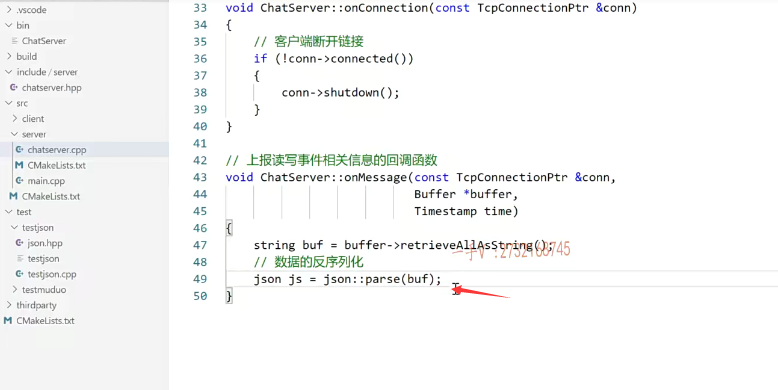

### message type message ID

json然后呢？这个json里边肯定会包含一个message type的，

或者说是message ID。

啊，因为我们客户端跟服务器通信收发消息，你这个消息是属于什么业务的消息对吧？都有一个业务的标识，有一个message ID。

### 不想网络模块儿的代码跟业务模块儿代码是不是给它强偶合

那我们在这里边儿，不想在这里边儿写什么if else或者switch case，当你是登录业务的话，我就调用相应的这个服务的登录方法，

你是这个注册业务的话，我就调用你这个服务的这个注册的方法，

我觉得这样不好，这样的话呢，就把我们的网络模块儿的代码跟业务模块儿代码是不是给它强偶合到一块儿了？

因为这块儿你就会直接去调用什么服务。成了这个方法，

是不是觉得这个是不好的，并没有解偶在这儿呢？

### 只解析到你的message ID  给它绑定一个回调操作

我们希望做这样的一件事情啊。对不对？

通过js里边读出来的，比如说这个叫做message ID吧。或者我们不加下横杠，叫message ID，我们每一个消息都有一个message ID，

我们能不能事先给它绑定一个回调操作？就是一个ID对应一个操作，

一个ID对应一个操作。对了吧啊，

然后呢？当我这个网络模块啊，我不管你是具体 你会做什么业务，

我只解析到你的什么东西啊？我只解析到你的message ID。

### 目的就是完全解偶 

我就可以通过呢，你的message ID来获取一个，比如说处理器handler。获取一个业务处理器，看到了。

对吧，你这个处理器就是你事先绑定的一个方法，

这个方法在我网络模块儿是根本看不着的，

你是在业务模块儿呢，自己绑定好的啊，大家先听我的这么一个描述，一会儿我们在代码上给大家去表述一下啊。

### 就是所有的业务模块我都会给你传，我这三个参数（onmessage）

然后呢？我在调用你这个handler回调你的时候呢？

我可以把我接收到的数据，比如说这里边的connection。

connection对吧啊？比如说这里边的这个解析出来的，这个json对象，

甚至呢，我可以把这个你需要的话，我可以把这个time呢传给你，

就是所有的业务模块我都会给你传，我这三个参数的。

这样一来呢，就是在这里边儿，我们的目的是什么啊？

各位在这儿，我们的所要达到的目的就是完全解偶啊，

### 在oop上啊，这么一个回调的思想

==这个网络模块的代码和业务模块儿的代码不要在这里边儿直接指名道姓的调用业务模块儿的这个相关的方法。==

好吧啊，我们应该去利用呢，在oop上啊，这么一个回调的思想啊，这么一个回调的思想来做这件事情。

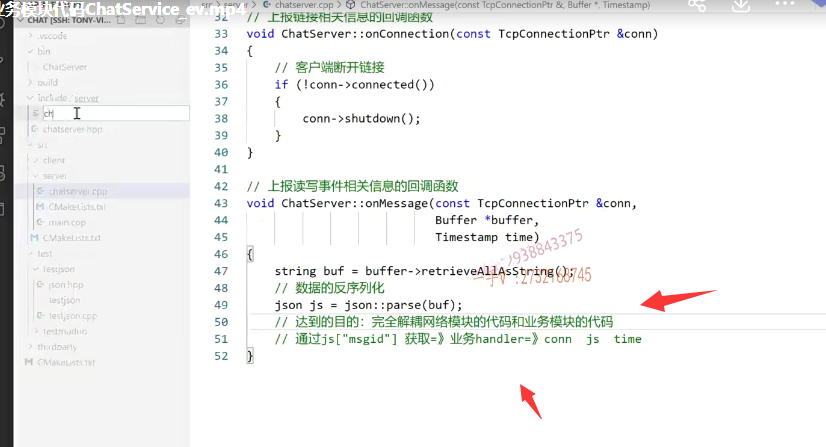

## 要解偶模块之间的这个关系啊，一般有两种方法

那么，在oop语言里边，要解偶模块之间的这个关系啊，一般有两种方法，

一种就是使用基于面向接口的编程啊，在C++里边没有所谓的接口。

==实际上，在C++里边接口就是抽象类嘛，抽象基类啊，面向抽象基类的编程，或者就是基于这个回调操作啊，就回调函数来做到这一点。==

### 单例模式呢来设计一下这个聊天的这个服务类

OK，那么大家来跟我看一下啊，在这里边，我在头文件这里边啊。在头文件这里边儿，然后我首先输出了一个什么东西啊new file。它叫做chat service点hpp。

那么，大家注意一下啊，service是服务server是服务器啊。不要搞混了好吧，

这个名字我们起的稍微有点像了啊。

if no de fine chat service h，再define放置头文件被重复包含。这是在头文件里边写的啊。

然后呢？这儿我们就写什么啊？什么service？

好的吧啊，这儿主要是做业务没问题吧啊，这儿主要是做业务，我们重要的是提供跟业务相关的代码。

==至于这个对象本身呢，有一个实例还是多个实例呢，实际上有一个实例就够了啊，有一个实例就够了，==

==所以我们采用一个单例模式呢来设计一下这个聊天的这个服务类啊。==啊，

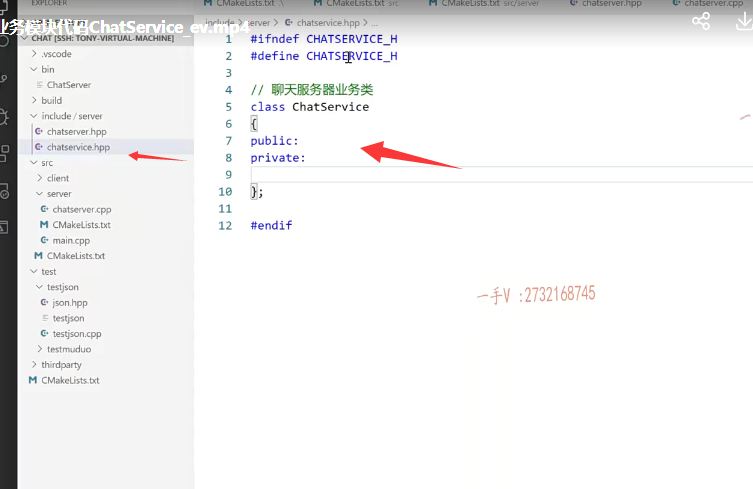

# 聊天服务器业务类

但这个这是聊天服务器业务类啊，也就是服务类。

### 一个消息ID映射一个事件处理

好吧，首先呢，在这里边儿注意啊，我们在这里边儿做的一件事情呢，

是干嘛呢？

来给这个message ID映射一个事件回调啊？诶，映射一个事件回调

各位在这呢，大家注意一下啊，注意一下。

==首先呢，在这儿我要用到一个map，因为已经说的很明显了嘛，一个消息ID映射一个事件处理，一个消息ID映射一个事件处理，==

大家先跟跟着我的思路来走。啊，有同学可能没有反应过来，

那是因为呢，还没有看到全局的这个代码。这里边呢？

### 定义一个这个事件处理器 using 

那么，还得需要包含一个function啊，还得需要一个包含一个function在这里边呢，我需要用using呢来定一个这个handler。啊，定义一个这个事件处理器啊。

这个message handler吧好吧啊，message handler message handler就相当于type define我们用了C++11的一个新语法，

用using来给一个已经存在的这个类型。定义新的这个类型名称好吧？

这就相当于就是消息ID绑定的这个事件啊，返回值没有不需要返回值是吧？

参数有没有参数当然有了，

在这里边儿就是TCP。这个什么东西呢？这个需要包含我们。muduo库相应的什么呀？是不是头文件啊？muduo net TCP。connection.那就够了啊。嗯。好，

那么在这里边就是TCP。哦，在这里边还得需要什么呀？using name。me space muduo.net.是不是啊？还有一个muduo啊。你也可以不用事先写，先不写出错的时候再写也可以啊。TCP connection ptr.

OK吧啊，就是呢，对应的这个事件处理函数呢，我有三个参数不是说了吗？

在这儿呢，我这可以给你派发三个东西。connection还有一个json对象，还有一个time。

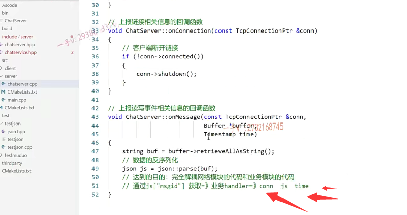

啊，大家呢？先来跟我把这儿看完好吧？这个事件回调这里边在线下的课程以及我课堂的C++高级课程里边儿都有给大家讲到啊，

这里边儿呢，因为我们这个主题是写项目的啊，要在这儿呢，又给大家开始讲开知识了。

那么，第二个参数是什么参数啊？第二个参数是json对吧？

那么在这儿呢，我们又得包含谁啦？包含刚才就是包含这两个啊，包含这两个中间这块就不需要了。

实际上呢，这个还是需要的啊。因为我们一会儿需要呢。需要的时候再加吧，各位啊。

第二个就是一个json的，是不是对象啊？

没问题吧？第三个啊。你这个想要可以接收就是这个，因为人家这个网络模块儿可以给你这个temp是不是啊？你可以接受你不想要的话也就不写了啊。temp

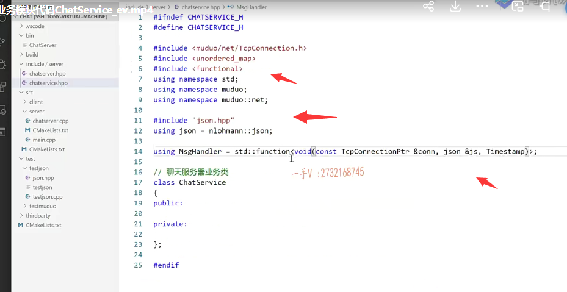

然后在这里边呢okay，就是这样的一个类型。

啊，可以找到这就是我们消息ID对应的这个事件的回调，

那我们先写个简单的吧啊，先写个简单的吧。

这里边的这个什么东西呢啊？呃，先写一个login。对不对啊？先写一个login方法。跟一个注册方法。

这是两个业务方法好吧。

这个是处理登录业务？这个是处理注册业务？好吧，

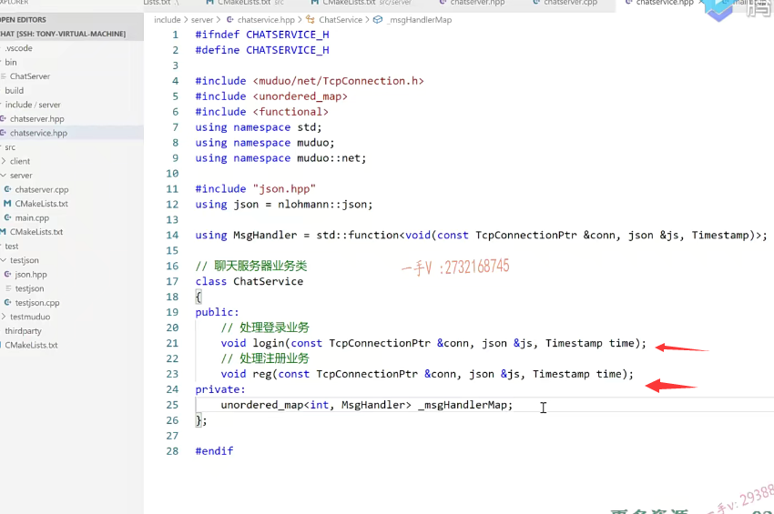

### unorder的map

那么在这呢，你看一下unorder的map键就是一个整形。

这个消息从哪来呢？好吧啊，消息呢？我们后边再进行一个定义好不好啊？

消息我们定义成这个整形嘛呃，定义成枚举就可以了啊，

那么接下来的这个message handler呢？诶，这就是呢map表的这个值的类型。

好吧，我们把这个定义成message.handler map就是消息的这个处理消息处理器的一个表，

因为我们要给它里边写呢。是不是啊？写什么东西呢？

写消息ID对应的处理操作消息ID对应的处理操作。没问题吧啊。

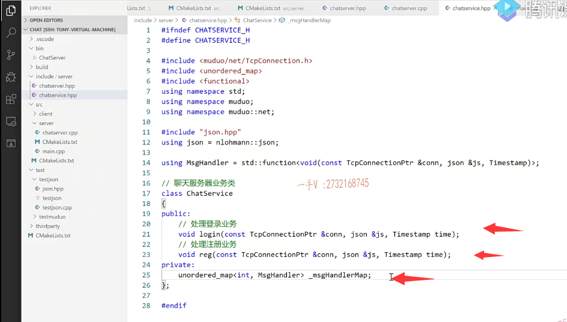

## 用单例来设计

呃，既然这里边要用单例来设计，

### 构造函数私有化  获取单例对象的接口函数

那就是首先要干什么？

==要在这把构造函数私有化好吧啊，构造函数私有化，==

然后要再写一个唯一的一个实例是不是啊？唯一的一个实例，

然后呢？再暴露一个什么接口啊？

==再暴露一个static chat service的指针instance方法。==

==好吧啊。这个是获取单例对象的接口函数。==

这个是存储消息ID和其对应的和其对应的事件处理方法。

就是业务处理方法。

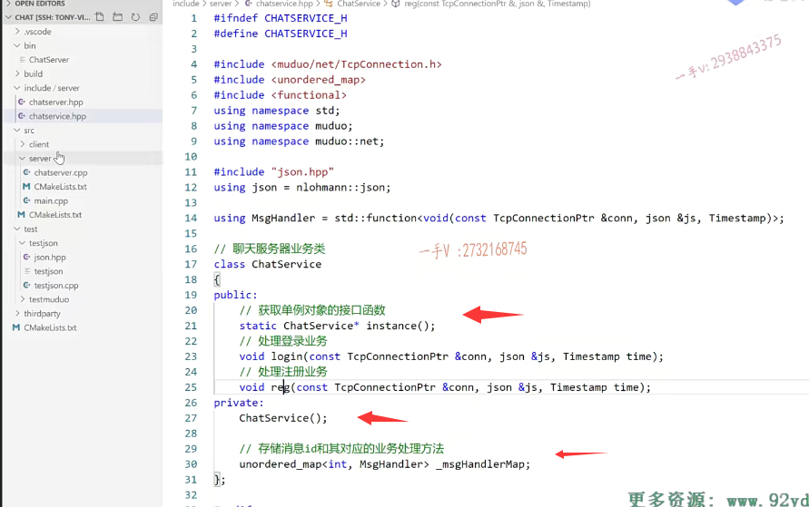

### message也先定义 消息类型

在这儿呢，为了让大家好想我在这儿把message也先定义一下好吧啊嗯，

在这里边儿我们就给这个头文件啊include这里边儿呢，

我们来定义一个new file。

它是一个叫什么呀？public吧点hPp，这这是一个公共的文件。

if no define public.这个h。define.d fine.然后呢？是end if？

这是属于呢？server和client这个的公共文件啊。

那首先呢，这里边就有定义的，比如说message type。对的吧，

有什么message呢？我们现在写了两个，一个是login嘛啊。

login message，它默认就是零吧，是不是啊？

然后呢？还有什么呀？reg message。这个没有什么大的问题吧啊。

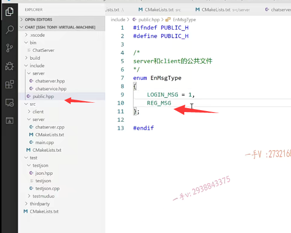

### 把这个相应的这个message ID跟这个方法绑定

我们现在要做的事情就是什么事情呢啊，

我们现在做的事情呢，咱从这个一开始吧啊，

咱现在要做的事情就是把这个相应的这个message ID啊，比如说这个log message就把它跟谁给它绑定起来呀。

跟这个方法绑定起来。

当收到这个log message的时候啊，它就能够自动的调到这个函数。

当收到一个reg message的时候，它就可以给我自动的去调用到这个函数。

好不好啊？这个是登录消息，这个是什么消息啊？注册消息好了，

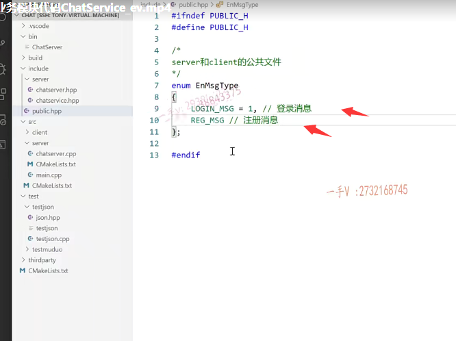

那我们接着呢，开始写这个chat service对应的这个方法的实现了，对吧？

主要做的就是把消息的ID以及对应的这个绑定啊，写到这个map表里边。

那这个该怎么写？是不是啊？这相当于就是一个map表的添加嘛？

这个在构造函数里边儿添加一下就可以了，对不对啊？

再实现一下这个in方法，大家能不能想着先去写一下啊？

我们把这个实现呢放在下一节课再给大家进行一个详细的说明。