# chat service业务模块

这节课呢，我们给大家说一下这个chat service就是业务模块的，

这个相应的源文件的实现啊，

然后呢，我们在server这里边呢，我们创建一个new file对吧，

这个叫做chat service不是server啊点cpp。

==好了，因为我们之前cmake里边儿写的是点儿，也就是这个目录下的所有源文件都自动加入cmake编译环境当中，对吧？==

所以我们创建源文件就行了，我们根本不用担心它是否能够编译正确。

肯定是没有问题的啊，包含呢chat service别包含错了，是service服务啊。

### 单例 获取 接口

然后呢？大家来看，这里边的一个实现，

首先是这个方法。在chat service里边啊。静态方法在类外写的时候呢，就不用再怎么样啊，不用再写这个static了啊。

这儿写一个static chat service一个单例对象啊，而且它是一个线程安全的好吧。

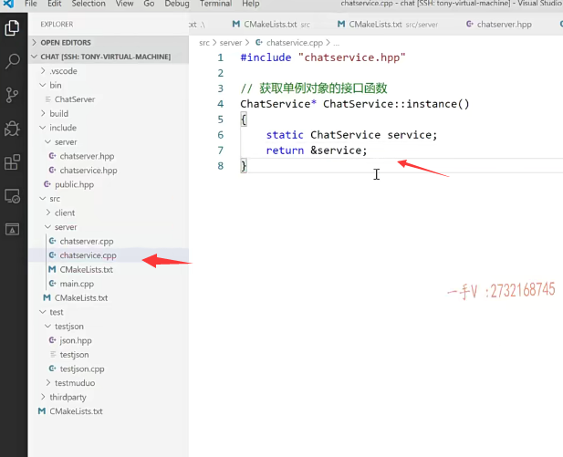

### 构造方法

然后呢？在这里边，我们在写谁呢？

在写这个构造方法。这个构造方法，我们做的事情啊。就要注意啦。注意了啊。

注册消息以及对应的回调操作啊，对应的回调就是那个handler回调操作。

构造函数嘛，对成员变量是不是进行初始化呀？

它的成员变量是什么东西？它的成员变量就是这个嘛？是不是

它的方法是什么呢？它的方法就是这里边写的。好不好啊？

那么我把这两个方法呢，先在这里边定义一下吧啊，虽然呢，我们还不打算去。实现它们。因为还没到时机。

这是实现了login的业务啊。

这个是实现什么业务啊？注册的业务对不对啊？在这儿呢。

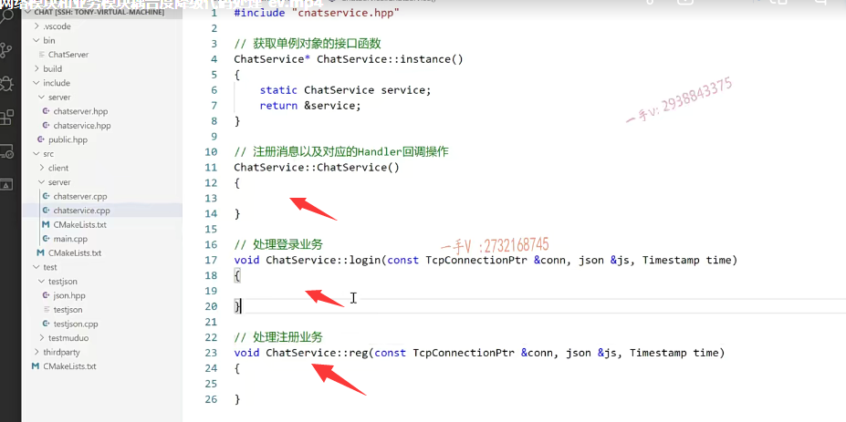

怎么写呢？各位啊，在这里边就是message handler insert什么东西啊？

它的键是什么类型啊？它的键呢，是消息ID 

那么，在这儿注意一下。那也就是说在这儿呢，我们要写的login.login什么呀？啊，

因为没有包含谁呀？公共的头文件pub public点htp好吧。

那么，在这里边就是谁呢？login message.对应的谁？对应的是我chat service里边的方法对不对？

哎，当然，这一边儿需要什么东西啊？需要我们的绑定器了啊？

它当然需要对象了，给它绑定这一次嘛，它需要几个参数，三个参数呢，

我们就得写三个参数占位符嘛。

好吧，就是这个意思的。

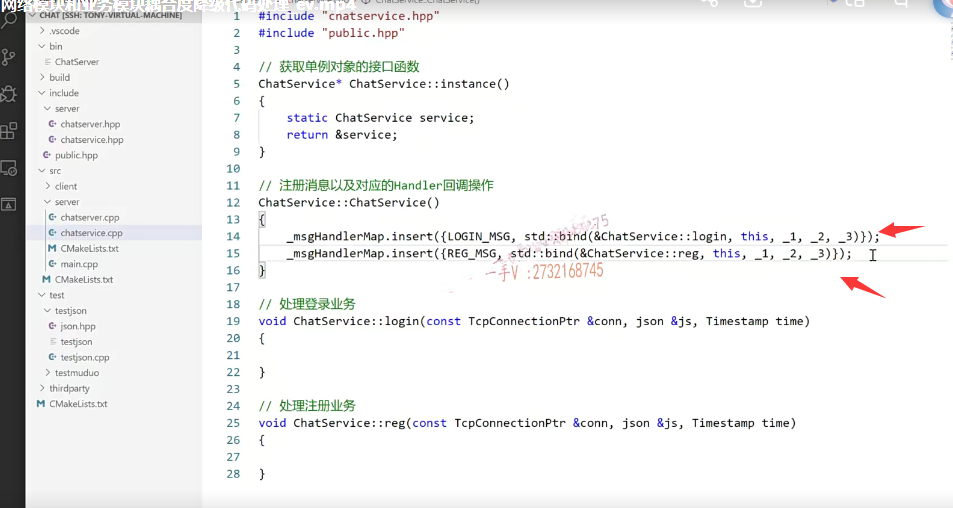

### 想把网络模块跟业务模块进行解偶 这么一个核心

后边儿我们肯定添加新的业务，

就要添加新的消息ID以及对应的是不是事件回调啊？

这个是注册对应的是哪个消息啊？就是reg message。

这块大家能不能明白？

诶，这块就是我们业务这块设计的核心，也是我们想把网络模块跟业务模块进行解偶的啊，这么一个核心。

好吧啊，这块儿呢，一定要有一个好的理解啊，

### 绑定器跟回调

对于绑定器跟回调，这是你在做oop操作的时候非常重要的一个环节。

好吧，不仅仅是C++这个oop语言，里边儿有这样的概念思想，其他的oop语言包括JAVA，包括python都有这样的概念思想。

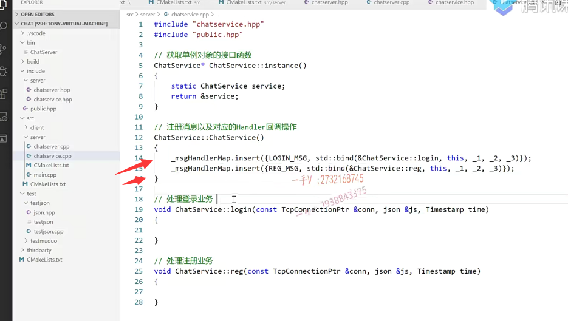

好，那么在这里边，我们看还有什么没有实现的吗？

构造函数也实现了，instance这两个方法，我们也现在大括号也都加上了啊，

这个呢，也给它里边儿是不是进行一个注册了？

### 处理消息的事件回调方法类型

这个也注释一下，这个表示什么类型呢？

这表示啊，处理消息的事件回调方法类型。

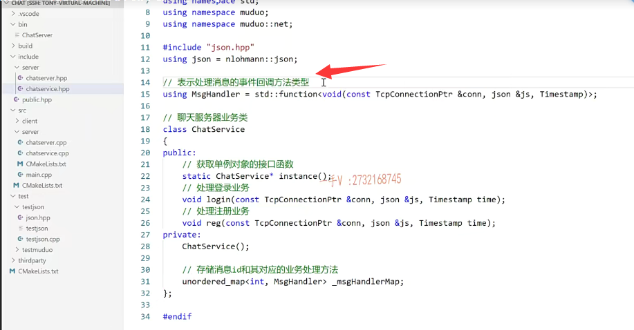

### 这件事情什么时候发生以及发生了以后做什么事情，这两件这两个步骤啊，没在一块儿发生

好吧啊，在这呢，注意一下啊。也就是说这里边儿我只管做登录的操作，

这儿我只管做这个注册的操作，至于什么时候做，我不知道，那得靠人家网络模块儿是不是给我来调啊？

==所以这也就是我们之前说的啊，这件事情什么时候发生以及发生了以后做什么事情，这两件这两个步骤啊，没在一块儿发生。==

==对吧啊，我现在就已经知道，如果有人登录，我做该做什么事情，但什么时候发生了这件事，我不知道。==

==那得通过网络模块儿接收到远端的请求，我发现是登录业务，我是不是才会给你进行一个回调啊？==

==那你要回调，你就要事先注册在这里边儿，我们就注册到这里边了。==

## 获取消息对应的一个处理器

然后呢，在这儿很简单啊，

我们在这儿呢，在实现这么一个方法，各位。

这个是获取消息对应的处理器啊，获取消息对应的一个处理器啊，

这个怎么封装一个方法呢？

大家来想想，那么在这里边，我们给它封装一个方法就是这样的一个方法啊。

就是get handler啊，这个handler呢，这个就是message ID。

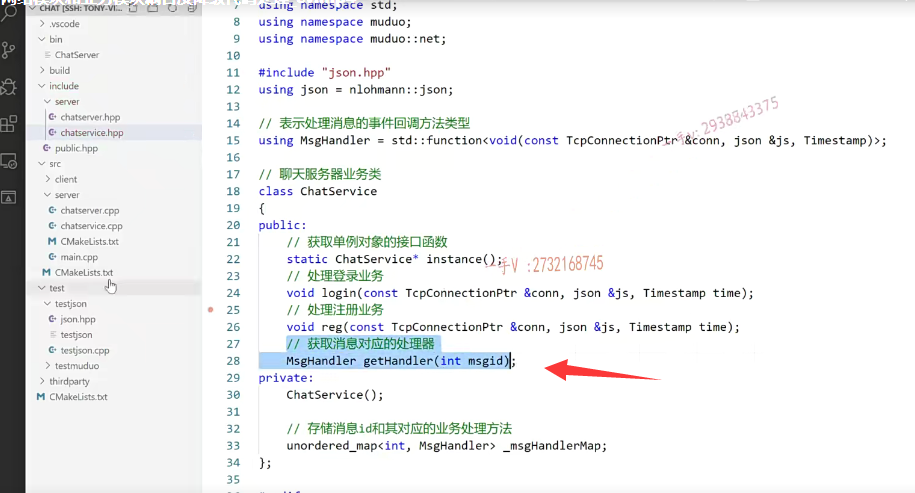

那么，把这个方法的实现写在其对应的这个源文件当中。

这个很简单吧。在这就是return谁？

return啊，这里边的map中括号message ID 没有问题吧啊，

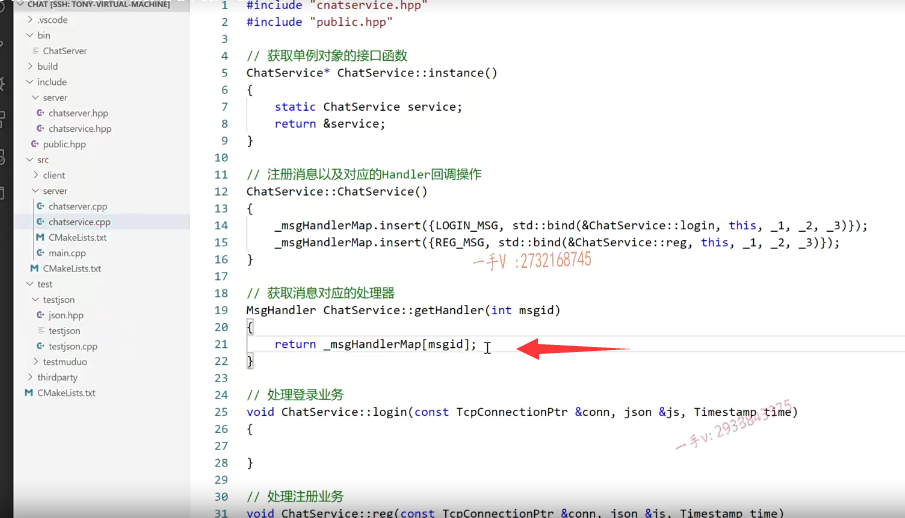

### 做一个记录这个错误日志

在这呢，我们还可以做一个记录这个错误日志。

就是message ID没有对应的这个事件处理回调啊，

那也就是说呢，在这儿各位来看看auto at等于什么呀？到message handler map点find谁message ID，==不要用中括号来查询，==

==如果他万一不在中括号，会引起一个什么？副作用呢，就是会先添加一对儿，对吧？==

这个我们在给大家讲这个map的时候说过了啊，

如果这个it等于呢message hundred map的end的话，

这个表示是不是就是没找到啊？

没找到的话呢，我们在这儿做一个日志的打印呢，

我们就用muduo库的这个日志就行了，

大家在这儿呢，就不要用cout进行一个打印了好吧啊。

muduo库的打印呢，打印的这个消息呢，非常的这个详细啊，哪个文件的哪一行都会给你打印的，非常详细。

在这呢。就是我们只需要包含它相应的这个muduo应该是MOTO base吧，

然后是login。嗯，大家来看一看啊。就是这个。

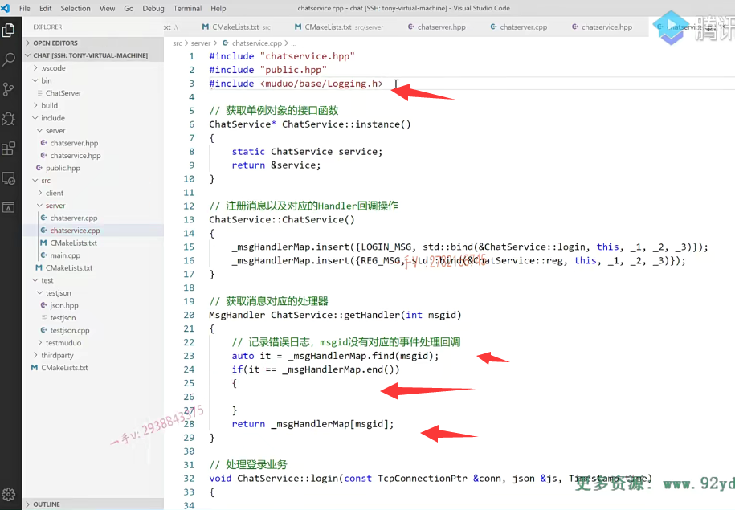

### muduo里边有这个封装好的日志

这里边有muduo啊，muduo里边有这个封装好的这些定义好的这些东西啊。

我们写个using namespace STD不是STD是muduo啊，不想写名字，空间作用域了。

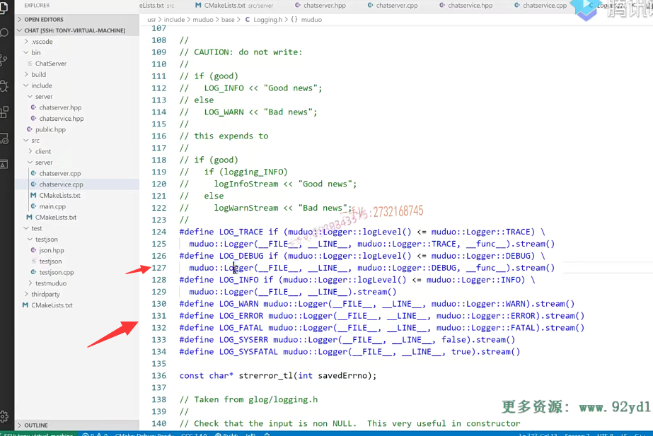

### 用muduo库的日志的时候，不要在后边输出endl

在这我就写一个log什么呀？

在这写一个log error吧。这是错误消息，是不是啊？

这是错误消息info是一些提示消息，这是错误类消息啊。

==注意用muduo库的日志的时候，不要在后边输出endl，人家会自动输出的啊，人家可没有提供输出运算符，重载endl好吧？==

#### 

那么，在这表示什么意思呢？表示呢？message ID啊，这个message ID。

我们写一下啊message ID谁呢？是这个cannot find是不是handler啊。

注意一下啊，这是看到的，find这个handler。就是找不着什么，找不着相应的是不是一个处理器呀啊，我们在这里边儿给它去记录了一下。

好吧呃，记录了一下。

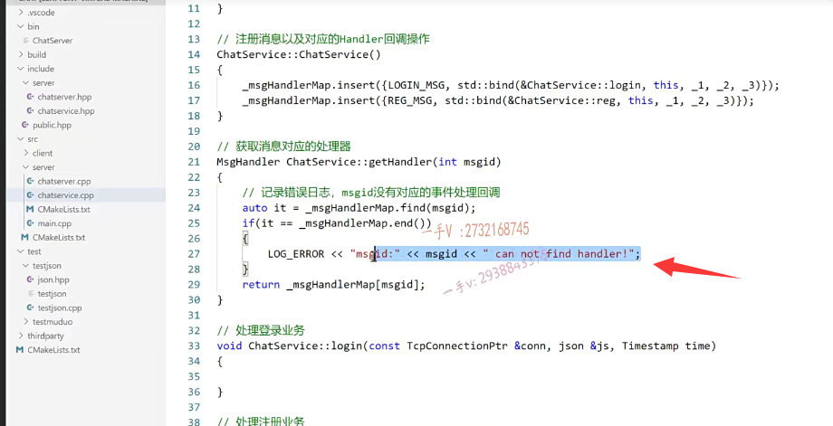

那在这儿，我们可以这个提供一个默认的是不是一个处理器啊？

啊，那就相当于就什么也不做，是不是啊？什么也不做。

在这儿呃好了，那这里边呢？如果成功的话else。如果成功的话。它就是return这个。这个能够理解吧。

大家来看啊。就是找着了，那这个message ID确实存在，是不是返回这个处理器呀啊？返回存在的处理器。

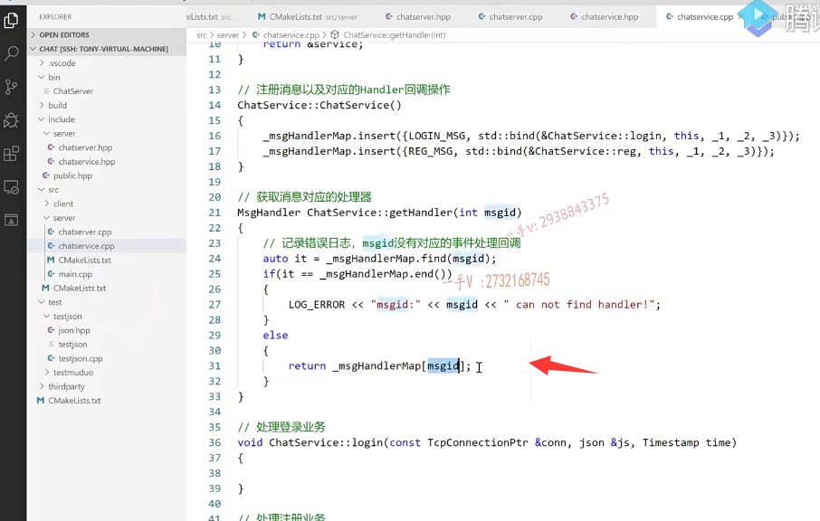

OK吧啊，这里边儿我们没有的处理器没有找着相应的处理器，

你也你如果是throw的话呢？是不是会直接把我们的当前的这个进程给这个处理掉了是吧啊？

那既然是这样的话呢，我们把这个异常也处理一下吧，各位啊，

在这儿呢，我们就不写这个了啊。我们抛一个异常吧。

写一个string啊。写一个using names，spaces TD我们写的时候呢？

啊，我们说这里边儿有可能抛出异常的，就是等于什么呀？

呃，air strain t等于这个message ID，这个加上什么message？加上这个message ID啊。然后呢？

这是什么样子的呢？再加上这个。就是我们把字符串连接一下啊，字符串连接一下，

这个好像还是不能够这样去做，是不是啊？

呃，我看看啊。errstr.这个。点什么呀？点push back啊？

呃，我觉得我们这块儿还是不要这样设计吧。觉得这块设计这样设计不好啊。

==呃，这样的话呢，我们的这个网络模块儿必须得处理这个服务模块儿抛出的是不是这个异常啊？==

==啊，不处理这个异常，直接进程就被倒霉了啊。==

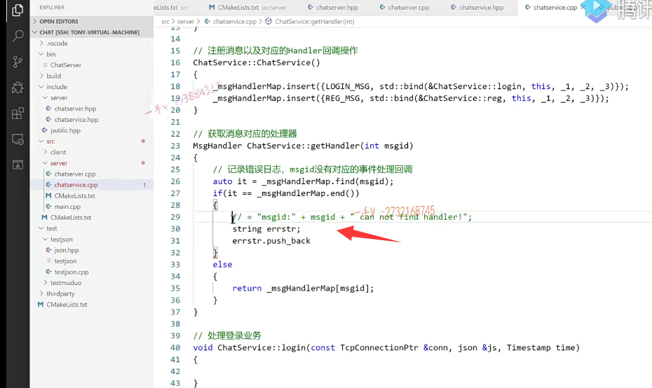

### 没找到返回默认处理器，处理器就是空操作

是这样吧，我们还是按刚才给大家说的思路啊，在这儿就是呢，这相当于message ID找不着嘛，

是不是返回一个默认的啊，处理器就是空操作了啊，就什么也不做了。

对吧啊，什么也不做呃，各位在这里边呢，我们就给它返回一个。什么东西来？这个默认的这个处理器在这儿呢，

这是一个message handler嘛？就是有一个返回以返回值是为的，有三个参数的。是不是有三个参数的啊？

那我们在这直接给它一个lambda表达式算了，好吧啊，

就是以中括号。三个参数。auto 对不对？

返回值有没有返回值？是不是也没有啊？

而在这呢？做什么操作，不，什么操作也不做啊？

在这儿反应不出来。它跟这块类型匹配不上，对吧？

我们直接把这个类型给它填到这儿吧。

==okay，这里边是个空操作对吧？==

空操作的话，我们进行个打印吧啊，需要获取这个lambda表达式外部的是不是这么一个message ID啊？

==那么写个等号啊，按值获取。==

### 给它返回一个空的啊，就是一个默认的处理器

在这里边就是log什么l啊，输出了输出谁？

输出就是刚才的这个message ID啊，这是谁呢？message ID。

can not find handler啊。就是这个样子的啊。

好，那这样我觉得是非常好的，是不是啊啊？

如果想获取一个事件处理器啊，传了一个消息ID，我发现这个消息ID在map表里边儿根本就没有预置过，是不是相应的业务处理器啊？

==那么在这儿呢，就给它返回一个空的啊，就是一个默认的处理器，==

### 直接打印相应的一些信息就行了

==直接打印相应的一些信息就行了，信息就是你这个message ID没有对应的，是不是处理器啊？==

OK这样设计，我觉得是非常好是吧啊，

==可以看日志也不会没有对应的处理器，也不会导致我程序是不是挂掉啊？==

### 业务还是能够继续正常运行

==嗯，还是业务还是能够继续正常运行的啊？==

我看到错误日志诶，我一看这个消息没有对应的处理器。

==哎，我给这个添加一下，然后对我服务器进行一个平滑升级处理。==

就OK了，就可以让它支持相应的这个message ID，支持相应的事件回调了，这样会比较好一点啊。

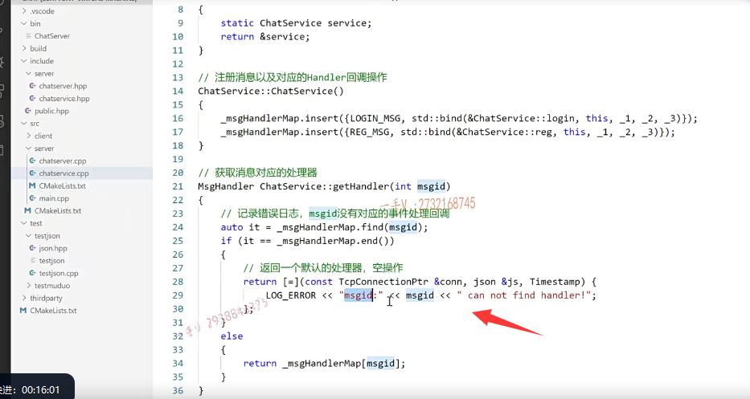

好，那在这儿就可以了，大家看看现在呢，

我们相当于把chat service这里边儿写完了。注意这块。

然后呢？我们写的时候啊，大家来看在这里边啊。

我该怎么写呢？我在这里边先包含呢谁的头文件啊，这也是肯定是会依赖server层的这个头文件的嘛。

因为我要派发这个服务呢，是不是？

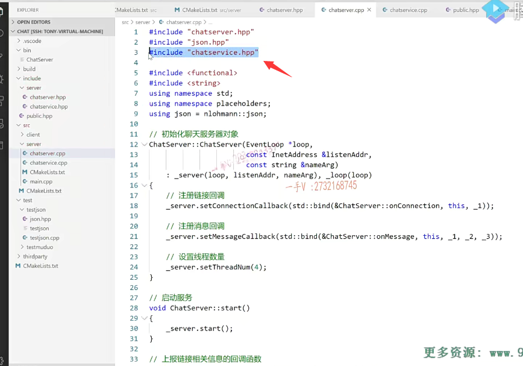

# 继续处理上报读写事件相关信息的回调函数

### 先得到了chat service 唯一的一个实例

好在这儿呢，我先得到了chat service，它的什么instance？

它的唯一的一个实例好吧，

### gethandler获取消息id

在get什么handler要传一个消息ID消息ID是什么呢？

### json的对象获取的这个键对应的值  并转成整数

各位消息ID就是这里边的message ID.

那当然，这是一个json的，是不是对象啊？

这是一个json的对象啊，获取的这个键对应的值，它也是用json里边的某一个类型来表示了我们在这需要的是一个什么？

我们在这儿需要的是一个整形啊，

==各位我们来看看啊，它有没有相应的这个方法，我们把它转成这个整形呢？==

嗯。没找着是吧？我们再看看啊。点看看是什么方法啊，‘我回忆一下。应该是这个get。让我来看看。那么应该是这里边的一个get方法。

应该是这里边的一个get方法。它有一个模板方法啊，模板的get方法，

### 用json表示的这个整形类型给它真真正正转换成一个整形

你可以就是因为这个呢，虽然打印出来是这个数字对吧，

但是实际上这里边类型还是用json里边类型来表示的。

我们现在要把相当于把这个用json表示的这个整形类型给它真真正正转换成一个整形，

在这里边用它的get方法就行了啊。

==实际上非常简单，就是我想把它转成什么类型，我用什么类型来实例化一下这个get方法就行了，==

==它就会呢，把它底层的就是这个键对应的值来强转成我这里边所指定的这个类型好吧啊呃，==

这个大家了，这个知道就可以了，这就是它的一个用法好不好？

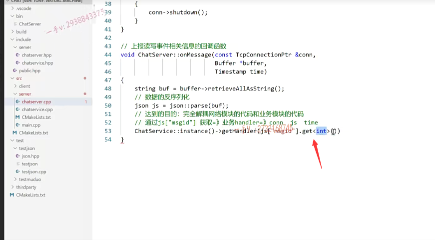

### 从网络上拿到了message ID 获取到了这个ID，相应的这个事件处理器

那么，这是我获取了服务的，是不是唯一实例呀？

然后呢，传了一个消息ID获取了这个消息ID对应的事件处理器？

我们刚才绑定了半天，是在绑定什么吗？

是不是  就是把这个消息ID对应的事件处理器给绑定了login message绑定的是login。

reg message绑定的是reg，

==所以现在在这里边诶，我们从网络上拿到了message ID。获取到了这个ID，相应的这个事件处理器啊？==

哎，获取到了以后，那你也可以不要写到。你不想写就别别写到一行里边啊autohandler。

等于是不是啊？我们写一个message handler，

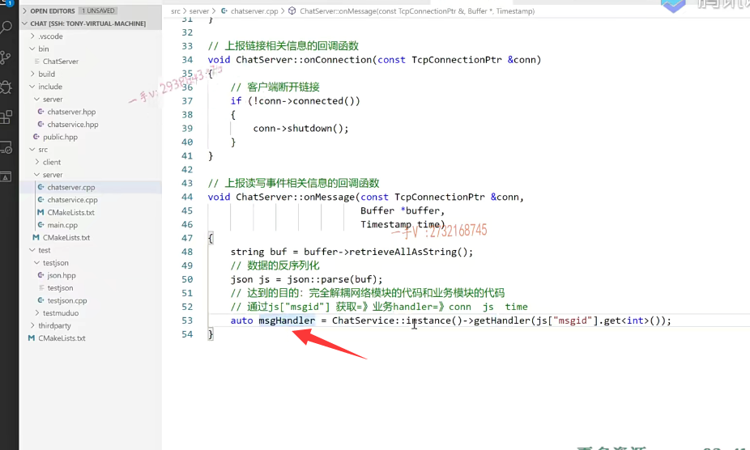

那然后呢？你去调用一下message handler就行了啊

传谁呢？传conn。再传谁json，再传谁temp。time

好吧诶，这里边儿你注意一下，这样一来呢，

网络模块儿就只有这两行代码。

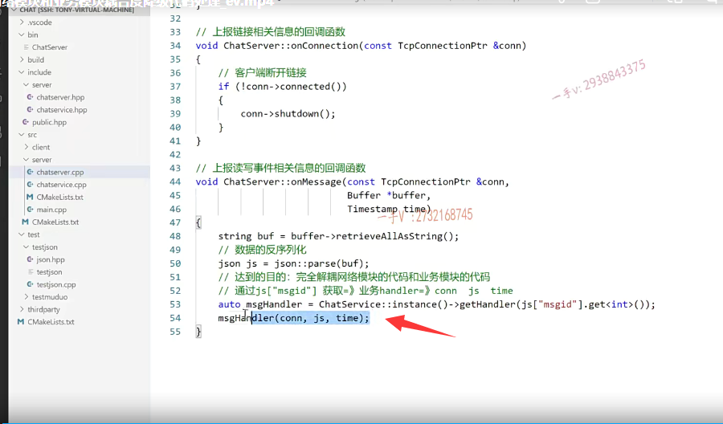

### 没有见到任何业务层的方法调用

在这块儿没有见到任何业务层的方法调用，

你见到任何业务层的方法调用了吗？我有没有调用过login？

我有没有调用过这个reg注册方法？

甚至我以后你觉得我在这儿需要去调用什么添加好友的方法？

一对一聊天儿的方法，群聊的方法嘛，

### 只需要在我服务层的内部把相应的消息及对应的事件回调

我需不需要添加，我根本就不需要添加在这儿呢，

我只需要在我服务层的内部把相应的消息及对应的事件回调，我做一个绑定啊。对不对哎？

人家的网络层代码就可以通过这个消息ID拿到相应的事件处理器，

然后在这里边儿进行一个回调。好不好？

这是回调。这个消息对应绑定好的事件处理器来执行相应的业务处理。

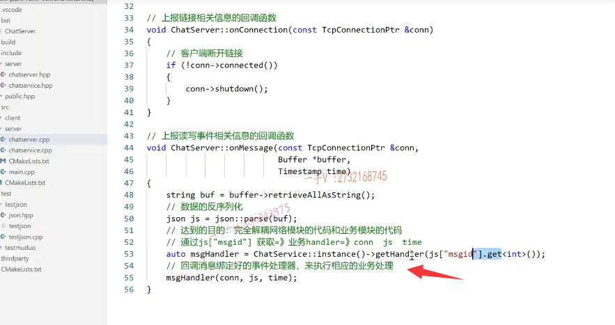

好吧，这就是我们可以说把这个网络模块儿跟业务模块儿的代码，

我们完全的给它拆分开了好吧，

业务再怎么改，我这块儿的代码不需要做改动。

好不好啊啊？

行，那这节课的主要内容呢？就说到这里啊。