这节课呢，我们就我们之前写的这个网络模块儿代码跟业务这块儿模块儿代码，

我们做了一个消息的ID以及事件回调的一个绑定，对吧？

我们想看一看这块儿的消息，派发通道啊，到底是否正常啊？

我们这节课主要做一个测试，

在这儿呢，我们打印一下吧。

这个login。呃。在这儿呢，大家看看啊，我虽然没有包含l stream，

但是有这个日志，是不是我就通过它的这个日志打印一下吧log info啊？

这个是。do login service.没问题吧，这个是读reg。service.

好的吧啊。

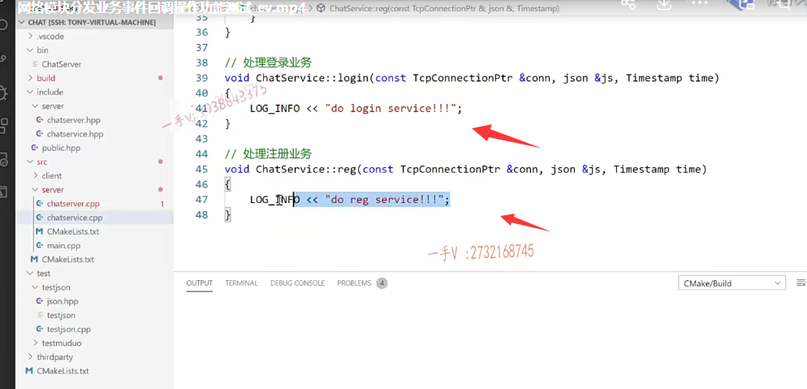

OK，你注意一下它的这个登录消息是一注册消息是二是不是

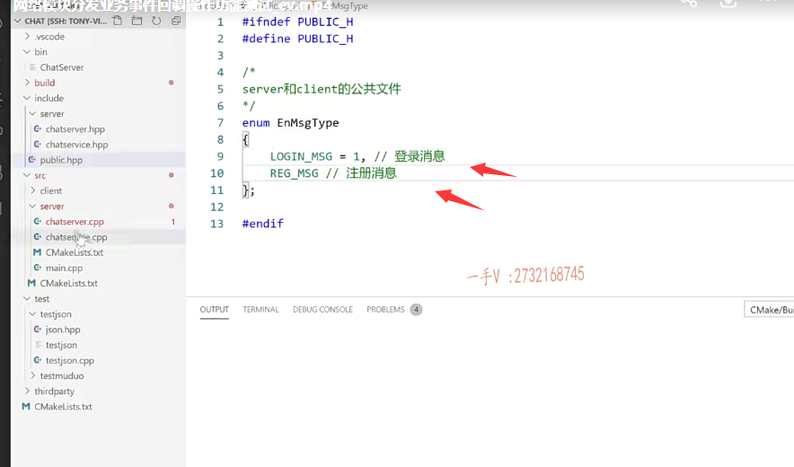

他们的这个字段名称是什么呀？message ID，这都是固定的啊，

这都是固定的好不好？

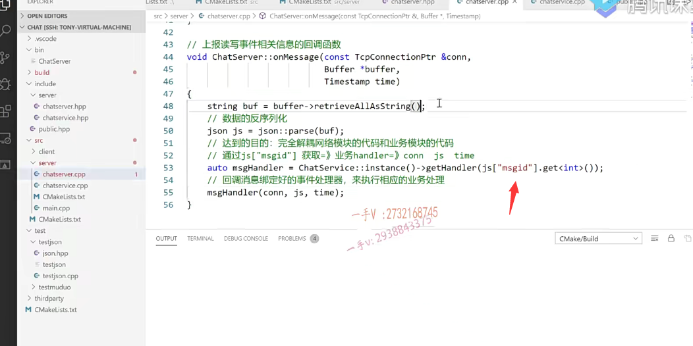

你要是觉得这些东西呢？啊，不太好，可以把它定义成什么东西呀啊，常量的一些名字啊，这都可以由你自己来选择啊。

# 编译解决错误

好，我们用makefile呢，整个启动一下makefile的编译哦，

有编译错误来看一看啊。

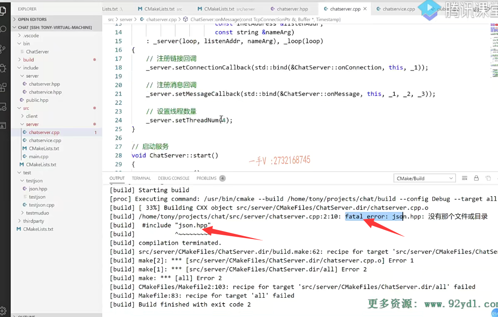

## 头文件找不到  由于没有在cmakelists中配置头文件的搜索路径

哦，chat server点cbp chat server点cbp的第二行有什么fatal error啊？

==哦，这个json点h没有那个目录文件或目录，这个就头文件找不着是吧？==

所以我们头文件在哪里放着呢？在这个third third party里边。

那在最初的这个cmake list里边儿哦，

==你看我们没有添加，是不是这个third party的这个文件的搜索路径啊？==

添加上来这个呢，问题不大啊，

==头文件找不着嘛，那就是没添加路径。==

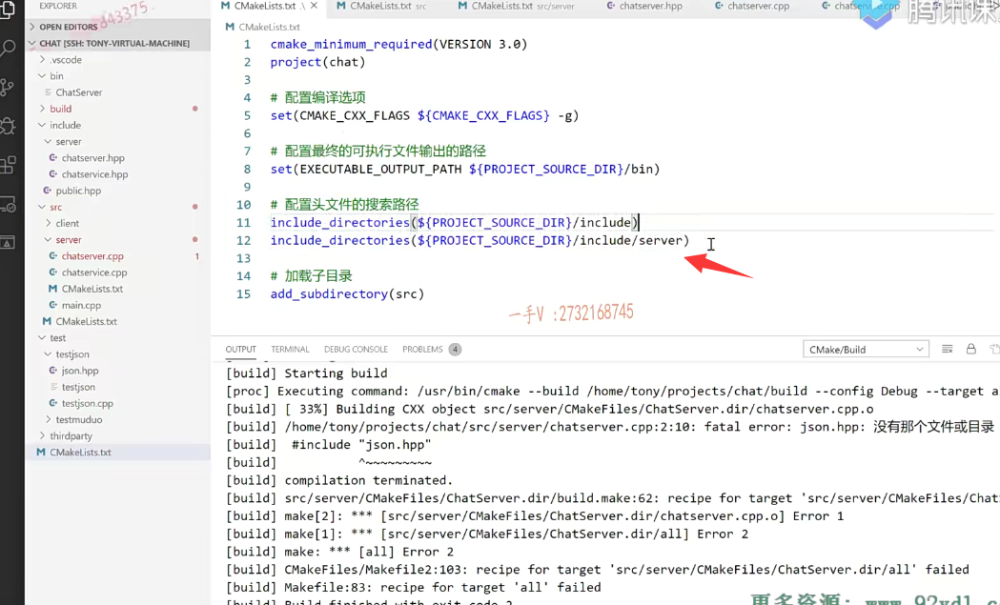

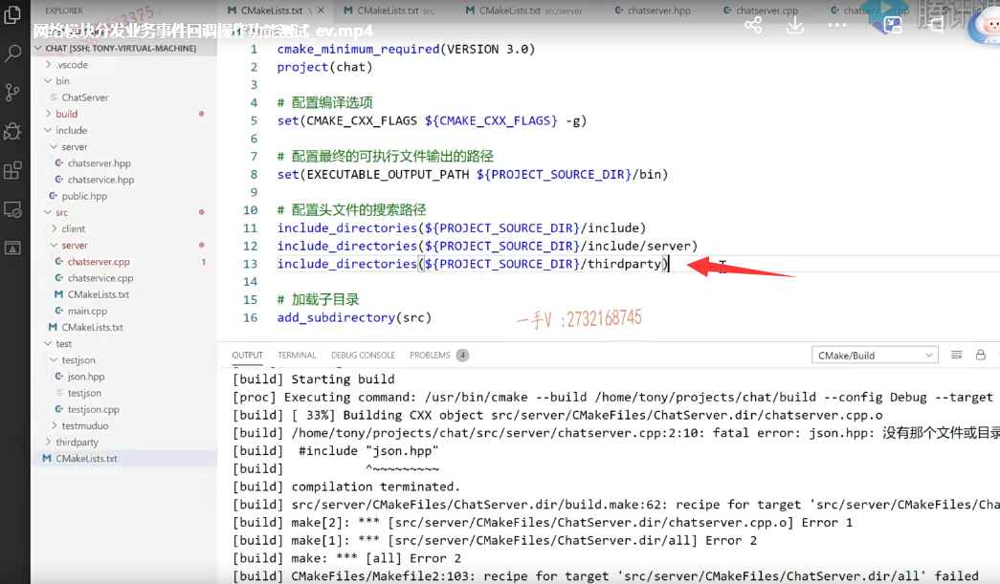

然后呢？这个就是ird third party.third，thirdprty确定啊，

你确定这个写好，

然后来重新去编译一下。okay，编译成功。

看到了吧啊，整个全部编译成功的编译成功的了，

### 执行chats ever

以后呢，这就是我的这个可执行文件了OK吧？

在这呢，我来看看。

退出我的home是不是？

然后是project，然后是chat啊。

然后在这里边的这个bin这就是了chats ever了啊。

我执行一下。

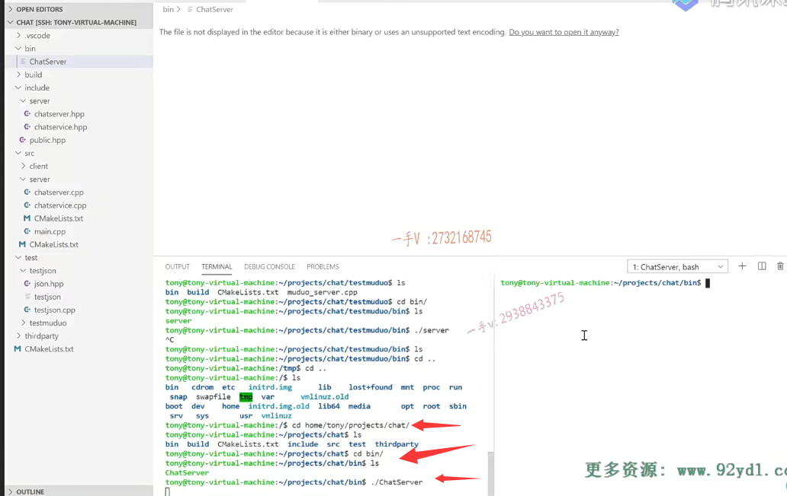

### telnet测试   发送json字符串 msgid 

执行了以后呢，

在这儿tel net1270点零点一是6000端口对吧？

我要给他发一个消息，这个消息就是json字符串啊，是一大括号，

我们得自己写这个叫message ID，然后是个几啊？1 是吧啊。

我们现在不带其它的消息好吧啊，现在不带其它的消息，

就带个message ID我们看看。

你看do login service派发到了吧？

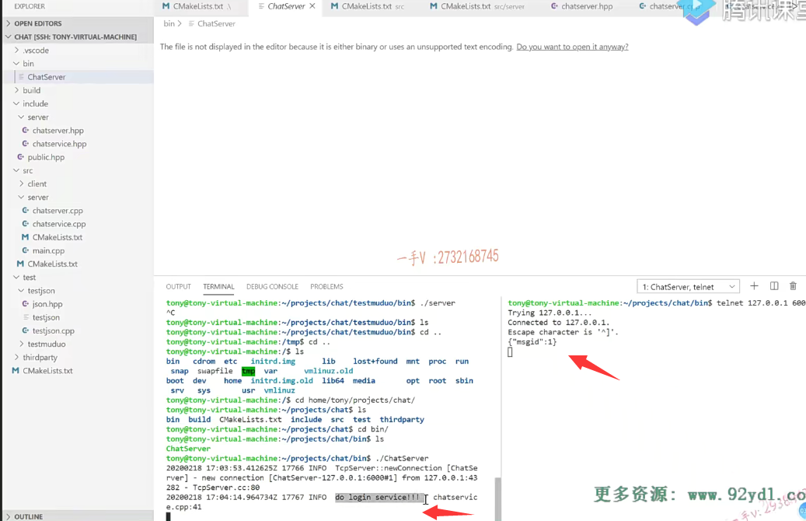

哎，派发到了我再来发一个message ID。a对是这个。

二对不对？做过reg service。

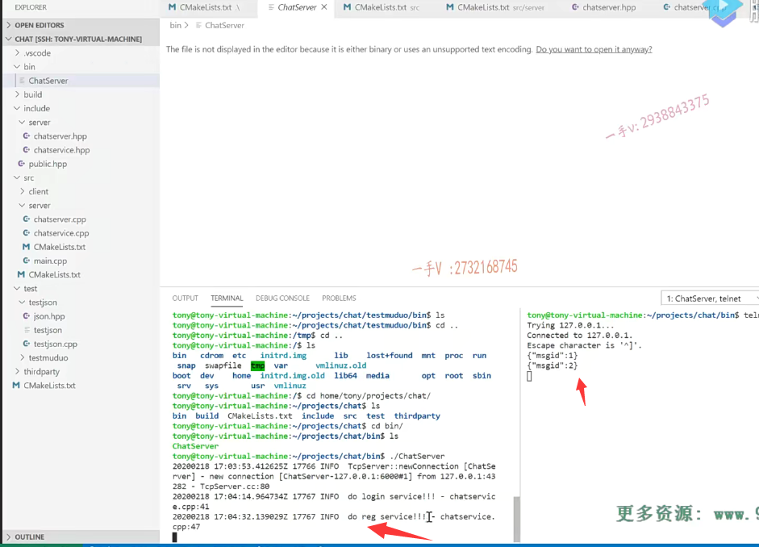

可以吧，那就说明了我们整个的网络模块啊，

通过呢解析消息ID派发相应的事件回调到这个业务模块儿是完全OK的。

事情进展的比较顺利啊，你可以高兴一下，

那在这儿你也测试一下啊，你也测试一下，

不要光拿着我的代码呢，在这里边儿去执行。

你跟着这个你学习项目就跟着这个一起做一做该标识的标识一下，该注释的注释一下啊。

那么在这里边呢，一定要了解我们刚才呢？嗯，在这里边儿所说的这些东西好不好啊？

### 测试如果消息id不存在

哎，如果这个消息ID不存在的话，我们怎么办呢？

来再测试一下这个message ID.对应的是消息是三号消息，

对吧？

啊，这块儿你看有一个error message 3 cannot find handler，

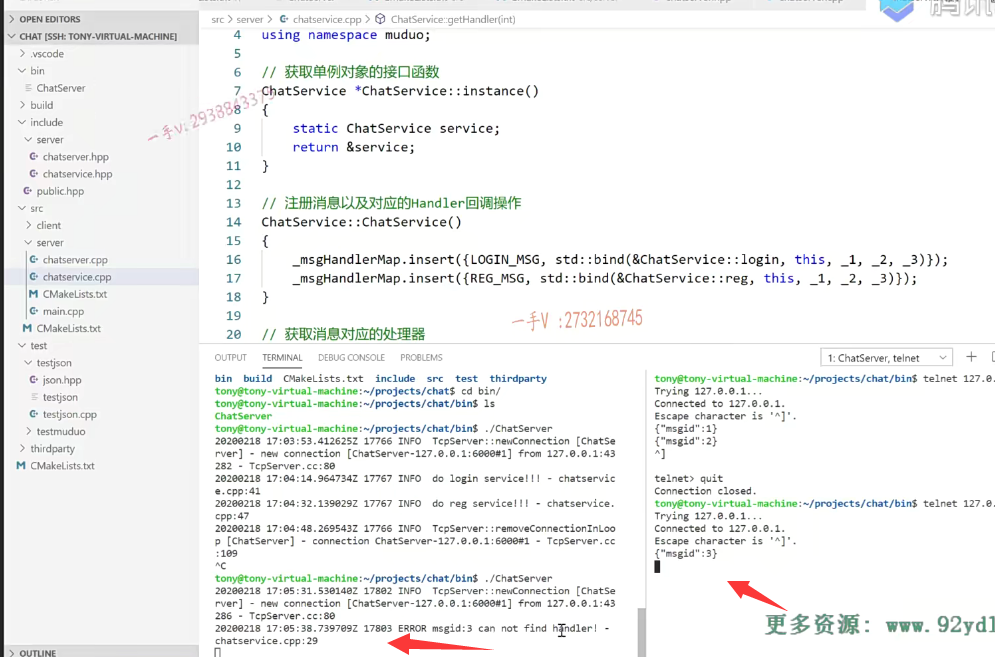

就是三号消息呢，找不着是不是相应的这个事件处理器啊？

没问题吧啊okay，一切都是按照我们预想来的。

很好，那么这块儿我们就测试完了啊，经过测试呢，这块儿的这个功能呢，是非常的稳定啊，

所以呢？呃，应该是从现在开始到后边我们只关注业务跟数据层的开发就行了，

网络模块我们就要说拜拜了啊。

因为这块儿呢，就完全的闭合了，跟我们业务模块儿跟数据模块儿没有任何的偶合程度了啊，

它已经开发完成了啊，已经完成了，我们再也不用去在这里边儿进行处理了，

### 客户端的一些异常断开  添加一个异常处理

可能后边儿要处理的话，可能就是客户端的一些异常断开就是并没有给我们发下线的消息，

而是直接客户端直接死掉了，挂掉了哦ctrl c直接终止掉了，对吧？

我们需要在这儿添加一个异常处理。

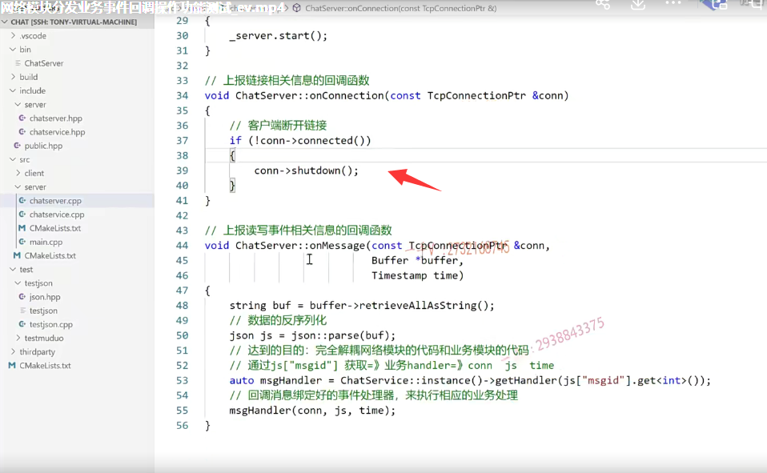

啊，其他的尤其是这个这一块儿消息派发这一块儿，我们不需要做任何处理。

好，那么大家也进行一个详细的测试，就像我们刚才做的这个测试一样好吧啊，

测试一下我们现有的功能。

代码的这个开发项目的开发都得一边编译一边去，测试功能不要留在整个的最后啊，那问题如果太多的话呢，你搞起来。

可能就比较头疼了。好，那这节课的主要内容就给大家说到这里。