==之前的课呢，我们把这个网络模块儿的代码跟服务这块儿的代码呢的这个流向都打通了啊。==

==然后呢，登录业务，注册业务，我们在这里边只需要关注我们具体的这个业务就可以了。好的吧啊，就可以了，==

那么在这里边大家来看看我们这节课呢，就主要把业务层再往下走啊，

数据层也就是数据库的这个操作啊，数据模块呢，我们给它搭建起来。

### 也是非常希望把业务层跟数据层的这个代码逻辑呢，完全给它区分开

首先，大家要搞清楚啊，我们在业务层的代码，千万不要直接去写数据库好吧，千万不要去操作数据库的这个相关操作，

那相当于就是我们之前把网络模块的代码和业务模块的代码通过这个事件回调呢，是不是给它完全的去拆分开了？

==当然，现在来到这个业务层啊，我们也是非常希望把业务层跟数据层的这个代码逻辑呢，完全给它区分开。好的吧啊，==

==不要让这个数据库的代码跟业务模块代码掺杂到一块儿啊，那样呢不太好啊，不太好。==

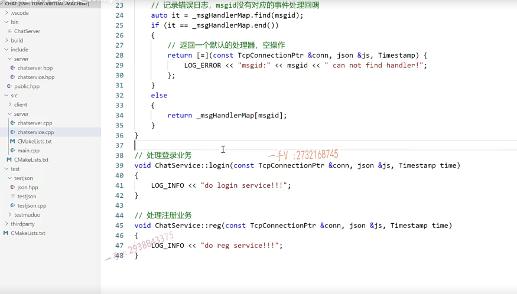

那么将来呢？我们数据存储的模块呢？

比如说我们不想在这个mysql上存储了啊，我们直接想存储到全部存储到red is上。

那么，业务模块的代码是不是要进行大量的改动啊？

## orm框架

所以呢，我们一般啊，你大家呢？有没有听过这orm框架呢？orm框架就是object relation。relation relation就是那个关系的意思啊

object relation map就是对象关系映射。

对象关系映射的这些框架，这些框架帮我们oop解决了什么痛点呢？

==就是我们在业务层啊，操作的都是对象。==

我们看不到具体的任何的sql语句的啊sql的操作对吧啊，

我们业务层操作都是对象。

那么，在数据层啊，比如说do层或者dao层啊，这是数据层我们一般简写。

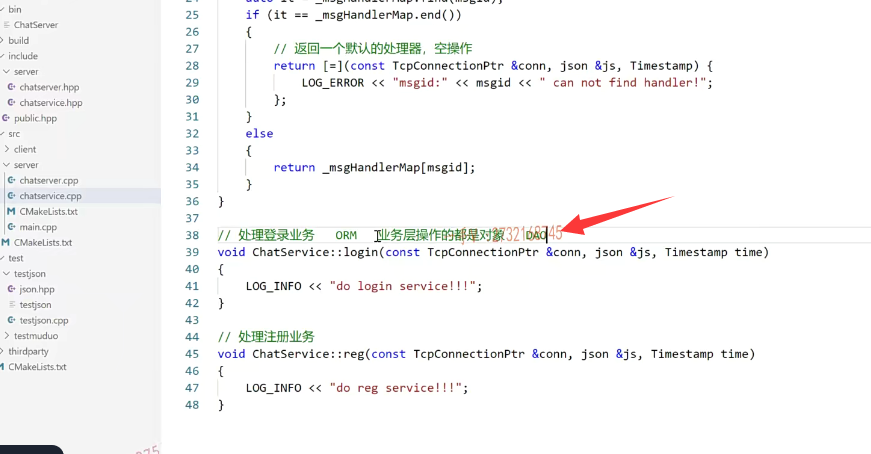

那么，在这一层呢？才是具体的有数据库的操作，

那么这样说可能对有些同学呢比较抽象，毕竟呢，你可能没有去做过相关的这个项目啊，

那么在这里边我就简单的给大家，这样一说就是我们有一个需求点，痛点什么痛点呢，

==就是我们依然是想把业务模块跟数据模块的这个代码给它拆分开。不要那么强关联。==

==也就是说白了，你不要在我业务代码里边，这里边出现数据库的增删改查。好吧==，

### 我看到的是直接操作这个对象 数据层封装了所有数据库相应的一个操作

你应该增加中间的一层，这个就像orm框架一样。对 吧，

这个框架里边儿输出了一些类，输出了一些代码，针对我业务层，

我看到的是直接操作这个对象啊。

那么，对于这个数据层的话呢？

那它封装了所有数据库相应的一个操作。好了吧，这是我们的目的啊。

## 数据库之前的这个安装

那么接着再来说一下数据库之前的这个安装啊，也都告诉大家了好吧，这是右班图系统下呢，就是这样去安装的，

如果你其他系统的话，你动动手装一下啊，这个应该是资料也是非常的多啊，资料也是非常的多。

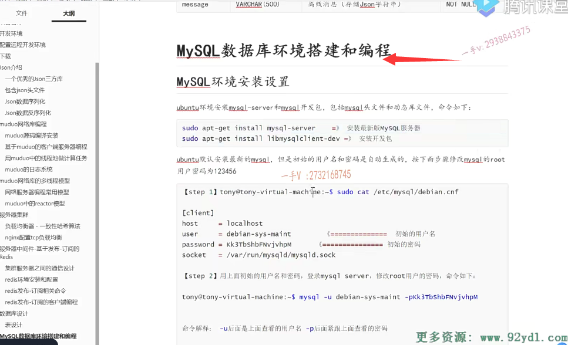

那么，在这里边儿呢？

呃，大家来看啊，我把数据库就是的操作封装成了这么一个类啊，

这底下呢，我还给大家做了一些演示，用的一些方法啊。操作了一下啊，封装了一下呃，

### 安装这个开发包 动态库

因为它提供的对外都是c的API啊，在这儿大家看一看。你可以检查一下啊。

这是我u班图，是在user lab叉86-64。linux GNU底下有lab mysql cld点，so就是动态库，

我们相当于呢，要使用它的这个so库。

使用它提供的一些对外的API方法要访问，要连接mysql server对数据库是不是进行增删改查的这个业务操作啊？

==嗯，好。那么确定一下这个so库是有的啊，==

so库再没有的话，那也就是说你只是安装了一个mysql server，安装了一个mysql服务器，

==并没有安装这个开发包好吧？任何的第三方插件，==

如果对外有提供开发包的啊，都是需要专门去下载一个相应的开发包的这个模块的啊。

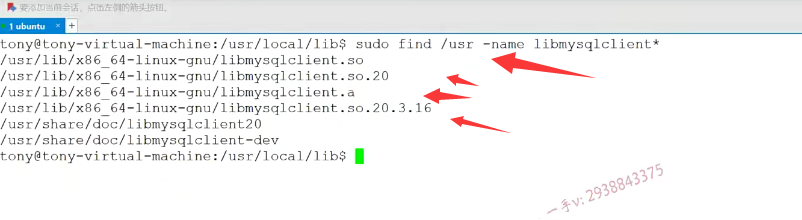

好，大家来跟我看一下啊，大致的去解读一下，

我封装了这么一个东西，mysql呢，这里边封装了mysql这么一个类啊。

它最重要的就是它这个mysql开发包里边给我们提供的这么一个东西connection就是mysql类型啊connection。

你把这个呢，就当做和mysql server的一条连接。

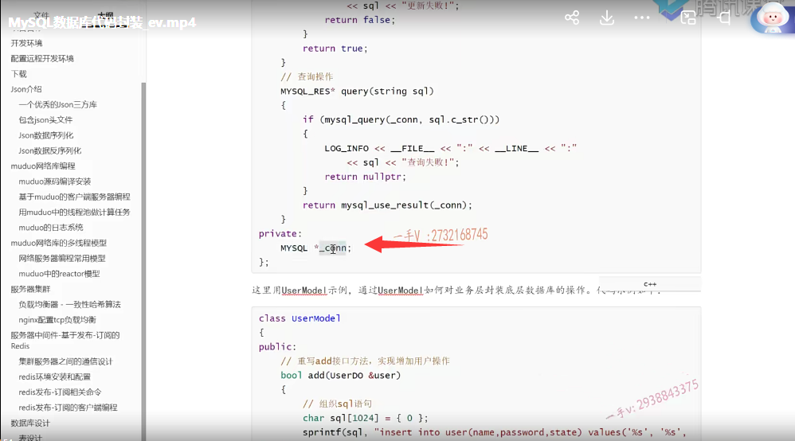

### mysql_init相当于创建一块资源空间

构造函数里边呢，进行一个连接的这个。

这个不叫连接初始化啊，你如果在这里边连接初始化，你理解成它就去连接了，

根本没有嗯，都没有这个远程这个mysql服务器的用户名密码，这个IP地址你连接谁呢？

这个相当于只是给它开辟了一块存储连接资源的连接数据的一块儿资源空间啊，

析构函数的时候把这个资源空间给它mysql close掉。

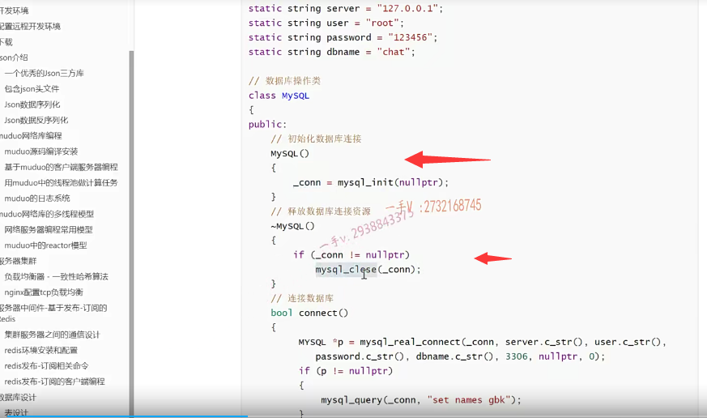

### mysql_real_connnect

这都是人家API提供的API，不是我们写的啊connect，

这是人家提供的API函数，mysql real connect，

你看让我们提供了这条连接。就是存储连接数据的内存对吧？

然后是sever的IP地址，然后用户名密码，我们所要连接的数据库。

呃，mysql server默认端口号啊3306

那么这个空跟零后边两个参数，你不用关注。

p如果不等于空。那么说明连接成功了好吧啊，说明连接成功了，

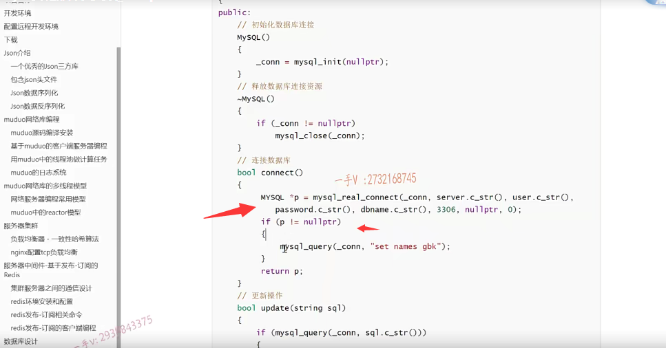

### mysql query 

### 让我们在代码上能够支持这个中文

那么在这里边呢我们做了这样的一个操作mysql query啊，

这相当于一个这个什么操作呢？

这个相当于是一个就是set names jbk，

==这个相当于就是让我们在代码上能够支持这个中文啊。==

那为啥因为c跟C++呢？它默认都是一个这个asicc 啊，

==如果说是直接从数据库上去拉取这个中文的话，在我本地的这个代码运行上啊，会显示这个问号啊，会显示问号显示的不正确。==

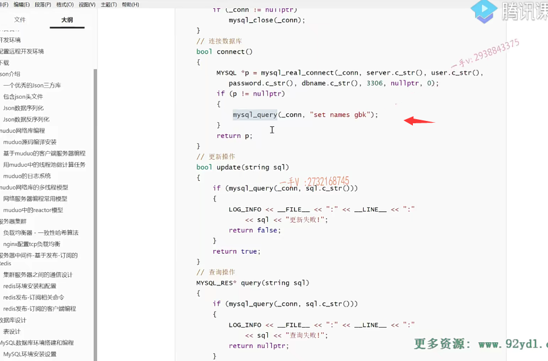

### 负责更新操作

这个就又提供了两组的这个函数，

一个是负责更新操作的，

更新的话就是改变数据相关的insert就是sql语句的insert。

啊，delete还有update好吧，你就都调用这个。

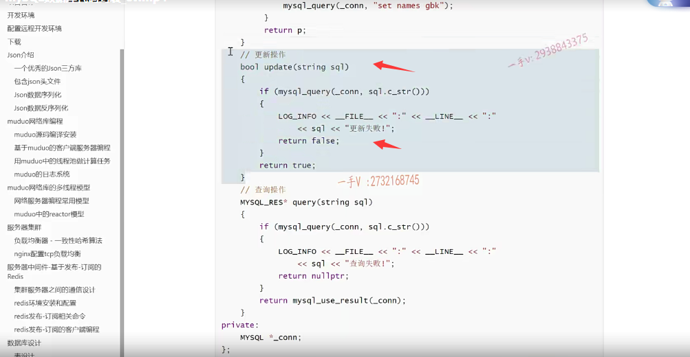

### 查询相关的操作

那么，这个是查询相关的操作主要针对的就是select。

没问题吧啊，主要针对的就是select。

这个数据库相应的这个操作呢，大家就跟我在写项目的时候一步一步去接触啊，去熟悉一下。

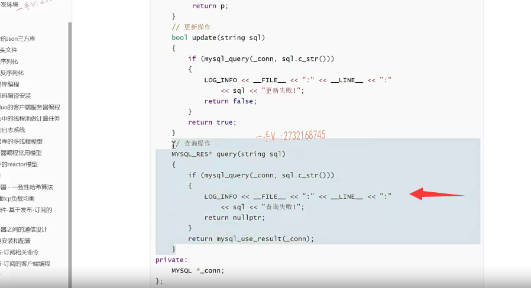

## 创建新的数据库目录

好吧好，那我们现在呢？把这个数据库的代码啊，就移植到我们项目上来。

首先，你要移植的话呢，我们看怎么放啊？

那在这里边是这样吧，各位。嗯。我们给这创建一个文件夹吧，好不好？

new服务的就是db啊，数据库嘛，专门往数据库相关操作的。

### cmakelists db头文件的搜索路径

那你别着急，那你赶紧来先先先来这儿啊。先来这，我们要把这个db头文件的搜索路径先加上，别忘了啊，

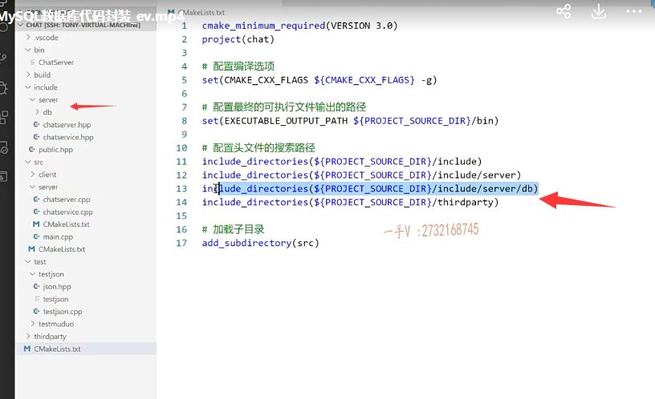

### 添加依赖这个数据库的动态库

然后另外一个就是。

最后的这个可执行文件啊，我们还要依赖一个什么东西啊？还有一类就是mysql sql cl and啊，

因为我们这个可执行文件就是服务器程序呢，还要依赖这个数据库对吧？

所以要加上这个相应的so库的这个名称，

所以它总共就依赖四个库了muduo net muduo base mysql planed跟piece w。

好吧，我们先加上这两个啊，一个是头文件的搜索路径，因为我们又创建了db，然后另外一个就是它的这样的一个东西啊。

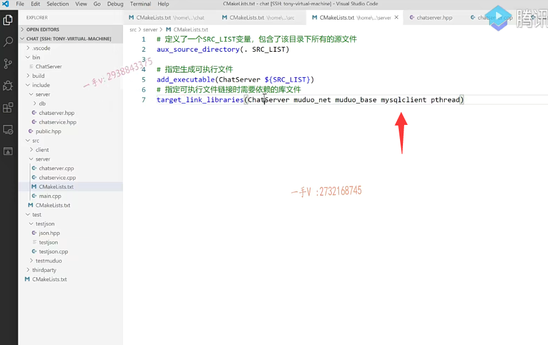

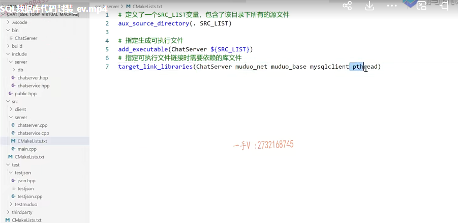

## db.h

在这里边儿，大家注意一下啊，注意一下，或者说是。嗯，就这样放吧，就这样放。会比较清晰一点，对吧？要么都砸到一个目录里边儿了new file，这是一个mysql sql。点h吧，

或者叫做db点h啊db点h。

f no defined bh.db，杠h。end if.

这个是要先包含mysql的头文件好吧？mysql sql点h啊。

然后呢，再把这个数据库操作的这个代码呢？拉过来啊，我们给他拉过来。

粘贴到这里。好吧嗯，这个是全局的一些配置信息，

 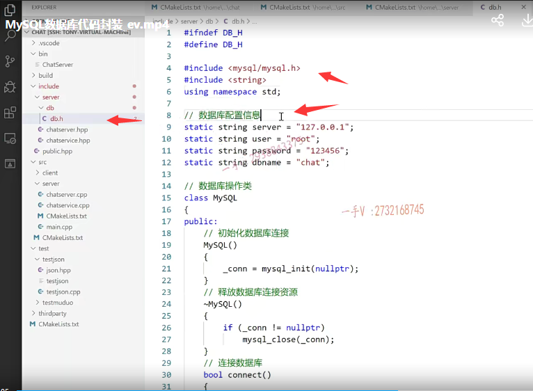

### muduo库里边的日志

我们就先写到这儿了，后边儿呢，我们服务器这块儿的这些信息都是要从配置文件里边读出来的

好吧，那么string using namespace。spaces TD.

好，大家来跟我看一看啊。

这是什么东西啊？这是它的一个日志是吧啊，这是muduo库里边的日志。

那OK，我们用一下，我们用一下的话就要包含人家的这个头文件了啊。

就是muduo，base。login.

我们想用一家家人家的这个日志啊。

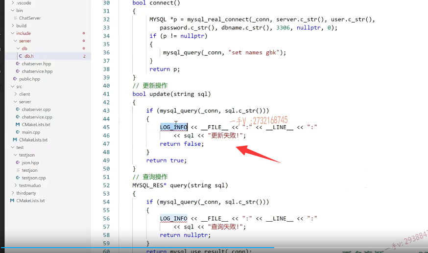

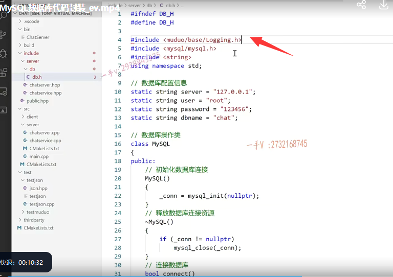

这个是什么fail什么sql语句是不是更新失败啊啊？

### 构造 析构  connnect

就这个大家来再给我看一下，这个是初始化连接啊，

这个初始化连接。这个是析构呢，是释放连接，

==因为我们访问数据库都是先定义一个mysql对象就创建，==

==然后connect创建连接啊，==

==然后再怎么样呢？再去出了作用域再去释放连接对吧啊？==

交互一次就释放连接。

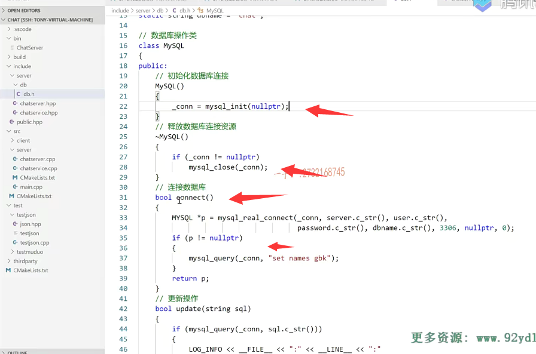

### 编码字符  不设置，从mysql上拉下来的中文显示问号

这块呢，主要是c和C加加代码默认的编码字符是ascii对不对？

不能。如果不设置啊，从mysql上拉下来的中文显示问号好吧呃，

就是我们所说的乱码啊，不清楚它是什么意思？

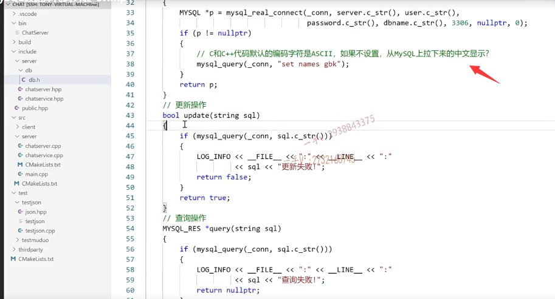

这也是做更新操作，这是做查询操做，实际上底层的调用的API，

你看都是mysql query，这个方法不同的是更新操作呢，就更新了啊。

而查询操作呢，是要返回结果的，是不是要返回结果的啊？

查询什么东西嘛？查询有什么内容？

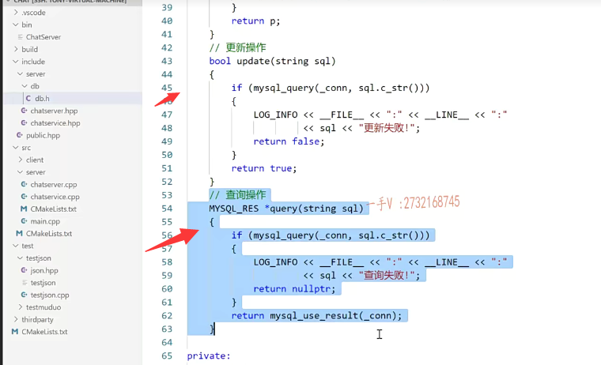

## 源代码和头文件分开写

==这个就是它的mysql了啊，这个方法的实现全部都写在什么当中了，==

这个方法的实现全部都写在这个头文件当中了。

啊，各位全部都写在这个头文件当中了。

==呃。算了，我们还是分开写吧，对吧啊？==

最开始呢，就是给大家传达了这种思想啊不要现在又不遵守了。

这块new为folder吧db。好吧啊，

这个db。

然后呢？在这里边new file就是db点cpp。

这是included b点h是不是？

实际上也好办啊，就是这些方法我全拿过来了。全拿到这个db点。

往前靠啊，然后呢方法实现一下。

okay.添加个作用域就行了，在前边啊。

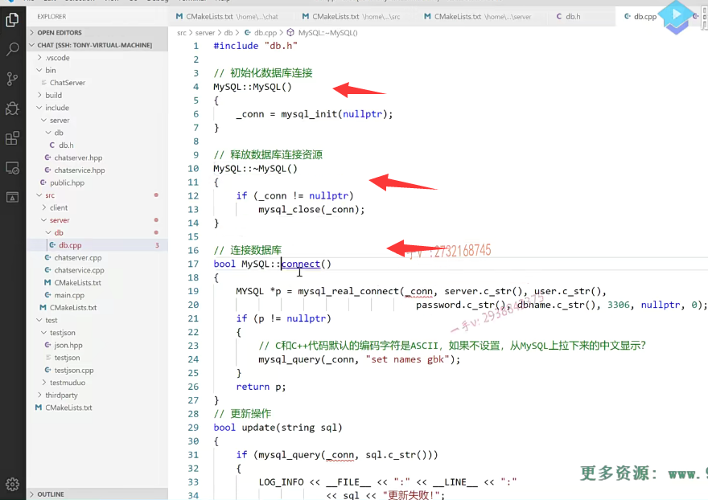

这是查询。好了，这就完了啊，

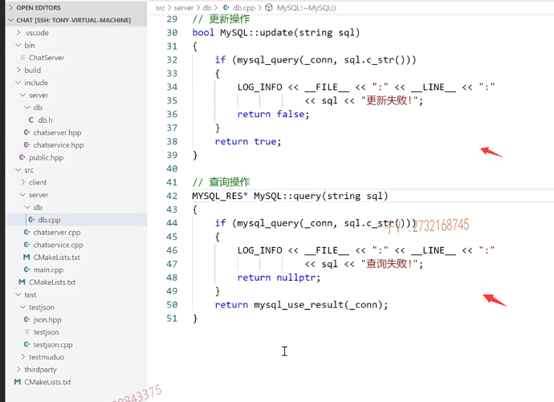

这个db点h里边呢，这个就不用写方法实现了。

它封装的方法也是比较简单的，就是这几个啊，就足够用了好吧。

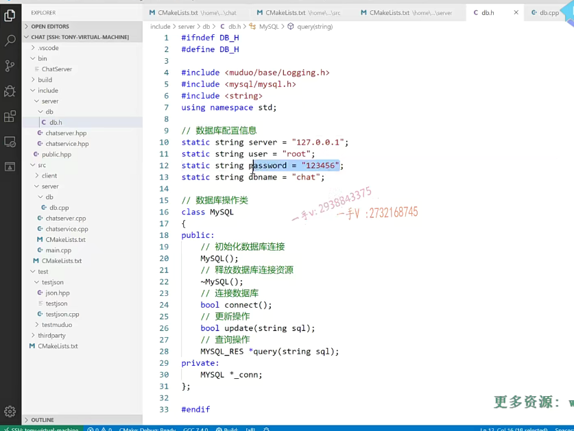

### 配置信息移到源文件中

那这几个配置信息就不要往这放了，因为我们现在呢？

从文件中没有实现代码对吧啊，

然后就是放在什么啊，放在源文件当中。

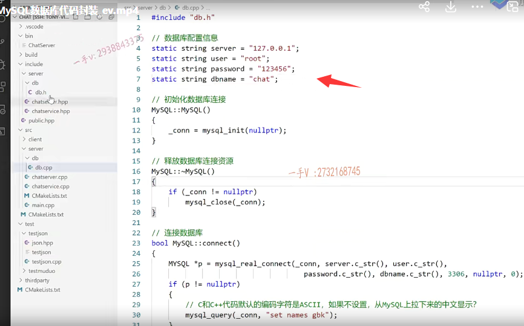

### 不是所有头文件都需要包含在头文件中，需要的就包含，不需要的就包含在源文件中

就这样写，然后呢头文件这里边string用到了是吧？

==然后是mysql点h用到完这个日志呢，这儿又没有写代码，==

==所以这儿就不用包含了，包含在它的这个源文件当中就可以了啊。==

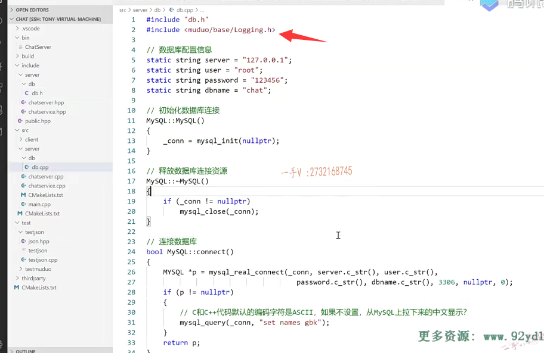

好，这个就没什么大的问题了吧？这个就没什么大的问题了。

这是代码搬过来的mysql的，这个点儿h啊，代码跟这个点儿cpp就是专门操作数据库的封装的这个代码好吧，

进行数据库的增删改查的啊，

### 修改cmakelist配置 

然后在这里边就是这src server的这个makelist里边啊。

这个我们是还是需要去把这个db下的这个文件呢？也怎么样啊？也拉过来啊，也拉过来，

我们会使用到的啊。

### 如何在这里边把db下的这个db点cpp也放到这个src list

那在这儿呢，我们需要改一下这个aux source director，只是把当前目录下的源文件，也就是chats ever点cpp跟check service点cpp是不是？

那么，如何在这里边把db下的这个db点cpp也放到这个src list里边呢？

大家来看看。这个在这里边。这个点是当前目录下的啊。

它不会搜索子目录，所以在这儿没关系啊，

我们给这儿加一个db，比如说这是db list好吧？

相当于就是去搜索一下db这个当前目录下db目录下的这个原文件啊，

然后呢，把它再加到后边这来呗。

就是说你用这些源文件共同参与编译，对吧？

链接这些库来生成我的这个chat server好吧。

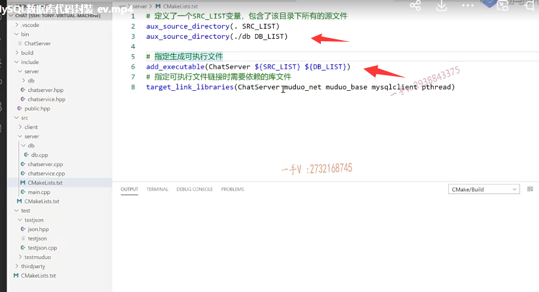

### 编译一下

那么，大家来看一下啊。

这是我的这个db原文件。是不是？

编一下，看行不行啊？看能不能编译通过。

okay了吧，大家看到看到这块，你看。这个db db底下的db点cpp点o，

这个说明这东西被怎么样？被编译到了。是不是啊？被编译到了。

OK，那编译到了就可以，我们就能使用它啊好。

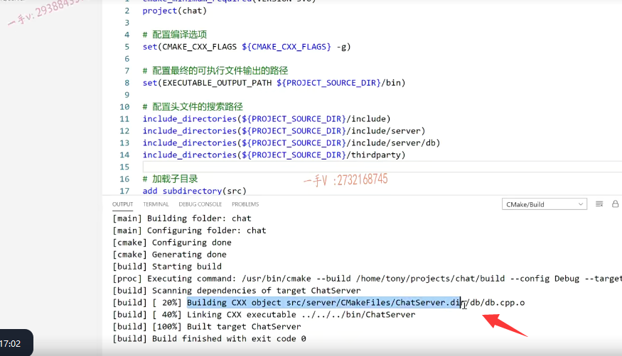

## 总结

那这节课呢？我们主要是给大家做的事情呢，是把这个mysql操作的相关的代码呢？给整合到我们的这个项目工程里边儿来了，

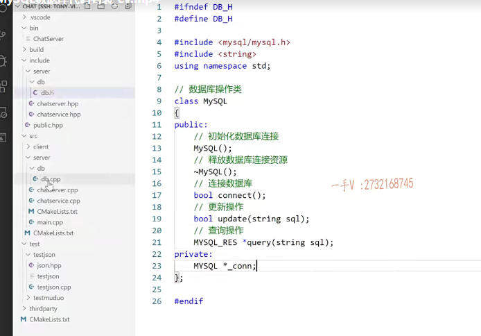

主要就是涉及了数据库的连接，对吧？

以及它的两个操作方法update是针对于insert delete 

update的就是更新的，这个是针对于select查询的。

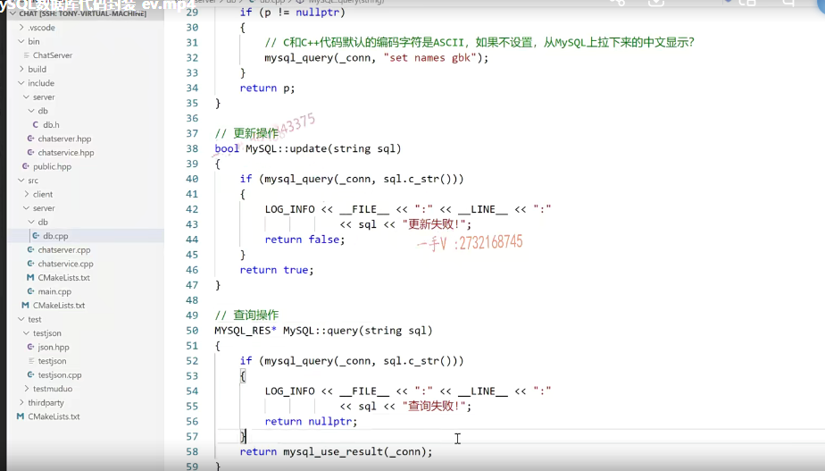

好下节课呢，我们继续来处理我们的这个注册的这个业务这一块儿的相关的数据模块儿的代码。