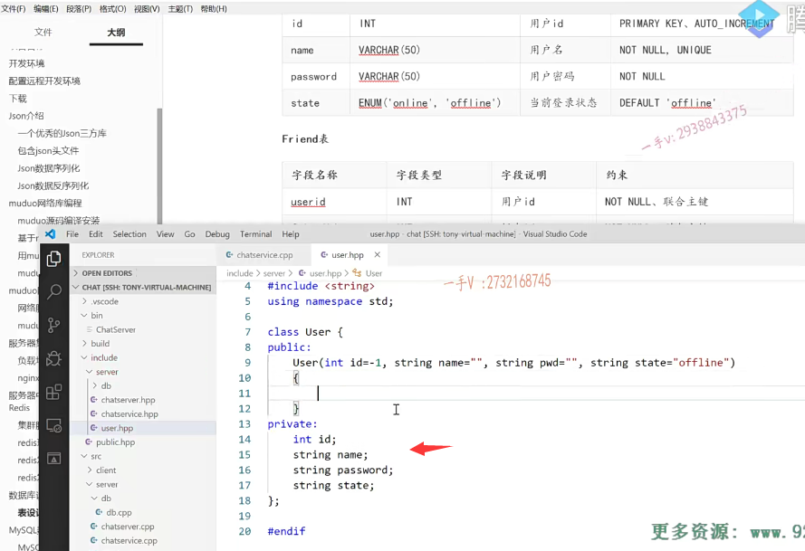
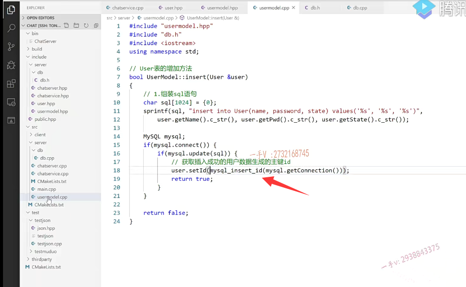

上节课我们说了啊，数据库这一块儿的操作呢，跟我们业务代码要进行分离开啊，

我们希望业务代码看见的都是对象。

而在数据库层呢的操作操作，具体的sql语句对吧？

### 定义这个类呢，就跟数据库里边的表呢，是一一对应的

那既然这样，也就是说第一步啊，那我们这儿虽然没有使用orm框架。

但是使用orm框架的第一步呢，就是需要定义呢，我们相关的一些类，

这个类呢，就跟数据库里边的表呢，是一一对应的。

==好吧啊，跟数据库表是一一对应的，==

这样我们才能把数据库里边的读出来的字段给它合成一个对象提交给业务方去使用啊？

### user.hpp  属于映射类

所以在include啊，user这块儿呢，大家来看啊。那我就先定义先定义谁啊？

user点hpp吧好吧。

这都属于一些这个映射类啊，映射类。

所以呢，它非常简单，我们就不提供对应的这个cpp文件了好吧。

这个是class user啊，user都有哪些成员变量呢？

## 对照着这个user表给它设计一个类

各位。在这儿的话呢，我们看一看。

看一看这里边表的设计。表的设计，

这里边user表有四个字段，对不对？

### 成员变量

我们对照着这个user表给它设计一个类出来啊。

首先呢，第一个是in tid。对的吧啊，

第二个是name这里边还需要字符串。

所以给它包含一个string这个头文件吧。spaces TD.

第二个就是语法错误啊private。

然后这个是谁呀name？

这个是谁呢？password。

呃，然后还有一个状态，它还是个string，是不是state在这里边，

我们尽量就是跟表里边的字段名字都带成一样的好吧啊，都带成一样的

### 构造方法   提供一些默认值

public。这里边都就提供一些呃方法构造的方法，

还有一些get和。set相应的方法啊，

这是user in tid。我可以给点默认值啊name。

嗯。name等于空，是不是string啪pwd等于空？

还有string state等于默认是个offline吧。

这块我就直接写了，这都比较简单好吧啊，

这类比较简单的this指向的ID=idthis指向的name=name。

this指向的password=pwdthis指向的state=state。

### 成员方法 set() this加一下，形参和实参名字相同时

OK吧好，这里边呢，我们再提供一些方法啊。

这里边儿没有自动生成的是不是。这个this指向的ID=ID啊，我们提供上吧，

万一再使用了啊set name。string name.

因为一般呢，这映射数据库的类啊，主要就是数据的。读取跟修改嘛，

==对吧？给我们业务操作，这个对象又访问不了呢，它的这个私有的成员变量，==

==所以在这儿给大家提供一些get set方法啊。==

password=pwd.然后呢？就是word set什么state好吧，

然后是string state。==就是this指向一定要加this，==

==因为你现在成员变量跟形参的名字是不是都一样啊啊？都一样。==

### 成员方法 get()

再提供上四个方法get

get以及get这个是个整型。

这个是string，这后边两个是不是都是string啊？

这个就直接return ID了啊。

这个就直接return谁？name了。

这个return谁呢？this password啊。

这个return谁呢？return这个state好了，

这个相当于就是我们给这个user表啊，把这个相相应的一个orm类。

啊，这个匹配user表的orm类啊？对象映射关系类是不是？

就我们业务上操作，这个user对象岂不感觉舒服多了？是不是啊？不会见到具体的sql的。

## user model类 是user表的数据操作类

呃，那么然后呢？我们就得有相应的一个专门操作model的类了，

就是提供相应的数据库操作方法了。

那么，在这写一个user model hpp。

model就是具体的这张表的业务类啊，这张表的这个数据操作类好吧，

if no define大家先看啊user model。这个是user model啊。

这个改个名字吧。为name这文件名，我们就不大小写了啊。

user.model点hpp啊。这个是什么东西呢？

==这个是user表的数据操作类。==

==啊，再一个刚才是user表的orm类，就是映射表的这个字段的好吧，==

这个才是真真正正操作提供方法的。

==这个方法，那就跟业务不相关了，这主要是针对表的。==

==针对表无非就是不是就是增删改查呀啊，==

### 注册相关

你比如说我们提供一个跟注册相关的吧，

注册的话呢？注册这个业务是不是要向表写东西呀？

向表增加一个什么东西啊？

增加一个是不是新的用户啊？没有问题吧啊，增加一个新的用户，

所以在这里边增加我就我就写了这个insert。啊，就写insert，insert增加什么呢？

业务给它直接给个啥东西就可以了。业务给它直接给个user对象就可以了，好吧？

啊按引用传递。

### user增加以后，我们才能修改id字段

大家来看。这就是user表的增加方法。好不好啊？

填一个user返回增加成功或者失败，因为是传引用，我们还可以呢，修改相应的这个实参的值。对不对啊？

因为增加的时候呢，我们ID肯定是没法填的嘛ID是你增加到这个数据库里边儿ID这个字段呢，我们是主键自增键嘛，是不是啊？

==这个是增加以后这个ID这个字段才会mysql才会自动生成啊，==

==生成以后呢，我们再反过来。填到这个user里边儿。好不好啊？==

行，那这个我就先添加一个方法，增加的方法啊，

## 组装SQL

然后再相应的这个文件里边再填一个user model点cpp。

这个需要分开写user model点hpp。hpp.好吧啊。

然后呢，把这个方法呢拿过来。

user model.这个是user model。添加个作用域。

那这个该怎么写呢？各位。

在这里边，我先要包含谁啊？要包含我的db.h，是不是点h啊诶？

希望包含这个头文件。操作数据库的这个头文件。

这里边所谓的插入及嗯，那也就是说你先组装SQL语句吧，

### 不允许name重复

组装SQL语句以后呢？在干什么呀？再发送相应的sql 句是不是啊？

然后呢？插入成功以后呢？

再获取呢？你给这条数据生成的数据库给这条数据生成的这个主键ID。

对不对啊？当然你插的时候还要去考虑一下这个到底呢？

呃，因为人家在这儿呢。你包括这个name，人家都是不允许unique的，不允许昵称，不允许重名的。对吧啊，昵称是不允许重名的，这就像我们注册一样，我们注册的时候呢，还没有一个QQ号对吧？还没有个号码，只有一个昵称，昵称注册上去昵称不允许重复注册成功了，人家会给我们分配一个号码，

以后我们就通过这个号码登录就行了。

啊。那也就是说，在这儿有可能是你输入了一个已经存在的，是不是昵称啊？是不允许的，那就是注册失败了啊。

## 用户表增加方法实现

这里边我们不管具体的业务，业务是你业务层该管的，

我这只负责数据库的增删改查就行了，好吧？

大家来想一想，这块儿该怎么写？我带着大家来输出一下啊。

### sprintf 组装sql

首先在这里边，第一步就是组装sql语句嘛，对吧啊，咱们定一个sql。

这个字符应该就足够了啊，或者说是定一个1024吧。

万一再少了呢？这个用一下这个sprintf 字符串连接嘛，对吧？

这个方法是非常好用的啊lo stream。using namespace.用一个sprintf啊，

### id自动生成，刚注册时，都会有默认值

然后是sql对吧？这个是insert into。user.插哪一插哪插哪几个字段呢？它ID name pas word state ID就不需要了。

ID是自动生成的，自增减嘛，对吧？

name pas word跟state啊。就差这个name。password和state啊。values.这个字符串是。单引号啊，字符串是单引号。然后是百分之s，然后再是百分之s。

okay了。那么，在这里边是user的，get什么name？user的get password再是user get什么呀，get state。这别state了。

这刚注册啊。是不是刚注册啊？刚注册的话，这肯定都是什么呀？

user点gets那就get state吧，刚注册还没有登录呢，肯定是个offline，

那也没关系，各位为什么这样说呢啊？

因为呢，你看你的user写的时候啊，你创建了一个user state，没有传值的话，默认是不是就是这个offline啊啊？所以没有关系啊，在人家需要的是一个字符串，你这是个string是不是把它调用它的c杠STR，把它转成这个叉形类型啊？

### get方法是不需要参数  之前忘记删除了

好了，这相当于就是有了一个什么东西啊，有了一个sql语句了，对吧啊这是？too few arguments in function call.参数不够。

哦，这些get方法是。不需要参数的，对吧？忘删了啊，之前。好，那么在这我们继续来。

### 在之前连接数据库上的加一个日志

这就OK了。然后是定一个mysql对象。

然后呢？要连接呢？是不是mysql点connect？这儿有一个连接成功或者连接失败呢啊。好吧，

咱们在这也打印一下吧。打印一下，

在这加个这个日志啊。connect mysql sql.success.是不是？

那么else在这里边仅仅只是做一个打印而已。

如果万一错了，我就可以非常方便的这个定位问题是吧啊？connect mysql file在这儿加个打印啊。

### 给表增加用户，组装sql,连接后，利用封装的update，传入sql（update底层为mysql提供的query方法）

好。那么，我来到这个user model里边。

然后呢，再执行什么东西啊？

再执行mysql sql的。这个是update方法，还是query update是吧？

update的话，把这个sql语句呢传进去啊传进去。update了。对了吧呃。

这个呢，如果更新错误的话呢，它就是返回一个FALSE。

OK，那最后呢？我就return FALSE啊，如果这是成功的话呢？我就是return true了，

### 数据生成的主键ID   这个ID当做这个用户号给用户返回回去

但是在这里边我还需要做一件事情啊，就是什么事情呢？

获取一下插入成功的数据的用户。数据生成的主键ID。

我们把这个ID当做这个用户号给用户呢，返回回去好吧啊。

### 使用mysql这个c apI，mysql_insert_id得到主键id

那在这里边呢？我们就还得做一个什么样的操作，能够拿到数据库生成的这个ID呢？

这块儿呢，应该它应该有相应的方法的啊mysql这个c apI定义的方法真的挺多的啊，

这个是你可以去查一下。或者说说是你打开头文件，你找一找啊。

mysql insert.唉，你看啊，

你这一搜mysql insert直接就能搜到这个方法，mysql insert ID

给一个这个connection。返回这个connection上。这是不是一个ID啊？

你看这方法是不是还挺多的啊啊？你都可以看一看啊，

那咱就用一下这个方法吧，mysql insert ID看正不正确？

哎，正不正确？这个需要我们去验证的啊。

### mysql_insert_id 方法参数需要用到mysql连接，我们定义方法获取这个连接

唉呦，那这个mysql方法呢？

我们封装了呃，我们在这儿没法去调用它呀，对吧？

我们获取一下当前的这个连接。可以吗？

会有一些其他的方法我们可能会用到啊，

那么我们在外部没法直接访问人家私有的成员变量啊，

所以在这儿获取一下连接吧，好吧？

这个mysql啊，信号就get connection。

好了吧啊get connection啊。获取连接。

在db点cpp里边实现一下。

mysql sql作用域。这个方法也简单，就是直接是returnconn就可以了好吧。

然后呢？就是在我们的这个user model里边，我就可以使用了啊，

然后获取到我。最后的这个ID。或者说是直接给用户插进去吧set谁ID是不是？

就说是mysql sql诶。哦，这应该是个全局方法，是不是啊？

参数需要一个connection啊？是一个mysql insert。ID

对不对？还需要这样的一个mysql点get connection。

是不是做这样的一件事情啊？

对，这就是好处，

你看我们这个user model就是数据类呢，把跟数据库相应的API方法调用啊，都写到这儿，

对于我业务层的话，我到时候我直接光访问这个model，提供它的这个访问它的方法，

方法里边全部是不是都是对象啊？

跟数据库相关的这个sql啊，方法根本就不设计啊，就看不到。

好吧，那这个呢？就输出完了，

## 用户传的SQL语句？这里好像传的是用户类

大家看先组装SQL语句是不是根据你用户传进来的SQL语句啊？

然后呢？在这里边儿连接数据库，连接数据库以后呢？

是发送这个update，这个更新的数据库语句啊

sql语句要插入一条数据。

完了以后呢，把用新插入用户生成的这个主键ID拿出来return true，

否则的话return FALSE表示注册失败。

失败了，是不是啊？

## 总结

好，那这一块儿呢？

我们这节课啊，就给大家呢，把这个相当于就是业务层跟数据库之间，中间的这个or m层啊。

就是为了剥离业务层跟数据控制层的这个代码user model

model这一层的这个代码给大家输出了一下啊，

下节课呢，我们继续来把这个注册这块儿的业务填完。

我们验证一下，我们这块儿操作到底是否正确啊？