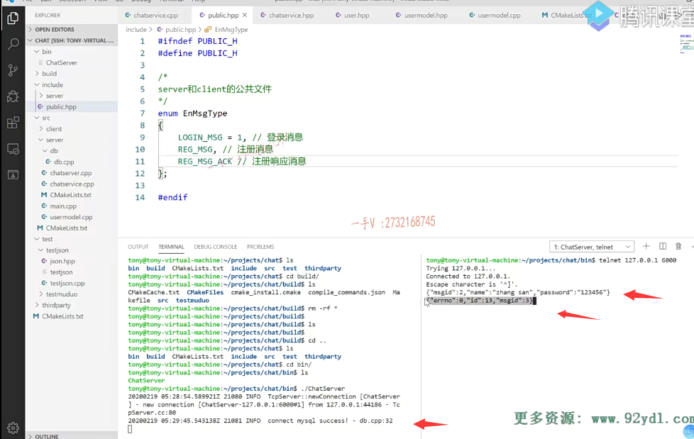

## 来把这个注册业务前后呢，都给它代码都给它打通

这节课呢，我们来把这个注册业务前后呢，都给它代码都给它打通啊呃，来看看呢，

整个的注册业务流程是否能够正常的工作？

那么，首先在service点hpp这里边，我们要操作这个model类嘛，对吧啊？

那在这里边呢，我们就需要包含相应的头文件了。

在这各位，我想用到智能指针来管理它的这个资源啊。

呃，或者说是不用也可以，是不是不用也行啊？

不用行简单点来吧。

### 包含头文件usermodel.hpp

那在这里边我就定义了这个对象啊，什么对象model类的对象是不是？

这边用到了user model点hpp啊，

### 成员变量 usermodel数据操作对象

然后在这儿呢就是数据操作类对象

这个是user model.好吧，这个对象就产生了啊，

### model给业务层提供的都是对象 不是数据库字段

产生了以后呢，相应的这个服务这里边啊，

大家看啊，就是服务这一块呢，只是依赖的这个model类，

它不做具体的数据库相关的操作。

==数据库相关的操作呢，都封装在model里边儿了，而且model给业务层提供的都是什么啊？是字段还是对象啊？==

==哎，都是这个对象，不是数据库的字段好吧？==

==这就是一般我们在项目里边儿对于业务层跟数据层啊，最普通的一个设计好吧，==

那希望大家掌握这一点。

# 处理注册业务

### 网络模块 反序列化生成json的数据对象给我上报到注册业务

那么在这儿呢，我们把这个打印就去掉了，

在这儿首先要干什么啊？

你想啊，各位注册的消息过来了以后。

==网络模块儿把这个消息呢进行反序列化，生成json的数据对象给我上报到注册业务，这里边儿来了是不是？==

## user表这本身就是四个字段，它注册只需要填两个字段

注册在这里边儿，我们应该是比较简单它。填一个name跟一个password。是不是就可以了啊？

### id是返回的，不需要填   state是默认的offline

因为它注册嘛，也不需要填id 

id是我们它注册成功，我们给它返回的。

刚开始注册呢state也不用填嘛，是不是。

user表这本身就是四个字段，它注册只需要填两个字段就行了，所以在这儿大家来看啊。

### 获取js这个json对象里边的name跟pwd

string name我首先呢，获取js这个json对象里边的name跟pwd吧啊，

那字段在这里边可是password字段，你不要写错啊，要不然传过来的。你字段名字写错，那你肯定获取不了了，

这样一来呢，我们就可以创建一个什么东西了。

### 创建一个user对象

我们就可以创建一个user对象了，这个user对象呢？

嗯，我们只会给人家填什么呀？set name。

set pwd是不是？那就是pwd了。

### 新用户的插入  user model点insert方法

你看我这业务操作的都是数据对象啊，完了以后呢，

用这个user model点insert方法user？

是不是进行个新用户的插入啊啊

state？那么，在这里边就是根据state

这个就表示什么呀？插入成功

这个表示什么？注册失败了啊。

这个表示注册成功。这个表示呢？注册失败。

好的吧啊，注册成功，注册失败，

### 注册成功，人家会把这个ID设置到这个对象

那么得相应的返回json字符串是不是给对端的这个客户端啊，

那在这注册成功了以后，因为我们这个参数传的是引用嘛，

所以注册成功，人家会把这个ID设置到这个对象里边儿啊啊？

那就是我们在行参这儿已经能看到改变了啊。

### 注册成功  返回响应消息

注册成功在这儿呢，我们应该返回什么样的消息呢？

各位。在这，我们首先呢，应该是json啊，这个json。这儿写个response。并一个响应，是不是I response中括号？

首先呢，message ID。message ID在这里边写一个什么message啊？

#### 注册一份msg type

那我们可以慢慢填呗啊，这个相当于现在就是一个message ack。

这个是诶，不是这个啊，我们现在是注册。这个是reg杠message。让ack。

对不对？这个是什么消息啊？

注册响应。消息啊，你注册了。你客户端发过来是这个消息ID人家服务器给你返回的，是ack ack是一个响应确认消息嘛，对吧？

然后呢，在这里边大家来看啊，

首先是一个reg杠message ack。是不是

然后呢？再是携带这个用户的这个ID。给用户把ID带回去。好吧啊。

### 返回的json对象中添加一个错误标识

OK，在这里边儿，大家来看啊！message ID当然了，

这个响应消息是不是应该都有一个什么东西啊？

==应该都有一个错误标识啊，响应消息不一定都是正确的，是不是内容啊？==

所以在这呢，我们再带一些东西啊

response.response在这里边的这个。error number，这是零。

这个应该都不陌生吧，在系统编程的时候呢？

呃，这个就不用带这个error message了。我们检测error number，

如果是零，就表示这个响应没错，这是一个响应成功了啊，就是这是一条做业务做成功的消息，

如果error number不为零。

那肯定还有个error message说明了错误的消息，

那我就不用再读其他是不是字段了，

### 注册成功 给客户端返回  发送

你看这就是给它返回的，返回了以后呢？

组装好了，这个json，然后我们就通过这个网络呢。给它客户端怎么样啊？response response点。dump.

给它发送回去。好的吧啊，

### 注册失败

然后呢？这个注册失败的话呢？

是什么呀？依然是一个ack。好吧，

但是呢，这里边error number就是1的话呢，

==这块就是一个error什么？message.啊  这个表示内容==

error message你想带也行，我不想带也可以，

就是说呢，那咱两方通信肯定得先约定好嘛error number，

如果是零就表示没错嘛，一就表示有错了，是不是？

啊，有错了，那你就不要再去读什么ID字段都已经有错了，

就说明呢，你注册失败了，

那你看你客户端怎么给用户去显示一下？

好吧啊。大家注意一下，

## 编译一下 解决一下错误

### 链接错误 

那这个你看注册业务在这儿呢，就完成了。

啊，我们来编译一下我们整个的这个系统来验证一下注册的这块儿业务正确与否啊？

哦，在这里边编译没成功好，

我们看一下这个问题啊，在这是chat server这都编了chat service，也编成功了。

在链接的时候是不是出错了，大家来看看啊，

==在链接的时候。我们给出错了。==

### model_insert方法出现了未定义

谁出错了呀？在这个注册方法中对insert未定义的一个什么？引用是吧？

就说我们的这个insert怎么样啊？未定义。

这个怎么能是未定义呢？来看一看。

就是说现在我们check service里边使用了model的insert方法，

这个方法是不未定义啊？检查一下啊。

首先，这个model里边的insert。没问题。相应的model点cpp里边。

定义了没？这块都定义过了是吧？都定义过了。

那。这里边为什么报找不到的这个未定义的这个方法呢？

我们来看一看啊。在当前文件下，builder model就是在当前src。

呃，在server文件夹下。这是点src应该都包含进来了。是不是？

### 进到这个build里边。我把这些文件全部删掉后 重新编译

嗯，这个觉得。有点儿问题。对这个方法未定义的引用啊。

那我们大家来一起看看，这是啥问题？

我们看看。它是不是没有重新去扫描我的目录里边儿更新的文件user model点cpp是我们刚才建的是吧？嗯。

==让我进到这个build里边。我把这些文件全部怎么样啊？==

==我把这些文件全部删掉啊。我全部给它删掉。==

#### 是没有识别我更新的cpp文件

重新编译一下。哎，这个OK了啊，

那就不是什么错误，是怎么样啊？

是没有识别我更新的cpp文件。

好吧，那你看现在这个所有的文件你看。都编译成功了，我们是总共12345，

现在是有五个源文件也都编译成功了。好的吧啊，都编译成功了，

## 测试

### 表名修改一致

那么在这儿呢，一切OK的话，

那我们来测试一下好不好？

首先呢，我打开数据库，我看一看啊root杠p123456。然后呢，是use chat select星from user？user这张表show tables。啊，

这都是小写的对吧？小写的，

我们先来看吧啊，先来看。

因为我这个代码上好像刚这块儿的这个model里边儿这个给人家写成大写的了。

表名你都写一致啊。OK.好了，

### telnet发送注册信息测试

以后呢，我先来运行一下bin里边的这个chat server.

然后在这儿呢，

我telnet幺270点016千。

我现在要发送一个什么消息啊，注册消息对吧？

注册消息有message ID首先是。注册是个几啊？看看现在这个public。一二注册，

现在是二是不是？还要带一个什么name？name，我们带一个张三吧啊。

然后还有一个啥东西。password对不对？也是个字符串啊，带个123456。

咱message ID是20个注册消息name是张3 

password是123456。

### 成功返回响应，返回注册id

ID是13 message，ID是三响应，没有问题吧啊，

响应是完全正确的，这块儿呢，打印了connect my success，

因为我们访问数据库了。这块儿响应了零是成功，那就说明响应到我们的是不这一块儿啊？

### 检查一下数据库

检查一下数据库。

张3123456状态是offline，这个完全没有问题吧？

这因为我原来给这张表插过数据，所以现在它的这个自增键从到13了啊，

你如果是一张新表的话，你应该是从这个零。

一开始的好吧啊。

那注册的这个业务呢，就验证成功好吧？

大家也可以自己验证一下，

这相当于就是我们把整个的一条业务全部打通了，

客户端发过来的这个一个业务就是注册的业务。

先从最开始的网络

再通过这块的事件分发到业务层的一个相应的handler处理啊，

注册，然后再访问底层的model。

啊，在这里边儿，我们设计的是业务类，

这块儿看到的都是对象，对吧？

==有没有这个相应的sql跟mysql的API呢？有没有？完全没有对吧啊，==

你现在可以把底层的数据模块随便改，你改成redis也行，你改成这个mysql改成这个oracle改成这个oracle改成甚至SQL server。或者是像mongo db

都可以的，无所谓。

### 降低了耦合

这就是设计的好处嘛，你不要把所有的代码都砸到一块儿，对吧？

==要降低偶合，我们现在真的是网络模块儿跟业务模块儿以及数据模块儿。==

==是非常非常低的偶合了。==

### model只是针对数据库的表进行增删改查

好吧，然后在model这里边儿呢？

model这里边儿命名的时候注意尽量不要命名成业务类的这个方法。

它只是针对数据库的表进行增删改查的好吧啊，

你提供相应的方法，就所有的数据库相关的什么sql啊？这个mysql的API调用啊，

就全部封装在这个model层里边了。

## 总结

好，那这节课的这个内容就给大家讲到这里啊，

希望这节课听完以后你能够整个的这个手上啊，

自己创建的项目能够跟我这一块的进度保持一致，

这个注册业务呢，也要调试成功，

注意每一步的这个业务都调试成功啊，

慢慢。就可以这个开发很多业务来啊，

设计呢，证明我们设计也是稳定的，

这个软件设计上啊，模块设计上也是稳定的。

你不要不测试一次开发一大堆的这个业务，到时候真的出错的话

你可能很难去定位这个问题好吧啊。