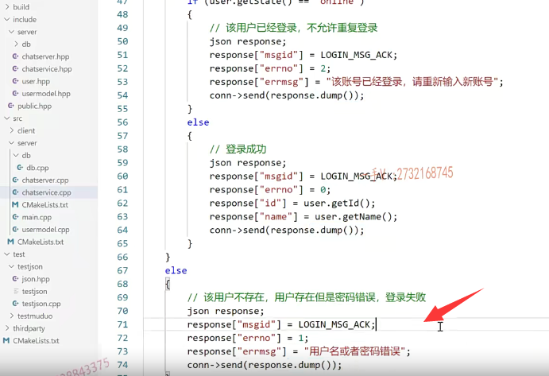
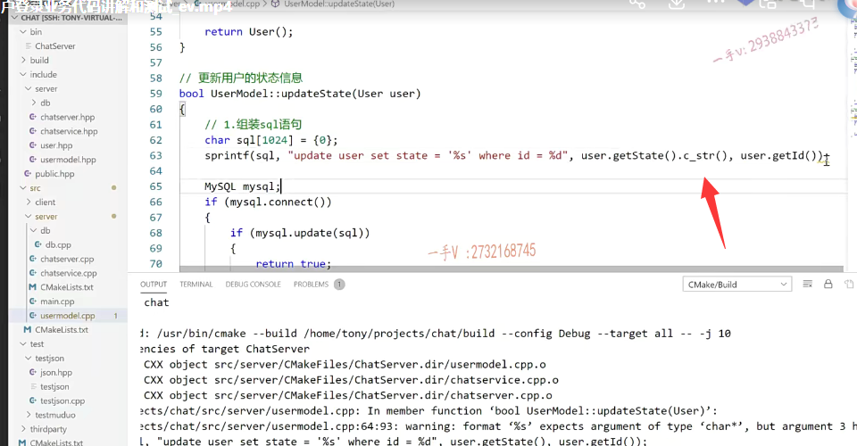

# 登录业务处理

这节课呢，我们把登录的业务给它梳理完成啊，

网络模块到业务模块这块的派发，我们就不说了。

呃，登录的话呢，一般我们就像我们登录这个聊天儿软件一样啊，

输入这个ID号对吧？我的号码

再输入这个密码是不是就可以了？

对，然后呢？当然我要去检测一下，看这个。他输入的这个ID对应的密码呢？是否正确？是不是啊？

正确返回什么消息？错误返回什么消息？

跟这儿的主要结构一样，这块儿就是在做业务，对吧啊？

## chatservice login实现

### 获取id pwd

那么，首先也就是说，我要拿到什么东西啊？

拿到这个id应该是个整数啊，各位ID=js中括号啊ID。

啊，然后再拿到什么再拿到这个pwd js password.

### 查询这个id是否存在 在数据库中

然后呢？这个就开始应该是这样的一个操作啊user 

user等于啊user model点query传入一个ID值，那我们一般都是在表中用主键查的嘛，对吧啊？

传入一个这个ID值。返回呢，这个ID逐渐对应的这个数据好吧啊，到这个user。

到了以后呢，

然后呢，我们拿这个user点get password啊，

如果说等于pwd。等于这个人家传过来的，这个就是什么啊？登录是不是成功？对吧

else这表示登录失败。对的吧啊，登录成功，我们要给人家返回啥东西呢？

我们这块呢，可以拷贝一下啊，都是一样的。

### 注册登录响应消息类型

呃，这个应该属于message ID啊，message ID是登录的，是不是一个响应啊？

message ID啊，这里边是属于登录的一个响应操作。

我们把这个消息类型都写清楚啊。万一要用到了。loge n message ack.这是登录响应消息。

### 登录成功  返回响应

然后在这儿呢，我们给它写一下login a message ack对不对error number是零。

那么，我们在这里边呢，要给它就是返回一下啊，

你可以把它的ID继续给它返回回去。好吧啊，都行。

你先写这儿吧，以后不要可以删掉啊，万一要了的话呢，

在这儿我们还可以把它的昵称给它返回去。

实际上，像这种用户列表啊呃，

实际上像这个就拿我们的QQ聊天软件来说吧啊。哦，它的用户量是非常大的，对吧？所以它的像它的这个昵称啊，包括它的好友列表啊什么的啊，它都是在本地，就是在你客户端这边记录着的啊。

啊，他不可能把它记到服务器上，如果记服务器有很多人去登录的话，那服务器的压力实在太大，需要传送的数据也太大了。

对吧，那我们在这块儿呢，就是将来我们先把这个字段带回去啊，将来不要的话呢啊，我们可以把相应的字段存到我们的本地啊。

好吧啊，将来不要你也可以删除，你保留在这儿，它也不影响我们的业务。

OK吧，这message ID都是响应啊，

然后是这是什么东西呢？这是error number是个零对吧？

然后这是个用户的ID啊，

然后这是啥东西呢？这是用户的昵称。

是吧，好完了以后就可以把这个怎么样发送回去了啊？

### 登录失败 返回响应

这块登录失败。error number是一。啊，这儿就没了。

对吧，这就是你在客户端收到这个响应了一看，哎呦，按照number 1

你就提个用户名或密码错误呗。

啊，就这意思。

## 实现model封装的query   根据主键啊，就是根据用户号码查询用户信息

这个业务过程呢，也是很明显的。

那么，在这来看一下啊，把这个query实现一下。

根据主键啊，就是根据用户号码查询用户信息。

是一个userquery query对吧啊int id？

就是这样的一个方法，这个方法呢，在对应的这个model里边，我们实现一下啊。

### 还是不返回指针了，否则需要我们去释放资源，就返回对象吧

那就是先组装sql语句呗啊，大致的跟这个是一样的啊。

呃，是这样吧。

比如我们这返回一个指针吧啊。

因为返回的指针可以返回空指针来表示它是一个什么？没查到。

是不是啊？来表示他没查到。好吧呃，

或者说是返回user也行，因为返回指针的话呢，这里边儿需要我们外部释放资源啊。那就返回这个普通对象吧。

### sql语句的组装

一会儿我们来看一看这个接口怎么用啊，当它发生异常的时候。

select.这个应该是简单啊，应该怎么写呢？

select星from谁啊？user where ID等于百分之d。那就等于这个ID就可以了。select星from user where ID等于指定的ID，

然后这个就全部这个应该就是不是update了，是谁啊？是一个query，对不对诶？query的话，那就要记录人家的返回值了，

#### 注意我们封装的底层query的返回值

因为这个是带有返回值的啊。

好，大家看一下这个query返回值是一个mysql res。

### 从这个返回值res里边去读数据

这是一个查询操作啊。查询操作接着呢，

那就是我们要从这个res里边去读数据好吧，

那么这块我给大家再介绍一下相应的这个mysql的这个API啊，

这个不等于空就表示查成功了。好吧啊，查成功了，

### 使用mysql fetch row

查成功在这里边呢，就得用到这个mysql fetch row了啊，

就是fetch嘛，就是获取。从这个资源上把它的行全拿出来。

这个是用主键查的，主键不允许重复，

所以这肯定是如果查到的话呢？是不肯定就是查一行啊。对不对啊？

fetch row在这里边就是个res啊。

传个res它的这个返回值是什么类型呢？

是mysql row类型啊。

那就这个从资源里边拿到这个，拿到这个行。

没问题吧？我记得这个方法呢，是我们一会儿验证一下，

因为有可能登录的这个ID有可能存在，有可能不存在，或者说是用户直接输错了啊。

### 返回的行 row也需要继续判断

嗯，接下来就是这个row也是跟这个什么来判断啊，跟这个空来判断啊。

就是里边儿有数据，里边儿有数据的话，我们这肯定是一行，对吧？

我们要创建一个user对象啊。user set ID呃，

注意呢，这个row呢，你在使用的时候，它这个mysql res相当于呢？

嗯，在这儿是个什么东西啊？在这你就可以用这个中括号运算符来直接访问。

#### MYSQL_RES的返回值数据结构

### row中括号运算取字段      字符串转整形操作

就是在这里边这个row mysql sql。mysql sqlrow啊，

我们来看看是不是这样的？

这是个ID，它拿出来全部是字符串啊，它拿出来全部是字符串的话呢。

==嗯，我们给它怎么样一下？我们给它atoi一下。把它转成什么？把它转成整数好吧，==

因为ID是整数嘛，是不是？

然后在set name。name就是一。

user点set password。row二。

然后user set什么呀？state啊。state的话呢，在这里边是三

==相当于这里边儿0123刚好对应我们这个user表的四个字段好吧啊，==

==第一个是ID，第二个name，第三个是password，第四个是state。==

那然后呢？我们就可以在这里边把这个谁返回啊？

把这个user给它返回回去。好的吧啊，user给它返回回去。

### 这里需要释放资源 因为我们返回了指针 mysql_free_result

注意，这里边儿需要释放资源的，

这个res那返回指针内部肯定通过这个动态。呃，内存开辟来申请资源了啊，

所以在这儿呢，需要先释放一下资源。

就是mysql free result就是这个res。

这个不要忘了啊，否则呢，你这儿资源不内存不断泄露啊，

否则这儿内存不断泄露。这块儿就OK了。

啊，如果说。唉。那如果说是没有找着是吧？

那就直接返回user user的话，

默认ID是个负一。name password是不是都是空啊？

所以我们也可以通过返回值，如果ID是个负一的话，是不是表示呢？

就出错了。对不对啊？就出错了。

这个的话，走到这儿这个是属于呢，都正常的。

## 继续处理登录业务中 query之后的操作

### 判断是否登录成功  加上条件 判断id是否不等于-1  -1表示默认用户

OK，那我们用的时候应该就是这样，用大家来看啊。

嗯，就是说呢。

这个user点get ID。是不是啊？这个等于一个什么呀？不等于负一。pwd。

如果它等于负一的话，这个那也就默认创建的一个user对象，

就是没找到是不是。

那这个password也是个空？

对吧，我们最好这样判断一下吧ID不等于负一，

那就表示呢，人家这个人真的在。

而且密码呢，是等于pwd。是不是啊？

### 或者真查出来了  id

或者说是跟这一判断等于指定的ID，那就是侦查出来了。

### 业务再细 判断用户是否是已经在线了

好了吧啊。实际上，你可以把业务做得再细一点，什么意思呢？

就是说呢，你看else到这里边来。

else到这里边来了，是不是啊？

而如果说是那个。还有一个啊，还有一个就是这个是表示用户不存在，对不对？

该用户不存在。

还有一个就是这样的，就是ID也在，那就证明这个用户是在的，密码也是正确的，对吧？

==啊，但是我发现查了以后啊，你这个user点getstate，人家已经是什么了？是不是已经是online了啊？==

这说明什么意思啊？该用户已经登录不允许重复，是不是登录啊？

你正常的是你这用户要是第一次登录的话，

你查出来的状态肯定是个什么？是不是一个offline的？

### 加一个返回错误信息内容

嗯。我们在这里边还可以给它加什么东西啊？加errMsg这个表示呢？

用户名或者密码错误。对不对？

### 该账号已经登录

而这里边这个业务模块表示什么？annumber=2吧。

是不是不同的错误啊？这个表示呢？该账号已经登录是不是啊？

请重新输入新账号，你该账号已经用了，

我登了你就不能用我的账号再登了好吧啊？

这个能够理解吧，你看这个查询是不是各位这个ID如果相等，

那就证明查出来了ID如果不等的话，那就是负一就表示没查出来。

啊嗯。用户存在这个能说明用户存在密码正确啊，

### 用户不存在  或用户存在，但是密码错误

然后是这个就是在能进这个else 就是要么是用户不存在啊，这是一种可能，

要么是用户存在，但是密码错误啊

它都会进来这个的。

### 错误情况还可以细分，但是这里就不作了

嗯，当然，你这里边还可以，你想把这个业务做得更详细，你可以区分一下啊，

这里边的get ID如果等于ID，那就说明了这个呃用户名存在，

但是密码是错的。如果是get ID，直接是负一，

那就说明了这个用户是不是根本不存在啊？

那这个就看业务的这个呃细致程度了啊，

在这儿我们就不去划分了，我们给大家在这里边举个例子啊，说明这个情况就可以了，

这个进来呢，就那就是用户这个用户存在密码也正确，那有可能呢，这个账号已经登录了，如果他的状态已经是online。在这儿呢，

就怎么样啊？就给它返回一个。账号你再请重新输入新账号，对吧？这也是登录成功l number是零给人家用户返回了ID以及它的这个昵称。

### 登录业务响应完成，本地状态信息需要更新

好吧嗯。OK，这就是登录业务，

当然了，在这个登录业务还没有完呢啊，

登录业务在这里边儿要做的事情呢，还有什么事情呢？

就是这是给用户进行返回是不是啊？

在这要做的事情是登录成功。

首先呢，要更新用户状态信息。

==什么叫更新用户状态信息啊？就是把它的这个state从offline更新成什么？更新成online。==

好吧诶，这里边有一个业务更新的这个需要呢？

好不好啊？那在这就是一个user model点update update谁呀？

update这里边是不是有user

那在这呢，你看啊。我这个就是把user点set state，它这拿过来的肯定是个offline，online就进这了，是不是啊？给它设置成一个online。

然后呢，再把这个user 刷新一下。

把这个user的数据呢刷新一下，然后再进行一个返回。

好吧啊update这个方法我们也输出一下啊。

在这个user model里面。这个更新用户的状态信息。

void update user user.在这里边也返回个布尔值吧，对吧啊？

你对业务层提供的方法，你管他用不用你提供上，他想用就可以判断了，他不想用，那不判断也成啊。呃，我们设计接口一定要把出错的情况都要考虑进去，是不是？

然后在这呢，

我们再写一个这个方法啊，这是我们model层的代码操作数据库的。

### updatestate方法实现

先写sql语句，然后呢，再来一个更新

拷贝一下啊。这个就是update了，是不是啊？

这个叫做一个update user set什么呀？set.这个我们用户名跟密码在这用更新不？不用更新，

是不是我们在这update一个state吧？

好不好啊？那不要都更新了，写那么多干啥呢？

更新一下这个用户的状态啊。来update user set state。等于这应该是个百分号s，

对不对？where ID等于百分之d吧？

啊，我把这个在这更新一下啊。啊bit user set state等于百分之s，where ID等于。这个ID的这个用户呢？

把他的状态设置成这个啊？okay，就是user点get什么state，

然后就是user点get谁ID？

好了吧，再upstate一下，这个我不需要了。

这个是return什么return false？

出作用域mysql析构会自动释放连接资源的update。

这个是不是就可以了？啊，这不就可以了好吧。

那么在这儿。叫做update state。

### 登录成功 更新状态信息

注意，你要把这个登录码肯定是要要修改这个数据库表的这个状态呢，

是不是啊？

这里边把这个state要从原来的offline改成online，

因为最后我们要集群呐。我们在不同的主机上的用户怎么看这个用户在不在线啊？

我们在数据库里边看一下就可以了。

好，那么在这里边，我们现在这个登录这个业务呢，就写到这儿哎，就可以了，是不是啊？

## 测试

咱们来测试一下吧。先重新构建一下编译出我们最新的代码。

解决编译错误

这儿有错误啊。哦，这是一个警告formats，是需要一个叉星，但是我们却给了一个什么string？人家就觉得。不对了啊。

嗯，看看。get state这是c杠STR。好吧，

然后这是个。嗯，这是它没反应过来呢，对吧？

这个是百分之d啊。

好，重新编一下看看。

OK，这回没有问题，编译成功了，是不是编译成功了以后呢？

### 测试出一个错误，就是我们登录的时候，不是name，而是id登录，否则异常中断了

来到这个terminal。运行一下。

tel net.我写写一个吧。

这是之前的啊。我把这个用一下啊。message ID现在是几了？登录登录是一是不是？

登录是一 name是个张三 password是个123456，

这应该是算登录成功的吧？对不对啊？这个算是登录成功的。

我们先改一个错的吧。呦，大家来看啊，这里边有点错误啊

connection closed by foreign host直接异常中断了。这个是json怎么样？

type must be number，but is什么？but is none  

json这一块呢？是不是出现错误了？

哦，对对对。大家知道为什么错了吗？

那是因为我们登录这一块用的是ID password，

我们不是用用户名登录的OK吧啊？

这是ID，就跟我们登录QQ一样，用的是号码啊。

比如说是。15 password这没问题，

也就是去解析这个ID的时候呢，发现它根本没有，这就是属于你通信的这个问题了，

是不是啊？

### 改成id登录之后，又发生错误 ，来解决一下

重新起一下。哎呦，这块也是怎么样？

这块也是。错的啊。这块也是错的。type must be number,but it's a string.就是这是哪里应该出错了呢？

### 是由于json对象 得到出来之后，默认都是字符串类型，我们需要转化为整形

看看啊。我们之前呢，都能够派发到login里边来，这里边应该是这个错误，

就是这个呢，它本身呢，可以转成字符串类型，、

它默认都是取出来都是字符串类型。

我们想把它转成整形，就是我们之前也用过利用它的get方法给它传入一个实例化的类型。

然后呢，它就会把底层的数据呢转成我们实例化类型，转成这个整型。

okay吧嗯，来重新编译一下。

### 修改之后依然发生错误，只能调试一下了

okay，编译成功重启一下啊。这块走拷贝节省消息放到这依然是这样的。

是不是依然是这样呢？

tap must be number,but is string.是吧？

#### gdb调试

嗯，没有办法在这儿，我们只能是调试一下了，各位啊，我们只能借助调试一下了。

在这呢，我们看一下啊g db chat server。

调试一下。然后呢，在这就是break break到哪里啊？

break到chat service点cpp这个源码文件的 41行。

好吧。okay.

然后启动一个run。

好了，那这块呢？进行一个登录。做一个登录业务，这连接啊。

连接以后呢，做一个这个登录。

好，大家看到这已经响应了好吧啊，这响应到这断点响应到这了。

呃，那我就next我就在这里边。

这个还没执行呢，是不是？next哦。就这句话，直接就怎么样了？

那就是确实是出现这个挂到这一句话上了，对吧？

tap must be什么number？but is什么呀？but its string啊。

哦，你看我们给这15挂了一个什么呀？挂了一个引号啊，成了个字符串了，是不是啊？

### 原来使我们给15挂了引号

整数这儿不需要引号了啊？

啊，这也是代码出现错误进行调试。

好吧，各位，这是很正常啊，

你大型项目的话呢，是用眼睛是很难看出错误的。

好了，那我们现在知道这个问题了，我们重新来运行这个代码。

### 测试错误登录

走在这儿再走。然后呢？

OK诶，你看现在没有挂吧，

现在就connect mysql success，这证明进行了一次正确的查询，

用户名或密码错误error是一。啊。

这就是说是用户名或者密码错误不对。

是不是啊？就这个用户其实不存在的，15 我们是个 13 是不是啊？

那么。你在这里边。在这里边，我相当于直接敲了个回车，是不是

实际上这个不用管，为什么？

因为我们现在是手动的这个发送啊，到时候使用客户端的话呢，

我们不会出现去发个空给人家服务器。好的吧啊。

### 测试正确登录

啊，如果说在这里边，我们来个正确的啊。chat server.

来个正确的，正确的是13啊。正确的是13再演示一下。al 0，你看13。

name是张三，

你这个就相当于登录成功了，是不是啊？

这个相当于就登录成功了，

### 查看数据库信息

那我们再看一看什么东西呀？

我们再看一看这个mysql口杠u root杠p123456 use chat。呃c select星from user，

你看状态是不是已经改成online了啊？

### 业务还没写完 用户如果下线的话，需要再把用户的这个状态从online是不是再改改成这个offline

但是呢，我们这里边有一个问题就是。因为业务还没写完嘛，

这个用户如果下线的话，需要再把用户的这个状态从online是不是再改改成这个offline啊？

所以我们现在把它改回来。update user set state等于这个offline啊，where ID等于幺三。

好吧okay，现在又恢复了，那就证明了这个业务是okay的。

好吧啊，这个业务是正常的，

当然你也可以再测试一下这块账号已经登录了，看能不能再登录第二次按我们的业务流程来说的话是不会。

好，那这个登录业务呢？我们就给大家写到这里。