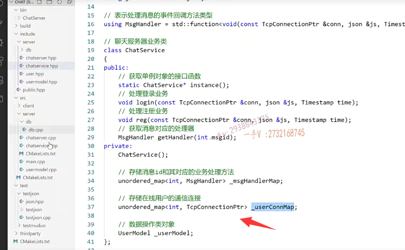
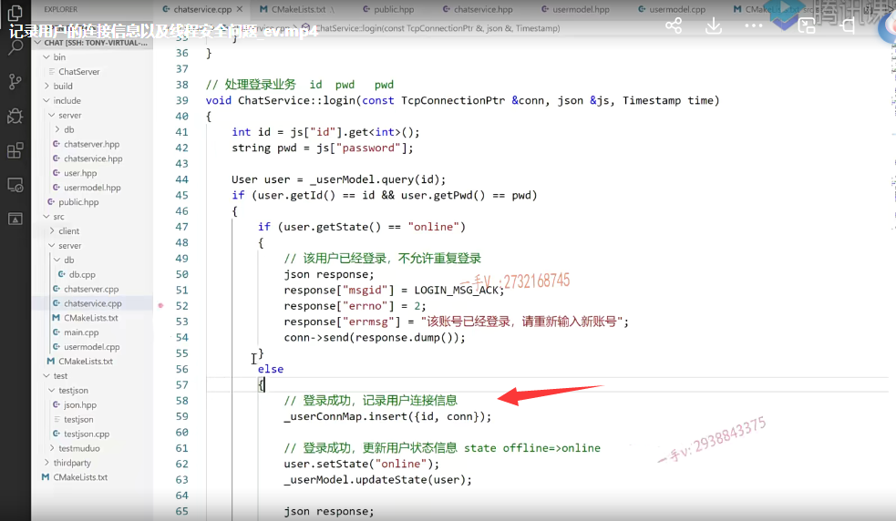
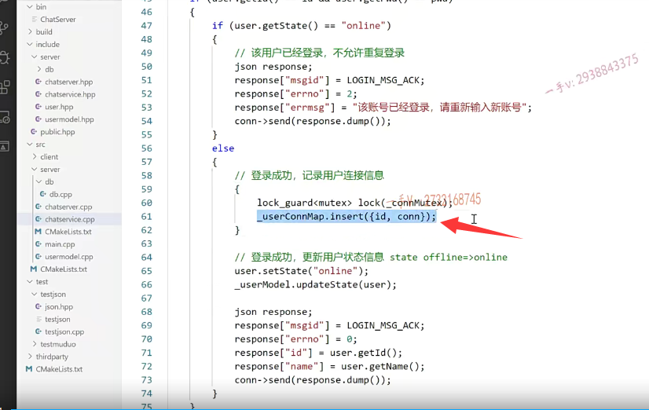

# 业务层的一个设计

这节课呢，我们再给大家讲一下业务层的一个设计啊，

这个设计是为了后边聊天，而我们主要做的是聊天项目嘛，对吧啊，

为了聊天来考虑的啊。

那当我发来一个聊天儿的话呢，就是比如说是啊，我们想在图上画一下吧啊。

这是我们的用户一这是用户二。这是这个用户二对吧？

用户一呢？把他给他的这个ID号，他要说话的ID号都发过去了，还有他说的这个消息是不都发过去了？

那么你想啊，这服务器相当于在这里边是不是要主动的去给二推送这条消息啊？

### 这个聊天儿呢，肯定是服务器推给我们另外一方的

二又不知道什么时候别人会给他说话，他不可能去服务器上去拉消息对不对？

所以呢，这个聊天儿呢，肯定是服务器推给我们另外一方的，

所以这也就为什么聊天儿服务器必须得是个长连接服务器，

==因为不仅仅只能是客户端请求啊，服务器被动接收，==

==服务器也是要主动推送消息到客户端的，==

### 二这个用户的他的这个连接connection在哪里呢

所以这里边呢，你拿到了这个用户的ID 2，你怎么知道二这个用户的他的这个连接connection在哪里呢是不是

### 业务层 去 储存这个链接

所以呢，我们在业务层这块儿啊，要想办法去存储一下啊，

==一个用户，一个connection就登录成功，以后呢，这个链接就建立成功了是不是啊？登录成功以后呢？那这个链接就建立成功了，==

成功了，这个链接就可以存储下来了。好的吧啊，这个链接就可以存储下来了，

#### unordered_map成员参数当然不能是引用，不要乱想

那么在这儿大家来看一下啊，也就是说在业务层这一块儿呢，

我还要再去添加一个成员变量就是存储在线用户的这个通信连接。

好吧，我们用的还是一个on order的啊un or dron order map。

这是用户的这个ID，用户的ID好不好？那另外一个就是这个TCPconnection ptr.

okay吧，这个叫user connection map.好的吧啊user connection map，

然后在这里边呢，添加一下就行了，

这个是非常简单的啊，哪里是登录成功了？

这块儿呢，是不是相当于就是登录成功了？

登录成功了以后呢？这个是登录成功啊。

记录用户。连接信息。点insert用户的ID是哪个呀？就上边那ID嘛，是不是啊？

或者你user get ID也行啊，都可以。

然后它的这个connection是什么？这不是了吗？

## map的设计  会涉及到多线程  线程安全

==就在这里呢。注意这个map的设计，到时候呢，同学们，这个map啊，==

==首先呢，它会被多个线程调用呢，==

==为什么这样说呢？因为在这里边on message本身就会被多个线程调用，因为不同用户可能在不同的工作线程中响应的，==

### 考虑它的一个线程安全问题

所以呢，这将来这个业务的方法，它本身就是会在多线程环境中使用。

==这个表里边涉及连接的有   用户上线，有 用户下线。==

==就是在多线程，这个map的访问，==

==所以要考虑它的一个线程安全问题。==

好吧啊，要考虑它的一个线程安全问题。

### 业务处理器 不涉及 线程安全

那么，在这个里边。就是在业务的这个里边啊，这个业务处理器啊，这个就不用了，

因为这个是事先都添加好了，这个不存在中间，

我们去给它运行的过程中去增加业务或者减少业务，对吧？

### 连接会随着用户的上线，下线会不断的去改变  一定要注意线程安全

但是这个连接会随着用户的上线，下线会不断的去改变。

OK了吧，所以它的访问一定要注意什么东西呀，一定要注意这个线程安全。

能理解吧啊，一定要注意线程安全，

因为我们给大家说了啊，

首先从网络模块on message本身呢，就是在不同的工作线程中被回调的，

所以这里边儿都是在多线程环境中执行的啊，

## 需要添加一个线程互斥操作

然后呢，到了这儿这里边儿呢？

多个线程用户并发同时登录的话，

这里边涉及多线程同时向map表里边增加东西。

==C++ stl里边的这个容器根本就没有考虑过线程安全，==

==所以在这你光这样写肯定是不行的，需要添加一个线程互斥操作==.

怎么添加？同学们想一想，那么在这里边呢？

同学们肯定能反映出来啊。用互斥锁是吧？其实上C++11里边呢，已经提供了像这个多线程的，这个多线程编程以及线程的互斥跟通信啊，互斥锁跟条件变量。

我们在这里边儿用互斥锁就行了。

实际上，在linux上，它底层用的就是pthread_mutuex。

你也不用自己加锁解锁了，解锁忘了怎么办？

对吧啊，一切呢都要自动释放资源。

==而你提供了类似于智能指针的这个lock_guard的就可以了嘛，是的吧啊？==

==在这里业务这个类呢，是一个单例是不是，==

所以我们定一把锁在这个对象里边儿就可以了啊。

包含这个include mutex。好吧。在这里边呢。

定义互斥锁保证。user connection map的线程安全对不对啊？

那么，在这里边就是MU tax啊，我们定义把这个connection new text好不好啊？

在业务这哎，访问的时候呢？

lock guard.看一下这个lock杆。

定义一个log guard的对象就可以了。好不好啊？

它构造函数有这么一个，你看构造函数就是加锁啊，析构函数是不是就是解锁啊？

诶，利用智能指针让它自动的去释放去吧啊

mutex在这儿呢lock。我们把这个给它就行了，

你看这个构造函数呢，是怎么接收怎么接收的？

引用还是指针来接收呢？引用接收对吧啊？引用接收那就OK了，

==那你要这样写的话，这一直它都保证到这个右括号。这是这个线程互斥的，没有必要啊。==

有的人问数据库这块的并发操作就不考虑了吗？

那当然不考虑了，数据库这块的这个增删改它的并发操作是由mysql server来保证的，这你放心啊。

呃，这块儿呢？合成这个json呢？这都是局部变量，

每一个线程栈都是隔离的栈，都是自己的，对吧？

不会产生什么冲突？

### 缩小加互斥锁的临界区

好的吧啊，所以只需要在这里边。只需要这个范围，这个范围的话呢，很简单，

同学们，这就是你通过做项目积累的这个经验。

加个大括号就行了嘛，大括号就代表作用域嘛，是不是啊？

==这一个作用域你看在这里边儿加锁，出了这个右括号 解锁，==

==刚好就保证了这一块儿，就是临界区代码段。==

==是不是我们说了线程安全，==

### 锁的力度一定要小

你不要一进来就加个锁出了，再解个锁是不是，

那你这多线程就变成一个单线变成一个串行的了，

你就没有体现出来并发程序的这个优势嘛，是不是？

所以锁的力度一定要小，不能扩大啊，

==进函数第一行加个锁出去，最后一行解个锁，没有人像你这么去写多线程这个程序的好吧啊，==

## 总结

注意在这里边呢。一是呢，在这个在C++高级课程里边儿，我都有讲过啊，

像这些lock guard呀，mutex呀，C++11的这个线程相关的内容啊，

在这儿我就直接用了啊，我们做项目不要在这儿呢，又讲解这个基本知识了啊，

那我们这个项目就说不完了。

### 编译一下

好编译一下，保证它这个编译是通过的啊。

OK，编译是成功的好吧啊，编译是成功的那么。

这节课呢，主要就是把我们连接相关的这张map，以及它的这个线程安全问题呢，

搞定大家要理解。

在这里边儿，我们做这件事的意义所在好吧。

