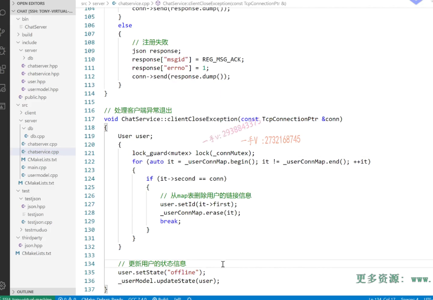
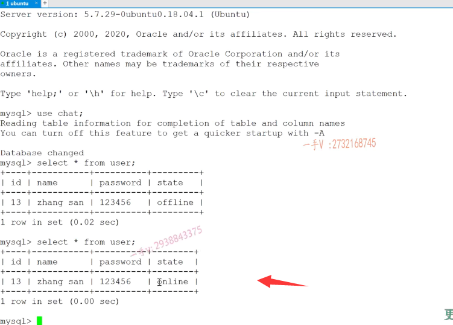

=我们现在相当于把这个聊天服务器的注册跟登录的这个业务呢，也都写完了，
而且我们通过手写json字符串也进行了一个功能上的测试。

啊，看起来是没有任何问题的，对吧？

而且登录这里边呢，会修改啊，用户的这个状态，

# 用户的异常退出

那这节课呢，我们再来处理一个跟这两个业务相关的一个业务啊，就是用户的异常退出

==用户的客户端在没有任何响应的情况下，直接给异常退出了啊，==

我们ctrl c是不是中断了？

在这儿呢，大家需要注意一下，也就是说它退出并没有发送一个合法的这个json字符串json请求过来。

而只是网络连接异常断开了，对吧？

因为涉及了修改用户的状态啊。要改成这个offline，

要不然呢，我们不添加这个客户端异常退出的话，后边我们在做业务的时候呢，

用户退出，用户的状态依然是online，

我们再进行登录，是不是就按照我们的业务逻辑就登不上了？对不对？

他永远认为该用户已经在登录状态。

### 如果用客户端啊，异常退出，它根本就没有发送一个合法的json消息过来

那么，各位在这儿看一下，这是我网络模块儿啊，

如果用客户端啊，异常退出，它根本就没有发送一个合法的json消息过来，

而是直接在这里边儿断开连接了，是不是？

所以在这儿呢，我们给他专门去写一个方法呗啊，专门写一个方法。

在这儿啊，专门来写一个方法。叫什么方法呢啊？

各位来看一下。叫做这个client close exception.client close exception

就是客户端。关闭是异常，关闭了好不好啊？异常关闭了接收一个connection。

好吧啊，给这个这个业务模块来写这么一个方法，

### clientCloseException实现

大家来看这个方法，我该怎么去写呢？先把这个处理客户端异常退出啊。cast TCP connection ptr.返回值就不需要了啊。

和这个方法在相应的源文件中，是不是去实现一下？

这又是另外的一个业务啦。

### 实现逻辑 步骤梳理

你看看。那这个呢？报上来的没有任何的数据，只有一个connection，

那这个我们只能是拿着这个connection啊。干嘛去呢？

是不是在它的这个connection的map表里边去查，而且不是查用户ID，

是查这个connection相当于整个哈希表搜索了，

但这个没有办法，是不是？

找到相应的这个用户的ID。

然后呢，做两件事情，一是把这个键值对儿从map表中删除，

二是干什么把该用户的数据库里边的这个状态信息从online是不是改成这个offline啊？

没问题吧啊好。

### 操作这个map表需要需要注意一下它的这个线状安全 别人可能也在操作

那么，大家在这里边看一看。

我们把这个方法实现一下，

首先呢，就是查找了注意呢，你有可能在这有的用户正在登录呢，

是不是有的用户正在登录，登录成功，

人家想这个表里边写东西呢？

#### 使用互斥锁

你现在异常退出了，所以操作这个map表需要需要注意一下它的这个线状安全问题啊。我们先写到这里。

### 遍历 查找 删除异常登录用户的链接信息

那么，在这就是先找了。这就整个是遍历的啊，

整个是要去遍历了。for循环auto。呃，要删除删除，还得用迭代器是不是？

来auto at等于什么东西呢？

等于这个杠user connection map的begin方法好吧？

it在不等于杠。杠user connection map的end方法，然后再加加it。

然后再比较啊if at指向的second，

==如果等于这个connection。这个相当于在比较这个智能指针的嘛，==

是不是这就是保存的是一个指向这个connection的智能指针啊？

那么。大家来注意一下啊。这个是异常退出，

是不是异常退出了以后？

然后在这我看看 相等了的话呢，做什么事情啊？

这里边就是从map表删除用户的连接。

嗯，连接信息就这个吧啊。就是杠user connection map点erase erase谁呀啊erase it？

对吧，这个就直接break了。

## 更新用户的状态信息

而关键在这里边还要更新用户的是不是状态信息呀？

### 先找到用户的id

这个用户是谁呢？

在这里边注意一下啊。用户呢是？

这个东西user这个是找到该用户了user点set ID就是at指向的谁first？

### 更新用户的状态

好吧啊更新一下这user点set state，现在是下线了，

这儿就成一个offline了。

### 这里传的是user对象，会根据user id 对象的状态来设置状态

对不对诶？然后在这用一下这个user model。它的什么方法呀？它的update state方法啊，

把这个user传递进去。

它就会根据指定的ID把它用户的状态是不是修改一下？

这个没有问题吧啊。

### 根据写入的sql语言来操作数据库

### 线程安全的临界区确定

### 用户user是独立的，map表是公共的

这块不需要做什么线程安全吧？对不对啊？主要是这块要做线程安全。

所以呢，我们把这里代码要放到一个作用域里边。

这样一来，这个lock_guard的呀，出了这个右括号，它就怎么样了？

它就释放锁了OK，

那user要定义到全局去，是不是啊？

就是针对于这个作用域来说，定到外边。

因为下边还要用啊。这儿进来。它能在这儿下线，证明他之前上过线，上过线肯定就在这个map表里边记录着呢，好吧啊。

### 如果没有这用户，就可以不用请求数据库

在这儿你为了呃，防止它出错，是不是你这儿可以这个怎么样一下啊？

就是防止它，万一那没找着这个ID就是个负一了，是不是啊？

get ID这不等于负一就是确实是一个有效的用户，对不对？

不判断也行，不判断也就这个SQL发上去呢，就没有找见这个人，没有找见啊，负一这个人

最后就SQL语句执行失败了。

==这块儿就是说呢，你如果判断它。这个不等于负一再发，==

==万一在这里边再没有找着的话，相当于就不用再向数据库进行一个请求了好吧啊，==

大家应该是能够理解这里边的意思吧。

## 测试

OK，那这个功能就实现完了，处理用户的一个异常退出。

那我们测试一下它的这个功能，看是否正确？

好这块呢是。登录什么了？登录成功了啊？

在这我们看看。启动这个服务器。

就先关掉啊。tell net幺二七点零点零点一六千这个端口。

然后是。这个相当于是。呃。大家来看啊。在这my杠u root杠p一二三四五六。use chat，select新from。from user就现在是张三一二三四五六

ID是13 offline是不是？好，我现在呢？

这个是登录成功的吧啊，这个现在是登录成功的。好吧，

### 两次响应返回

==登录成功了，以后拿到了用户的这两次连接数据库，是因为第一次拿到ID获取了查询了这个ID的用户信息，完了以后呢？==

==密码验证成功，顺便呢，把它的状态是不是又改成online啦，==

那我们再查一下，看看有没有修改成功，

修改成功了没？是不是修改成功了？

### 测试异常退出

修改成功了以后，我现在这里边算是异常退出啊。

这客户端现在异常退出了，异常退出呢，

#### 数据库登录状态信息 又修改为下线

在这里边儿应该还有一次，应该又有一次数据库的，是不是访问啊？

这应该又改成这个offline了。

没问题吧啊，那就证明我们这个客户端异常退出业务处理呢，是一个正常的。

好的吧啊。okay，

==那现在呢我的这个张三人家是依然可以去登录的啊啊？依然是可以去登录的。==

okay，这就是登录成功了。

好。quit依然是offline，这个就没有什么问题了啊。

## 总结

好，这节课呢，我们呢，主要目的呢，就是处理一下用户的一个异常退出，

在这儿业务代码，这个逻辑你是否明白，对吧？这个不复杂啊，

你把这块儿的功能也补上来去测试一下啊。