# 一对一的这个聊天业务

这节课呢，我们继续来开发下一个业务，

就是这个一对一的这个聊天业务啊。

聊天业务发送过来的，这个数据的这个json都包含哪些字段呢啊？

首先在这里边，我们添加一个就是。聊天啊，聊天就是一对一的one chat

还有group chat呢，是不是啊？就是群聊

one chat message这是聊天消息啊，就后边可以把这个逗号就直接带上，这是聊天消息。

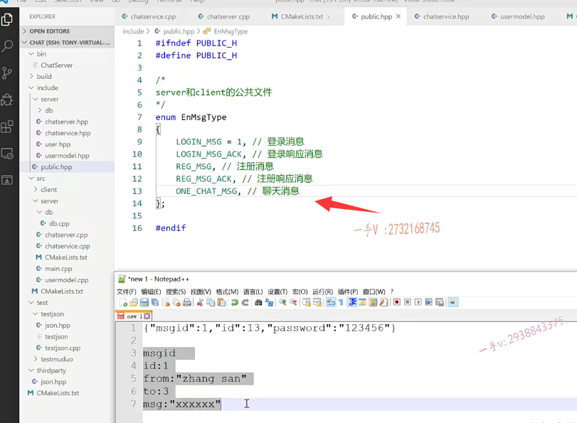

那么。当我们登录成功以后，我们登录都是用ID号登录的嘛，

是不是聊天的话应该会发一个？

首先是message的这个ID对不对？

还会发一个这个from。发一个ID。from这个ID就是我跟你说话的话，这个ID就是我的这from的话呢，我还可以把我的名字带上，是不是啊？比如我是张三。

然后to就是你的，你的ID是3 

message。咱们这样来组织呢，这个聊天儿的一对一聊天儿的这个json消息，

这就可以了，是不是应该是过来了以后呢？

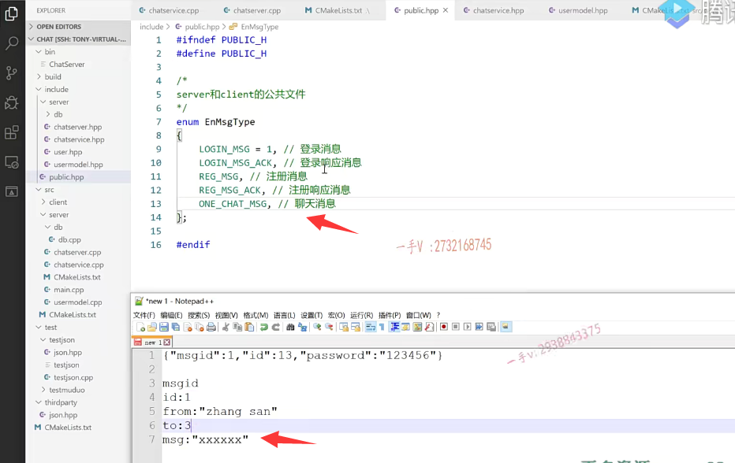

我要先找啊，你的这个用户呢？在不在线？

如果在线的话，直接找到你这个用户对应的这个connection，我们所有用户的connection是不是都存起来了？

如果不在线的话呢，把这个存入这个离线消息表里边，等于下一次呢，你上线以后这个消息呢，会通知到你的。

是不是应该就这么一个逻辑啊啊？好逻辑，业务逻辑理顺了，以后呢？

# onechat

我们来着手开始呢，把这个代码来输出一下啊。

首先，在这个业务这一块。

我在这首先得把这个一对一聊天业务方法得先写出来one chat。

因为是由网络层派发过来的，这个处理器回调，所以他们的参数都是这个样子的，

是不是啊？

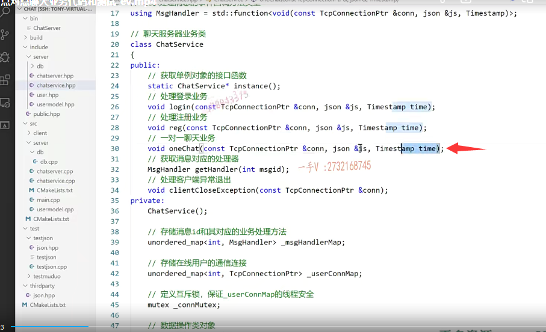

## onechat()实现

然后呢？我把这个方法呀，在相应的业务层呢，我来实现一下啊。我来实现一下。

chat service.这个代码越来越长了啊。

把这个导航往这拉一点。方便我们切换啊。

### 构造函数里边 将 事件号和事件回调绑定 放到map表

然后呢，在其这个构造函数里边呢，我们是不是要把这个什么呀？相应的消息ID以及处对应的事件处理器是不给它绑定起来呀。

one chat message rs TD and. chat service的什么方法呀？

one chat方法绑定this一二三个参数。

这就好了吧，否则呢，这个消息呢，派发不出去啊，没有绑定事件处理器嘛，是不是好？

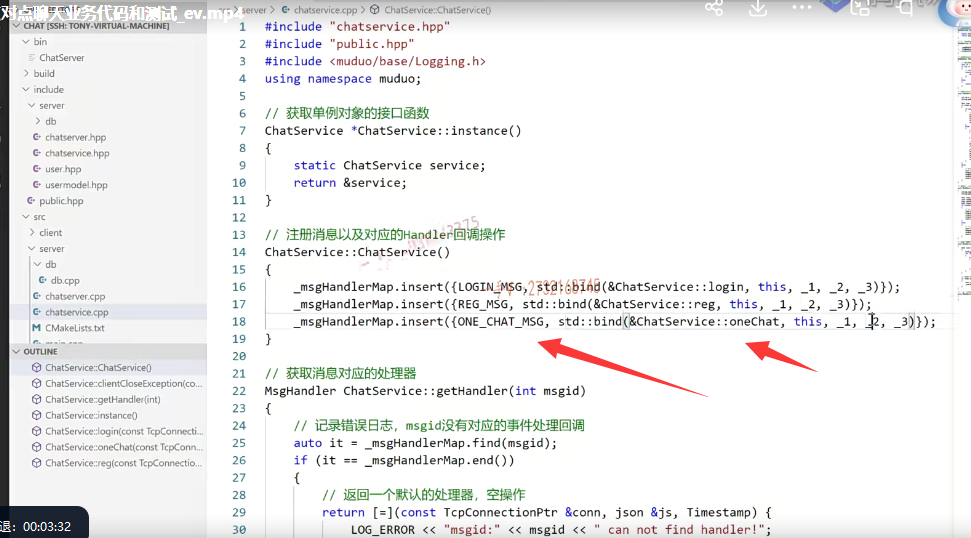

### 先获取toid

那在这里边呢，大家来看看啊，我们所做的事情呢，就是先获取什么东西呀？

先获取这个to字段int to ID，也就是对方对方的这个ID是吧啊？

就是pi嗯，就写to ID吧，等于json。

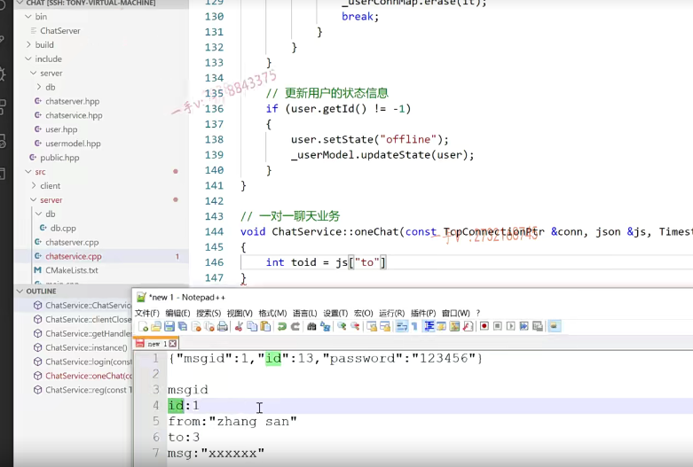

我们写成这个样子吧。啊，这个是from ID。from name.to ID吧。好吧，这样字段有点太长了，是不是那咱就按这个来，反正你客户端跟服务器要约定好就可以了啊，这个点get。

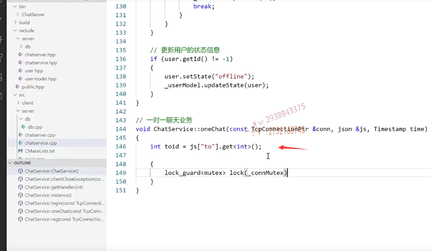

### 这个表上去找这个ID对应的这个connection 注意线程安全

okay，这个完了以后呢？

嗯，然后要在这个表上去找这个ID对应的这个connection是不是诶？

在这里边呢，就需要用到这个lock guard啦。

lock guard，因为你要访问那个连接信息表了，这必须保证它的线程安全好吧

lockguard conn的mutex。

完了以后呢auto。auto at等于谁呀？等于这个user connection map点find谁find这个to ID是不是？

如果这个it。就是什么东西呢？find出来了以后啊，find出来以后这个it等于杠user connection map的这个end。

这个表示呢，to ID。啊，不在线。

就是没有在这里边找到connection map，里边找到是不是啊？

这个表示什么呀？表示to ID在线转发是不是消息呀？哎，转发消息。

好的吧啊，转发消息。在这里边这样处理一下就可以了。

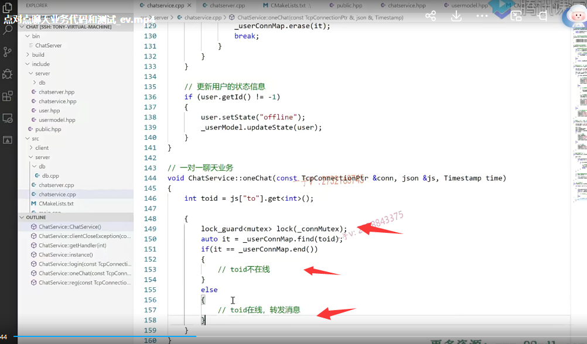

好吧啊，但是呢，我们在这一块啊，不在线的话，存储离线消息啊

to在线的话就是转发消息，

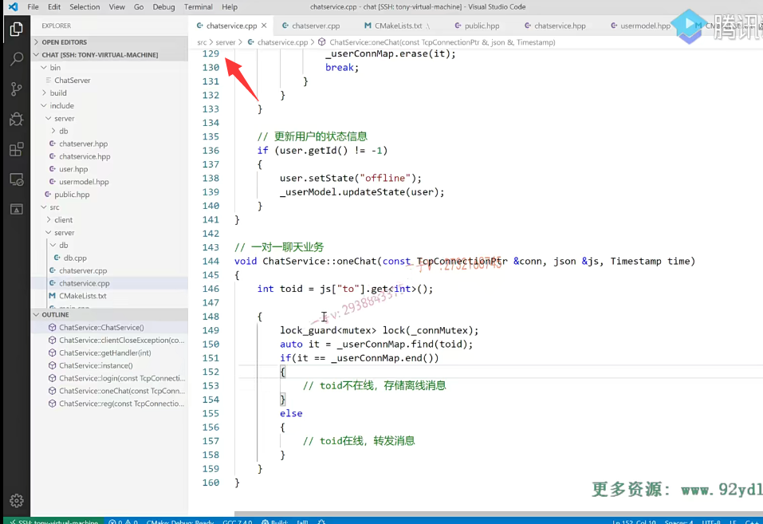

### 使用局部变量bool值  来降低锁的力度

是不是这个存储离线消息跟转发消息并不需要都处在这个互斥锁的这个情况下，

互斥锁这里边儿要保证的线程安全，是围绕map表相关的操作，

所以这里边儿一查一比较得到的状态，以后呢就不需要了。

OK吧啊，就不需要了，

那在这一块儿呢，我觉得呢，应该我们应该这样做会比较合适一点，

布尔值就是user state等于个什么东西呢？等于个FALSE吧，

好吧，如果是在线在这里边呢？user state就等于true。

就是不等于end的话呢，在这儿。我就这样子做。好的吧，

完了到后边来的话呢，这user state啊，在这我再这样去写。

大家来看看啊。也就是说呢。我们需要加锁的，只有这一对儿锁的力度要小的嘛，

对不对？这块儿是可以并发执行的嘛？是吧啊，

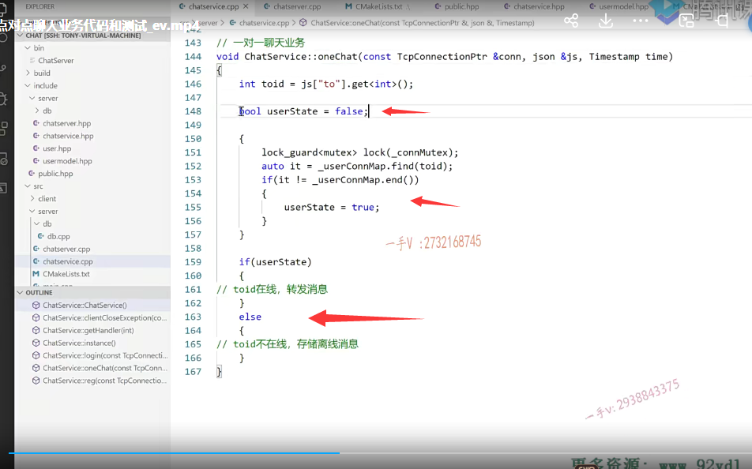

这个one chat虽然是在多线程环境中调用，但是这都属于局部变量啊，是不是啊？

这个是标识用户是否在线啊？

对吧，你看看啊。这个不等于end，是不表示找着了呃，找着的话，我还得用它的什么东西呀？

找着的话，我还得用它的这个connection。是不是啊？

==找着的话，我还得用它的connection，==

而且有可能呢，在用的时候在其他地方是不是被删掉啊？有，

### 上面考虑错误，不能定义局部变量来做

所以我们这儿考虑的不正确，各位。sorry啊。这个是在线。不在线。

不在线的话呢，就存储呢，离线消息表啊，

不需要这个了。大家注意啊，

==刚才在这呢，一个失误就是。我如果呢，把发送的这个connection啊，放到外边来的话，也就是说呢。它有可能呢，在我发的时候呢，或者是没发或者正发的时候，这个connection已经被移除了，对不对啊？这个不行啊，==

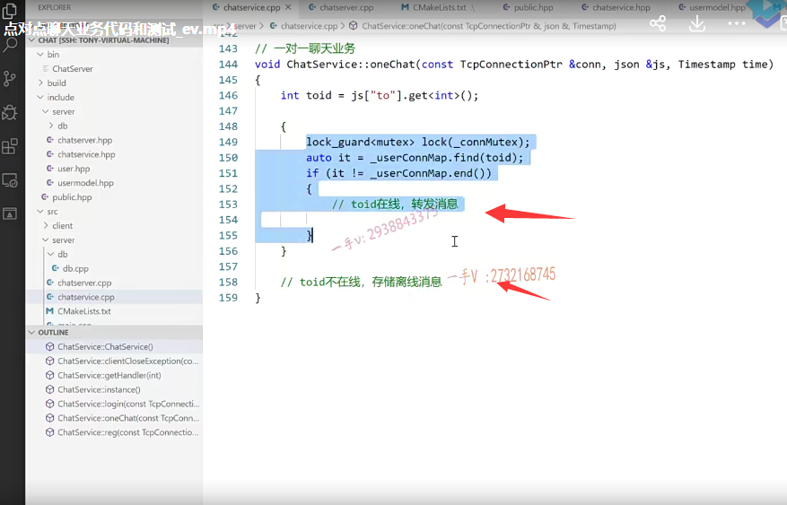

不行在这里边，我要保证它的这个线程安全的这么一个操作好吧啊，线程安全的这么一个操作，

#### ==有个疑问，那就是如果别人这时候登录上来，后面还处理存储离线信息吗==

那么在这儿呢，各位来看看。

发送消息，发送消息完了以后，这儿我是不是就return了？啊，return了，

不管是这return还是出这个右括号，反正呢，你这个lock 栈上对象就离开作用域了，

就会析构，就会去释放这把锁啊，

如果呢，你这儿没进来？那就出来了，不在线存储是不是离线消息啊？

==这个离线消息我们后边儿再开发这个功能点啊，在这儿我们先来去转发这条消息，==

### 去转发这条消息

大家注意啊，我在做业务的时候呢，很多地方的这个考虑啊，有它的这个优缺点，是不是啊？

有它我们该注意的。这个没有考虑到的，

大家注意，我们这么一个思考的过程好不好啊？

要在开发项目的时候呢，要让自己的这个逻辑呢，变得更严谨一点。

这个在线的话，转发消息呢，这个就方便了，

这原封不动的，直接转发过去就行了是吧？

at指向的second是不是就是to用户对应的一个connection啊？在它的send呗。

发谁呢？就是这个a给b发，a发到服务器上的消息，原封不动的，再发给谁就行了。

再发给b相当于服务器在这里边做了一次消息中转嘛啊，

这里边是服务器主动推送消息给to ID用户就是b用户。

好吧啊，这就直接return了。

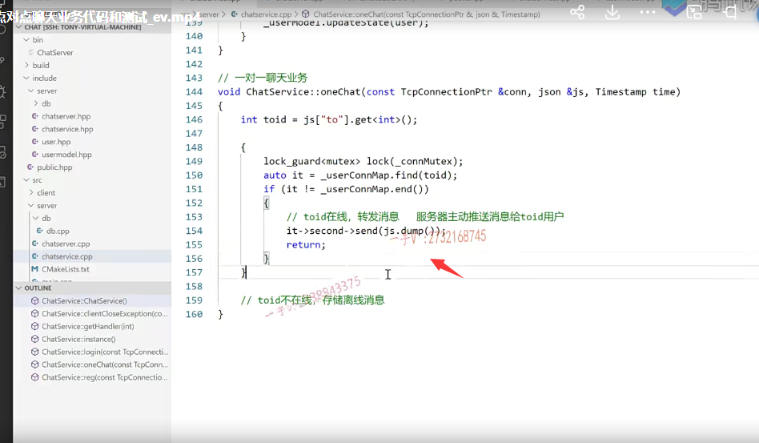

## 测试

这个聊天业务的话，在数据层不需要什么嗯，新的代码开发啊好，

我们来测试一下其聊天的功能是否正确？是否消息能推送过来？

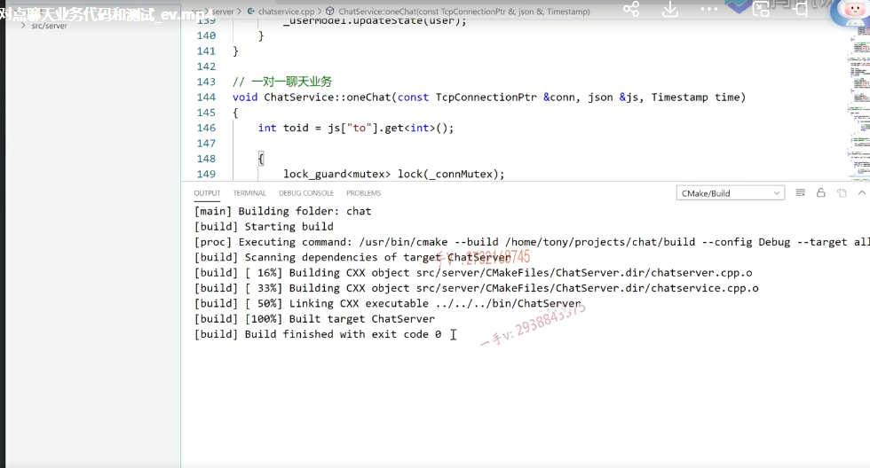

好诶，这块刚还在运行着呢，那就没有办法去覆盖，是不是可执行文件了？

所以在这呢，我们。重新去编一下吧啊。

这没有重新编，那有可能是被覆盖了，是不是啊？

### 测试2个用户登录  

#### 再注册一个

那咱测试一下功能吧啊，测直接测试一下功能。启动服务器。

这个要先进行注册呢，是不是？

注册的话，注册的消息是个几啊？我们现在没有客户端，只能手写json了啊，注册是个一二三，

是不是三号消息？注册是三号消息，有name。李四。password.六六六

啊好。

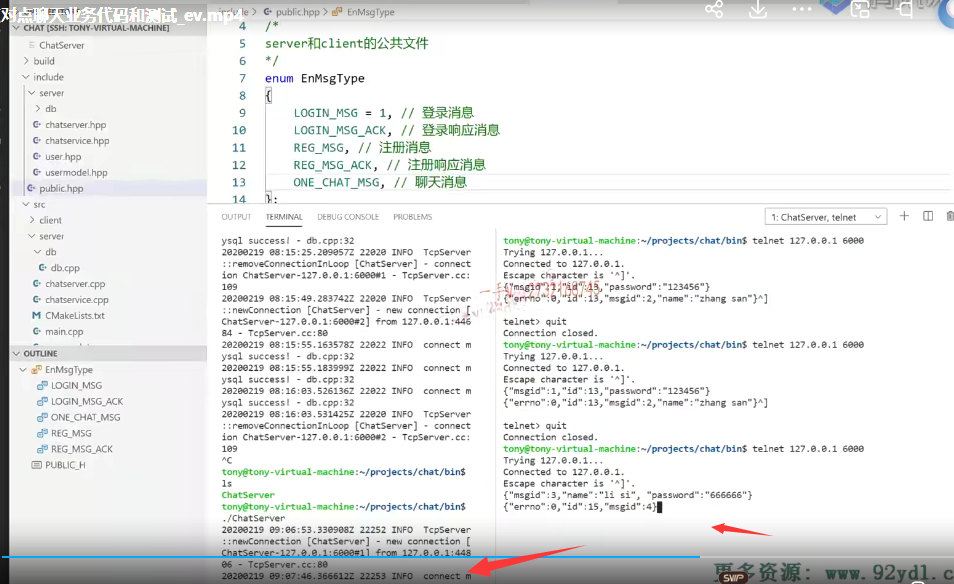

这个是一个。这是一个登录的消息，是不是啊？这是一个登录的消息OK，

那我们来看一下啊，首先呢，我们来给一个注册的消息吧。

这个注册成功了是吧？来看一下啊。

这是张三跟李四现在就都有了，一个是13，一个是15

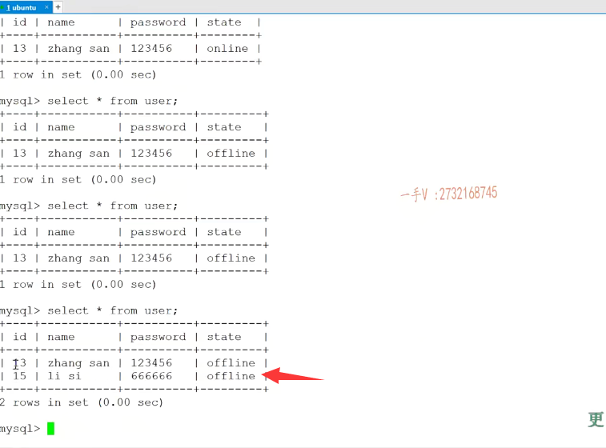

#### 登录2个账号

好吧。

那。现在我先让这个退出去，现在我就有两个用户了啊，我这个用户。

我先登录。是13。这个相当于是谁呀？

是张三登录了是不是？好，

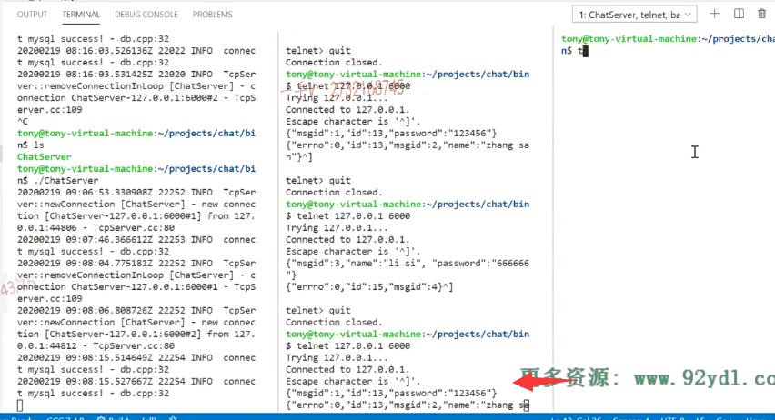

再来看一个幺二七点零点零点一六千，这个现在是李四要进行一个登录。

李四进行登录的话，它的消息应该是一个15然后是六六六。对了吧。登录。

这两个都登录成功了，是不是啊？登录成功了。

我们看一看。都是online的，是不是这个状态呀？

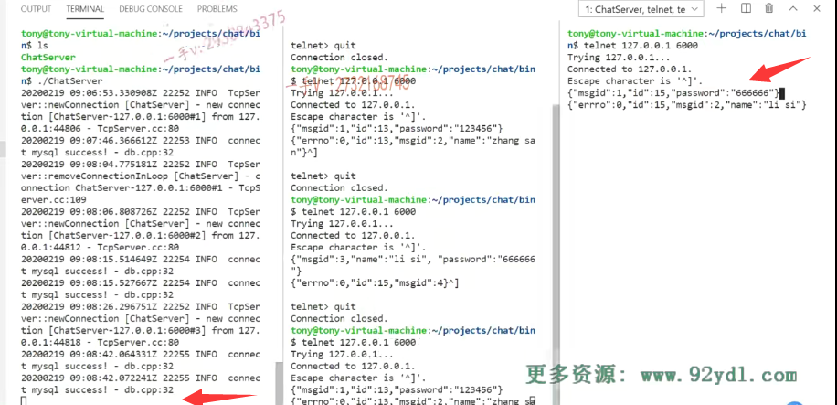

### 测试聊天信息

好，现在我要发一个聊天消息啊。发一个聊天消息的话，聊天消息就是

首先是message ID为几呢？聊天消息，一二三四五是不是五啊五？

然后呢？对应的这个就是i did是我，

那我现在张三给李四说。那就是张三是13对了吧？

然后是from from是谁呀？from是张三。

然后to是谁呢？to就是李四是15对吧啊？

然后在这里边呢，还有一个message，message是什么呢？就是hello。

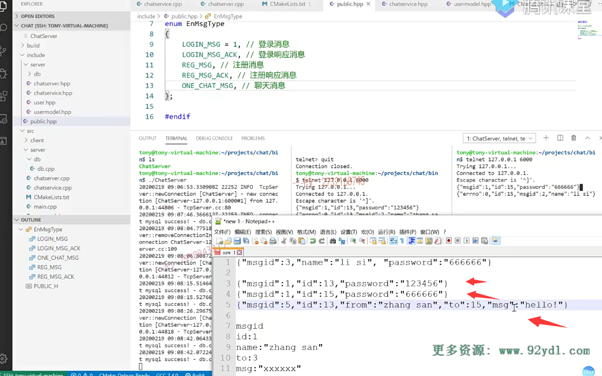

我们就发个这吧，你看message ID是5 ID是13张三的ID，张三的名字呃，对李四说消息是hello啊。

好，那我应该是在中间的这个张三这儿。

发送大家来看，是不是过来了？

通过服务器中转以后from张三这李四这from张3 ID是13。message是hello啊。

图是15，这相当于就是接收到了张三给李四就是当前的这个用户说的这个话了，信息就是hello，

我们在客户端进行相应的解析就可以了，

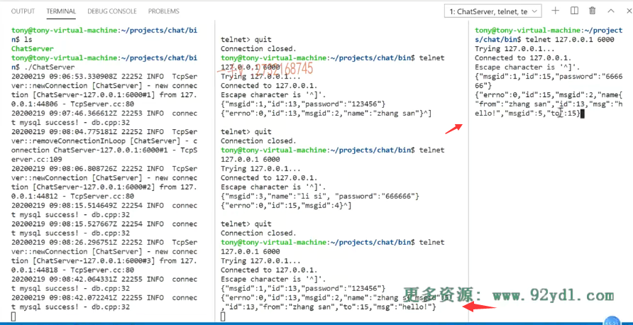

那也就是说这个聊天呢，是没有任何问题的，

### 再来测试一下回复

我们来再回复一下啊，再回复一下。回复一下的话就是。就是15啊，这个就是李四对吧？李四。to谁呢？to 13。这写的挺好的啊。对了吧，消息是五就是李四是15，李四这个名字给13，这个用户15啊。

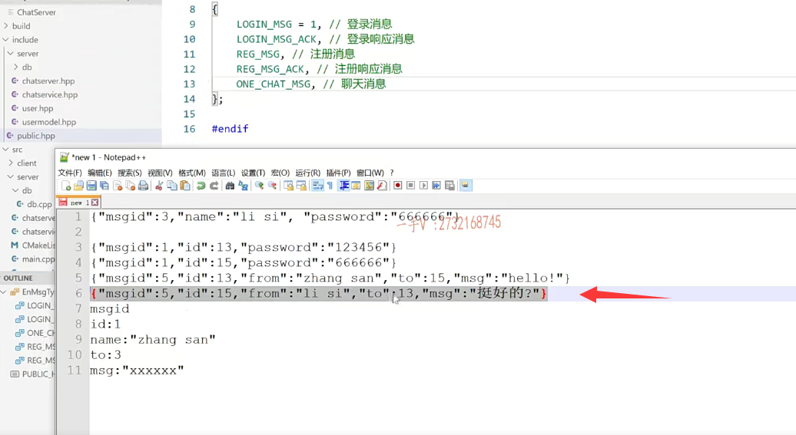

#### 出现问题  这个由于字符编码的问题  中文出现解析失败

哎呦，这里边呢，怎么啦？这里边是出现了一个什么东西呀？

这里边是出现了一个问题是吧？

服务器怎么样啊？直接给挂掉了啊？这个是pass error at line one column 57 cte x error will passing value。invalid string.beta last RAY

哦，在这里边就是。我们的这个数据呢？在解析这个消息的时候，就这一块中文的时候啊，

由于字符编码的问题。就是这个由于字符编码的问题，就是json库解析出现问题了。好吧

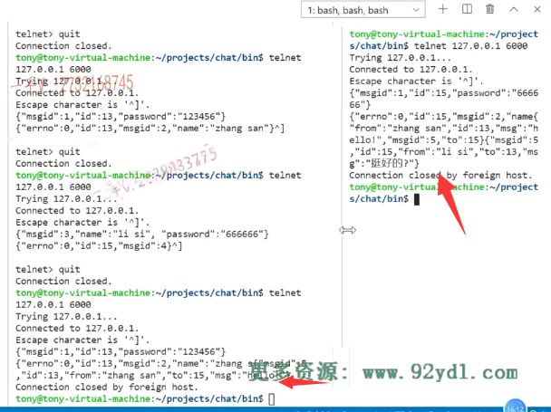

json这个库解析数据出现问题了。

那这个我们没有办法好吧啊，这个我们没有办法，

这儿如果说是这个英文的话，那肯定是没有啥问题的啊。

这个不是我们这个项目代码上的问题，是json这里边儿解析出错了啊a列ill formed，就是格式不对啊，格式不对。好，

## 总结

那我们就不关注这里了啊，不关注这里了。

这个就是聊天业务啊，聊天业务到这儿的话呢，那就没有什么大的问题了，好吧，

各位啊，你把这个聊天业务呢，跟着我们这节课啊，这个代码上的一个书写。

你也测试一下，看这个聊天业务是否OK啊？

后边我们再写这个存储离线消息，

这节课的内容就给大家说到这里。

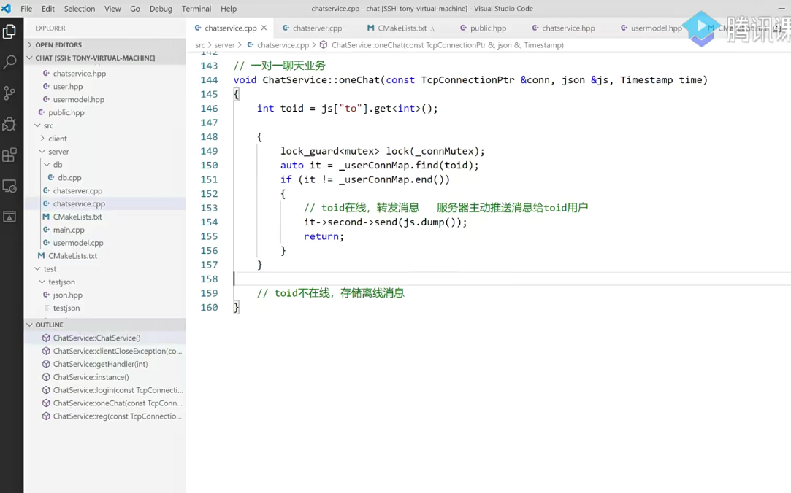