存储离线消息的这个功能

这节课呢，我们把这个我们聊天服务器的离线消息啊，

存储离线消息的这个功能做完。

首先呢，在数据库的设计上，我们有一个表是专门存储离线消息的offline message好吧，

这里边这个表比较简单，我们在这里边就不写那个跟user一样的那个orm类了啊，

就直接写这个model类就行了。

就是提供呢，给业务层提供相应的这个封装的方法就行了啊，把业务代码呢，跟数据库代码分离开。

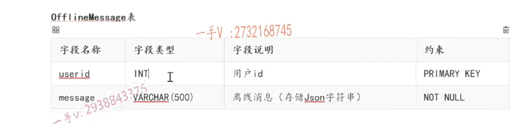

ID就指的是用户的ID，

这是给这个用户的一些聊天的消息，不管是呃，点对点聊的还是群聊的，对吧？

我们直接在这里边儿就是存储呢，人家。个人或者群组消息转发过来的，这个json字符串存到这个表里边儿就可以了。好吧啊，

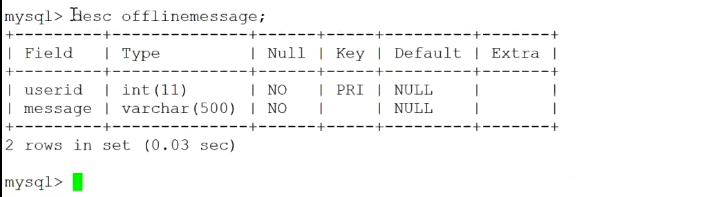

那么大家把这个表呢，可以创建一下，就是在这里边，你看dei c啊fly message这个表两个字段啊user ID和message。

当用户呢，不在线的时候，我们之前写了聊天儿业务，

在这里边儿呢，要存储是不是这个离线信息呀？

那么，当用户在这里边登录成功了以后啊，登录成功了以后啊，

在这儿检查就是该用户是否有哎，就是查询。

查询该用户是否有离线消息啊，

要有的话呢，你就直接装在这个json里边，是不是给它带回去啊？

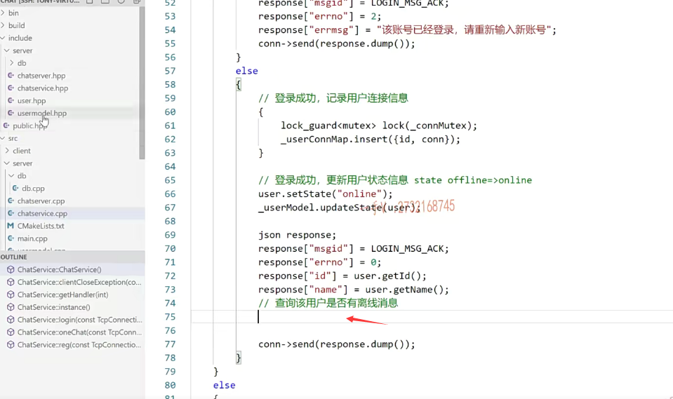

## 创建一个model类 offlineMsgMode

对啊，那在这儿呢，我们就得先创建一个model类了啊，

创建一个model类了。叫做offline message model点hpp。

这个名字稍微有点长啊。

if no,define of line.message.model.define.

你看我们这个。user model啊，都是这样命名的，对不对？就统一起来啊文件名字 杠h。

### 成员方法

然后呢？我们大家来看看啊。这块呢，去写个class of linemsg吧。短一点啊，要不然太长了。

这个是提供离线消息表的操作接口方法啊。

public.这里边首先有存的，是不是啊？

存储用户的离线消息，离线消息读取以后给用户返回以后，

这里边是不是就要删除啊？因此还有删除的功能啊。

存储void就是insert呗啊，insert一个是user ID一个就是什么呀？message.

好的吧，还有什么功能呢？删除用户的离线消息已经返回给用户了啊，就不要再存储了，要不然呢，每次用户上线呢？都会去怎么样啊？都会去给人家用户返回，是不是啊？

using namespace STD.这个是delete啊，我们写个remove吧，

要写delete跟C++的关键字重复了啊。

这个就是user ID删除该用户所有的这个消息好不好？

呃，这个还有吗？还有查询呢，是不是啊？

查询用户的离线消息。

用户的离线消息可能不止一个，可能有多个。

对吧啊，可能有多个的，所以在这里边我们用一个容器来存储吧。

用一个list容器来进行一个存储，也就是说这里边儿放的是pu ery query I int user ID，这就是我们写好的这个接口方法。你给一个用户ID，我给你查这个用户的所有的离线消息，是不是给你放到这个里边儿啊？

唉，给你放到这里边儿。

==或者你用vector也可以。用vector吧。大家用的最多，而且可以直接付给json，也从json里边可以直接序列化数组数据给到这个vector，对吧？==

比较方便啊。

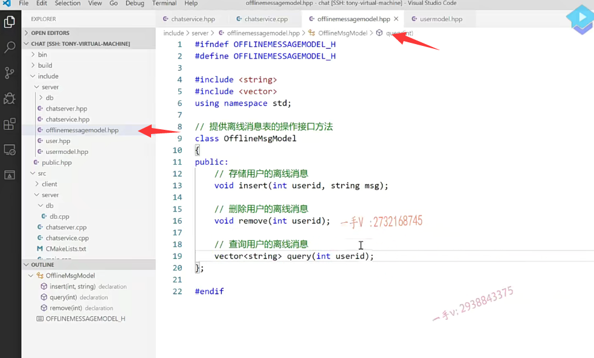

## offlineMsg类实现

好，那在这里边，

我们得定义相应的什么啦？new file就是offlinemessage model点cpp。

再稍微长一点啊。include offline message h tp啊。

这三个方法呢？大家来看看啊，我怎么去实现呢？

这里边肯定得包含数据库了。db点h是不是db点h啊？

然后呢？这个是类名叫什么呀？类名叫？再来一个。

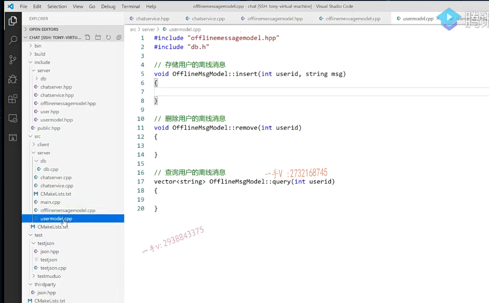

### 实现insert()方法

先来看插入啊，跟之前的我们借鉴一下都比较相似的，

#### 组装sql语句

先组装什么东西啊？先组装sql呗，是不是？

insert啊，插入拿这个来说吧。在这啊组装sql 

insert into offline  message看是不是这个表名要确定好啊？offline me message啊。

没错啊，insert into这个。不用写字段了，因为两个字段都要插入啊。

values第一个是个百分之d。

第二个呢，是个字符串。就刚好是这里边的user ID和这个msg。

好吧。这个完了以后呢？

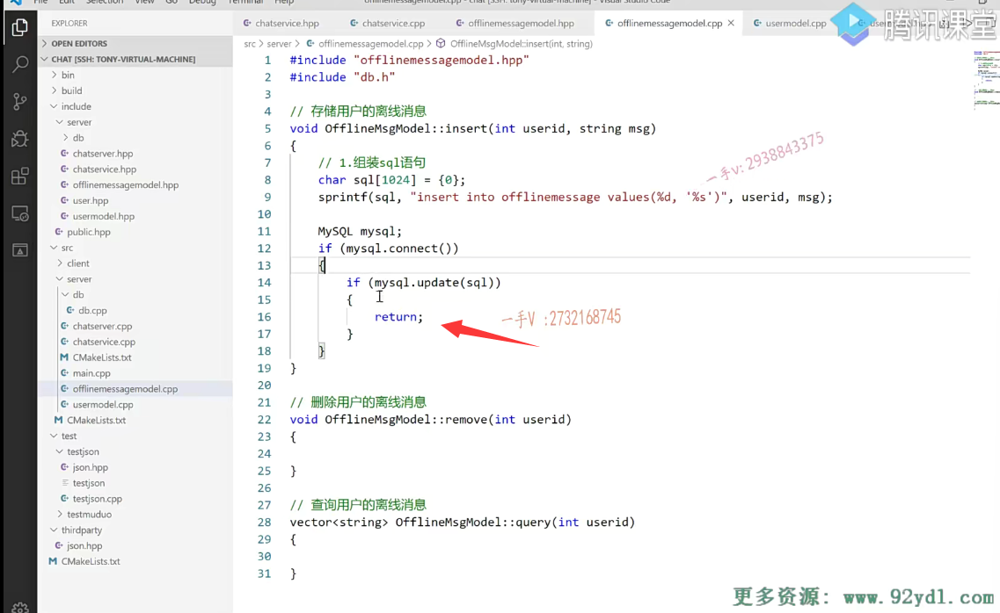

这儿不需要获取什么东西啊，这儿直接是return。这个就完了。好的吧啊，这就完了完了，这也不用提前return啊，

这就直接update一下就可以了。

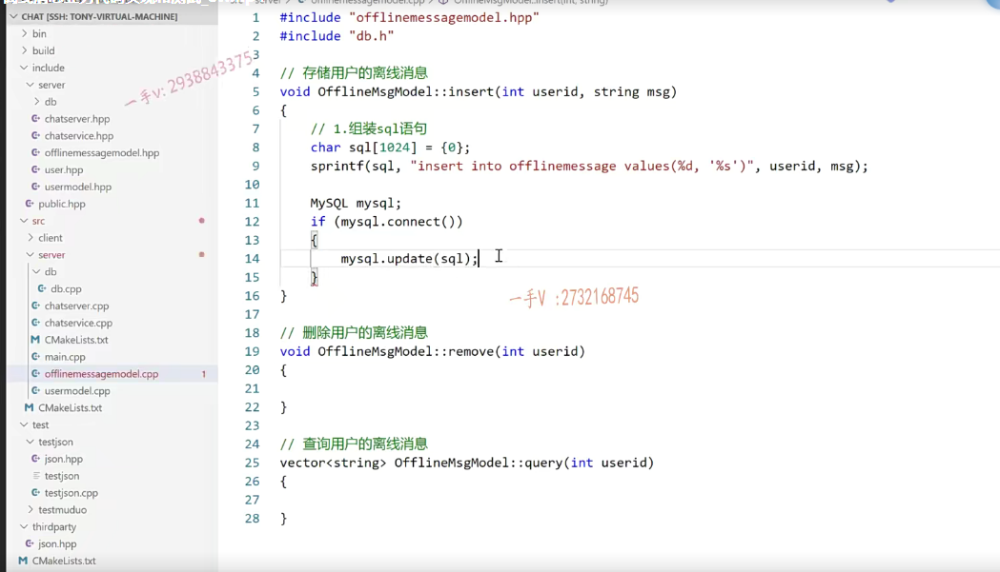

### remove方法实现

insert into offline message values一个是ID一个是消息啊，

然后是connect。

然后在这里边update一下好第二方法，

这是remove啊。remove也是一个update嘛。

这delete。from.delete from or fly message.where?where ID.不是ID啊，是什么？

那你要看你具体建的表啊，是user ID好吧？user ID。where userid等于百分之d。

就是这个user ID。

delete from offline message where userid等于这个是不是

连接update一下好，这也是没有任何问题的，

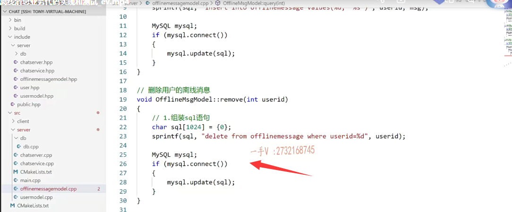

### query()实现

最后一个是个查询啊，查询操作是需要返回值的。

在这里边。我们看一看select星from user from什么呀？user ID.这也是user ID。

这里边现在呢，并不不是只有一行了，它有很多行。它是不是有很多行啊诶？

我在这儿呢，还要定一个什么呀vector，

因为我要把这个东西怎么样返回回去是不是？

啊，如果没查着的话，那就是个空的呗。空的那就返回空的。VC.

好吧，在这里边要读取多行啊，把多条把user ID用户的所有离线。消息放入vector中。中返回。

这个意思能够理解吧啊connect query做这个查询。根据这个ID呢查询，该用户所有的离线消息好吧，来在这儿大家来看一下啊，

#### 返回多行信息

首先呢，不是一行了，而是多行了，是不是？而是多行了。

呃，而且在这儿呢，大家来注意啊vector里边儿主要用的是该用户的离线消息，所以不要select *了。

直接select什么呀？select它的这个message就可以了啊，就只需要这一个字段的数据。message select message from offline message where userid等于这个。

那这个就是应该这么写了，各位。

while什么东西呢？row.等于。不等于谁啊？不等于空。好吧。

就fetch 1行一行往外拿嘛，是不是啊？这只选了一个字段，所以选择row零就可以了啊。VC点push back。什么东西呀？是中国二零就行了。

好不断的拿不断的往里边添加，添加完了以后呢？

那就okay了啊，

那首先把资源释放一下free。free resol t好不好？把这个res资源释放一下，释放一下，

以后把这个VC返回回去。啊，在那在这呢，也是返回这个vec。

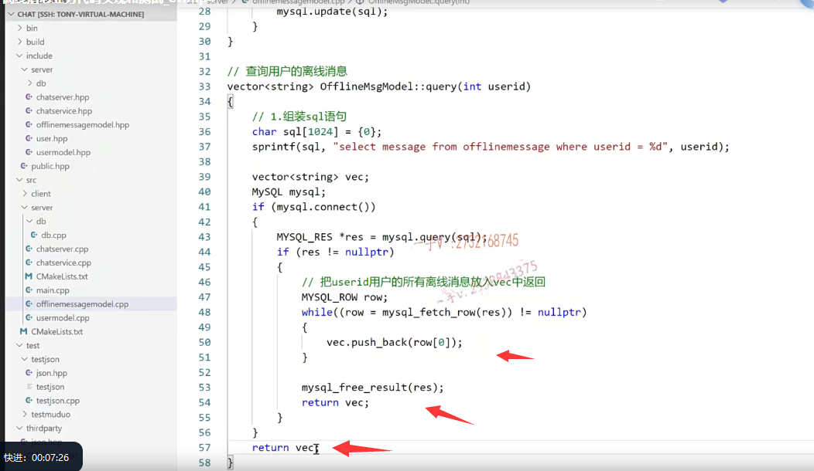

好吧啊，这块就有插入数据，如果说是进来这的话。就有插入数据。

实际上，如果这样写的话呢，那我们这儿是不是也不需要这个了啊？要不要都行？

在这儿呢就。这个必要的话，这下边就可以了是吧啊？加上也可以不影响。

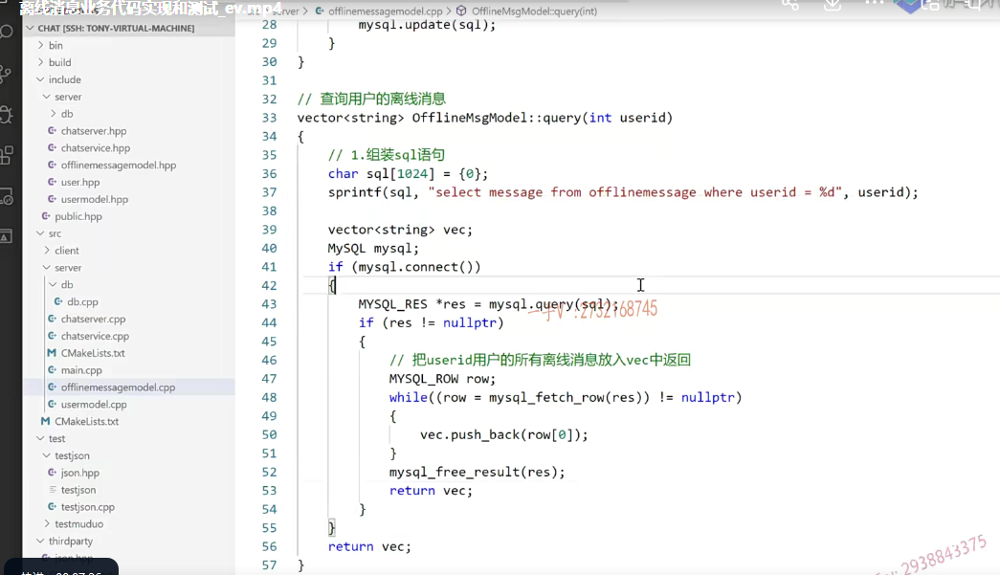

大家来看一看整体的这个思路。根据user ID从offline message表里边查message啊。

循环，

因为它可能存在多条。都往里边一个vector里边放。放到vector里边儿的话呢，放完以后把这个资源释放掉，释放掉以后呢，

再返回这个vector vector里边儿就放了所有的这个离线消息。

## 实现一对一聊天业务的存储离线消息

那么offline message这个。model层的这个代码，我们就都写完了啊啊，是否正确？

这个还有待于我们去验证一下啊。在这我们就可以。用一用了。

首先呢，要在我们业务这里边啊，包含谁呢？包含offline message model点hpp

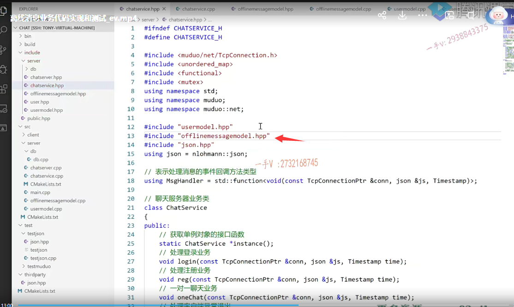

还得再增加一个什么offline message model。杠off。line message.message model.

增加这么一个。model对象啊，

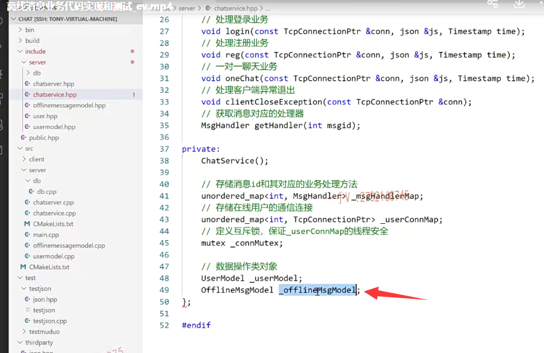

然后在这儿呢，我们就可以存储了insert insert谁呀？

我要给谁说呢啊？谁的消息啊？two ID的是不是离线消息啊？消息是什么呢？

消息就是这个json嘛？你把这个json呢，

我直接给它存到这好吧，就是dump。

就是存储离线消息。没问题吧啊。

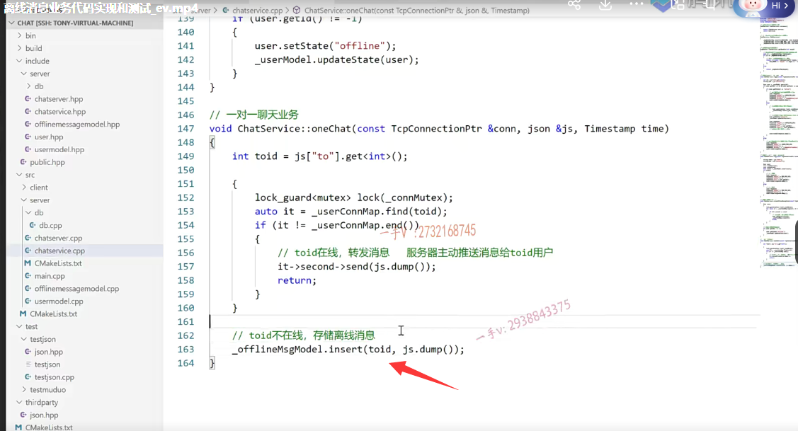

## 处理登录成功后获取离线消息的逻辑

然后呢，在这里边登录这里边呢，我们要用到vector是不是啊？

首先呢，就要包含呢？vector using name.space std.

然后在这里边怎么样啊？登录成功以后登录成功是在这儿吧诶，是在这儿。victor.string.vec=offline message model点什么啊？query

查谁的呀？查哪个用户呢？就是查当前用户的是不是啊？查当前用户的。就查当前用户的。的ID就是这个ID嘛，或者说是你user点get ID，这俩现在是一样的，才进来了。

### vec不为空，json值就直接是vec，因为也可以反序列化

是不是啊？如果vec它不怎么样啊？不为空。

不为空我要给里边添加什么东西？

也就是说，如果这个离线消息是空的话，我们根本不会去带这个字段，

如果不空的话，我们就会有带这个字段fly message

带这个直接把vec可以给它，之前我们给大家说过用这个。

人家的这个第三方的，现在的这个json啊，json库是可以直接跟容器之间进行序列化，跟反序列化的非常的方便。

好吧，这就带回去了啊，这个就带回去了。

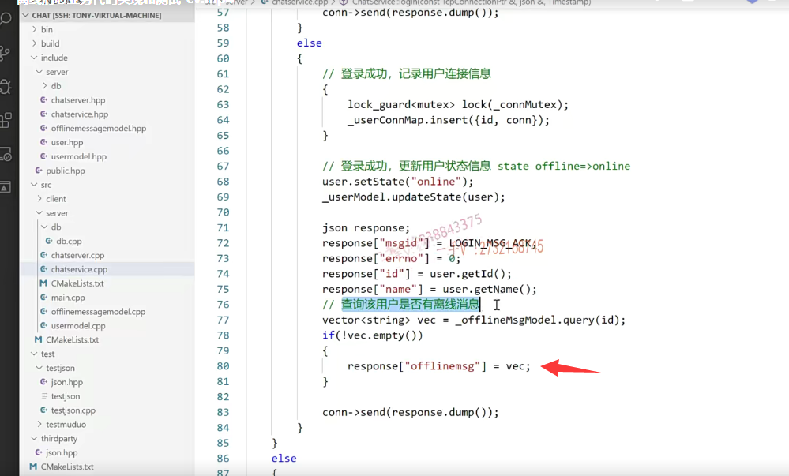

查完之后，发送后，删除数据库中的离线信息

OK，在这里边儿查询完该用户是否有离线消息的话呢啊？

这个如果为empty就表示没有离线消息，

如果有的话呢？在这儿查完了以后。

我要干嘛呢？点remove.把该用户的离线消息。

读取该用户的离线消息后。

把该用户的所有离线消息删除掉。

要不然这个用户以后每次登录是不是都有之前的这个离线消息存在啊？

这个就是业务逻辑就不正确了啊。

业务一定要是把业务的逻辑先给人家想清楚。

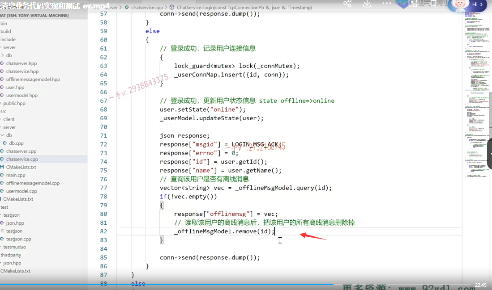

## 再次梳理一下

好了，那这块呢？离线消息这块的业务，我们是不是就写完了？

那我们再捋捋一下啊，捋一遍，

首先呢，我们给这个offline message呢，提供了相应的insert，remove和这个query的这样的这个接口方法这张表里边儿不需要更新，是不是啊？

不需要更新就有离线消息就存进来就可以了。

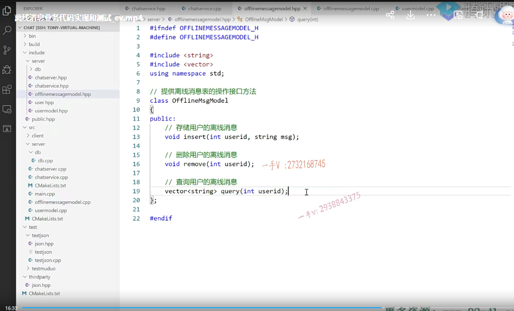

然后呢？

在业务这里边儿就是现在我只是完成了一对一的聊天儿啊，

群聊肯定也要存储离线消息的。

在这儿呢，如果这个用户不存在在connection，这个表map表里边儿没找见这个用户，表示这个用户不存在。

不存在的话呢？就存储什么东西呀？

就存储这个离线消息表好的吧啊，

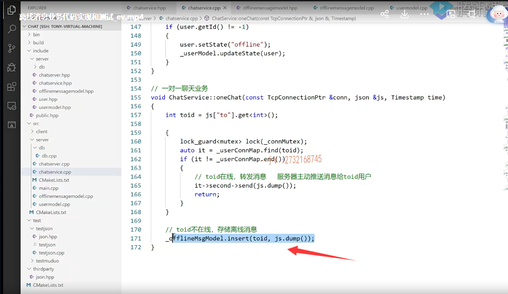

### 实际上这个在集群的环境中，我们还是要改的，因为这个用户不存在，可能是这个用户没有在这一台电脑上登录。而是登录在其他是不是电脑上了

==实际上这个在集群的环境中，我们还是要改的，因为这个用户不存在，可能是这个用户没有在这一台电脑上登录。而是登录在其他是不是电脑上了，==

对这个我们后边儿呢，会继续去修改这块儿代码，

==我们现在假设呢只有一个单台的聊天服务器啊，==

然后登录成功以后就拿到了这个用户的所有的离线消息了OK吧啊，所有的这个离线消息。所有的离线消息，

然后拿到以后呢，给它装入这个json的这个数据，json对象里边啊，

然后把这个离线消息再删掉啊，没有问题，就是这个意思，是不是啊？

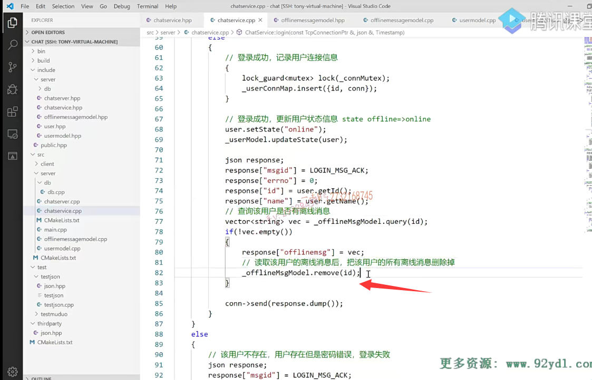

## 编译项目

### build文件夹清空一下，可能会没有发现我的新创建的文件

我们编译一下。编一下。点一下整个的项目。

又是对这位定义，那就是没有发现我的新什么？没有发现我的新创建的文件啊。

这个返回一下，在这个build里边build，把这个全部删掉啊。

删除这里，把这个build里边的内容全删掉啊，

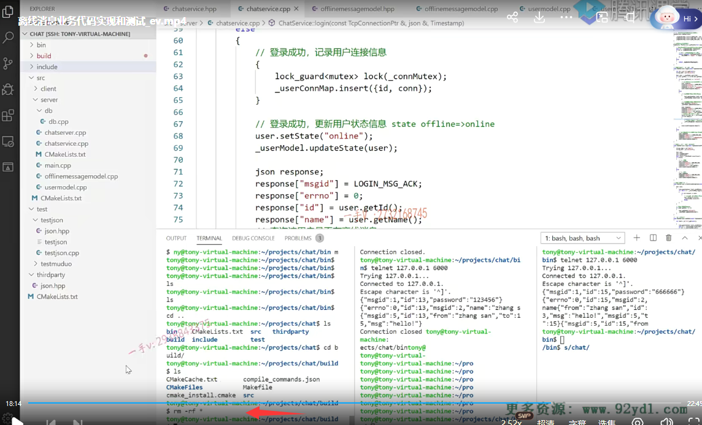

### 再重新编译

然后呢，我重新让它重新去更新目录里边的所有的新的源文件。

诶，这回又编译上了是吧？offline message model。

哎呦，这儿还是有那个什么？

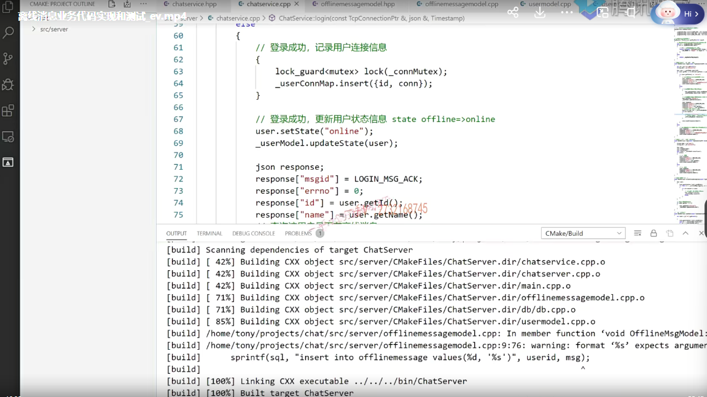

还是有一个警告啊。有警告是哦，百分之s人家需要叉二星，

我们肯定又是给了一个string对吧呃，

这肯定是在我刚才更新的这个离线消息表里边。这是message，message点c杠什么STR？好吧嗯message点c杠STR

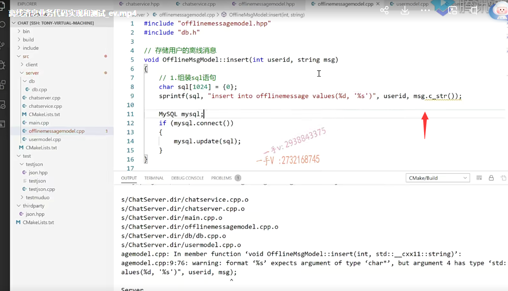

还有吗？这就再没有了啊，那重新去编一下。

现在没有问题了吧啊，现在这个就OK啦OK了，

以后呢，我们来进行一个功能性的一个测试啊。

## 测试一下 离线消息

在这呢，我们退出来。到这个bin目录里边先执行一下我们的这个服务器程序啊。

然后呢？这块是？什么呀？是登录上啊。这是先连接上连接的话呢，

先让谁登录啊？先让这个张三登陆吧。

好吧啊，先让张三登录。哎，该账号已经登录，请重新输入新账号啊。

### ==这边好像出现了一个之前业务没下线的错误，具体未知==

啊。那这个是我们之前。select thing from user.哦，

这个可能是不是我们之前没有那个什么。

还有那个离线业务没有做正确的时候，这儿数据是不是没改过来呀？

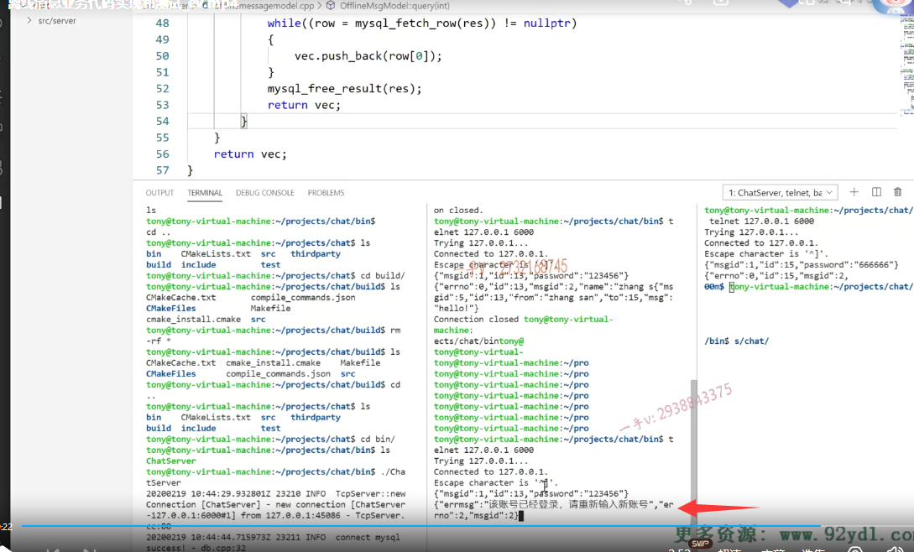

### 手动修改一下在线的状态为离线

把这改一下啊，改一下update。这个user set state=offline。全改一下啊，全部改一下offline，

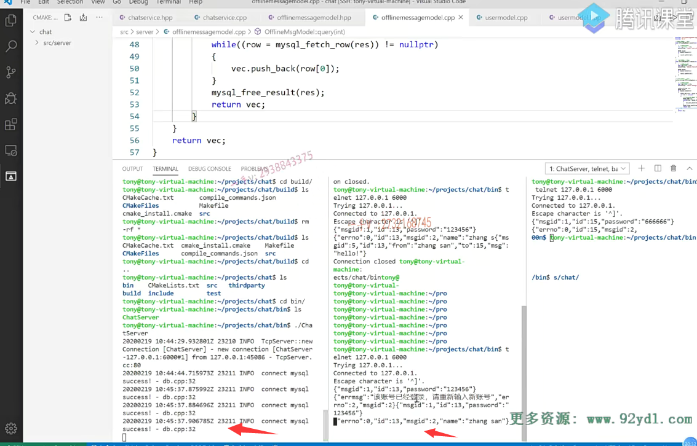

现在可以了，是不是好了？

那么我就重新登录一下啊。诶，这现在张三是不是登录成功了啊？

### 发送离线消息

现在张三登录成功了，张三登录成功了，

以后呢？现在给李四说话。

张三给李四说话是这个啊。hello，一。

说先说一句。应该是存到离线消息表里边了，是不是？

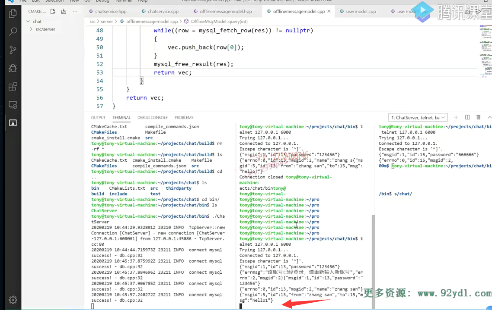

### 查看数据库 离线表

看有没有啊？select thing from offline。message

有呢，是不是正确的啊？

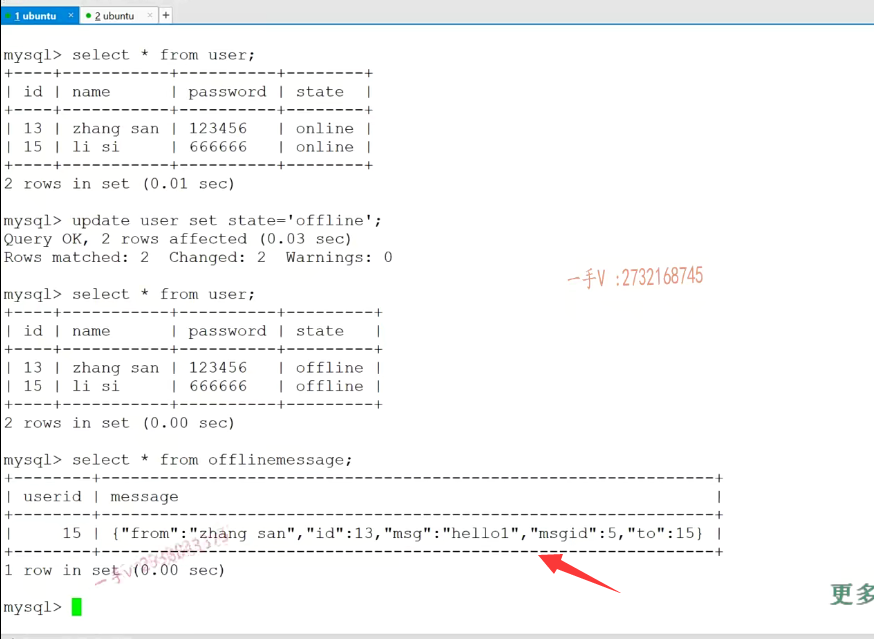

再说一句话吧。这个是hello二二二。

说过去了，是不是

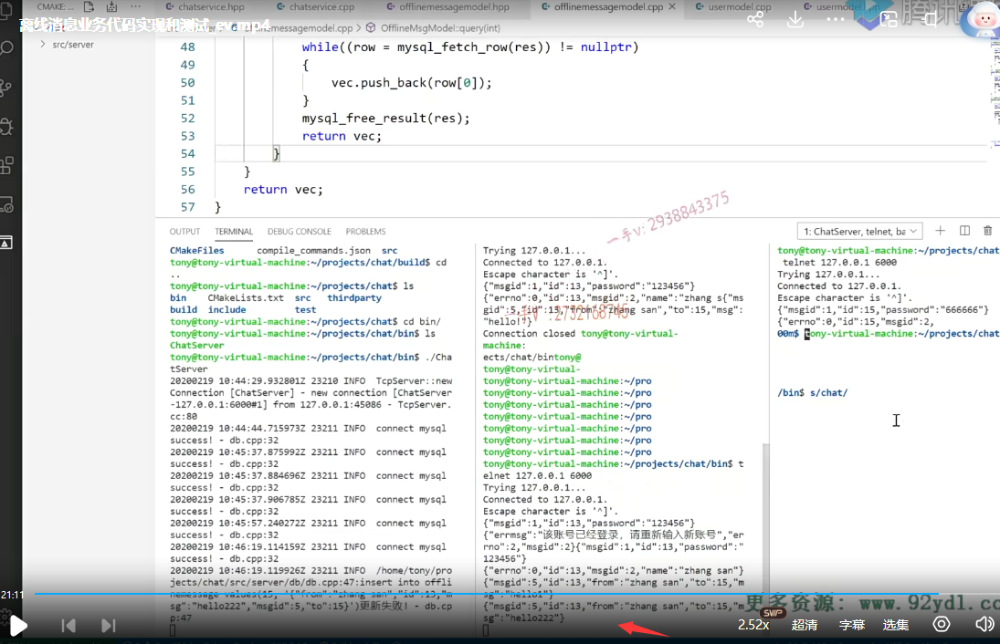

### 登录查看离线消息

现在呢？我在这里边来再连接一个客户端，

现在这是属于谁登录啊？现在属于是李四登录啊，

那李四登录的话呢，在这儿。就是发这个json消息。

上来了以后呢，你看在这儿的话呢零啊，

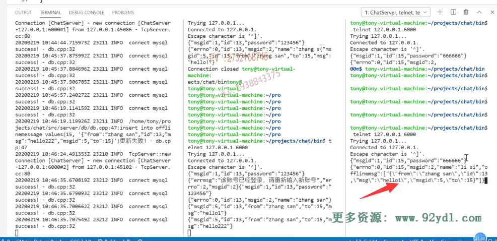

这个15 李四 是不是有offline message啊？

这个相当于这个离线消息呢，就给我们带回来了。

总共几个离线消息呀？

哎，总共是不是两个离线消息？对，就都给我们带回来了，

我们在客户端直接给用户进行一个显示就可以了好吧啊，

这就是呢，我们验证的这个离线消息。是没有问题的，

### 离线消息被删除掉

那这个应该现在是离线消息应该没有了，被删掉了是吧啊？

离线消息不能够一直存在，用户登录上了以后给用户读取，以后这个离线消息应该就会被删除掉。这是符合业务逻辑的，对吧啊？

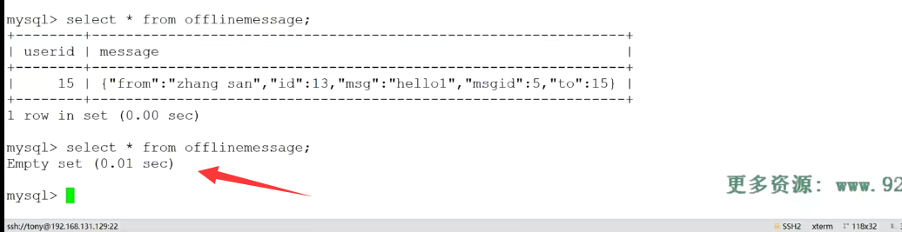

## 总结

好，那这节课呢？主要就给大家把这个离线消息的处理呢说。

说了一下啊，我们给大家说到这就是。

这样呢，将来在集群的时候呢，这一块的业务代码肯定还是需要修改一下的啊，

因为我们用户可能注册在不同的主机上。

啊，它在不同的主机呢，就不是说你直接存离线消息，

它下一次登录才能是不是看到的啊？

这个我们再到在说到集群的时候再给大家说好吧啊，那这节课的内容呢，就说到这里。

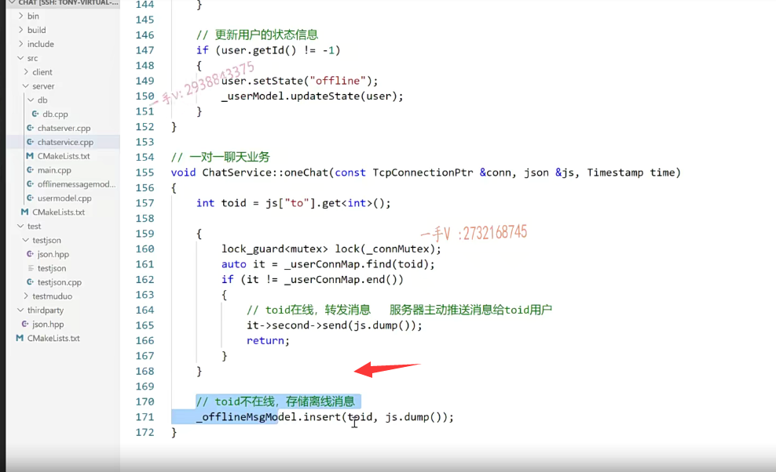