这节课呢，我们来给大家解决一个问题啊，

之前呢，有一节课我们专门给大家讲解了一个客户端异常下线啊，

客户端异常下线的话呢，那是因为它没有正常发送一个什么呀。

没有正常发送一个json的字符串是不是啊？

那么是通过连接异常断开这里边儿啊？啊，

我们相应的进行了一个用户的connection的删除，以及它用户表里边儿用户的在线状态的一个重置，对吧啊，一个更改。

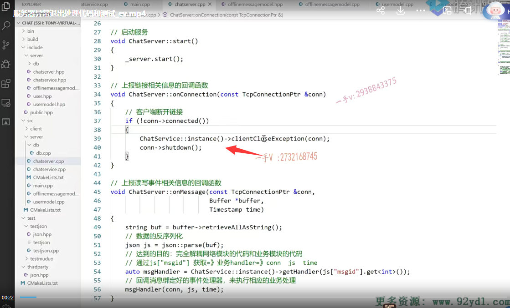

### 之前测试遇到问题  发现用户没有下线

那么，我们之前在测试的时候遇到这样的一个问题，

就是当服务器断开了以后呢？呃，造成表里边儿的这个用户呢？服务器都已经没有运行了。这个表里边儿的用户呢，还是个online，所以在下一次服务器运行的时候，

### 问题是服务器强制结束，没法去修改用户的状态了

我当我相应的用户去做登录操作的时候呢。

总是报这个账号儿已经存在，是不是实际上这个问题呢？

也很明显就是因为我们用ctrl c强制结束服务器运行的话呢？

在这里边儿根本就没有机会，是不是去数据库里边儿去修改一下这些用户的状态呀？

哎，修改一下这些用户的状态。

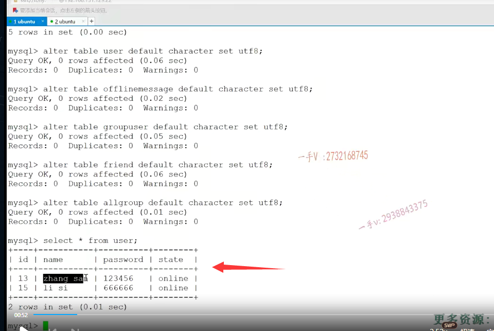

### 截获一下这个信号，做一些相应的处理

好的吧啊，所以这节课呢，我们来处理一下吧，

因为我们是以ctrl c来结束这个服务器程序的，对吧？

啊，我们来截获一下这个信号，在信号的这个处理函数中呢，我们来把这个用户的状态信息来重置一下好吧，

否则我们在后边做业务的时候呢，总是呢，这个账号被报账号重复登录啊。

### SIGINT信号 ctrl+c

好，这个在内函数当中，那我就先包含一个什么东西啊？

include。signal点h

好吧，然后这块呢，我调用一下signal函数。

然后呢，写一个handler啊？写一个reset handler吧。是要重置的一个方法。

这个是void。这个是处理服务器这个ctrl+c呃结束后重置user的状态信息的好吧啊？

在这呢，我们就直接调用谁的这个？

调用我们的服务的这个一个方法嘛好吧啊，就是chat service点hpp。

在这儿呢，使用一下它的一个方法就是chat service啊，然后他的一个什么instance。对不对？

再调用一个它的。就是这个reset调用一个reset方法吧，

我们给它写一个reset方法，重置方法啊，

重置方法完了以后呢？啊，

这个就调用什么方法呢？这个就调用这个exit吧。好吧啊

exit来结束我们的程序。

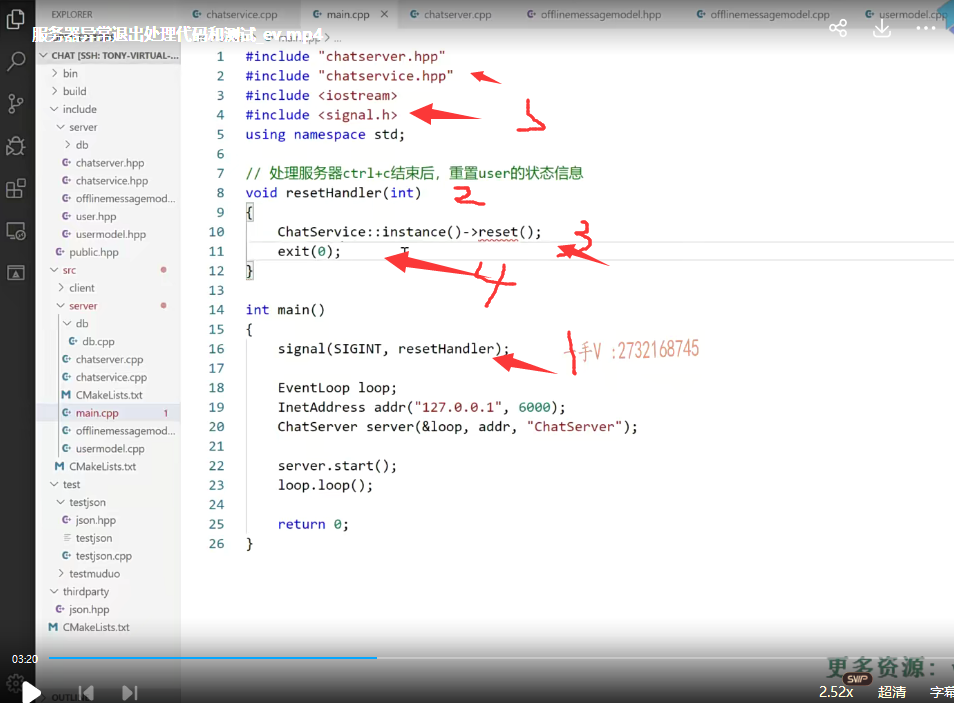

## chatservice  中 实现reset()方法

这个reset我们在service这里边添加一下啊。呃，服务器异常后这个业务重置方法，

我们可能将来呢，还想要去重置，其他的是不是一些东西啊？

那我们就都写在这个reset方法里边好吧啊？

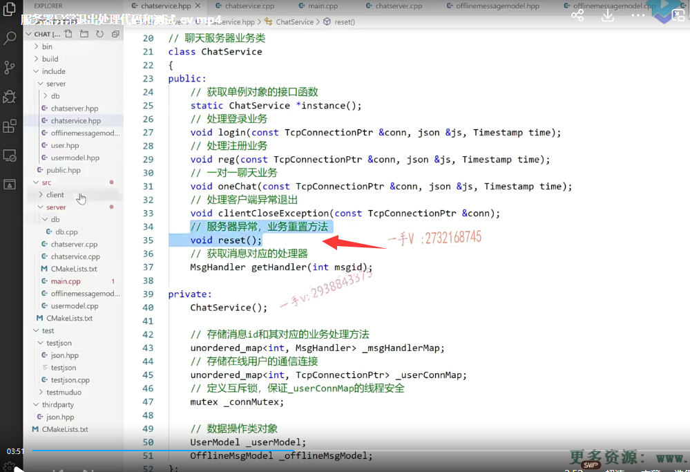

## chatservice.cpp中实现

这个在相应的chat service里边我们实现一下这个重置业务

我们写到上边这来吧。chat service.

这个主要做的就是什么呢？

在这里边把所有用户的状态。把online状态的用户设置成offline。

就是呢，重置用户的这个状态信息。

那在这呢，就是用user谁呢？user model对吧

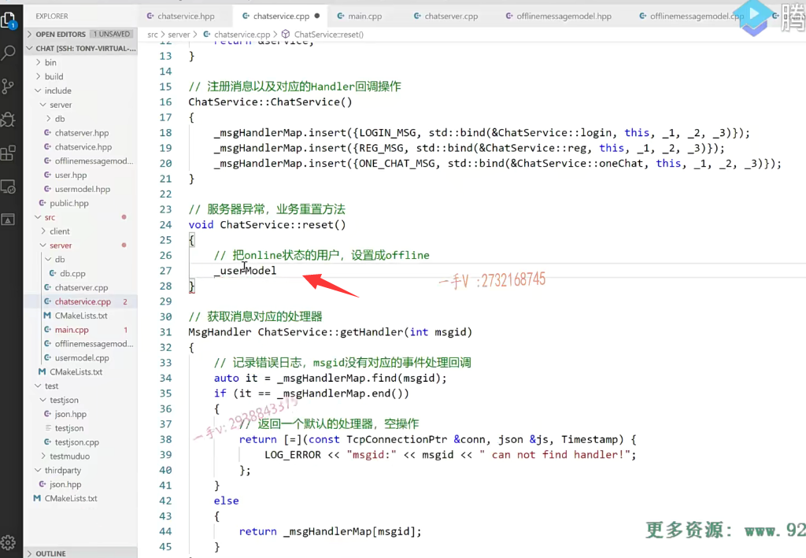

### usermodel中来定义一个resetstate方法

啊user model给它得提供一个model，提供一个方法了。

大家来看一看啊。在这就是重置用户的状态信息

void reset state吧？

好吧，这个也不需要参数了啊。

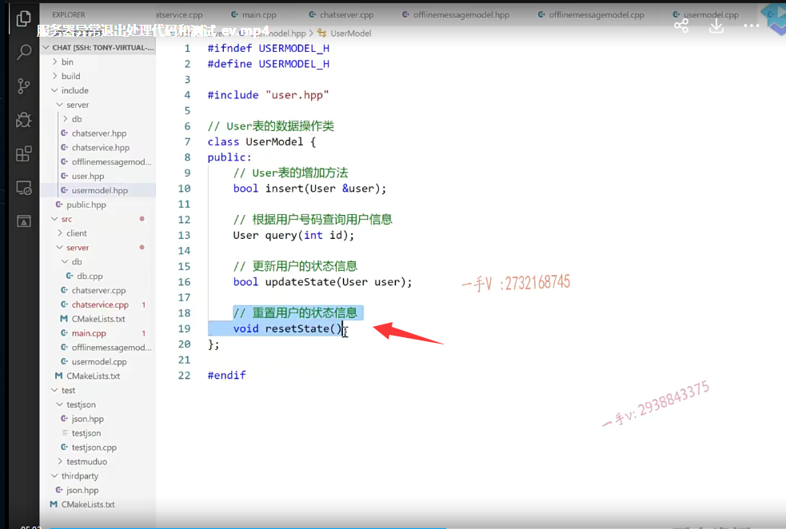

### usermodel.cpp中实现resetState()

到这个user model里边来。

这个也是一个update。

就是update user set state等于什么呀？

等于这个。offline.wherestate等于这个online把online状态的这个用户全部写成offline啊。

所以这个也不需要填什么参数了，对吧？

那这个呢，我就直接写到这个char 数组上就可以了，好吧？

双引号连连起来啊。

这个我就去掉了。这就是在更新这个也不需要做什么了，不需要做return语句了啊。

更新一下，把这个update user set state=offline where state=online，这个没有问题吧？

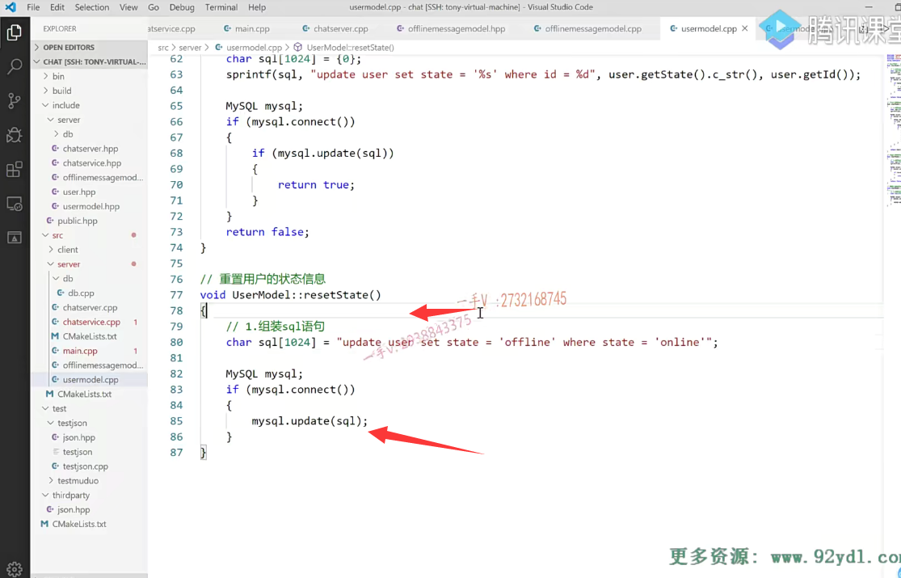

### chatservice::reset()方法完善

好，那么在这里边呢，

我们就提供一下它的这个reset state。

这是需要做的一个重置操作啊。这是它的reset方法。

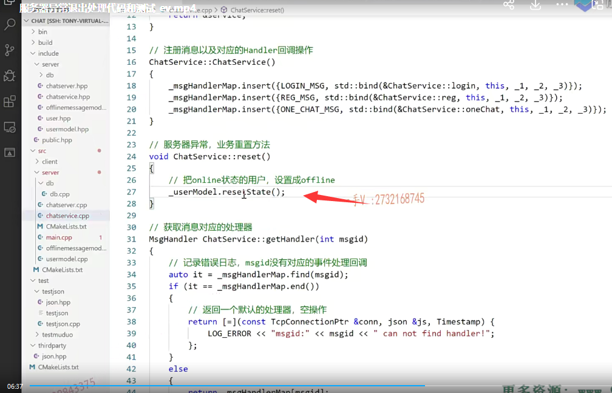

好吧，那之前的错误已经造成了，

在这我们用语句先更新一下啊update。

这个user set state等于。offline.

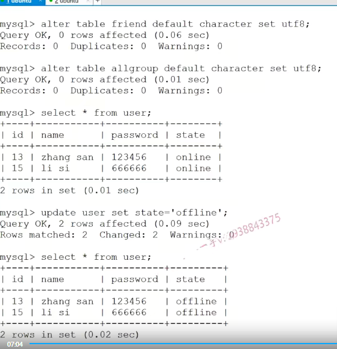

## 编译重新测试

好。看一下啊。那我们重新编译一下，去测试一下这个功能。okay，编译成功。

### 登录的时候多输了一个字符导致错误

测试在这呢，在这块啊。

登录登录以后呢，我们做一个登录操作啊。这个是张三的一个登录操作。

这个算是登录成功了，是不是啊？登录成功了，登录成功以后呢？

再退出。

这个是没关系啊，这个是什么东西呀？这个是一个。我刚才多输多输了，这多输了这个字符，所以导致呢。呃json字符串解析有误了啊，

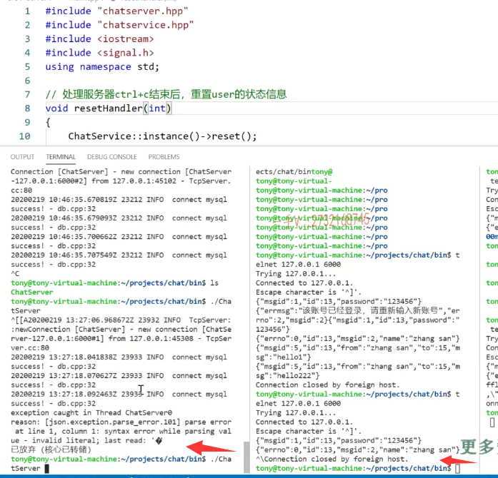

这个如果是客户端发过来的标准的json字符串呢，这块儿是不会产生什么问题的。

这块不是通过ctrl c，是不是结束的呀啊？

所以呢，在这里边我查看这个表，它还是个online啊。

当然了，这些问题我们都是要解决的，服务器有很多种情况可能会异常挂掉，被quit掉了，是不是啊？

突然停电掉了。对吧，突然停电，整个程序没了，那这都有可能，

所以呢，我们服务重启的时候呢，这些数据呢，都要涉及一个恢复啊。

我们在这里边先去处理一下这个由于ctrl c导致的这个服务器啊，这个结束以后呢，用户状态的这个不正确啊。

### 我重新执行登录，来测试

那在这里边，我就重新来执行一下。登录是这个没有问题啊。

好，这个现在是算登录是不是成功啦啊？登录成功啦。

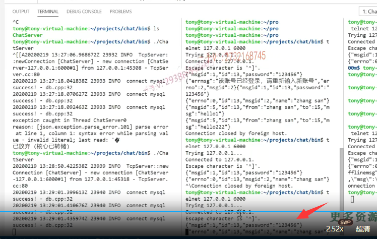

### 客户端异常退出之前已经做过处理，这里测试时正确的

然后结束。quit啊，我刚才是多按字符了，所以发过来，它又不是一个标准的json，

所以这儿解析直接导致json解析出错了啊。

嗯嗯quit。在这里边。

退出这个是退出那退出的话。

在这里边，人家现在的这个状态是。OK的对吧？

==这是服务器，正确的话，客户端异常退出，这我们都处理了啊，==

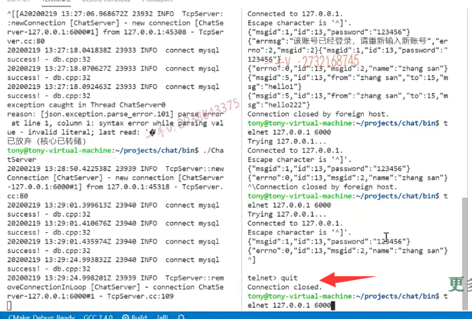

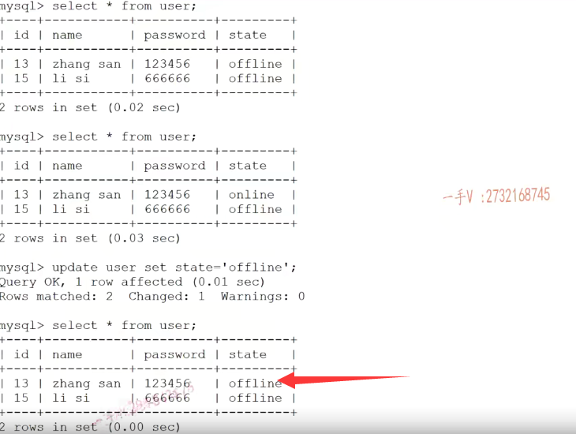

### 服务器异常断开 用户状态也被重置，测试成功了

那么现在是这个。

先登录上啊。这个是登录成功了，是不是

此时我ctrl c就是服务器这一块儿呢？直接怎么样了？直接ctrl c断了啊，直接断了。

你看现在呢，用户所有用户，包括这个张三刚登录的，

是不是也都是offline啊？

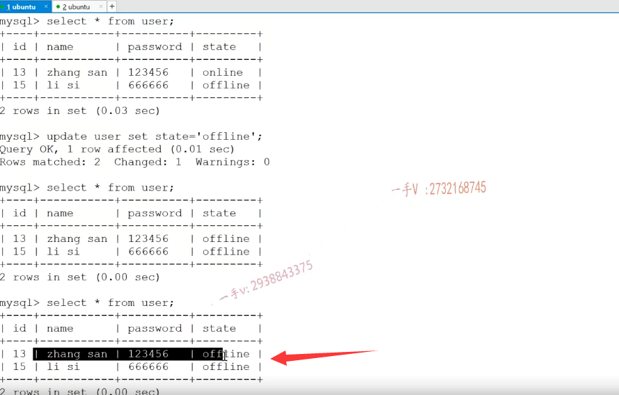

因为他的状态被我们重置了。

好吧啊，行，那我们这节课主要就解决这么一个问题。