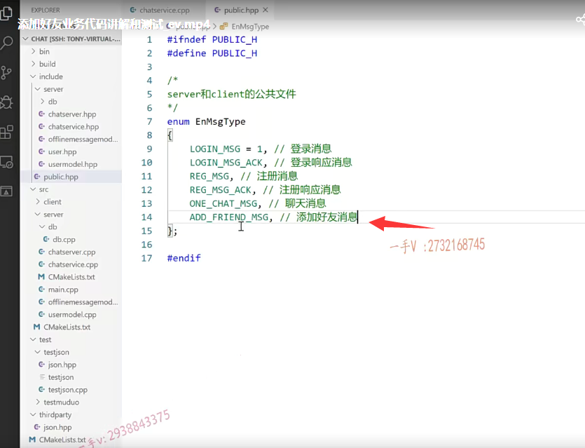
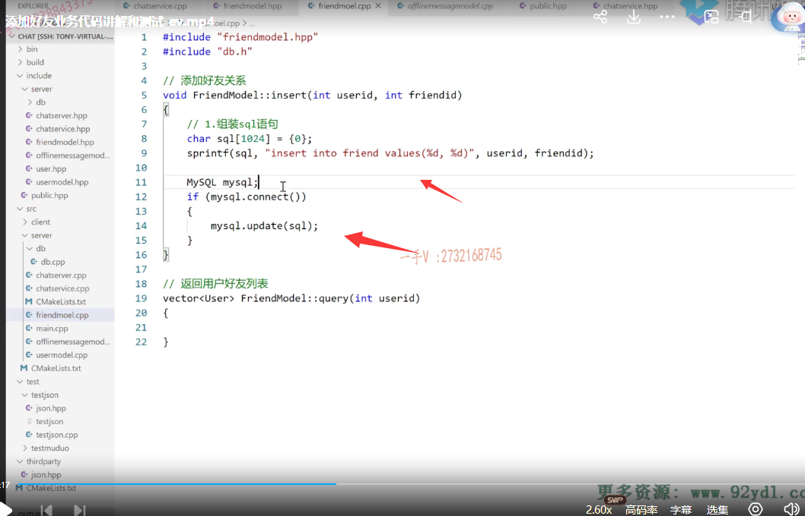
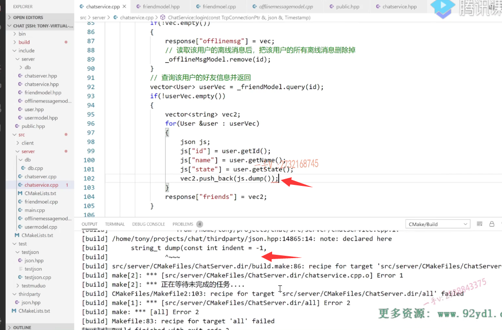
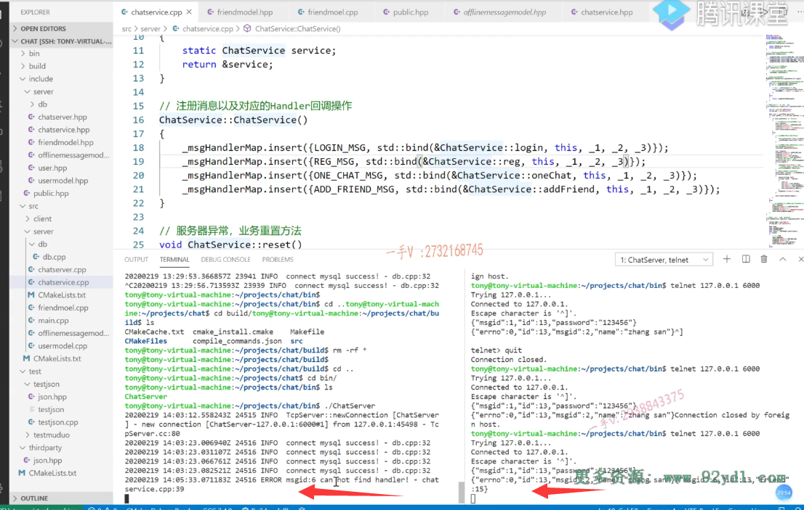

## 添加好友的逻辑梳理

这节课呢，我们在做一个添加好友的这么一个功能啊，

实际上我们项目中这个添加好友呢呃，功能比较简单的啊，

因为我们到时候要写一个简单的基于这个控制台的一个客户端程序对吧？

那我登录成功以后呢？你总得给我显示我的好友信息吧，

你不显示的话，我也不知道跟谁说啊。对不对啊？

我也不知道我的好友的ID是什么啊？

实际上呢？呃，我们这个项目里边也并没有那么严格啊，

只有好友我才能聊天啊，

实际上呢，你就是你知道任何人的ID你都可以聊天。OK吧啊呃，

当然了，你要做这种是好友才能聊天的业务，肯定是没有问题的嘛，是不是啊？

我们在这个这个业务的定性呢，

就是我把你添加好友了，那么我登录成功以后呢？

嗯。服务器就会给我返回，我的好友列表信息我就知道啊，这个谁谁谁是它的这个用户号儿是什么号儿对吧啊，

我就可以跟着这个号儿啊去跟你聊天儿了。对吧啊，

所以呢，我们这个添加好友啊，就是我发起加好友的操作到服务器，

服务器就给我把这个关系呢啊，把这个关系就添加到这个friend表里边。

就可以了，也不用去征询对方的这个同意啊，当然你要征询对方的同意啊，

对方同意了，添加到数据库里边。

对方不同意就不添加了，是不是这业务大家也都能做啊？

那在这里边儿，我做一个抛砖引玉吧啊，

我们只直接就是我加谁都可以，也不用向对方呢去征这个征询了啊，

如果你非要去向对方征询的话，

那这跟聊天的业务过程是不是一样啊？

啊，那这就涉及一个服务器，会把你这个请求转发给你，想加聊天儿的那个人看那个人，

人家怎么输入？好吧啊，

### 联合主键

==那在这里边呢？它的这个friend表比较简单，就两个字段啊，一个用户添加，另外一个用户为好友，这种关系不用写多次。==

==所以呢，这个表里边啊user ID跟frined ID，我们在建表的时候就建了一个联合主键，==

==这张表的这个由这两个字段同时呢构成主键。好吧，==

==那也就是说呢，这个可以重复，这个可以重复，但两个合起来能不能重复啊？两个合起来不能重复啊，==

我跟你是好友，这种关系写一遍就行了，对不对啊？

防止同一组人把他们的好友关系写多次啊，

我们直接在数据库上啊，做保证就可以了。好吧，

### 注册消息类型

那么在这个代码上呢，你来看一下，

首先在public这里边。肯定要有一个消息，就是添加好友。对不对啊？

就是添加好友的这个信息嗯。我们取个add friend message这是添加好友消息。

OK吧啊，

### 给消息绑定回调函数 事件处理

添加好友消息当然得给这个消息ID去绑定一个事件处理函数对吧？

那么，在这里边就是添加好友。啊业务boy dad，friend friend AD friend。里边是这个方法，

## 在cpp中实现addFriend()业务方法

然后在这个业务这儿呢，我们再实现一下chat service,add friend.

那么在这里边 它带的这个有一个message id，那就是添加好友的，有一个id就是我的，

我想添加谁，然后就有一个friend，什么friend id？

好的吧啊，在这呢，当前用户的ID就是user ID=gs。ID.

然后呢？就是friend friend ID等于js friend ID.

然后呢，就把这个关系写入相应的这个friend这个表当中就可以了，好吧啊，

那在这儿如果你想验证的话，你也可以验证一下这个friend ID到底存不存在？

啊，有可能呢，有的人乱写了一个这个friend ID，根本是不是就不存在的，对吧？

其实不存在也无所谓，因为不存在的话，到时候呢，他登录成功以后，你给他返回这个好友列表，这也查不着嘛，查不到任何东西，是不是啊？

那这个呢，就是看实际的啊，如果遇到此类类似的这个应用场景的话，你就看人家到底业务需求是个什么样子的？对吧啊，

### 需要添加modelfriend来继续操作friend表业务

在这里边，我们就在这里边直接添加这个好友关系就可以了，

那当然在这就得添加什么东西啦，

添加model啦。new feel，这是brand。model点hpp。

if no de fine friend model.end f啊。

### insert()方法 不提供删除，C++不适合做业务

大家来看，这是class friend model。

在这里边呢，做的事情啊，注释我们加上friend model.就是提供好友信息啊。

就是维护好友信息的操作接口方法啊。

public.这首先是添加好友关系啊，

#### 不提供删除好友

这好像我们现在的这个业务啊，其实是很简单，

==就是添加好友关系，这里边儿也不用去做删除了啊，==

我们现在也就不提供这个删除好友功能了啊。

我们这个项目整个就在是用C++写的，C++写的用于代码的这个设计啊，我们网络层以及到业务层，以及到这个数据层，它是怎么通信，怎么操作的啊

实际对于c跟C++语言来说呢？他们去做业务啊，并不见得有PHP，或者说是有JAVA啊，做业务那么方便好吧，

所以这块儿的业务功能啊，我们就不给大家做过多的扩展了。好吧啊。

这里边呢，就是添加好友关系啊，那就是设置要添加insert，这表很简单，里边有两个ID，一个是user ID，一个是什么？friend ID是不是啊？就这两个。

### 会返回好友列表

好吧啊，

==另外一个呢，就是会找到什么呀，因为登录成功了以后呢，会把用户的好友列表给它返回回去啊，==

实际上呢，好友列表呢，是一般来说是记录在客户端的啊，就像QQ一样。

因为好友列表，好友一般信息比较多，对吧？

如果每次呢用户登录成功以后都是通过网络啊，服务器给用户返回的话，

这样呢，服务器的压力有点儿太大了。

是不是因为这个好友列表的嘛？这个又不会变的，是不是啊？

你用户呢？下线以后呢？你都没有上线，你中间肯定不会变好友列表的。

所以呢，下次上线的时候呢，就是上一次下线的时候就把这信息呢好友列表有变动就全部更新，在本地的这个文件里边儿啊。对吧啊啊，

### 没有在本地做，而是直接在服务器返回

我们这也是为了使业务更简化一点啊，就是就不在本地存了啊，就是客户端登录成功以后啊，

服务器呢，不是还会给它返回离线消息的嘛？给他把这个好友列表呢，也给他返回回去啊。返回用户好友列表。

#### 需要返回好友的id，名称，在线状态，不要光返回id，还要用id查user

那么注意一下啊，这个用户的好友列表呢，你在这儿不要光返回一个friend ID了，你给用户返回一个friend ID呢呃，用户也不知道这个这是谁，

就是我们调用这个返回好友列表的话，

从friend这个表里边当然只能拿到了这个friend ID是不是我们还得在代码上啊？拿这个friend ID呢？在这个user表里边去查一下这个friend ID具体的信息，因为我们最起码给人家用户返回他的这个用户好友列表的话，返回好友的ID。好友的名称，

他说好友的密码就不要给他返回了啊，以及好友的是不是一个在线与否的一个状态呀？有的好友在线，有的好友没在线。对不对？

#### 需要使用联合查询

所以我们在这里边直接做一个什么啊？

直接做一个两个表的一个联合查询就可以了。好吧啊，直接做一个两个表的，这个联合查询就行了，

### query()定义

所以在这呢，我们直接返回一个什么东西呢？

victor using namespace STD.

我们直接在这里边啊。那肯定还得包含啊。user htp啊。

我们返回这个user query。

#### 不会去查两次，直接会使用联合查询

这个是干嘛呢？

通过一个用户的ID找到他的用户列表，注意呢不要说是我在这个friend表查就是能查到我用户对应的好友的ID是不是啊？

然后我再拿ID呢？向这个表（user）里边是不是再查一下啊？

你相当于发起了两次，是不是mysql查询啊？

你不如做一个联合表的这个联合查询一次性是不是数据就完了，

在业务上也好处理啊。

### query()实现

好，这个是s ever在s ever里边是不是又得去new一个新的file啊？叫做friend friend friend什么model点cpp啊？这也是int。friend model htp，

然后把这两个方法呢？我们实现一下。brand model.那么，在这里边儿呢？类名就叫做friend model啊。

这个insert呢，我们也把其他的这个model里边的东西拿出来，

我们用一下就可以了啊。offline message insert.friend model.组装insert into。show tables.friend表名就叫做friend insert into friend。啊values百分之d和百分之d。一个是user ID，一个是friend ID。

那这个就完了啊，这个再包含一下我们的数据库的啊db点h。

好的吧。

更新一下，是不是就完了？okay，

这个是query啊，我们再找一个query。

跟这个挺像啊。嗯。好这块呢。

大家来看一下啊，这是里边装的是什么user vec？对不对？

这是select什么呀？select.别message了，我们主要是select的这个。

我们这应该是一个多表的，是不是联合查询啊啊？我们先把这个sql语句写一下啊，

sql语句写一下，就是应该是select。

先写到这个上边。就拿friend friend这个表和user这个表做一个联合查询是不是？

先是select嗯，我需要呢，都需要哪些东西需要这个a这个表的什么需要a这个表的？

最后查出来这个用户的ID好吧，用户的ID还有用户的什么name？还有用户的什么state好吧，

用户的人家好友的密码你就别插了啊select这个。from user a.然后是一个内连接inner join。inner join什么啊？friend b是吧？on b的什么东西呢？嗯b的user ID等于。a的。a的ID是吧？

那么不是这个样子的啊，是这个样子的吗？是不是啊？是的啊，where where什么where a的？这个叫where？嗯。你看这个参数传过来的是什么？

就是我要在这个这是过滤条件，对吧？这是过滤条件啊。

where b的这个user ID等于这个百分之d嘛，等于这个参数传过来的嘛。

好的吧啊，我先就是把。friend，这个表里边friend是b表嘛？把这个b表里边的这个user ID先过滤一下，就是等于我的这个。

啊，好吧，等于我的这个。呃，因为这个用户可能有很多的这个什么东西呀？

嗯，有很多的这个。朋友的这个好友是不是啊？有很多的这个好友。

那么你看看。这个是这个不是b的user ID呀，这个是应该是b的friend是不是ID呀啊？

如果查我好友的信息，那么查该用户的好友的信息呢？

好吧，来我们再确认一下啊。我们最终呢，也就是说拿user ID找到它的是不是friend ID啊？friend ID有很多。有很多是不是所以这儿过滤了，你看where b的user ID等于给定的啊，那这样一来呢，

这就筛选出了。相应的user ID的friend对吧？然后呢？在b的friend=a的是不是ID呀？

就是拿。找到的这个friend的呃，这个用户的friend在a表里边去查这个friend的详细信息，

最后查出来我要啥呢？要相应的，这个user ID的好友的ID name跟state这些信息没有问题，

这就是一个做表的联合查询好吧。

okay，那最后一个呢？我们只需要填一个user ID，是不是就行了啊？

就是这个参数传进来的user ID。

好的吧。

我们把这个放到上面写一下，最起码保证这个sql语句的语法是正确的啊。

粘贴比如说等于一个13吧啊。

OK，没有找到，因为现在好友列表里边是空的，对吧？

这个sql语句是没有问题的。

### 把userid用户的所有离线消息放入vec返回

然后呢，来看看啊。

这里找找到多行以后呢啊，找到多行以后，

这里边不要这样写了，

这现在是user啊。user点set id set ID就是atoi就是这个row的第几个呀？

第零个啊？它第零个现在返回来的数据有三个字段ID name跟state嘛，这就是ID了。

然后再是user点set谁？said name就是row 1啦。

然后再是user set谁？set state对吧啊零一二了。

就没有设置密码，也不不能填密码，对吧？

不能你把好友的密码都给你返回了啊，然后呢，

把它添加到谁里边？push back的vector里边。

拿完了以后呢，把这个资源释放掉，把这个vector返回回去，

这儿的话就返回了一个空的。

这个能够看明白吧啊，

我们需要给呢，登录的用户返回好友的一些详细信息，而不仅仅是这么一个ID。

这里边需要通过这个ID在user表里边查到好友的一些详细信息啊。

好，这个我们先写成这样，我们还要进行功能测试的，对吧？

## chatservice业务中 存储好友信息

然后在业务上我们来看一看啊，在业务上这儿做的就是。

先干嘛呢？存储是不好友信息呀？存储好友信息。

存储好友信息的话，在这呢，我们要包含哪个model啦？包含friend model htp啊。

然后呢，在这儿再写一个。friend model.friend model.

#### 调用model中的insert(）存储好友信息

然后在这里边，我们再写一个什么东西呢？

在这啊。点insert user ID和什么呀诶和friend ID。

好吧，这是添加了，是不是这个好友信息呀啊？

### 在去处理登录成功的逻辑的地方，去查询用户的好友信息并返回

添加了好友信息以后呢？

然后当我登录成功的时候。

大家来看，在这儿啊。这个查询该用户的好友信息，这是登录成功并返回好，

这里边就是vector user。

这个用一个user vec等于。什么东西呢？friend model点query谁呢？用户的ID。

如果说user vec。empty它不是空的，证明它有好友，对吧？

我们就要给人家返回了啊。

那么在这里边，我们返回的话，那就是。呃，直接怎么样啊？我们直接可以把vector的内容呢，给它放进去。

是不是啊？我们直接可以把vector内容给它放进去。

那就是response。

通过后。friend friends就行了好不好？user vec。啊，这个就完成了。这个就完成了。

### 发现直接在json response放vec好像不行  因为vec中我们的是自定义类型

诶，这个可能不行的诶，这个可能不行的，因为这里边呢，是一个自定义类型，

它不知道怎么放，对吧啊？

### 使用map来存放到json中

那在这是这样吧。刚好我们也不想让user的这个什么东西啊。

让user的这个password字段就不用往回带了，它是一个空字段，因为我没有填嘛，对吧？

在这边带个map吧。键值对，是不是啊？

来看看啊。这是我写一个map。嗯。map的话就是ing.

然后这里边是个。结果是个值对吧啊，

但是结果这个值的话呢？其类型有可能是不一样的。

类型是不是有可能是不一样的啊？

咦，那我们在这儿还得想个办法，看怎么处理一下啊，把这个信息给它带回去。

### 我们怎么去带这个user信息,我们可以把一个user的信息转成json对象，再json转成字符串，再放入到vec中

大家来想一想，我这儿应该是怎么去带这个信息呢？也好办。

因为这个我们的这个json字符串这个键对应的值本身也是一个数组，数组里边也可以包含json字符串嘛，对吧啊？

所以在这儿我就定义这样一个东西。

呃。在这儿呢啊，我给它起一个名字就是。嗯，vec。

我们看能不能把前边这个用上？前面这个都放到这了。

放进去以后，这个vec是不是就没用了？

我们还是单独定一个啊，为了跟前边呢，避免产生冲突vec 2。

然后我来遍历这个遍历这个容器，

大家来看看user vec.在这里边相当于呢，是生成json json的这个ID等于谁啊？等于user的get ID。

然后呢，再是name。对不对啊？是user get name，这就是好友的这个信息啊，

然后就是再是这个好友的状态啊，等于user点get state。

没问题吧诶，然后呢？把它添加到谁里边去啊？这个js点pump添加到这个vector里边来，

那就是把这个vector里边拿的这个用户信息啊，是不是全部给它转成合适的json字符串？

统一的再压到这个vector里边啊，

最后呢，我们再给它写到response里边就行了。friends啊，friends等于这个vec two。

这就可以了吧啊，这个就完美了呃，也是比较符合我们的期望的，

因为我们刚开始呢急，就是它能发回去。

它也会把user的这个pwd字段是不是发回去的啊？

那又说空根本没有意义，对吧啊？

我们想发回去的好友的字段呢，就是ID name跟state。

OK吧啊行，那这个添加好友的这个功能呢啊？列到这里边了啊。

## 测试一下

### 删除下build文件夹

最后呢，我们得去怎么样一下得去测试一下吧啊？

==测试一下。因为添加新文件了啊，在这儿呢。先到build目录下。删除一下啊。==

### 解决错误 少一个括号

然后重新编译。这有错误，是不是？是在chat service点cpp啊。

第几行第102行。第幺零二行在这里边儿哦，我们这个dump方法没有加括号啊。

好重编。这编译成功啊。编译成功的话呢，

在这看看有了启动服务。这个启动服务以后呢？

在这儿啊，我添加一下好友。

### 先让张三登录

例如。登录成功以后，我应该是。这是谁呀？这个是个张三，

让张三先登录上啊。

这个是登录成功了是吧？

### 登录成功后添加好友

登录成功以后，然后要添加这个好友。

啊，添加好友，实际上现在登录成功了，

它不仅仅会添加呃，返回这个，它还会返回这个离线用户信息，跟好友列表，那么可以看到现在没有，

现在是不是没有啊啊？现在是没有的。

那么在这里边，我再添加一下，添加个好友，

### 添加好友的json字符串编写

我们这个好友是怎么添加的来着？message ID先看一下，添加好友。一二三四五六六是吧？

六呃。

是一个看一下这个业务这儿的这个字段的一个规范，一个ID，一个friend ID啊。ID就是13。friend ID是个15。对吧啊，这两个用户，一个是13，一个是15啊，

### 之前忘记消息绑定事件回调器   不过我们使用lambda写了一个默认的

我们还得看一下啊，这块儿check service这块有没有绑定啊？

呃，我们根本没有绑定是吧？

那添加好友的消息根本到不了我们的这个方法上啊啊。add friend message，

==不过这个你没添加，你运行我们代码上加了一个默认的一个用兰布达表达式写的一个啊，就是你这个六号消息呢，根本找不着相应的是不是事件处理器啊？找不着相的handler啊==

chat service谁呀？add friend对吧this杠一杠二杠三，这个才行啊，这个才行好吧？你看如果你这样发的话呢？

### 如果我们没有绑定 测试一下 会返回没有找到handler

你看c呃message ID 6 cannot find handler找不着相应的处理器，所以啥也没做啊。

### 重编 运行 登录 添加好友 发现有错误，发现我们添加的是friend,要改成friendid

okay，那我重新编一下啊。好，重新启动服务器。

这个连接我的服务器，先是登录。

这个是登录的字符串。好了，

然后再做一个添加好友。哎呦，这个添加好友啊。直接给怎么样了？

添加好友这个哦，我写了个friend。人家是什么friend ID对不对？''这又是手误啊，这又是手误啦。

from user，你这里边得改

一下update。use set state等于什么online啊？呃set state=offline。

这个就是项目在开发中有很多的调试的异常啊，我们先手动恢复一下，等整个的客户端开发完了。

客户端发送的json呢，是没有任何问题的，我们肯定是要确保它的正确性啊，就不会再不会再存在这样的问题了。

呃，那我们重新运行一下。chats ever这个连接连接好以后呢？

先做登录操作，登录操作完了以后呢，

再添加好友。

诶，我们看一下啊select星from friend。现在有吧啊有呢？

### 测试退出重新登 是否会返回好友列表

okay吧。好，那现在呢？我们做一个什么操作呢？退出操作，

然后重新登。

现在应该是正常的话，应该会给我把好友列表给我返回回来，

大家来看friends是不是返回好友列表了，

是一数组数组里边包含了很多的json字符串。啊ID是15 name是李4 state是offline是不是就是friends这个呀？

哎，这个好友信息列表就返回回去了，如果有离线消息的话，也在这儿待着呢。

啊，离线消息之前我们也验证过了，是没有问题的。

好吧，那么在这里边呢？这个添加好友的这个功能也就完成了。