这节课呢，我们给大家说一下，我们这个聊天项目中啊，

这个群组相关的一个业务功能啊。

群组这一块儿总共有三个业务，一个就是创建群啊，就是群的管理员创建群，

一个就是我作为一个组员加入群，

另外一个就是群聊。

因为业务的开发呢，前面已经讲了嗯。好几个业务了，

带着大家呢，一边儿去分析业务的流程，一边儿去书写业务的代码，对吧啊，

服务层我们现在网络服务层，我们现在不不用管了啊呃，

业务层呢就是我们需要开发根据业务逻辑需要开发代码呃，包括数据层做提供一个model类。

对表的这个数据的增删改查进行一个封装，对吧啊？

使我们数据库的操作呢？代码不会和业务的代码呢？呃，给它偶合到一块。

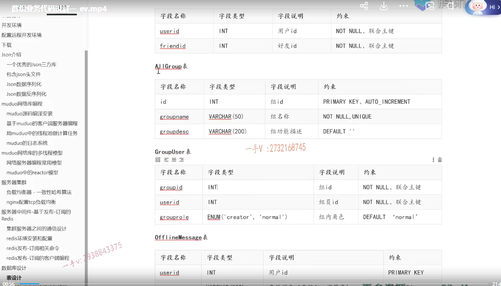

那么，整个的流程呢？应该大家都清楚了，业务开发流程，

# 完成群组相关业务代码 

所以在这里边儿呢？这节课里边儿啊？

我给大家把这个群组相关的这个业务代码也都写完了，

写完了在这儿统一呢，在这节课给大家梳理一下好吧啊。

这一块儿呢，大家就看着这个，我的这个梳理的这个过程流程以及最终我们提供的这个源代码，

大家把这块儿的业务呢？再去给他搞定。

## 先来看与群组业务相关的数据表

首先呢，跟群组相关业务相关的有两张表，

### 记录所有的群组

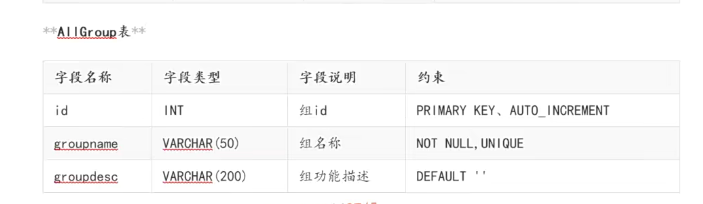

一个是all group，all group的话有三个字段，

一个是那就是区分每一条记录的这个主键ID嘛，对吧啊？

它是一个主键自增键，

然后呢？就是这个群组的一个名称，

然后群组的描述。

### 记录群-组员表  是一种中间表  记录群里有什么组员  组员属于哪个群

另外一个就是有组员嘛，对吧啊，

因为我们说呢，群组里边包含组员，一个组员可以在多个群组里边，

一个群组也可以包含多个组员，

所以呢，这个组和组员组合成员的关系是一个多对多的关系，

所以必须有一张中间表来体现它们之间的一个隶属关系啊，

所以在这里边就是group user这张表存在的意义。

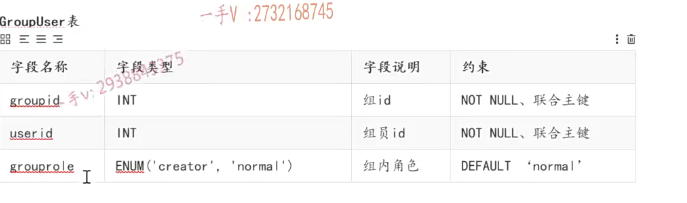

那么，它有三个字段，

==一个是group ID，这个表示哪一个组==

==这个user ID是表示什么啊？这个用户的一个ID。==

==它不仅仅表示了啊，这个组里边儿包含了这个用户，==

==也表示了这个用户呢，属于这个组里边儿的。==

这两个group ID跟user ID呢是作为一个联合组件出现的，

因为你加入这个组加入一次就行了，你不需要加入多次，对吧啊？

另外一个呢，就是有一个grouprole。

有一个成员在组内的一个角色信息啊，

你是组的创建者的话，你就是管理员crater对吧啊，其他人就是novel普通的这个成员。

好吧，当然这个业务如果要更复杂一点，

就是我可以由管理员来设置，把普通的成员的权限提升成是不是管理员啊啊？

那么，这就属于业务上的一个扩展了，我们就不详细给大家说了啊，

主要涉及的这两张表。就是这个好吧啊，

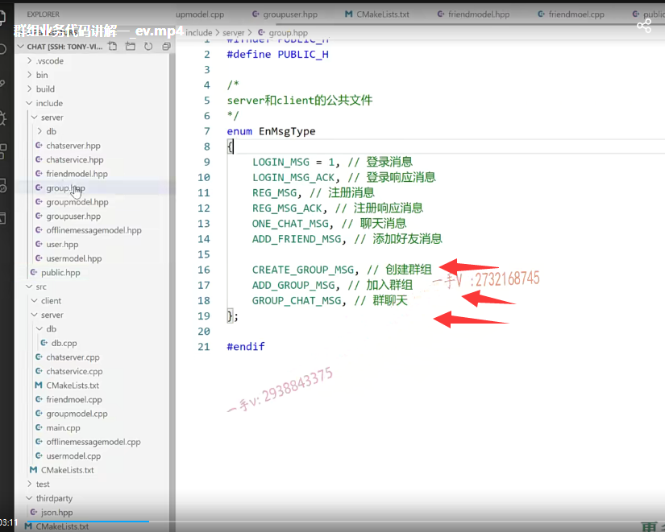

## Group类

来在这里边在代码上给我看一下，我输出的这个类。

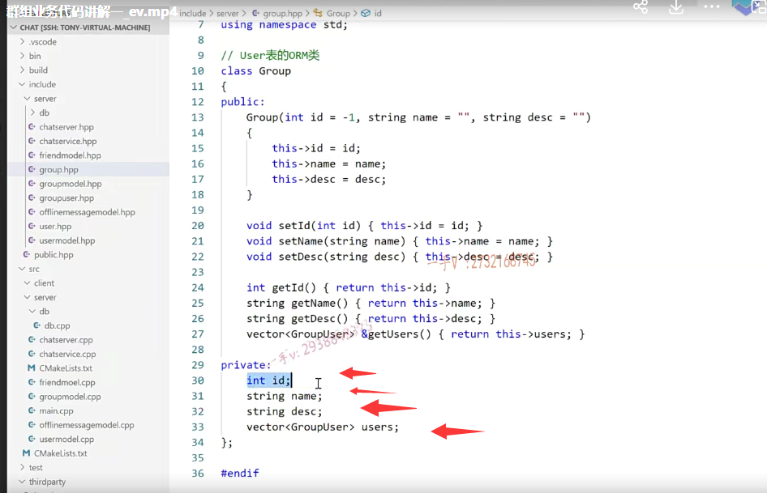

首先呢，输出的跟表相关的类，第一个是group这个类。

啊group这个类。大家来看group呢，

包含了四个成员变量，一个是ID，一个是name，

一个是就是组的ID，一个是组的name，一个组的dic。

### 成员变量中的vector是为了知道组里成员数，后面会把组的成员都放在这，给业务层使用

==为什么还要再加一个victor呢啊？就是说呢，==

==因为我到时候要获知啊，一个组里边儿有多少成员？==

==啊，所以我从数据库查出来以后呢，我就都把这个组的成员啊放在这个vector当中，给业务层去使用。==

好的吧啊，给业务层去使用，

### 不可能去多次查询，而是进行一次联合查询

因为在实际的项目中呢啊，这块儿呢，

我们有些查询是要涉及多个表的查询。

不需要在我们业务上发起多次的mysql这个连接啊，多次查询一次一次

连接一次查询进行一个多表的联合查询，就能够把数据查到了。好不好啊？

不需要进行多次的这个查询。

没问题吧啊，因为数据库的频繁的连接以及释放连接啊，这也是一个很耗资源的动作。

对吧啊，它后面的是socket资源啊。是不是/

所以我们常常在大型项目中对于数据库这一块儿呢啊，我们也会采用一个连接池。

OK吧，采用一个连接池呢，来去提高啊数据库的这个访问效率啊，

当然。如果信息呢，在多个表当中肯定是要进行多表的联合查询，而不是说我先在这个表查一下，

拿到结果，然后在另外一张表查一下，再拿到结果，再在另外一张表查一下，这样的效率实在是太慢了，好吧啊。

那么在这里边，我们就有一个vector啊，就有一个vector来存储这个组里边的所有的成员好不好？

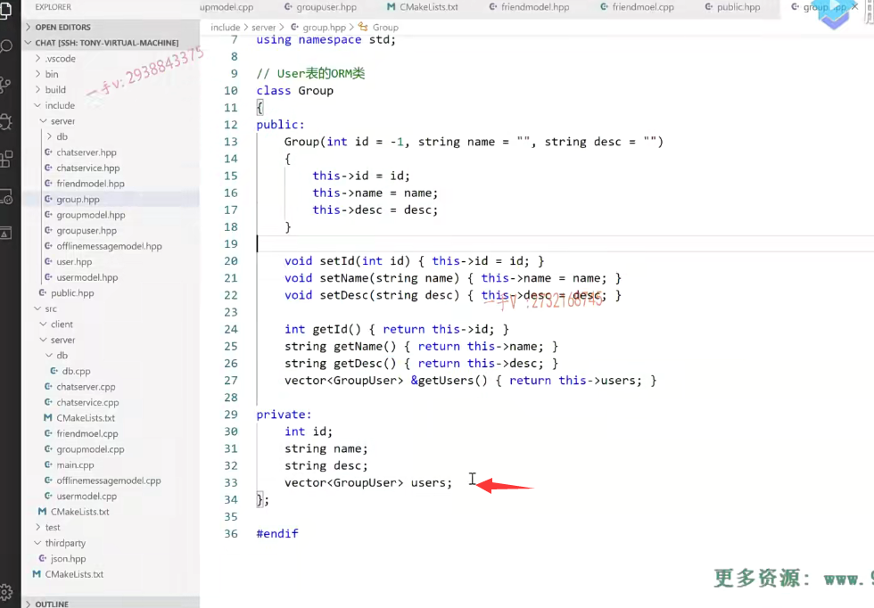

大家可以看到，在这里边我有写了一个group user，为什么要写一个group user呢？

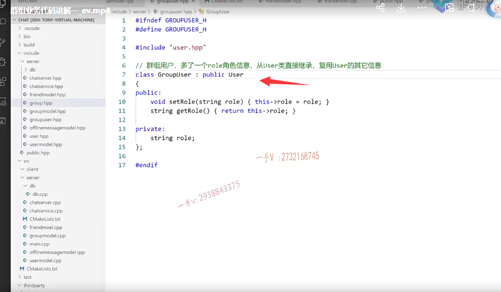

### GroupUser继承自user，需要展示其他信息，比如成员的角色信息

因为当用户登录成功以后，或者通过命令啊，

客户端通过命令来查看这个组的成员的时候啊，

我们不能光显示user信息啊，光显示user信息，那有这个成员的ID。就是用户号有姓名，还有他的这个在线状态对吧？

但是呢，在组里边去呈现人员信息的时候啊，你还有一个role呢。

就是在这个组里边儿呈现这个成员信息的时候啊，我们不仅仅要看到用户的上面儿的这些信息，还要看到他的一个什么啊，

唉，这个人是管理者。是群的创建者，还是一个普通的群成员呢？

对吧？所以在这里边，我们用一个group user，这是选择从user继承而来，

因为group user首先它是还是一个普通的，是不是用户啊？

那普通的用户呢？那就得有ID name password跟state了。

### 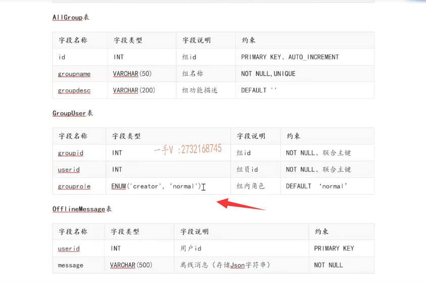==基类中是protected 可以继承过来，我需要思考下protected的作用==

这个基类选择了protected，是不是这些方法呢？

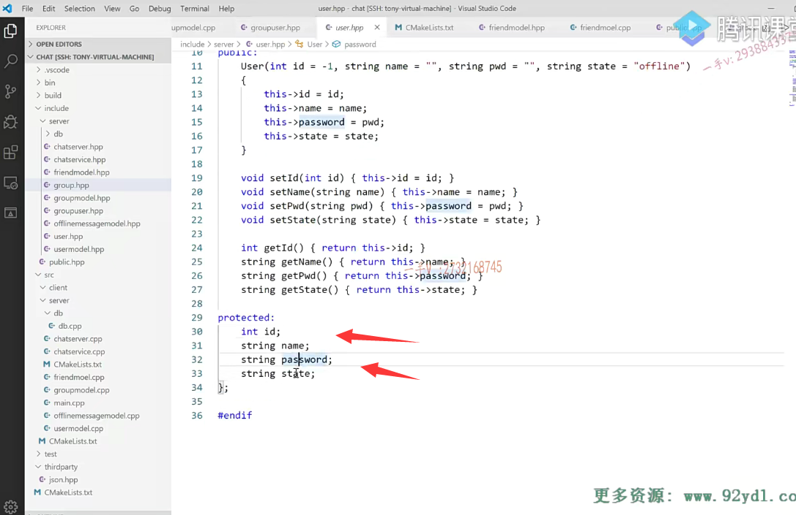

在group user里边就都可以继承过来了，

group user只是添加了一个派生类的，一个特殊的成员变量就是role。表示什么？

表示在群组中，这个用户的一个角色信息好吧，

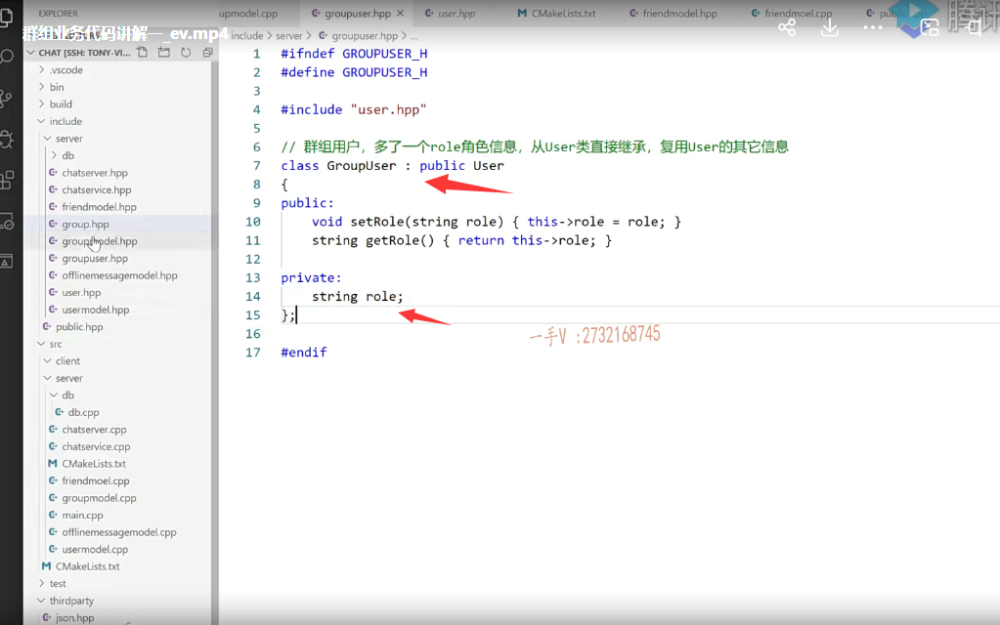

所以呢，大家也就能够明白了，

我刚才在group这成员变量里边儿噢，这里边儿呢，

没有用user去实例化vector。

因为呢，我们要查看组成员的时候啊，我们这个user信息呢，里边还得包含一个什么东西啊？

诶，还得包含一个group role。好的吧啊，还得包含一个group ro。

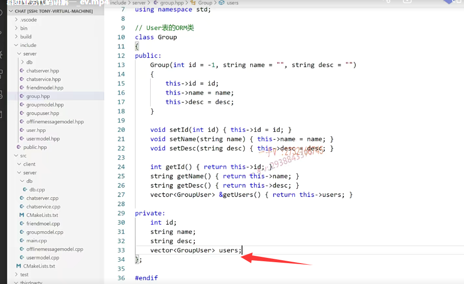

好了，这是我们创建的跟数据库啊，对应的两个基本的类好不好啊？

一个是group啊。group这个类，一个是group user这个类。

另外呢，就是操作这两张表，因为这两张表都是处理群组的啊，

所以我就没有分别定义一个model类操作对应的一张表，这两张表呢，都是处理群组业务的，

所以我这里边就创建了一个model就是group model来处理这两张表，

## groupmodel类来处理这两张表

大家来看一下啊，

### 创建群组

group model创建群组

创建群组同样的啊，你给我一个群组信息，我把这个群组信息给你写进去。

好吧啊，当然同一个群，不要这个重复创建是不是啊？

在这里边规定什么呀？规定这个群的这个group name是unique啊，群名是唯一的。不能多次重复创建。

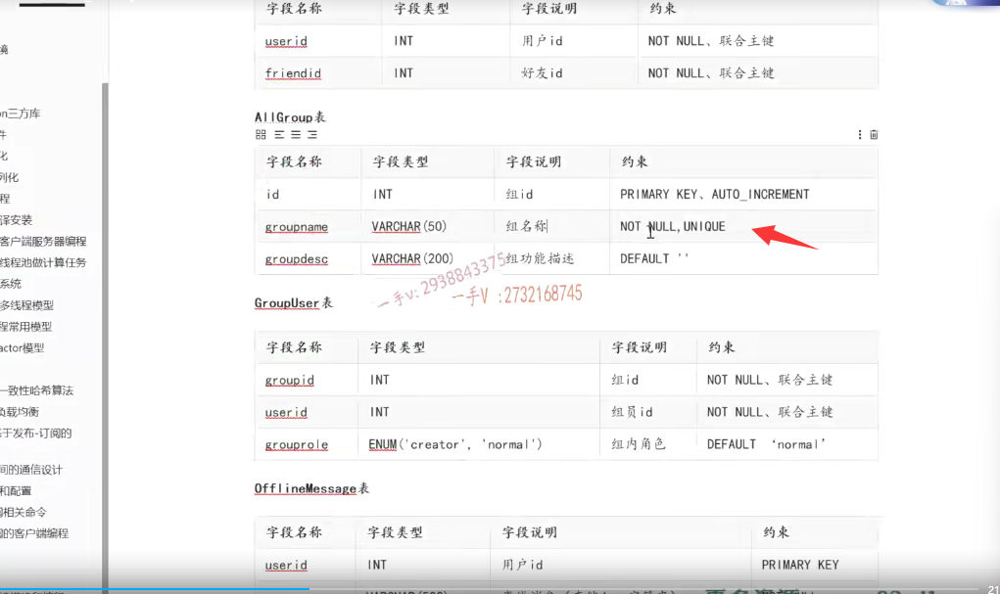

### 创建以后 id是数据库生成的，所以我们需要自己填一下

#### 创建以后呢，把group的这个里边的ID填这个填一下啊，

因为呢，创建的时候呢，我们只是插了name跟dic ID呢，主键啊，就是群号啊，都是自动生成的好吧。

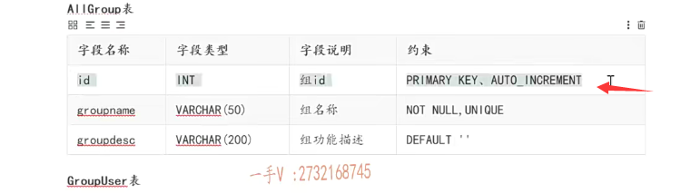

### 加入群组

ED group就是这个成员啊，要加入到这个组里边儿，他角色是什么？是不是是critter呢？

还是normal呢？

#### 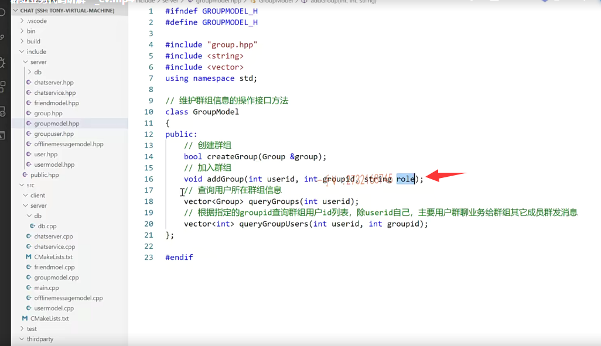

### 查询用户所在群组信息

对吧啊，这也是查询用户的所有所在的群群组信息，

这个主要就是用来干什么的就是。

我们用户啊，登录成功以后。

==你要给用户返回他的好友列表，是不是还有群组信息啊？==

==要在客户端呈现啊，到时候客户端呈现以后呢就能知道啊，我加入哪些组？==

==这些组里边分别有哪些成员啊？他们是他们的用户号是什么昵？昵称是什么？==

==就是name啊，他们是否在线呢？以及他们在这个群里边的身份是啥？是管理者呢？还是普通成员？==

啊，我就封装了这么一个model层的，这么一个函数接口来给业务层直接返回业务，

做业务需要的信息对吧啊，业务层就不需要看见数据库层的代码了。

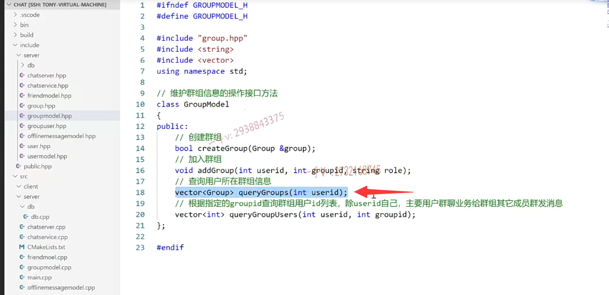

### 根据指定的groupid查询群组用户id列表，出userid自己，用户给群成员发消息

这个是干嘛呢？

这最后一个方法主要用于群聊啊，

因为群聊的时候呢，就是我给你，我就是比如说我和大家啊，在一个群组里边儿，我给你们发一个消息，

我发的是群消息，那么在这里边就需要知道啊。就是我所聊天的这个群里边的其他成员的这个用户ID。是不是啊？

### 利用之前的map 存的id和connection的键值对，来转发send

拿到这个用户ID以后呢？干什么呀？拿到这个用户ID以后呢？

那我们就可以在这个业务层的这个。因为我们业务层之前嘛，不是保存了用户的ID跟其通信用的connection嘛，是不是啊？

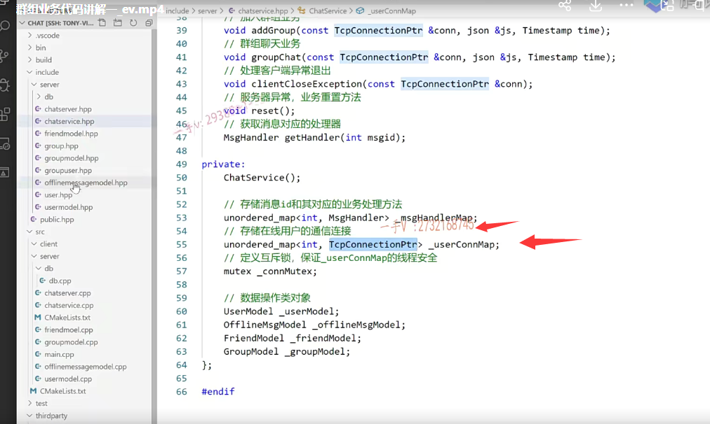

那然后呢？拿到你群里边的其他用户的ID就可以呢？在这个user connection map里边，找到这个群里边其他用户通信用的connection，然后通过服务器转发一下。把群消息转发一下就可以了。

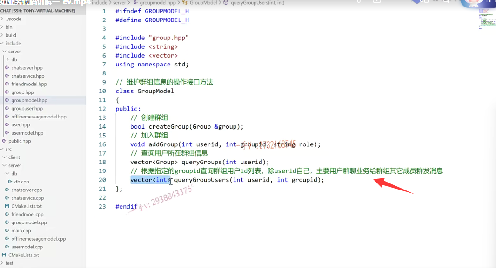

### 梳理一下四个方法的逻辑

能够明白吧啊，这就是这四个方法，

再说一下，第一个是创建群组。

第二个是加入群组。

第三个就是给某一个登录成功的用户啊，或者说是用户呢呃，通过一些命令啊，查询他现在的这个好友列表，跟这个群组信息啊。

那我们这个就可以返回该用户所在的所有群，以及他所在的群里边的用户的就是群成员的一个详细信息。

第四个，这个呢，主要是用于群组聊天的啊，

我某一个人。向这个群里边发一个消息，那么这个群里边的其他成员都应该能够收到，是不是啊？

如果这个群里边的其他成员有的在线就。直接收到信息了，

如果不在线的话，那当然还是存储离线消息。对不对啊？

这是这四个方法，大家先把它的这个所涉及的业务。给它考虑清楚了啊。

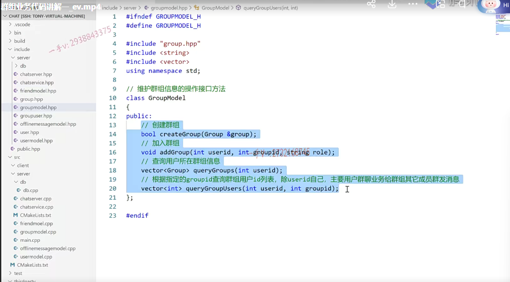

### 创建群组create的实现

接着呢，我们在这个group model这里边来看一看这四个方法的实现啊，

这个方法的实现应该是也是挺简单的。

create group那就是向这个all group里边增加一个群组信息，是不是啊？

insert into all group。啊，给这个group name跟group group dic添加数据就行了。

ID是自动生成的好吧？

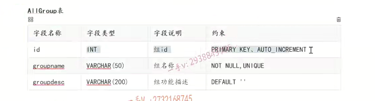

这个是一个引用变量啊values百分之s百分之s，因为都是字符串数据库的字符串用单引号括起来。name group的desc完了以后呢？

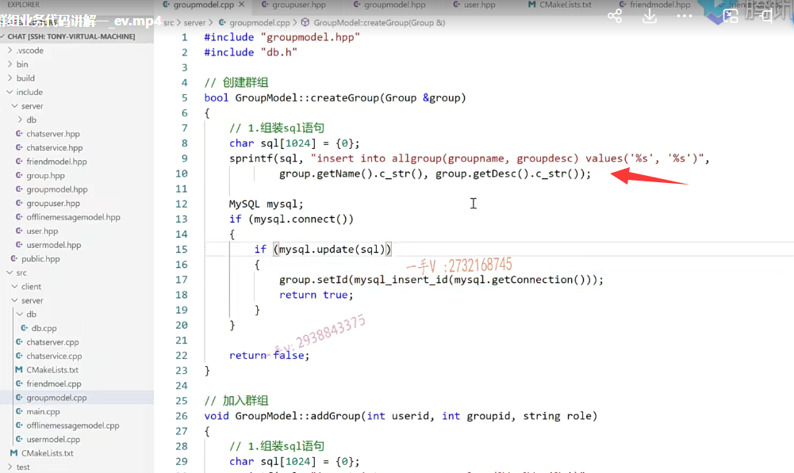

### mysql对象中可以得到连接，根据连接得到对象id,然后修改group的id

连接数据库update一下是不是update增加一个键值对的话呢，

那这里边应该是什么？这里边就应该是生成了这个记录的是不是主键ID啊？

唉，然后呢？再把主键ID拿出来，拿出来以后呢？

set到group就是这个把实参那个group对象的ID呢？给它修改正确。

是不是这就完了？

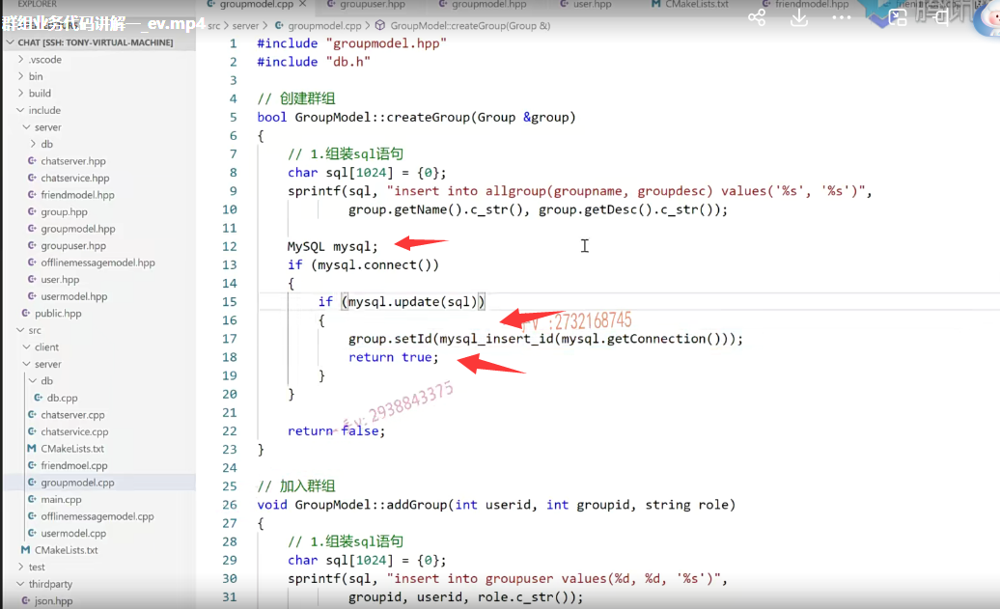

如果说人家这个用户名啊，原来就怎么样啊？

存在啊，就是组名原来存在。

是不是啊？存在的话呢？那就不要重复添加了，重复添加就出错，出错的话你就创建不成功。

这就这意思。

### 加入群组add group实现

加入群组add group，那也很简单insert into group user。就是哪个啊？就是这个啊，三个是不是group user values？两

一个是用户Id 这个组ID一个用户ID再一个字符串group rule是不是啊？

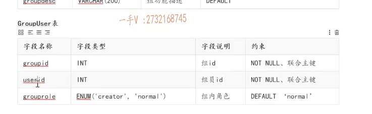

在这来看看我们的这个代码啊。数字字符串group ID user ID以及角色的这个表示，

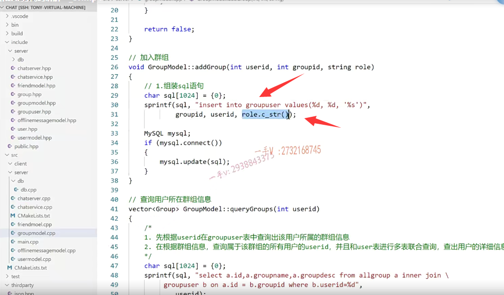

那这里边是直接update更新一下就可以了。

OK吧好。

### 查询用户所在群组信息

那么，在这大家来看啊，查询用户所在群组信息，这个就稍微有一点多

听，我来给大家去描述一下。

这边儿先根据用户的ID，肯定是要查询呢，这个用户都有哪些组？

当然了，我们查这个组不能光找组ID呀，

我到时候给客户端返回，你不能光返回一个组的ID，

你要返回组的这个ID号就是组号码，还有组的这个名称，还有组的是不是一些简要描述啊？

这些信息啊都要返回。

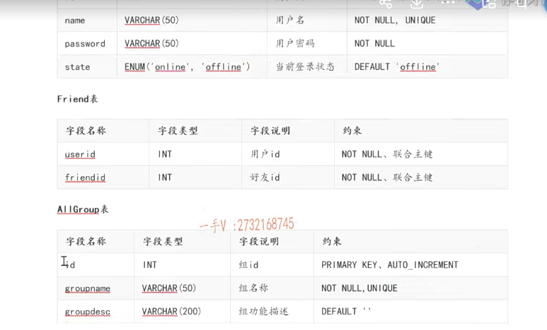

### 需要通过两个表的联合查询来返回组的信息

所以呢，第一次我在查这个用户有哪些组的时候，应该针对于group user跟all group进行一个两表的联合查询对吧？

就是把这个指定的user ID的所有的所在的组。好吧，以及组的详细信息都给它拉出来，

所以呢，第一个sql就是select a点ida点group name a点group dic。from all group a inner join，

一个内连接查询group user bona的ID=b的group ID。

也就是说b的group ID=a的ID是不是那过滤一下啊？

你要查谁的呢？where b的user ID是不是等于指定的这个user ID啊？

==这意思就是说啊，把指定的这个用户，他所在的群组的详细信息呢，全部查出来，包括这个组的ID。组的名称以及组的详细描述，这是在项目中是非常常见的好吧啊，==

### 开发思路要进行一个转变，对于数据库不能说是我每次查一点，要学会联合查询

那有些同学呢，是我先在业务上我发起一个查询，查到这个用户所在的group ID。

业务层拿到这个group ID了，再发起一次mysql查询，

你再通过这个group ID查询这个呃，相应的这个群的详细信息是不是，这你效率就太慢了啊？

你把你的压力全部转到这个数据库上来了。是不是

你要知道多少用户在请求数请求服务啊？每一个服务要访问都会访问数据库的，是不是啊？

尽量一次性访问数据库能做完的事情。都要做完，

要不然人家要多表联合查询干啥的嘛？是不是啊？

像你那样你啊，发一次链接一次查一点，一次查一点，

你好不容易去数据库一趟能多表联合查询完的就一定要查询完。

好吧啊，这是呢，大家这个开发思路要进行一个转变，对于数据库不能说是我每次查一点，每次查一点，抠抠索索的。

啊，这是你坑人家数据库呢好吧啊，数据库毕竟它是一个磁盘IO的，操作比较多。

比有一个做一个业务，不要频繁的去访问数据库，能拿到的信息你应该尽量写好sql语句拿到信息。

这也就是为什么有的同学呢，在公司实习实习的时候啊，公司里边的这个数据量都比较大，实习的时候呢？啊，给人家做相应的业务，写了一个sql语句啊，一进一下能花费十几秒，

被人家这个导师被人家老大呢。被人家把这个sql语句优化啊，直接能优化到这个一秒就是毫秒级之内，

你看这个写好一个sql语句呢，多重要对吧啊，

你可不要认为我随便写个sql语句。我随便组织一下，只要能在数据库里边捞着数据就行了，

写sql语句呢，是一个非常讲究的东西啊，你要在你的服务器应用程序代码上来改一改一些代码来提高你服务器的这个运行效率，这个可能是比较难的，

==但是你要把一个复杂的sql语句写好。让它能够提高你整体的服务器的一个运行效率，那是很简单。==

啊，因为sql与句子写的好与坏，在效率上体现的这个差别是很明显很大的啊。

### 通过sql吧group信息都查出来了，然后存入vec

那这个sql呢？进行一个查询就是这个啊，查询了以后呢？那就是一个group，一个group，

一个group就都查出来了，

是不是把这个user ID这个所属的组的信息就都查出来了，

我放在了这个group vec里边，

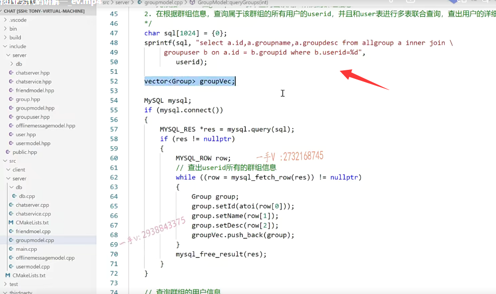

### 我要继续查询 缺这个组的组员

但是呢，现在这个group的相当于就是ID na medic是不是都有了，

还缺什么哎，还缺这个组的组员。

我要继续查询，把人家group这个对象里边的这个vector就是这个组的组员呢信息。

也怎么样啊？也查出来。

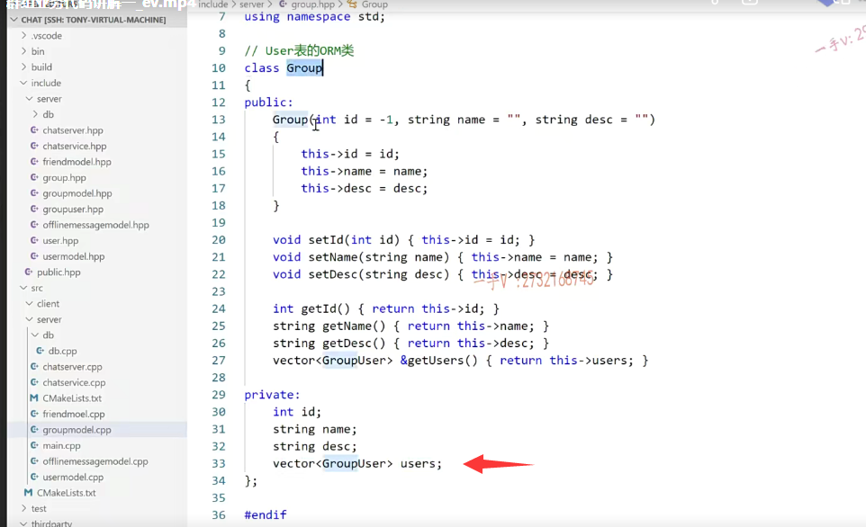

对吧，然后呢，你看就循环这个group vector了。这个用户user ID用户所在的所有的组啊，

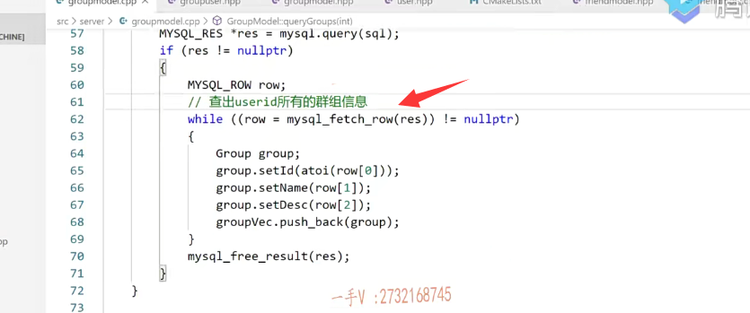

### 还需要查询群组的用户信息，又需要用到多表的联合查询 groupuser和user两张表

然后呢，组织select a的ida的name a的state b的group role。

==就是我们要查询用户信息的话，有用户的组用户啊，有用户的ID name state。是不是还有这个用户的什么呀？还有用户在群组里边所承担的这个角色。是不是啊？==

==这也相当于就是在这个多表联合查询，查询group user和user==

因为在group user里边呢，只能查到这个组里边所有成员的ID是不是？

但是肯定给人家用户不能光返回这个userID啊。

给用户在返回组信息的时候，肯定包含了这个组里边成员的详细信息啊，包括这个组里边成员的ID name。

还有在线状态，还有它承担的是不是组内的一个角色啊？

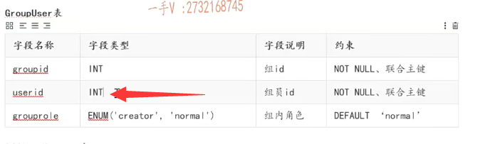

所以在这儿呢，就是又做了一个user表和group user这两张表的。多表的联合查询啊，

选择了四个字段，选择了user表的ID name state以及选择了b表group user的group role。好不好？

这也相当于是非常简单的这个两张表的联合查询啊，

内连接查询group ID就是我们所在的这个群组的这个ID。

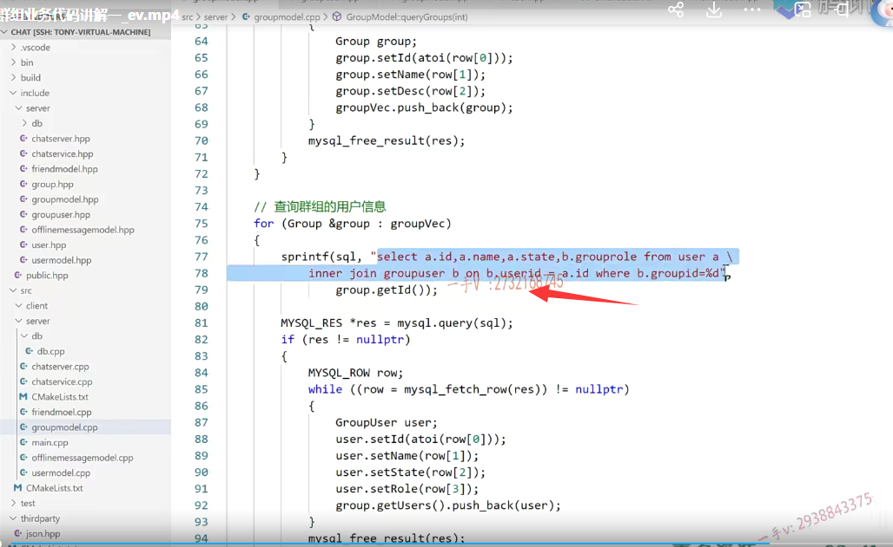

### 查询出来后，再放入群的组员表中

查询出来了，以后呢？你看啊，查询出来了，以后把这个用户的信息呢，

就写在相应的group user里边，

然后把它添加到当前的这个用户的get user嘛，

就是返回当前group里边的这个vector啊，

就是users一个组里边所有的用户的一个vector啊，

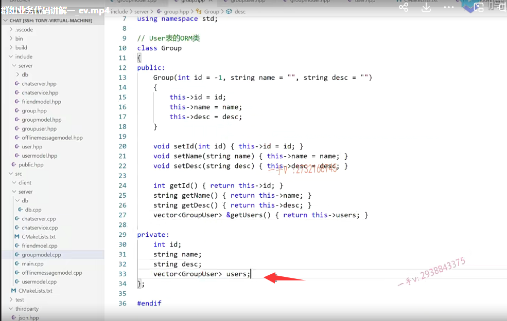

然后把它push back进去，对吧？

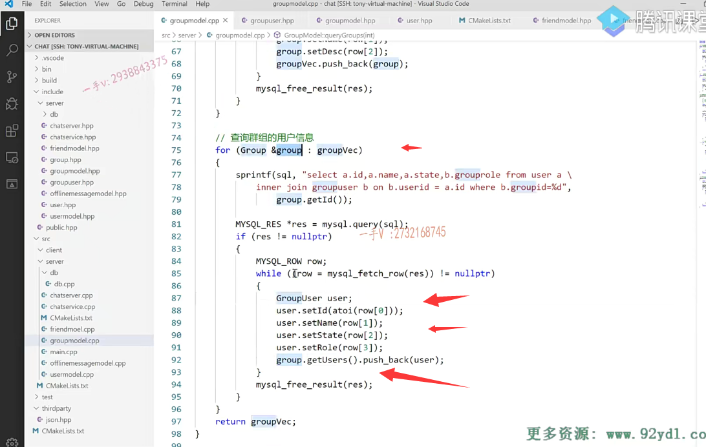

## 得到了groupvec, 存了这个用户所在的所有群组以及这个群组里边儿所有的用户信息

最后呢？就到这儿哎，这儿完了以后呢？

相当于我们得到了什么呀？

我们就得到了这样的一个东西，这个东西存了啥？

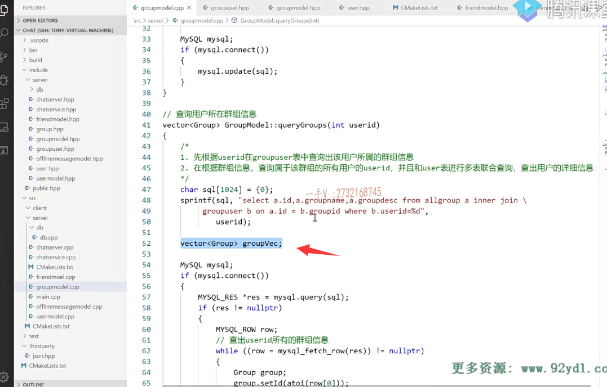

存了这个用户所在的所有群组以及这个群组里边儿所有的啥？所有的用户信息。

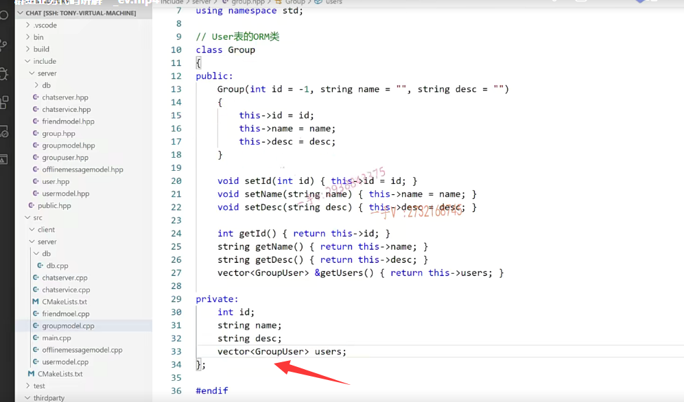

没问题了吧啊，这就是model层应该做的事情。

啊，你应该把所有业务层所需要的数据呢啊，

通过合理的封装啊，全部处理完成。

业务层只需要看见vector group或者vector user这些直接的对象信息，

而不应该看见直接的字段啊啊sql语句啊，是不是像这些东西啊？

### 群聊 根据groupid查群组成员 除自己

对，那最后一个就是群聊的啊，

那select user ID from group user，where group ID等于指定的group ID and user ID不等于谁呀？

不等于这里边指定的user ID。

==为啥呢？因为我发群聊消息，你就不要再给我转发了，是不是我发群聊消息你应该查询的是这个群组里边儿，除了我以外，其他组员的是不是ID呀？==

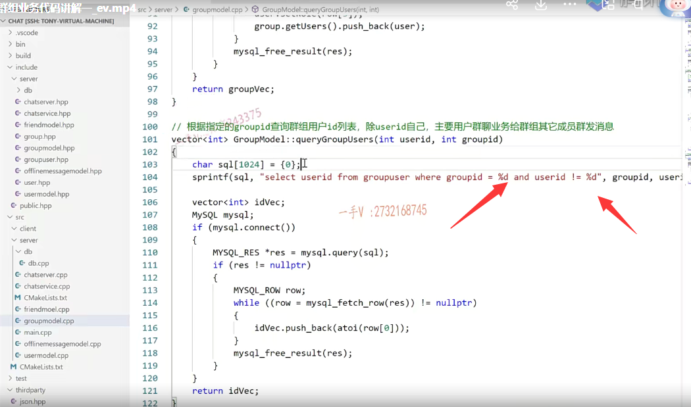

哎，然后放到这个vector里边儿可以外边儿返回。

## 总结

没问题吧啊。好，那这节课呢？

我们就先带着大家啊啊，做了三件事情，

第一件事情就是明确我们跟群组相关的处理这个业务所设计的这两张表好吧啊。

第二个呢，就是我们添加的两个东西，

一个是group这个类来描述组的，一个是group user啊，来描述组员的，

因为组员信息多了一个角色信息，其他的跟user一样，所以我们选择从user继承而来。

我们又添加了一个group model，这个model类呢，就是为了操作这两张表的啊，

all group跟group user这两张表的做数据的一个增删改查创建群组的。

加入群组的啊，返回呢，群组里边用户详细信息的。

然后跟群聊业务相关的这么一个model层的一个接口。

好吧啊，然后呢，又给大家讲了一下这个model层，这四个接口的一个具体的实现。

这个实现的方式呢，跟我们之前呢，都实现的的这个逻辑都是一样的，只不过业务所属的业务不同而已啊，

相信大家去理解这些东西呢，没有什么大的问题，

我们前边已经带着大家写那么多业务了，

我希望大家呢，能够是否能够呢？我已经带你写了百分之五六十的业业务了。

你是否能够自己呢？去把剩下的群组业务去写一下啊，而不是直接呢，

把我的源码一下载。直接去看，先自己写一写好吧啊，跟着我写了那么长时间了，应该也是有一些心得了。对不对？

好，那我们这节课就先说到这里。