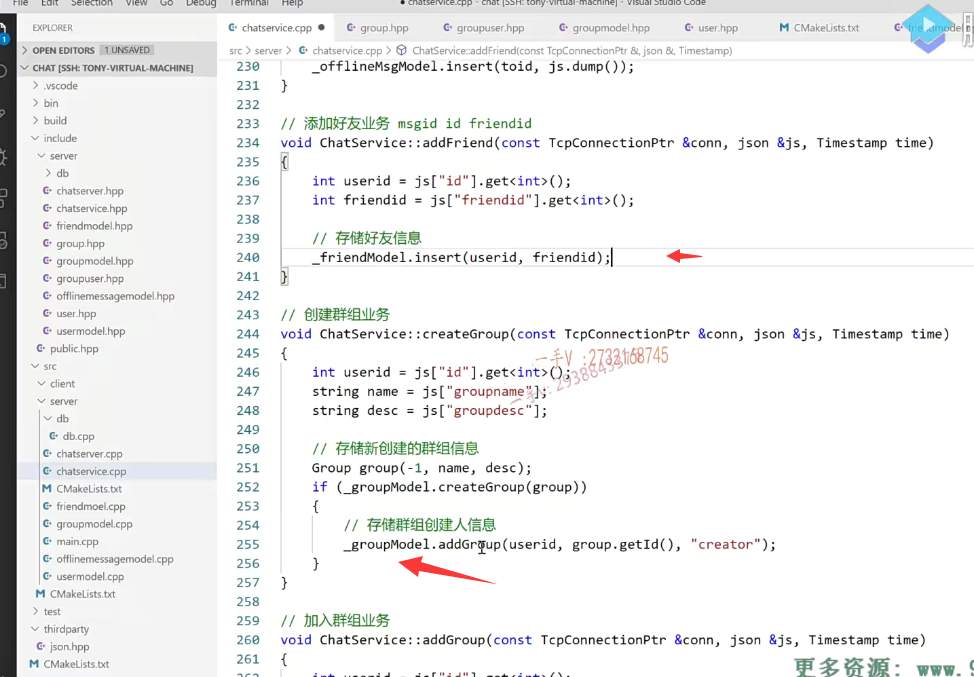
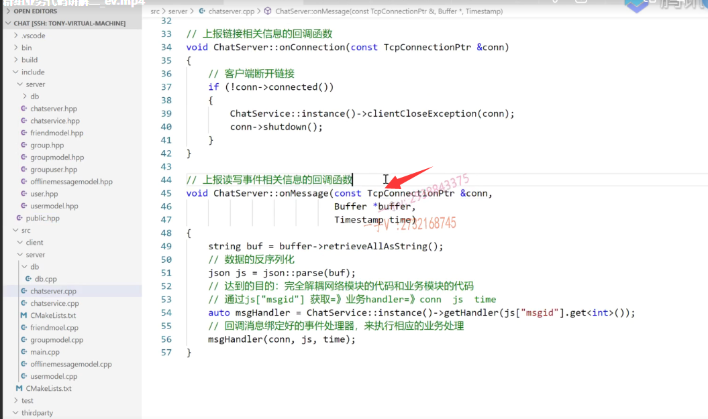

上节课呢，我们来说了一下群组相关业务的model层的这个代码啊，

这节课呢，我们来说一下业务层的跟群组业务相关的代码的输出。

### 注册三种消息

首先呢，在public里边儿呢，我们添加了三个消息，

一个是create group message，就是创建群组的消息，

一个是add group message，就是加入群组的消息，

一个是group chat message，就是聊群组聊天的消息。

### chatservice中添加数据操作类对象，来操作数据库

那接下来呢？那肯定就是在这个什么啊？

在这里边儿chat service就是业务的这个头文件里边儿啊，添加我group model。

嗯，处理群组相关的group model这个对象对不对？

我们就可以调用啊，跟群组相关的这个业务底层的这个model对象的业务数据层的方法了。

## 创建群组业务 createGroup()实现

好，首先呢，来看一下啊，这三个方法，

第一个create group，

### 从json对象解析消息内容，获取群内容

create group你这个客户端发过来的消息肯定是message type，肯定就是create group message嘛。

你要创建一个群，你肯定是带来了你的ID，就是哪个用户要创建群，是不是啊？

你要创建群的这个名称。你要创建的这个群的描述。是不是啊？

唉，这个获消息获取到了以后，然后呢？

### 根据群内容创建群组 当然群id暂时不知道 使用-1

创建一个group对象，把这些消息都传进去，因为现在群信息还没有添加到数据库。

#### 通过createGroup得到群组主键id

群的ID肯定是不知道的。

对的吧，然后呢，调用group model层的数据层的create group方法，

这是把这个对象传进来。这是我们用引用接受的嘛，插入完成以后呢，

这个群组一个新的群组被插入完成以后啊，

它的这个群组的主键ID是不是就自动生成了，

自动生成以后呢？把这个主键ID写到通过这个引用变量啊，把它写到实参的是不是ID那个成员变量里边儿啊？

那这样一来呢，这个群组的ID就获取到了。

### 群创建成功 将创建者加入群，角色为creator 

如果创建成功啊，当然了，我们说了你这个create group，人家是有布尔值的。

而且这个group的group name啊，人家是个你不能把一个名字的群组不断创建，是不是啊？

只创建一次啊。如果群组创建成功，那我要把创建群的人是不是加入到这个群组啊？

就是建立一下这个群组，跟这个用户之间的关系。

因为create group啊，只是写了这个群的信息。那你这个群跟人的这个关联关系怎么写呢啊？

就写到这个group user里边，这是创建群的嘛？

那这个群add group。user ID，这是用户的ID，这是群的ID，

那因为这是群的创建者，所以它的这个群的角色就是creater。好不好啊？

#### 常量名字在业务层来使用

实际上在这写这个嗯，当然没有问题啊，为了更好的话，你应该在你的model层啊，去定一些常量。

用这些常量名字在业务层来使用，这样会更好一点好吧啊。

## 加入群组业务 addGroup()实现

那么add group你看就传了用户ID群组ID以及该用户在这个群里边的是不是一个身份角色啊？

如果你是群的创建者，你肯定是creater，

如果你只是加入群的话，那你就是个normal。

这是加入群，你加入群的话，肯定有你的ID以及你所加入群的是不是ID呀？

哎完了以后呢？简单把这个就加到add group里边。就是normal，

这能看明白吧？用户ID群ID你的在这个群里边的这个角色啊，就是个normal，

### 自己也可以像登录注册时那样发送信息

大家会发现我们之前写的这个添加好友。创建group add group，我们是不是都是把业务做完就行了？

有没有给客户端返回一个响应啊？没有啊，你要返回响应也行，

你要返回响应的话，我们之前不是登录注册都有响应嘛？是不是啊？

这就还是那句话，看你业务怎么写了，你想在客户端这一块儿啊呃，添加一个好友呃，客户端上显示添加成功。

是不是啊？那你就在这儿给它发个响应。

加创建群组创建成功啊，那你就在这儿给他发个响应啊，这个f里边儿就是群组创建，恭喜啊，群组创建成功啊，

### 加入群组就没加响应，可以自己加，框架流程弄懂就行

这个else就是。啊，这个群已经存在啊，创建失败是不是啊？

该名字的群已经存在创建失败，这都行，

这个业务是很灵活的，这一点大家能理解吧？啊，业务怎么做？

简单做业务也行，做复杂的业务也可以，对不对啊？更重要的，我们是做c跟C++的。呃，

需要把整套的这个哎，这个软件设计的这个框架流程搞明白好吧，业务实际上不是非常的重要啊。

在这呢，加入群组业务，你看我也没有进行一个是不是响应啊啊？

你要发响应也行。是不是大家如果想发响应啊，参考之前的这块登录注册成功或者失败的这个响应。

啊，客户端呢，接受相应的这个响应的话呢，进行相应的一个打印就行了，

响应一般都是相应的消息，后边再加个ack就行了，就这样处理了。

OK吧啊，当然我们同学们也不是说看了这个项目视频就跟这个老师接触不上了啊。

项目书写过程中，你要基于我们现有的项目开发更加啊复杂的业务，

或者说是想把我们某些业务再补充完善。

啊，中间遇到了问题啊，欢迎大家随时在QQ上啊，向我进行一个详细的咨询好吧，描述清楚你的问题啊，我会这个给大家做一个详细的解答。

## 群组聊天业务 groupchat()实现

### 先通过用户id得到群组id,然后找到群里其他人id

#### ==有一个疑问，就是用户可以有多个群==，但是后面想了一下，这是给一个群里发消息

好，那么这个group chat大家来看啊，你要进行群聊，

你的消息转发到这个事件处理器上的话呢，

有你的ID，是不是有这个组的ID啊？

呃，就通过group model啊，查询一下你这个用户所在的这个群组的其他用户的ID

### ==通过遍历得到其他用户id，转发消息需要conn，所以需要操作userconMap，需要进行线程安全操作==

然后呢，我就可以循环这个ID了。

是不是因为要操作connection map啊？

在我操作它的时候，不允许其他人在其他地方 其他线程在user connection map里边进行其他的操作的，

这个其他的增删改查操作对吧啊？

因为呢，我们说了C++stl里边map它本身就不是一个线程安全的map。

#### 但是感觉互斥锁加的位置不对

好吧，这里边加了一个锁。这里边加了一个锁。

==因为我们这个锁的位置好像加的不对呀，是不是啊我们？一会来给大家看。==

### 如果找到了连接，说明是在线，没找到就是储存离线消息

这个完了以后先拿到idid找了，以后呢就找着这个用户，唉，

这个用户能找着这个用户的connection，那就证明呢这个用户啊，在线

在线的话，那就直接转发 键是该用户的ID值是不是，值就是该用户的connection啊？

如果呢没找着，那就证明呢，该用户不在线，不在线的话怎么办啊？

不在线，不在线就是存储该用户，该ID用户的一个离线消息。

### ==最好把这个互斥锁加在外边  保证了map表操作的一个线程安全问题==

好吧，为什么我刚说这句话不准确呢？因为这是一个循环。

循环的话呢啊，在这儿呢，会不断的进行加锁解锁操作没问题吧啊，这里边倒也可以啊，

倒也可以，因为呢，这儿加锁出了这个下一次循环的时候呢。啊，进入下一次循环之前，除了这个右括号，是不是它就解锁了？

但是呢，这个你最好就写到哪里啊？

写到外边吧。这个大家最好写到外边，

因为这是一个统一的啊，在这我现在给你们发消息呢，是不是啊？

你们现在有人下线，先别着急走着啊。要么把消息收完你再走，要么就是你在我发消息之前，

你是不是就走了啊？

所以呢，这就保证了map表操作的一个线程安全问题。

这能理解吧啊。因为我们的这个服务层，这之前给大家说过了，网络层呢，这个on message本身呢，

就是在多个worker工作线程上，

我们实际上设置了四个线程，那有就有有三个worker线程的。

这里边有会有三个线程，都会去调用on message。

在任何时候。是不是啊？

所以呢，在这个业务方法这里边儿，这就是群聊的一个信息。啊，群聊业务好了，

### 群聊业务等客户端全部开发好了，再测

那么对于群聊业务这一块儿的这个业务呢？

我们现在呢呃，直接手写json啊，不太好测试，

因为这块儿的这个业务还是相对来说是比较复杂的。

那我们后边就把客户端也开发好以后呢啊，

开发好以后我们再来去测试一下它的这个群组业务吧。

好吧啊，各位同学，那么通过这两节课的这么一个代码的梳理，希望大家能够把群组相关的业务搞清楚啊。

## 代码梳理

### 业务层注意map表的处理

我觉得对于群组这块的业务，主要是它业务上的一个逻辑，以及你在实现它的时候，在业务层注意。

还是那句话map表的操作在线发群组不在线发离线消息以及在数据层上啊。

### 数据层注意sql语句编写  联合查询

以及在数据层上，它的一个多表的一个联合查询对吧？

在说项目的时候呢？你肯定要首先要给人家说一下，

你这个项目里边数据库所涉及的表都涉及哪些？是不是啊？

### 数据表数量就说一万，百万就太大了

如果人家面试官问你，你这个表里边数据量有多少？

你可以说是一万计啊，一万两万可以说万计，

但你不要张嘴，就是我表里边儿数据有100万好吧，

这个级别就大太多了啊，级别大太多的话会涉及很多的这个表的优化。

甚至呢，涉及表的一些拆分操作，

这个你可能就答不上来了，

好吧，因为我们普通的学生，你所接触到的这个数据量。一般来说是不可能这么大的。好不好啊？

你要是觉得你插了十来行20行几十行这些数据不不好意思说，你说个一两万行也是没有什么大的问题的。

啊，那么这个涉及不到呢？呃，

因为只有一两万的话也不会涉及到大的这个性能的，这么这么一个瓶颈啊啊，

你如果张嘴就说五十万一百万的话呢，

这个人家就要问你数据库表的优化了。好吧啊，我们有的同学在面试的时候张嘴就来啊，我100万的数据是不是啊？

然后呢？就被面试官问到死了啊，问到数据库的优化了，甚至问到表问到表的这个水平垂直的业务拆分。

啊，怎么拆分？有没有用过分库分表的这些工具是不是啊？

这个就问到大家的软肋上了，好吧啊。

行，那我们就在这里边给大家把这个服务器相关的这个代码呢，就给大家介绍到这啊。

## 重新组织项目代码

然后呢？我们再呃重新组织一下我们的项目代码吧啊，

这个除了我们网络代码跟服务代码，主要是各自有一个类，

其他的是不是都是我们model层的呀？

### 创建新文件夹model,操作数据库的

在这儿呢，我在这个server上啊，各位，我添加一个new folder，添加一个model。

db就是数据库的

model就是我们数据层的就是封装了这个数据库的这个操作好吧，

我们把所有的这个代码呢就移到model里边来。

friend.还有。group啊。还有这个group model。大家想一想啊，我把这个代码呢移到model里边来，

我们的整个cm ake。集成编译环境需要改哪些东西呢？或者需要改哪些c make list呢？要不然这些业务层的代码跟数据层的代码燃到一块儿，看起来不舒服，

对吧？而首先呢，你看我把friend model group group model group user or friend message model以及user以及user model。就全部拉到这个model下来了

server层呢，就只放了一个chat server网络层的代码跟chat service服务层的这个代码。

## 修改cmakelists

### 顶级目录下增加搜索路径

那然后当然是在我的这个顶级目录里边儿。要在输出一个什么东西啊，头文件的是不是搜索路径啊？

是includes ever底下的谁？mom MOD l model.

好吧啊MOD l model。

### cpp也要新建model文件夹

然后当然呢，在这个s ever这里边啊。也要创建一个新的文件夹model。

那么，各位同学来想一想啊，在这里边。我要改哪些东西呢？还有offline message点cpp。还有这个user model点cpp啊。

这四个剩下的就是网络层的代码，实现服务层的代码实现以及一个启动的这个主函数是不是啊？

### server 中cmakelists修改 增加编译文件列表

那好了，当然是在这里边，我还要再识别一下当前目录里边的哪个文件夹下呀？

model文件夹下的是不是所有的cpp源文件啊？

把这写成一个model吧。model list哎，

然后呢，在这儿再添上也就是说呢，由我src server底下的当前server目录下的源文件，再加上db这个文件夹下的源源文件，再加上这个model下的文件夹下的源文件来共同参与编译再链接这些库来生成chat server这个服务器端的这个可执行文件。

### src中的cmakelist不用改

## 编译成功

好吧啊，这样一写呢，我们整个的这个。代码就显得很清晰了，是不是啊？好，

那我们重新呢给它构建一下编译啊。OK，这个编译成功是不是100%啊？build target chat server。

## 总结

好了，那我们现在的这个服务端的这个代码呢？

就是这样了。希望大家能够跟上我的进度啊，

自己去跟着学习所开发的项目也能做成现在这个样子，

要把整个的cm ake的环境编译呢，要能够构建成功。

### 完成的功能

==现在呢，我们相当于把这个新用户的注册 用户的登录是吧？==

==还有离线消息，还有点对点的一对一的聊天，还有群组创建群加群以及群聊的业务呢，==

==基本上就输出完了。==

==这个还有待我们写完客户端进行一个详细的功能测试好，==

那这节课的内容呢？就给大家说到这里。