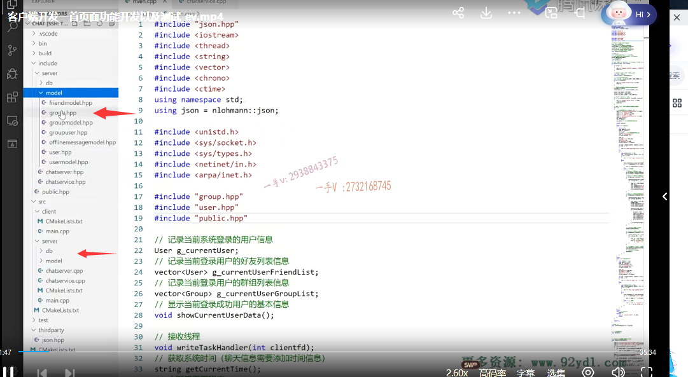
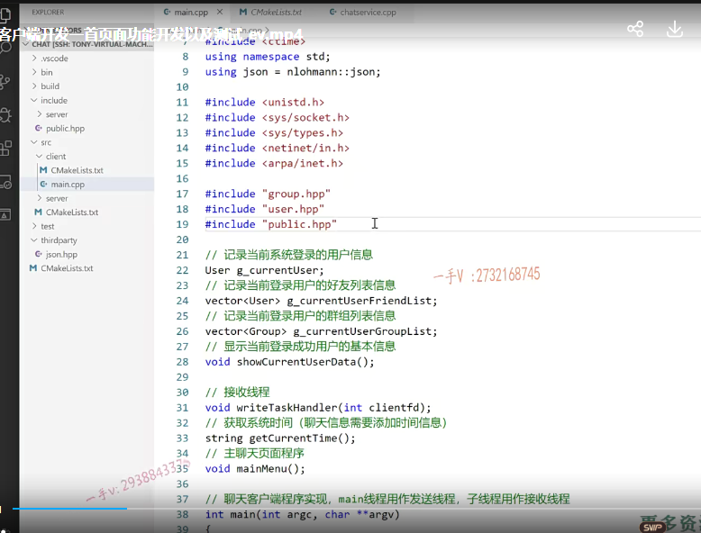
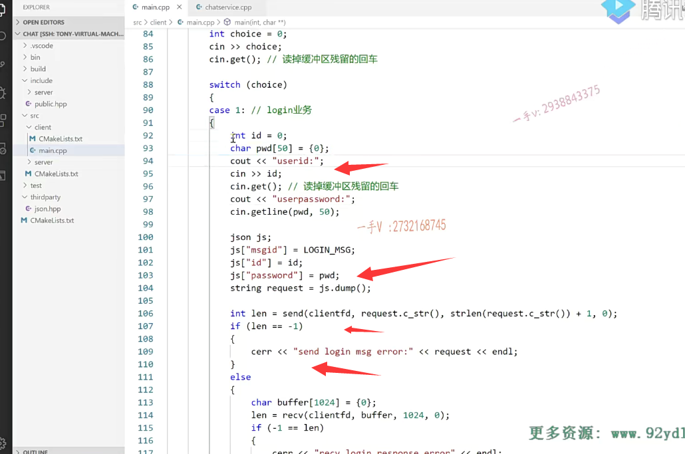
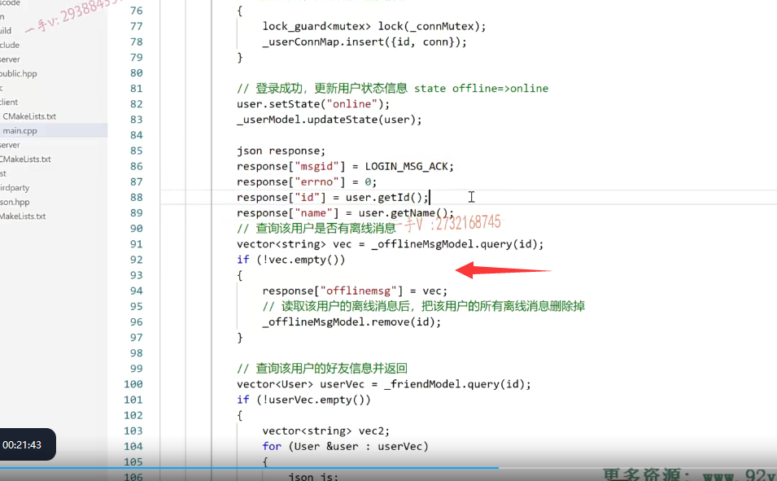

我们之前把服务器的这个聊天服务器的代码呢，

基本上啊功能该开发的就都开发完了。

当然了，到后边的这个集群版本的时候呢，我们要引入服务器的中间件啊，基于发布订阅的这个redis。

那到时候再给大家详细介绍啊，

我们针对于这个集群环境代码肯定是需要修改的，因为我们要跨服务器通信，对吧啊？

那么，这节课开始呢？我给大家把客户端这一块儿的代码呢梳理一下啊，

这个就不带着大家在课堂上一行一行写了，

因为客户端一 又是不要求高并发。

二就是针对呢，我们之前写的服务器，人家需要什么消息，你客户端就送什么消息，人家给你返回什么消息，

你就跟着去解析什么消息就行了啊。

业务上呢，没有太复杂的内容，

因为我们后边儿还有这个项目上的这个集群啊，方面的这个知识呢，需要给大家去讲解。

所以在这儿呢，我们就直接啊按模块化写好给大家，就直接讲了啊，

首先呢，我们聊天儿的客户端。跟服务器啊，会共用很多代码，

所以把它们放在一个集成编译环境中，是有非常大的优势的啊。

当他们客户端跟服务器共享的这个头文件之类的修改了以后呢，

对于客户端跟服务器呢，都是可以同步修改的，就是都是修改以后修改一份都是可见的，对吧啊？

客户端的代码就在这个clients rc的client里边，客户端在这里边呢，

我们打算就写在一个源文件里边就行了，它也没有什么头文件啊。

它所用到的头文件呢？就是public点hpp，或者说是model里边儿这些代表数据库的像group group类啊user类这些类啊。

### 集成编译环境上我们要添加一下子目录

那么首先呢，我们在集成编译环境上啊，就是src里边儿，这个cmg list我们要添加一下子目录，就是client，

因为client现在有代码了。有代码的话，我们就会在它下边给它放一个c make list。

那么你得在上一级的cmake list里边儿把client这一文件夹包含上，也就是说呢ii的subdirectory就是给你再添加一个子目录，你在这个子目录里边儿去找cmakelists去，因为这里边儿肯定有一个cmakelists指导你cmake去怎么编译东西对吧啊，

### client中的cmakelists

然后进到client里边来，这个aux source director大家已经知道了啊，

==把当前路径下就是client路径下的所有的源文件这个名字全部放在src list这个变量里边儿，==

==然后生成executable生成可执行文件啊，==

==它的可执行文件的名字叫chat client，就是聊天的客户端。==

然后呢？是根据谁生成的？根据我们这儿定义的client目录下的所有源文件的名字来生成这个chat client啊。

因为呢，在客户端这里边儿有读写两个线程啊，一个是读线程就是专门接收用户的呃，专门接收check server就是服务器发送过来的消息响应的啊，

写线程就是接收用户的输入 发送相应的这个业务数据。

那么，因为我们是一个基于控制台应用程序的一个客户端啊，所以就没有什么图形界面了，

所以操作起来呢 就会比较比较原始一点啊，都是通过命令来我们定义好的一些命令啊，来发送这个业务请求的。这个是要连接pthread的库好吧，

这个就是cmake上需要修改的啊，这也很简单，

一个是在src这里边添加呢client这个子目录。然后呢client下面有一个main.cpp，

新建一个啊，然后里边有一个cmakelistss，就是呢，通过这个main.cpp来生成这个chat server。

好吧唉，你要是嫌这麻烦的话，这个也可以去掉，直接把那点cpp写到这儿也行，但是这个库是必须链接的。

好的吧啊，那么我们现在呢？进入这个代码服务端在这里边呢，

从大体上来说啊，它是一个网络这个程序，

但是呢，它不需要高并发，因为又没有人去连接它，对吧？

所以在这里边，我们网络的编程上就采用原始的啊，基于linux的TCP编程客户端编程就可以了啊，

另外呢，从业务上来说就是啊，

我们用户刚开始执行这个客户端对吧啊？有一个登录注册，还有一个退出啊，

==当注册你可以注册新用户登录的话呢，==

==你输入用户名，输入你的用户ID用户号对吧？还有密码。==

==然后呢，就发送一个登录的请求到这个服务器来验证你的这个ID以及密码是否正确，==

==正确的话就进入这个正式的聊天儿页面的这个菜单了==。是不是啊？

来我在这个给大家介绍一下这个代码上啊的一个内容，

首先呢，在这里边啊。那头文件我们就不说了啊，在这客户端依然要用到这个json，

因为呢，客户端跟服务器通信用的这个数据协议就是json对吧？

### 我们需要去存当前登录用户的一些信息，好友列表，离线信息等

current user这个来记录了一下什么，当前就是当前客户端登录成功以后的。

就是用户就是哪个用户在使用这个聊天客户端的是吧？

就像我们QQ登录成功以后呢，那个界面上有显示当前的登录用户到底是谁呀？是不是啊？

这个就记录了。那么这个是记录当前用户的好友列表信息，这是记录当前用户的群组列表信息啊，

这个呢，相当我们登录的时候，登录成功以后呢？

服务器会给我们啊，把相应的这些用户的离线消息啊，好友列表消息呀，群组消息是不是全部给我们返回回来啊啊？

那我们就在客户端记录下来，这样一来呢，当我们用户想想看的时候呢，就直接可以去打印这些信息，

而不需要从服务器去拉这些信息了，对吧啊？这样的话呢，效率会比较高一点。

没有问题吧啊，效率会比较高一点好。

### showdata（）方法

这是三个是存当前登录用户的存，当前登录用户的好友列表信息存，当前登录用户的群组列表信息，

这是显示当前登录用户的基本信息啊，

这实际上没什么东西，就是你看啊，

显示一下当前用户登录的用户ID是什么名字是什么？

如果他的好友列表不为空的话，来把他的好友列表呢打印一下啊，

打印了好友的ID好友的名字以及好友的在线状态。

如果他的群组呢，也不为空，那我们打印一下他的群组信息，就是他所加入的群组的ID群组的名称，

群组的简要描述以及这个群组里边儿所有的成员的信息包括成员的ID，成员的名字，成员的在线状态以及成员的角色是管理者还是个普通人，普通成员。

好吧，这就是基本的这么一个show方法啊。

### 接收线程 发送线程的编写

然后在这里边儿呢，这就是一个接收线程啊，

因为呢，我们发送我们在是一个控制台应用程序要接受用户的手动输入，用户不输入的话呢？

那个输入啊cin啊，它就一直是阻塞在那里的。对吧啊，

你要是一个单线程的话，你不能说我聊天儿的时候，我要是不发，我收也收不了了，你不能这个样子啊。

对吧啊，那聊天儿的话嘛，那是我想发就发啊，

但是我如果没发也不影响我接收数据啊，

==就是发送数据跟接收数据，它是一个并行的。==

所以在这儿呢，我们用主线程啊，作为一个发送线程啊，

子线程用来做做一个接收线程。

好吧啊，做一个接收线程。啊，实际上这里边的名字写的不正确啊。

这接收线程应该是read，是不是read pask handler啊？

嗯，在这里边改一下啊，这个名字呢，不太对 是接收线程啊。

### 获取系统时间 使用C++11的方法

好，这个是获取了一下系统时间啊，这是封装好的一个方法，

==大家有兴趣可以看一下，用的是C++11的一个方法。==

因为聊天的时候呢，我们附带消息的时候嗯，想附带一个聊天的这个发送消息的是不是时间啊？

==唉，对端看到的就知道是哪年哪月哪日啊，几时几分几秒，哪个人给我说了这个消息好不好啊？==

### mainMenu()主聊天页面程序

然后呢？这个是一个聊天的，这个主聊天页面就是登录成功以后才能进这个。

## main函数讲解

### 先判断参数数量，然后通过命令行参数获取到ip和port

啊，这也是呢，给大家啊说了一下这些全局声明的函数啊，

定义的这个变量都是做什么用处的啊？

main函数一开始先判断命令的这个个数，

因为客户端呢，在这里边启动的时候呢，是需要在命令行上输入服务器的IP地址跟端口的。
好吧，在这里边解析一下服务器的IP地址，跟端口分别是一个字符串跟一个啊无符号双字节。

### 创建TCP的socket，然后是绑定一下服务器的地址

然后呢，这是创建一个TCP的，这个socket嘛，对吧？

这也没什么问题，

这是绑定了一下服务器的，这个IP地址跟端口号。

好吧啊，这应该都知道，不需要做过多解释了啊，

### 在跟服务器进行一个连接

然后呢？这个是跟服务器进行一个连接，如果连接失败的话呢，在这儿。

我释放资源，然后退出好吧？

### 接着是一个死循环，我们用户没有登录成功的话，他是一直可以停留在这个show页面

在这里边儿呢，接着就是一个死循环了啊，因为我们用户呢，如果没有登录成功或者没有退出的话，它是一直可以停留在这个首页面啊。进行操作的。

一上来就显示这个首页面啊，登录注册退出。

### 服务端有点地方修改了，改成英文了

到现在为止呢，我们服务端的代码都是之前写好的啊啊，服务端的代码呢，

==唯一跟之前有一点不一样的，就是我原来把这个中文的这个错误消息都改成这个英文了，==

因为我发现我写完了以后。客户端全部用的是英文啊，

==像这个就是this count is using input，another就是你输入的账号啊，它已经是online就人家已经在使用了，==

==你重新输入是不是？==

还有一个就是你登录直接失败了，就是name。ID all password is invalid就是这个用户号或者是密码是错误的，需要重新输入，对不对啊？

### ==当我们再读取选择choice是一个整数的时候，后面又需要读取字符串，那么我们需要将缓冲区中残留的回车读掉==

好在这儿呢，你看啊cout这个提示一下choice让你选择。选择了以后呢？

你cin一下，注意啊cin这输入的是一个整数，但是你注意啊，

==你输入整数的时候呢，这不管是在c跟c++里边都一样，==

==你前边是个整数，后边要输一个字符串。==

==如果这个整数后边不读取残留的回车的话呢，==

==那后边的字符串就直接把缓冲区残留的回车就读掉了，==

因为我们注入一个整数，实际上是敲了一个整数，再敲了一个回车啊

cin呢，后边儿跟个整数，只能是把缓冲区里边儿整数读出来。

缓冲区里边儿那个回车还残留着呢，后边儿你再直接读个字符串，你根本就没有机会输入它，直接把回车就当字符串读掉了好吧？

所以呢，我们一般一个好的习惯是当从缓冲区读一个整数的话呢，

我们一般都会在直接把残留的回车是不是再读掉啊，防止后边呢直接跟着整数读取的，后边读一个字符串啊，

产生问题。

# 三个业务

那么，我们这儿主要就是三个业务嘛，一个是登录一个注册，一个是退出好吧，

我们分别把这三个业务呢来给大家去说一下啊。

#### 这是刚才改名字的

这是刚改了名字的啊。大家稍等一下，我把这个名字先改一改。

### 退出业务 把socket资源释放掉

我们先一个一个看吧啊，先看这个退出业务很简单，退出啊

首页面因为还没有登录成功呢，这直接exit就行了，

又不需要向服务器发送一个什么下线的消息好的吧啊，

这就是quit业务，这也没什么说的啊，这没什么说的啊，

在这儿呢你？quit你最好把谁也关闭掉一下这个资源释放掉好吧啊，

### default 输入了一个我们没有写的业务

那么接着呢，就是有一个default啊，就是除了一二三，你乱出一个，其他的input invalid啊，重新循环重新输入是吧？

## 注册业务 case2 

### 读取名字，密码，不使用cin>>会遇到空格退出，使用cin.getline()遇到回车退出

这个注册业务呢？

简单，因为注册需要填写用户名和密码，

然后定义了一个name password，

然后输入这里边儿没有用cin大括号，大括号对不对？

因为呢cin大括号，大括号啊。跟大家那这个scan f一样，在读字符串的时候啊，遇见空格回车非法字符呢，

它都是结束输入的。

如果你直接这样去读取一个字符串的话呢，那你输入的名字里边不能带空格，要带空格的话呢，

你比如说你输入一个张三啊。啊，那他就只能读出一个zhang来，因为他遇见空格，他也就结束。输入了好吧啊，

所以呢，在C++里边用cin点get line啊，你在C语言里边用什么用get gets对吧？

它是默认遇见回车才结束的啊。

### 组装json对象

好，这是读取了用户名跟密码，通过用户手动输入，然后组装json数据，

#### msgid一定要对，是消息的类型，绑定了回调

你看看吧，你服务端这里边的注册是不是需要首先你把message ID要写正确呀。

因为人家的这个注册业务处理器跟哪个消息是绑定的，跟注册消息是绑定的。

### 组装号json后，将json对象序列化成字符串发出去

好吧，所以在这里边呢，你message ID是reg message，然后呢，

你在这里边人家需服务器需要读取的字段json字段是name跟password是不是？

所以你客户端这里边组织的也是name跟password组织好，

以后呢把这个json数据对象序列化成这个字符串啊。

啊，然后呢？你就可以通过网络给它send发送出去了，

### 发送成功以后，recv会阻塞等待

发送出去以后呢？

如果发送出去以后，然后在这receive阻塞等待。

这个注册请求的是不是一个响应啊？

### 响应成功，进行反序列化

响应成功以后，那你知道啊，响应过来的都是buffer都是字符串，buffer是吧？

在这里边儿，这叫序列化还是反序列化呀？各位还有网络接收的原属数原始数据在反序列化啊，生成这个json对象。对不对

### 然后判断响应消息中的errno错误号，成功就是返回0

人家返回的是什么东西嘛啊？注册成功就是这个注册失败，是不是就是这个呀啊？

那我们在这里边看这个errno就行了。errno呢是零，就是注册成功errno是不是零，

就是注册失败啊，注册失败人家也没有带l message，

是不是注册成功人家带了这个用户啊？注册成功以后就是给数据库添加成功以后，这个用户的用户号相当于就是这个用户的QQ号一样，没问题吧？

来看如果不等于0 errno，不等于零，说明呢注册失败了，我们这打印一下。就说你刚才输入的这个名字呀。就是已经存在了啊，你就不能用这个用户名再重复注册了是不是？

这一转一圈儿break又返回到，是不是这个首页面你重新输，重新选择？

### 成功会返回id（类似qq号）

啊，业务进行操作啊，注册成功的话，

在这里边儿呢，大家来看，就是你刚才注册的这个名字呀register success了。user ID is什么这个啊，do not forget it哎，

人家呢，会把这个注册成功，会把这个用户号是不是给你反馈回来啊，你把这个用户号就记好。

因为后边不管是登录啊，还是怎么样子的，那都是跟我们就相当于我们QQ号是不是有关的啊？

那跟我们的号码是有关的好吧，都是拿号码在标识某个人了。

没问题啊，这就是我们的注册的这个业务就是这样子实现。

大家把这个梳理一下啊，我建议大家呢，自己手动去写一写。

## 登录业务

然后就是一个登录业务了啊，登录业务呢，就稍微比较复杂一点来，在这儿呢，

我们来带着大家一起看看。

登录业务首先一上来啊，是让你输入这个ID跟这个密码对吧。

我们都是用用户号来进行登录的，所以所以呢，你相当于你要把你的用户号要记清楚啊。

这个登录发什么消息？那你就这就是不同的软件啊，不同的这个软件，这个客户端跟服务器，、

你俩之间要进行通信，

首先你俩得说一国语言嘛，对吧啊，

这个字段都得保持一致。这里边需要解析ID跟password，那在这里边发送的就是message ID填上log message，填上ID跟password发过去，

服务器端是不是就能解析了？那么，这里边进行json数据对象的这个序列化啊，序列化成字符串，

再从字符串还原成json对象的话，这就是数据的反序列化。

当我们发送的时候啊，需要把json的数据对象序列化成字符串发出去。

当我们对端接收到一段数据，想把这一段数据从字符串给它反序列化成数据对象，

这叫反序列化好吧啊，就是发送方式序列化接收方要还原数据反序列化

这个发送出去，发送出去以后呢？

发送成功，发送成功在这里边儿呢，我们阻塞等待这个登录的是不是响应啊？

### 服务器登录会有三种响应

登录会有三种响应，

一是呢，你输入这个ID呢，不正确，或者说是ID正确，但是密码却不正确好吧啊，密码却不正确，

那么就是一个ID of password is invalid啊errno是个一反正不为零啊为零呢，

我们说是一个正确的响应。

那如果呢，你ID也正确，password也正确，

但是我发现呢，在你登录的时候啊，

你登录你第一次，应该是你第一个使用这个账号对吧啊？

这个账号肯定原来状态是个off land，那如果是个online就说明人家别人已经在这个主机上已经用这个账号登录上了？

登录上那你就不能再用这个账号登录了？好吧啊，

你就不能再用这个账号进行一个登录了啊呃。

### 类比QQ的重复登录逻辑，可以自己从尝试去实现

在这儿呢，你看啊，我们QQ上是怎么做的呢？

那人家QQ这当然是那么大厂那么大的一个项目团队在做对吧？

如果是online的话呢？人会给你返回一个啊，该账号已经在其他电脑上登录啊嗯，是否关闭其他电脑上已登录的这个客户端？

那意思就是说你可以，你如果继续坚持在这台电脑上去登录的话，那其他电脑上已经登录的这个账号。啊，它是不是人家服务器就要给你把它的状态就要进行重置了，比如说置成offline并通知那边的客户端下线。

没问题吧啊，这就是这之前说的啊，业务没一个尽头啊，就看需求了，是不是啊？

你提什么样的需求？就可以开发什么样的业务啊？

业务这一块儿呢？我们就不继续去扩展了好吧啊，这个大家做到这儿呢，如果我们自己想提一两个需求点，

我相信啊，大家现在也完全有能力去做这件事情。

### 服务器登录成功 处理

好，这是两个意外的，还有一个正确的，正确的是什么呀？就是登录成功了，

唉，把你这个用户的connection插到这个connection map里边儿。

然后呢，把用户的数据库里边的状态改成online对不对？

然后呢，就开始琢磨着给客户端返回消息了。

message ID就是log en message ackerrno是零。得登录成功唉，

给用户是不是又返回了他的这个name啊？

就是让客户端可以在他那里记录一下当前用户的这个昵称之类的啊，

==实际上呢？就是我之前在开发服务器的时候也给大家说了嗯，为了减少服务器的压力，==

==像这种好友列表与群组列表啊。实际上，一般都是在客户端这里边存的啊嗯，==

==那么我们选择都是从这个服务器是不是拉回来啊啊？==

#### 返回离线消息

所以呢，这个我们客户端上线以后啊，服务器要给用户返回的数据还是挺多的。

在这儿看看就检查该用户是否有离线消息，有离线消息的话，

#### 好友信息

组织这个有个offline message，

有好友的话会有一个friends

#### 有群组消息

有这个群组消息的话，会有一个groups，

这个我们之前是不是都给大家说过了？

所以呢，这块儿登录成功以后，大家看先反序列化，从网络接收的buffer啊，得到一个json对象。

## 看客户端对于响应的处理

然后呢？

看如果发现返回的errno不等于零，

那我就是不是把这个message这个字段的？内容打印一下啊，人家登录的这个message error message都有是不是啊？air message都有异常的。

对打印这个就行了呃，

### 登录成功 全局变量 然后客户端再任意地方都能访问

如果说是登录成功唉，登录成功以后呢？

我们不是有一全局变量吗？

各位全局变量想记录当前登录用户的一个ID跟name啊？

因为我们登录成功了，而服务器会把这个当前登录成功用户的ID name是不是给我返回回来的啊？

实际ID返不返回都无所谓，因为ID呢就是我上边是不是发送过去的啊？

那既然返回回来了，我们就取一下，取一下在这里边填一下，

填到这个current user里边，

### 好友列表信息的处理

==然后我们在客户端的任意地方啊，就能访问到噢，当前是哪一个人是不是登录登录成功了，==

#### 判断是否json对象有friend这个键

对那么再来看一下，

首先呢，因为有些人有好友，有些人没好友，对吧？

那看一下这个json字符串里边到底包不包含friends这个键？

OK吧啊，包含这个键的话呢，然后就取里边的friends，我们当时填的时候这个friends

你看啊。填的时候是怎么填的？

是把每一个用户都序列化成json字符串，是不是填到这个vector里边儿了？

### 当初就是将好友user信息序列成字符串放入vec,现在从vec中解析，再放入全局好友列表变量vec中

所以现在唉，我们是反过来，那么从这个vector里边啊，取出来的一个一个字符串，

实际上都是json字符串里边包含了一个用户的信息呀？

唉，你看我们循环了这个vector，从vector里边取出来一个一个的json字符串，

然后在这里边进行json的反序列化。得到json的对象，

然后呢，我们就可以创建一个user了，创建一个user，

然后把这个再添加到即current user friend list里边儿。

啊，就是相当于把用户的好友信息呢全部给他反序列化出来。

然后填到这个全局的vector里边。

这相当于就是把好友的当前用户的好友列表信息，是不是给它保留下来了啊？

### 处理群组信息 和上面差不多

同样的方式呢，在处理了什么，在处了处理了这个群组信息。好不好？

这个群组信息有什么？这个群组信息有这个群的ID，群的名称以及群的描述对不对？

唉，以及这个群的所有用户，用户的ID name state以及在这个群里边的是不是角色信息呀？

#### 服务端怎么打包，客户端怎么解析

这儿为什么这么解析？

唉，那你就看你服务器这一端给人家进行打包的时候啊，是怎么打包的？

按同样的方式呢进行解析就可以了。好吧啊，

这块呢，我相信呢，问题应该不会很大在这呢，大家呢可以呃，不熟悉的同学呢？

唉，首先呢，希望大家在学习的时候不要跳着看好吧，按顺序看，

而我们给大家组织的这个视频课视频课程呢，也都是按项目的开发顺序来讲的啊。

所以呢，一一个知识衔接一个知识的啊，你前边儿如果呢都消化了，尤其是服务端这一块儿，

我们当时是怎么给用户返回群组消息的？

那我相信你在理解这一块儿，解析的时候呢，应该也没有什么大的问题了啊。

完了以后呢，就是show count user data就是把刚才解析的当前用户的信息好友列表以及什么呀，群组列表的信息呢？

## 显示用户登录的基本信息

在这儿打印一下嘛。对不对的啊？

打印一下啊。这个是登录成功了。

## 显示当前用户的离线消息，个人聊天信息或者群组信息

如果呢，登录成功以后，如果有offline message啊，

我在这输出一下。

我在这里边要输出一下offline message。

大家来看啊offline message。

这是什么时间？哪个ID？什么名字？说了什么话？是不是说了什么话啊啊？给你发送了什么消息？

你当时没在线，你现在上线了，人家就给你把这个离线消息呢？就都怎么样啊？都返回回来了好吧，

这返回回来以后呢？

## 登录成功后，启动接收线程

### thread不像pthread一样传四个参数

各位那相当于登录成功了，登录成功我们就要启动一个什么线程了。

启动一个接收线程了啊，这是C++11给我们提供的线程库，

实际上呢，它底层在linux上呢？就是对呢，进行了一个封装，但是使用起来就会更好用。

这相当于就创建一线程对象，这里边给的就是线程函数。

这里边你可以任意的传参数，不用像有那么多参数，

第一个要传线程的tid，还要传线程的这个安全属性的这个结构体信息，那你当然不传，可以写成空，

然后呢，第三个就是线程的这个线程函数啊，

第四个就是一个指针可以给线程传参数的啊，

我们要传多个参数，还得把它费劲的打包成结构体在C++里边，

不用C++里边，你想传给线程传多个参数无所谓，你可以随便去传。

因为它是一个可变参的啊，接收的时候呢，也非常的简单，

你看因为我那传了一个client fd，所以在这就接收一个client fd就行了。

啊，当然这样写用C++11的这个线程方式比较好的一点就是。它是语言级别的，

它就可以跨平台好吧啊，它可以跨平台的。

这样的线程在linux上就用的是linux的。在WINDOWS上就是用的是WINDOWS的create thread，

就是在创建多线程。

#### 设置分离线程

==然后呢，把这个读线程啊，负责就是接收数据的线程，读线程呢，创建好以后，这是设置分离线程。==

就跟大家的detach一样好吧啊，

子线程也是会产生这个什么的。

线程执行完这个内核，里边的PCB。会这个资源会泄露的，是不是设成分离线程啊？

分离线程以后线程运行完了。内核空间里边PCB自动回收好吧啊。

在这里边呢，接收线程启动了以后a，

然后我们就可以进入主菜单，就聊天页面了。

是不是我们可以一对一聊天加好友啊？

群组聊天加群创建群，像这些业务。好的吧啊。

那这些业务呢？我们在客户端上还没有给大家去实现啊，这个我们后续呢继续来开发这一块儿。

今天这节课呢，就主要给大家说了一下啊，

我们这个客户端首页面这里边儿的三个功能登录。注册和退出的一个业务流程 业务逻辑。

啊，这块儿呢，这些代码的解析啊，都是跟服务器呢，定义好的，

这个json的这个数据格式进行一个通信的啊。

希望大家呢，经过这节课的学习，

首先能够搞清楚我们的这个客户端。它的大致的一个代码的设计流程是怎么样子的？

好吧啊，基于这个流程。那我相信大家在去开发接下来的这个业务的时候呢啊，应该也是很轻松，

很方便。

# 测试一下

那在这我们测试一下。编一下啊，整个编一下。这个这个可能是跟我的这个虚拟机通信的这么一个问题啊。果然是。大家稍等一下啊，我把这块儿的这个虚拟机我看看嗯，这个是连接有问题了，我看环境我处理一下，我们再继续给大家做一个演示啊，

刚才是我虚拟机的问题啊，这个登录不上了，我把环境呢重新重启了一下。

那在这呢，我们编一下这个。代码，现在呢？编译成功了啊，现在编译成功了，

大家看一看这个check service呢，我们现在代码比较多，所以它编起来稍微看起来有点慢啊，

这个就编译成功了，build跟服务器都编译成功了啊。

### 客户端登录的时候需要写服务端的ip和端口

然后呢？在这儿呢？我们来看看。这个是进入它的bin目录啊？这是点杠chat。server的。好吧啊。啊，我来。再执行一下。点杠chat client幺二七点零点零点，

你看啊，如果说是你写成这样给你报错啊。

报错那么需要写IP地址和谁端口号啊？

现在相当于就登录成功了，客户端呃，服务器这边也有一些日志显示啊。

### 测试退出

退出这个没什么问题吧，服务器也就remove connection了，是不是啊？

### 测试注册

重新登，然后呢，在这儿注册啊，注册注册在这里边呢，

你看这个张三。一二三四五六。张3 is already exist register error对不对唉？

这服务器这边儿我们在数据库这一层呢，也有一些显示就是更新失败，对吧啊？

==因为呢？我们在这个用户表里边啊，这个name设置的是unique张三，==已经存在了，不能再继续注册了啊。

然后重新选择一个注册，比如说是高阳啊。高阳一二三四五六。高阳register success user ID is twenty one啊，do not forget it。

就是高阳这个用户注册成功了，注册成功了，

他的这个用户号是21啊，不要忘记他是不是啊？

你将人家的现在现在这个QQ啊，给你注册成功了，返回一个用户号，

然后监测你的时间，如果你三三个月没有用的话，人家这个号码就会被回收掉。

所谓的回收，相当于把你注册的注册的信息呢，就给你删除掉了啊。

### 测试登录

然后来login login的话，这里边是21，那高阳登录，但是呢，密码却怎么样啊？没输正确ID of password是不是is invalid呀啊？

重新登就是21高阳一二三四五六。

唉，这个现在密码是正确的啊，你看正确的话，就是现在ID是21 name是高阳friend list group list，是不是都会给你显示啊？

现在没显示，是因为高阳这个用户呢，没有任何没有加任何的好友，或者是群组是不是啊？

### 测试多次登录 

然后呢？我们呢主聊天页面也没有实现，所以它又回到我们的首页面来了啊。

没问题吧，那高阳现在是不是已经登录上了？

高阳现在登录上了，那我再来看一下啊。幺二七点零点零点一六千，然后在这里边一二十一一二三四五六啊。this account is using input another

就这个账户正在使用啊，重新输入一个，因为高阳这个用户呢，已经被登录过了，是不是啊？

## 总结

这就是我们呢？在这个聊天儿系统中，在首页面这里块儿所涉及的业务啊，一切都是按照我们的预想来的，

所以呢，这一块儿的这个任务呢，就是客户端首页面跟服务器通信这一块儿的业务的开发任务呢，

我们也就完成了啊，在这儿我们也就测试了好吧，

三退出这里边儿也是三退出啊。

好，那这节课呢，就给大家讲解到这里，希望大家呢，

通过这节课的学习也能够啊，把客户端首页面这里边的这个功能啊。给它完成了。