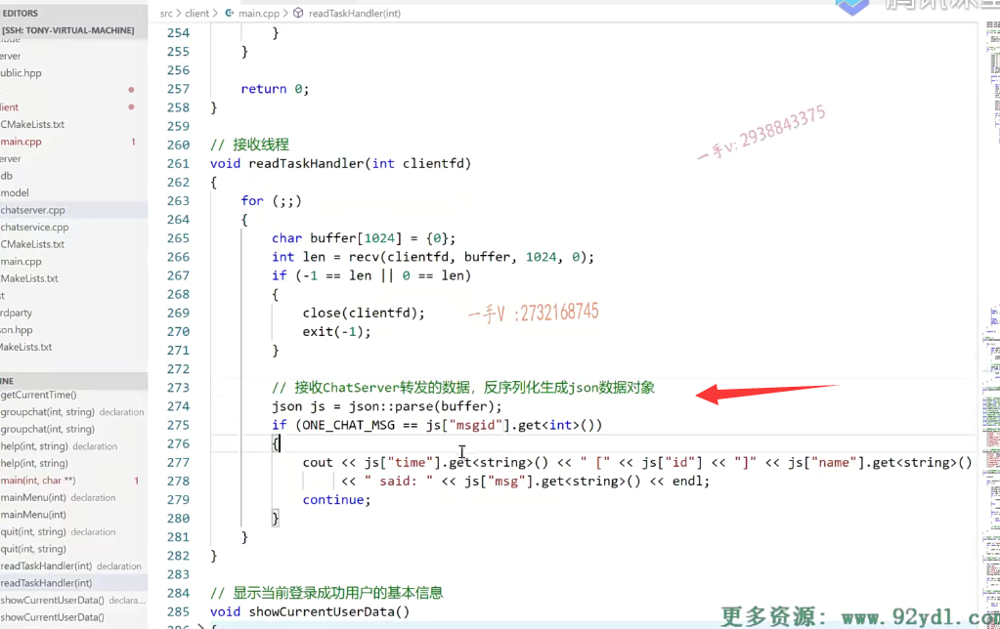

上节课呢，我们把客户端这一块儿业务的开发讲到了这个首页面对吧啊，

首页面的这个登录，注册以及退出啊，

这块儿的客户端相关的这个业务呢，我们已经开发完了啊，

登录的这个业务呢，我们就说到了。

## 回忆上节课

最下边儿来回忆一下啊，登录这块儿登录成功了，

以后呢，我们会把当前就是登录成功的用户的ID name记录下来，

然后呢？会把用户的这个好友列表信息啊，

跟这个他所加入的群组信息。都给它拉回来，

然后呢就会显示啊，就显示出来，

然后会把这个当前用户，如果就是在他下线的时候，别人给他发的消息，不管是个人的聊天消息还是群组的聊天消息，有这种离线消息的话呢，当这个用户登录成功以后呢也会给它显示出来的啊，

==在这里边。然后呢，登录成功了以后就会专门去启动一个接收线程，==

==因为我们给大家说了啊，主线程呢，我们是打算作为这个发送线程，就是接收用户输入啊啊，用户如果不输入数据的话，这个主线程相当于是阻塞的，有没有办法去receive这个远程发过来的就是服务器chat server发过来的这个相关的这个业务消息啊？==

==所以在这儿肯定是收发两个线程啊，==我们是main线程的，作为这个提示用户输入相关的命令啊，

然后呢，发组装json数据，然后进行发送呃，

==然后这个接收线程是专门接收服务器转发过来的这个业务数据的啊，==

### 聊天菜单和接收线程都需要clientfd 都需要去读数据

然后这里边儿就进入这个memu了，大家来看啊，这里边儿不管是memu的话，也是进入聊天儿，

聊天儿也涉及数据发送，

所以在这里边儿，我们把这个client tid也就传到了这个main menu里边儿啊，

然后呢，接收线程也是需要呢，从这个client ID上是不是去读数据的，

所以给这个read task handler这个线程函数呢？也传了一个这个socket fd进入这个函数，

## readTaskHandler()实现 接收线程操作

我们来看一下啊，这个函数里边我们现在写的很简单，

这节课呢，我们主要给大家把这个登录成功以后的这么一个一对一的这么一个聊天消息呢，

聊天业务给大家讲清楚啊，

这个是接收线程上来呢，定义一个buffer。它只做接收数据，显示数据啊，

接收到这个buffer以后呢，

然后呢，这也相当于是网络上啊，传送过来的json字符串，对吧？

把json字符串呢恢复成json对象，这个叫序列化还是反序列化呢？这个当然是反序列化了，是不是啊？

反序列化以后呢？

我们每一个消息都有一个message ID，如果发现呢？它是一个聊天消息，就是one check message的话。

在这里边打印一下啊，

你这个什么时间？啊，是由这个用户的用户号，用户姓名对吧？

他说了给你说了什么消息就是这样的一个输出方式啊，我们就接收到了啊，别人给我们发来的这么一个聊天的消息。好吧啊，

这个呢需要搞清楚，在这我们写一个注释，这块就是接收这个chat server这个转发的这个数据啊，

反序列化生成json数据对象好吧，

然后呢，就可以通过json的中括号运算符重载函数呢？

啊，获取相应的一些相应的数据了啊，相应的数据了。

OK啦，这是所谓的这个接收线程啊，

## 主线程

主线程呢，那就是进入我们的main menu了好吧啊，main menu了，

这个之前给大家说这个在linux上运行底层相当于就是调用了pthreat create.

好吧啊，这个相当于就是调用p thread detach设置成一个分离线程，

线程运行完自动回收线程所占用的内核的PCB啊资源。

好了，那大家来看啊，在这跟我看一下，这就是进入menu了，

大家先想一想啊，me menu我们会做啥？

命名按钮一进来，肯定是会给大家会给用户呢，显示一下系统所支持的命令嘛，

然后根据用户啊，所输入的命令进行相应的这个业务的处理啊？都有什么业务呢啊？

聊天儿添加好友，创建群组添加群组群组聊天以及用户的注销嘛。对着没有啊？

好涉及的这个命令呢？涉及的这个业务呢？大概就是这几种。没问题吧啊，

### 系统支持的客户端命令列表 help查询显示commandMap

在这里边儿呢，我是给大家建议，大家做成这样的一个样子，

首先呢啊。我们也可能刚开始使用这个客户端的这个用户呢，并不知道客户端呢，支持哪些常用的命令，

所以我们首先有一个支持一个help。

这里边首先有一个on order的map，无序的映射表键跟值都是string类型啊，

它相当于是个command map。

它里边相当于就是我们一般在用这个命令的时候呢，

我们的一个help功能帮助功能显示一下。

那到时候就能显示help啊，

### 这里面会提供命令格式

这是什么的？这个chat是一对一聊天的，它的格式是chat。再加一个冒号，再加一个friend ID

就是你想给谁说，然后你说的消息，

因为我们这只是个命令行嘛，又没有图形界面，是不是有图形界面我们双击一下谁，

我们当然就知道是给他聊天了。而且那是命令行，我们只能是自己规定一些格式，

那我们统一下规定的格式就是这样子的chat 啊13。说的消息相当于就给13这个张三这个人啊。发了一个消息，对吧啊？

因为呃13用户号13对应张三在我数据库里边有。

举个例子add friend就是添加好友，这里边给你说明了啊，

格式是什么add friend冒号friend ID？相当于就是add friend。添加好友，

把你想添加好友的这个号码直接拽到后边儿，

这相当于就是好友就添加成功了。

创建群组哎，你create group这就是创建群组的这个命令，

然后后边冒号附带你群组的名称，再冒号附带你群组的一个功能描述。

在下一个命令就是add group加入群组，

首先是add group命令啊，再是加入群，你想加入群组的群组的这么一个号码ID号啊。

然后是group chat，就是群聊群聊，这是命令啊，

然后呢，这就就是这个群的什么ID？然后这就是你要说的话，

相当于呢，就是你给这个群里边所有的用户。那当然，除了你自己嘛，你自己就不用给自己再发一次消息了，对吧啊，都把这个消息给全组用户都发送一下。

然后quit quit是什么？quit就是一个注销，就是我现在这个用户，我不登录了啊，

不登录了以后呢，就要返回到这个首页面，就是登录注册啊，以及退出系统啊，那个页面去。、

#### 修改一下名字loginout

好的吧啊。那么，大家注意一下啊，实际上我觉得写一个login out注销的翻译是不是就是login out呀？

我觉得这个可能会更贴切一点啊。

这个大家稍等一下，我给大家去解释这块啊。

### commandHanderMap  存函数对象类型

后底下呢，有一个又有一个on order map，因为这只是命令的这么一个嗯字符串的一个说明对吧？

呃，这还有一个map键是string值是这个function类型的啊，

你可以把它理解成函数指针类型，就是函数对象类型在C++里边。command handler map，

我们想做成这么一个表映射的一个设计啊，

就是当你从用户的输入截取到一个命令的时候呢，就在map表里边查，

因为用户有可能输入很多不正规的，不合法的一些数据的，

毕竟我们这是基于命令行的一个聊天儿程序嘛，对吧？

### 主要是判断命令是否存在 并且后续需要增加命令就在map中加

==那么如果发现呢？命令不在命令列表里边儿，我们就直接报错了啊，==

==就是这个命令不合法或者命令不存在。==

啊，如果呢？这个命令有，那么我们怎么样啊？我们执行相应的方法就可以了。

这样一来呢，我们代码上就永远不用改动了，

你需要增加新的命令，只需要在这儿添加一个命令说明，以及在这儿添加一个命令的一个名字以及执行该命令的方法的一个映射方法就可以了，对吧啊？

### 命令参数说明 int string  int是clientfd string是用户输入字符串

注意这两个啊。那前面这些是方法的声明，

这些一个一个的方法都对应于这里边的一个命令，

那有同学问这个方法为什么是带有一个整形参数跟一个字符串呢啊，带有整形参数很明显，

这是为了传递我们的client Fd的。为啥呢？

因为在这里边儿，你做业务是不是涉及要向这个chat server发送数据啊？

发送数据你总得有这个clientfd嘛，就是socket fd嘛，你是不是才能去发送数据哎，

另外一个你发送啥数据呢？数据从哪来呀？数据是从用户输入的地方来的啊，

做这些业务你看啊，不管是聊天儿是要发消息啊，添加好友需要好友的这个ID啊，创建群组也需要群组名跟群组的一个描述这些东西呢，都是字符串，

所以呢，这些命令处理函数都有两个参数，一个是整形。就是socket fd一个是string字符串就是。

你所要发送的这个用户输入的数据好的吧，

### help其实不需要参数，但是为了存入map，所以给了默认值

当然像这个help的话，这两个参数就不用了，用不着了，

但是我们也要写上int跟string。

因为毕竟啊，在这里边我们定义的map，它的值类型呢，就是一个函数类型，返回值是void带有两个参数的一个是整形，一个是string的。对不对啊？

那你要往这儿能填的函数呢？你都得符合这个函数类型啊？

好吧，所以在这里边呢一个嗯，命令名字对应一个处理函数。

啊，这个呢，希望大家呢。能看明白好吧，

在这里边相当于是一个表驱动的这么一个设计啊。

然后呢？我们主聊天页面的程序写完以后就可以封闭了，以后不管你是需求的变化，需求的这个要增加新的，这个功能还是减少已有的功能跟我这个main menu的代码完全就可以做到什么开闭原则，对扩展开放啊，对修改是封闭的，就是完全不用修改了。

## mainMenu()实现

### help()展示命令信息

main menu 1上来先help一下。help不带参数是因为这个函数的两个参数都有默认值help。

干嘛呢，各位？help直接调用这个help直接调用这个help很简单，

那就是把我们系统所支持的这个命令，你看我for each了一下这个command map。

就是这个相当于呢，把系统所支持的所有的这个命令呢啊。

全部打印了一遍命令名字以及命令的相应的一个注释信息。

### for循环一直执行

好的吧啊，这个help完了以后呢，

就是一个for循环，因为不断的这个输出嘛，是不是啊？

不断的输出，不断的输出。

在这呢，除非就是调用什么东西啊，除非就是调用这个loginout的时候。

那我们是不是就要退出这个聊天页面，

回到这个首页面啊诶，这个功能我们到后边再做啊，这节课这个不是我们的重点。

### 先去找命令的冒号

那么来看一下这个 main menu呢？先从用户那里获取输入，大家注意啊，这里边儿呢？

呃，有help跟login out这两个命令，是命令里边是不带冒号的，

其他的命令都是命令，然后是冒号。冒号对的吧啊，

### 通过find函数来找冒号

那所以一上来呢，先从用户那里获取的字符串，先构建一个string command buffer啊，

然后command buffer里边去找冒号。string的这个find方法就是找相应的字符子串啊，

就是这个冒号在这个原始的字符串中。找着了，

会返回这个字符的一个起始下标啊，找不着的话会返回负一，

### 当我们找不到返回-1的时候，我们可以给command随便赋值，反正在map找不到，会报错

所以这里边儿当负一的时候啊。这个command就等于呢，你输入的。因为呢像login out跟help你是找不着冒号的对不对啊？找不着冒号的那有些同学说虽然没冒号，它随便输一个行不行啊？没关系啊，没关系，

它随便输入一个的话呢，在这个command handler map里边就在这个里边，根本找不着它是不是随便输的那个命令名字呀，

找不着的话，那这个就返回了一个end了end呢，

那在这儿呢，它报了一个错invalid input command，它又continue重新输入了。

好吧，所以这一点放心，

### 能找到冒号，就用substr()把冒号前面的命令字符串截取出来

如果能找着能找着这个冒号的话，说明呢，这是除了login out跟help以外呢，其他的是命令啊。

那这里边儿的命令怎么输出？人家都有给你注释。

所以呢，有冒号以后呢，你看这里边用substring先把谁抠出来呀，先把命令抠出来诶，command抠出来。

### 然后通过在commandmap中找到我们需要的处理函数it->second，后面再给他传参数 clientfd,消息内容string

然后呢，就可以通过这个command找着在在这个command handler map里边找着这个command名字以及对应的。处理器了，是不是啊？然后你看如果找不着的话second。

==诶，它指向了second。是不是就是这个命令名字对应的一个处理函数啊。==

对应的处理函数以后呢？第一个传的是什么？socket fd就是client fd。

==第二个传的是什么？第二个传的就是我们所说的除了命令以外，剩下的这些字符串。==

==这个最开始的这个命令以外。冒号后边剩下的字符串。没有问题吧啊，==

这样就传进来了。

大家在这里边。看一下啊，大家在这里边看一下。那么这样一来呢，相当于就是通过啊，访问这个command handler map就把相应的这个命令对应的函数处理呢，是不是就给执行了？

唉，所以呢，你看当我们敲help的时候，它最后呢，就调用到help上来了，

为什么？因为help这个命令对应的是help函数。

## addfriend()函数实现

当我们敲add friend的时候，我们这节课先介绍这三个啊，敲add friend的时候呢就调用的add friend，这个函数

你看add friend函数做什么事情呢？这个应该是很简单的对吧啊add friend这个命令啊。

后边是不就是friend ID呀？

啊，那然后再进来的话呢，那这里边相当于把那个字符串的这个ID转成这个整数。

### 根据你的传进来的字符串friendid，合成json对象，发送出去

然后呢，合成json数据message ID是添加好友消息ID呢，是当前用户的ID。

我要加哪个谁的好友啊？加这个friend ID的好友。

然后呢，进行一个序列化，通过网络发送出去。

OK吧唉，服务端接收到以后呢？

==你看服务端我们之前处理的这个add friend是不是就接收到一个ID==

啊，这是这个人要添加这个人为好友，

然后把这个好友信息呢就写到friend这个表里边儿。就完了好吧，

我们在这里边相当于是默认添加好友呢，就是能够成功的OK吧啊。

### chat()功能实现

嗯，那在这呢，添加好友以后，我们这还实现了聊天。

聊天的话呢，那相当于就是。给我们check这个方法把什么呀？

把client fd以及friend ID message是不是都给我们传进来了？

看看这个chat啊，一进来先找这个冒号。这冒号是什么意思呢？因为剩下了什么，剩下了friend ID跟这个message嘛？是不是message啊message冒号截取出来friend ID呢？就是冒号前边了，剩下的是不是就是这个message啊？

### 拿到的数据字符串中还需要找冒号，分别是friendid和消息内容

哎，这个数据分别拿到以后呢？

那在这就可以组装这个聊天的json嗯，消息了message ID=one chat message。ID呢

是当前用户的ID name，是当前用户的name。

to ID就是我要说话的那个人的用户号message，就是我要说的话。

time就是我说话的时间啊，

然后呢，把json的这个数据对象进行一个序列化，形成字符串，通过网络发送出去。

### 服务端也是接收，然后找到用户发送过去，就是分在线和不在线两种处理方式

对不对诶？然后呢？服务器这边呢诶，接收到这个聊天消息，

一解析这个to ID它哦，你是要给这个人是不是说话呀？

然后呢，它就拿这个tool ID呀，在服务器的那个connection map里边去找这个ID对应的connection是哪个

然后呢？就通过to ID用户的connection，把这个信息呢，原封不动的就是这块儿a客户发过来的，聊天儿的json数据，原封不动的再转发给这个to ID，这个b用户，消息就转发过去了，

如果呢，发现说话这个人不在就怎么样啊，存储离线消息，

它下一次登录的时候呢，登录成功，它是不是就看到了？

嗯。这就是基于我们之前服务端开发的这个。

嗯，什么呢？添加好友以及聊天儿，我们在客户端这一块儿，把它相关的这个代码也就都输出了啊。

这块儿呢，来说代码不复杂，

希望大家能够对于这个在实际的应用中啊，对于C++的这个stl里边设计的容器啊。

能够有一个很好的使用好吧，那确实是非常非常的这个重要啊。

好了，整个这一节课呢，我们的这个主题呀，

就是当我们把首页面做完了以后啊，我们登录成功了。

我们现在启动了接收线程了，又进入聊天页面了，

## 梳理一下流程

进入聊天了，以后呢，我们在这儿相当于就是获取用户的输入，

用户首先得知道。这系统支持哪些命令可以做哪些事情，

在这里边儿，我们给用户可以显示出来，

其次呢，就是用户输入啊，用户可能输入错的。也有可能输入对的，

而我们给它封装了一个command命令，对应了一个是不是事件处理函数啊？

哎，把它们呢，就是这样一做的话，功能映射是不是关系是很明显的啊？

各个功能之间也没有什么偶合关系，

更重要的是main menu这个方法用不用做任何的改动啊？这个不用做任何的改动，

这个只是截取用户输入的命令。

然后进行一个命令处理的一个派发就行了，

派发的原则就是这个command handler map里边儿所列好的。

对了吧啊。好，这节课呢，我们主要在这实现了一下help chat以及add friend这个功能啊，

希望大家呢，把这三个功能好好的去。

相关的代码，好好的去理解一下啊，

然后呢，你也把其他的方法呢，可以自己写一下，我相信你跟着这个项目学到现在了，

应该去写这些代码应该是问题不大的好吧，写完以后再去看，

我相信你能够得到的get到的东西呢。包括呢，对于业务逻辑的理解，包括对于代码的组织能力啊嗯，这个应该是会有一个更大的收获。

### 可以尝试自己写业务逻辑

