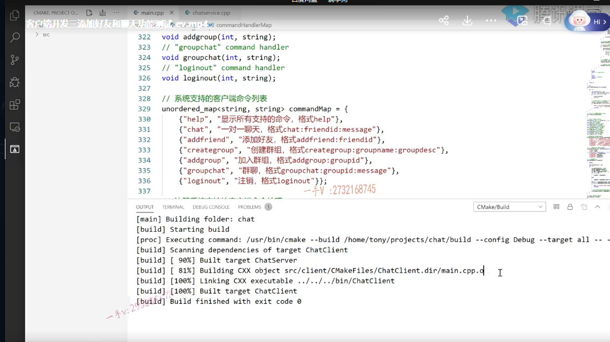

上节课呢，我们给大家讲了用户登录成功以后啊，

进入这个main menu以后所能做的这个help，chat跟add friend的这么一个功能。

好吧，这节课呢，我们就来编一下代码，

然后给大家做一个功能上的这个验证以及演示啊。

这个你在写的过程中，写完了以后呢cmake编译啊，

如果代码上有编译类的错误或者链接类的错误的话，这块就会显示啊。

那么大家出错误，不要着急，根据人家提示的哪个文件的哪一行出错了，去看一看这个错误的描述啊，

毕竟以后大家真真正正走向了开发或者是开发测试的岗位啊，

如遇见这种代码，编译链接的这种问题啊，

你最好还是能够自己的独立去解决啊，这种问题呢，去咨询别人。是不是我相信你的，你的评级，你在别人这个脑子里边的印象应该不是那么完美的啊。

# 测试chat help addfriend功能

好，这个编译成功以后，我们在这来看一下。

让我们启动了一台服务器，好吧啊。

在我在叉shell上开了两个窗口，开了两个窗口以后呢

在这我启动在这儿呢，我启动啊，我是有两个用户，一个是13的张三。还有一个是21的羔羊在这儿呢，

### 登录 测试help()

我先登录一下啊user ID 13。三四五六。

在这儿，大家来看啊，我显示的信息基本上就是这样的，

当前登录的用户ID是13，用户号是13，name是。张三对吧？

他的friend list，那大家看他有两个好友，一个是15的李四，一个是21的高杨，他们现在都是offline。

它群组呢嗯，它现在还没有加任何的群组好吧，所以群组信息这块是空的

show command list，这就是一上来我们在main menu里边不是给人家先显示了一下是不是系统命令啊，

如果你在操作的过程中。啊，这个不是会控制台嘛？

嗯，随着你用户的输入，这上面的信息会往上升。会往上刷刷屏，看不见了，对吧？

你在这里边可以help，因为我们已经支持了这个help，这个命令了嘛。对不对啊？

还有命令格式，你直接输入help就可以了。

### 测试chat功能

这个chat chat是聊天给谁聊呢？给21聊聊什么呢啊？hello。

我们输入这么一个消息啊。那么再出一个吧。在线没？

这个就是就发送过去了，对吧啊？发送过去了，

这个我们肯定知道，对于高阳来说呢，这是一个离线消息，

那我们登录一下高阳，看能不能收着这个离线消息？也是属于聊天消息嘛，对吧？

呃，21。大家看啊，这高阳现在他有一个张三好友的张三，你看张三现在状态是不是online呢？

大家看这儿有没有收到这个离线消息呢？有这个离线消息。是不是呃，

这个年数这个月份这个天数啊，几时几分几秒这个用户号，这是谁给你说了hello。对着没啊？

### 测试在线消息

那我现在我给它说chat 13。还在吗？

诶，这里边就收着了，对吧啊？

chat 21在呢？在这呢，是不是能够接收到这个什么东西啊？能够接收到是不是这个消息哎？能够接收到，

然后再chat。幺三。嗯，上课呢。这个在上课吗？

诶，这都能收着。是不是啊？

这都能收到这个里边呢？

嗯，大家来看啊，整个的也就是说。就是这么一个聊天啊，

### 测试addfriend()添加好友功能

你添加好友也可以，你在这里边试一下add friend啊。

那么你比如说呢？我又添加我这个高阳这个用户啊，添加15李四为好友的话，

那下一次上来的话呢？add friend谁呀？这个15是不是诶？这个就添加上了。

我们就通过命令来的好吧啊，下一次你比如说再登录一下这个是21。

那么在这儿呢看啊，李四这个好友信息是不是就过来了啊？

它是个offline的状态。没问题吧啊，我们现在的这个就是好友的这个信息啊，

群组的信息只是在登录的这一次显示一下。

啊，没有在中间过程中，这个随时显示好吧啊嗯

这个你想要做也可以呀。是不是也可以？

我之前说过，这就是业务上的这个多与少了啊，这个流程呢，大家搞明白就可以了。

## 总结

好吧OK，那么在这里边呢，我们就主要给大家演示了一下，登录成功以后。嗯的，

这个显示的这个用户的基本信息，还有系统的这个命令说明以及呢，我们使用help可以查看系统支持的命令。

chat呢，可以和别人进行一个聊天以及呢，

这个add friend可以添加一个好友。

好吧，我们这个业务现在做的比较简单，添加好友只是为了看清楚我能够跟谁说话对吧？

要不然啥也看不着，我也不知道谁的号码是什么啊？呃，实际上真真正正的这个聊天呢？

就是我们系统里边这个聊天并没有说你是好友才能聊，不是好友就不能聊。OK吧啊，

没有做这样的限制好不好？要做这样的限制呢，那无非就是交互更多的这么一个命令是不是就可以了对？

好，那么通过这节课的演示，希望大家呢，对于我们现在所写的这个客户端，

它的这个使用方式help add friend跟chat呢？这个它的这个怎么做业务的啊？能够明白好吧，

然后针对于代码上的这个输出啊，

能够呢，让这个在验证的时候能达到让我们的这个业务的执行的结果能达到我们的预期就可以了嗯，

希望大家呢，写完以后也动手自己去详细的去测试一下好吧。