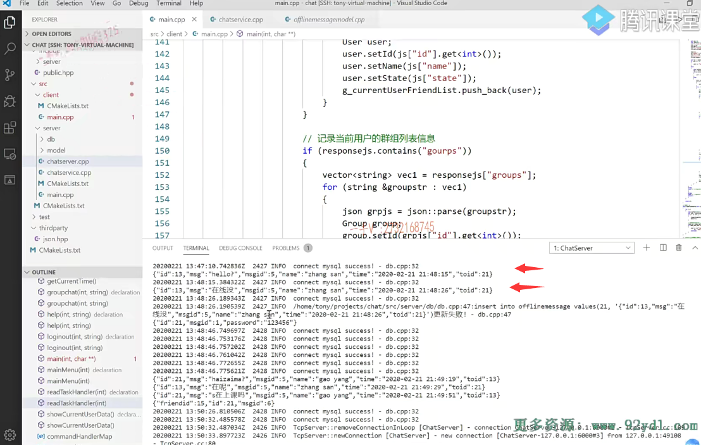
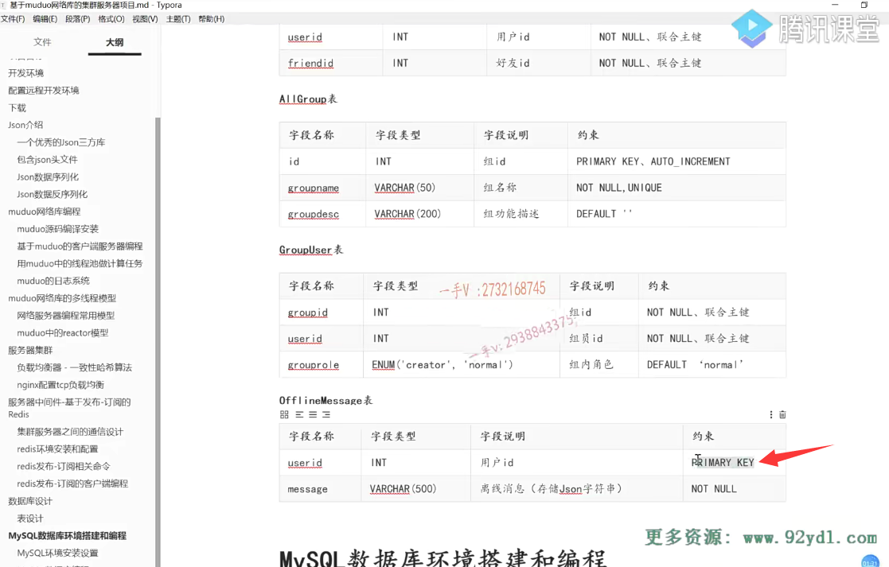
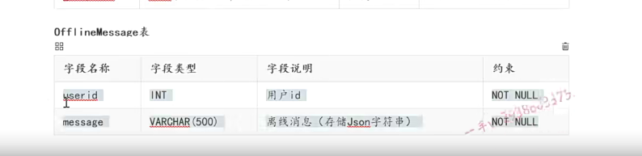
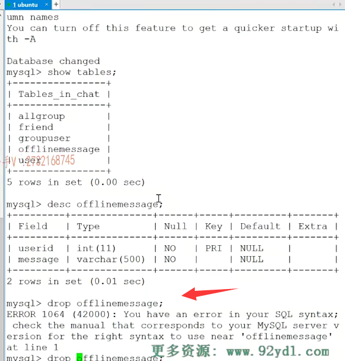
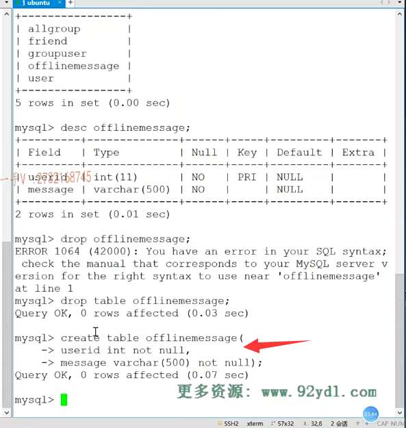
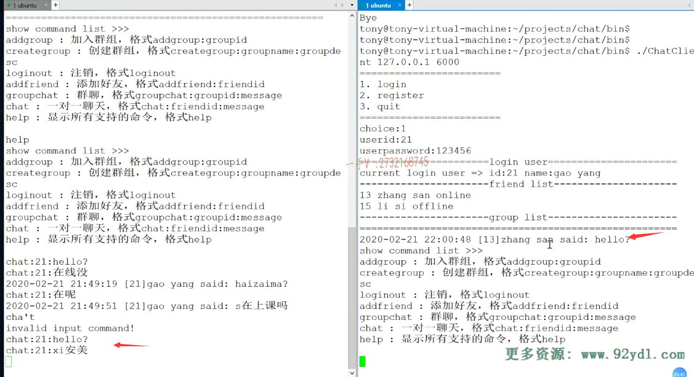
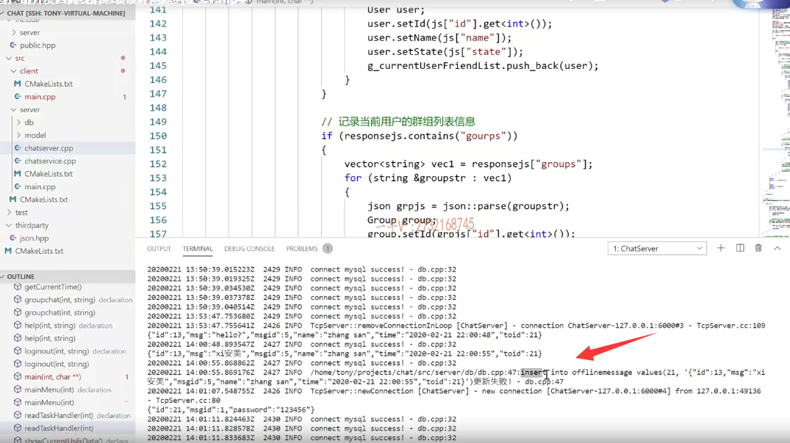
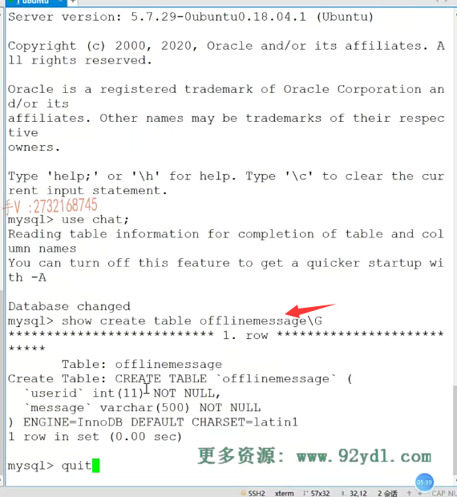
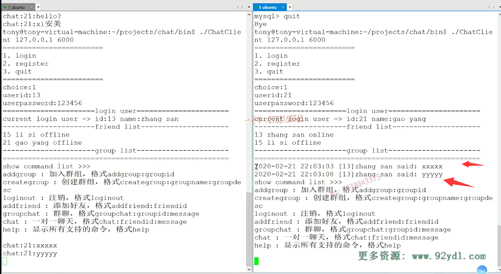
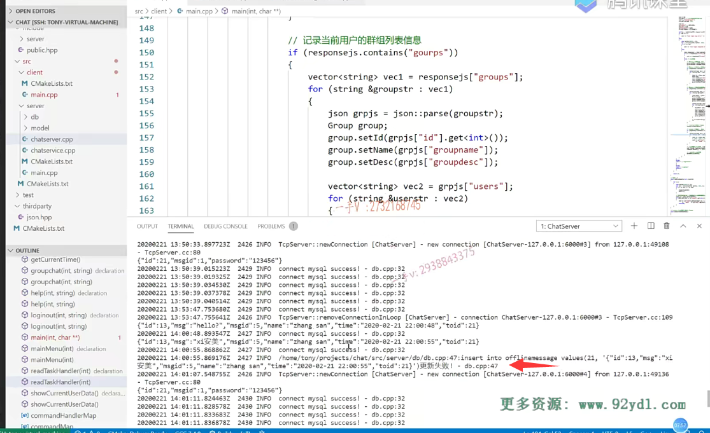

# 更正错误

大家好啊，这节课呢，给大家来。这个更正一个，我们项目中的一个问题啊。

## 发送了2条离线消息，但是只显示了第一个

呃，上节课呢，我们在给大家演示的时候啊，我刚仔细看了一下，我们在演示的时候呢，会出现了一个错误。就是我们第一次幺三给二幺，就是张三给这个高阳这个发送离线消息的时候啊，

实际上他发送了几个消息呀？它发送了两个，它发送了两个啊，

它第一次呢发送的是一个消息。但是高阳不在啊，它存储怎么样了？它存储成功了，你看就这个hello问号，它存储成功了。

但是第二个发送在线没啊，我们也发送出去了，是不是？

但是我们发现当高阳登录了以后啊，它只显示了一个什么？只显示hello，没有显示第二个什么？

==离线消息也就是只存储了一条离线消息呃，==

然后呢，我们在日志上其实一看很明显insert into offline message。

就是呢，在存储message      ”在线没“    刚好就是我们这里边的第二句离线消息啊，发现它更新失败了啊，

为什么会更新失败了呢？

### 错误原因：user ID给人家设计成primary key了

那这个呢？第一个首先是看你sql语句正不正确？

sql语句正确的话，那就看我们表的设计了，

然后呢？我们突然到课件上一看。发现呢哦，这个user ID给人家设计成primary key了，

实际上呢？这个不用啊，

### 将表userid设置为not null

为什么因为离线消息某一个人可能会收着很多很多的，是不是离线消息啊？

你要是把user ID设置成主键。那也就是说，在这张表中user ID只能出现一次。好的吧，

所以这是我们在表设计上的一个问题，

在这给大家更正一下OK吧，在这我们直接把它设置成not none就行了。

好不好啊？

这张表我们不需要这个主键啊，我们不需要主键的，

实际上你这样写的话，对于innodb存储引擎，人家会给自动的给这张表添加一个主键。

这是跟这个innodb存储引擎的这个索引数有关的，因为它的索引跟数据是存到一块儿的，对不对啊？

表不可能没有主键，你有时候没有写主键，它都会给你自动的增加一列整形的这个数据，作为这个主键啊，

这个我们大家知道。更好啊，不知道呢，这无所谓，

### 修改一下    直接删除原来的表

那关键是user ID在这张表里边不能设置主键啊，它是可以重复的。

好吧啊，所以这样一来呢，我们就需要去这个数据库里边啊，把这个呢来。修改一下好不好？还把这个修改一下。

或者说是这张表呢，很简单，我们在数据库里边呢，就是买呃。登录上以后

use chat show tables dic offline。message.

我们把这个表先删了吧。job table啊。好fly message

### 重新创建表

完了以后重新创建一下create table offline message.

第一个是user ID对吧啊，整型not none就可以了。

第二个是一个message vr叉。500。

然后也是一个什么note nine.

就行了啊，就行了。

### 再来测试  发现还是同样的错误

好呢，然后呢，我们重新来去测试一下。看这个问题还存不存在啊？

这个服务器依然正在正常运行

。那这个相当于相当于高阳呢，没在线对不对？

这个是chat。这是一个非法的输入啊。

chat 21先来个hello，跟刚才一样啊，然后再chat 21。在线没？啊，无所谓了啊。

我这个叉show输入这个中文有点问题啊。

然后呢？没关系，就当做消息吧啊，它只要能收着离线消息就可以。

二十一一二三四五六登陆上。

大家看这里边是。收着了一个还是一样，是不是收着了一个？hello啊。

收到了一个hello，

我们再来看一看。这里边还是这个怎么样啊？insert into offline message。还是这个？

更新。失败了。还是这个更新失败了。

## 查看一下数据库的建造过程

我们来看一下，是不是没有改成功啊？

show print。table fly.message.

最近的是user ID。message没有任何的，是不是主键啊？没有任何的主见啊。

### 重新启动服务器，读取正确了，应该是可能读到的还是表之前的状态

那我就把这个服务器我重启一下吧。这个代码上没有做任何的修改啊。

所以从服务器的日志更新，这很容易看出来问题。

它是sql语句。执行失败了啊。我们重新运行一下。

这个是一是login是13。chat，21。再chat 21。好，这儿我们登录一下，1 login是二十一一二三四五六。嗯，在这收到了。

没问题吧啊，那应该就是由于数据库的问题啊，

我们应该是重启一下这个服务对吧，可能读到的还是表之前的状态呀？

现在你看这个就全部收着了。

好吧，在这里边儿纠正一下，我们项目上的一个设计问题，

就是表的设计这一块儿。

==offline message user ID能不能为主键？==

==不能因为一个用户可以有多个是不是留言消息啊主键跟唯一件unqiue都有个特点，就是不能重复嘛，==

是不是啊？

不可能不能重复的啊，一个人不可能永远只有一条，是不是离线消息啊？

不合理啊，好这儿改一下。我们代码上不用做任何的修改好的吧啊，

## 总结

现在你看这两个是不是就都执行成功了，没有报错，

没有像刚才的这种啊sql语句更新失败，

所以我们在写项目的时候呢，尤其是稍微大型一点的项目呢？

日志是非常重要的啊，当出问题的时候呢呃，代码圈没挂，但是业务怎怎么做它都不对，这时候就需要依赖日志了啊。看日志是一个非常好的习惯，

希望大家呢，对于自己的chat server的日志啊，多留意留意，看看有错误没有错误的话呢，可能就是业务在执行的过程中可能存在偏差啊，

这时候多留心看看是不是问题，是问题的话呢，就根据这个日志所提示的内容呢进行一个业务上的一个修正啊。

好，那这一节课所要给大家纠正的这个问题就给大家说到这里。