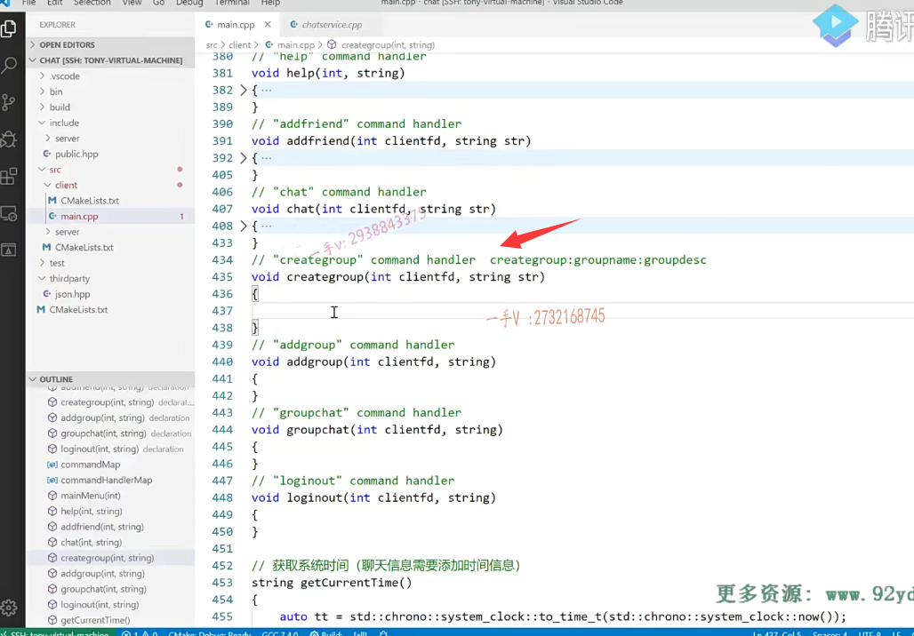

这节课带着大家来写一下客户端这一块儿，跟群组相关的这个业务啊。

## createGroup()创建群组业务

### 先看一看服务端的解析业务

create group创建这个群组服务器这一端，

解析的是ID谁创建的group name跟group desc，然后存储一下这个群组信息，

然后再把创建群的人添加到这个群组，还有成员的这个关系列表中，他是一个创建者，对吧啊？

### 先找冒号 然后拆分

那么在这儿呢，这个创建群组的命令是这个，那么传进这个参数的话呢，那就是后边这两个对吧啊？

后边这个那我们肯定是先去把这两个数据先拆出来，是不是啊？

idx=STR点算的谁呀？分的这个冒号啊，如果呢idx这个直接等于负一了，

那就说明在这里边跟之前一样啊。这就command invalid就直接就忽略了。create group command invalid

然后在这儿的话，我们就可以得到第一个就是group name glup group name。等于谁呢？

等于stl点substrain 0到idx是不是？然后string。BD sc=STR点sub idx+1，

然后是STR点size-idx。

不知道 你一直在学C++嘛，这个substr第一个是下标，第二个是长度啊，第二个可不是末尾的下标啊。把这个常用的string截取子窗的方法要搞清楚。

### 生成json对象，转化成字符串，发送出去

然后呢，开始生成json字串，

首先是呢message ID等于什么呀？create.whoop message创建群的消息

js有当前的这个创建人，那就是g杠user current user点get ID。

然后js呢是jroup group group name等于上边的这个group name。

好吧，在js什么这个group group dsc=group dsc。对是吧ID group name group dsc。

没问题啊，就这几个，现在这就可以了，是不是啊string 然后是buffer等于剩下的跟上边的这个代码就都怎么样？都一样了啊，都一样了，

我们直接拷贝过来吧。okay啊，这个是send。create group message error啊，

如果是负一的话好吧，打印一下OK，这个我们就创建群，我们就写完了。

## 创建群add group

### 看一下addgroup服务器端解析

这个是add group，add group是添加群，

需要的是用当前用户的ID以及他所想加入的群的ID，是不是就可以了啊？

### add group的这个命令

那这个方便。先看一下add group的这个命令是什么？

add group的命令，我们来瞧一下啊。

add group诶，就是上边那个啊？add group命令是这个，那就是说剩下的字符串就是group ID了，对吧啊？

### 得到群号，然后组装json字符串，发送出去，注意我们客户端这里的userid都是获取全局变量的userid

那这个应该是也非常简单。这个应该是跟谁比较像啊，跟add friend比较像，

我把这个拿过来。大家来看啊，这个代码我就拿到这里。这个是jroupgroupid。

因为它add group后边就只有一个group ID了，对吧？

==这直接是把数字串转成数字，就是group ID在这儿呢，==

是add group是不是message啊？ID是当前用户的ID。

==这个是group group ID这个字段一定要对上，是不是啊？==

这样大家才是讲的是同一国语言啊。才能互相明白。

这就完了，是不是发送？这个剩剩的add group message error，如果出错的话。

这块儿呢，也就完了，是不是啊？

## group群聊实现

而group chat群聊啊，群聊这一块儿的话呢，

我们先看一下它命令输出是。怎么输出的？

group chat是这个样子的。哦，是这个样子。

那也就是说前面是命令去掉，不管的话呢？去掉不管的话，

现在就剩这个参数啊。诶，是是这儿啊。

这个参数的话就是group ID跟这个message。

### 找到命令，拆分命令

对的吧啊，那同样的应该就是跟我们的create group一样，需要解析数据啊。

那么，我们来看看，首先是解释冒号啊。解释这个冒号冒号，

如果出找不着冒号，那就是消息格式不对，group chat command invalid return。

然后第一个是group ID。这个是整形的一个group ID，等于STR今年是a to I。a toi得把字符串转转成一个整数啊。

然后是STR点sub 0到。点c杠STR因为a to I处理的是char *，这个是string对吧？用它的c杠STR。把string转成叉星，

然后第二个是一个message，这个message的话就是idi+1 STR size-idx没问题。

这个就是一个gr group chat message。ID是当前用户。是不是还有gs的name？是g杠current user点get name。

然后这里边还有这个group ID。你要给哪个群里边儿说话，就是上面儿这块儿的group ID。好吧啊。

还有一个什么呢？当然是这里边的一个msg啦，说话的这个内容嘛，

是不是当然还这里边还有一个啥呀？

说话都得有一个时间time，对不对？get current time。

这现在就都好了。group chat.message error.这个大家注意一下啊，我们在显示的时候啊。我们在显示的时候应该也是想把这个群的名称是不是也显示一下？

啊，这个群的名称显示一下。啊，不显示也行好吧，不显示也行，

实际上这无所谓，你想带什么消息，你在json里边儿是不是都可以带啊？

那么在这儿呢，我们就得在这个什么啊？就得在这里边儿呢，单独显示一下，

因为one chat跟group chat它里边儿的字段还是不一样的，group chat里边儿呢？

多了一个group ID，这说明它是一个群信息是不是啊？

## 接收线程处理

### 接收到群组消息，打印到屏幕上

来在这里边看一下啊else if是group group chat，

这个是接收线程吗啊？

等于这个是int message type，等于先把这个message type拿出来。

然后呢？我再跟这个。进行一个比较。以后呢，在这儿。我在这显示一下吧。

这是个群消息。是不是啊？群消息的话，群号是多少？我们发个群号吧啊。就是js中括号啊，group group ID。好不好？

然后在这里边是个这个这个。那我们就这样显示就可以了，这里边只显示了一个群的号码。

好吧，这是群消息啊。一个是群消息，中国号里边放的是群的ID，

然后再开始时间。是不是啊？时间。谁说的对吧哈，说了什么话？

### 之前登录时只显示个人离线消息，现在增加群组消息

好，那这个当然，因为我们还有离线消息呢，离线消息这是接收线程，在这儿需要改一下对于。个人与个人之间的聊天啊，以及呢？

对于个人与个人的聊天以及群之间的这个消息，我们在这里边打印还是有一些区分的，对吧？

所以在这儿大家来看离线消息，这里边儿因为有个人的离线消息，还有群的这个离线消息啊。呃，所以这呢跟这一块的处理应该就是一样的了。比较相似。

我放到这里啊，我放到这里。

这个是从这拿到message type。

如果是个什么？如果是个点对点的，这个个人对个人的聊天，

那就是这样子打印。是不是啊？否则的话，那就只能是聊天儿就两种嘛。

不是个人聊就是群聊啊，所以这个就不用去区分了。也不用定义那么多局部变量了，直接放到这儿就可以。啊，这个不是的话，那就是群消息，群消息肯定有一个group ID的。

在这儿continue去掉。原来的这个打印只是原来的打印，跟这儿打印一样，只是个人聊天儿的啊。

好了，那这一块的功能上的这个开发呢？就算是完了啊，改了一个这个地方离线消息，因为有可能是群消息，群消息的显示跟个人的离线消息显示是有区分的。

### 然后就是之前说的，在线的时候接收消息  接收线程来处理 也要区分个人和群组

再者就是这个接收线程，接收线程这同样的啊，

显示个人的这个接收到的个人的聊天消息跟群消息，

这输出上还是有区别的。

然后的话呢，就是这里边的。创建群对吧？

然后是。这是什么？加入群，这是群聊。

好，那我们写完代码，然后编译一下，进行一个功能上的一个测试啊。

### 可以自己去扩展，比如说好友上线，给个通知

我们这一套系统呢，在实现这个群功能的时候啊嗯，

就是说呢。每一个用户登录成功是不是都会去拉取他的这个个人的这个好友列表跟群组信息列表啊？

就是登录成功以后拉一回它，其他的时候就不会再拉了，

也就是说呢呃，你比如说就是你刚登录成功的时候，这群里边只有你一个人上线，对吧？

呃，随着使用过程中，群里边可能有其他人上线了。

我们没有在服务端去做这个通知，谁谁谁上线了这样的功能，

你要通知也可以呀，好不好？

我说了，这都是一些业务上的一些扩展，

你看就看你是不是需要实现那些业务？

我是鼓励大家跟着我这个项目课程，学完以后呢嗯，

你首先呢搞清楚，我们客户端跟服务器的设计。包括我们后边的这个，在集群环境下引入这个负NG x的负载均衡设备，以后呢，

它的一个通信原理是什么啊？为什么跨服务器通信要借助一个服务器的中间件消息队列？

啊，然后呢？如果你这一套全部搞清楚的话，

你还有时间，你想在业务上去扩充，做的更完美一点啊，

甚至我们有的同学呢。嗯，自学了一些前端的一些技术，做一个图形界面啊，

进行这么一个聊天的业务呃，都是完全没有问题的啊，

我是鼓励大家这样做的。在做的过程中呢，有问题的话随时可以向我的QQ进行一个咨询啊，

## 测试

我现在编译成功了，编译成功以后呢？

哦，我在这里边打开。执行一下这个服务器啊，执行一个服务器，然后这里边呢是？

执行客户端。我们一个一个测试一下吧，首先是建群的功能对吧？幺三一二三四五六啊。

### 创建群组出现错误

嗯。应该是create group，create group。对吧，群的名称啊。

C++这个chat聊天项目。聊天项目组是不是啊？组名啊，

然后呢描述就是指导大家输出一个聊天项。这就是我们创建的一个群。

在这里边，大家看一下啊。这个客户端怎么样了？

客户端直接是出错了，这里边我们大部分遇见的错误都是什么呀？

都是invalid utf 8，这也就是意思是说我们在命令上用了这个中文的一个标点符号啊，

用了中文的这个标点符号。

这个是它的这个计算库是解析是有问题的啊，这个我们没有办法，那重来一下吧。

一幺三一二三四五六。是create group group是吧？C加加。chat.project.然后是。嗯。start.develop.这个呃chat project。好吧，

就这样okay这个。

没有报错，看起来创建群组成功了，写汉字也可以，但是标点符号啊，它必须得用英文的啊，中文的话呢，它这个库解析的有问题。

那或者说是人家在这个。后续的版本可能已经把这个问题给改了，对吧啊？

但是呢，我目前下我们目前给大家下载的这个json点。hpp这个版本没有？去处理这个问题啊。

好，这个我们先不关注了啊。在这儿，我想再打开一个。我想再打开一个。数打开一个，这个我连接下数据库，我看这个创建进来了没？一二三四五六。

use chat啊。嗯，然后是select。select shing from all group.

大家看这个群组的消息是不是已经进来了啊？已经进来了。

呃，进来了的话呢，然后我再看一下group user啊。group builder.啊。一号群组里边有一个人是幺三，

这个人张三，他的角色是creator。

对吧，然后呢？我这个登录这个是21高阳啊，一二三四五六。

然后这个是add谁呀？group add group.哪个group呢？

那你得知道群号是不是群号是一？

所以okay。那我再看一下。诶，这进来了。21高阳这个也加入这个群，他的角色是一个normal。

对了吧啊。呃，之前他们登录的时候都没有群信息，那我们现在退出一下。

