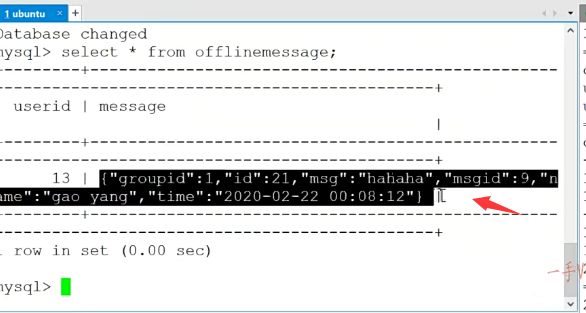

上节课呢，我们把这个客户端群组功能这一块儿的，这个创建群组以及添加群组呢，测试了

这节课，我们主要把它的这个群组聊天。来测试一下啊。

这是先登录一下啊幺三。哎，这样一来的话，这个用户在登录的时候呢，有他的这个基本信息，还有信息以及群组信息是不是就都有了？

这个群组信息我们显示就是这样显示的群组号，群组的名称是吧？

啊，群组的这个描述让大家可以在打印的输出的时候呢？

嗯，列一些关键字，让它打印的更详细一点okay吧？这是群组的这个成员是不是啊？

群组的这个成员。

### 重新打印一下输出

呃，在这呢，我们好像是=online，offline，offline，

那也就是说，在代码上输出的时候呢？这个群组群组看一下群组啊，群组在这输出的时候。

show count user data.对，就这块这块应该有一个什么呀？有一空格。

这个比较输出到一块儿，

而且呢，最后个role应该不是online跟offline对吧？应该是它的一个角色信息，

这儿对应的方法也都是。没有错的是吧？I get rule。set row,get row.

### 之前服务器在装载信息时，出错

但是这块好像拿出来的这个。信息是不是是一样的是吧嗯？

那我们看一下这个服务器，这一块在装载信息的时候呢？

服务器这块在装载信息的时候哦，你看我们之前的服务器在装载信息的时候，

我这儿写的是get state好吧，唉，来咱们根据现象呢，把这个问题也就找到给它去修改了。

好的吧啊，修改一下啊，

那在这呢，我就都。重编一下吧。好编译成功，编译成功，

这个重新启动服务器。这块呢，重新启动 

好，现在就好了，这个群里边的用户啊，用户号，用户名，它的在线状态，它是critter，它是普通成员是不是？

然后在这是group  chat 1号群里边说。这个大家好。

### 发现只收到了个人信息，没有收到群聊信息

这是一个群聊是吧？我们给那这个群聊的消息的话，21号高阳肯定是能收着的啊，

然后呢，就是一个普通的这个聊天儿是。一对一的聊天啊。这是高阳你好啊okay，现在呢？

高阳来登录一二幺一二三四五六。

看一下。首先呢，在这里边它的这个基本信息，好友信息以及群的是不是这么一个信息呀？

哎，这两个人现在这个群这两个人都在线。然后这是一个什么消息呢？张三赛的啊，就是他的一个个人消息对吧？还有高阳你好。

但是呢，什么消息没有收到啊？

这个群聊的这么一个消息。我们好像是并没有，是不是接收到这个离线的群聊消息呀？

好了，那我们把这个问题先记下来啊，一会来看。

### 测试在线群聊信息

那在这来看群聊group group chat 1号群。

啊，这块是可以收着的，对吧啊？

在线的去群聊的话是可以说这是群消息，一号群 谁呢？

高阳说的是这个啊，这个再试一下group chat 1号群。

这个应该是属于同一个群里边的，这个人呢？就都怎么样啊？就都接收到了，

不在线的人就收到了一个离线的消息，是不是啊？

应该是这个样子的group再测试一下一号群。

这应该是没有什么问题的啊。

### 但是离线消息无法收到，还是需要测试

但是现在我们看到的是它的这个什么啊？群消息的这个离线消息是无法显示啊啊。

群的这个离线消息我们无法显示。

那么，首先我们这儿幺三先退一下啊group。chat 1。然后是哈哈哈。应该发给这个张三了，对吧？

咱们到它的这个什么里边？数据库里边去看一看use chat，然后select新from谁啊？

from offline message.有没有呢？user ID是个幺三对吧啊message，这是一个群聊的消息吧。

message ID是个九，这是个群聊消息，那这个确实有这个消息啊，

### 突然又出现了消息

然后呢？在这儿我。张三重新登录一下一幺三一二三四五六。

嗯，在这儿我可以收到，是不是这群消息呀？

可以收到这个群消息。可以收到群消息的话，

咦，那我们刚才为什么看到那样的问题呢？

那咱们重新来看一下，这是群消息，

返回以后群消息的表里边的消息就被删掉了是吧？

咱们应该是先是一个个人对个人的聊天，一个是幺三。

再来一个group的聊天group chat 1。hello.okay，

然后先看这张表。这张表里边应该有两个这个人的聊天消息啊。

第一个呢，这个message type I message ID是个五，这是一个一对一的聊天。message，哈哈哈。

对吧，这个第二个message ID是个九，应该是一个群聊啊，带的消息是hello。

好，这个消息都没有问题的，然后呢？

我让这个张三登录幺三。一二三四五六。

这儿都可以收到是吧诶，那是我看错了吗？刚才。这可以收到的吧？

这是一个高阳呃个人的聊天消息，这是一个是不是群消息啊？

嗯，刚才我记着我们给21是不是写了一个，也是写了一个张三的单人的聊天消息，

还有一个群组的是不是聊天消息啊？

我再测试一下啊，我们多测试一下，看一看，

不能让这个业务出错啊。先chat。然后是谁呀？二幺对吧？

然后再是group chat。一看一下消息，这有呢，21号这个高阳。

下来一个是单聊，一个是群聊的消息，是不是？

一二幺一二三四五六个人的群聊的消息，

那就应该没错，那就是我们那刚才就是这儿，可能是看错了，我们就只发了一个，是不是一对一的这么一个聊天的消息啊？嗯，那就正确着呢是吧啊？正确着呢，这是一个个人的聊天消息，

还有一个群的这么一个离线消息啊，这个看起来呢，功能测试都没有什么大的问题，

group再测试一下群聊一这个都能收到的啊，再去测试一下单聊。

这也可以收到的。

好的吧啊行，那我们的这个测试的功能就到这儿群组的就是创建群以及加入某一个群以及群聊。

它的业务就是这个样子的。

好吧啊，希望大家呢嗯，跟着我们的这个项目课程能够把相应的代码呢也输出完成啊。