这节课呢，我们终于到整个的这个单机服务器适配的这个客户端的这个最后一次课了啊，

就是一个正常的一个注销环节这么一个业务，

实际上呢，不仅仅是对于单机服务器后边儿服务器集群的话呢，

只是服务器需要去做一些修改，对于客户端来说呢，它只管享受服务器提供的服务。

至于服务器是一台还是多台，有没有负载均衡或者有没有分布式，

对于客户端来说是不需要了解任何细节的，对吧？

所以集群或者分布式都是在这个服务器主要是在服务器端玩的啊好，

那大家坚持了这么长时间也都不容易啊，我们在加把劲儿，

然后我们今天这节课呢，把最后它的这么一个正常的用户注销功能来给它实现了啊，

我们客户端这一块儿的这个主要内容就说完了。

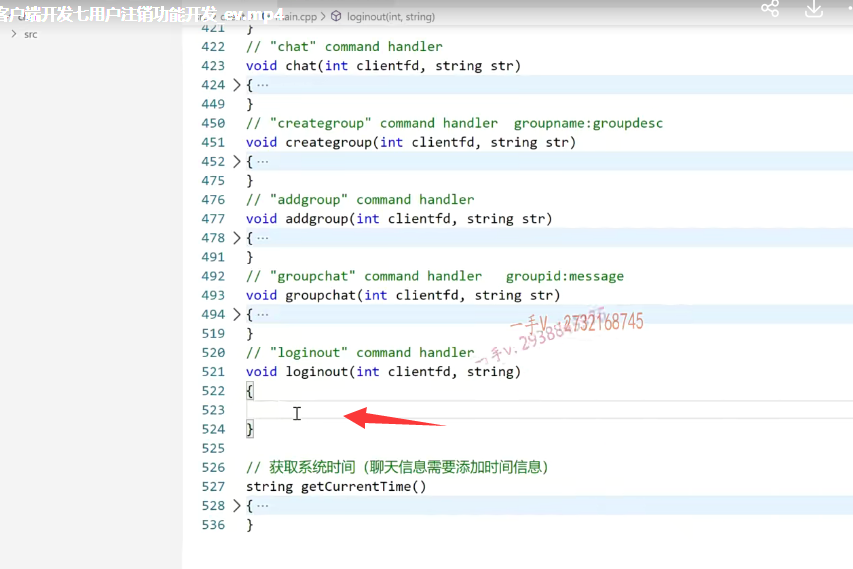

# 注销业务

正常的注销跟我们之前异常的这个退出啊，异常的退出呢，我们说是直接ctrl c了。是不是啊？

那么相当于呢？在网络层的话呢？就是socket就直接断了，

断了的话呢，我们在这儿提供了一个什么方法呢？就原来在服务器这里边有一个close exception，

是不是这么一个方法啊？

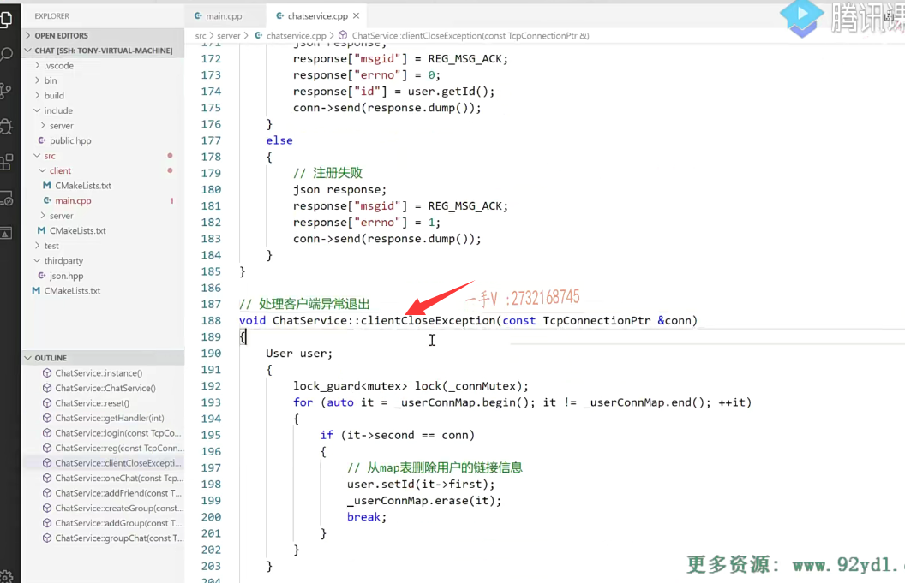

嗯，那实际上我们现在做的事情呢，

就是一个正常的退出，就我要发一个正常的消息告诉你，我要下线了啊。

然后呢，你就可以根据我收到的消息呢嗯，把相应的这个数据呢啊修改一下。

啊，比如说呢啊，根据我的这个ID，把我的这个连接呢，从你的这个connection map里边是不是删除一下啊？

然后呢，就是更新一下用户的状态信息。

因为我已经login out了嘛，注销了，把我表里边这个online改成offline，

就实际上跟这个closed exception一样。只不过发正常的退出消息呢，

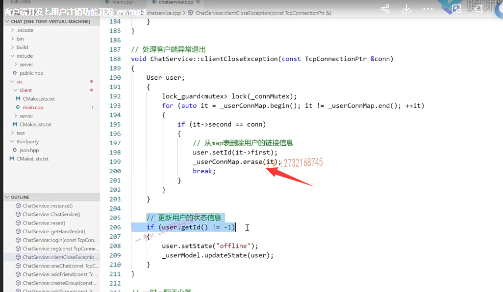

### 如果异常退出，我不知道那个用户，所以只能通过比对map中连接来找到用户id

人家是有一个ID发过来的，而不像这里边儿异常退出，也不知道谁异常退出了，就是网络层出了问题啊。

那么，这里边只拿到了这个发生异常的这个connection，那然后我只能在这里边做connection的这个对比。啊，通过比对connection是否相等来删除它？

### 如果正常退出，人家会发一个消息的，会有用户id

啊，如果正常退出的话，我就可以拿到用户的ID，

然后直接就在这个表里边儿，就找着这个用户对应的connection，直接删除它就可以了。

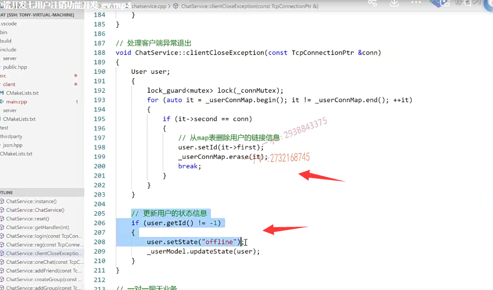

### 注册一个 注销消息 

好，那么在这里边呢？我们首先在public点hpp里边需要添加一个消息啊啊，这个消息就是login out.message.好吧，这是一个注销消息啊，

注销消息我们不如把注销消息直接填到登录啊，这个相当于登出嘛，注销是不是啊？跟登录放一块儿。

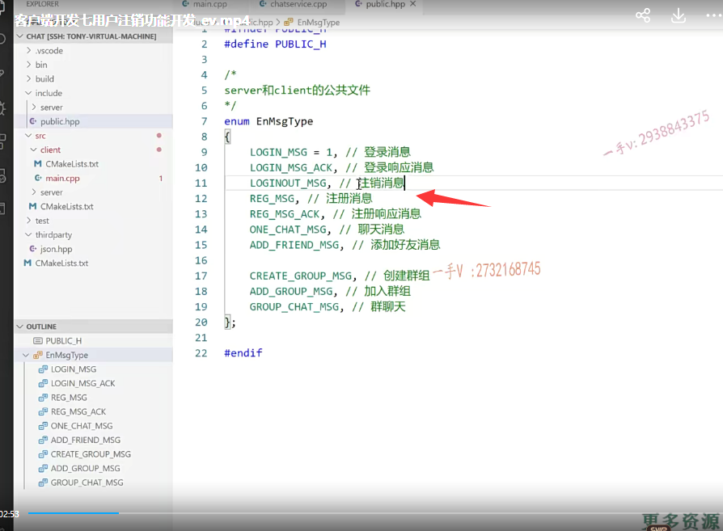

### 客户端的用户注销实现 发送消息类型和用户id

那么，大家来看，

在客户端这里边。

首先这个注销的话，命令就直接是login out啊，所以在这儿直接组织什么就行了。

直接组织这个json字符串就可以了啊。

我们把这块的代码拷贝一下，贴到log out这里边来。嗯。

首先呢，在这儿我直接组织这个json字符串了message ID，是一个login out message.

好吧ID就是我当前用户要登出了好，这个没有了。

那就是只是带一个消息ID跟一个当前要注销的这个用户的ID啊。spend login out message error啊，

返回值如果是负一的话，这个相当于就是把正常的登出消息呢。

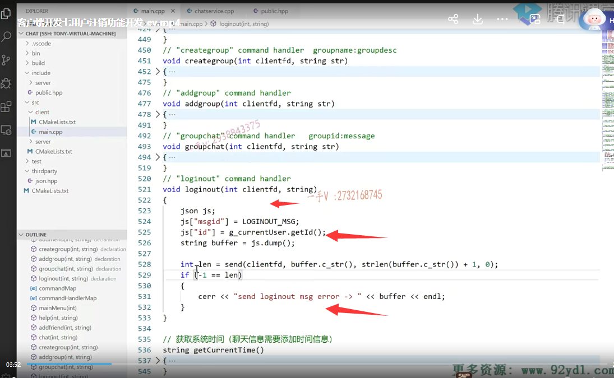

## 服务器的注销服务实现

### loginout声明

又发送到服务端了是吧啊？那服务端在这里边进行true理，所以服务端的代码呢？

我们也需要进行一个相应的修改。

首先呢，在这我们就得先给它添加一个什么啦，添加了一个专门true理啊，登出的是不是业务的一个事件true理器啊true理这个true理注销业务啊

void。就是login。out这么一个业务。

然后呢？网络层派发业务都需要给你传递三个参数的，是不是啊？

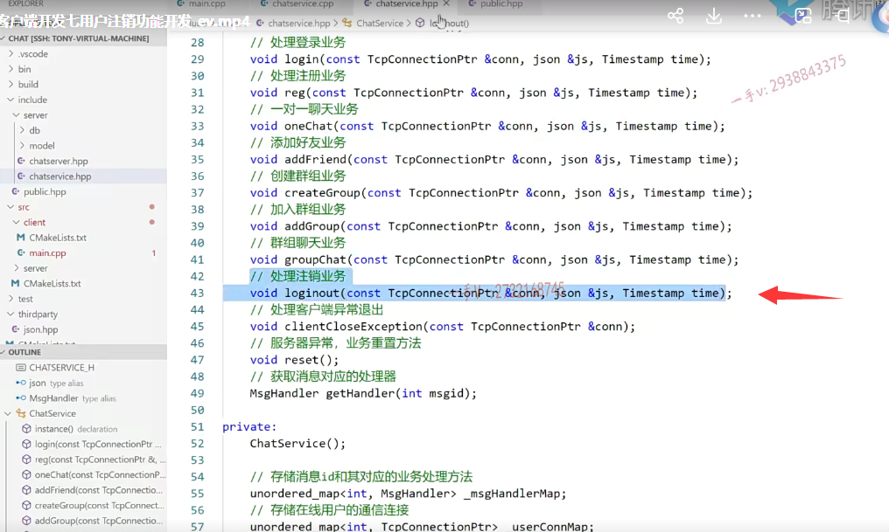

### 在构造函数中和消息类型绑定

然后相对来说呢，我在这个构造函数这里首先要注册你。首先要注册，你写到这儿吧message handler message点insert啊。就是login out messages TD and。chat service.loge n out对吧？this杠一杠二杠三。好嘞，

这个就写好了，把这个消息跟这个事件true理器是不是绑定了？

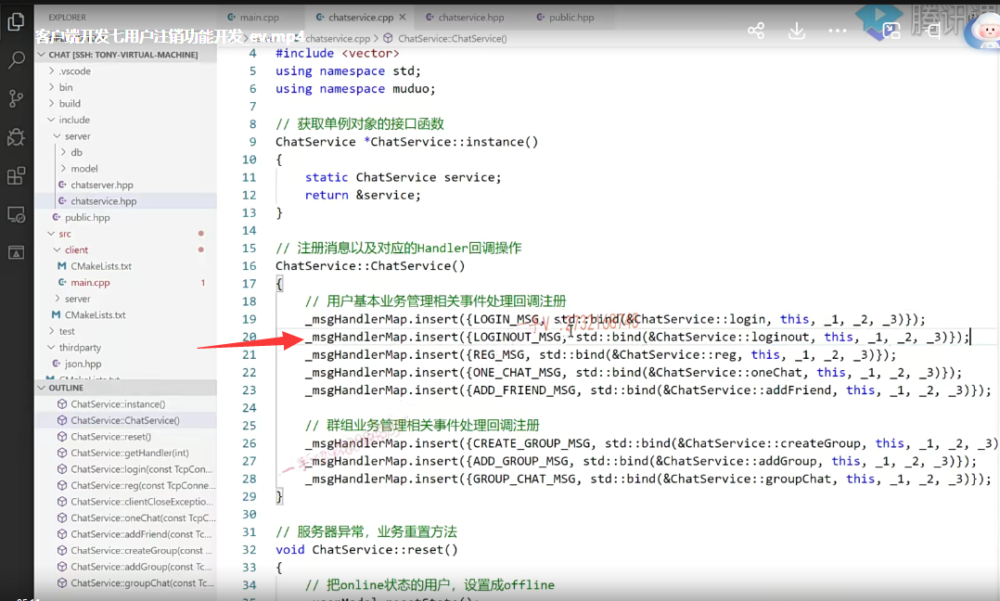

### 得到用户id,然后遍历连接map,找到连接，删除

然后呢？我们就在这来实现一下这个。

不如我们把这个直接实现到之前的异常true理。plant close exception这里。

这因为这两个是true理方法，还是比较相似的啊。

首先呢，在这呃，它可以拿到，是不是用户的ID呀诶？用户的就是user ID=gs。ID点get。

拿到这个ID以后呢，就find一下啊。

这个肯定是能算得出来的，对吧啊？那你要算的这个要操作这个什么啦？connection map的需要。进行一个是不是加锁操作啊？

就保证线成互斥

。好在这儿呢，我们再来看啊，这个需要把类的作用域呢，要加上。

然后是auto=user connection map点find谁呀？find user ID啊，那it如果不等于。

杠user map那在这里边呢？杠user map就怎么样啊？erase把它删掉了。是不是啊？就删掉了。

在这里边，大家来看一看。删掉了以后啊，不等于这个的end末尾的迭代器是不是啊？

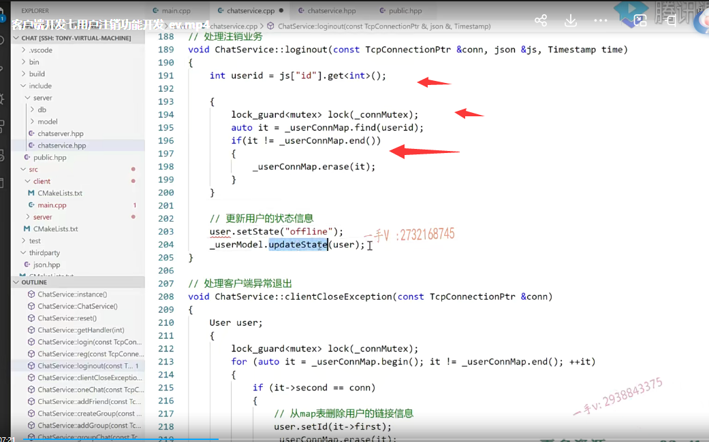

### 更新用户的状态信息，之前是会得到用户，然后设置。现在我们直接构造用户设置

这删完了以后呢？在这儿也是一样的，要更新一下用户的什么状态信息啊？

这个就是user ID。这个就不用判断了，这肯定是一个合法的用户，对吧？

呃。这个upstate upstate要更新谁呀？要更新是不是用户的一个状态信息呀？

对，主要是拿它的这个ID更新，它的状态也就是我们它需要一个user对象。

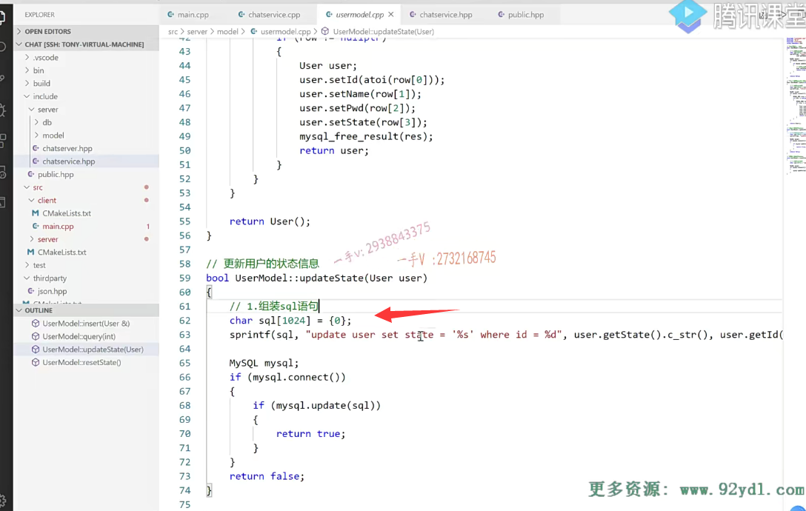

主要是把ID给它填好，是不是就可以了？

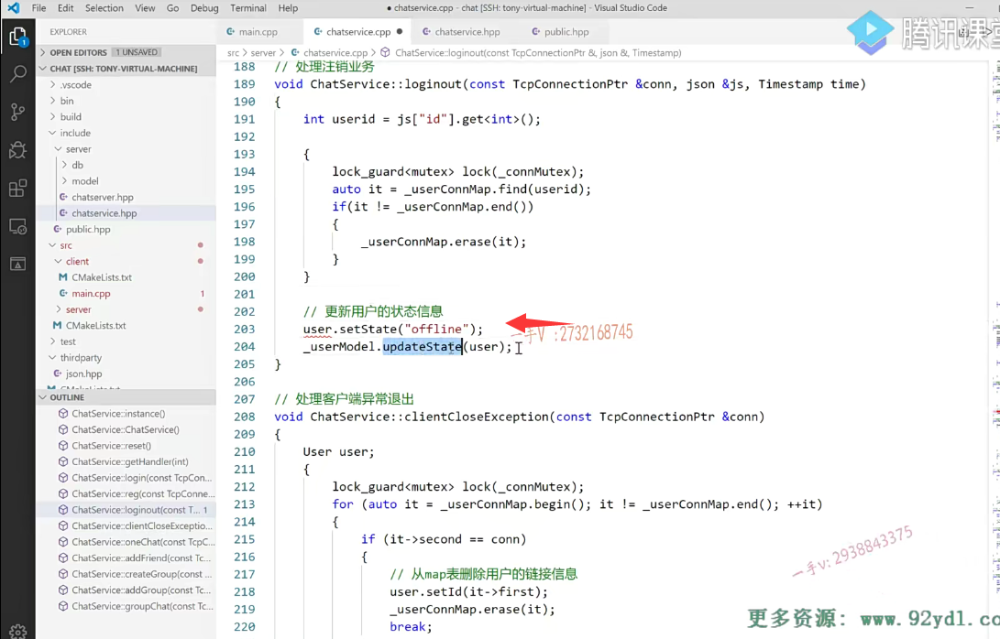

对，所以在这呢，你看一下啊，就是那个user。

user看一下它的这个构造函数。ID name password跟谁跟state，所以中间这两个实际上用空就可以了啊，

第一个是user ID第二，这都不重要，因为name跟password没用上啊，然后这是个offline。

OK，这个就把user ID这个用户的这个状态呀，更新成这个offline也把它从这个connection map里边呢删掉了，加这个括号是为了缩小线程互斥的就是临界区代码段的范围对吧啊？

要不然呢，这个是出右括号才会释放这把锁的，这里并不需要做这个线程互斥啊。

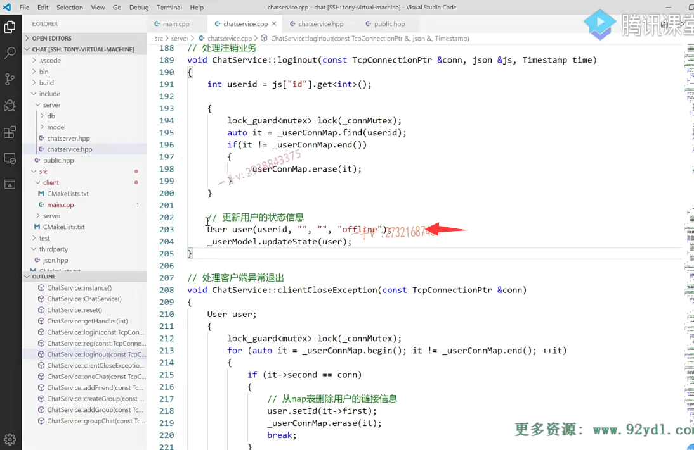

好，那这个功能呢？

我们就实现完了，那咱们来看一看啊，咱们看一看。

这个功能是否是我们预期的执行方式？

重新编译一下。这是这几个文件都有改过啊。客户端的Main，

然后服务端的。service server made.啊，它有过变动的，就都重新编了，重新编我们看一看，

启动一个服务器。然后这儿。我再启动一个客户端。

### 这是上节课测试，这是题外话

啊，上节课我们测试的这个群聊啊，我在这开了三个这个泰国夜啊，然后是张三高阳跟。这个19号叫皮皮啊。三个呢，都参加群聊是没有问题的，

所以也就是说呢，不管是三个人，四个人，五个人，六个人啊，参加一个群聊。群聊功能都是能够正常运行的啊，这是个题外话，给大家说一下，

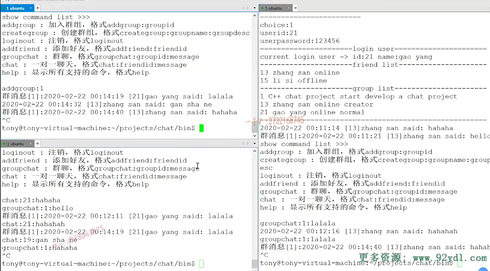

然后呢，在这儿我就登录了。登录登录完以后呢，是个二十一一二三四五六。

OK，然后在这呢，

是个login out？啊login out以后呢，相当于是登出了，是不是登出了，

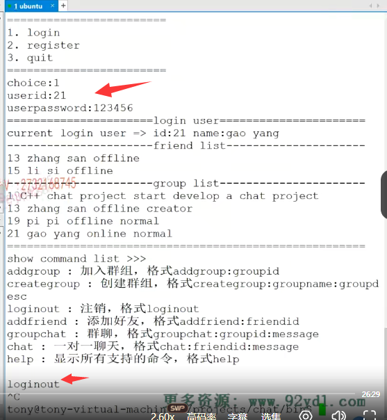

## 客户端这里没有true理好，loginout没有回到首页面

但是我们客户端这块儿的这个业务还没有true理好，没有回到首页面啊？

当然了，来，我们要修改一下客户端相关的这个代码。

### 原因是之前我们聊天业务菜单里面是死循环

在这儿呢，大家来看一下啊，

因为当时呢，我们是这样实现的啊，登录成功以后。

大家来看，登录成功以后啊，我们是直接进入了main menu，

main menu里边是不是又进行了一个for的死循环啊？

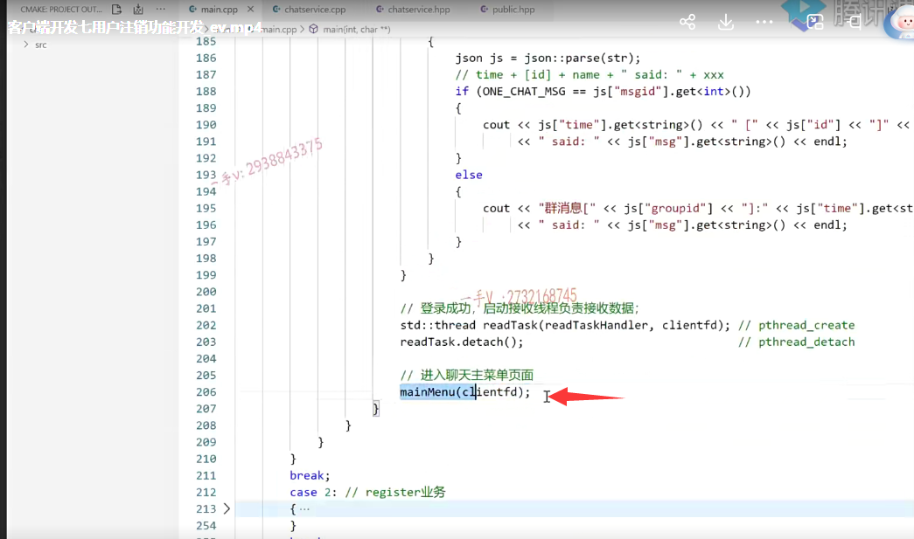

### 我们使用全局变量来控制

相当于就是这儿就一直一直循环到这个函数里边儿了，根本就嗯出不来，

所以没有办法到这个首页面好吧。

看这个main menu。是不是啊？

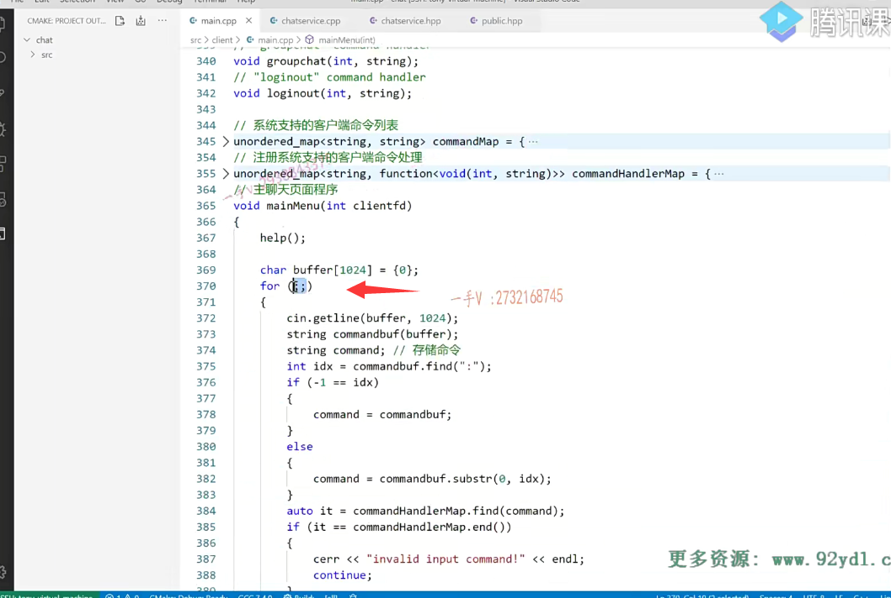

所以在这里边不要通过死循环了，我们得通过一个全局的一个变量来控制啊，

当这个什么登录成功以后呢，我们就把这个设置成true。

当我们注销的时候，就把这个设置成false，它就不会再进来了，它就退出了，

这儿退出以后呢？main menu就退出了，main menu退出以后呢？

那这块儿是不是继续向下运行，就跑到我的什么页面来了？首页面来了。

对的吧啊，这个也是很明显的啊，所以在这我们添加一个全局变量。

这个是一个控制聊天页面程序的啊布尔值。嗯。就是is me menu running。

刚开始的话呢，给它写成一个FALSE嘛。对不对？

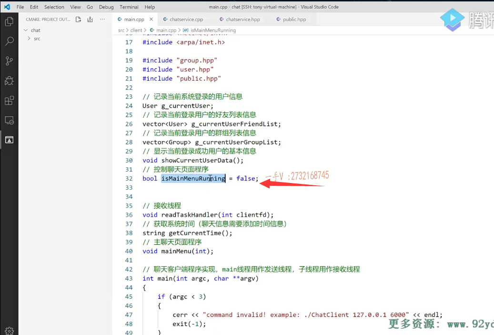

就主菜单页面是否正在进行控制呢？应该是主菜单页面程序。

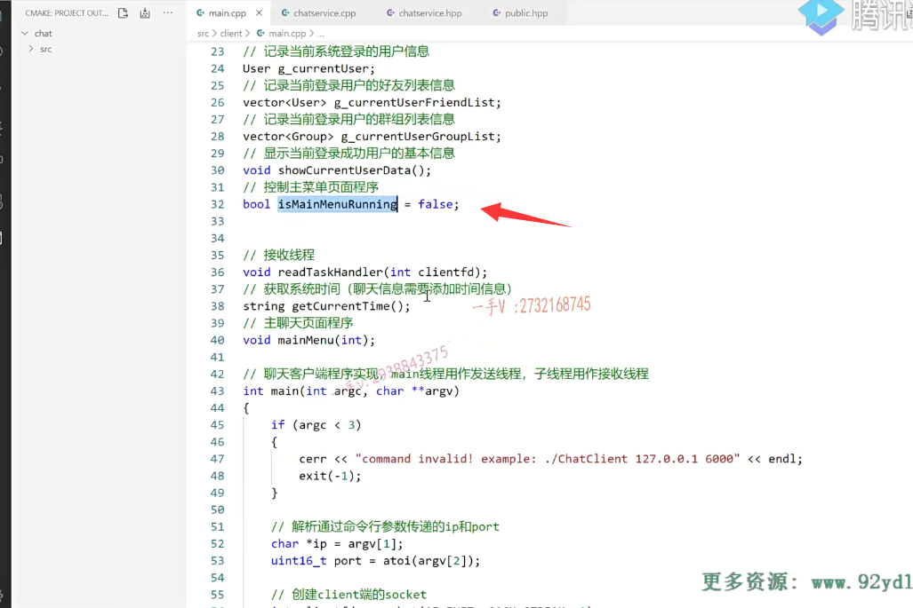

这块儿呢，什么时候制成true啊？

就在这儿登录成功了。是不是制成true啊？

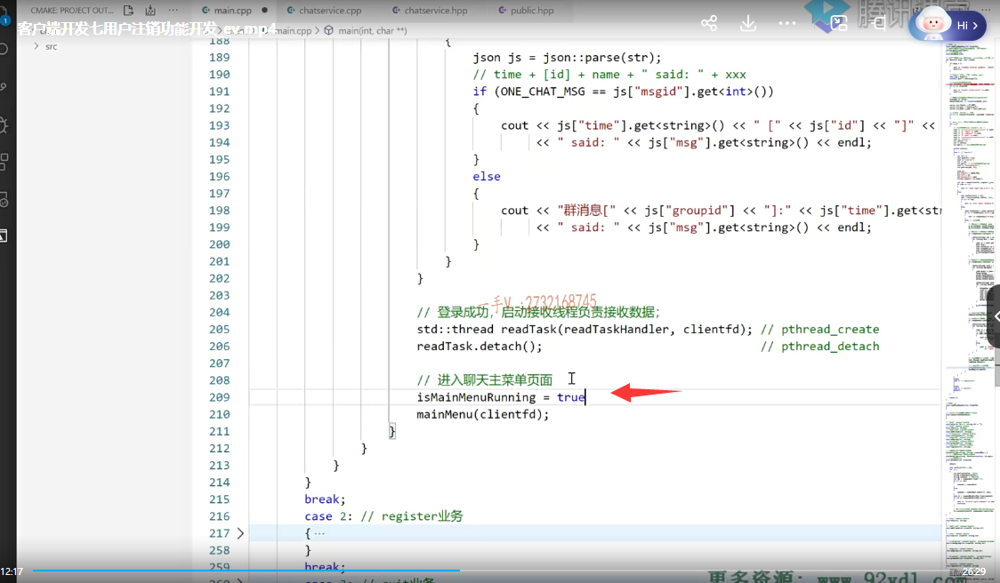

制成true以后呢，就用这个来判断。没问题吧啊，那这就写成一个while来判断它一直是true的。

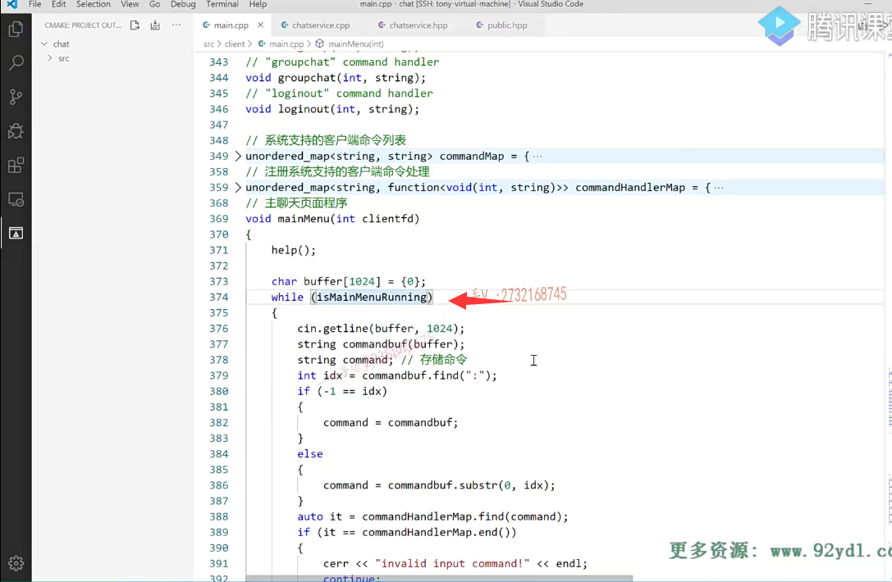

那登出的时候呢？注销了以后啊，这发送完消息以后呢？

在这儿。把它设置成什么FALSE.把它设置成FALSE了，

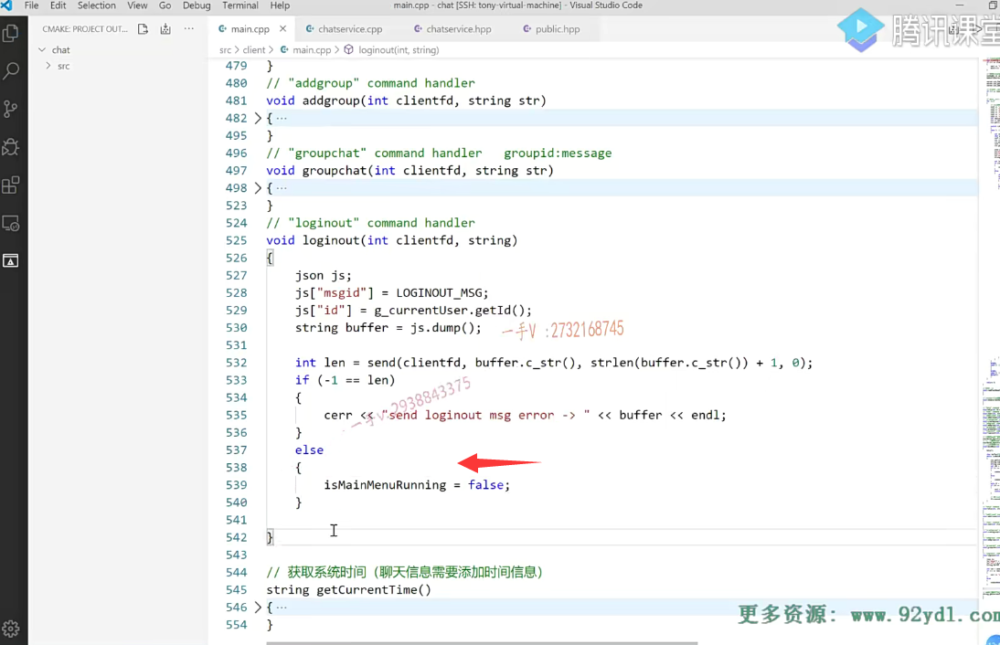

以后呢，我们main menu这块儿呢，就不再进行while循环了，就退出了，是不是啊？

就又回到这个首页面了。

### 测试是否实现退出到首页面

好，那我们重新的去编译一下。编译，完成运行服务器程序这块儿呢？

在运行这个客户端程序一二十一一二三四五六。

然后是一个login out，大家来看是不是又回到这个首页面了，

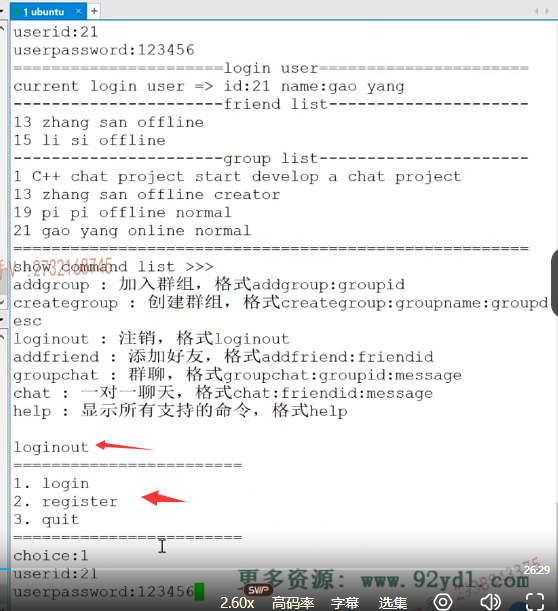

### 可以再次登录

按理说如果修改成功的话呢？呃，

那在这儿的话，我就应该是又能登录了，不会说是它还是一个online状态，对吧？

二十一一二三四五六。

没有问题的。好的吧啊，这块是没有问题，

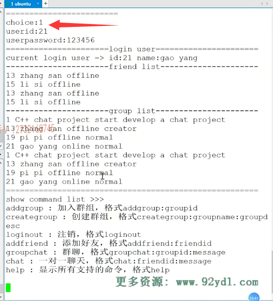

### 错误：我们发现群组列表拉了2次

但是呢。我们却发现，这里边儿有这样的一个问题呀。

他把这个群组的消息。好像是不是拉了两遍进来了？之前都是一个是吧？

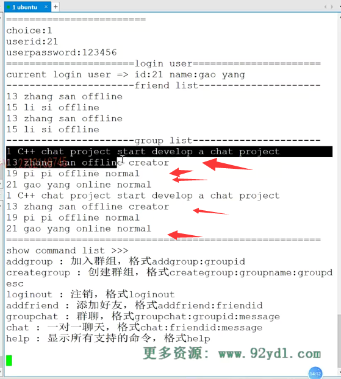

哦。那这个也是一个客户端，很明显的一个错误，

所以这个业务比较多，每一个业务就要进行详细的一个功能验证呢啊，功能验证。

这是什么意思呢？大家来看啊。我们登出以后，重新去登录的话。我们又会从服务器是不是去拉这些个人的群组信息，好友列表信息呀？

往这个current user friend list放。往这些current user group list里边放，

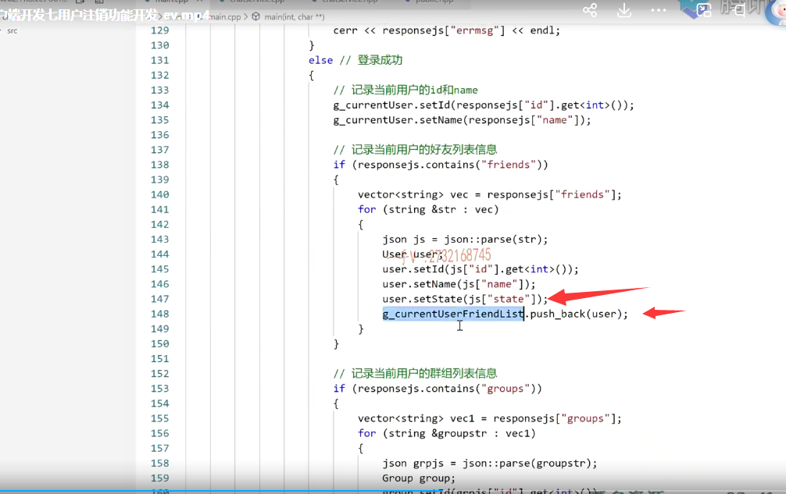

但实际上我们之前登录的时候呢，是不是它都已经放了一回了？

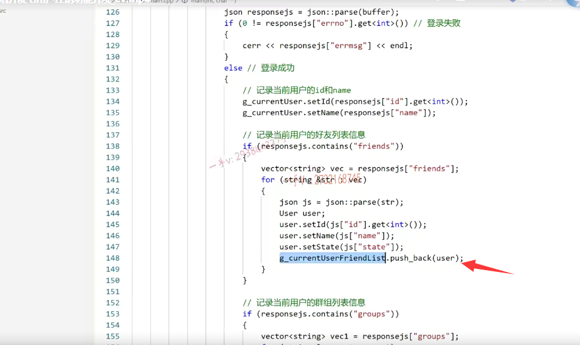

### 虽然是注销，但是程序没有停止，又去往全局vec中又放了聊天列表

当初虽然是注销，但是程序没接触啊，

所以这些全局变量里边原先的这个好友信息群组信息都有。

而你现在再登录一次。是不是相当于从服务器再拉一次，还是往里边继续放啊？

哎，所以呢，这就放了成多份了。看到了吧啊，

### 为了防止vec多份，我们进行vec的初始化

为了防止这样的一个问题啊，我们在这儿。

你看这是如果有好友这个列表信息的话啊，那在这我们先做一个初始化操作。就是先把这个干嘛呀？

先clear掉。然后给它里边进行重新装入对吧啊，因为这是一个新的登录操作嘛。

这也是一个初始化操作。这也算是呢，我们随着业务的增长，在马上的这个逻辑上就会出现一些漏洞，

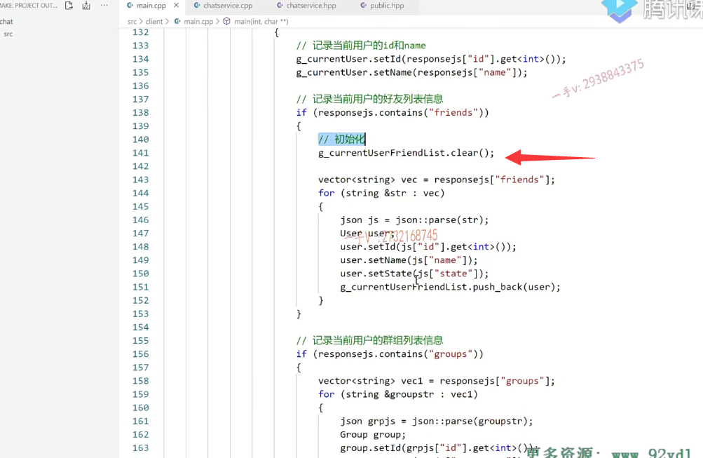

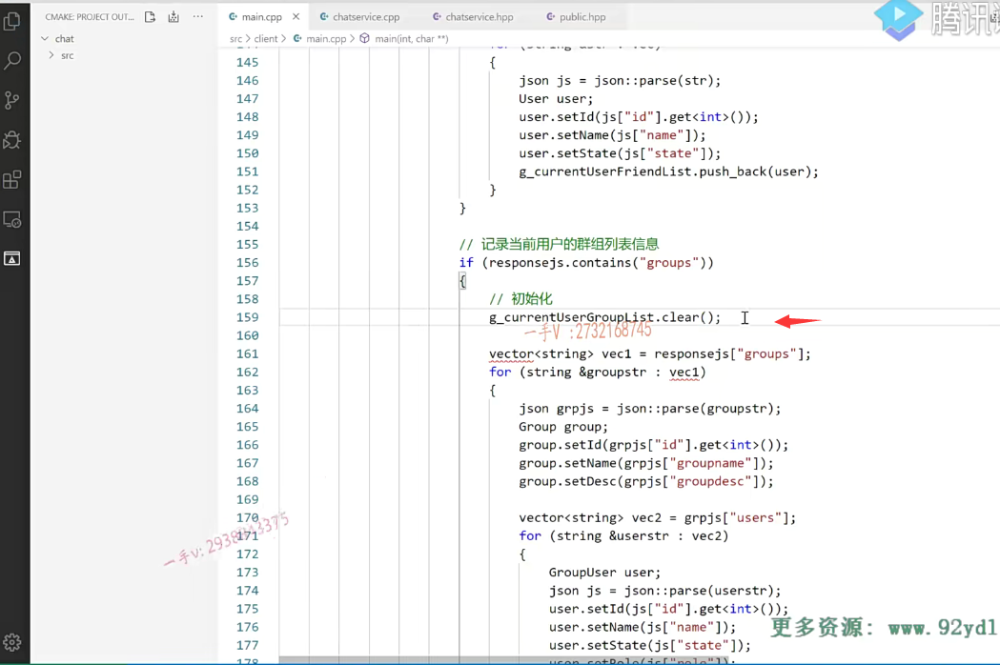

对吧啊？我们需要去修补这些漏洞。

好，那这个应该就是我们所搞定的啊，这块就再也没有了。

因为这个login这块呢，会被多次执行注销了以后，又开始是不是啊？

你看从上往下，我们再仔细检查一下啊。这块没有问题。这是登录成功，那你又以另你可能换了一个账号，登录成功了，

所以这个ID跟name肯定是要重新写的。要往friends里边放，所以这个friends list应该是得先清清理一下，清空一下，

再往群组列表里边放，群组列表得清空一下是不是？

show count user data那相当于就是打印它的好友信息跟列表，这个群组信息这就没什么问题啊。

然后看有没有这个离线消息，因为这里边没有涉及到全局变量。

所以呢，你每一次登录都会拉你这个账号，相关的一些离线消息，这个没有什么问题，

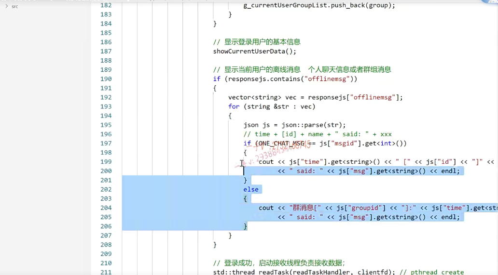

## 这里有问题，登出 再登录 会再起接收线程

但是呢，这块儿就有问题啦。为什么？

因为在这个地方来看一下，当你登出了以后啊，你这个负责接收数据的这个线程。又怎么样啊？

也要结束，要不然呢，你看之前的你第一次登录成功以后，

你这个线程是不是就已经启动了？你是个死循环，又出不去，对吧？

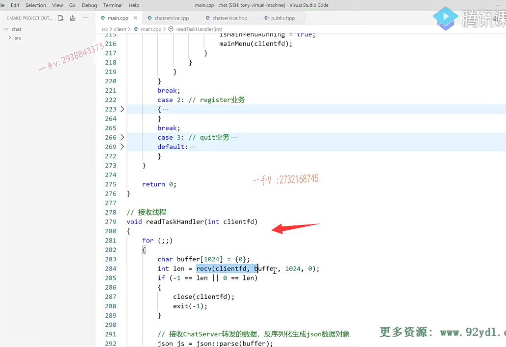

你登出来以后再进行登录，你这个线程是不是又起个线程？还是在做是不是这件事情啊？现在又有两个线程都在这个receive了。这肯定是不允许的啊，

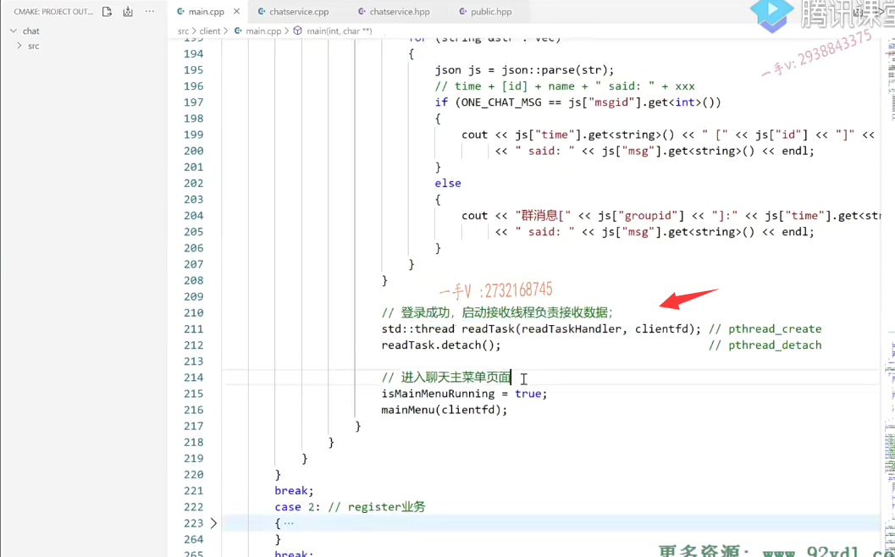

### 继续使用这个isMainMenuRunning来控制一下

所以呢，在这里边我们都用这个变量来控制一下。

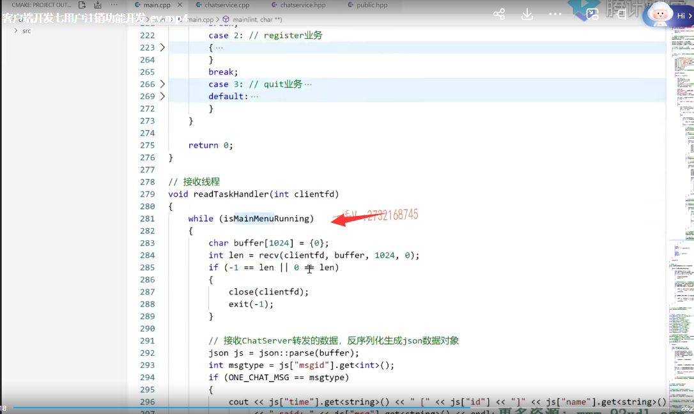

当第一个用户呢，登出了以后啊，当第一个用户登出了以后。

首先，main menu会结束的话，

### 发现这个全局变量没用，还是会阻塞

但是呢，在这里边的问题就是什么？就是这个地方receive会阻塞到这里。

因为第一次它的这个接收线程启动成功了，是不是？

所以呢，也根本没有机会运行到这。它在这里边儿阻塞了嘛，

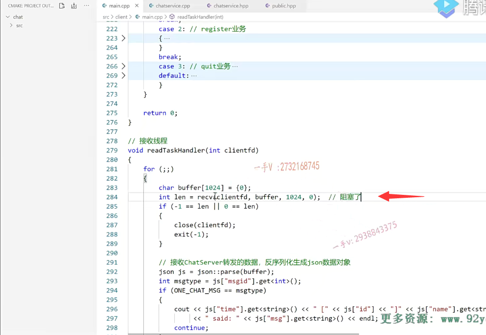

### 所以只能设置这个线程只能启动一次 

你就是当前用户，你登出了。这个线程是不是它也响应不了任何东西呀？

对的吧啊，响应不了任何的东西。

==所以对于这个线程来说，整个只启动一次就可以了。==

==没问题吧啊，该线程只启动一次，不会启动第二次的啊，==

第二次你第一次的用户，你登出了第二次再来一个新的用户的话，只需要改变这个true，进入新的聊天页面就行了。

啊，这块儿呢，不需要做任何这个启动，

### 定义一个局部变量来解决多次创建线程的问题

所以我们在这里边很简单，true理一下，这不是函数的这个局部嘛，对吧？

这里边我定义它的局部变量啊int就是thread number等于零。

那么，如果这个thread number 加加等于零的情况下，我才启动这个线程。

或者说是别每次进来都加了。你看这样的话呢。我这是一个静态的局部变量嘛，数据段呢，是不是啊？

第一次为零的时候呢，它会进来，但加一就成一了。

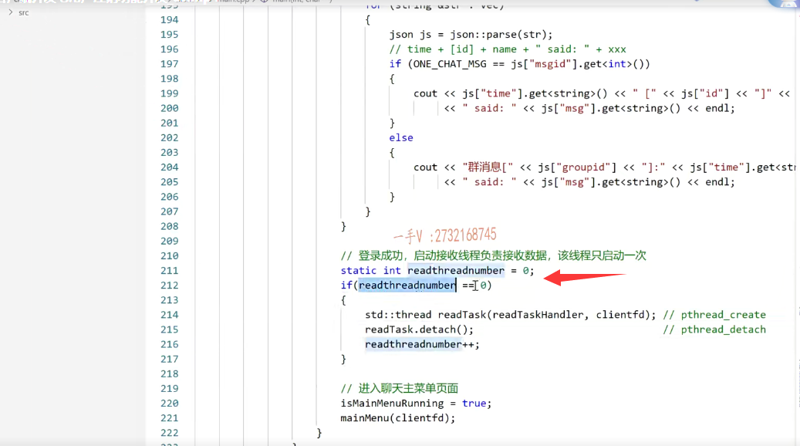

后边再进行一个登录操作的话，这个就不为零了，

不为零它会它是不是就不会再进来了啊？

这块我控制一下thread number。如果是没有开启这个。read thread number的话。

没有开启这个独线程，那开启一下啊，已经不已经它不等于零了，就说明已经开启了，

就不会再开启了，是不是啊？这也是呢。我们要重复进行登录的话呢嗯，

## 再重新编译测试

这里边儿所要涉及的业务，我们必须要考虑的地方啊。

读线程不能取多个。起一个就可以了，

重新编译一下。okay，

这里边呢，把我们的客户端呢，重新编译了啊。这我重新启动一下服务器。

这块儿是一登录二十一一二三四五六。OK，这块是可以的，对吧？

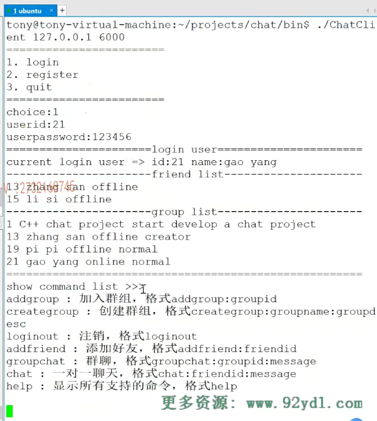

login out。就退出来了，

一二十一一二三四五六，这又登录成功了，

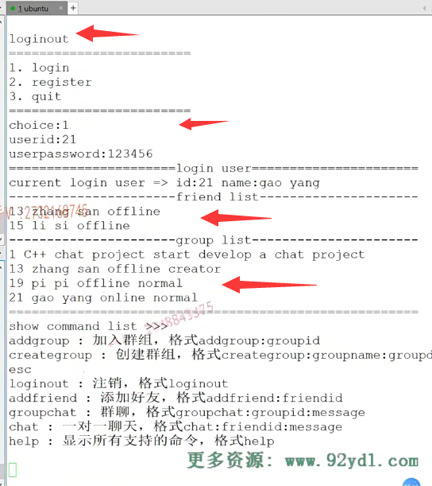

### 测试一下能够正常通信

我们看一下。看能否正常进行一个通信啊？

一幺三。一二三四五六。chat，21。

这没有问题了吧啊chat 13。可以的啊，

group group chat 1。都可以收到啊okay啊。

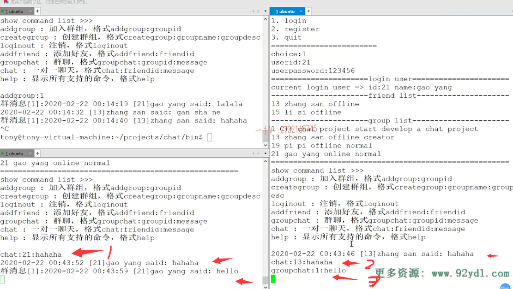

用户的这么一个正常的login out功能，注销功能，那就实现到这里

==选择三  这块儿就退出整个的客户端程序了啊。==

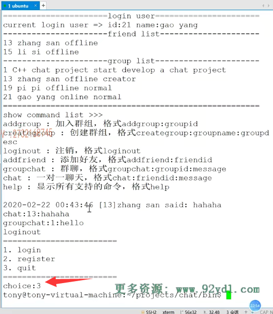

## 总结

好，那这节课的主要内容就给大家说到这里到这儿呢，我们的这个提供单机服务的这个聊天服务器啊，

跟这个客户端，我们的整个的业务功能就全部开发完了。

这个客户端的代码大概有个560行啊，560行。

### 代码行数

我们来看大致看一下这个服务器的这个主要的这个代码。这300行杠是560，这是860行，对吧？900行。那还有这些代码，整个下来现在就是客户端跟服务器的整个的代码加起来应该有1300行左右啊，1300行左右。

还有包括我们网络模块的代码啊，1300行左右。
学到这节课，大家是光听了呢，还是跟着我的这个项目课呢把所有的功能代码啊，都写完了呢，

对于里边的这个代码的设计啊，模块的这个设计，网络层

### 主要知识点

==尤其是对于服务层muduo库的这个编程是否熟悉了它的这个网络模型，就是epoll加多线程的这么一个模型啊？==

==然后呢，包括网络层怎么派发json到服务层，==

==服务层又是怎么去通过添加一层muduo层来解偶服务层和数据库操作的这么一个代码设计呢，对吧啊？==

==我们给大家设计的代码在业务层上，你绝对是看不到数据库相关的sql语句或者说是字段名称的，==

### 操作的都是面向对象的操作

==我们操作的都是面向对象的操作，对吧？==

那是因为我们定义了很多or m，就是映射数据库表的像group类啊user类啊group user这样的类是不是？

还希望呢，跟着我的这个视呃视频课程呢，好好的把我在视频上啊，在领着大家写项目代码的过程中所强调的一些设计呀啊，

这个容器的一些应用啊，包括线程的这个互斥啊，

线程安全的这个引入啊啊，怎么考虑具体业务应用场景的啊，仔细的去推理，去思考一下好吧，

因为你思考的越多。这样呢，你把这个项目的这个内容呢，写到简历上，

到面试的时候呢，你才会表达的更清晰，说起来心里边儿也就会更有底儿。

你千万不要死记硬背，这些东西好吧啊，

### 下节课讲什么

那么从下节课开始呢，我们就进入到我们的这个聊天儿服务器如何进行一个集群？

我们会给大家介绍一下nginx tcp的这个负载均衡的配置啊，负载均衡的一些概念，

实际上不仅仅是聊天服务器，我们写的任何的服务器呢？

都可以很快速的通过水平扩展聊天服务器啊，就是服务器主机的这么一个功能。

再用nginx的负载均衡，把集群的服务器进行一个负载，

可以在很短的时间内提升我们服务。服务器的一个并发能力的。

好，这节课呢，就给大家说到这里。