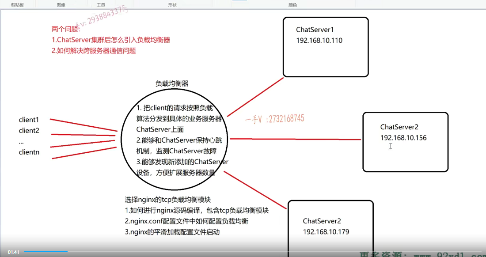
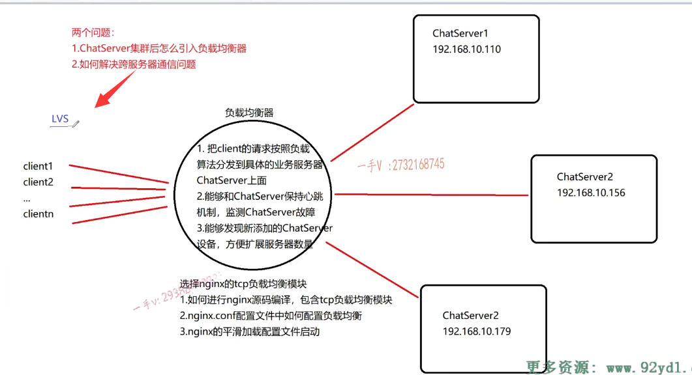
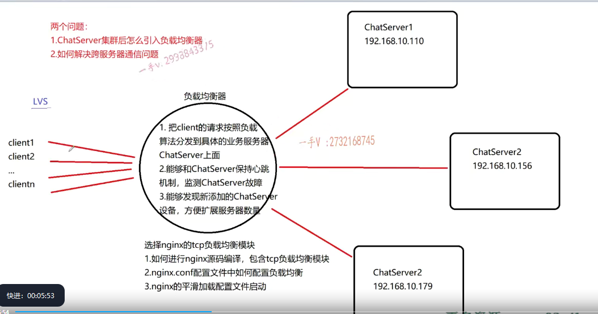
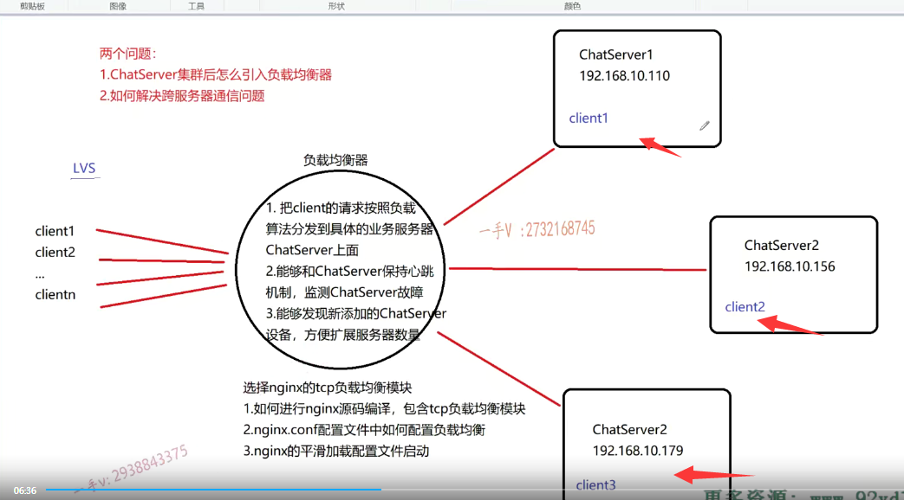
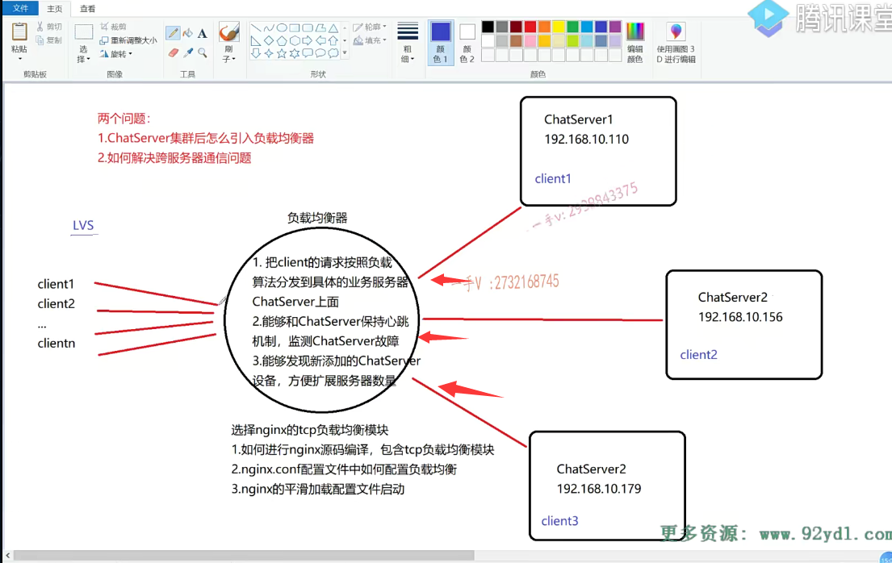
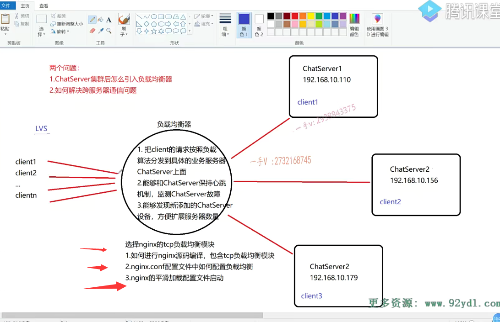
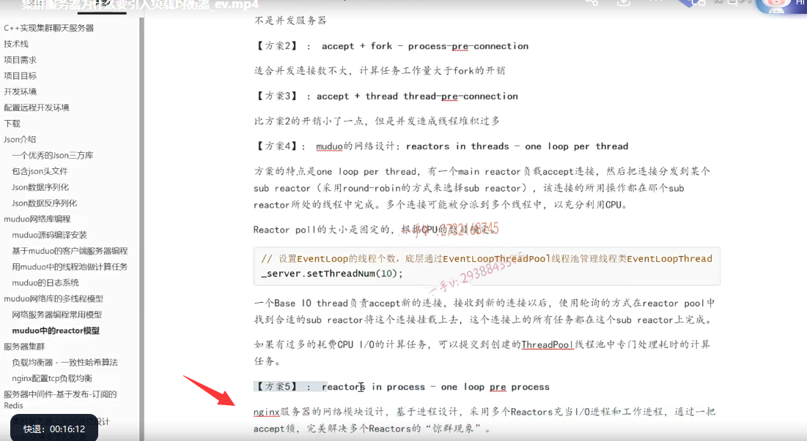

前面呢，我们把这个聊天服务器的这个chatsever跟chat client的代码呢，

也就都写完了啊。

现在如果是很多的客户端啊，享受一台聊天儿服务器呢，提供的这个业务呢，那是没有什么大的问题的啊。

但是呢，这个一台服务器在我们linux的这个32位linux下呢，大致的这个并发量啊，

也就是说你给这个一个进程，通过limit呢，把进程所能使用的文件描述符，

因为socket fd本质上就是文件描述符嘛，对吧？它默认是幺零二四个，你给它调大啊，调大以后呢，基本上32位Linux系统的，这个你的这个业务服务器啊chats ever，也就是支持两万左右的一个并发并发量。

也就是说你写的这么一个单台的server啊，支持的也就是两万个人左右，同时在线聊天。

你要支持三万，四万就不行了啊，就做不到了。

# 集群

那么，如果我们想啊，如果说我们想提高我们这个服务器的并发能力，让更多的用户啊，我们产品上线了以后呢啊，使用的人也是越来越多了，对吧啊？

那么，在这里边儿，我们就要进行一个集群或者分布式部署了。

那么，在这里边儿啊，我们采用集群，集群的话呢，非常方便。

也就是说，在水平方向上，我直接原来有一台主机，现在我扩展多台主机。

每一台主机运行的都是一个独立的chat server。对不对？

假如说在这里边儿，我画的我们现在引入了三台的这个聊天儿服务器啊，三台聊天儿服务器的话，

每一台服务器都可以给用户提供这个聊天儿服务。

### 服务器不可能是客户选

但是呢，同学们，你想啊。

我们在用QQ客户端登录的时候啊，人家有没有让我们选你现在想连哪个服务器？

你想连哪个服务器啊？你不能把选择服务器的这个这个决定呢，扔给客户啊，客户哪知道你哪个服务器空闲，

哪个服务器繁忙呢？是不是啊？

### 引入一个设备叫做负载均衡器

所以呢，在服务器集群的这个环境当中呢，我们肯定是需要引入一个设备，叫做负载均衡器啊，负载均衡器。啊，也叫做一反向代理设备来，

在这里边儿帮我们来统一接收客户端的请求，

然后根据配置的一些既定的负载算法来把客户端的这些请求分发到我们的这个业务服务器上chatserver上。

那么，我们在这里边用的nginx,，就用的负载均衡器呢？

就是nginx的TCP负载均衡模块呢？人家轻轻松松。五六万的并发量是没有问题的，

所以说呢，我们一台Nginx的负载均衡器带上三台我们的chat server能够马上就把这个用户的这个数量呢，并发数量就能够提升到五万至六万。

啊，这是非常轻松的，也是解决并发量最直接最简单的，对吧啊？

### LVS

那有的同学说呢啊，如果我想提高更大的这个并发量的话，我有没有方案呢？当然有方案了啊。

我们对于这个负载均衡器本身也可以进行集群前端呢，再挂一个lvs。

lvs是一个相对来说比较偏底层的啊，一个负载均衡器

像负载均衡，它有业务层的负载就是通过业务分发，

还有这个传输层的负载就是通过TCP或者udp来分发，

还有网络层通过IP来分发，

数据链路层通过这个帧啊，数据帧来进行分发的对吧

lvs它的这个并发容量啊，很容易就会扩展到这个十几万。

啊，没问题吧啊，一台lvs带多台的nginx就可以更大的进行这个用户并发聊天这么一个容量的一个扩容了好吧啊，

那这个就说远了，这个大家有兴趣的话呢，可以去了解一下lvs也是一个在负载均衡器这个使用场景中啊，

非常常用的一种设备。

那么，我们在这里边儿呢？我们就从单台的两三万扩展到三台服务器，总共能提供五到六万的这么一个聊天儿的这个用支持用户聊天儿的这么一个应用场景啊，

我们来看一看那首先呢，那客户端啊，用户在使用客户端的时候呢，就不用去选择连接哪一台服务器了。

那么他们肯定啊，客户端软件默认的连接的都是负载均衡器。

在这里边儿，它的角色就是相当于一个中间的这么一个桥梁儿，连接了客户端跟服务器之间的，是不是通信了？唉，这个client先发送请求，肯定先发送到负载均衡器上，

负载均衡器呢，根据呢，这里边儿配置的既定的一些负载算法啊，负载算法。

那么，比如说轮询，比如说按权重是不是，比如说按IP哈希那nginx TCP负载模块还是支持很多的，这种负载算法的。

这个大家可以呃，深入去了解一下啊，甚至我们有些同学呢，学完这个项目以后呢，专门去把nginx的这个源码剖析剖析啊，看看它的负载均衡到底是怎么实现的？

啊，这就是属于非常有心的同学了，也是对于这个基础上不满足啊，

然后呢想更深的去扩展自己，这是非常好的啊，那如果你不想去这么深的去扩展的话呢，

你把我们这个项目上所给大家讲的先理解透彻啊。

那假如说我们用轮询的话，

那就第一个客户端c1发送的请求负载均衡器就给它分发到了chat server 1上。那相当于呢，这个client 1就注册到谁上边了，就注册登录到这个chats ever 1上了，

注册登录注册的信息都是写到数据库的对吧？

刚才二现在登录它通过负载算法，因为负载方法是轮巡嘛，一个服务器一个啊。

再来client 3啊，分别呢就注册到三台服务器上了，

这样的话就有效的把不同的用户呢，分发到不同的业务服务器上，一台32位linux的业务服务器带两万，

那三台是不是轻松能带够六万啊？没问题吧啊，

那负载均衡在这里边儿，它的这个性能测试啊，它可以支持的这个并发连接量大约在五万到六万之间。啊，

这个呢，大家也可以看一看nginx的这么一些性能测试的文档描述啊，

这个在网上呢，还是有很多的资料的。或者是你直接去看它的这个官网啊，那么在这里边儿大家来看负载均衡器，在这儿要解决呢三个问题啊，

首先。它是呢，把client这个用户的这个请求啊，按照这个负载算法能够分发到具体的业务服务器上。这是它要做的。这是他要做。

### 聊天服务器是长连接业务

我们聊天儿服务器，是属于短连接的业务，还是属于长连接的业务啊？

各位，我们当然属于长连接的业务了。是不是啊？

长连接的业务就是说客户端跟这服务器通信以后呢，它这个链路就一直保持着呢，为什么呢？

因为我们聊天儿不仅仅涉及你是聊天儿的发起者，你把信息要推到服务器啊，我们还可以作为聊天儿的接收者。

不管是个人对个人聊天儿，还是群组对我们这个个人聊天儿，对吧啊？

我们加入群组，群组来聊天儿。服务器都是会主动推消息，是不是到我们客户端上的？

如果我们不是长连接，而是短连接，每发一次，请求客户端这个服务器反回这个响应以后呢，

服务器就主动把连接关掉了，请问？

那如果当你是作为聊天儿的接收方的话，服务器怎么去给你推送这个消息呢？是不是就无法推送了？

所以基于长连接的服务器。

## 第一个 客户端的请求以及服务器的响应呢，都要经过这个负载均衡器

啊，在这里边呢。要有按照一定的负载算法分发到这个服务器上，服务器呢响应，再通过这个链路先回到负载均衡器上呢，然后再反馈给相应的这个客户端，

==也就是说呢，客户端的请求以及服务器的响应呢，都要经过这个负载均衡器的。==

那我们这儿主要说的就是nginx的TCP负载均衡模块儿好吧啊。

### 也有的nginx只做客户端请求的分发，服务器去回复

那也有的这个场景里边儿啊，这个就看你的这个负载均衡的配置了。

==也有的这个场景里边儿就是负载均衡啊，只是做客户端请求的分发啊，分发了以后呢？唉，分发了以后在这里边儿呢，就是服务器最终去啊，给客户端回复消息的时候呢。是通过建立一条IP隧道，直接呢把这个请求呢，就直接响应给相应的这个客户端了，==

因为负载均衡器，这里边可以把客户端的这个网络信息IP地址端口号之类的可以，因为他要转发这个客户端的请求，要递交给这个服务器，服务器就能拿到它，最终所响应的客户端的网络信息。

它可以通过建立一条IP隧道啊，那么直接响应给这个客户端，这样当然这样的这个效率那是更好的了，对吧啊？

那我们现在nginx tcp负载均衡模块啊，用的是这个就是客户端的请求以及服务端的响应啊，它都是要经过这个负载均衡器的啊，这是一个

## 第二个 nginx和chatserver保持心跳机制

第二个，能够和chats ever呢，保持心跳机制监测chats ever的这个故障。

我先配置了三台服务器的信息到你的负载均衡器上，

那你的负载均衡器呢？跟我保持这个长连接了，因为我这是一个长连接的业务，对吧啊？

那如果说我chatserver 2发生故障了。

这儿发生故障了，那你总不能是不是后边儿有客户端请求，你还依然把这个客户端的请求往chats ever 2上分发呀？这个机器已经故障了，

你把客户端的请求分发到这台服务器上，这台服务器也不能够提供服务。也无法给客户端进行响应啊，是不是

客户端聊个天儿，半天呢，那看着消息怎么没有响应？是不是啊？

这肯定是不能接受的，

所以作为你负载均衡器，你不仅仅啊得要最起码有第一点的业务，你还得有第二点的业务，

就是你可以呢跟这后台的这些聊天儿服务器呢，保持这么一个心跳机制啊，

### 负载均衡器必须时刻去监测这些业务服务器是否在线

如果网络良好chats ever直接由于挂掉，导致网络中断，

那负载均衡器当然一下子就能监测到了。是不是

如果网络环境复杂啊？中间这里边儿数据包在网络的节点，比如说路由器交换机上是不是长时间的存留啊？

那相当于也就是说呢，数据呢，现在如果我发到这个chat server 2上啊，虽然你没挂掉，但是由于网络环境太复杂，

数据在网络的中间的这些节点路由器交换机上呢？去这个缓存的时间太长，

那这相当于也就是说chats ever 2不能够提供服务了，对吧啊？

所以要保持一个心跳就心跳啊，一秒一个心跳。

啊，对吧啊，你每一次发个心跳。

我就把一个心跳计数器给它减个一。啊，我发了一个心跳，你没有给我回，那相当于一秒我就要给心跳计数器，是不是加个一啊，

比如说我加过三的话。我就认为我给你发了三次心跳，你都没给我响应，

那说明呢，这网络不通，

我就判定呢，你这个服务器呢，不能够正常提供服务了。

==这就是负载均衡器必须做的事情，你必须时刻去监测这些业务服务器是否在线。==

==因为你的责任就是把客户端的请求分发到业务服务器上，是不是。==

如果你不了解业务服务器是否正常还在工作。

那这块儿你把这个客户的请求分发到不能够及时响应服务啊，或者说是不完全挂掉了的这些服务器上啊？

那客户端得不到响应，那就是没人去使用你这个产品了，是不是啊？

## 第三个 能够发现新添加的这个chat server设备方便扩展服务器的数量

第三个能够发现新添加的这个chat server设备方便扩展服务器的数量。

你说呢？我现在这个咋感觉这个用户也越来越多了啊，我这三个设备也已经占满了，

我现在想再扩充一台设备。是不是啊？

我再扩充一台设备，我先把这台新设备的这个信息添加到负载均衡器去啊，

然后再把负载均衡器重启一下。

这个有点儿不太好吧，这个啊，

因为呢，你怎么因为如果你的数据量，你的客户量这么大的话，一天24小时肯定是时时刻刻都有人在享受你这个服务。

你不可能一下把这些东西机器重启一下，然后导致所有的这个正在享受服务的客户端全部发现服务中断，服务停止了，

这个用户的使用感受是不是不太好啊啊？

### nginx tcp支持一个平滑的平滑启动

有些公司也这样做，比如说凌晨三四点啊，用户使用最少的时候呢，进行一个服务器的重启之类的。

==但是nginx tcp呢，在这里边就是人家支持一个平滑的平滑启动啊，==

==就是可以在不中断服务的情况下去加载这个配置文件来动态的去识别呢，你新添加的这个服务器信息。==

这就是人家第三个能够发现新添加的chat server设备，方便扩展服务器数量啊，

它是通过平滑加载配置文件进行了这么一个启动，在不影响原来的这个业务情况下。

这主要是归功于它提供的，给我们来说，它只是一条命令就可以做完这件事情，是不是啊？

## 总结

好了，那么今天这节课呢？

我们主要啊，就是给大家讲了一下，当我们为了提高啊，客户端的并发聊天儿能力的话，并发在线数量，

我们要横向的去扩展这个chat server，这个机器的数量是不是每一台机器上都部署了我的这chat server进程啊。

那么chat server多了，我们就得引入负载均衡器，是不是

那两个问题就是如何引入负载均衡器？对吧？

那么，在这里边，大家再来看一看啊。

这负载均衡器呢？需要解决哪三个问题？

你要能够承载客户端的请求，以及连接服务器以及服务器的响应，再转发给是不客户端啊啊负载算法？

第二个当然了，那它也是一个网络设备，是不是它也需要一个高性能的这个网络IO模型。是不是啊？

它用的就是我们之前啊，给大家说的呢？这事儿我给大家嗯，在这儿列了一下啊，我们前边儿的这个聊天儿服务器用的就是muduo库，它是一个one look per thread啊。那么，还有一个更高效的方案就是reactors in process，one loop per process。

process是进程了，不是线程了，对吧？

==nginx服务器的网络模块设计及进程设计采用多个reactors，充当l进程和工作进程通过一把accept锁完美解决多个reactor的精群现象，而人家也解决了服务器的这么一精群现象。==

好吧啊，在这里边儿我就。

不再继续扩充了啊，我们的着手点还是当前的这个项目。

## nginx的意义

所以呢，第一个也就是要求你这负载均衡器，主要是涉及到一个高性能的一个网络设备,网络编程

就是你要支持可配置的多种的负载算法是不是啊？

那么第二个就是它能够跟后台的服务器保持心跳来动态的监测呢chat server故障啊？

第三个就是我可以呢，在不影响原来正在享受这个chat server服务的这些客户啊的情况下呢，

我可以动态的去添加新的服务器进来，

而不用把整套系统全部重启。是不是

原来正在享受服务的客户端业务全部中断，对吧啊？

这三点一个负载均衡器，你最起码要解决这三个功能没问题吧啊。这个呢，

也就是说，比如说拿着这个项目去面试的话呢，如果问到我们负载均衡在这里边的意义是什么呢？这就是这三点。

好不好啊？

那当然呢，这节课我们主要是讲这块的理论啊，

那后边呢nginx的TCP负载模块到底怎么样进行一个配置呢？是不是啊？

我们会一一再给大家去带着大家去实践的去操作一下。

好，这节课的内容呢？我们就先说到这里。