# 如何解决跨服务器通信的问题

这节课呢，我们给大家说一下，

当我们集群以后，我们需要针对我们这个chats ever解决的第二个问题，

==就是如何解决跨服务器通信的问题。==

在这里边儿，我们涉及的通信无非就是两个嘛，

第一个是一对一的聊天one chat，

第二个就是群聊group chat。

### 单台服务器上只会显示与本机连接的conn，不可能查到client2服务器上的conn map

对吧啊，那么大家来看，在这里边儿的这个服务模型上啊，

我们画的一登录在这一台服务器上。client 2登录在这一台服务器上，

按我们现有的这个业务来说，

当client 1给client 2发送消息的话啊，聊天的话呢，

我们首先呢，在这台chats ever上，我们在每一台服务器上都有一个user connection是不是map啊？

那在我这个一上的这个user connection map里边儿肯定是找不到clinet2通信的，是不是connection的？

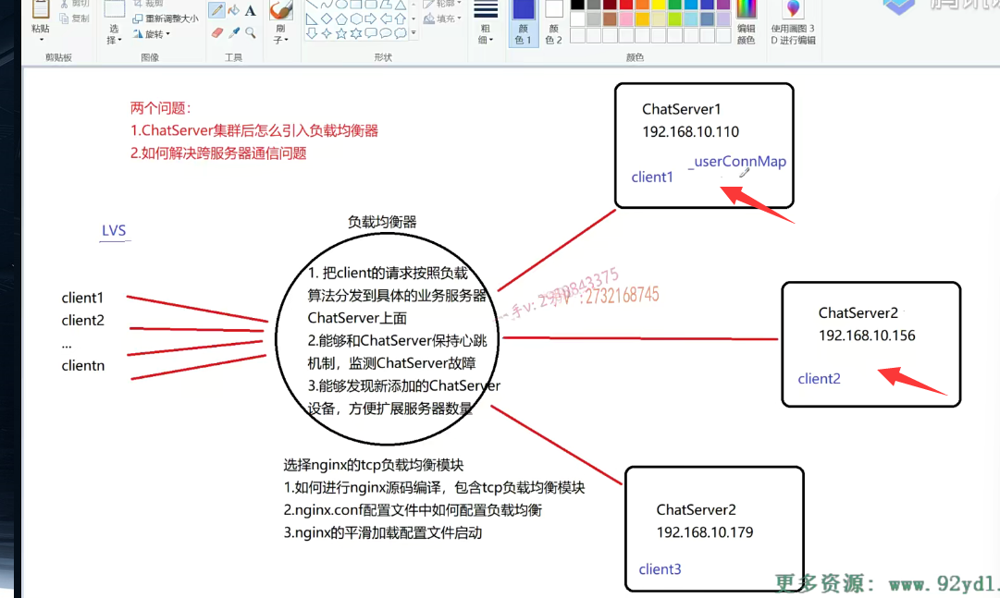

### 客户端不需要改，不需要知道有多少台服务器，自己登录了哪个服务器

所以呢，根据我们现有的单台的业务逻辑，我们判定了c2不在线，直接把这个存成在数据库里边儿，

存成client2的一个离线消息了，

这个在集群环境中肯定是不正确，对吧啊？

这一块儿的逻辑应该在集群环境中，

我们服务器的代码应该在业务逻辑上应该做些许的修改啊，

客户端是完全不用动的啊，客户端是不用了解服务器是有一台还是有多台？对不对？唉，他也不用知道呢，

### 我们可以通过数据库中是否在线，和自己连接map是否存在 来判断对方是在其他集群服务器上

他所请求的服务具体呢是在哪一台服务器上是不是完成的啊？这是不是有点儿云服务器的意思啊？

那么，在这里边儿呢？我们应该是继续判断，如果当前他所要聊的这个c2并不在这一台机器上，

它是怎么判断从user connection map里边儿去查找client 2的这个ID对吧？

找不到的话，我们应该在数据库里边儿去判断一下client 2的用户的一个在线状态。

如果它是一个offline。那就说明他确实不在线，

那我们直接就还按照原来的逻辑给它存离线消息就可以了，是不是？

但是如果我们发现呢？虽然在我当前服务器user connection map里边儿没有找见client 2，

而当时我却在数据库里边儿查到这个用户的状态，是一个online，

那就说明这个用户是在线的。

为什么不在？我在我这台主机上的这个user connection map里边找不到c2的通信用的connection呢，

那是因为呢，集群服务器它肯定登录在了其他的服务器上。是不是登录在其他的服务器上了？

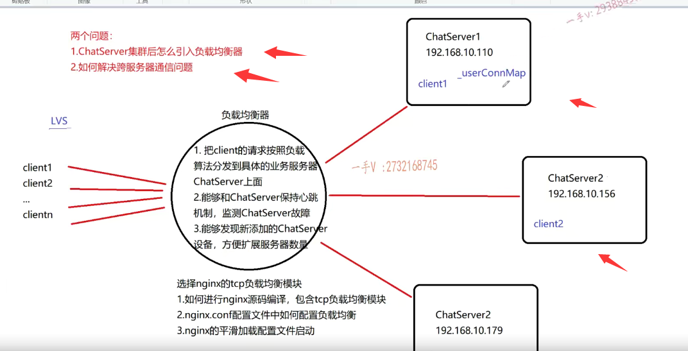

## 梳理思路

对，也就是说呢？

我们把这个逻辑理一下啊c1跟client 2说话，

==如果在chat server 1上能够找见client 2通信用的connection，那就直接转发，那就相当于它俩是在一台服务=器上登录的。==

如果呢，找不见别着急，人家并不一定就是说不在线啊，别着急存储离线消息，

==然后我拿着cloud 2的ID在数据库里边儿查一下，==

==它如果是个online，那就说明它在其他服务器上登录着呢。是不是啊？==

==那如果说在数据库查它是offline，那就证明它不在线，那直接存离线消息就可以了。==

### 是不是  我们server1把消息传给server2然后通过server2找到client2的conn 再去发送消息呢

对了吧，现在问题来了，那如果真的是像我们说的client 1跟client 2在不同的chats ever上登录的话呢，

那么他们如何聊天儿呢？

我这台服务器我根本就不知道client 2通信用的connection是什么？

因为c2没有跟我连啊，人家是跟chat server 2是不是连的呀？

那这个消息是如何？我想办法得把这个消息递交到chat server2上。

然后chat sever 2上是不是再找到跟client 2通信用的connection，

然后再把这个消息在发挥给客户端了？

那我们很多同学可能就直接上来了啊，

这个服务器跟服务器之间还要建立连接。

因为这里边chat server 1需要把client 1聊天对象client 2的这个消息发到这个chat server 2上。

再怎么样啊？这样没有问题。

你不要光拿嘴说。你觉得这样实现实现是没有问题的，

### 服务器还要充当客户端  服务器之间强耦合

但是你想啊，这里边儿实现起来得有多复杂。

这三台服务器，每一台服务器都有可能向其他服务器是不是推送啊？

我这儿有一个人。啊，要跟你这台服务器上登录的用户是不是进行聊天儿啊？

==那么也就是说chat server 1 chat server 2 chat server 3这是三啊，不仅仅要承担啊，客户端的角色还要承担服务器的角色，它们之间两两要相互连接。==

你觉这样的设计好吗？当chat server啊，这个集群部署多台服务器以后，当登录在不同服务器的用户进行通信时，该怎么设计？

这样设计吗啊，我要拆到300上零一上有一个人要跟你拆到四三百零四上呢，登录的一个人要进行聊天儿。那我chats ever零一作为客户端，

先要发起TCP连接连接你的chats ever零四吗？

这样的设计绝对不好，这样的设计对于我单台的这个chats ever的业务代码需要进行大量的修改，

而且这样的不好啊。我这六台服务器，你这里边要建立多少连接啊？这个任何一台连接都有可能发生异常啊，对于异常处理呢，你该怎么去处理啊？

是不是如果你这样去设计的话，

==首先呢，各台服务器之间，那就全部是强偶合了。这是第一点，==

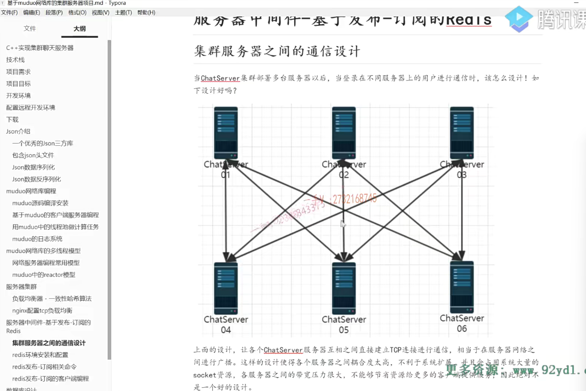

### 业务设计也会更加复杂

而第二点业务设计比较复杂。

### 异常发生以后难以解决

是不是第三点啊？异常发生以后是比较难以解决的，

因为你这里边儿设计的连接太多了。

### 设计的时候高内聚，低耦合

==我们不管是在做编程还是在做业务场景设计的时候，其实都要保证一个高内聚低偶合，尤其是低偶合。对吧啊，高不高内聚我都先不管，==

你给我把偶合先降低了。

那么，上面的设计呢？让各个chat server服务器互相之间直接建立TCP连接进行通信，

相当于在服务器网络之间进行了一个广播啊。

==这样的设计使得各个服务器之间偶合度是太高了，不利于系统的这个扩展，并且会占用系统大量的这个socket资源。==

==啊，各服务器之间的宽带压力很大，==

那也就是说呢，我现在增加一台服务器，你原先的每一台服务器都要跟我这新服务器之间先建立一个连接嗯，

然后呢，我这台新服务器要跟你原来每一台服务器之间建立连接。

你仔细去想一想，你不要认为用嘴说就两句话对吧？

实际上这样的设计呢，实在是太复杂，太不人性了啊。

你要是作为架构设计师啊，你如果设计成出这样的系统的话，

那你要为你手底下的人。骂死了啊，甚至要问候你好几代的祖宗了。

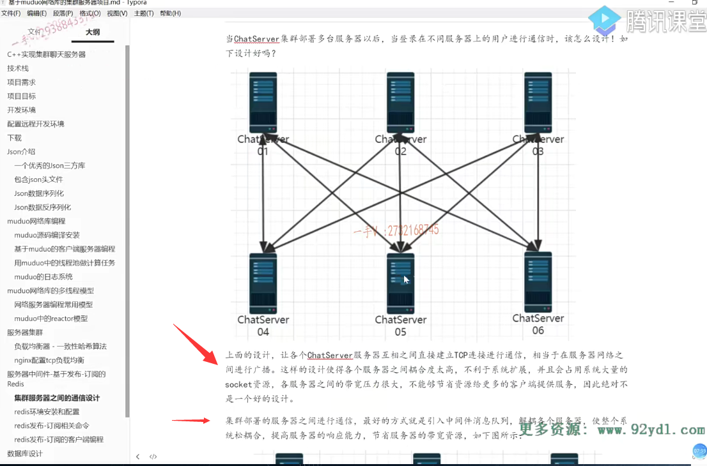

## 引入服务器中间件

那我们实际上在这个服务器在集群或者分布式服务器的这个部署过程当中啊，

如果我们要进行跨服务器通行的话，我们怎么办？

哎，我们一般呢，都会引入啊，服务器中间件，

### 服务器中间件设计的目的

服务器中间件啊，服务器中间件的消息队列啊，

实际上服务器的中间件，消息队列只是服务器中间件的一种。

服务器中间件还包含很多的设备好吧啊，那么服务器中间件你像在很多的大厂里边儿，你进去的话就有专门的服务器，中间件开发。是不是这么一个岗位呀？

==相关的项目组就是专门这个立足于开发服务器中间件设备。服务器中间件设备引入的这个初衷呢，==

==就是为了降低集群分布式环境当中啊，这个服务器在业务场景上设计的这个这个强偶合的这么一场景的==，

==为了降低服务器之间的偶合，为了把业务更简单化处理好吧。==

### 消息队列 中间件的作用

那么，集群部署的服务器之间进行通信，最好的方式就是引入中间件，服务器的中间件消息队列，接我各个服务器，使整个儿的系统轻松吻合，提高服务器的响应能力。节省服务器的带宽资源啊，

==那么每添加一台新服务器的话，你只需要跟这消息队列建立一个连接就行了，==

===你不需要跟其他服务器都建立连接。对不对？==

### 服务器只需要和消息队列建立联系

各个服务器根本就不需要知道。你每一个服务器只需要知道你在不在线就行了，

至于其他服务器有多少台，其他服务器你根本不用关心。

这种强耦合的，那也就是说每一台服务器都得必须知道其他任意服务器详细的是不是信息呀？

啊，像我这个图只是画了上边一行跟下边一行，

实际上你六台服务器将这一二三之间也要两两建立连接，四五六之间也要两两建立连接。

这个呢啊，太复杂了，

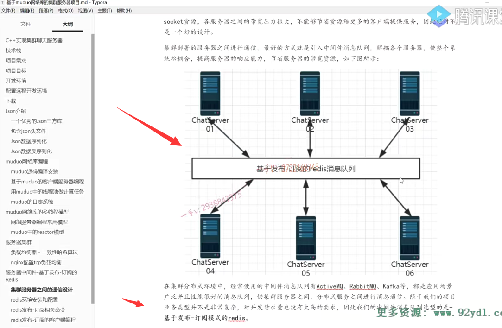

这个业务场景设计啊，我们在这里边采用的就是基于发布订阅模式的red is消息队列啊。

==redis呢，不仅仅可以作为消息队列，它的功能很强大，==

==它还可以作为基于键值对儿存储的缓存数据库啊。它是基于内存存储数据的，==

==但是它的数据呢，也是可以持久化到磁盘上的，==

==它是指这个aof跟rdb两种呢，数据持久化的方式啊。这些呢，应该都是red is里边考察的一些重点啊，大家也可以去去搜一搜，==

就是在面试的时候呢，red is的成本问题相应的去组织一下，

你不仅仅项目中用到了。用到了就可能被问到是吧啊，那你适时的准备一下，这是没有错儿的。

### 其他的中间件 kafka RabbitMQ

那在集群分布式环境中，经常使用的中间件，我们大家在这个公司里边开发应该最常用的就是这个卡夫卡了啊。

但是卡夫卡呢，是相当强大啊，相当相当强大，还支持呢，分布式部署，它是一个基于JAVA构建的一个分布式的，这么一个服务器。消息队列啊，

是非常强大的也是。功能不仅强的配置起来，应用起来呢，也相为相对来说，相对于这个redis来说，要稍微复杂一点。

### 选择redis作为消息队列中间件的原因

所以我们啊，在这个项目当中呢，我们就使用这个red is的呃，

red is啊，相对来说比较轻量级一点啊，简单一点对吧啊，

因为我们的这个业务场景最多也就是由单台的两万的用户扩展到三台的支持五六万的用户，是不是啊？

卡夫卡呢？应该是处理大型应用场景的十几万几十万的啊，这样的并发场景对吧？

==都是应用场景广泛且性能很好的消息队列提供这个集群服务器之间分布式服务之间进行一个消息，通信间偶合的不用各服务之间各集群机器之间进行两两强偶合的是不是这么一个通信啊？==

相于我们的项目业务类型啊，并不是非常复杂啊，

对于并发请求量也没有非常高的要求啊，几十万的并发量对吧，

所以我们的中间件消息队列选型是基于发布订阅的这个red is消息队列。

啊，好吧啊，我们在后边的时候呢，会给大家详细的去讲解呢。什么叫基于发布订阅的这么一消息队列，

再给大家去讲啊，为什么引入基于发布消发布订阅的这个redis消息队列的这么一个功能，

我们就可以跨服务器进行通信了。好吧啊呃。

那么，在这里边儿，既然这节课呢，主要的目的就是如何解决靠跨服务器通信，那么在这儿，

我先简单的去给大家来聊一聊啊。

那么也就是说呢啊，大家在这个后边儿呢，这块儿有一个什么呀，有一个消息队列啊，这个是基于发布订阅的。

## 画图讲下过程

消息队列我们当然使用的是red is，是不是啊？

那么，在这里边儿，大家注册在某台服务器登录成功以后呢啊，每一台服务器是不是都会跟这个消息队列进行连接啊？啊，连接一下就行了，

因为它要往消息队列里边儿去写数据，以及从队列里边儿拿数据。

那我chat server 1。每一次有用户在chat server 1登录成功以后呢啊，

那么chat server 1都要向消息队列里边去订阅一下，

订阅就跟我们要订报纸嘛，你订了报纸，人家报纸产生出来才能给你发送过来嘛，

是不是你没没订阅，人家给你发什么报纸呢啊，

我就在这订阅一下。在消息队列里边，如果有人给client1发送这消息，那你就给我上报一下，唉，我这个就拿到了，就是解决跨服务器通信的。

client 2在chats ever 2上登录的话呢？我chats ever 2在这个消息队列上订阅一下.

我对client2的消息感兴趣，

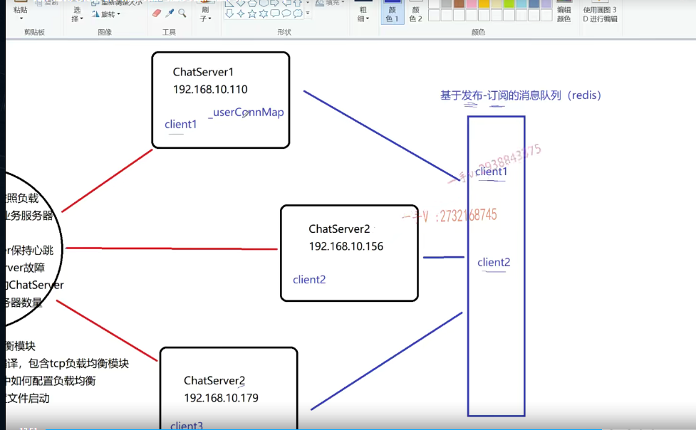

你看现在啊client1如果给client 2聊天的话。一看client2没有在这台服务器上，但是client2呢？是在线的状态，那就说明它在其他机器上的，是不是它在其他机器上？

那么它所在的那台机器肯定在消息队列里边订阅了client 2的消息事件啊，

所以在这里边呢publish我，publish一下消息就是这个聊天的json消息好吧，

放到这个消息队列里边是给谁的呀？是给client2的唉，

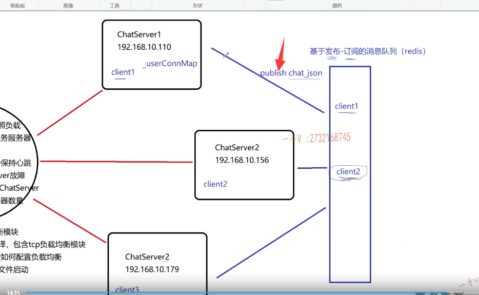

这块呢就能感应到了，因为它事先已经在消息队列里边啊，订阅过client2相关的聊天消息。

当我chat server1 把这个聊天的消息发布到消息队列里边啊，

消息队列就会通过这个给chat server 2啊 note ify一下你之前订阅过的消息呢？

就是你之前订了这个报纸啊啊，西安晚报是吧？唉，定西安晚报，西安晚报，

现在印出来了，发生了啊，我再给你把这个报纸给你递回来。

chat server 2呢，就知道了诶，现在有一个人要给client 2聊天儿，

那我就把这个聊天儿消息直接在这里边儿找见chats ever 2上找见和client 2通行用的connection，

把这个聊天消息转发跟client 2。对不对啊？

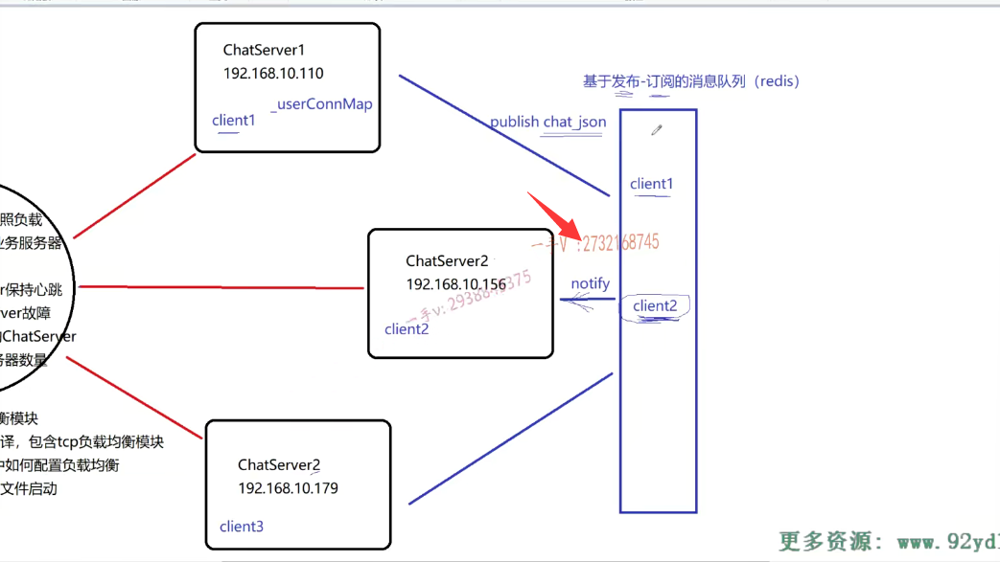

那也就是说呢，如果引入消息队列，除了消息队列是单独开发的一个代码模块的话。

我们现有的服务器只需要做的事情就是向消息队列订阅消息。发布消息订阅，我们一般叫做subscribe，subscribe订阅消息，发布消息。

是不是我可以订阅，我也可以发布？以及呢消息队列会主动的向我们的chat server进行一个通知。

就是这三种状态，发布消息，订阅消息。消息发生以后呢，发布订阅，主动进行通知。

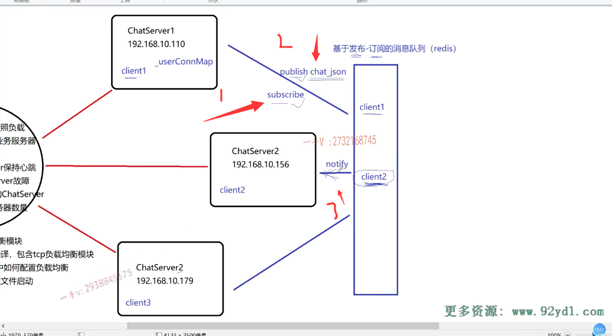

## 类似观察者模式

实际上，如果呢，你看过我的这个C++高级课程的话呢，我里边儿讲的这个观察者模式，

或者大家在线下听见我讲课，我给大家上课讲的这个观察者模式。

你在这里边应该是终于看到了一个观察者模式的一个应用场景。

### 消息队列是观察者，chatserver是监听者，然后监听者得向观察者注册感兴趣的事件，感觉类似于epoll

这里边儿谁是观察者呀？

这个消息队列是不是相当于观察者？他观察是不是事件的发生啊？

他观察到事件发生以后呢？

那它就会把对这个该事件感兴趣的。这个监听者是不把这些消息就推给这些监听者啊啊，

这些chat server一二三相当于就是这里边的监听者。

消息队列在这里边儿，相当于就是观察者啊，

==你让我给你推送消息，你得事先向我注册你对哪些消息感兴趣？对不对啊？==

这就是典型的这个观察者模式啊，

观察者模式的一个应用场景好的吧啊。

## 总结

好了，这就是呢，我们如何去解决集群服务器的这个跨服务器通信的这么一个问题的。

就是引入第三方的这么一个服务器中间件消息队列好吧，

通过呢向队列里边儿发布消息，订阅消息以及接收到啊消息，队列推送过来的消息来解决这个跨服务器的这个聊天儿通信，

而我们最终在代码上是都会实现的，看起来复杂，

实际上呢，是非常简单的啊，因为借助服务器中间件消息队列可以非常简单的让我们只有只支持单台聊天业务功能的服务器，

摇身一变马上就可以非常方便的部署，

在集群环境当中，而且能够正常的提供跨服务器的聊天业务，

不管是一对一聊天还是群聊是都可以支持的。

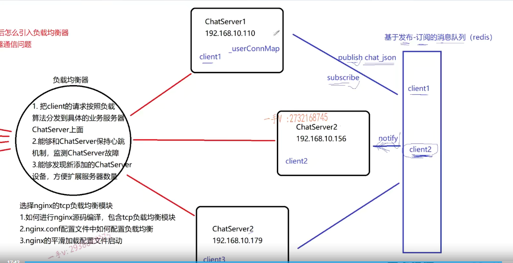

好，那么这节课我们这个这里边两个问题的，

第二个问题主题呢，我们就给大家讲完了啊，先从理论上来去讲一讲。

==具体的这个red is这个消息队列是怎么支持的呀？==

==怎么操作的代码上又是怎么实现的呀啊？=

我后边呢，会慢慢的一一给大家去。说明这些问题。

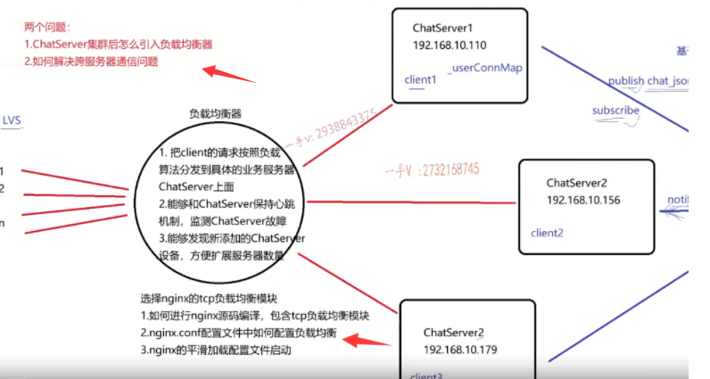

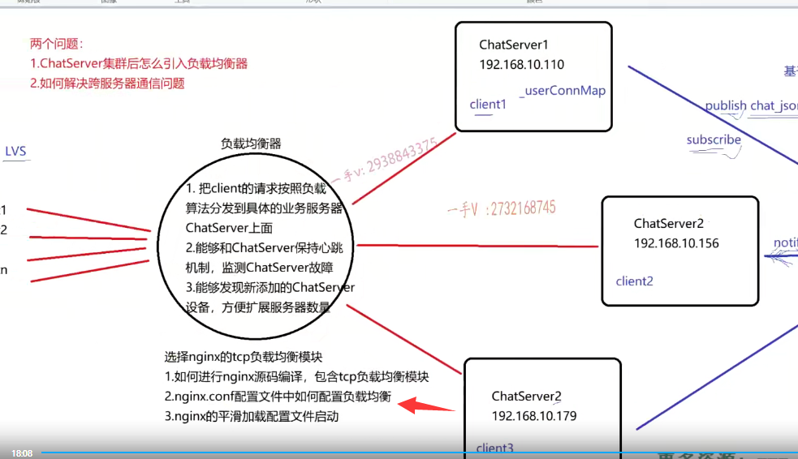