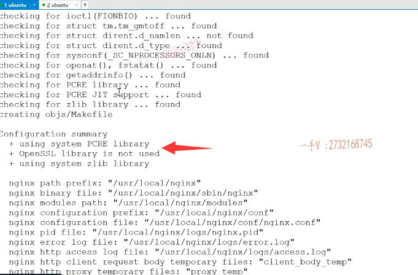
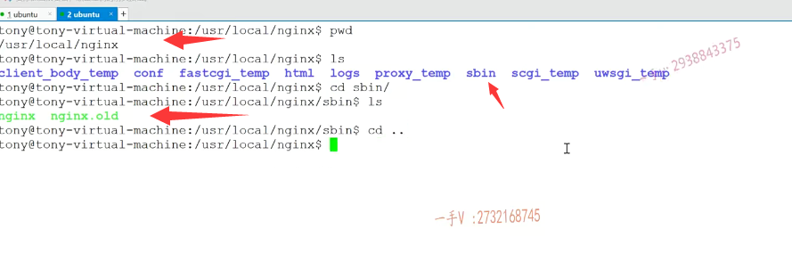
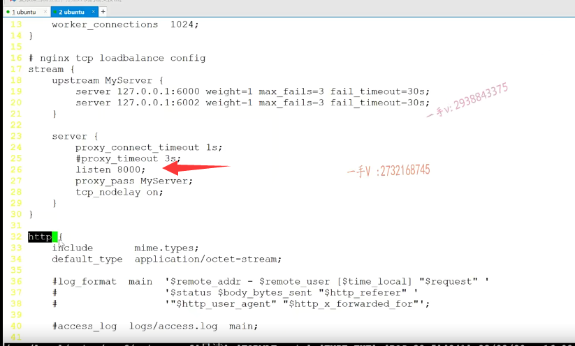

前面呢，我们给大家讲了这个负载均衡器应用在这个集群服务器当中啊，它起的这个作用，以及它需要做哪些事情，对吧啊？

嗯，这节课呢，我们就专门呢来在Linux系统环境下啊，给大家呢讲解一下nginx的一个负载均衡的配置以及我们配置了以后呢，

我们如何去用我们现有的这个聊天服务器和客户端去验证服务负载均衡器到底是否起了作用？对吧啊？

# nginx的一个负载均衡的配置

那么在这儿来，大家跟我看一下今天这节课，我们主要就是要解决这里边儿选择nginx的TCP负载均衡模块儿要做的三件事情。

首先呢，我们需要就是给大家在这里边做个简介啊，就是在集群的服务器搭建环境都需要迫切一个拿来即用的这个负载均衡器是不是啊？

那么在nginx一点九版本之前呢？nginx支持基于HTTP协议的外部服务器的负载均衡啊。

如果大家有了解过的话，那从它的一点儿九版本开始，以后呢nginx就开始支持基于TCP的啊，

就是它传输层的这个长连接的这个负载均衡。但是nginx默认的这个编译呢，并没有编译这个TCP负载均衡模块儿，

所以我们在源码编译的时候呢，需要加入这个杠杠v stream参数来激活这个模块儿啊。

那么nginx编译需要加入杠杠stream杠杠杠，with杠stream参数来激活TCP负载均衡模块儿。

你在视频下方相应的这个资料下载区下载资料以后呢，

你看你应该下载到我这个nginx杠一点儿一二点二点tr点tz。

你用tar杠zxvf对不对啊？来解压一下啊，敲回车解压一下，

解压完成以后呢，你就会得到这样的一个源码的这个目录。

然后进去进到这个地方。

你在linux上玩儿源码编译，永远都是先执行configure来生成相应的make file文件，

然后呢，再make最后再make in stop。是吧啊，先生成makefile，再make编译，再make install安装。

对吧啊，这是人家这个其他的这个厂商在发布这些。带有可执行程序的这些东西的时候呢的一个标准操作啊，

如果你安装什么memory catch啊？level event这些东西都是一模一样的啊。

所以呢，我们解压以后啊，进入这儿点杠configure杠杠with stream。

你就在这直接执行一下configure，就是当前程序下的程序下的这么一个文件。好不好啊？

这个文件呃，你运行你点杠它的时候呢，记着把这个杠杠为stream给它加上。

### 基于TCP的负载均衡模块也给它编译进来

OK吧啊，这加上以后呢？那给大家看一下效果吧啊。我这都已经配置好了啊，你看它就会在检测呢，相应的一些模块儿，这个的意思就是说呢把基于TCP的负载均衡模块呢，也给它编译进来啊。

nginx很强大的一点就是它可以进行功能模块儿的这个独立的开发啊，编译啊，

这个非常强大啊，你如果想去接触更多的话，你可以去看一下nginx的模块开发。

### nginx的编译需要一些库

这就包含进来了，那么你注意一下啊nginx的编译需要这个pcr e，还有这个open SSL zlab这些库啊，

你可以提前装。不提前装也无所谓，为什么呢？

因为你执行这个命令的时候，它就会在检测啊，编译环境所需要的一些库是否存在，如果没有的话。这个呢，直接会给你报错的，

不像我这样啊，不像我这样。这儿就没有任何的报错，没有error的字眼儿嘛，是不是报错就有error啊？

这都可以了。完成以后呢，你就可以放心的怎么样了？

### 然后去make编译 进入超级用户

去make，然后make install了啊，这也相当于把两个命令一起执行。

因为make install会向这个系统路径下去写东西，所以你在执行这个的时候啊，你都先进入超级用户下。先进入超级用户下啊，超级用户下就是linux的root用户下再去执行。

安装完成以后呢nginx就被默认安装在了user local nginx这个目录下了啊。

就是呢，那就是这儿就是configure。再加这个选项包含了TCP负载均衡模块，在 make install啊，记住在超级用户权限下执行啊。

然后呢，就在user local nginx，这就是nginx的这个目录了好吧

nginx呢，是一个服务器程序。那么，它的可执行文件就在s bin这个目录里边，

大家来看看大家所能用到的就是首先这个点杠nginx。

就可以执行nginx服务了好吧，

### 找到配置文件

那么在这儿注意啊nginx执行要加载配置文件的配置文件一般都在这个conf里边儿conf里边儿，

那你进入这个conf，它所用的这个配置文件就是nginx点conf，把这两个目录搞清楚，

一个是conf里边包含了nginx服务启动所需要加载的配置文件。

nginx点conf因为它的另外它的就是可执行文件，就是在sbin这个目录好吧啊，

这个你刚才这个源码呢make install以后呢，你就可以在user local nginx底下。找见了啊。

完了以后呢，我在这儿把nginx conf这个呢文件给大家打开。

这个文件里边儿本身就存在，本身就有这些内容啊，本身就有这些内容，

包括http的配置好吧啊。那么其他我们不看，那我们现在再来看一下啊。

这个它的这个配置文件中如何去配置负载均衡？大家来看看。

当你在源码编译nginx包含了杠杠with杠stream就是TCP负载均衡模块的话，你打开这个nginx点conf配置文件在这个events的下边儿，在http的上边儿啊，我们就统一写到这儿吧，你当然写到http下边儿也没有关系，

但是你不要写到http里边儿，因为这是两个完全平等的独立的负载均衡配置诶，

基于http WEB服务器的负载均衡就在http。

## 基于TCP的负载均衡的配置信息

哎，这个里边配置，现在我们是独立的配置，你写个stream。对吧啊，这就是在配置呢什么呀？基于TCP的负载均衡的配置信息啊，

### nginx会监听的一个端口号

首先写这个server。啊server proxy connected timeout这个我们先不管，

最重要的就是先写listen，listen八零零零。

这个就是什么呀？这个就是nginx会监听的一个端口号儿。nginx会监听的一个端口号啊，就是说呢，你所有的客户端你都在这里边儿去连接这个这儿指定的这个八零零零端口号就行了。你所有客户端发过来的请求。

对吧，在配置文件中，人家就写好了，你都连8000端口，我在就是你们发的请求，如果在我8000端口上，我感应到的话，我就用相应的，

我就知道啊，你在这里边儿啊。要让我完成一个反向代理的操作，也就是负载均均衡的操作，对吧？

那我就按照既定的这个配置好的负载算法呢？把这些请求分发到不同的这个服务器上啊。

### proxy pass my server 这就是一个标记

那么，在这里边儿再注意啊proxy pass my server，这也相当于就是一个标记啊这个。

呃，不需要呃太深的理解啊，这就是这就是一个标记，那么server里边儿最重要的两个就是必不可少的两个。

==就这两个，一个是listen，就是表示我这负载均衡器是监听在哪个端口上的，==

==另外一个就是所有连这相当于就是所有连接到8000端口上的请求啊，都往这个my server的信息里边儿，进行负载均衡。==

my server这个名字的upstream upstream就是它的负载均衡模块儿啊，

这个名字的负载均衡模块儿里边儿包含了几台机器呢？包含了两台。

这server就是起始的呃，就是一个服务器名称，这个名字不能随便写啊，然后就是服务器的IP地址跟端口号。

我这儿相当于写了两台服务器的IP地址的端口号儿，

就是我的 chat server，一是运行在本地的6000端口chat server，二是运行在本地的6002端口。

### weight是权重，主要代表负载均衡算法

weight=1 weight，这是权重的意思啊，

就是我们之前给大家说了嘛，负载均衡，是不是要按照配置的既定的配置的一个负载算法进行请求的一个分发的分发到具体的服务器，对吧？

这个weight1就是权重的意思啊，这两个服务器的权重都是一，那也就意味着这相当于就是一个轮巡的过程了啊。来上十个客户端请求，那就是轮着往你配置好的，这两台轮着发送。

啊，每一个发一个，每一个发转转着圈儿发是不是啊？

### 如果是配置1和2的话

如果在这里边儿啊，你看底下这个，如果是二的话，也就上边儿这台服务器是一底下这个是二的话呢？

那也就是说来三个请求，其中有一个分发到第一台服务器，其中有两个分发到第二台服务器了。

### 根据不同的服务器配置  可以改权重

那我们就可以呢把，就是不同配置的服务器呢，给它放在集群环境中配置强的。服务器我们可以给它配置的权重大一点啊，这个。

服务器整个儿的硬件性能差的，我们是不是给它配权重比低一点啊？

### 心跳机制的最大次数

对这后边儿max fields。啊max fields，这些东西就是在完成什么完成我们这里边儿说的第二个能够和chats ever保持心跳机制，监测chats ever的故障啊。也就是说呢，它在这里边儿连接的时候呢，会保持一个会自动的跟服务器，保持一个心跳好不好啊？

如果心跳啊，超过三次。是不是唉，超过三次都是失败了，那么就判定这个服务器就挂掉了。好不好啊？

### 心跳机制的最大响应时间

那每一次呢？feel all time out就是每一次我就发一心跳，我等你给我响应。是不是啊？

想用多长时间在这里边算通讯失败呢，响应就是你这配置的30秒。

没问题吧？

### 再添加新的服务器，那你只需要把它的配置文件打你并不需要停止nginx的服务

哎，这个啊，服务器信息后边儿这一块儿呢，做的事情就是有nginx TCP负载均衡模块儿呢，专门来可以帮你监测啊。服务器的运行的一个状况啊，这块儿我们就不用自己实现了。

是的吧啊，如果再添加新的服务器，那你只需要把它的配置文件打你并不需要停止nginx的服务啊，只需要把它配置文件打开，把你所有添加的服务器信息再写到这一行的后边儿，再往后写呗，一个server固定的名字别改，

然后是你服务器运行的IP地址端口号儿。

然后呢？就是它的一个权重比后边儿呢？

你根据实际情况进行一个配置，那或者是跟前面配置一样也行。

# 总结

### 负载均衡的源码编译

没问题吧，好来看一下课件啊，这里边呢，我就给大家主要的说的这几个你看。

首先是在这里边，我们再强调一下啊，负载均衡源码编译。

上边儿罗列了，

刚给大家说了配置这个信息upstream跟events跟http这些标签是同等的啊，

不在谁里边儿被包含它是独立的stream大括号，

里边儿是先配置server。

server也就是说里边配置的listen。八零零零啊，

### proxy timeout 我们是长连接，不需要啊

这个proxy timeout就不要配置啊，

proxy timeout在这里边儿是属于一个什么情况呢？就是相当于nginx只是和它的这个后端的这个proxy啊，就是只是和它后端的chat server连接三秒，连接三秒以后就断开了，我们不需要这个。

这是我在做我其他业务的时候呢，我配置的这个东西啊啊，大家不需要配置这个好吧？

### proxy connected timeout也不需要

proxy connected timeout，这是什么意思呢？就是你nginx不是在这里边配置的，后台的chat server nginx不是得连接它们吗？对吧啊？

那第一次连接的时候呢，发现超过一秒的时间还没有握手成功呢，就判定它连接失败了啊，就这意思，

第二个proxy timeout就是连接三秒钟就断开了好吧，

### 最需要做的就是listen配置，和服务器配置

我们这是聊天儿服务器常连接服务器，所以不需要断开，不需要这个啊。

你server里边儿需要配置的两个后边儿TCP no delay，这是配置一些TCP的参数啊，

==你最需要配置两个就是listen 8000，意思就是说呢，让客户端都往8000端口这儿发送数据。==

8000端口这儿可以给你负载均衡是吧？

==往哪儿负载均衡呢？往my server。这个负载均衡配置里边儿进行负载均衡啊。==

### hash remote_addr consistent 负载算法

这个呢，remote addr consistent这是另外的一种什么东西啊？

==基于哈希的这么一种负载算法啊，这个是需要单独安装插件的OK吧？==

==嗯，大家呢，就直接配置后边儿两个就行了啊。==

sever IP地址，端口IP地址，端口啊，weight=1，weight=1，这就是权重的意思。好吧啊

好在这里边儿就配置了，

### 平滑加载启动

那么如果你要新添加机器，在这儿加上呢？后台的chats ever的配置信息，然后杠n- 4杠s。reload

就可以在这里边说的平滑加载启动。呃，重新加载配置文件启动这个呃，启动连接连接你新添加的服务器，就在不影响原来业务的情况下。好的吧啊，这个配置就是这个样子的，你参考我这儿进行配置啊。

那么，你启动的时候呢？

就是CD SB。啊，然后就点杠nginx就可以了。是不是啊？

那大家来看一看啊。你启动以后呢？

那你用命令查看一下，你看这是我my的服务器启动了nginx，有没有启动呢？

大家来看一看。这nginx好像是不是我并没有启动啊？啊n解并没有启动

这是其他的这个服务启动了。

## 启动nginx

### nginx默认工作在80端口，但是Tcp 负载均衡功能是在8000

好，那我就启动一下nginx。啊，现在呢？是不是就启动了？

这是他的master进程。

啊，它默认工作在八零端口，因为它本身是一个http服务器，

但是你不要请求它的八零端口，那八零端口是回复一个主页面。

我们是想用它的什么功能啊？TCP负载均衡功能好吧，所以呢，我们客户端应该连接的是哪个端口啊？就是它在这里边儿，

你在这里边儿配置的。监听负载端，这个负载均衡的这个信息的这个端口就是8000。

好吧啊。好了，那在这里边。我们就说完了，

首先呢，nginx源码的编译包含TCP负载均衡模块儿，这个我说了啊。

然后呢？就是nginx的这个点conf配置文件如何配置？基于TCP的负载均衡，我说了。

nginx平滑加载这个配新增的这个配置文件里边儿配置项，我也说了。

### 重新加载命令

nginx杠s reload是不是就可以加载了？啊，相当于就是这个。杠nginx杠s reload啊，

### 关闭nginx

你这要你要想停止nginx，你可不要看一下nginx的进程号是个四幺五二来发个q杠九四幺五二。

因为它nginx呢，人家有这个嗯进程这个容错机制啊，当提供服务的进程挂掉的话，人家还会自动重启的。

所以你感觉怎么杀也杀不完，杀一个起来一个杀一个起来一个啊。

那么你直接你想关闭它的话，直接就是stop就行了。

okay吧啊，stop就可以了。杠s stop这里边有，都给大家写到这里了好吧？

好，确定了n阶次进程正常运行以后，那在这儿大家来跟我看一看啊。

我们怎么验证呢？我们先来到我们的服务器上，这bin，那这个是先执行chat server。这个幺二七点零点零点一，我把chat server这儿给修改了一下啊，修改了一下。

就是它的这个IP地址跟端口号呢？也不是手写的了，通过命令行参数传进来，

因为我现在要部署多个是不是服务器啊？唉，这个应该都是问题不大的。

刚才在这个负载均衡里边儿，我们配置的时候啊。

刚才我们配置的时候，大家看到了吧？

我们配置的其中之一是工作在6000端口啊？

那另外一个的是工作在哪个端口呢？幺二七点零点零点一六零零二是不是6002这个端口啊？

来我们再确认一下吧啊，

各位就是user。local nj x是conf。这个nginx。

你看看。在这里边儿，我们配置的两台服务器的信息是不是本地的6000多个，跟本地的6002端口啊？

### 配置好的服务器会自动去连nginx，但是客户端我们是需要去连nginx8000端口

唉。你这样子。

启动，在相应的端口上IP地址端口上启动这个chats ever的话nginx就会去自动去连的。

啊，就会自动去连，但我们现在作为客户端，我们去连接这个端口嘛，

我们肯定是不会直接连服务器的端口了，我们连的是谁呀？

我们连的是负载均衡配置的8000，就是我们连接的其实就是nginx，由nginx给我们按相同的权重比，那就是轮询分把请求分发到是不是这两台服务器上啊？

好，那我们来看一看各位。

在这儿我是CD啊。应该是code呃，是project就是我们当前这个项目bin。那在这里边，这是一个客户端。这也是一个客户端。这个是chat.

并啊。这是chat client幺二七点零点零点一，这也是默认的，都连谁啊都连负载均衡器是不是8000啊？

==这个能理解吧，我没有连这里边儿的6000也没有连6002，==

==因为现在chat server是集群的。==

==啊，不可能让用户去选择连接哪一台chat server，我们连接的就是负载均衡器。==

### 登录 发现服务器1响应了客户端连接

这个登录成功了，连接也成功了，是不是我们来看一看谁响应了哦？

是幺二七点零点零点一六千响应了，也就是说呢，

我们现在这个请求啊。实际上，先发给ngx nginx呢，按照这个配置，

按照这个我们负载均衡的配置来把这个第一个请求是不是转到这台服务器上了？

### 再测试第二台client连接

啊，按道理下一个请求，因为权重比相同，下一个请求呢，应该就转到第二台，是不是服务器上啊？

好，那这一台我们。来连点杠chat client幺二七点零点零点一连接哪个端口哪个。8000都是连接nginx的。

这可是也成功了，是不是我们来看一下诶？

这回哪个响应了？你看这回呢？6000这个端口儿没有响应，

6002这个端口儿响应了，有一个new connection连接过来了。

哎，这也就是说呢，我们nginx确实是。把我们现在客户端的这个请求通过我们配置的基于相同权重比的，

也就是轮询的这种负载算法呢，把它发给谁了诶？把它转发给相应的这个服务器了。okay了吧啊，

### 测试登录业务

那这个不影响我们做任何的业务啊。幺三。

我照样能登录成功的，是不是唉二幺一二三四五六这是不是都能够登录成功啊？

它是分别在这两台服务器上进行一个响应的。好的吧啊okay，

那这个测试呢，我们就完成了。负载均衡环境的测试，我们就完成了啊，

## 总结

希望大家听完这节课也跟我一样啊，

首先呢，先下载相应的这个nginx源码包。进行一个nginx的源码编译啊，

编译以后呢，先别着急启动，它先在配置文件里边儿添加一下啊，基于TCP的这个负载均衡。

好吧啊，添加一个负载均衡配置。

那然后就像我一样，你可以在VS这里边儿先打开两台服务器，

先启动服务器运行在你在nginx负载均衡，这里边配置的服务器的IP地址端口。

好吧，因为我们现在个人开发就只有一台linux虚拟机，

那我就都写在幺二七点零点零点一，就是当前系统下的。不同端口号儿上了好吧啊，

那在这儿分别启动。是不是啊，分别启动了以后呢？

然后你再启动客户端，那你记住你启动客户端不要直接连你的服务器。

而你的客户端是不知道服务器在哪儿的，我们只知道谁啊，我们只知道负载均衡器就是客户端连的都是8000。

然后呢，整个儿基于我们之前给大家画的这个图负载均衡呢，就能够正常工作了，我们可以看到这里边儿可以进行正常的一个。登录操作。

### 那聊天儿现在肯定是不是没法聊 你俩登在不同的主机上，那就有不同的connection map

那聊天儿现在肯定是不是没法聊的啊，因为他们俩就他们俩都不在一台服务器上，是不是登录啊？

这肯定是啊，互相都认为对方不在线，对吧啊，

因为我们的这个程序呢，在每一台进程里边都存了一个connection map，你俩登在不同的主机上，

那就有不同的，是不是connection map啊？

在我的connection map里边儿，肯定找不到你的connection啊，相反也是一样的。

好吧啊。

## 最后总结

行，那么这节课的宗旨就是把nginx的这个源码编译啊tcp的负载均衡，模块儿的配置搞清楚。

然后呢，根据我们前面儿写的聊天儿的客户端跟服务器能够像我这样做一个测试，

你也可以起三台这个聊天儿服务器啊。

然后呢？起几个客户端？都登录这个都连直都直接连接负载均衡器，

看我们的nginx TCP负载均衡是否能为你进行一个正常的啊，负载工作好吧，

那这节课的主要内容就给大家讲到这里。