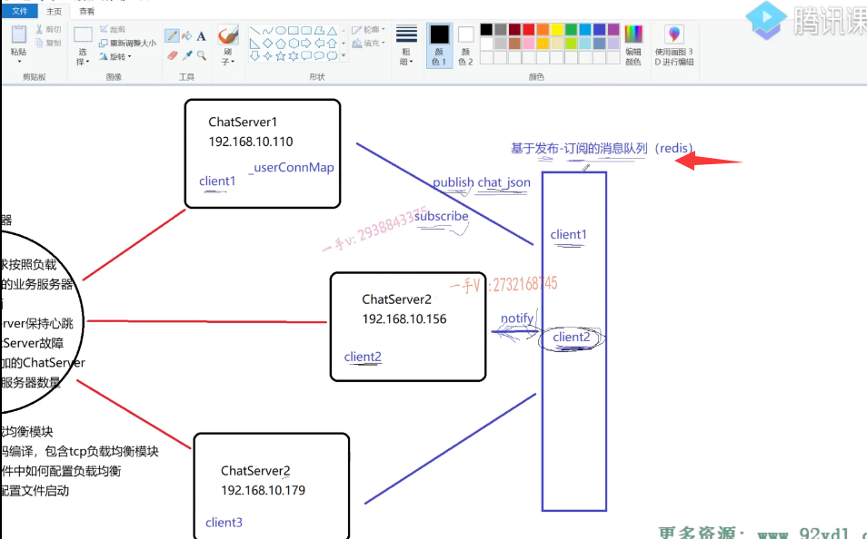
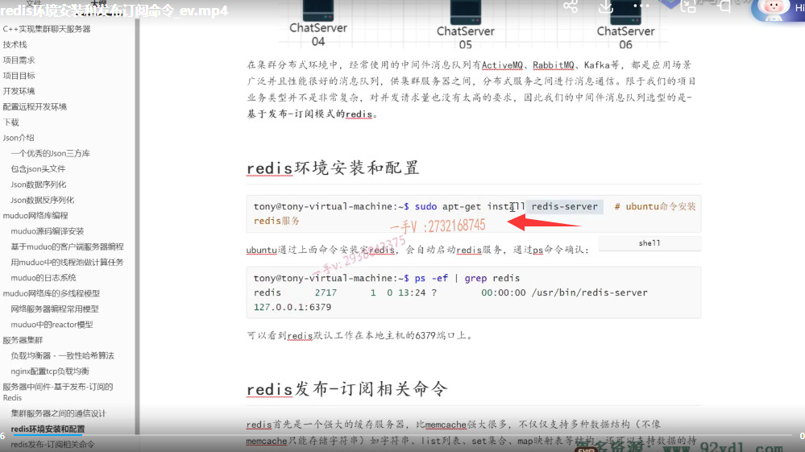
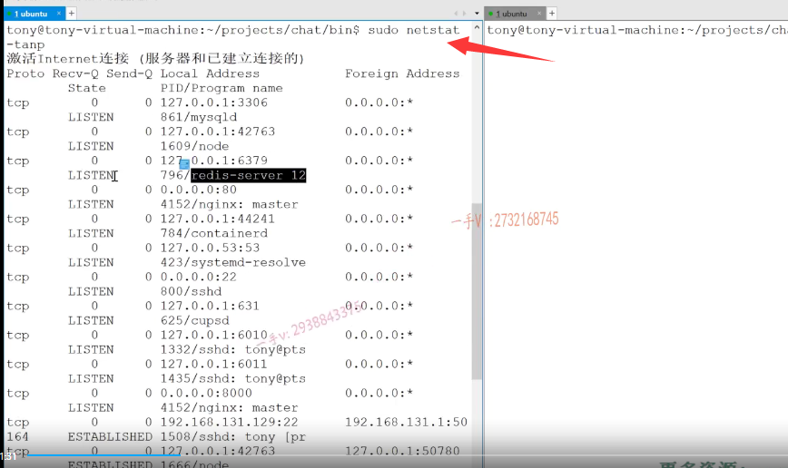
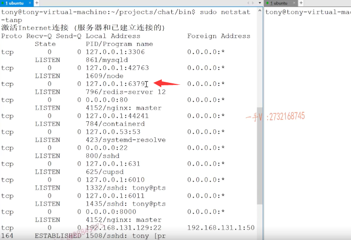
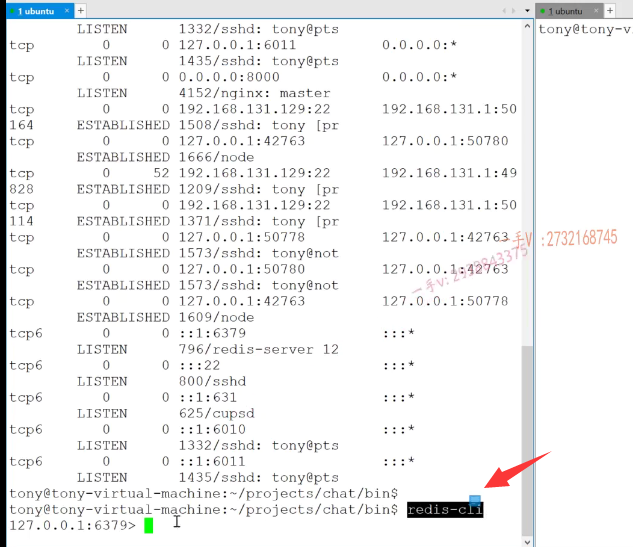
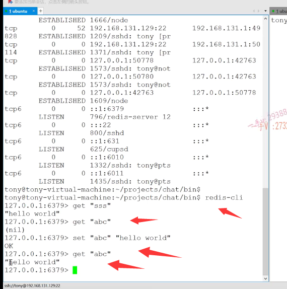
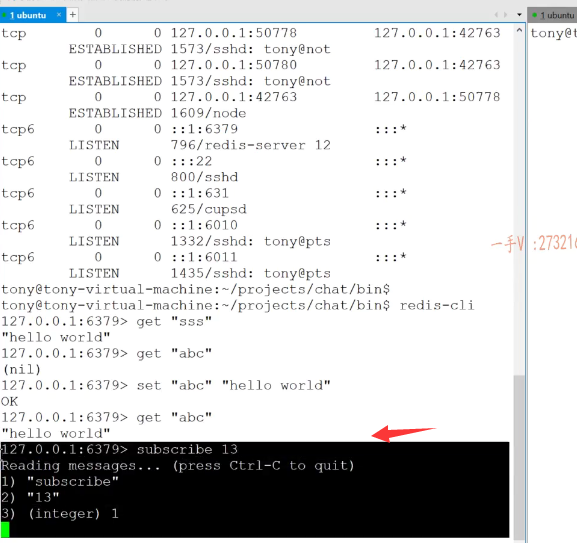
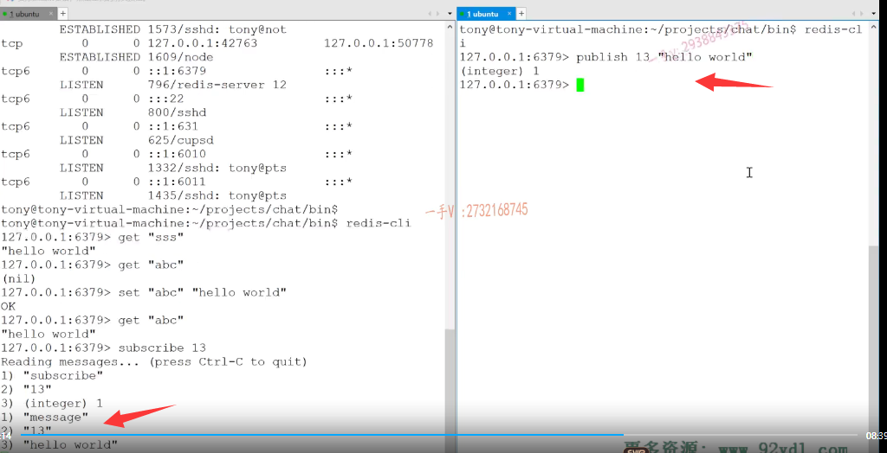
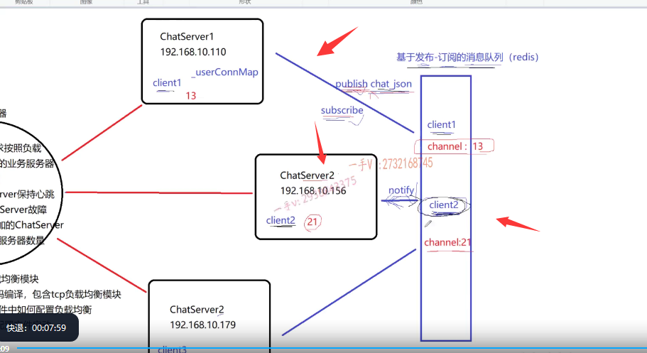

### redis作为 中间件 消息队列 解耦服务器之间硬连接

这节课我们给大家说一下，这个redis啊，

redis的话呢，在我的这个项目当中呢，是作为聊天服务器的服务器中间键消息队列用的啊。

来解偶各个服务器之间硬连接的这么一种设计方案，

在我们的这个实践的这个项目中啊，应用是非常非常广泛的。对吧啊，

那么这节课呢，我们就先不进行编码啊，

先从这个redis的环境搭建上常用命令上以及它的这个发布订阅以及它本质是一个存储键值对儿的一个缓存数据库上啊，我们来先对redis进行一个认识啊。

### redis的安装

首先呢，大家需要去安装redis server，

如果你用ubuntu的话，那一句命令就安装好了，它会从远程的这个镜像啊帮你把这个redis的server，

还有自带的一个redis client啊，客户端全部给你安装好了啊，安装好了。

如果呢，你不是ubuntu的话，那你在网上啊，多的很，你在网上去这个直接搜一下redis的这个安装啊Linux系统redis的安装。

那么你可以下载源码，包源码安装，你也可以下载人家编译好以后的可执行文件，对吧啊？

你直接运行它的服务就行了。

那么，运行以后啊，运行以后你可以去查看一下嗯，就像这个。

你同样的可以用net state这个命令来查看一下啊，看一下这个redis server，

==redis server正常啊，listen监听在哪个端口啊？监听在这个六三七九==

像数据库三三零六对吧啊，它是六三七九这些呢，都有自己默认的一些端口啊，

当然你可以通过修改它的配置文件可以改的啊redis server，

我们为求简单一点，它的配置文件我们就不介绍了好吧啊，六三七九这个。

### redis client 登录服务器

检测redis server的服务啊，运行正常以后呢，在这里边儿大家来跟我看一看啊。

那么你安装完以后，它会自带一个redis client啊，相当于一个客户端程序，

这里边你如果保证redis server啊，运行正常的话呢，这个redis client呢？啊，也就能够正常的去登录这个redis server了。

### redis 的set get命令

好吧啊，这块儿呢，大家来看一看啊get我们给大家说了，

这里边儿是存什么存这个键值对儿的啊？

哎，在这里边，这是我之前放的这个键跟值啊，重来一个你，

比如说ABC呃，这个键不存在过，是不是啊

set？ABC给它呢，再放一个对应的值hello word是不是啊？OK，

那这个存好了以后我们再get ABC就是什么？就是hello。对不对啊？就是hello world。

这个键对应的值呢，相当于就是存储成功了，

这就是它最简单的啊，这是键值对儿存这个字符串也行，存整数也可以啊。

redis呢，不仅仅可以存键值对儿，人家还可以直接存这个数组链表，还有集合。还有映射表啊，这些复杂的数据结构呢，人家都是可以直接存的。

很多应用呢，为了这个提高啊效率，直接舍弃呢，这个像mysql这样的。

嗯，数据库而直接用缓存数据库，像redis。做这个数据存储啊，因为它毕竟呢，数据还是在内存上存的，是不是啊？

内存上存的它的效率是非常高的。

它也可以进行数据持久化存储，你也不需要担心redis server重启以后呢？数据找不着了，人家有这个rdb跟aof两种数据持久化存储的这方式啊，

那么。你有兴趣的话，可以了解一下，在这我主要来介绍一下基于这个发布订阅啊的一个消息队列，redis的这么一个功能。

## 基于这个发布订阅的一个消息队列

这个我之前给大家也说了啊，

### 订阅消息

你比如说呢，这是我们的张三。就是13

我们现在的一个张3 ，client2 是21。相当于是什么呀？

各位，我们c1啊，就是张三登录chat server 1以后呢？

chat server 1需要在这里边儿注册一个什么？就是subscribe订阅一个通道，就是呢，我对13号就是拿这个用户ID啊，

我对13号这个通道上发生的消息是非常感兴趣的。要是有消息了，麻烦你redis给我上报一下，你在这个通道上所接收到的消息对吧？

chat server 2呢是？是你一看有一个新用户，21就是高阳登录上来了，

那么他会呢，在这里边就是一个21。

唉，就是这么一个21。啊，对，21号这个通道呢，我感兴趣是不是？

唉，要是呢，21这个通道上有消息发生的话呢，麻烦你这个redis呢，给我chats ever 2是不是上报一下啊？

对的吧啊，就这意思。

这里边主要涉及的命令就是发布消息，

### 订阅消息 subsribe channel 它是一个阻塞的方式

订阅消息，订阅就是订阅通道上的某个消息啊subscribe。

subscribe你看后边是不是就channel啊？

你可以一次订阅多个channel

==是不是这对13这个channel感兴趣，你看它是一个阻塞的方式==

啊，这一点是必须要了解的，

我们到时候呢，在代码上编写啊，连接操作redis server的时候，

我们实际上也就是在客户端上做。

作为客户端发送这些命令，过去的啊，其他命令呢，你执行完都会有一个响应，

而subscribe订阅通道，这是一直阻塞等待redis，是不是给它上报信息呀啊？大家注意一下啊，注意一下，

### 测试客户端发送消息   发布消息

在这儿呢，我再执行一个rediscli。

呃，我这儿呢Bob lish我向13这个通道，我发送一个消息hello world。

你看这个通道上有没有收到消息啊？有message。

有三个相当于是一个数组一样的。是不是相当于是个数组一样的，第一个是message，第二个是通道号，第三个就是这个通道上发生的这个数据。

没问题吧啊。你可以继续继续。是吧，那这个相当于在这里边，我们跟我们的业务联想一下啊，就是说呢嗯，

### 业务上redis的流程

首先。用户登录成功以后相应的。服务器呢chat server需要向redis上啊，根据用户的ID是不是去subscribe一下，去订阅一下，

以用户的ID号为通道号的是不是这么一个通道的消息啊？

嗯，然后呢这是第一件要做的事情，

第二件就是当这个服务器上需要有一个用户要给另外一个人发送消息的话啊，

但是发现这个用户呢，却没有在这台服务器上，是在其他服务器上。

那么就要向这个通道里边publish发布消息了。是不是发布消息了啊？发布消息了，

因为它肯定在其他服务器上，它在chat server 2上，chat server 2肯定在redis里边，以它的用户ID作为通道ID。订阅过相应的通道事件消息呀啊，

那么。如果13给21讲话的话呢，这里边publish就往21这个通道上publish一个讲话的json字符串，

那么这块儿呢，redis发现通道21有消息发生了，就会给chat server 2来返回，你有消息发生了处理吧，对不对啊？

## 总结

就是这么一个过程。

大家先把它的这个原理搞清楚一下。好的吧啊。

那么redis server的这个环境搭建以及基本的它们的一个命令的一个操作啊，还有尤其是订阅以及订阅通道号以及发布消息啊，它的这么一个原理。

大家把这个搞清楚就可以了啊，

你就像我这样去测试测试好吧啊，

这节课redis的这么一个命令的一个讲解环境的搭建，我们就先给大家说到这里。