这节课呢，我们给大家主要把redis的客户端编程这一块儿呢，给大家讲一下啊呃，

同样redis呢，支持不同的客户端编程语言，因为我们总是要在代码上去和redis server是不是进行一个通信的啊，

例如那JAVA对应的js php对应的PHP redis跟

c++，这里边对应的是一个hi reds啊，那么hi reds呢，是一个开源的，这个在git HUB上直接可以获取到啊，

大家可以去这个地址上直接下载它的这个压缩包啊，

如果你本地呢有git环境的话呢，你直接可以get ，inux环境的话呢，现在git已经成这个出厂安装的了啊，

所以git命令是肯定有的，你可以向着git克隆后边加这地址，你直接可以把源码拉下来，还是一个源码的这个安装啊，

拉下来以后你直接make。进入这个hiredis的文件夹，直接make啊，直接编译对吧，

然后makefile都已经写好了啊，

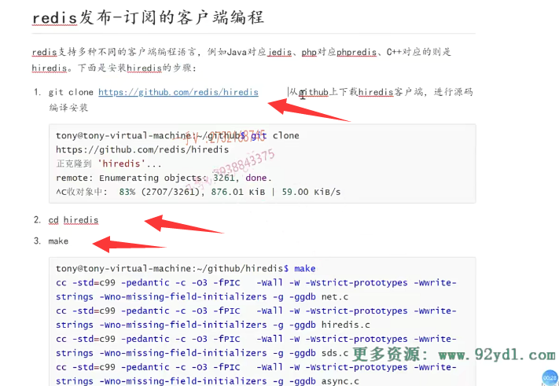

写好了以后呢，你速度make install再操作一下，

因为它需要向系统路径底下呢去拷贝一些文件。啊，相当于也就是说源码拉下来，

不管你是进这个git HUB主页，直接下载源代码还是说呢？

在这里边儿，你通过get克隆从这个指定的地址上把代码拉到本地啊，

进入这个hiredis的文件夹make make install就完了。okay吧。

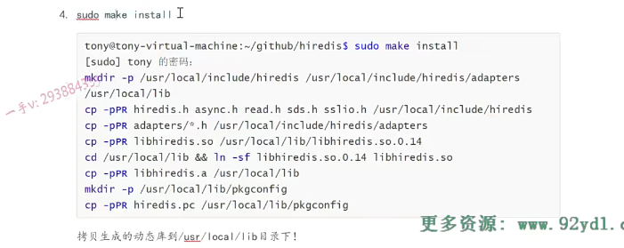

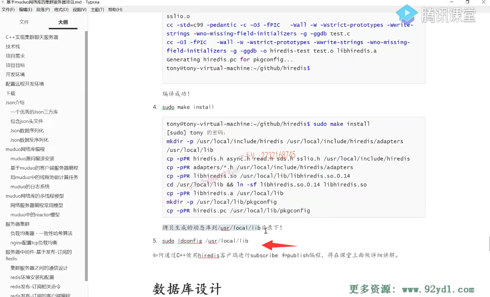

### 最重要的是从理解的方面

那具体的编码上该怎么写呢？对不对啊？

大家来跟我看，这就是我们这节课要给大家讲解的一个重点。

对于这个redis这一块儿的代码操作，我觉得大家最重要的是从理解的方面啊，从理解的方面好好把握一下，是不是啊？

嗯，实际上呢，这个项目来说呢，属于一个中型的项目啊，对于对于大家平常做的项目来说，不是说呢，项目中的每一行话，每一个字儿，甚至每一个字符你都得手敲出来是不是啊？

那么基础的业务，比如之前呢？我们是一行一行写的，那到后边儿呢？我们应用到集群。

甚至后边儿呢，我还会给大家去更新一些分布式rpc相关的项目的话呢，那在这里边儿很多东西呢？

重在理解，重在理解好吧啊，实际上你要写的话，你也可以跟着去写一下，不复杂的，

==你要只要把它的逻辑理解清楚，它是干什么用的？对不对啊？我先知道它要做什么用，==

然后我再看它，我应该是理解起来就好理解了，你都不知道人家怎么用？

==你是想通过看代码了解它的一个应用场景，那就本末倒置了好吧啊。==

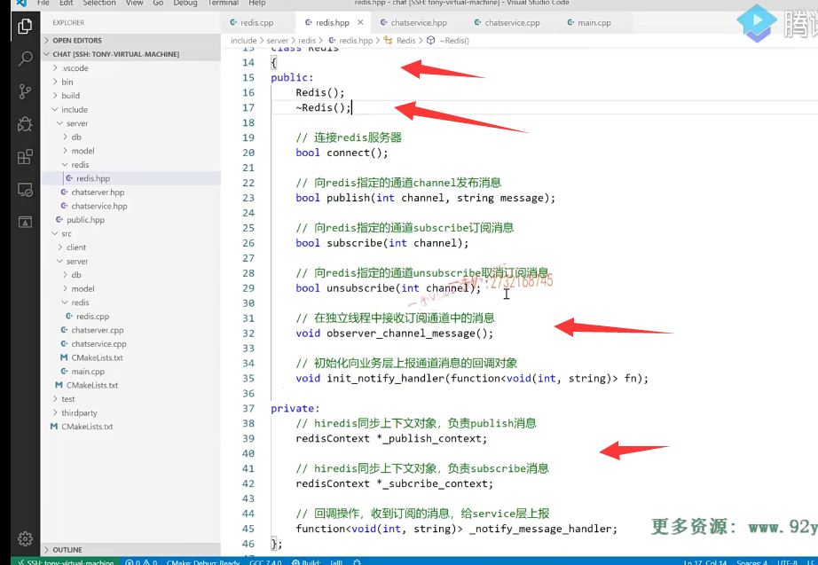

### redis的功能

在这里边redis我们要用它干什么？我想它给我提供什么样的功能，

那在这里边很明显通过我们在这里边画的这个网络环境啊。

那也就是说呢，

==我客户端需要连接redis server，我要能向它注册消息，订阅通道。能向通道里边儿发布消息，而且还能取消我所订阅的这个通道。是不是也就是这四种功能啊啊？==

==当然还有一个就是redis你接收到这个通道里边有消息的话，还要是不是给我上报这个消息啊啊，==

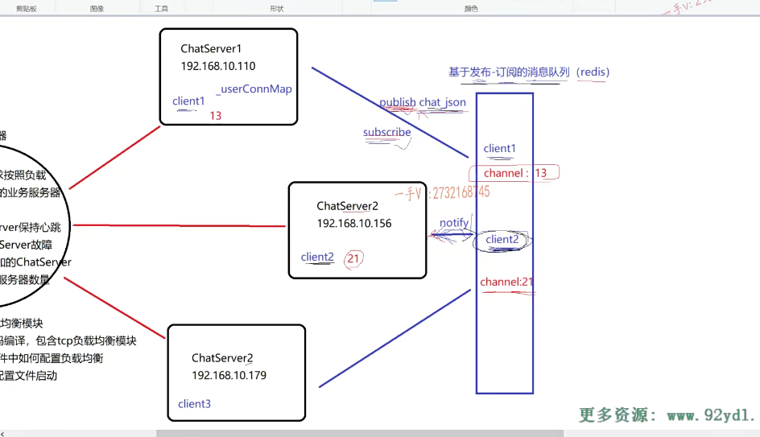

### 上报这个消息就是回调

给我服务器上报这个消息，所谓的上报就是我们之前给大家讲的观察者模式，

你需要事先是不是向我注册一个回调啊？

当这个通道上有消息发生的时候，我才能给你回调啊，

回调相当于就是通知你，你感兴趣的通道的消息发生了。是不是啊？

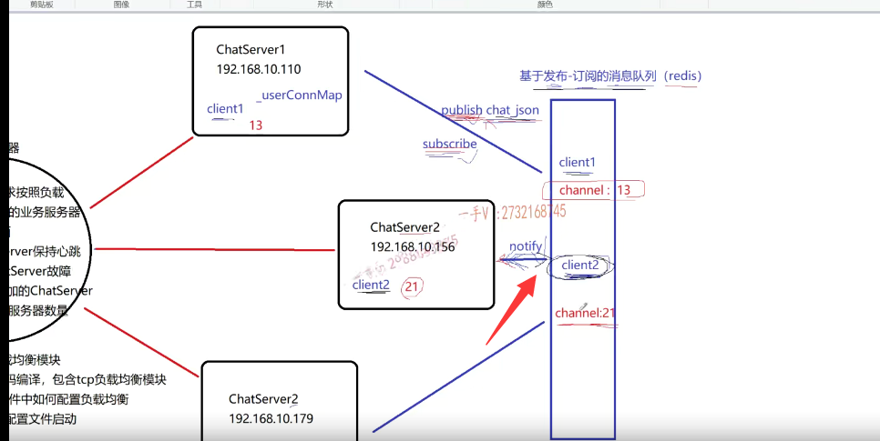

## 添加reids文件夹在头和源文件中   并且修改cmakelists

好大家来看啊，在这里边儿，

首先呢，我在我们源代码上呢include啊include这个文件夹里边儿s ever上添加了一个redis文件夹。里边儿放了一个redis点hpp，

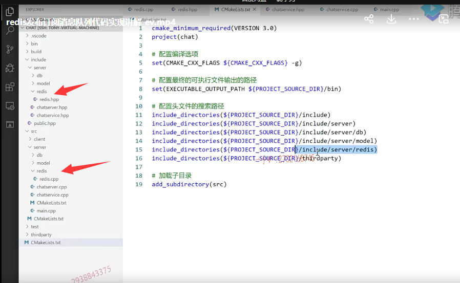

### 最外层cmakelists编写

当然在我们外边儿的这个呃，最外边儿的这个cmake makelist里边儿呢，

就要去添加这个头文件搜索路径啊？

include server redis。

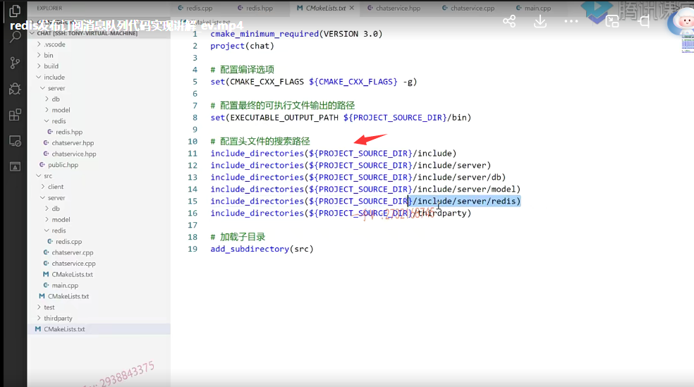

### src下的cmakelists编写，不是与src同级的cmakelists

没问题吧，相应的，我在src，这是原文件server底下redis，这里边有一个cpp同样的，

那在这里边呢，相应的，我是不是就得添加一个？

哎，点杠当前目录下的这个redis文件夹下所有的这个源文件是不是名字都定义到这个变量redis list里边了。

那么，这个源文件。也要参与到编译我chats ever是不是这个文件列表当中啊没问题啊，

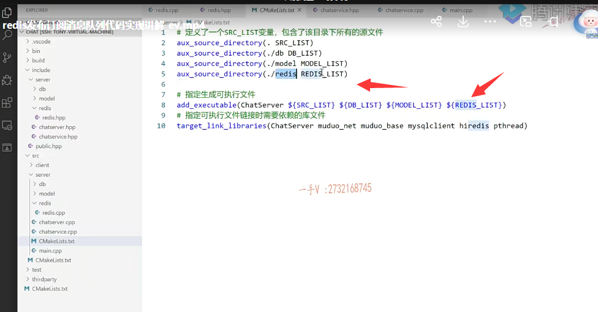

### 包含了杠l hiredis这个so库

当然我们要连接这个，我们要连接操作这个redis，

我们还得包含了杠l hiredis这个so库。

因为我们在安装它的，这个客户端的时候呢hiredis，它相当于也都是编程so库给，

我们拷贝到呢，相应的user local lib下了

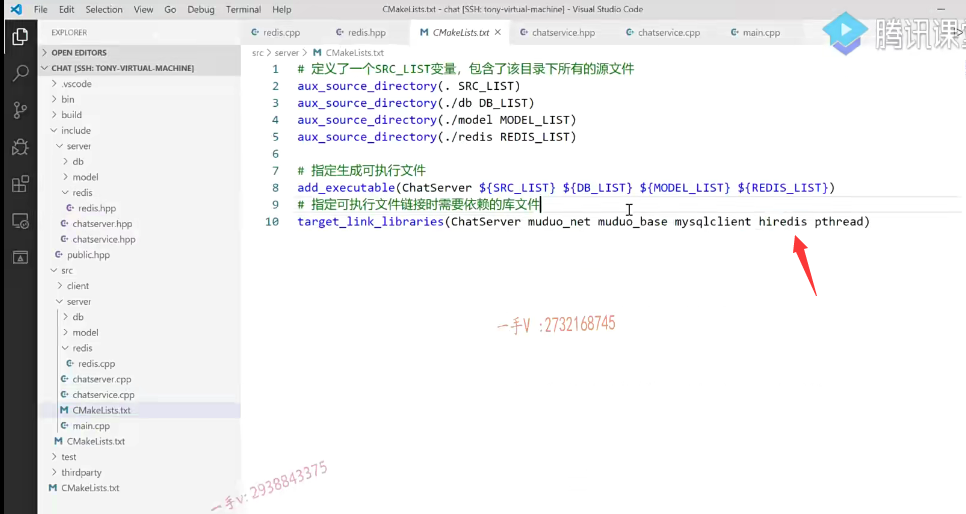

好吧啊注意呢，在最后这一步速度ld config，这就是我们安装新的so库。

但是呢，我们直接使用，却找不到它，

实际上呢，是在系统的缓存里边儿没有存储相应的我们新安装的so库的信息。

### 在系统的缓存里边儿存储相应的我们新安装的so库

如果出现了什么hiredis相关的so库找不着呢，

你在这里边儿把这个执行一下，我这里边儿写的很清楚，五步你就按这五步来就行了。

好吧啊。这个就是cm ake相关的构建。环编译环境的这个c make list里边涉及的一些修改啊。

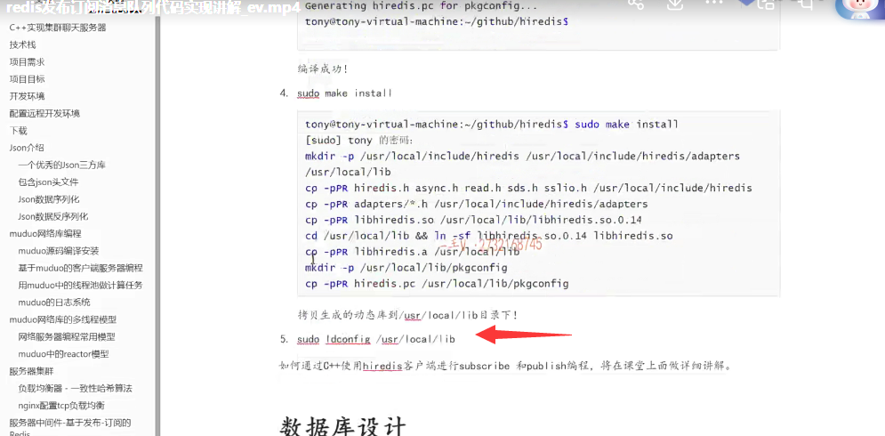

## redis.hpp的编写

### 包含头文件

在这儿，大家来看看要包含hiredis。斜杠hiredis点h。

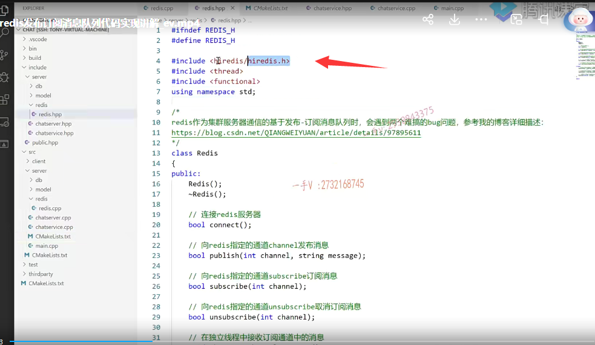

### 成员变量

这里边儿先看一下成员变量啊，

成员变量在这里边儿就定义了两个redis context，这是人家的这个提供的类啊。

context你把这个看作上下文啊，这个怎么理解呢？

### 上下文的概念 一个客户端相当于一个上下文

这个上下文意思就是相当于我们在这客户端。一个redis client。就是存储了这个redis连接相关的所有信息啊？

这已经表示一个上下文，这就表示一个上下文。

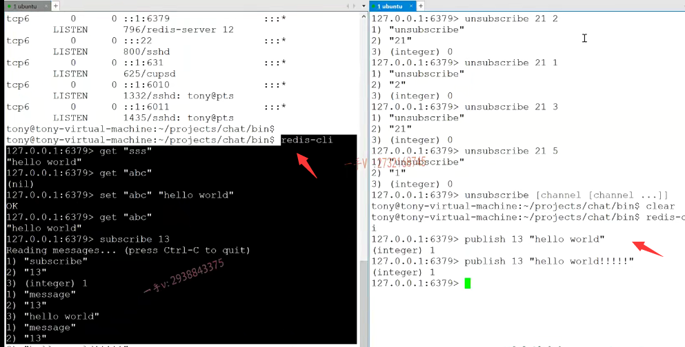

### 客户端为什么要写俩呢  因为subscribe会阻塞

这相当于是客户端，这相当于是客户端为什么要写俩呢啊？

各位，因为我们在命令上看的时候都知道了。

你一个上下文中，如果subscribe的话。这个上下文是不是就被阻塞住了？

所以呢，subscribe跟publish这两个命令啊，是不能够在一个上下文去处理的，

必须得有两个上下文好吧。

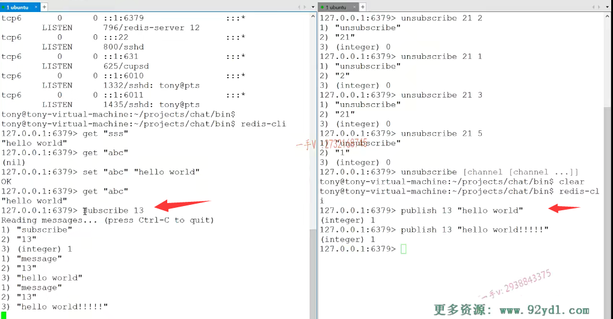

### redis写了一个博客

在这里边儿，有关redis的使用大家可能会碰到的坑呢，

我给大家呢啊写了一个博客对吧？

就是大家呢，在做项目过程中出现的问题啊。

你可以去浏览一下我这个博客链接地址呢，

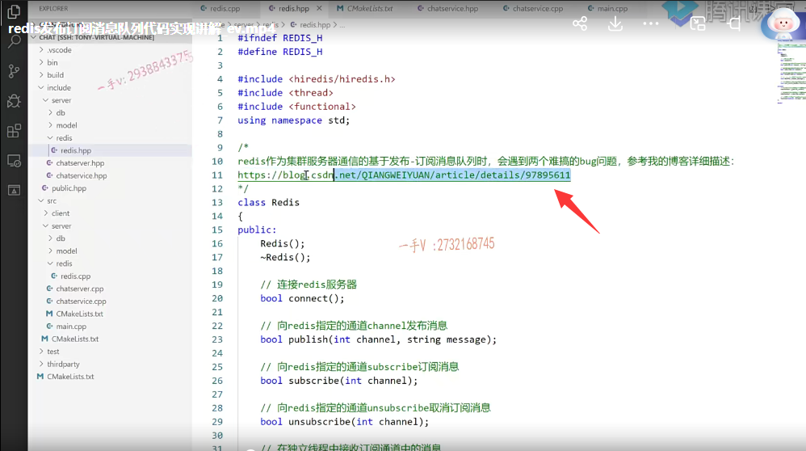

在这个地方给大家附着呢啊。

### 所以成员变量有2个上下文变量

这就是两个上下文，相当于就是两个连接啊，

为什么必须是两个呢，因为你要知道subscribe订阅消息后呢，当前的这个上下文就阻塞住了，是不是啊？

这个相当于就是发布消息就在一个上下文，订阅消息在另外一个上下文。好不好嗯？

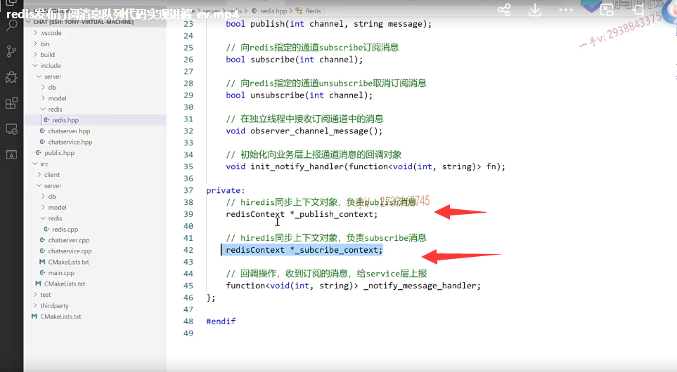

### 回调函数

OK，这是一个什么东西呢？这相当于就这个handler很明显，这是一个回调，对吧？

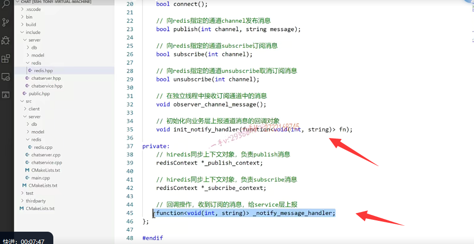

这个回调是干什么用的呢？那我们redis监测到相应的通道，有消息发生就会给chat server进行一个事件的通知啊？

那我要通知你，你先向我这里边儿注册一个事件嘛，我才能给你通知啊？

呃，这一点我们之前呢？或者说在我的C++高级课程观察者模式里边儿，我也给大家讲到了啊。

你要通知肯定首先得给我注册一个方法回调唉，

当这个你感兴趣的事件发生的话呢，我才可能给你通知消息嘛，是不是

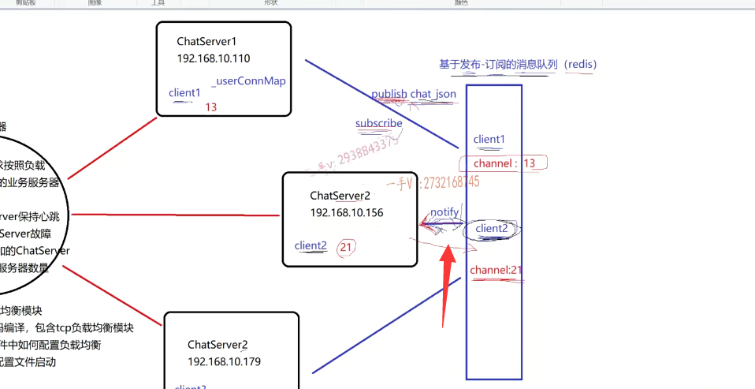

### 回调里的参数，主要就是通知， 包括通道号和字符串数据

这就是我们拿到的业务层的事件回调，

当消息通道上相应的消息发生的话，redis会给它进行上层的业务，进行一个数据上报的啊。

这两个参数分别指的是这儿，你看subscribe订阅的消息有发生的话，

一般上报都是三条消息，一个是message，这我们不管，第二个是通道号，第三个是数据。

我们主要在这里边儿上报的就是整形字符串，就是这里边儿的什么通道号儿，哪个通道儿发生数据了？

啊，数据是什么？对吧啊，就是这个，

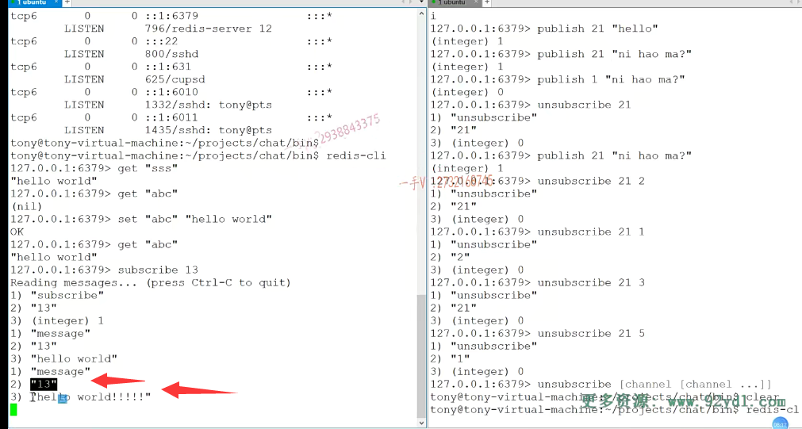

==我们还提供了一个in it notify handler就是设置这个回调的一个对外的一个公有的方法。==

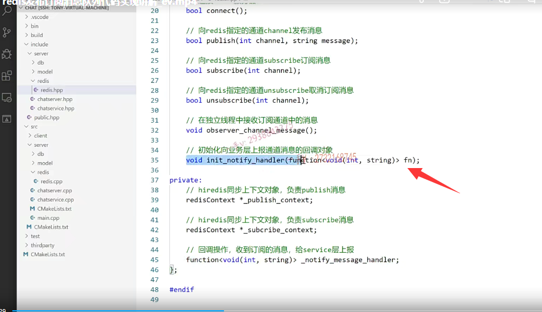

## 成员函数

### 构造析构

啊好，接下来该看一下这些，

这是构造析构做一些资源的初始化跟释放操作的，

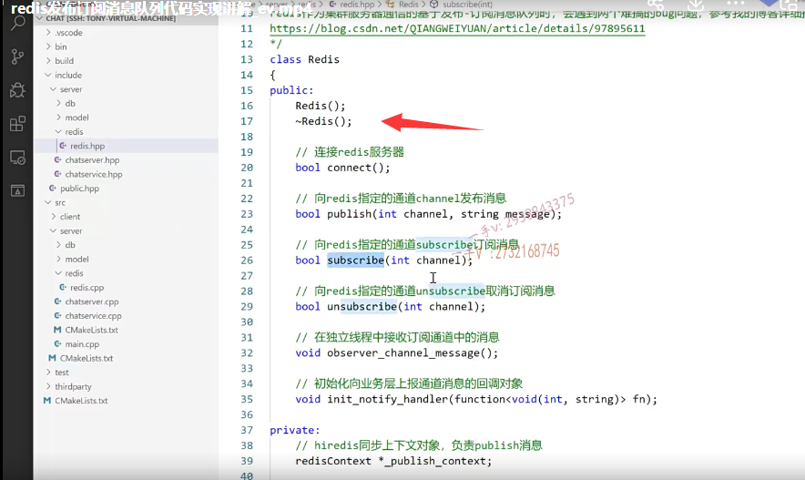

### 连接redis服务器

这是connect啊，这是干嘛呢？

### 发布消息

publish发布消息向这个通道发布什么消息？

### 订阅消息

subscribe这是干嘛呢？哎，订阅哪个通道？对哪个通道上的消息感兴趣？

### 取消订阅消息  防止订阅的通道数太多

这个是什么？这个是unsubscribe就是取消订阅。因为用户下线了嘛。是不是用户下线了，

你也就不用在通道里边儿再订阅他的消息了是吧啊？

因为别人也不会给再再给他发消息了。

啊，别人一看他的数据库的状态是offline，肯定给他发的是离线消息，直接传到数据库里边儿，是不是

你要不取消通道的话呢？好家伙，我这消息队列里边儿。通道订阅的通道数是不是越来越多？

这个只增不减啊啊，这肯定不行，是不是

设计上说不过去啊？

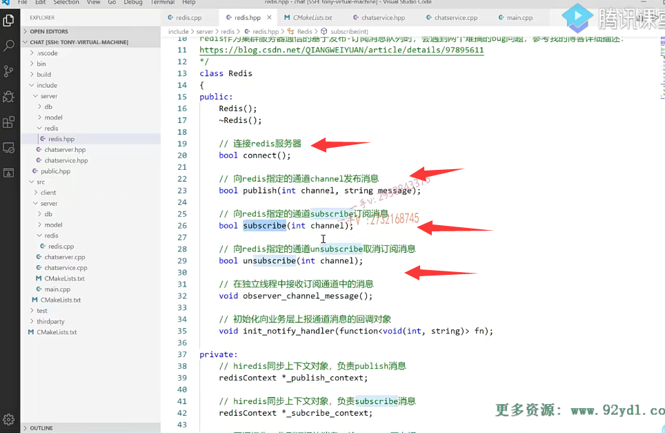

这个里边儿呢，就是专门来接收通道中的一个消息的啊。

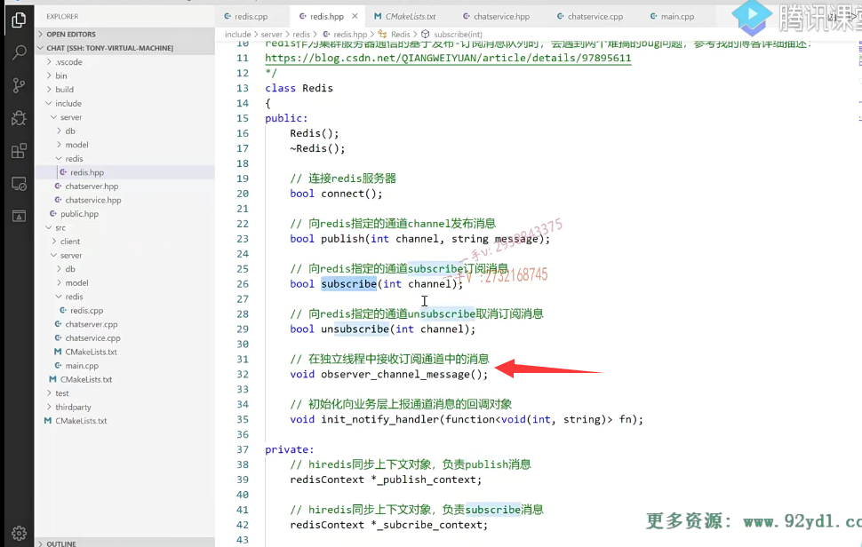

## 总结

==这个是向通道发布消息，这个是向redis上去订阅通道的啊，这个是取消订阅通道的。这个是专门响应通道上发生的这个消息的。==

这几个函数呢，大致就是这么一个意思，给大家去解释一下啊，

==三个成员变量这个是一个上下文专门用来发布消息的，==

==这个是一个注册订阅的上下文专门用来是订阅事件的，==

==这是一个事件回调。==

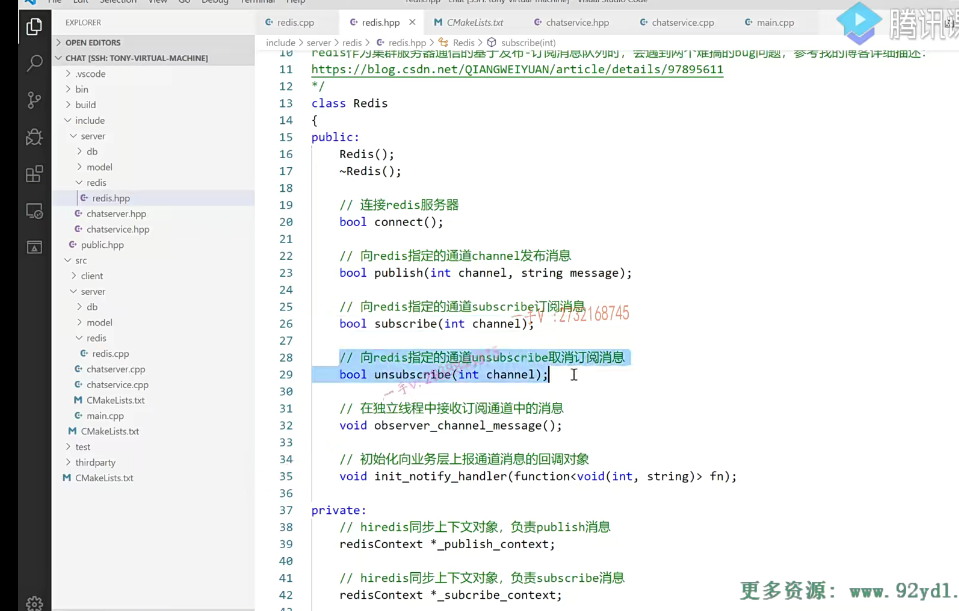

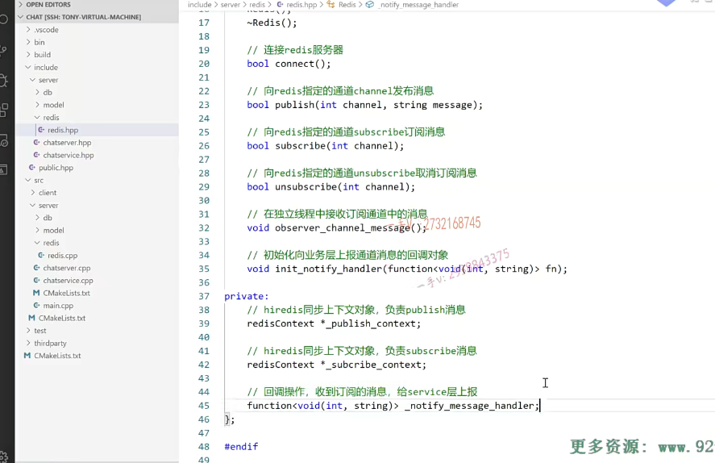

## 看原文件的实现

### 构造函数 和 析构函数

好吧啊，来看一下对应的这个cpp里边的一个实现构造函数呢，

这里边把两个成员变量就两个上下文指针是不是置了一个空啊？

啊，析构函数的时候，这个如果不为空的话redis要free一下，

这相当于把是这个上下文的这个资源呢？就给它释放掉了啊，

这儿理解一下就可以。

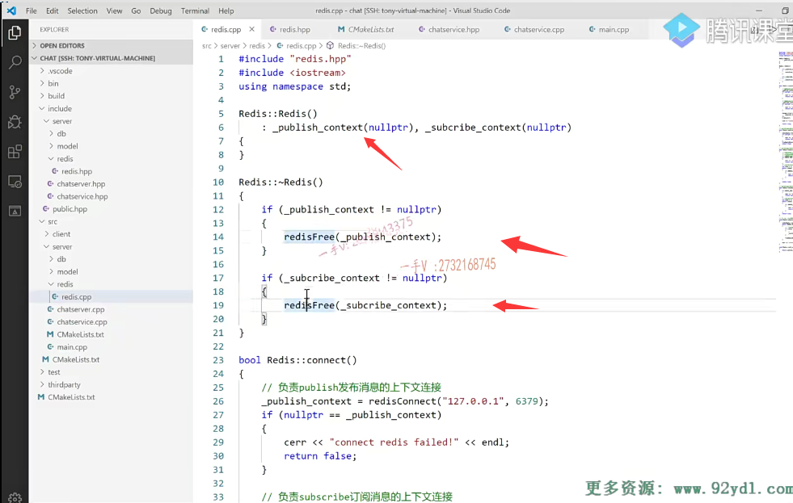

## connect函数 封装redisconnect

这里边的connect connect是不是就是你看相当于连接了，

==就是调用它的人家给提供的redisconnect？==

传了这个redis的IP地址跟端口号，

因为我就是在本地上运行的，端口号是六三七九。就连接上了

### 相当于创建了两个连接

==相当于创建了两个连接嘛，你这样认为一个上下文就是一个连接环境嘛，对不对啊？==

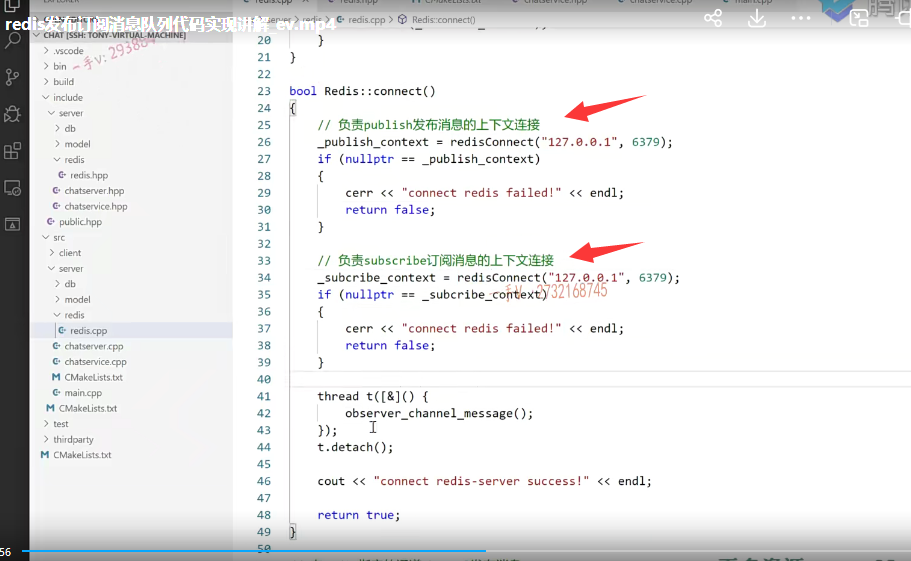

### 开一个单独线程来监听通道上是否有消息发生（subscribe）  以阻塞的方式

这个先不用看啊。这个在单独的线程中监听通道上的事件，有消息给业务层进行什么上报？对吧，

这是在单独的线程里边儿做的，为什么要在单独的线程做啊？

各位不是看了吗？subscribe它是一个什么东西啊？它是阻塞的嘛，是不是啊？

你不能说是我这个chat server 1发现13这个张三啊，用户登录上来了，我现在呢向这个消息队列里边订阅一下通道号是13，是不是发现订阅完了以后呢？这线程直接阻塞住了，

这也不行吧？订阅完了就完了，人家chat server 1还要做其他事情。

你不能一个订阅，把人家chat server 1上的一个线程就给霸占住了，对吧？

所以呢，这个connect全局，总共只connect一次嘛，是不是啊？

因为我们的这个chat service它本身也是一个单例的，对吧？所以只起了一个线程，

在这里边儿就是类似于专门以阻塞的方式等待这个通道上，相应的通道是否有事件发生，

发生的话，给业务层上报。

啊，这就完了。好了，

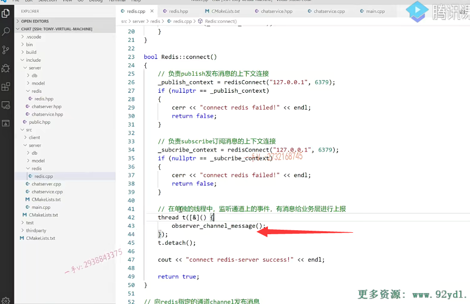

## pushlish 相当于在命令行敲命令

所谓的这个publish，你看publish这用它的redis command command命令,

相当于就是在这里边儿敲了一命令？敲命令publish给这个通道发送这个消息对吧？

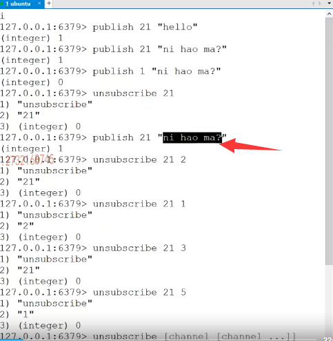

你看它的参数啊，有什么？它的参数两个，一个是通道号，一个是消息redis command，

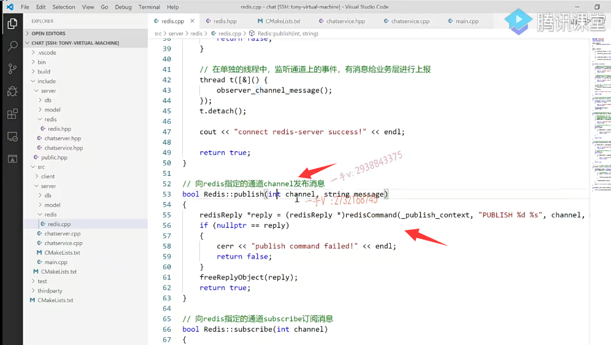

在这里边相当于就是publish，这是不是命令啊？

这中间一通道号，我们是ID嘛？整数这是消息。

这个我们参数传进来的这个channel跟这个message好吧啊publish通道号以及消息。

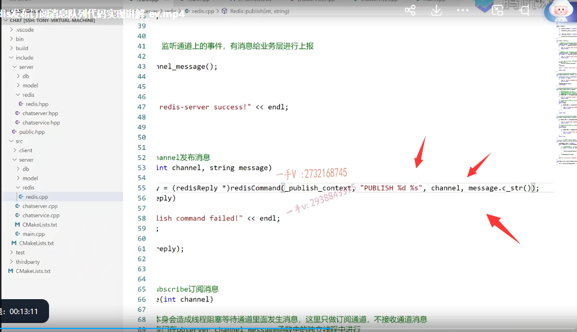

### 发送出去以后，记得释放redisreply * reply

这就把这个命令发送出去了。

==发送出去了，以后呢，你记住啊，它的返回值是以动态生成的结构体，==

用完以后呢，你把它给free释放掉好不好？

这相当于就是在发布消息。好不好的啊？

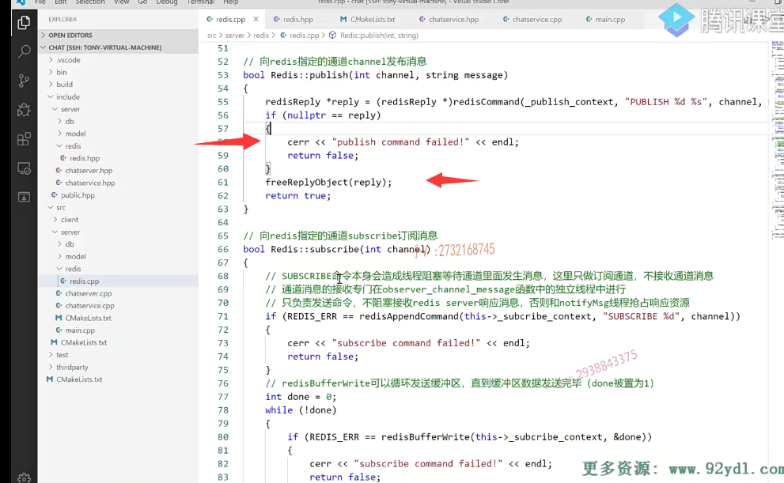

# 为什么我们底下的subscribe跟unsubscribe不像publish一样 直接发送命令实现

尤其是注意底下的subscribe跟unsubscribe啊，

有些同学呢，在这里边有疑问。哎，老师啊，你这里边publish都这么简单，发送一个命令，

你在这里边subscribe，这里边为什么不用这个redis command呢？对吧，

发一个命令就过去了嘛，这么简单，

为什么要还要调个redis append command，还有redis buffer，write？

是不是这两个函数都要这样做，

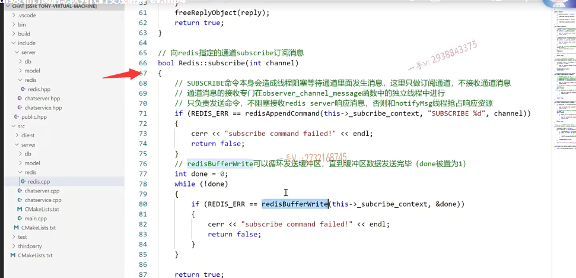

## 原因 

实际上呢，这就是使用同步发布订阅机制的这个一个问题所在啊，

大家可以看我这里边给大家列的这么一个博客啊。学习一下。

### rediscommand就是调用redis append command先把命令缓存到本地，然后再调用redisbufferwrite把命令发送到redis server,还会调用redisgetclient reply来以阻塞方式等待命令执行结果

这里边儿简单给大家解释一下，redis command本身做的事情是什么事情呢？

就是先把你要发送命令缓存到本地。

然后呢？就是这个实际上redis command调用的第一个函数就是redis append command，

就是先把这个命令缓存到本地，然后第二个就是redis buffer，write再把这个命令发送到redis server上，

然后它还会调用redis get plan reply啊来以阻塞的方式呢。来等待这个命令的执行结果，

### 但是subsribe命令本身就是阻塞的，我们不希望在这里就去阻塞等待通道发生的结果，只想在这里做订阅通道

但是很可惜subscribe这个命令是有响应，那必须是以阻塞的方式来等待我们说了啊，

我们服务器向redis里边订阅一个通道。你订阅一下就完了，你不能在这儿阻塞的去等待这个通道上发生消息。对上没有？一个chat server上才有几个线程嘛？四个线程，一个lOI线程，加上三个worker线程。是不是啊？

那也就是说你三个worker线程最多就是subscribe订阅三个通道，因为你每一次订阅一个通道就会阻塞住这个线程，就会阻塞住，这是肯定我们接受不了的嘛。

实际上，也就是说什么呀，在这里边儿，为什么我用redis command在publish context上直接可以发送呢？

那是因为publish这个命令啊，人家是一执行，马上就回复的。这个不会阻塞当前线程。好的吧啊，

### 所以我们不会像publish一样，去写命令，因为publish命令后会返回，所以即使它阻塞等待，也能很快得到

但是subscribe不可以？subscribe会阻塞当前线程的，

所以在这儿我们做的事情仅仅是把这个命令啊，这个组装好以后呢，写到缓存，

然后呢，再把这个命令从本地的缓存发送到redis server上。也就是只告诉redis server，

我要订阅这个通道，然后它就完了。

### 所以我们在这做的就是把这个命令组装好发给redisserver，而不需要等待响应，所以只调用append和write

因为这个不会去阻塞，等待redis server给我们的响应啊啊？

redis get.reply就是redis command就是这个函数，这个函数跟这个函数的调用，

它的意思就是把命令写到本地缓存，从本地缓存呢，把命令发送到redis server，再以阻塞的方式呢，等待远端的是不是响应啊？

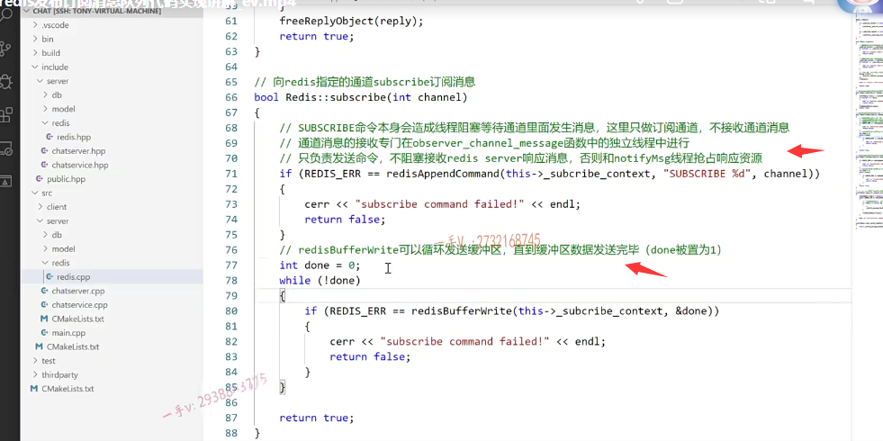

### unsubscribe也是一样

啊，但是subscribe很不好意思，这里边儿是阻塞的。对吧啊。

那么，注意on subscribe也是一样。

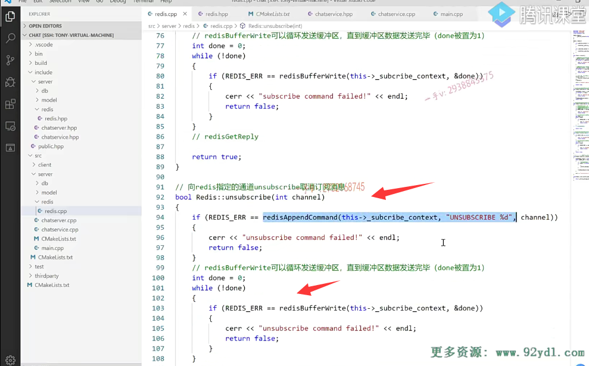

### connect时我们专门起了一个线程就是从subsribe上等待消息发生

都是在subscribe context上，我们不是说了吗？

我们专门起了一个线程嘛，你看在connect的时候connect成功，我们是不是专门起了一个线程在这里边做什么事情啊？

就是从subscribe context上，以循环阻塞的方式呢来等待这个上下文上啊，是否有消息发生？

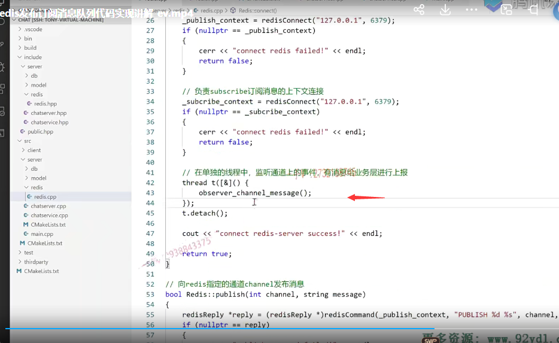

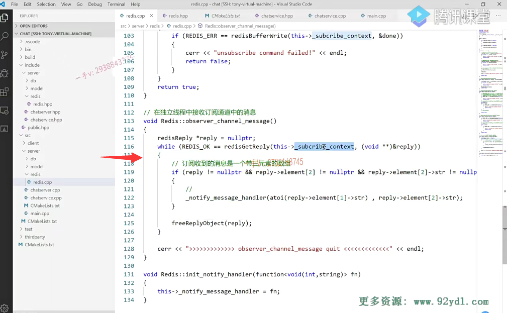

### 为什么是判断element 2呢 因为通道上有数据，会一次性返回三个数据，这里放在数组中，0 1 2

对吧，如果有的话，你看这里边element，

==为什么是判断element 2呢？==

因为通道上如果发生一个消息，它一次会返回三个数据。

它相当于写在了element这么一个数组里边儿下标，分别是零一二。对吧，

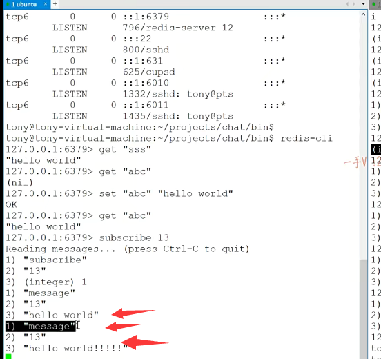

所以我这里边判断就是如果reply不为空reply 2不为空，而且reply的elements tr呢，不为空是不是？

那就说明呢，它真的是某一个通道有消息发生了，element 2就是hello world，

 element 1就是通道号。好吧，

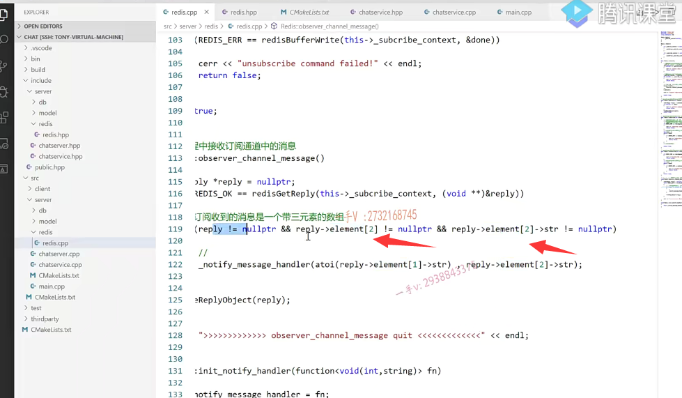

### 然后向业务层上报，数组1是通道号，2是消息

然后呢？有消息不为空，那就说明通道上发生是不是消息了啊？

这是给什么给业务层上报通道上发生的消息？notify message handler啊。

这个是一号通道号对吧啊？这是零嘛，这是一嘛，这是二嘛，对不对诶？这个一就是通道号，

二是什么呀？二就是通道上发生的这个数据，

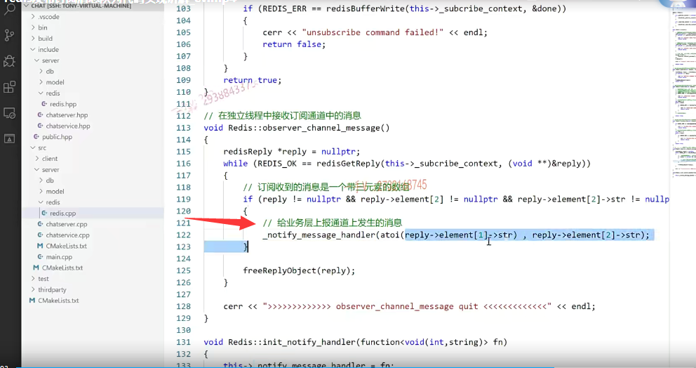

大家可以通过GDP打断点调试啊。然后呢？也可以通过打印，你在这里边看一看它发生了哪些消息？好不好啊？

### 最后画一下逻辑

那也就是说呢，在这儿啊，我最后再给大家画一下，

实际上呢redis封装这块代码主要就是提供了这几个方法connect。

connect后生成了两个，一个是pub context。一个是sub context.

我们publish专门在这个pub context上。做发布消息 某个通道的某个消息往这个ID这个通道上发布message消息。好的吧啊。

另外呢？就是subs crib subscribe ID.就是在这个sub context上呢去订阅通道是不是？

还有一个是事情啊是取消订阅。

因为订阅通道它是一个阻塞的，所以在这里边儿专门开启了一个线程。在这个线程里边儿，专门是redis get，reply 从这个订阅Channel的这个上下文里边儿专门去读取呢，以阻塞的方式。

循环阻塞不会结束，对吧？一直在那读取通道上可能感应到的消息，

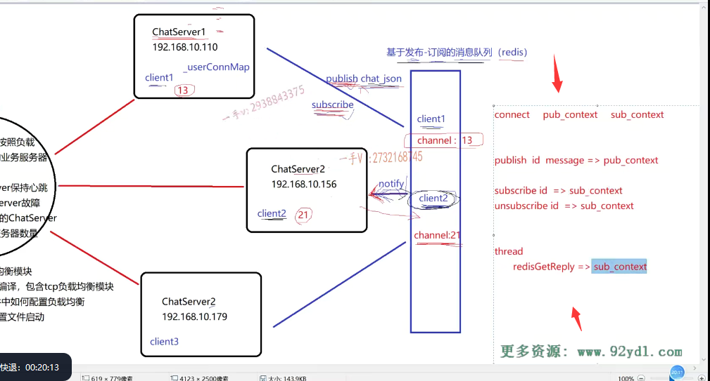

有感应到的消息呢，人家就会通过事先业务层向这个redis注册的这个回调处理啊，

调用一下这个回调。把发生消息的通道号以及通道上发生的消息是不是给业务层上报上去啊？

对，就是这个原理。

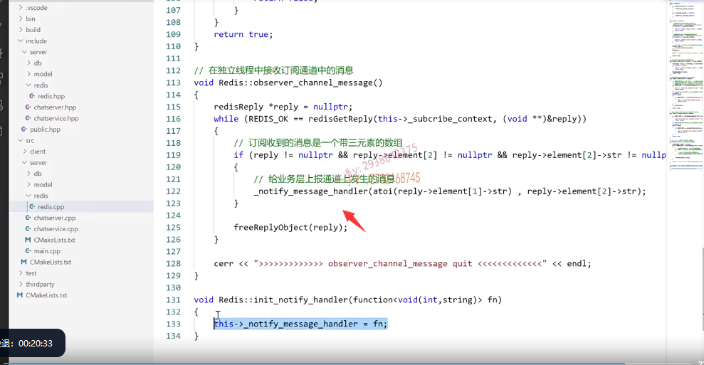

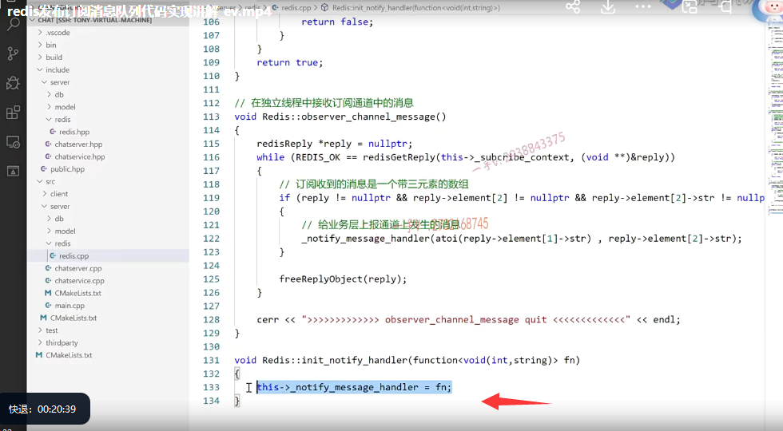

那这节课呢，我们主要是给大家分析了一下啊，我们在项目上集成的这个redis这里边儿主要的一个功能。

这个功能呢，是都已经封装好了，

大家实际上可以把这个代码保存下来，

如果你将来不管是什么项目要用到这个跟同步的redis相关的这么一个发布订阅，这么一个功能，

这个代码你是都可以用上。

它还支持异步的这个通道的这个订阅啊，发布消息。

那异步它是必须跟一个事件循环去绑定的啊LA bev lab event啊，

使用起来就比我们同步的呢。相对来说，要代码上要复杂一点啊，

这里边儿我们选择同步的就可以了。

## 总结

好吧啊。行，那这节课呢，

我们的主要目的就是为了结合着之前演示在命令行演示的这个效果啊，

给大家在代码上去讲述一下redis这里边儿提供的这几个功能。

这几个功能。这个还有一个调用回调操作啊，给业务层上报通道号加message，

你看就是实现了这几个功能connect。两个上下文publish。这是发布，这是订阅通道，取消订阅以及单独的线程来监听呢。通道里边儿发生的消息给业务层上报，主要就是完成这几个功能。

这几个功能呢？在我们这个集群的这个聊天业务环境中啊，一定要找准它应用的这么一个位置。

好吧啊，当然了，这就属于一些相对来说，比我们前面这个聊天更高级的一些应用啊，

大家在学习的时候有什么问题也欢迎大家，随时在QQ上进行一个咨询。