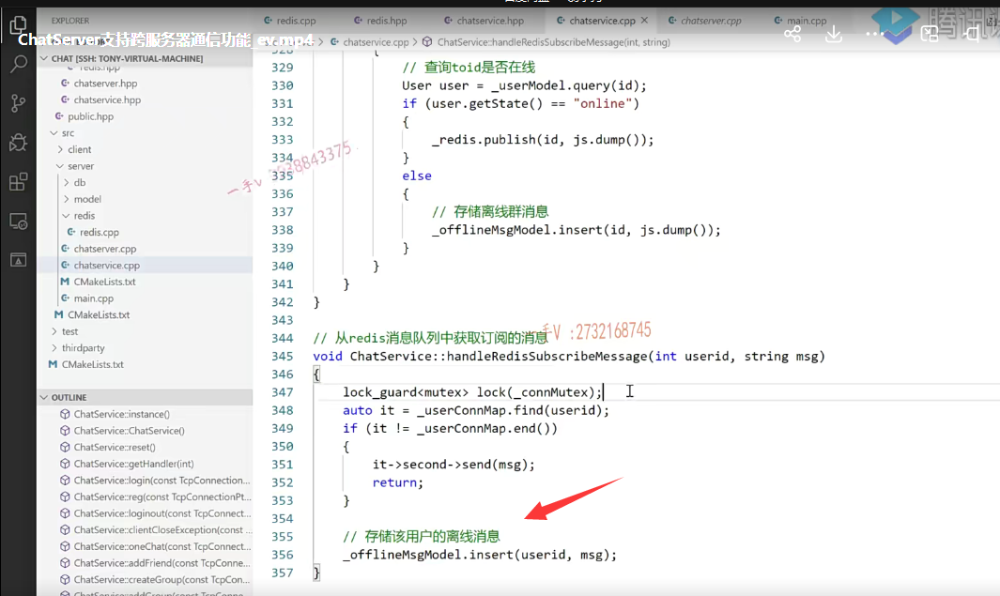
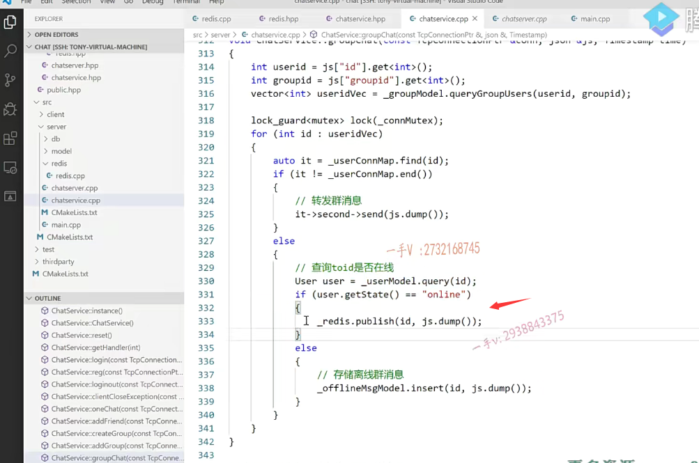

我们前边呢，给大家把这个redis相关的，这几个主要涉及的消息，

对基于消息队列的这个功能点给大家都已经列出来了。

相应的代码呢，也带着大家去分析理解了一下啊，

# 进行一个可以跨服务器的一个通信一对一聊天跟群聊

这节课呢，我们就来看把redis相应的功能添加到我们的这个chat service上让我们的这个服务器呢，

能够在这里边儿做像消息队列订阅通道发布消息对吧？以及接收从这个redis上给我们上报的这个消息进行一个可以跨服务器的一个通信一对一聊天跟群聊好吧啊，

### 包含头文件

那首先呢，大家在这里边看啊。

现在头文件当中chat service这里边呢，我们肯定是得先包含redis点hpp嘛。对不对啊？

包含这个头文件以后，然后呢？

在这里边定一个redis的对象。是不是唉，定义这么一个对象，

### 构造函数中去连接redis服务器

然后呢，在这个chat server点cpp就是服务实现这里边儿啊，

在其构造函数当中，大家来看啊。

在这儿呢，我们通过redisconnect先连接了redis服务器啊？

事先需要绑定回调，帮助redis监听到时间后，就回调给我们

连接服务器连接成功以后，我们说了啊，

在这儿我们必须预设一个回调，因为到时候redis底层会给我们去监听这个通道上的消息给我们上报嘛，

那他怎么上报，必须我们事先去给他注册一个回调啊？

在这里边，通过绑定器啊，我们就实现了绑定了这个服务里边这个方法，把这次对象绑定上去，预留了两个参数，

为什么预留两个参数？因为人家的这个方法是需要接受两个参数，

到时候人家也给我们上报两个参数啊，

第一个参数就是通道号，发生消息的通道号，

第二个就是发在这个通道里边儿发生的这个消息啊对。

这个呢，预知这个回调，添加的代码非常少啊，

就是这一块儿。将连接readis server设置一个上报通道消息的一个回调方法。是不是啊？

来看一下啊。

## 登录成功后，就需要去订阅通道

当你登录成功以后，各位在这里边要干什么事情啊？ID用户登录成功后啊。

这个向redis这个订阅。channel 就是这个ID。是不是啊？

我对这个ID的通道的事件都兴趣。

啊，因为别的服务器上有可能给我这台服务器上的这个ID用户是不是发送消息呀？

呃，当然，大家发送消息不是说是直接你给我，我给你对吧？这样设计不好，

大家都是往消息队列里边扔的。是不是啊？

既然人家这个ID的用户登录在我这一台服务器上了，我就需要在这个消息队列里边儿去注册一下以ID命名的这个通道是不是啊？

哦，这就添加这一句就完了，是不是很简单啊啊？很简单，其他的代码根本不用变啊。

## 注销业务 redis取消订阅

然后另外呢，你看这是上限下线呢，下线的话在这里边就是这个logo out呀？

log out就是注销。注销的话，相当于这个人呢就不在线了，

在这里边，我们做的事情是把它从本地的connection map里边删掉以后呢？

因为它之前它能下线，它能注销，是因为之前登录成功了，

登录成功，我们肯定是不是向消息队列注册过，以它ID命名的通道了？

那在这里边取消一下这个通道。

好吧，这是正常的，这个注销啊，

## 客户异常退出，redis取消订阅

在这里边儿是一个异常的退出，就客户端因为是一个基于控制台程序的，没有图形界面对吧？

ctrl c直接退出了啊。

在这呢，查询到相应断开连接的connection呃，connection对应的键就是它的这个用户的这个ID号了，

同样取消一下，sub unsubscribe取消一下你这个用户ID命名的一个通道。

这就是发布以及订阅相关的好吧啊，

# 一对一聊天

## 先查发 给谁toid,找本地的connmap 找到说明在一台机子上

先来看一对一聊天，一对一聊天是什么意思呀？

原来首先呢，从json里边儿取得to ID。是不是啊？

取到to ID以后呢？在我当前这个chat server先查查有没有该用户的connection map呢？有的话直接转发，

那这个就说明啊，我的说话的人a 跟b 把话说给了对方的b    

ab这两个用户呢，是在同一台机器上注册的，直接从这儿转发消息就走人了。

## 没找到，有两种可能性，一种是b在别的机上，二是b不在线

那如果没找着，a给b说话，

拿b的ID没找着b在当前这个主机的connection map

有可能存在两种情况，要么是b在其他。主机上登录着呢，

要么就是b根本没在线，对吧？

### 为了区分2种情况，就去查数据库 b的状态，如果是在线就在其他服务器登录了

所以呢，为了区分这两种情况呢，直接拿b的ID。查了一下诶，一看呢。

虽然没在我这一台机子上，但是人家的状态是个online，说明人家在线呢，

在线的话，那就说明了没跟a在一台电脑上登录啊。

所以呢，如果user state是一个online，这里边直接呢？

把这个所要发布的消息，直接发布到redis的哪个通道上了？唉，以b用户ID命名的一个通道上。

那这样一来，原来注原来已被用户ID注册过的那个通道上是不就有事件发生了？哎，就会给业务层上报了。

明白了吧啊。

### 如果它不在线，就是写一个离线消息

如果说没在我这一台主机状态，还是个offline，那么就是它不在线，直接写一个什么离线消息就可以了。

OK吧，

# 群聊机制 处理

然后 这块儿是group chat，同样啊，

group chat都要给群组里边儿的用户发消息。

一看呢，你这个用户没有在当前的这台电脑上，因为没找见你的connection嘛，

但是一查却发现你是online的，

那你就是在其他电脑上的。其他的chat server上，

用你的ID直接作为通道号啊，在你这个通道上发布一个消息。

我只管发布消息就行了，你所在的主机就能收着这个订阅的这个消息啊？

那否则的话呢，你没在当前电脑上找着你的状态，也是offline，

那你就是离线的，我直接存储你该用户的离线信息就可以了。

OK吧，那也就是说呢，非常简单，一对一聊跟群聊，只需要在这里边儿外加一个状态的判断，

并不是说不在当前主机，当前主机没有这个用户的connection，它就一定是不在线的。

它有可能呢，在其他的是不是主机上啊？

通过查询这个用户的这query，我们之前都写过了啊，通过查询这个用户的state信息就知道 它是什么样子的呢？

one chat跟group chat呢？都是这个样子的，

大家在这看这个逻辑非常的简单啊。

## redis会监听消息，帮我们回调,来转发消息到目的服务器

### 消息里的通道号这里就代表用户id

然后呢就是统一的。这个就是我们的这个redis会帮我们调用的这个函数啊，

因为这就是我们事先预制的回调嘛。handle redis subscript message是不是啊？

它给我上报了两个参数，一个就是通道号，通道号就是我们对应的用户ID一个是消息。是不是啊那？

### 得到userid就能找到conn，然后redis就可以帮我们转发

这个ID这个消息呢，就被转发到这个用户所在的这一台主机来了。对不对诶？

所在的这一台主机来了。然后呢，在这儿大家看啊。

先从这个message干嘛呢？啊，实际上呢，这里边儿都不需要做这个序列化跟反序列化啊。

那那这一台这个机器接收到user ID的通道消息的话，那在这里边儿肯定是能找着这个用户的connection的，是不是

找着以后把这个消息呢就？发送过去就行了，

### 可以将这里的序列化删除，我们直接把消息转发出去就行

在这呢，实际上我们不用做这一步，反序列化啊，

直接把这个message呢。发送过去就可以了。

好的吧啊，直接把这个message发送过去就可以了。

那也有可能存在什么样情况啊？

就是呃，刚才你看啊，张三给高阳说话的时候呢呃，张三发现高阳没在这一台主机上，

但是高阳的状态是online的，

所以他把这个通道的消息呢。呃，就是把这个要聊天的消息发布给高阳，是不是这个通道上了？

唉，然后呢redis发现这一台主机所感兴趣的高阳这个通道上有消息发生，

通过这个回调呢，把这个通道号以及消息呢，就高阳这个通道号以及高阳的，这给高阳说话的这个消息是不是就上报上来了，

## 可能存在从通道中取消息的过程中，高阳下线了，那么就存储其离线消息

那在这上报的过程中，我说高阳下线了。是不是啊？

所以有也有可能说是在这儿呢。从通道里边儿拿到消息以后呢，却发现呢，在这一台主机上，这个user ID呢并没有它的connection，

那就是说呢。就是在这个通道消息给通道里边儿发布消息，以及从通道里边儿取消息的过程中，高洋给下线了。对吧啊，

在这里边，我们把这个从考虑上，也就是说呢，接触到该用户远程发过来的消息以后呢，

却发现呢，该用户在这一台指数上却并没有connection map，那就是说他刚刚下线了。

下线的话，那你就存储它的这么一个离线消息就可以了。

没有问题吧啊，这个实现是非常简单，

你看我们前后增加的代码不超过20行不超过20行，总共加起来。

就是在业务层上需要添加的代码，就可以让我们这个channel server支持了集群跨服务器的通信，

### 这样写的代码量很少，并且避免强耦合

如果是原来的服务器两两进行硬连接。

那么，你觉得20行代码能搞定这样的功能吗？肯定是搞不定的。是不是啊？

你就是把redis增加的代码合起来。它的代码量也是远远少于你这样的设计所产生的，这个代码量的啊，

而且呢，各个服务器之间强依赖。啊，这个非常不健壮啊，非常不健壮，

运行起来肯定是有各种各样的，这个异常未出现啊，非常不稳定，对吧？

好希望大家呢，结合着这里边呢呃，再去好好的去理解一下啊，理解一下。

结合着这张图。

### 回调是由redis来调用的

handle这个redis subscribe message就是由谁来调用的呀，由redis调用的给我们上报了发生消息的通道号就是用户ID以及message。

谁能收到这个消息啊？这个用户在哪台服务器登录了？服务器就会收到这个消息。

为什么？因为你登录这一台服务器，服务器是不是才会向redis里边注册，你用你的ID号是不是注册一个？这个通道啊啊，你cloud 1登的是chat server 1，chat server 2，肯定不会像redis里边注册一个1 client 1的ID为名字的一个通道的。是不是啊？

所以呢，你看啊，我再给大家阐述一下，

首先在构造函数里边儿要连接redis服务器，连接成功以后呢，给它注册一个回调。

啊，注册回调的这个意义所在就是redis发现有通道，通道上有消息发生了，它就会给相应的服务器呢进行一个上报啊。

然后呢，就是在login login呢，注册成功。

像订阅通道 用户的ID啊。

log out注销，取消订阅通道，

异常退出，取消订阅通道，该用户的通道是吧？

one chat，也就是说在这里边儿，用户不在本机，但是用户状态确实在线，肯定是在其他主机上。

向这个对端的用户ID命名的这个通道发送这个消息OK吧？

这个group chat同样就是这个用户，当虽然没有在当前主机，

但是呢，状态却是online在其他主机。直接呢以对端用户的这个ID啊，作为通道号发布一个消息。

最后呢？这个redis给我们把发生了消息的通道啊，就给我们上报上来了，通道号以及发生了消息，对吧？

那在这里边肯定就是。你这个ID肯定就是在我当前主机上了嘛，对不对啊？

做一个相应的处理，转发给客户端。

或者说是在数据从redis通道往业务层上报的过程中，你用户下线了。在我这里边儿没有找着你，

相应的是不是connection啊？

那我就判定你下线了，写离线消息就可以了。

OK那么非常简单啊，

以redis的这个客户端编程非常简单的，就让我们实际上让我们不仅仅是聊天服务器，

任何基于长连接的服务器，想在集群环中环境中进行跨服务器通。都是这样的一个解决方案，非常的清亮啊。

## 编译代码

好，那说到这我们来。最后来编译一下代码来进行一个功能上的一个测试啊。

### linux下cmake编译

好呃，这里边我再说一下啊，大家也可以在我们的什么上啊？

在我们的这个linux上，你进入build这个文件夹下啊。

就是你没有VS code，你要在这里边儿进行编译，非常简单，

在build下呢，我们之前讲过对吧cmake构建编译环境cmake点儿点儿。

它在这里边儿。就生成makefile，

你再make一下。

你在这儿编译也可以的。

这个cm ake编译还是比较方便的，自动解决依赖会给我们上报编译的进度，

有编译错误的话呢？人家当然也会进行一个实时的显示啊，

这个build这个chat client跟chat server就都编译出来了。

### 启动服务器 6000 6002

回到我们的这个bin目录里边儿啊，

在这儿呢，我们把两个服务器先运行一下。

一这是二这是监听在6000端口，这是6002端口，

我们的负载均衡器nginx是工作在8000端口的是不是？

### 启动客户端

现在我们起客户端。现在我们启下客户端啊。

嗯，看看之前的之前的命令，在这是连接是不是8000端口啊？

这个呢，我们找一找，这也是连接8000端口。

### 轮询分配服务器

大家来看是不是给每一个服务器，分别是轮训嘛，因为它们的权重比是一样的，都是一，是不是给每一台服务器呢，都分配了一个用户。

啊，这块儿我进行一个登录幺三一二三四五六，登录成功一二幺一二三四五六，登录成功。

在这地方看看chat啊，这是幺三。hello。

能够收到吧，

这现在是登录在两台不同的服务器上的人进行一个跨服务器的通信，

你看启动的时候这里边我们有打印connect ready server success。好不好啊？

我们在publish跟subscribe就是发布订阅里边儿没有加任何的打印信息，

如果你喜欢的话，你加一下，你可以跟一下它的这个发布消息，订阅消息的这么一个过程。okay吧啊。

嗯，再来看一下，回一个消息啊，这是21。你好消息能过来，对不对？

### 群聊消息测试

group chat。一他们在一号群里边。

群消息也能收着吧？group chat 1。这些消息是不是都能收到啊？

==这跟之前的表象虽然是一样，但是实际上大家知道你现在服务器已经是集群起来好几台服务器。==

==不管用户注册在哪一台服务器上，是不是在一台服务器上，他们的聊天儿业务都是没有任何问题的。==

对于客户端来说，它不用感知我们服务器呢是。是一台还是多台？到底是哪一台？给他提供服务的。

好的吧啊，怎么解决的呢？

我们就是引入了redis基于发布订阅的消息队列这么一个功能，这是来自于redis。

大家主要要搞清楚这个业务的应用场景，我们为什么要这样做啊？

如果这样做的话，到底都要实现哪些东西？

okay吧啊。那到这儿的话呢，我们整个儿想要介绍给大家做的这个聊天儿集群的聊天儿服务器项目的这个代码呢，功能也就都实现完了。

好吧啊呃，希望呢，大家在这里边呢，能够通过啊，接触这个项目。

学一学我们的这个高性能服务器开发，包括呢软件设计啊，业务这个开发对不对？

尤其是网络模块儿。

业务模块儿跟这个数据模块儿怎么去抽象？它怎么去解偶？它们之间的关系啊，

再者呢，就是熟悉第二点就是nginx提供的这种基于TCP的负载均衡功能好吧呃，就是图上给大家画的啊。

以及负载均衡，以后集群以后服务器呢？

服务器内部通信肯定是没有问题的，服务器跨服务器的用户要进行通信的话，这个我们该怎么办？

好吧啊，这就是我们这节课的一个给大家说的解决方案啊，我们在功能上也进行了一个验证。

呃，希望呢大家啊，先了解好这个项目所涉及的东西，开发的这个代码。

然后呢，有时间把这个代码呢上的内容好好的再去深入的去理解一下。

如果你还有时间，可以把这些相关的一些业务啊，开发的更完全一点好吧啊，

再者呢？最后再给大家强调一点就是。如果再聊到负载均衡呃，负载均衡里边有一个非常著名的算法叫一致性哈希算法。

### 一致性哈希算法

==当然，一致性哈希算法呢，只是一个负载算法而已啊，==

==它主要是用在这个短连接服务器上，对于我们这个聊天服务器是长连接服务器呢。它用不上啊，它用不上，==

==用它体现不出来它的好处啊，虽然它也能负载。==

okay吧啊，这个是希望大家要是有能力啊，可以去看一看。

好吧，在这里边就不做强制要求了啊，

你主要在这里边能够给我把nginx的这种什么？你就说我n这这里边配置的这个负载呢，用的是按权重配比的，一比一就是轮询。一二那就是三条请求，一条分发给服务器，

一两条请求分发给服务器，二对不对？

唉，把这里边儿配置相关的信息说明白。就足够了。好吧啊，就足够了行，

那么最后再给大家说啊，你在学习的过程中不要光看，要多动动手，有任何问题随时欢迎大家在QQ上向我进行一个咨询。