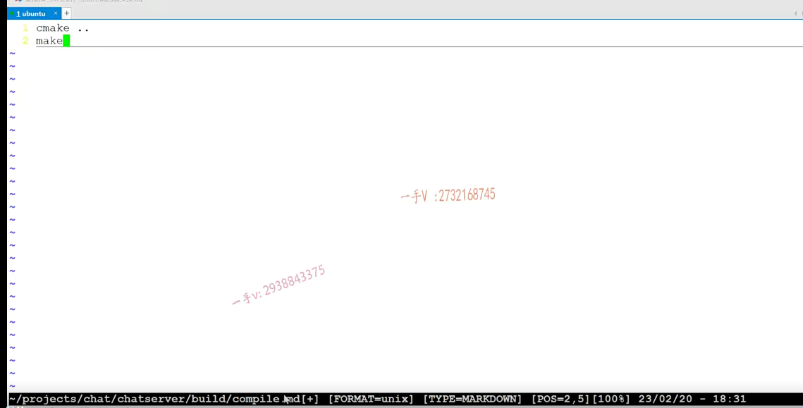

最后一节呢，我们把我们写好的，这个可以基于nginx TCP负载均衡工作于这个集群服务器环境中的这个chatserver，整个的这个项目代码呢，我们就推到github上啊。

那么github上呢，一个好处就是呢，大家在呃，既然决心从事于研发或者是研发测试的工作，对吧啊？

你写过的啊，随着你的这个积累你写过的东西呢，都最好放到你的这个github上啊啊，做一个积累对不对？

你也可以看到呢，你不断的这么一个进步啊。呃，另外呢就是可以分享别人，

然后可以帮助你去提高你的各方面能力，更重要的是对大家现在来说呢？

让你分享到github上，你可以把你这个项目的地址呢，直接附在你的简历上，

现在百分之九十八九十九的同学呢，简历上的项目经验虽然写，但是虽然写了那么多文字，但是到底是不是你写的？

写的到底怎么样？面试官根本无法很直观的看出来，对吧？

能进入那些一一流的大厂。对吧啊，都是那些非常有特点的，或者说是特点不足人家特别会描述的特别会表述，特别会沟通的，是不是那些人啊？

那首先呢，我们第一关呢，去进行简历筛选的时候对吧？

我们尽可能的去充分说明我们简历上东西确实是我们做过的，而且确实是有价值的。

对于项目这一块儿，我可以把项目的github地址呢，我直接附在我的这个项目的描述里边是不是啊？

项目链接地址写好了，它可以看看了，我们上面怎么去构建整个集成编译环境的，怎么去部署这个？

头文件原文件的对不对啊？

这是呢。对，就是我们整个的这个能力，一个很好的反馈啊，

好这个优点就不多说了啊，这是非常有必要去做的一件事情啊，

大家呢，打开你的github啊。呃，这个是肯定要创建一个新的，是不是代码仓库啊？

嗯。大家在这里边。稍等一下啊。

这个github在这里边，我网络访问的稍微有一点慢。

okay，好了，在这里边我们给它起一个名字就是chat server对吧啊？聊天服务器代码就是chatserver呃，就是可以啊。

可以工作在nginx TCP负载均衡环境中的集群聊天服务器和客户端源码啊，这个基于muduo库实现啊，

还用到了redis   

okay，这还用到了mysql对吧啊？你想写你可以描述一下啊。

然后呢？initialize this repository with readme。create一下这个repository，创建一下这仓库。

### 创建好仓库后，拿到仓库的地址

创建好这个仓库以后呢？我们这个你看，这就是我们的master分支了，

我们在这儿呢，拿一下我们的这个仓库的这个地址啊，复制一下，一般呢，我们做项目都是这个样子啊，

## 将代码推到github上

然后在这呢，你看这是我们的。工程代码对吧啊？我们想把这个推上去，

推上去的话，这些东西就是这个编译的这个就放到这儿吧，

### 编译出来的中间文件清除掉

把编译的中间文件啊，我们就都先清理掉这些东西呢，比较大，不需要传上去，

谁拉代码呢？谁自己去编译一下就行了，

在read me文件当中，我们给人家介绍一下我们这个项目的这个大概的一个布局对吧啊，

以及编译的这个过程啊，怎么运行？

### git 操作

然后呢？在这里边你看啊，

我首先呢先这个clone一下。git的这个技能跟这个cmake的这个技能啊啊，应该是大家进入公司以后呢，必备的一个技能

git相关的操作，我已经给大家更新视频了，后边儿我有机会呢，再给大家系统的更新一下cmake相关的一些视频啊。

大家在这里边看一下啊，这个就更新下来了，是不是更新下来了以后呢？

在这儿我们看看啊，是哪个呢？就是这个chats ever。对不对

chat server。就是这个这就是我们更新的文件夹，

==里边儿有一个隐藏的点儿git呃，相当于就是我们的一个本地仓库啊，本地仓库,远程仓库主干分支开发分支分支合并这些概念呢在.git里边儿都是比较重要的啊。==

### 移进去 chatserver

OK，那在这里边啊？嗯，大家现在来看一看啊，

我现在就是把这些东西呢都给它移进去啊chat。

这个要移进去，对不对？还有哪个呀？还有这个built。这个要移进去。还有什么？还有这个include。你给它放进去对吧啊？还有什么呢？还有这个src啊，这包括一些测试代码啊，这test将是当时最开始给大家讲一些。cm ake的使用啊，json的使用啊，muduo库的使用给大家讲这些东西了，对不对啊？third放进去。啊，当然还有这个c make list，是不是也得放进去啊？

### github中如果是空文件夹推不上，写一份.md文件

我们进入这个cat server。

okay吧啊。这里边呢，如果是空文件夹的话，是推不上去的。

所以在这里边build，我们现在没有东西，对吧啊？

在这呢，随便写一个东西吧touch呃。这个相当于是一个什么文件呢？

写一个date.写一个随便创建一个什么test啊，一点test。

嗯。写一个也写一个read吧啊compile pile compile。compile md.好不好啊？

你在这里边可以。去写一写啊。写什么呢？在这里边执行cm ake点点对吧啊，

然后再执行这个make。没问题吧啊，在执行这个make就可以编译出来了，是不是啊？

就写个东西，要不然空文件夹是推不到git上的啊，

然后呢，我们看一下这个git status。

这些东西呢，都需要推先添加到这个暂存区，先把它提交到本地仓库来。这个是第一次啊，

这个提交项目所有代码，这是一说明啊。

okay，提交上来了，以后呢，

把它push到远程的master主干分支上。这是项目的所有的这个原文件好吧啊。

OK，这个就推上来了。

推上来我们看一看啊。这个就有了，是不是啊？

### 写一下readme文件

在这个read me这里边，我们写一下吧啊，我们给人家写一下。

edit this file.

### 写一下编译脚本

然后呢，这个编译这个。编译方式是不是啊？

CD build里边，

然后呢？先执行一个。清理对吧，

然后在cm ake星星 生成makefile再make。

OK，这就完了好吧，

==实际上你可以写一个这个编译脚本啊，直接把它放到一个shell脚本里边嗯，没有问题的。==

完了以后呢，就是运行。这个是需要这个nginx的TCP负载均衡对不对？

你可以把这些相关的都写一下OK吧啊，尽你的能力写嘛，

因为大家作为校招，你将来把这个项目的这个链接附到你简附到你这个简历上项目的这个后边儿的话呢，

人家在登上来看哎，看你这儿写的比较详细也是挺好的，

一般这块儿写的话呢，主要是干什么事情的啊？主要就是说把这个编译方式以及你这个项目大概是做什么事情的？我没保存啊，我就不保存了，

我这块儿网络稍微有点儿慢的很，

然后就是各个文件夹，你介绍一下它该包含了什么样的东西？

你要配置呢nginx的负载均衡呃，

你还要配置 启动red is服务，启动mysql circle是不是这些都是需要的？

### 部署流程

OK吧啊行，那我们把这个就部署上去了啊，

最后呢，再给大家演示一下，你可以给人家去截个图啊，

那个啥的是不是都行啊？

这个就是编译啊。这是我们项目的整个的编译，这是生成了chat server，

现在它又开始生成chat client了，然后回去在这个bin目录就是我们的可执行文件。

啊，我们整个的项目的。编译就是这么一这么一个。方式OK吧啊，

就是这么一个方式。

### 写一个一键编译的一个脚本autobuild.sh

如果你想来的这个更方便一点啊，来我们在这儿直接就给大家说了吧，

我们一起来写一个一键编译的一个脚本啊。

好，大家来看。这个应该是非常简单的。来看一下啊，

我们在这个目录里边创建一个auto build脚本文件啊，

这个这句话你得先写嘛，是不是？

然后是先是把build里边的是不是东西删除掉啊？

哎，当前目录。各位a sorry啊gw d啊，当前命当前路径下的什么什么路径啊？built下的这个星号。全部删除，

就是把build目录旧旧文件全部旧的这个编译中间文件全部删除，是不是删除了以后呢？

然后重新啊？进我这个目录build先进入这个build，这个目录OK吧，然后再执行cm ake点点非常简单啊，

然后再执行这个make。

### 给我们auto built sh赋予可执行的权限 然后执行

那是不是就行了啊？okay，

==然后在这呢？给我们auto built sh赋予可执行的权限，==

然后呢？auto built。

大家来看一下。这整个是不是就是一项自动的就给我们编译完成了，

哎，在这个bin目录下就有这个了？

好。把这个呢，我们给他推过去啊。

主要是把这个推上去好了吧啊，把这个推上去git add这个凹凸。build sh.嗯哦，

那要出来呢啊？git add auto build sh come made。杠m添加这个自动添加自动编译脚本。

脚本好嘞git push origin master。

好，这个就添加完了是吧啊？

我们来去看一看啊。到我们刚才的这个chat server上。这个auto build点sh就已经添加到这里边了，直接执行这个脚本了。

就一键编译了好吧嗯，行，那这节课的主要内容就给大家说到这里。

